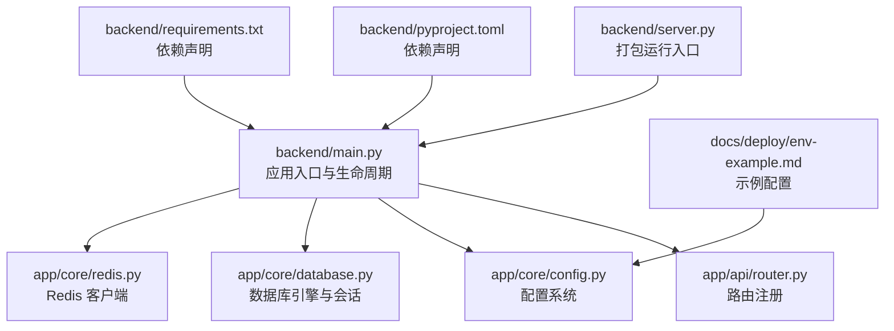
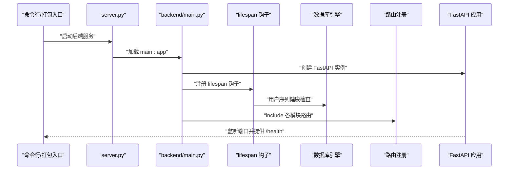
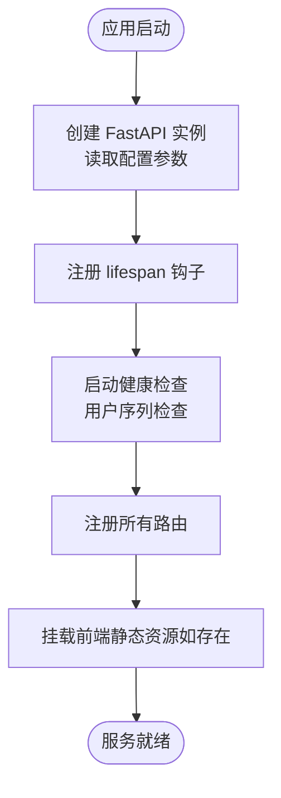
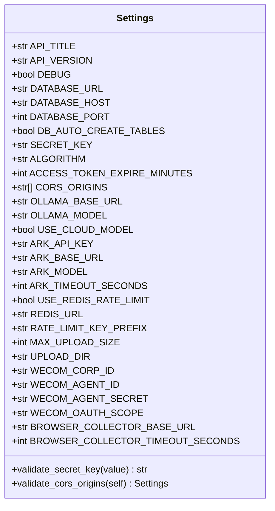
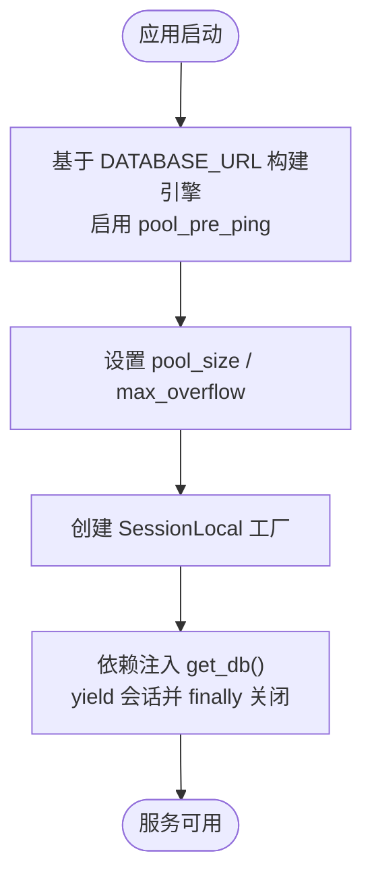
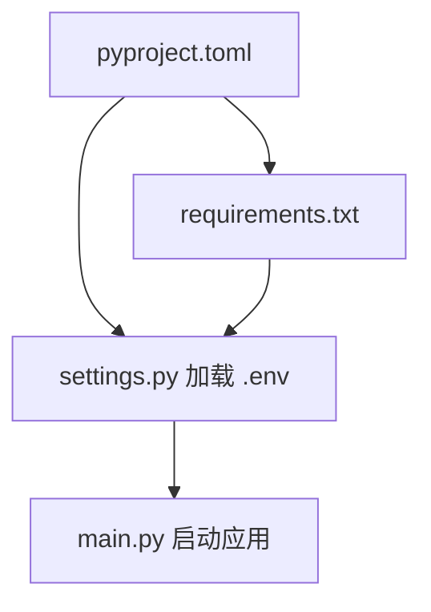

# 应用入口与配置管理

<cite>
**本文引用的文件**
- [main.py](file://backend/main.py)
- [app/main.py](file://backend/app/main.py)
- [server.py](file://backend/server.py)
- [config.py](file://backend/app/core/config.py)
- [database.py](file://backend/app/core/database.py)
- [redis.py](file://backend/app/core/redis.py)
- [router.py](file://backend/app/api/router.py)
- [pyproject.toml](file://backend/pyproject.toml)
- [requirements.txt](file://backend/requirements.txt)
- [env-example.md](file://docs/deploy/env-example.md)
</cite>

## 目录
1. [简介](#简介)
2. [项目结构](#项目结构)
3. [核心组件](#核心组件)
4. [架构总览](#架构总览)
5. [详细组件分析](#详细组件分析)
6. [依赖分析](#依赖分析)
7. [性能考虑](#性能考虑)
8. [故障排查指南](#故障排查指南)
9. [结论](#结论)
10. [附录](#附录)

## 简介
本文件聚焦“智获客”后端应用的入口与配置管理，系统性阐述以下主题：
- FastAPI 应用实例的初始化流程、生命周期钩子与启动序列
- 配置系统的层次结构：环境变量读取、配置验证与默认值处理
- 数据库连接池配置、连接超时与重连机制
- 依赖注入容器的配置与管理思路
- 配置热更新机制、配置文件格式与最佳实践
- 配置错误排查与性能调优建议

## 项目结构
后端采用分层组织方式，入口与配置相关的关键文件如下：
- 应用入口与生命周期：backend/main.py、backend/app/main.py、backend/server.py
- 配置系统：backend/app/core/config.py
- 数据库与Redis：backend/app/core/database.py、backend/app/core/redis.py
- 路由注册：backend/app/api/router.py
- 依赖声明：backend/pyproject.toml、backend/requirements.txt
- 示例配置：docs/deploy/env-example.md

**图表来源**
- [main.py:1-138](file://backend/main.py#L1-L138)
- [router.py:1-35](file://backend/app/api/router.py#L1-L35)
- [config.py:1-103](file://backend/app/core/config.py#L1-L103)
- [database.py:1-29](file://backend/app/core/database.py#L1-L29)
- [redis.py:1-8](file://backend/app/core/redis.py#L1-L8)
- [server.py:1-30](file://backend/server.py#L1-L30)
- [pyproject.toml:1-47](file://backend/pyproject.toml#L1-L47)
- [requirements.txt:1-21](file://backend/requirements.txt#L1-L21)
- [env-example.md](file://docs/deploy/env-example.md)

**章节来源**
- [main.py:1-138](file://backend/main.py#L1-L138)
- [app/main.py:1-4](file://backend/app/main.py#L1-L4)
- [server.py:1-30](file://backend/server.py#L1-L30)
- [config.py:1-103](file://backend/app/core/config.py#L1-L103)
- [database.py:1-29](file://backend/app/core/database.py#L1-L29)
- [redis.py:1-8](file://backend/app/core/redis.py#L1-L8)
- [router.py:1-35](file://backend/app/api/router.py#L1-L35)
- [pyproject.toml:1-47](file://backend/pyproject.toml#L1-L47)
- [requirements.txt:1-21](file://backend/requirements.txt#L1-L21)
- [env-example.md](file://docs/deploy/env-example.md)

## 核心组件
- 应用入口与生命周期
  - 使用 lifespan 钩子在启动阶段执行健康检查与资源准备，yield 之后进入请求处理阶段。
  - 支持开发模式下的自动重载与生产模式下的打包运行。
- 配置系统
  - 基于 pydantic-settings 的 Settings 类，支持从 .env 文件读取环境变量、大小写敏感、额外字段忽略。
  - 内置多项校验：密钥强度校验、生产环境 CORS 白名单限制等。
- 数据库与连接池
  - 使用 SQLAlchemy 创建带 pre_ping 的连接池，配置 pool_size 与 max_overflow，结合 sessionmaker 提供会话工厂。
- Redis 客户端
  - 通过工厂函数按需获取 Redis 客户端实例，统一解码响应。
- 路由注册
  - 统一注册各模块路由，便于集中管理。

**章节来源**
- [main.py:22-51](file://backend/main.py#L22-L51)
- [config.py:15-103](file://backend/app/core/config.py#L15-L103)
- [database.py:6-16](file://backend/app/core/database.py#L6-L16)
- [redis.py:6-8](file://backend/app/core/redis.py#L6-L8)
- [router.py:32-35](file://backend/app/api/router.py#L32-L35)

## 架构总览
应用启动流程概览如下：

**图表来源**
- [server.py:18-29](file://backend/server.py#L18-L29)
- [main.py:45-68](file://backend/main.py#L45-L68)
- [database.py:22-28](file://backend/app/core/database.py#L22-L28)

## 详细组件分析

### FastAPI 应用初始化与生命周期
- 初始化参数
  - 标题、版本、描述来自配置；lifespan 钩子用于启动前检查。
- 生命周期钩子
  - 在 yield 之前执行数据库用户序列健康检查；异常被记录但不影响服务启动。
- 健康检查端点
  - 提供 /health 返回状态与序列指标快照。
- 前端静态资源
  - 若桌面前端已构建，则挂载静态资源并提供 SPA 回退路由；否则返回引导信息。

**图表来源**
- [main.py:45-107](file://backend/main.py#L45-L107)

**章节来源**
- [main.py:22-107](file://backend/main.py#L22-L107)

### 配置系统层次结构与验证
- 层次结构
  - 顶层 Settings 类定义各类配置项，默认值与类型约束。
  - 通过 pydantic-settings 从 .env 文件加载，大小写敏感，额外字段忽略。
- 关键验证规则
  - 密钥强度：禁止使用占位密钥，长度至少 32 字符。
  - CORS 白名单：生产环境不允许包含通配符。
- 配置项举例
  - 项目：API_TITLE、API_VERSION、DEBUG
  - 数据库：DATABASE_URL、DATABASE_HOST、DATABASE_PORT、DB_AUTO_CREATE_TABLES
  - JWT：SECRET_KEY、ALGORITHM、ACCESS_TOKEN_EXPIRE_MINUTES
  - Redis：USE_REDIS_RATE_LIMIT、REDIS_URL、RATE_LIMIT_KEY_PREFIX
  - 文件上传：MAX_UPLOAD_SIZE、UPLOAD_DIR
  - 企业微信：WECOM_* 系列
  - AI 模型：OLLAMA_*、USE_CLOUD_MODEL
  - 火山引擎：ARK_* 系列
  - 浏览器采集：BROWSER_COLLECTOR_* 系列

**图表来源**
- [config.py:15-103](file://backend/app/core/config.py#L15-L103)

**章节来源**
- [config.py:15-103](file://backend/app/core/config.py#L15-L103)
- [env-example.md](file://docs/deploy/env-example.md)

### 数据库连接池与会话管理
- 引擎配置
  - 使用 settings.DATABASE_URL 创建引擎，开启 echo（调试模式），启用 pool_pre_ping。
  - 连接池参数：pool_size 与 max_overflow 控制并发与溢出连接。
- 会话工厂
  - sessionmaker 提供非自动提交/刷新的会话工厂，get_db 作为依赖注入提供者，确保异常后正确关闭。
- 表创建开关
  - DB_AUTO_CREATE_TABLES 仅在显式开启时创建表，避免误操作。

**图表来源**
- [database.py:6-28](file://backend/app/core/database.py#L6-L28)

**章节来源**
- [database.py:6-28](file://backend/app/core/database.py#L6-L28)

### Redis 客户端与分布式限流
- 客户端工厂
  - 通过 get_redis_client() 从 settings.REDIS_URL 创建 Redis 客户端，并统一解码响应。
- 限流开关
  - USE_REDIS_RATE_LIMIT 控制是否启用基于 Redis 的分布式限流，KEY 前缀由 RATE_LIMIT_KEY_PREFIX 统一管理。

**章节来源**
- [redis.py:6-8](file://backend/app/core/redis.py#L6-L8)
- [config.py:86-90](file://backend/app/core/config.py#L86-L90)

### 路由注册与中间件
- 路由注册
  - register_routers 集中 include 各模块路由，便于扩展与维护。
- CORS 中间件
  - 依据 CORS_ORIGINS 动态配置 allow_credentials，遵循 Starlette 要求。

**章节来源**
- [router.py:32-35](file://backend/app/api/router.py#L32-L35)
- [main.py:53-65](file://backend/main.py#L53-L65)

### 应用入口与打包运行
- 本地开发
  - main.py 中直接运行 uvicorn，reload 取决于 DEBUG。
- 打包运行
  - server.py 处理 PyInstaller 打包后的模块路径与工作目录修正，固定 host/port 从环境变量读取，禁用 reload。

**章节来源**
- [main.py:130-137](file://backend/main.py#L130-L137)
- [server.py:8-29](file://backend/server.py#L8-L29)

## 依赖分析
- Python 版本与核心依赖
  - Python >= 3.10，FastAPI、Uvicorn、SQLAlchemy、Alembic、Pydantic、Pydantic Settings、Redis、Requests 等。
- 配置与运行
  - pyproject.toml 与 requirements.txt 均声明了依赖，确保一致性。
- 环境变量与 .env
  - 通过 python-dotenv 与 pydantic-settings 读取 .env，实现配置与代码解耦。

**图表来源**
- [pyproject.toml:7-31](file://backend/pyproject.toml#L7-L31)
- [requirements.txt:1-21](file://backend/requirements.txt#L1-L21)
- [config.py:16-20](file://backend/app/core/config.py#L16-L20)

**章节来源**
- [pyproject.toml:1-47](file://backend/pyproject.toml#L1-L47)
- [requirements.txt:1-21](file://backend/requirements.txt#L1-L21)
- [config.py:16-20](file://backend/app/core/config.py#L16-L20)

## 性能考虑
- 连接池参数
  - pool_size 与 max_overflow 的设置直接影响并发能力与资源占用，应根据数据库承载能力与请求峰值调整。
- pre_ping 与超时
  - pool_pre_ping 可提升连接可用性，减少无效连接导致的失败；数据库与外部服务（如火山引擎、浏览器采集）超时需合理配置。
- 缓存与静态资源
  - 前端静态资源缓存友好头由 StaticFiles 提供，有助于降低带宽与延迟。
- 限流策略
  - Redis 分布式限流可配合 RATE_LIMIT_KEY_PREFIX 统一命名空间，避免冲突。

[本节为通用性能建议，无需特定文件引用]

## 故障排查指南
- 启动失败或健康检查异常
  - 检查 DATABASE_URL 与数据库可达性；确认 DB_AUTO_CREATE_TABLES 权限与网络策略。
  - 查看 lifespan 钩子日志，定位用户序列健康检查失败原因。
- CORS 错误
  - 生产环境不得使用通配符，核对 CORS_ORIGINS 设置。
- 密钥与安全
  - SECRET_KEY 必须满足长度与强度要求，避免使用默认占位值。
- 打包运行问题
  - 确认 PyInstaller 打包后的工作目录与 .env 位置，确保 server.py 的路径修正逻辑生效。
- 外部服务超时
  - 调整火山引擎与浏览器采集的超时时间，避免阻塞请求处理。

**章节来源**
- [main.py:22-35](file://backend/main.py#L22-L35)
- [config.py:55-69](file://backend/app/core/config.py#L55-L69)
- [server.py:8-14](file://backend/server.py#L8-L14)

## 结论
本文件梳理了“智获客”后端应用的入口与配置管理要点：以 FastAPI 生命周期钩子保障启动稳定性，以 pydantic-settings 构建强类型的配置体系并内置关键校验，以 SQLAlchemy 与 Redis 提供可靠的连接与限流能力。通过合理的连接池参数、CORS 策略与超时配置，可在保证安全性的同时获得良好的性能表现。建议在生产环境中严格遵守配置规范，定期审查日志与健康检查结果，持续优化连接池与限流策略。

[本节为总结性内容，无需特定文件引用]

## 附录

### 配置热更新机制
- 当前实现
  - 应用启动时一次性读取配置，未内置运行时热更新机制。
- 推荐方案
  - 使用定时轮询或文件监控触发重新加载 settings；或引入配置中心（如 Consul、etcd）并通过事件驱动刷新。
  - 对于数据库与 Redis 连接，建议在变更后重建连接池或客户端实例，确保新配置生效。

[本节为概念性建议，无需特定文件引用]

### 配置文件格式与最佳实践
- 文件格式
  - 使用 .env 文件存放环境变量，键名与 Settings 类一致。
- 最佳实践
  - 生产环境禁止使用默认密钥与通配符 CORS；为不同环境准备独立 .env 文件；将敏感信息纳入密钥管理。
  - 明确区分开发/测试/生产环境的连接池大小与超时参数；为外部服务设置合理的重试与熔断策略。

**章节来源**
- [config.py:16-20](file://backend/app/core/config.py#L16-L20)
- [env-example.md](file://docs/deploy/env-example.md)