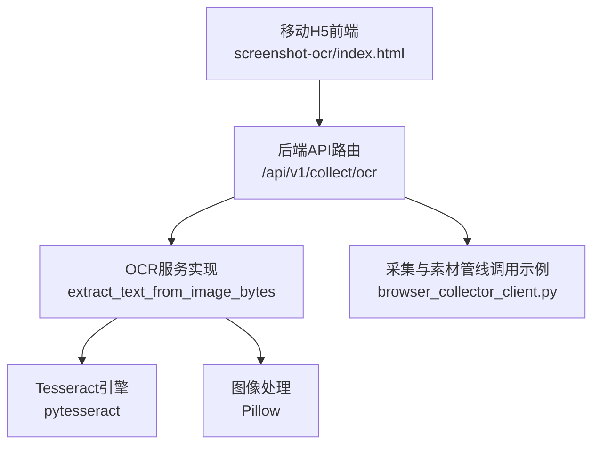
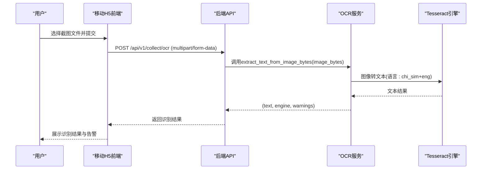
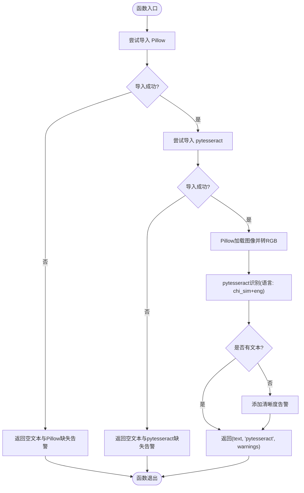
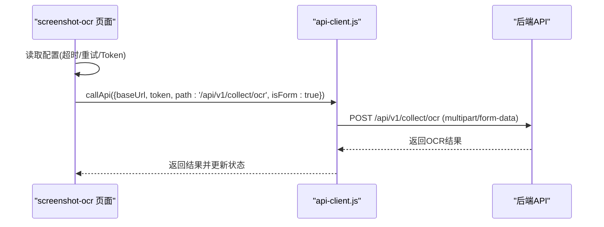
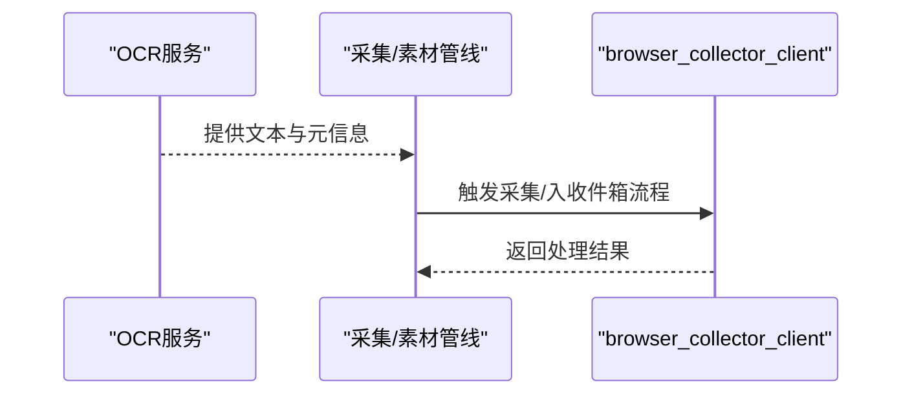
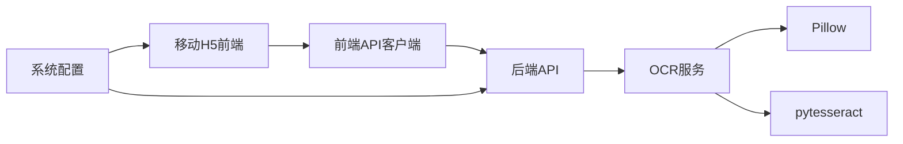

# OCR服务集成

<cite>
**本文引用的文件**
- [backend/app/integrations/ocr/ocr_service.py](file://backend/app/integrations/ocr/ocr_service.py)
- [backend/app/integrations/ocr/__init__.py](file://backend/app/integrations/ocr/__init__.py)
- [mobile-h5/src/pages/screenshot-ocr/index.html](file://mobile-h5/src/pages/screenshot-ocr/index.html)
- [mobile-h5/src/utils/api-client.js](file://mobile-h5/src/utils/api-client.js)
- [backend/app/api/endpoints/collect.py](file://backend/app/api/endpoints/collect.py)
- [backend/app/core/config.py](file://backend/app/core/config.py)
- [backend/app/services/collector/browser_collector_client.py](file://backend/app/services/collector/browser_collector_client.py)
- [mobile-h5/README.md](file://mobile-h5/README.md)
</cite>

## 目录
1. [简介](#简介)
2. [项目结构](#项目结构)
3. [核心组件](#核心组件)
4. [架构总览](#架构总览)
5. [详细组件分析](#详细组件分析)
6. [依赖关系分析](#依赖关系分析)
7. [性能考虑](#性能考虑)
8. [故障排除指南](#故障排除指南)
9. [结论](#结论)
10. [附录](#附录)

## 简介
本技术文档面向“OCR服务集成”，系统性阐述截图OCR识别与提取功能的实现原理、调用流程、参数配置、结果处理、错误与重试机制、性能优化策略，以及与内容采集系统的集成与数据流转。当前OCR能力基于本地Tesseract引擎，支持中文简体与英文混合识别，并提供基础的图像预处理与告警提示。

## 项目结构
围绕OCR服务的关键目录与文件如下：
- 后端OCR集成模块：backend/app/integrations/ocr
- 移动H5前端页面：mobile-h5/src/pages/screenshot-ocr
- 前端通用API客户端：mobile-h5/src/utils/api-client.js
- 收集相关旧接口声明：backend/app/api/endpoints/collect.py
- 系统配置：backend/app/core/config.py
- 浏览器采集客户端：backend/app/services/collector/browser_collector_client.py

图表来源
- [backend/app/integrations/ocr/ocr_service.py:4-31](file://backend/app/integrations/ocr/ocr_service.py#L4-L31)
- [mobile-h5/src/pages/screenshot-ocr/index.html:93-103](file://mobile-h5/src/pages/screenshot-ocr/index.html#L93-L103)
- [backend/app/services/collector/browser_collector_client.py:16-33](file://backend/app/services/collector/browser_collector_client.py#L16-L33)

章节来源
- [backend/app/integrations/ocr/ocr_service.py:1-32](file://backend/app/integrations/ocr/ocr_service.py#L1-L32)
- [mobile-h5/src/pages/screenshot-ocr/index.html:1-113](file://mobile-h5/src/pages/screenshot-ocr/index.html#L1-L113)
- [backend/app/api/endpoints/collect.py:1-20](file://backend/app/api/endpoints/collect.py#L1-L20)
- [backend/app/core/config.py:91-101](file://backend/app/core/config.py#L91-L101)
- [backend/app/services/collector/browser_collector_client.py:1-40](file://backend/app/services/collector/browser_collector_client.py#L1-L40)

## 核心组件
- OCR服务实现：提供从二进制图像字节流提取文本的能力，返回文本、引擎标识与告警列表。
- OCR导出接口：通过__all__暴露extract_text_from_image_bytes，便于外部导入使用。
- 移动H5前端：提供截图OCR页面，支持表单上传、鉴权、超时与重试配置。
- 前端API客户端：封装fetch调用、超时控制、重试逻辑、幂等请求键等。
- 采集与素材管线：作为OCR识别后的典型下游处理示例，展示如何将OCR结果接入统一素材流程。

章节来源
- [backend/app/integrations/ocr/ocr_service.py:4-31](file://backend/app/integrations/ocr/ocr_service.py#L4-L31)
- [backend/app/integrations/ocr/__init__.py:1-5](file://backend/app/integrations/ocr/__init__.py#L1-L5)
- [mobile-h5/src/pages/screenshot-ocr/index.html:67-110](file://mobile-h5/src/pages/screenshot-ocr/index.html#L67-L110)
- [mobile-h5/src/utils/api-client.js:40-81](file://mobile-h5/src/utils/api-client.js#L40-L81)
- [backend/app/services/collector/browser_collector_client.py:16-33](file://backend/app/services/collector/browser_collector_client.py#L16-L33)

## 架构总览
OCR服务在系统中的位置与交互如下：

图表来源
- [mobile-h5/src/pages/screenshot-ocr/index.html:81-103](file://mobile-h5/src/pages/screenshot-ocr/index.html#L81-L103)
- [backend/app/integrations/ocr/ocr_service.py:4-31](file://backend/app/integrations/ocr/ocr_service.py#L4-L31)

## 详细组件分析

### OCR服务实现与算法
- 输入：二进制图像字节流
- 处理流程：
  - 尝试导入Pillow与pytesseract，若缺失则返回相应告警。
  - 使用Pillow将字节流转换为RGB图像。
  - 使用pytesseract对图像进行OCR识别，语言设置为中文简体+英文。
  - 若识别结果为空，追加“截图清晰度”相关告警。
  - 异常捕获并返回失败告警。
- 输出：三元组(text, engine, warnings)，其中engine用于标识当前使用的OCR引擎。

图表来源
- [backend/app/integrations/ocr/ocr_service.py:4-31](file://backend/app/integrations/ocr/ocr_service.py#L4-L31)

章节来源
- [backend/app/integrations/ocr/ocr_service.py:4-31](file://backend/app/integrations/ocr/ocr_service.py#L4-L31)

### 移动H5前端与调用流程
- 页面功能：提供平台、来源链接、标题、作者、是否保存至收件箱等字段，支持表单上传。
- 提交流程：构造FormData，附加client_request_id以支持幂等；调用callApi发起POST请求至/api/v1/collect/ocr。
- 配置项：支持保存API Base URL、Token、超时毫秒数、最大重试次数于localStorage。
- 错误处理：401清理本地token并提示重新授权；429/5xx/超时按配置自动重试；表单提交具备防重复提交保护。

图表来源
- [mobile-h5/src/pages/screenshot-ocr/index.html:75-103](file://mobile-h5/src/pages/screenshot-ocr/index.html#L75-L103)
- [mobile-h5/src/utils/api-client.js:62-81](file://mobile-h5/src/utils/api-client.js#L62-L81)

章节来源
- [mobile-h5/src/pages/screenshot-ocr/index.html:1-113](file://mobile-h5/src/pages/screenshot-ocr/index.html#L1-L113)
- [mobile-h5/src/utils/api-client.js:1-81](file://mobile-h5/src/utils/api-client.js#L1-L81)
- [mobile-h5/README.md:51-57](file://mobile-h5/README.md#L51-L57)

### 与采集与素材管线的集成
- OCR识别完成后，可将结果与平台、来源URL、标题、作者等信息一并送入采集与素材处理流程。
- 示例：通过浏览器采集客户端调用统一采集入口，实现“截图OCR识别后直接入收件箱”的场景。

图表来源
- [backend/app/services/collector/browser_collector_client.py:16-33](file://backend/app/services/collector/browser_collector_client.py#L16-L33)

章节来源
- [backend/app/services/collector/browser_collector_client.py:1-40](file://backend/app/services/collector/browser_collector_client.py#L1-L40)

## 依赖关系分析
- OCR服务依赖：
  - Pillow：图像加载与格式转换（RGB）。
  - pytesseract：OCR识别引擎。
  - io：字节流处理。
- 前端依赖：
  - fetch：HTTP请求。
  - localStorage：持久化配置。
- 后端配置：
  - 文件上传大小限制、上传目录、浏览器采集服务基础URL与超时等。

图表来源
- [backend/app/integrations/ocr/ocr_service.py:13-25](file://backend/app/integrations/ocr/ocr_service.py#L13-L25)
- [mobile-h5/src/utils/api-client.js:40-54](file://mobile-h5/src/utils/api-client.js#L40-L54)
- [backend/app/core/config.py:91-101](file://backend/app/core/config.py#L91-L101)

章节来源
- [backend/app/integrations/ocr/ocr_service.py:1-32](file://backend/app/integrations/ocr/ocr_service.py#L1-L32)
- [mobile-h5/src/utils/api-client.js:1-81](file://mobile-h5/src/utils/api-client.js#L1-L81)
- [backend/app/core/config.py:91-101](file://backend/app/core/config.py#L91-L101)

## 性能考虑
- 识别性能与稳定性
  - 语言模型：当前使用中文简体+英文组合，适合混合文本场景。
  - 清晰度影响：若识别为空，前端会提示检查截图清晰度；建议在采集阶段尽量保证截图质量。
- 传输与并发
  - 前端支持超时与重试配置，建议根据网络环境调整超时与重试次数。
  - 后端文件上传大小限制与上传目录配置需结合实际业务规模评估。
- 批量与缓存
  - 当前OCR实现为单图识别；如需批量处理，建议在上游聚合后再调用后端API。
  - 缓存策略：可基于client_request_id实现幂等，避免弱网重试导致的重复入库；同时可在应用层对相同图片内容做去重与缓存。

章节来源
- [backend/app/integrations/ocr/ocr_service.py:26-28](file://backend/app/integrations/ocr/ocr_service.py#L26-L28)
- [mobile-h5/src/pages/screenshot-ocr/index.html:18-21](file://mobile-h5/src/pages/screenshot-ocr/index.html#L18-L21)
- [mobile-h5/README.md:51-57](file://mobile-h5/README.md#L51-L57)
- [backend/app/core/config.py:91-94](file://backend/app/core/config.py#L91-L94)

## 故障排除指南
- 依赖缺失
  - Pillow未安装：返回“无法执行OCR”的告警。
  - pytesseract未安装：返回“无法执行OCR”的告警。
- 识别异常
  - 无文本：追加“截图清晰度”相关告警。
  - 其他异常：返回“OCR执行失败”的告警及具体异常信息。
- 前端错误处理
  - 401：清理本地token并提示重新授权。
  - 429/5xx/超时：按配置自动重试。
  - 幂等：通过client_request_id避免重复提交导致的重复入库。
- 后端配置检查
  - 文件上传大小限制与上传目录。
  - 浏览器采集服务基础URL与超时时间。

章节来源
- [backend/app/integrations/ocr/ocr_service.py:14-20](file://backend/app/integrations/ocr/ocr_service.py#L14-L20)
- [backend/app/integrations/ocr/ocr_service.py:27-31](file://backend/app/integrations/ocr/ocr_service.py#L27-L31)
- [mobile-h5/src/utils/api-client.js:52-60](file://mobile-h5/src/utils/api-client.js#L52-L60)
- [mobile-h5/README.md:51-57](file://mobile-h5/README.md#L51-L57)
- [backend/app/core/config.py:91-101](file://backend/app/core/config.py#L91-L101)

## 结论
本OCR服务集成以轻量、易部署为目标，基于本地Tesseract引擎实现中文简体与英文混合识别，并通过移动H5前端提供直观的截图上传与识别体验。配合后端的幂等与重试机制，可在弱网环境下稳定运行。未来可扩展批量处理、缓存与更丰富的图像预处理策略，以进一步提升吞吐与准确性。

## 附录

### 支持的图片格式与识别语言
- 图片格式：由Pillow支持的常见格式（如JPEG、PNG等）均可处理，最终统一转为RGB。
- 识别语言：当前设置为中文简体+英文组合，适合中英混排场景。

章节来源
- [backend/app/integrations/ocr/ocr_service.py:25-26](file://backend/app/integrations/ocr/ocr_service.py#L25-L26)

### 调用流程与参数配置要点
- 前端参数
  - 平台、来源链接、标题、作者、是否保存至收件箱、client_request_id。
- 后端参数
  - 通过multipart/form-data上传image字段；其余字段作为表单参数传递。
- 超时与重试
  - 前端支持超时毫秒数与最大重试次数配置；后端未显式设置OCR超时，建议在网络侧与前端侧共同保障稳定性。

章节来源
- [mobile-h5/src/pages/screenshot-ocr/index.html:81-88](file://mobile-h5/src/pages/screenshot-ocr/index.html#L81-L88)
- [mobile-h5/src/utils/api-client.js:62-81](file://mobile-h5/src/utils/api-client.js#L62-L81)
- [backend/app/core/config.py:99-100](file://backend/app/core/config.py#L99-L100)

### 与内容采集系统的集成方式
- OCR识别结果可直接作为素材内容的一部分，配合平台、来源URL、标题、作者等元信息，进入统一的采集与素材处理流程。
- 示例：通过浏览器采集客户端触发采集入口，实现“截图OCR识别后直接入收件箱”。

章节来源
- [backend/app/services/collector/browser_collector_client.py:16-33](file://backend/app/services/collector/browser_collector_client.py#L16-L33)