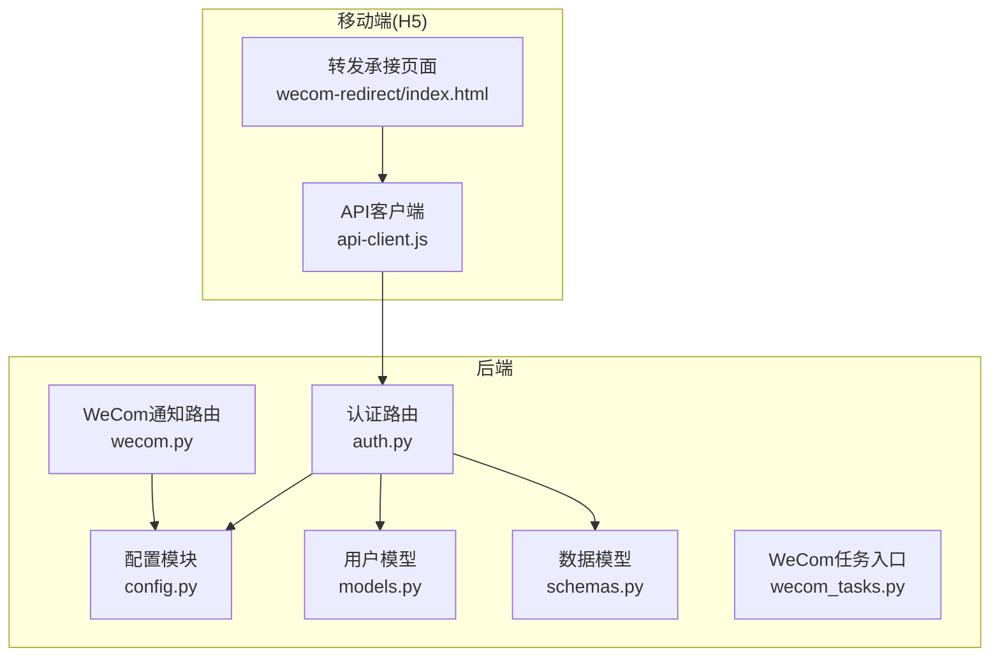
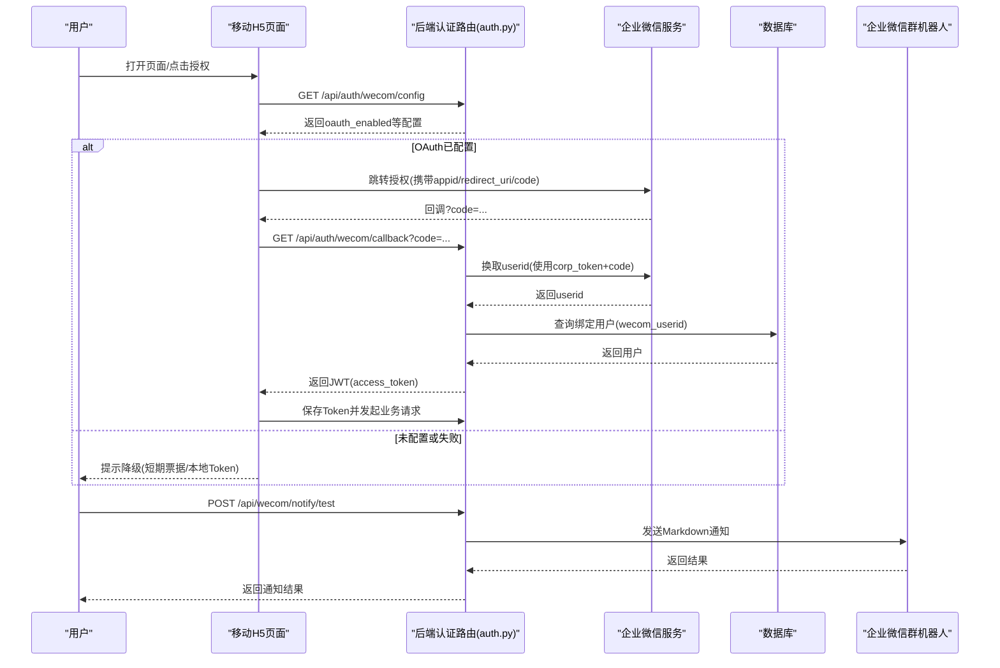
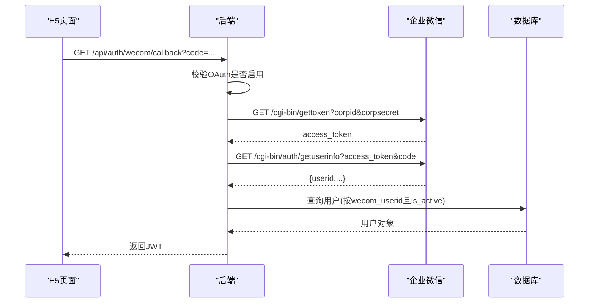
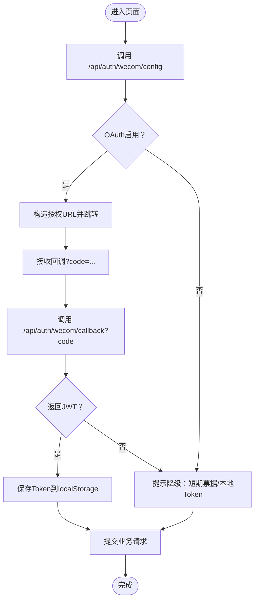
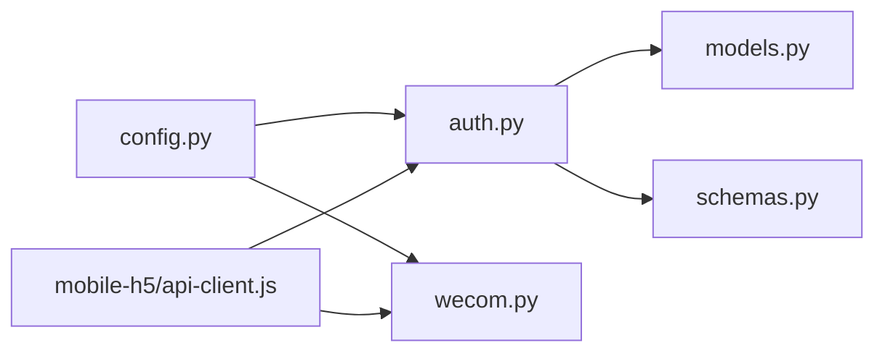

# 企业微信集成

<cite>
**本文引用的文件**
- [backend/app/api/endpoints/auth.py](file://backend/app/api/endpoints/auth.py)
- [backend/app/api/endpoints/wecom.py](file://backend/app/api/endpoints/wecom.py)
- [backend/app/core/config.py](file://backend/app/core/config.py)
- [backend/app/models/models.py](file://backend/app/models/models.py)
- [backend/app/schemas/schemas.py](file://backend/app/schemas/schemas.py)
- [backend/app/tasks/wecom_tasks.py](file://backend/app/tasks/wecom_tasks.py)
- [backend/README.md](file://backend/README.md)
- [mobile-h5/src/utils/api-client.js](file://mobile-h5/src/utils/api-client.js)
- [mobile-h5/src/pages/wecom-redirect/index.html](file://mobile-h5/src/pages/wecom-redirect/index.html)
</cite>

## 目录
1. [简介](#简介)
2. [项目结构](#项目结构)
3. [核心组件](#核心组件)
4. [架构总览](#架构总览)
5. [详细组件分析](#详细组件分析)
6. [依赖分析](#依赖分析)
7. [性能考虑](#性能考虑)
8. [故障排除指南](#故障排除指南)
9. [结论](#结论)
10. [附录](#附录)

## 简介
本技术文档面向“企业微信集成”的实现与使用，围绕以下目标展开：
- 企业微信 OAuth 认证流程：应用配置、用户授权、token 获取与签发
- 消息推送与回调处理：消息格式、签名验证与重试机制
- 用户信息同步、部门组织架构获取与应用管理能力
- 企业微信 API 调用示例、错误处理策略与性能优化建议
- 完整配置指南与故障排除方法

当前仓库中企业微信相关能力主要体现在：
- 后端提供企业微信 OAuth 换码接口与配置查询接口，支持将企业微信用户映射到系统用户并签发 JWT
- 移动 H5 页面支持 OAuth 跳转、票据降级与本地 Token 提交
- 后端提供 WeCom 机器人 Webhook 测试通知接口
- 企业微信相关配置项集中于后端配置模块

## 项目结构
后端采用 FastAPI + SQLAlchemy 架构，企业微信集成涉及的关键模块如下：
- 配置层：集中读取企业微信相关环境变量
- 路由层：提供 OAuth 配置查询、换码、绑定、Webhook 通知等接口
- 模型层：用户模型包含 wecom_userid 字段用于绑定
- Schema 层：定义 OAuth 配置响应与绑定请求体
- 任务层：预留 WeCom 任务入口
- 移动 H5：负责 OAuth 跳转、票据交换与本地 Token 提交

图表来源
- [backend/app/core/config.py:95-96](file://backend/app/core/config.py#L95-L96)
- [backend/app/api/endpoints/auth.py:185-254](file://backend/app/api/endpoints/auth.py#L185-L254)
- [backend/app/api/endpoints/wecom.py:15-48](file://backend/app/api/endpoints/wecom.py#L15-L48)
- [backend/app/models/models.py:8-27](file://backend/app/models/models.py#L8-L27)
- [backend/app/schemas/schemas.py:59-69](file://backend/app/schemas/schemas.py#L59-L69)
- [backend/app/tasks/wecom_tasks.py:1-3](file://backend/app/tasks/wecom_tasks.py#L1-L3)
- [mobile-h5/src/pages/wecom-redirect/index.html:1-251](file://mobile-h5/src/pages/wecom-redirect/index.html#L1-L251)
- [mobile-h5/src/utils/api-client.js:172-187](file://mobile-h5/src/utils/api-client.js#L172-L187)

章节来源
- [backend/README.md:90-107](file://backend/README.md#L90-L107)

## 核心组件
- 企业微信 OAuth 配置查询：后端提供公开接口，返回企业微信 CorpID、AgentID 与 OAuth 是否启用状态，供前端判断是否展示 OAuth 登录入口
- 企业微信 OAuth 换码接口：接收 H5 页面转发的 code，向企业微信获取 userid，匹配系统用户并签发 JWT
- 企业微信 Webhook 通知：管理员可发送测试 Markdown 通知至企业微信群机器人
- 移动 H5 OAuth 流程：构造授权 URL、接收回调、交换令牌、持久化 Token
- 本地 Token 降级：当 OAuth 未配置或失败时，允许使用短期票据或本地 Token 提交

章节来源
- [backend/app/api/endpoints/auth.py:185-254](file://backend/app/api/endpoints/auth.py#L185-L254)
- [backend/app/api/endpoints/wecom.py:15-48](file://backend/app/api/endpoints/wecom.py#L15-L48)
- [mobile-h5/src/utils/api-client.js:172-187](file://mobile-h5/src/utils/api-client.js#L172-L187)
- [mobile-h5/src/pages/wecom-redirect/index.html:1-251](file://mobile-h5/src/pages/wecom-redirect/index.html#L1-L251)

## 架构总览
下图展示了企业微信 OAuth 与消息通知的整体交互：

图表来源
- [backend/app/api/endpoints/auth.py:185-254](file://backend/app/api/endpoints/auth.py#L185-L254)
- [backend/app/api/endpoints/wecom.py:15-48](file://backend/app/api/endpoints/wecom.py#L15-L48)
- [mobile-h5/src/utils/api-client.js:172-187](file://mobile-h5/src/utils/api-client.js#L172-L187)

## 详细组件分析

### 企业微信 OAuth 配置查询
- 接口：GET /api/auth/wecom/config
- 返回字段：corp_id、agent_id、oauth_enabled
- 作用：前端据此决定是否显示 OAuth 登录入口

章节来源
- [backend/app/api/endpoints/auth.py:185-192](file://backend/app/api/endpoints/auth.py#L185-L192)

### 企业微信 OAuth 换码流程
- 接口：GET /api/auth/wecom/callback
- 输入：code（H5 转发）
- 步骤：
  1) 校验企业微信 OAuth 是否启用
  2) 通过企业微信 Corp Secret 获取 corp_token（带内存缓存）
  3) 使用 corp_token + code 换取 userid
  4) 在数据库中按 wecom_userid 查找激活用户
  5) 签发 JWT 返回

图表来源
- [backend/app/api/endpoints/auth.py:195-254](file://backend/app/api/endpoints/auth.py#L195-L254)

章节来源
- [backend/app/api/endpoints/auth.py:195-254](file://backend/app/api/endpoints/auth.py#L195-L254)

### 企业微信 Webhook 通知
- 接口：POST /api/wecom/notify/test
- 用途：向企业微信群机器人发送测试 Markdown 通知
- 行为：校验配置、构造消息体、异步请求、解析响应、错误处理

章节来源
- [backend/app/api/endpoints/wecom.py:15-48](file://backend/app/api/endpoints/wecom.py#L15-L48)
- [backend/app/core/config.py:95-96](file://backend/app/core/config.py#L95-L96)

### 移动 H5 OAuth 与降级流程
- 构造授权 URL：buildWecomOAuthUrl
- 降级策略：当后端未配置 OAuth 或账号未绑定时，提示使用短期票据或本地 Token
- 本地持久化：将 Token 写入 localStorage，支持超时与重试配置

图表来源
- [mobile-h5/src/utils/api-client.js:172-187](file://mobile-h5/src/utils/api-client.js#L172-L187)
- [mobile-h5/src/utils/api-client.js:107-135](file://mobile-h5/src/utils/api-client.js#L107-L135)
- [mobile-h5/src/pages/wecom-redirect/index.html:1-251](file://mobile-h5/src/pages/wecom-redirect/index.html#L1-L251)

章节来源
- [mobile-h5/src/utils/api-client.js:172-187](file://mobile-h5/src/utils/api-client.js#L172-L187)
- [mobile-h5/src/utils/api-client.js:107-135](file://mobile-h5/src/utils/api-client.js#L107-L135)
- [mobile-h5/src/pages/wecom-redirect/index.html:1-251](file://mobile-h5/src/pages/wecom-redirect/index.html#L1-L251)

### 用户与绑定
- 用户模型包含 wecom_userid 字段，用于与企业微信用户绑定
- 绑定接口：POST /api/auth/wecom/bind（管理员操作）

章节来源
- [backend/app/models/models.py:8-27](file://backend/app/models/models.py#L8-L27)
- [backend/app/api/endpoints/auth.py:257-279](file://backend/app/api/endpoints/auth.py#L257-L279)
- [backend/app/schemas/schemas.py:66-69](file://backend/app/schemas/schemas.py#L66-L69)

### WeCom 任务入口
- 当前预留 run_wecom_tasks()，暂无具体实现

章节来源
- [backend/app/tasks/wecom_tasks.py:1-3](file://backend/app/tasks/wecom_tasks.py#L1-L3)

## 依赖分析
- 配置依赖：企业微信 OAuth 与 Webhook 通知均依赖配置模块中的相关字段
- 路由依赖：认证路由依赖安全工具与数据库会话
- 模型依赖：用户模型依赖 SQLAlchemy 定义
- 前端依赖：H5 页面依赖后端提供的 OAuth 配置与回调接口

图表来源
- [backend/app/core/config.py:95-96](file://backend/app/core/config.py#L95-L96)
- [backend/app/api/endpoints/auth.py:185-254](file://backend/app/api/endpoints/auth.py#L185-L254)
- [backend/app/api/endpoints/wecom.py:15-48](file://backend/app/api/endpoints/wecom.py#L15-L48)
- [backend/app/models/models.py:8-27](file://backend/app/models/models.py#L8-L27)
- [backend/app/schemas/schemas.py:59-69](file://backend/app/schemas/schemas.py#L59-L69)
- [mobile-h5/src/utils/api-client.js:172-187](file://mobile-h5/src/utils/api-client.js#L172-L187)

章节来源
- [backend/app/core/config.py:95-96](file://backend/app/core/config.py#L95-L96)
- [backend/app/api/endpoints/auth.py:185-254](file://backend/app/api/endpoints/auth.py#L185-L254)
- [backend/app/api/endpoints/wecom.py:15-48](file://backend/app/api/endpoints/wecom.py#L15-L48)
- [backend/app/models/models.py:8-27](file://backend/app/models/models.py#L8-L27)
- [backend/app/schemas/schemas.py:59-69](file://backend/app/schemas/schemas.py#L59-L69)
- [mobile-h5/src/utils/api-client.js:172-187](file://mobile-h5/src/utils/api-client.js#L172-L187)

## 性能考虑
- 企业微信 Corp Access Token 缓存：后端对 corp_token 进行内存缓存，避免频繁请求企业微信接口
- 异步请求：通知接口使用异步客户端，降低阻塞
- H5 侧重试与超时：支持指数退避重试与超时控制，提升弱网环境稳定性
- 建议：
  - 为 corp_token 增加分布式缓存（如 Redis）以支持多实例共享
  - 对企业微信 API 调用增加熔断与隔离策略
  - 对 Webhook 发送增加幂等与延迟队列

章节来源
- [backend/app/api/endpoints/auth.py:44-73](file://backend/app/api/endpoints/auth.py#L44-L73)
- [backend/app/api/endpoints/wecom.py:37-41](file://backend/app/api/endpoints/wecom.py#L37-L41)
- [mobile-h5/src/utils/api-client.js:215-267](file://mobile-h5/src/utils/api-client.js#L215-L267)

## 故障排除指南
- OAuth 未配置或不可用
  - 现象：后端返回 503，前端提示降级
  - 处理：检查企业微信 CorpID、AgentID、AgentSecret 配置
- code 无效或过期
  - 现象：后端返回 401，提示 code 无效或已过期
  - 处理：确认回调地址与 scope 配置正确，重试授权
- 企业微信账号未绑定系统用户
  - 现象：后端返回 401，提示尚未绑定
  - 处理：使用绑定接口为用户绑定 wecom_userid
- Webhook 通知失败
  - 现象：后端返回 502，或 errcode 非 0
  - 处理：检查 WECOM_WEBHOOK_URL 配置与网络连通性
- H5 侧网络异常或 Token 失效
  - 现象：401、超时或离线提示
  - 处理：检查 Token 是否存在、是否过期；调整超时与重试参数

章节来源
- [backend/app/api/endpoints/auth.py:209-254](file://backend/app/api/endpoints/auth.py#L209-L254)
- [backend/app/api/endpoints/wecom.py:21-47](file://backend/app/api/endpoints/wecom.py#L21-L47)
- [mobile-h5/src/utils/api-client.js:107-135](file://mobile-h5/src/utils/api-client.js#L107-L135)
- [mobile-h5/src/utils/api-client.js:232-267](file://mobile-h5/src/utils/api-client.js#L232-L267)

## 结论
本项目实现了企业微信 OAuth 的核心闭环：前端引导授权、后端换码与用户绑定、JWT 签发与业务调用；同时提供了 Webhook 通知能力与 H5 侧降级策略。后续可扩展企业微信组织架构同步、应用管理与回调签名验证等功能。

## 附录

### 配置指南
- 后端配置项（节选）
  - WECOM_CORP_ID：企业微信 CorpID
  - WECOM_AGENT_ID：应用 AgentID
  - WECOM_AGENT_SECRET：应用 Secret
  - WECOM_WEBHOOK_URL：群机器人 Webhook 地址
  - WECOM_OAUTH_SCOPE：授权范围（snsapi_base | snsapi_privateinfo）
- 建议：
  - 生产环境务必配置强密钥与 HTTPS
  - 严格限制 CORS 源
  - 为 corp_token 增加分片缓存与监控

章节来源
- [backend/app/core/config.py:43-48](file://backend/app/core/config.py#L43-L48)
- [backend/app/core/config.py:95-96](file://backend/app/core/config.py#L95-L96)
- [backend/README.md:212-221](file://backend/README.md#L212-L221)

### API 调用示例（路径指引）
- 获取 OAuth 配置
  - GET /api/auth/wecom/config
- OAuth 换码
  - GET /api/auth/wecom/callback?code=...
- 绑定企业微信用户
  - POST /api/auth/wecom/bind
- 发送测试通知
  - POST /api/wecom/notify/test

章节来源
- [backend/app/api/endpoints/auth.py:185-279](file://backend/app/api/endpoints/auth.py#L185-L279)
- [backend/app/api/endpoints/wecom.py:15-48](file://backend/app/api/endpoints/wecom.py#L15-L48)