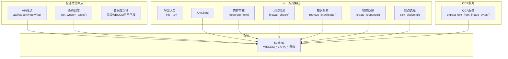
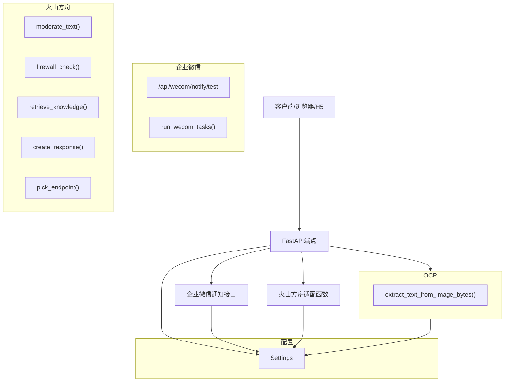
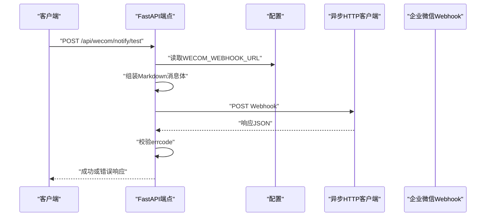
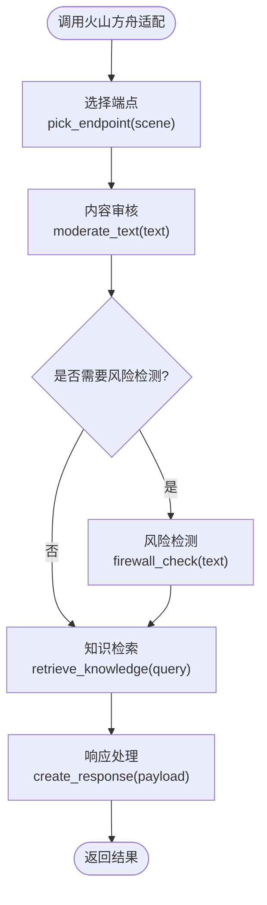
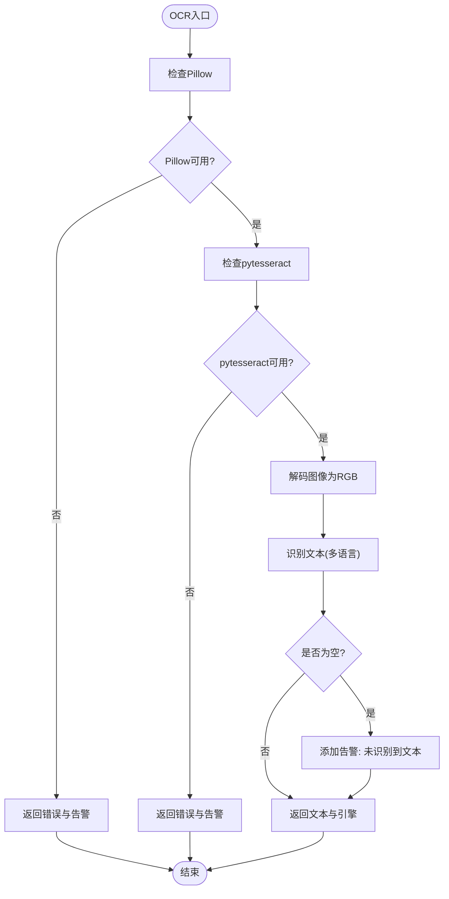
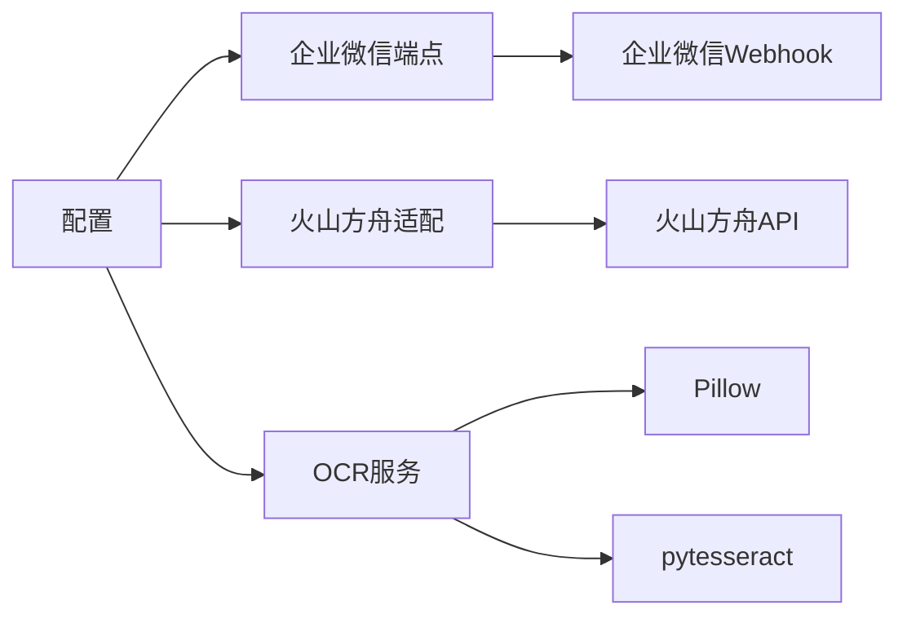

# 外部集成

<cite>
**本文引用的文件**
- [backend/app/integrations/wecom/__init__.py](file://backend/app/integrations/wecom/__init__.py)
- [backend/app/api/endpoints/wecom.py](file://backend/app/api/endpoints/wecom.py)
- [backend/app/tasks/wecom_tasks.py](file://backend/app/tasks/wecom_tasks.py)
- [backend/app/integrations/ocr/ocr_service.py](file://backend/app/integrations/ocr/ocr_service.py)
- [backend/app/integrations/volcengine/__init__.py](file://backend/app/integrations/volcengine/__init__.py)
- [backend/app/integrations/volcengine/ark_client.py](file://backend/app/integrations/volcengine/ark_client.py)
- [backend/app/integrations/volcengine/moderation_api.py](file://backend/app/integrations/volcengine/moderation_api.py)
- [backend/app/integrations/volcengine/firewall_api.py](file://backend/app/integrations/volcengine/firewall_api.py)
- [backend/app/integrations/volcengine/knowledge_api.py](file://backend/app/integrations/volcengine/knowledge_api.py)
- [backend/app/integrations/volcengine/responses_api.py](file://backend/app/integrations/volcengine/responses_api.py)
- [backend/app/integrations/volcengine/endpoint_manager.py](file://backend/app/integrations/volcengine/endpoint_manager.py)
- [backend/app/core/config.py](file://backend/app/core/config.py)
- [backend/alembic/versions/20260323_04_add_user_wecom_userid.py](file://backend/alembic/versions/20260323_04_add_user_wecom_userid.py)
- [backend/README.md](file://backend/README.md)
</cite>

## 目录
1. [简介](#简介)
2. [项目结构](#项目结构)
3. [核心组件](#核心组件)
4. [架构总览](#架构总览)
5. [详细组件分析](#详细组件分析)
6. [依赖分析](#依赖分析)
7. [性能考量](#性能考量)
8. [故障排查指南](#故障排查指南)
9. [结论](#结论)
10. [附录](#附录)

## 简介
本文件面向“外部集成”子系统，聚焦以下能力：
- 企业微信集成：OAuth认证入口与消息推送机制
- 火山方舟API集成：内容审核、风险检测、响应处理与端点管理
- OCR服务：图片文本识别与提取
- 第三方平台对接的通用模式与扩展方法
- 集成配置、错误处理与重试机制
- 数据同步、状态管理与异常恢复策略
- 性能监控、日志记录与安全考虑

## 项目结构
外部集成相关代码主要分布在以下模块：
- 企业微信：API端点、任务调度、数据库迁移
- 火山方舟：客户端封装与各子API适配
- OCR：图像文本识别服务
- 配置：统一读取企业微信、火山方舟等外部服务参数

图示来源
- [backend/app/api/endpoints/wecom.py:1-49](file://backend/app/api/endpoints/wecom.py#L1-L49)
- [backend/app/tasks/wecom_tasks.py:1-3](file://backend/app/tasks/wecom_tasks.py#L1-L3)
- [backend/alembic/versions/20260323_04_add_user_wecom_userid.py](file://backend/alembic/versions/20260323_04_add_user_wecom_userid.py)
- [backend/app/integrations/volcengine/__init__.py:1-4](file://backend/app/integrations/volcengine/__init__.py#L1-L4)
- [backend/app/integrations/volcengine/ark_client.py:1-4](file://backend/app/integrations/volcengine/ark_client.py#L1-L4)
- [backend/app/integrations/volcengine/moderation_api.py:1-3](file://backend/app/integrations/volcengine/moderation_api.py#L1-L3)
- [backend/app/integrations/volcengine/firewall_api.py:1-3](file://backend/app/integrations/volcengine/firewall_api.py#L1-L3)
- [backend/app/integrations/volcengine/knowledge_api.py:1-4](file://backend/app/integrations/volcengine/knowledge_api.py#L1-L4)
- [backend/app/integrations/volcengine/responses_api.py:1-3](file://backend/app/integrations/volcengine/responses_api.py#L1-L3)
- [backend/app/integrations/volcengine/endpoint_manager.py:1-3](file://backend/app/integrations/volcengine/endpoint_manager.py#L1-L3)
- [backend/app/integrations/ocr/ocr_service.py:1-32](file://backend/app/integrations/ocr/ocr_service.py#L1-L32)
- [backend/app/core/config.py:1-103](file://backend/app/core/config.py#L1-L103)

章节来源
- [backend/app/api/endpoints/wecom.py:1-49](file://backend/app/api/endpoints/wecom.py#L1-L49)
- [backend/app/tasks/wecom_tasks.py:1-3](file://backend/app/tasks/wecom_tasks.py#L1-L3)
- [backend/app/integrations/volcengine/__init__.py:1-4](file://backend/app/integrations/volcengine/__init__.py#L1-L4)
- [backend/app/integrations/volcengine/ark_client.py:1-4](file://backend/app/integrations/volcengine/ark_client.py#L1-L4)
- [backend/app/integrations/volcengine/moderation_api.py:1-3](file://backend/app/integrations/volcengine/moderation_api.py#L1-L3)
- [backend/app/integrations/volcengine/firewall_api.py:1-3](file://backend/app/integrations/volcengine/firewall_api.py#L1-L3)
- [backend/app/integrations/volcengine/knowledge_api.py:1-4](file://backend/app/integrations/volcengine/knowledge_api.py#L1-L4)
- [backend/app/integrations/volcengine/responses_api.py:1-3](file://backend/app/integrations/volcengine/responses_api.py#L1-L3)
- [backend/app/integrations/volcengine/endpoint_manager.py:1-3](file://backend/app/integrations/volcengine/endpoint_manager.py#L1-L3)
- [backend/app/integrations/ocr/ocr_service.py:1-32](file://backend/app/integrations/ocr/ocr_service.py#L1-L32)
- [backend/app/core/config.py:1-103](file://backend/app/core/config.py#L1-L103)
- [backend/alembic/versions/20260323_04_add_user_wecom_userid.py](file://backend/alembic/versions/20260323_04_add_user_wecom_userid.py)

## 核心组件
- 企业微信消息推送：提供测试通知接口，向企业微信群机器人Webhook发送Markdown消息，并对返回结果进行校验。
- 企业微信任务调度：预留WeCom任务运行入口，便于后续扩展定时或异步任务。
- 火山方舟API适配：提供内容审核、风险检测、知识检索、响应处理与端点选择等适配函数，统一通过配置参数驱动。
- OCR服务：基于PIL与pytesseract的图像文本识别，返回文本、引擎标识与警告信息。
- 配置中心：集中管理企业微信与火山方舟相关参数，确保外部集成的可配置性与安全性。

章节来源
- [backend/app/api/endpoints/wecom.py:15-48](file://backend/app/api/endpoints/wecom.py#L15-L48)
- [backend/app/tasks/wecom_tasks.py:1-3](file://backend/app/tasks/wecom_tasks.py#L1-L3)
- [backend/app/integrations/volcengine/moderation_api.py:1-3](file://backend/app/integrations/volcengine/moderation_api.py#L1-L3)
- [backend/app/integrations/volcengine/firewall_api.py:1-3](file://backend/app/integrations/volcengine/firewall_api.py#L1-L3)
- [backend/app/integrations/volcengine/knowledge_api.py:1-4](file://backend/app/integrations/volcengine/knowledge_api.py#L1-L4)
- [backend/app/integrations/volcengine/responses_api.py:1-3](file://backend/app/integrations/volcengine/responses_api.py#L1-L3)
- [backend/app/integrations/volcengine/endpoint_manager.py:1-3](file://backend/app/integrations/volcengine/endpoint_manager.py#L1-L3)
- [backend/app/integrations/ocr/ocr_service.py:4-31](file://backend/app/integrations/ocr/ocr_service.py#L4-L31)
- [backend/app/core/config.py:43-48](file://backend/app/core/config.py#L43-L48)
- [backend/app/core/config.py:76-84](file://backend/app/core/config.py#L76-L84)
- [backend/app/core/config.py:95-96](file://backend/app/core/config.py#L95-L96)

## 架构总览
外部集成采用“配置驱动 + 轻量适配”的架构模式：
- 配置层：集中读取企业微信与火山方舟的密钥、地址、超时等参数
- 适配层：针对不同外部服务提供轻量API函数或客户端封装
- 接入层：FastAPI端点或任务调度器调用适配层，完成业务集成

图示来源
- [backend/app/api/endpoints/wecom.py:1-49](file://backend/app/api/endpoints/wecom.py#L1-L49)
- [backend/app/tasks/wecom_tasks.py:1-3](file://backend/app/tasks/wecom_tasks.py#L1-L3)
- [backend/app/integrations/volcengine/moderation_api.py:1-3](file://backend/app/integrations/volcengine/moderation_api.py#L1-L3)
- [backend/app/integrations/volcengine/firewall_api.py:1-3](file://backend/app/integrations/volcengine/firewall_api.py#L1-L3)
- [backend/app/integrations/volcengine/knowledge_api.py:1-4](file://backend/app/integrations/volcengine/knowledge_api.py#L1-L4)
- [backend/app/integrations/volcengine/responses_api.py:1-3](file://backend/app/integrations/volcengine/responses_api.py#L1-L3)
- [backend/app/integrations/volcengine/endpoint_manager.py:1-3](file://backend/app/integrations/volcengine/endpoint_manager.py#L1-L3)
- [backend/app/integrations/ocr/ocr_service.py:1-32](file://backend/app/integrations/ocr/ocr_service.py#L1-L32)
- [backend/app/core/config.py:1-103](file://backend/app/core/config.py#L1-L103)

## 详细组件分析

### 企业微信消息推送
- 能力概述：提供测试通知接口，支持向企业微信群机器人Webhook发送Markdown消息，用于验证集成连通性与权限配置。
- 关键流程：
  - 校验配置：读取Webhook地址并进行非空校验
  - 组装请求体：构造Markdown消息内容
  - 异步HTTP调用：使用异步客户端发送请求
  - 结果校验：检查返回码与errcode
  - 错误处理：捕获异常并转换为HTTP 502错误

图示来源
- [backend/app/api/endpoints/wecom.py:15-48](file://backend/app/api/endpoints/wecom.py#L15-L48)
- [backend/app/core/config.py:95-96](file://backend/app/core/config.py#L95-L96)

章节来源
- [backend/app/api/endpoints/wecom.py:15-48](file://backend/app/api/endpoints/wecom.py#L15-L48)
- [backend/app/core/config.py:95-96](file://backend/app/core/config.py#L95-L96)

### 企业微信任务调度
- 能力概述：预留任务运行入口，便于后续扩展WeCom相关的定时任务或后台作业。
- 当前状态：占位实现，实际逻辑需按业务扩展。

章节来源
- [backend/app/tasks/wecom_tasks.py:1-3](file://backend/app/tasks/wecom_tasks.py#L1-L3)

### 火山方舟API集成
- 能力概述：提供内容审核、风险检测、知识检索、响应处理与端点选择等适配函数，统一通过配置参数驱动。
- 关键函数与职责：
  - 内容审核：对输入文本进行风险评估
  - 风险检测：对文本进行防火墙式检测
  - 知识检索：根据查询返回知识条目列表
  - 响应处理：创建或转发响应
  - 端点选择：根据场景选择合适的服务端点
  - 客户端封装：ArkClient提供基础可用性探测

图示来源
- [backend/app/integrations/volcengine/endpoint_manager.py:1-3](file://backend/app/integrations/volcengine/endpoint_manager.py#L1-L3)
- [backend/app/integrations/volcengine/moderation_api.py:1-3](file://backend/app/integrations/volcengine/moderation_api.py#L1-L3)
- [backend/app/integrations/volcengine/firewall_api.py:1-3](file://backend/app/integrations/volcengine/firewall_api.py#L1-L3)
- [backend/app/integrations/volcengine/knowledge_api.py:1-4](file://backend/app/integrations/volcengine/knowledge_api.py#L1-L4)
- [backend/app/integrations/volcengine/responses_api.py:1-3](file://backend/app/integrations/volcengine/responses_api.py#L1-L3)
- [backend/app/integrations/volcengine/ark_client.py:1-4](file://backend/app/integrations/volcengine/ark_client.py#L1-L4)

章节来源
- [backend/app/integrations/volcengine/moderation_api.py:1-3](file://backend/app/integrations/volcengine/moderation_api.py#L1-L3)
- [backend/app/integrations/volcengine/firewall_api.py:1-3](file://backend/app/integrations/volcengine/firewall_api.py#L1-L3)
- [backend/app/integrations/volcengine/knowledge_api.py:1-4](file://backend/app/integrations/volcengine/knowledge_api.py#L1-L4)
- [backend/app/integrations/volcengine/responses_api.py:1-3](file://backend/app/integrations/volcengine/responses_api.py#L1-L3)
- [backend/app/integrations/volcengine/endpoint_manager.py:1-3](file://backend/app/integrations/volcengine/endpoint_manager.py#L1-L3)
- [backend/app/integrations/volcengine/ark_client.py:1-4](file://backend/app/integrations/volcengine/ark_client.py#L1-L4)

### OCR服务
- 能力概述：从图像字节流中提取文本，返回文本内容、引擎标识与警告信息。
- 关键流程：
  - 依赖检查：确保Pillow与pytesseract可用
  - 图像解码：将字节流转为RGB图像
  - 文本识别：使用多语言模型进行识别
  - 结果处理：标准化输出与告警收集

图示来源
- [backend/app/integrations/ocr/ocr_service.py:4-31](file://backend/app/integrations/ocr/ocr_service.py#L4-L31)

章节来源
- [backend/app/integrations/ocr/ocr_service.py:4-31](file://backend/app/integrations/ocr/ocr_service.py#L4-L31)

### 企业微信OAuth认证（背景与迁移）
- 背景：企业微信OAuth相关配置项存在于配置中，迁移脚本新增了用户表的WECOM字段，为后续OAuth登录与用户绑定做准备。
- 当前状态：OAuth入口与回调逻辑尚未在现有端点中实现，当前仅保留配置与迁移。

章节来源
- [backend/app/core/config.py:43-48](file://backend/app/core/config.py#L43-L48)
- [backend/alembic/versions/20260323_04_add_user_wecom_userid.py](file://backend/alembic/versions/20260323_04_add_user_wecom_userid.py)

## 依赖分析
- 组件内聚与耦合：
  - 企业微信：端点与配置耦合，任务与配置解耦
  - 火山方舟：各适配函数相互独立，通过配置参数耦合
  - OCR：依赖外部库，内部逻辑简单清晰
- 外部依赖：
  - 企业微信Webhook：HTTP(S)调用
  - 火山方舟：HTTP(S)调用，受速率限制影响
  - OCR：PIL与pytesseract

图示来源
- [backend/app/api/endpoints/wecom.py:1-49](file://backend/app/api/endpoints/wecom.py#L1-L49)
- [backend/app/integrations/volcengine/moderation_api.py:1-3](file://backend/app/integrations/volcengine/moderation_api.py#L1-L3)
- [backend/app/integrations/ocr/ocr_service.py:1-32](file://backend/app/integrations/ocr/ocr_service.py#L1-L32)
- [backend/app/core/config.py:1-103](file://backend/app/core/config.py#L1-L103)

## 性能考量
- 连接与超时
  - 企业微信通知接口使用异步HTTP客户端，设置合理超时，避免阻塞
  - 火山方舟配置提供超时参数，建议结合速率限制策略使用
- 速率限制
  - 火山方舟提供视觉与批量分析的速率限制配置，建议在调用侧配合分布式限流
- 并发与资源
  - OCR依赖外部库，建议控制并发与内存占用，避免长时间阻塞
- 缓存与降级
  - 对高频调用的外部接口建议增加缓存与降级策略（如OCR识别结果缓存）

## 故障排查指南
- 企业微信通知失败
  - 检查Webhook地址配置是否正确
  - 查看返回errcode与HTTP状态码
  - 确认网络可达性与证书有效性
- OCR执行失败
  - 确认Pillow与pytesseract已安装
  - 检查图像清晰度与格式
  - 查看告警信息提示
- 火山方舟调用异常
  - 检查API Key与Base URL配置
  - 关注速率限制触发情况
  - 根据返回结构判断具体错误原因

章节来源
- [backend/app/api/endpoints/wecom.py:21-48](file://backend/app/api/endpoints/wecom.py#L21-L48)
- [backend/app/integrations/ocr/ocr_service.py:10-31](file://backend/app/integrations/ocr/ocr_service.py#L10-L31)
- [backend/app/core/config.py:76-84](file://backend/app/core/config.py#L76-L84)

## 结论
外部集成以“配置驱动 + 轻量适配”为核心设计，覆盖企业微信消息推送、火山方舟内容审核与风险检测、OCR文本识别等关键能力。建议在后续迭代中完善企业微信OAuth入口与回调处理、引入统一的重试与熔断机制、增强日志与指标采集，并持续优化OCR与外部API的性能与稳定性。

## 附录

### 集成配置清单
- 企业微信
  - CorpId、AgentId、AgentSecret、OAuth作用域
  - Webhook地址
- 火山方舟
  - API Key、Base URL、模型名称、超时时间
  - 视觉与批量分析速率限制参数
- OCR
  - 依赖库：Pillow、pytesseract

章节来源
- [backend/app/core/config.py:43-48](file://backend/app/core/config.py#L43-L48)
- [backend/app/core/config.py:76-84](file://backend/app/core/config.py#L76-L84)
- [backend/app/core/config.py:95-96](file://backend/app/core/config.py#L95-L96)