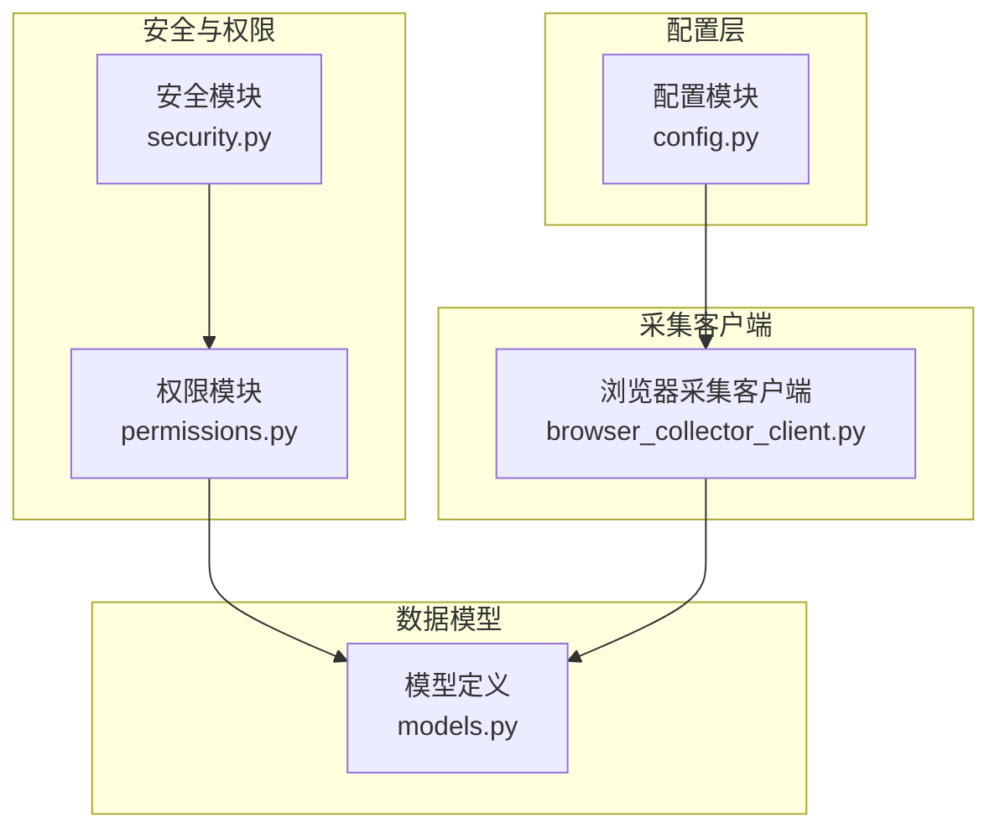
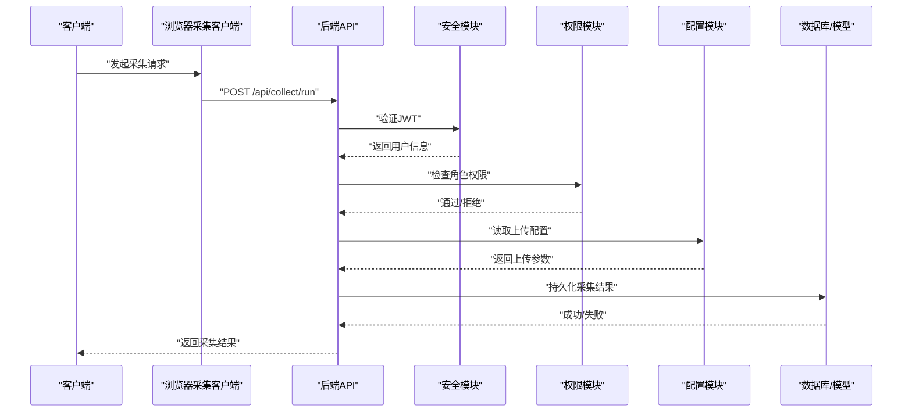
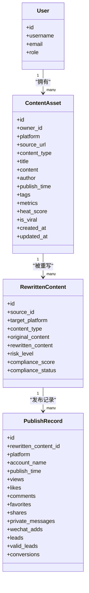
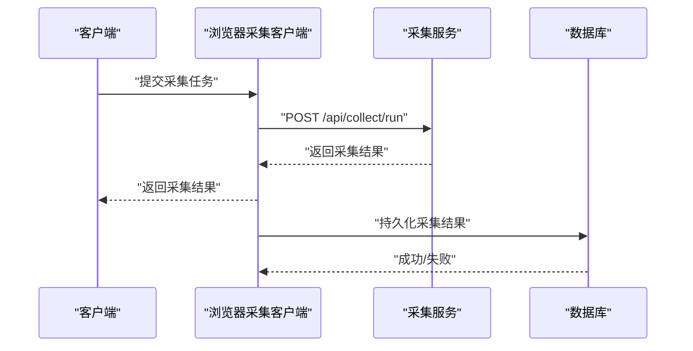
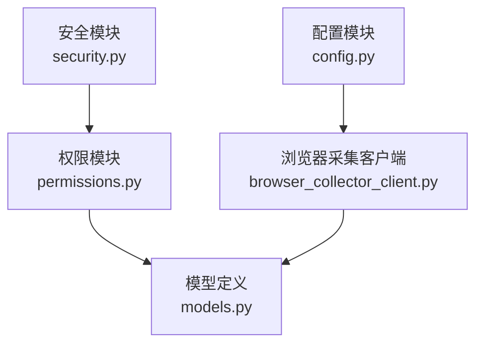

# 存储服务集成

<cite>
**本文引用的文件**
- [backend/app/integrations/storage/__init__.py](file://backend/app/integrations/storage/__init__.py)
- [backend/app/core/config.py](file://backend/app/core/config.py)
- [backend/app/core/security.py](file://backend/app/core/security.py)
- [backend/app/core/permissions.py](file://backend/app/core/permissions.py)
- [backend/app/models/models.py](file://backend/app/models/models.py)
- [backend/app/services/collector/browser_collector_client.py](file://backend/app/services/collector/browser_collector_client.py)
</cite>

## 目录
1. [简介](#简介)
2. [项目结构](#项目结构)
3. [核心组件](#核心组件)
4. [架构总览](#架构总览)
5. [详细组件分析](#详细组件分析)
6. [依赖分析](#依赖分析)
7. [性能考虑](#性能考虑)
8. [故障排查指南](#故障排查指南)
9. [结论](#结论)
10. [附录](#附录)

## 简介
本技术文档围绕“存储服务集成”展开，目标是为对象存储服务提供一套完整的配置、使用与运维指南。文档重点涵盖以下方面：
- 存储桶管理、文件上传下载与访问控制
- 接口抽象与实现模式（本地存储、云存储等）
- 文件生命周期管理、版本控制与备份策略
- 存储配额管理、访问日志与监控指标
- 性能优化（CDN 加速、缓存策略）
- 与内容采集与发布系统的数据流转机制
- 安全配置与权限管理最佳实践

当前代码库中与存储直接相关的核心文件集中在配置模块、模型定义以及浏览器采集客户端中。由于存储适配层目前处于占位状态，本文将基于现有文件进行架构性设计与实施建议，帮助团队快速落地本地存储与后续扩展至云存储。

## 项目结构
与存储服务集成相关的关键目录与文件如下：
- 配置层：集中于配置模块，提供上传大小限制、上传目录等基础参数
- 权限与安全：安全中间件与权限校验用于访问控制
- 数据模型：内容资产与物料等实体模型，体现内容与存储的关系
- 采集客户端：浏览器采集服务客户端，用于触发采集流程

图表来源
- [backend/app/core/config.py:91-94](file://backend/app/core/config.py#L91-L94)
- [backend/app/core/security.py:1-57](file://backend/app/core/security.py#L1-L57)
- [backend/app/core/permissions.py:1-30](file://backend/app/core/permissions.py#L1-L30)
- [backend/app/models/models.py:45-84](file://backend/app/models/models.py#L45-L84)
- [backend/app/services/collector/browser_collector_client.py:1-40](file://backend/app/services/collector/browser_collector_client.py#L1-L40)

章节来源
- [backend/app/core/config.py:91-94](file://backend/app/core/config.py#L91-L94)
- [backend/app/core/security.py:1-57](file://backend/app/core/security.py#L1-L57)
- [backend/app/core/permissions.py:1-30](file://backend/app/core/permissions.py#L1-L30)
- [backend/app/models/models.py:45-84](file://backend/app/models/models.py#L45-L84)
- [backend/app/services/collector/browser_collector_client.py:1-40](file://backend/app/services/collector/browser_collector_client.py#L1-L40)

## 核心组件
- 配置模块：提供上传大小限制与本地上传目录等参数，作为存储行为的基础约束
- 安全模块：提供密码哈希、JWT 签发与校验能力，保障访问安全
- 权限模块：基于角色的访问控制（RBAC），确保用户对资源的操作权限
- 模型定义：内容资产与物料等实体模型，承载内容元数据与与存储的关系
- 采集客户端：封装浏览器采集服务的调用，触发内容采集流程

章节来源
- [backend/app/core/config.py:91-94](file://backend/app/core/config.py#L91-L94)
- [backend/app/core/security.py:18-39](file://backend/app/core/security.py#L18-L39)
- [backend/app/core/permissions.py:9-29](file://backend/app/core/permissions.py#L9-L29)
- [backend/app/models/models.py:45-84](file://backend/app/models/models.py#L45-L84)
- [backend/app/services/collector/browser_collector_client.py:16-31](file://backend/app/services/collector/browser_collector_client.py#L16-L31)

## 架构总览
下图展示了与存储服务集成相关的高层交互：采集客户端触发采集流程，安全与权限模块参与访问控制，配置模块提供上传参数，模型层承载内容与存储关系。

图表来源
- [backend/app/services/collector/browser_collector_client.py:16-31](file://backend/app/services/collector/browser_collector_client.py#L16-L31)
- [backend/app/core/security.py:42-56](file://backend/app/core/security.py#L42-L56)
- [backend/app/core/permissions.py:12-27](file://backend/app/core/permissions.py#L12-L27)
- [backend/app/core/config.py:91-94](file://backend/app/core/config.py#L91-L94)
- [backend/app/models/models.py:45-84](file://backend/app/models/models.py#L45-L84)

## 详细组件分析

### 组件一：配置与上传参数
- 作用：集中管理上传大小限制与本地上传目录路径
- 关键点：
  - 上传大小限制用于前端与后端统一约束
  - 本地上传目录用于落盘存储
- 实施建议：
  - 生产环境建议将上传目录指向对象存储或分布式文件系统
  - 对于大文件，建议结合 CDN 与分片上传策略

章节来源
- [backend/app/core/config.py:91-94](file://backend/app/core/config.py#L91-L94)

### 组件二：安全与访问控制
- 作用：提供密码哈希、JWT 签发与校验，以及基于角色的权限检查
- 关键点：
  - JWT 令牌签发与过期时间控制
  - 角色校验用于限制敏感操作
- 实施建议：
  - 强制使用 HTTPS 传输
  - 严格管理 SECRET_KEY，避免默认占位值
  - 结合速率限制与 IP 白名单

章节来源
- [backend/app/core/security.py:18-39](file://backend/app/core/security.py#L18-L39)
- [backend/app/core/security.py:42-56](file://backend/app/core/security.py#L42-L56)
- [backend/app/core/permissions.py:9-29](file://backend/app/core/permissions.py#L9-L29)

### 组件三：内容资产与存储关系
- 作用：内容资产模型承载内容元数据，为存储与检索提供基础
- 关键点：
  - 内容资产与用户、重写内容、块、评论、快照、洞察等关联
  - 发布记录与发布任务模型体现内容生命周期
- 实施建议：
  - 将媒体资源与内容资产解耦，采用独立的附件表或对象存储键管理
  - 为内容资产建立索引以支持高效检索

图表来源
- [backend/app/models/models.py:8-27](file://backend/app/models/models.py#L8-L27)
- [backend/app/models/models.py:45-84](file://backend/app/models/models.py#L45-L84)
- [backend/app/models/models.py:156-182](file://backend/app/models/models.py#L156-L182)
- [backend/app/models/models.py:259-289](file://backend/app/models/models.py#L259-L289)

章节来源
- [backend/app/models/models.py:8-27](file://backend/app/models/models.py#L8-L27)
- [backend/app/models/models.py:45-84](file://backend/app/models/models.py#L45-L84)
- [backend/app/models/models.py:156-182](file://backend/app/models/models.py#L156-L182)
- [backend/app/models/models.py:259-289](file://backend/app/models/models.py#L259-L289)

### 组件四：采集流程与存储衔接
- 作用：浏览器采集客户端负责触发采集任务，并将结果写入数据库
- 关键点：
  - 通过 HTTP 客户端向采集服务发送请求
  - 返回结果包含采集到的内容与元数据
- 实施建议：
  - 在采集完成后，将媒体资源上传至对象存储，并记录存储键
  - 对采集结果进行去重与质量评分，减少无效存储

图表来源
- [backend/app/services/collector/browser_collector_client.py:16-31](file://backend/app/services/collector/browser_collector_client.py#L16-L31)
- [backend/app/models/models.py:45-84](file://backend/app/models/models.py#L45-L84)

章节来源
- [backend/app/services/collector/browser_collector_client.py:16-31](file://backend/app/services/collector/browser_collector_client.py#L16-L31)
- [backend/app/models/models.py:45-84](file://backend/app/models/models.py#L45-L84)

### 组件五：存储适配层（占位与扩展）
- 现状：存储适配层文件存在但为空，尚未实现具体适配逻辑
- 建议：
  - 定义统一的存储接口（如上传、下载、删除、列举、签名 URL 等）
  - 提供本地文件系统与对象存储（如 S3、MinIO、OSS）的实现
  - 支持多后端切换与配置化路由

章节来源
- [backend/app/integrations/storage/__init__.py:1-2](file://backend/app/integrations/storage/__init__.py#L1-L2)

## 依赖分析
- 配置模块被采集客户端直接依赖，用于读取采集超时与基础 URL
- 安全与权限模块贯穿于访问控制链路，为存储相关操作提供鉴权与授权
- 模型层为存储与检索提供数据基础，内容资产与发布记录等模型与存储键管理密切相关

图表来源
- [backend/app/core/config.py:91-94](file://backend/app/core/config.py#L91-L94)
- [backend/app/services/collector/browser_collector_client.py:13-14](file://backend/app/services/collector/browser_collector_client.py#L13-L14)
- [backend/app/core/security.py:42-56](file://backend/app/core/security.py#L42-L56)
- [backend/app/core/permissions.py:12-27](file://backend/app/core/permissions.py#L12-L27)
- [backend/app/models/models.py:45-84](file://backend/app/models/models.py#L45-L84)

章节来源
- [backend/app/core/config.py:91-94](file://backend/app/core/config.py#L91-L94)
- [backend/app/services/collector/browser_collector_client.py:13-14](file://backend/app/services/collector/browser_collector_client.py#L13-L14)
- [backend/app/core/security.py:42-56](file://backend/app/core/security.py#L42-L56)
- [backend/app/core/permissions.py:12-27](file://backend/app/core/permissions.py#L12-L27)
- [backend/app/models/models.py:45-84](file://backend/app/models/models.py#L45-L84)

## 性能考虑
- CDN 加速：对静态资源（图片、视频、文档）启用 CDN，缩短用户访问路径
- 缓存策略：针对热点内容设置合理的缓存头与缓存层，降低后端压力
- 上传优化：结合断点续传与分片上传，提升大文件上传稳定性
- 数据压缩：对文本类内容启用压缩传输，减少带宽占用
- 监控与告警：建立存储容量、请求延迟、错误率等指标监控体系

## 故障排查指南
- 上传失败
  - 检查上传大小是否超过限制
  - 确认上传目录权限与磁盘空间
- 权限错误
  - 核对 JWT 是否有效与过期
  - 检查用户角色是否具备相应权限
- 采集异常
  - 查看采集服务地址与超时配置
  - 检查网络连通性与服务可用性

章节来源
- [backend/app/core/config.py:91-94](file://backend/app/core/config.py#L91-L94)
- [backend/app/core/security.py:42-56](file://backend/app/core/security.py#L42-L56)
- [backend/app/core/permissions.py:12-27](file://backend/app/core/permissions.py#L12-L27)
- [backend/app/services/collector/browser_collector_client.py:13-14](file://backend/app/services/collector/browser_collector_client.py#L13-L14)

## 结论
当前代码库已具备存储服务集成的基础能力：配置参数、安全与权限控制、内容模型与采集流程。建议尽快完善存储适配层，实现本地与云存储的统一抽象，并配套版本控制、生命周期管理与备份策略。同时，结合 CDN 与缓存策略提升性能，完善监控与告警体系，确保系统在高并发与大规模数据场景下的稳定运行。

## 附录
- 最佳实践清单
  - 使用 HTTPS 与强密钥，定期轮换 SECRET_KEY
  - 对上传内容进行类型与大小校验
  - 为静态资源开启 CDN 与缓存
  - 建立存储容量与访问日志监控
  - 制定版本控制与备份策略，确保数据可恢复