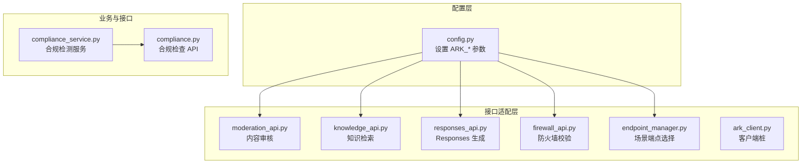
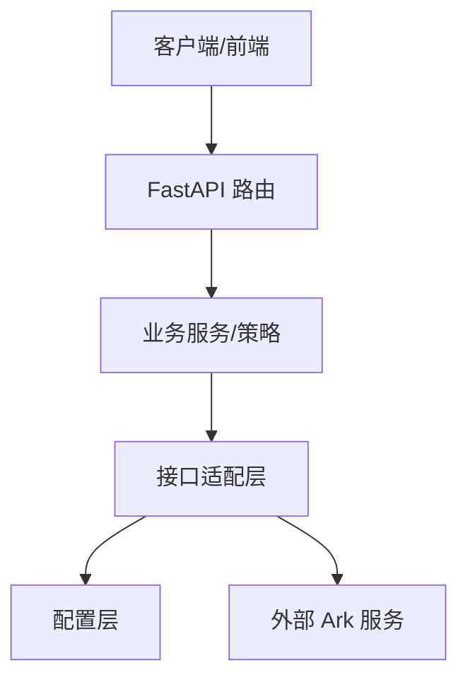
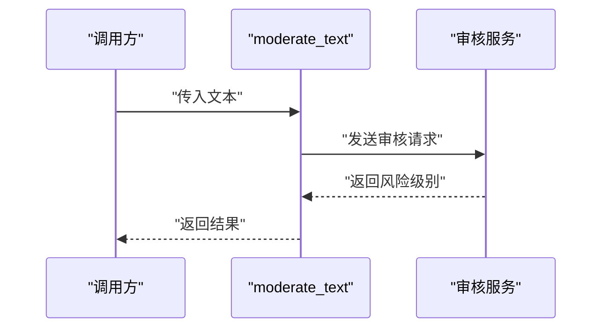
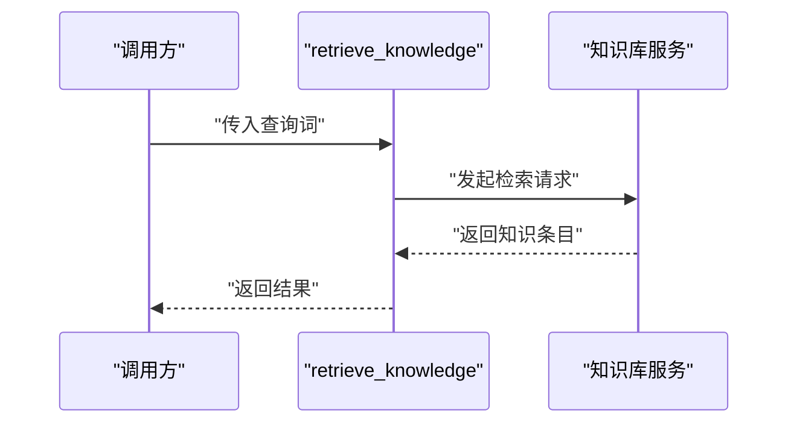
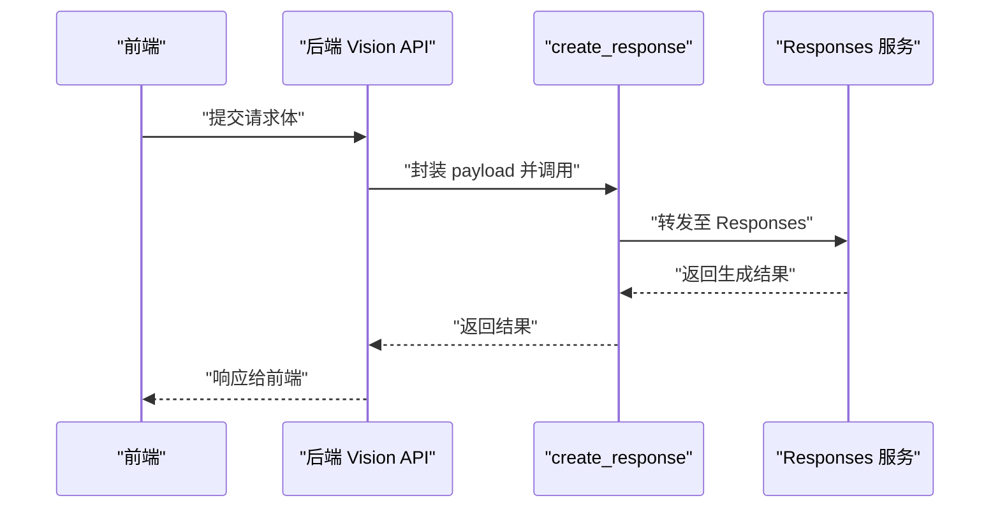
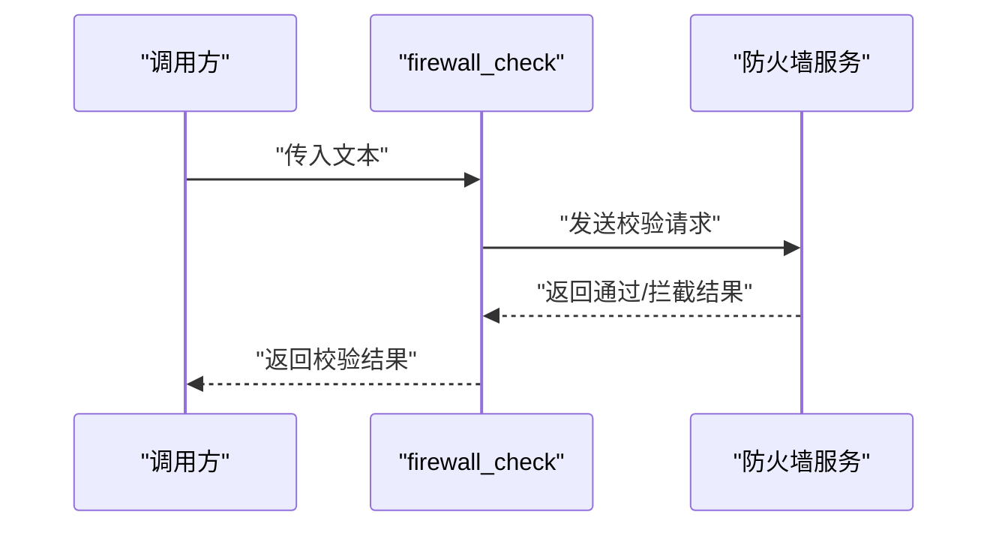
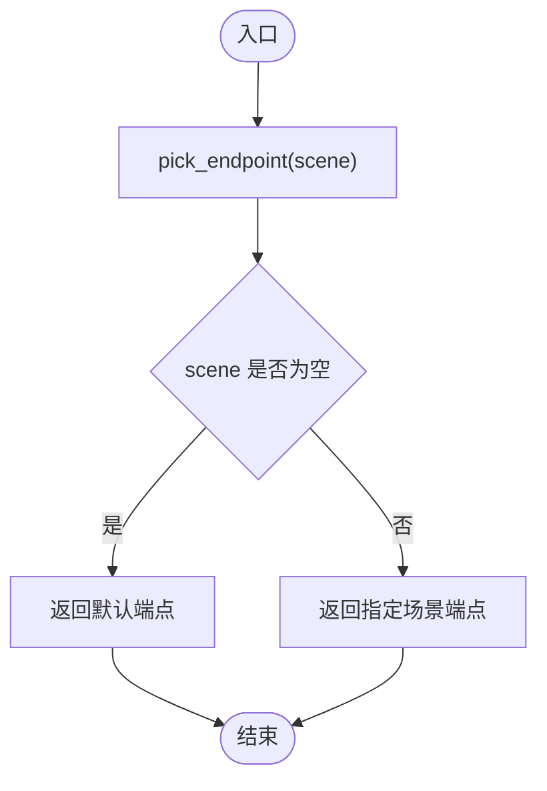
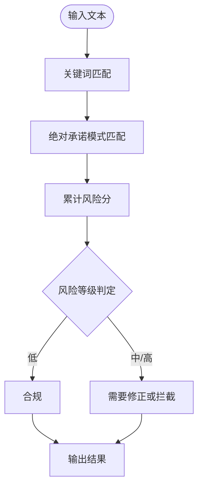
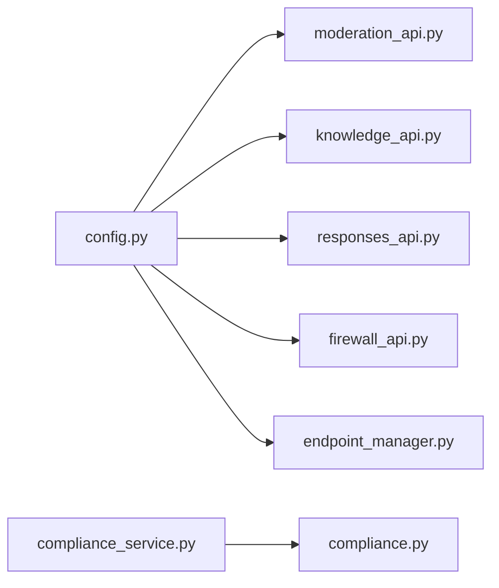

# 火山方舟集成

<cite>
**本文引用的文件**
- [ark_client.py](file://backend/app/integrations/volcengine/ark_client.py)
- [moderation_api.py](file://backend/app/integrations/volcengine/moderation_api.py)
- [knowledge_api.py](file://backend/app/integrations/volcengine/knowledge_api.py)
- [responses_api.py](file://backend/app/integrations/volcengine/responses_api.py)
- [firewall_api.py](file://backend/app/integrations/volcengine/firewall_api.py)
- [endpoint_manager.py](file://backend/app/integrations/volcengine/endpoint_manager.py)
- [config.py](file://backend/app/core/config.py)
- [compliance_service.py](file://backend/app/services/compliance_service.py)
- [compliance.py](file://backend/app/api/endpoints/compliance.py)
- [火山方舟_Responses_API_调用指南.md](file://backend/火山方舟_Responses_API_调用指南.md)
- [__init__.py](file://backend/app/integrations/volcengine/__init__.py)
</cite>

## 目录
1. [简介](#简介)
2. [项目结构](#项目结构)
3. [核心组件](#核心组件)
4. [架构总览](#架构总览)
5. [详细组件分析](#详细组件分析)
6. [依赖关系分析](#依赖关系分析)
7. [性能考虑](#性能考虑)
8. [故障排查指南](#故障排查指南)
9. [结论](#结论)
10. [附录](#附录)

## 简介
本文件面向火山方舟（Ark）在本项目的集成，系统化梳理内容审核、知识库检索、响应式生成（Responses）、防火墙校验等能力的实现与使用方法。文档覆盖以下方面：
- API 调用流程、参数配置与响应处理机制
- 风险检测算法的应用场景与阈值设定
- 错误码处理、重试策略与超时配置
- API 密钥管理、签名验证与安全传输最佳实践
- 性能监控指标与故障诊断方法

## 项目结构
火山方舟相关集成位于后端目录的 volcengine 子模块中，采用“接口适配层 + 配置 + 业务服务”的分层组织方式：
- 接口适配层：封装各 Ark 能力的本地函数（如 moderation_api、knowledge_api、responses_api、firewall_api），作为对外统一入口
- 配置层：集中于 settings，提供 ARK 相关的密钥、基础地址、模型、超时、限流等参数
- 业务服务层：合规检查服务（ComplianceService）用于内容风险评估
- API 层：FastAPI 路由提供合规检查接口

图表来源
- [config.py:76-84](file://backend/app/core/config.py#L76-L84)
- [moderation_api.py:1-3](file://backend/app/integrations/volcengine/moderation_api.py#L1-L3)
- [knowledge_api.py:1-4](file://backend/app/integrations/volcengine/knowledge_api.py#L1-L4)
- [responses_api.py:1-3](file://backend/app/integrations/volcengine/responses_api.py#L1-L3)
- [firewall_api.py:1-3](file://backend/app/integrations/volcengine/firewall_api.py#L1-L3)
- [endpoint_manager.py:1-3](file://backend/app/integrations/volcengine/endpoint_manager.py#L1-L3)
- [compliance_service.py:24-71](file://backend/app/services/compliance_service.py#L24-L71)
- [compliance.py:11-19](file://backend/app/api/endpoints/compliance.py#L11-L19)

章节来源
- [config.py:76-84](file://backend/app/core/config.py#L76-L84)
- [__init__.py:1-4](file://backend/app/integrations/volcengine/__init__.py#L1-L4)

## 核心组件
- 内容审核 API（moderation_api.py）
  - 功能：对文本进行风险等级判定
  - 输入：文本字符串
  - 输出：包含文本与风险级别的字典
  - 使用建议：结合风控策略与阈值进行二次判断
- 知识库 API（knowledge_api.py）
  - 功能：根据查询词检索知识条目
  - 输入：查询字符串
  - 输出：知识条目列表
  - 使用建议：作为 RAG 或规则匹配的前置步骤
- 响应式 API（responses_api.py）
  - 功能：调用 Responses 生成能力（图像+文本输入）
  - 输入：payload（包含模型、输入内容等）
  - 输出：原始 payload 或生成结果
  - 项目集成参考：后端 Vision API 与前端入口
- 防火墙 API（firewall_api.py）
  - 功能：对文本进行安全校验
  - 输入：文本字符串
  - 输出：包含是否通过与原文本的字典
  - 使用建议：前置校验，拦截高风险内容
- 场景端点管理（endpoint_manager.py）
  - 功能：根据场景选择端点
  - 输入：场景标识
  - 输出：端点地址
- 配置（config.py）
  - 关键参数：ARK_API_KEY、ARK_BASE_URL、ARK_MODEL、ARK_TIMEOUT_SECONDS、限流参数
  - 安全校验：密钥长度与默认值检查
- 合规服务（compliance_service.py）
  - 功能：关键词与模式匹配，计算风险分与等级
  - 输入：文本
  - 输出：风险等级、分数、建议与合规性标记
- 合规 API（compliance.py）
  - 功能：对外提供合规检查接口
  - 输入：请求体（包含内容）
  - 输出：合规检查结果

章节来源
- [moderation_api.py:1-3](file://backend/app/integrations/volcengine/moderation_api.py#L1-L3)
- [knowledge_api.py:1-4](file://backend/app/integrations/volcengine/knowledge_api.py#L1-L4)
- [responses_api.py:1-3](file://backend/app/integrations/volcengine/responses_api.py#L1-L3)
- [firewall_api.py:1-3](file://backend/app/integrations/volcengine/firewall_api.py#L1-L3)
- [endpoint_manager.py:1-3](file://backend/app/integrations/volcengine/endpoint_manager.py#L1-L3)
- [config.py:76-84](file://backend/app/core/config.py#L76-L84)
- [compliance_service.py:24-71](file://backend/app/services/compliance_service.py#L24-L71)
- [compliance.py:11-19](file://backend/app/api/endpoints/compliance.py#L11-L19)

## 架构总览
火山方舟集成采用“配置驱动 + 本地适配 + 业务服务”的架构：
- 配置层集中管理密钥、基础地址、模型与限流参数
- 适配层将外部 API 封装为本地函数，便于统一调用与替换
- 业务服务层负责内容合规与风控策略
- API 层对外暴露接口，串联适配层与业务层

图表来源
- [config.py:76-84](file://backend/app/core/config.py#L76-L84)
- [moderation_api.py:1-3](file://backend/app/integrations/volcengine/moderation_api.py#L1-L3)
- [knowledge_api.py:1-4](file://backend/app/integrations/volcengine/knowledge_api.py#L1-L4)
- [responses_api.py:1-3](file://backend/app/integrations/volcengine/responses_api.py#L1-L3)
- [firewall_api.py:1-3](file://backend/app/integrations/volcengine/firewall_api.py#L1-L3)
- [compliance_service.py:24-71](file://backend/app/services/compliance_service.py#L24-L71)
- [compliance.py:11-19](file://backend/app/api/endpoints/compliance.py#L11-L19)

## 详细组件分析

### 内容审核 API（moderation_api）
- 调用流程
  - 输入文本 → 本地函数 moderate_text → 返回包含风险级别的结构
- 参数与响应
  - 输入：文本字符串
  - 输出：包含文本与风险级别字段的字典
- 风险阈值与策略
  - 当前实现返回固定低风险示例，实际集成需对接真实审核服务并设置阈值
- 错误处理与重试
  - 建议：捕获网络异常与非 2xx 状态码，按指数退避重试
- 超时配置
  - 使用全局 ARK_TIMEOUT_SECONDS 控制调用超时

图表来源
- [moderation_api.py:1-3](file://backend/app/integrations/volcengine/moderation_api.py#L1-L3)
- [config.py:80](file://backend/app/core/config.py#L80)

章节来源
- [moderation_api.py:1-3](file://backend/app/integrations/volcengine/moderation_api.py#L1-L3)
- [config.py:80](file://backend/app/core/config.py#L80)

### 知识库 API（knowledge_api）
- 调用流程
  - 输入查询词 → 本地函数 retrieve_knowledge → 返回知识条目列表
- 参数与响应
  - 输入：查询字符串
  - 输出：知识条目列表
- 集成建议
  - 可作为 RAG 的检索器，配合 rerank 与排序提升召回质量
- 错误处理与重试
  - 建议：对网络与服务异常进行重试与熔断保护
- 超时配置
  - 使用全局 ARK_TIMEOUT_SECONDS 控制调用超时

图表来源
- [knowledge_api.py:1-4](file://backend/app/integrations/volcengine/knowledge_api.py#L1-L4)
- [config.py:80](file://backend/app/core/config.py#L80)

章节来源
- [knowledge_api.py:1-4](file://backend/app/integrations/volcengine/knowledge_api.py#L1-L4)
- [config.py:80](file://backend/app/core/config.py#L80)

### 响应式 API（responses_api）
- 调用流程
  - 输入 payload → 本地函数 create_response → 返回生成结果
- 参数与响应
  - 输入：包含模型与输入内容的 payload
  - 输出：生成结果（示例返回原 payload）
- 项目集成参考
  - 后端 Vision API：POST /api/ai/ark/vision
  - 前端入口：AI 页面中的“火山引擎图片理解（Ark Responses）”
- 请求体示例
  - 包含 image_url、text、model 等字段
- 日志与限流
  - 记录请求开始/成功/失败、耗时、token 用量
  - 对 /api/ai/ark/vision 进行每分钟调用次数限制
- 配置项
  - ARK_TIMEOUT_SECONDS、ARK_VISION_RATE_LIMIT_PER_MINUTE、ARK_VISION_RATE_LIMIT_WINDOW_SECONDS、USE_REDIS_RATE_LIMIT、REDIS_URL、RATE_LIMIT_KEY_PREFIX

图表来源
- [responses_api.py:1-3](file://backend/app/integrations/volcengine/responses_api.py#L1-L3)
- [火山方舟_Responses_API_调用指南.md:140-153](file://backend/火山方舟_Responses_API_调用指南.md#L140-L153)
- [config.py:80-82](file://backend/app/core/config.py#L80-L82)

章节来源
- [responses_api.py:1-3](file://backend/app/integrations/volcengine/responses_api.py#L1-L3)
- [火山方舟_Responses_API_调用指南.md:140-153](file://backend/火山方舟_Responses_API_调用指南.md#L140-L153)
- [config.py:80-82](file://backend/app/core/config.py#L80-L82)

### 防火墙 API（firewall_api）
- 调用流程
  - 输入文本 → 本地函数 firewall_check → 返回是否通过与原文本
- 参数与响应
  - 输入：文本字符串
  - 输出：包含 pass 字段与原文本的字典
- 集成建议
  - 在内容进入审核与生成前执行，拦截高风险文本
- 错误处理与重试
  - 建议：对网络异常进行重试，失败时回退到安全策略

图表来源
- [firewall_api.py:1-3](file://backend/app/integrations/volcengine/firewall_api.py#L1-L3)

章节来源
- [firewall_api.py:1-3](file://backend/app/integrations/volcengine/firewall_api.py#L1-L3)

### 场景端点管理（endpoint_manager）
- 功能：根据场景选择端点地址
- 输入：场景标识
- 输出：端点地址（默认返回场景或默认值）

图表来源
- [endpoint_manager.py:1-3](file://backend/app/integrations/volcengine/endpoint_manager.py#L1-L3)

章节来源
- [endpoint_manager.py:1-3](file://backend/app/integrations/volcengine/endpoint_manager.py#L1-L3)

### 合规服务与 API（compliance_service 与 compliance）
- 合规服务
  - 关键词与正则模式匹配，计算风险分与等级
  - 输出：风险等级、分数、风险点、建议与合规性标记
- 合规 API
  - 对外提供 /api/compliance/check 接口，返回合规检查结果
- 风险阈值
  - 当前阈值与等级划分在服务内部定义，可根据业务调整

图表来源
- [compliance_service.py:24-71](file://backend/app/services/compliance_service.py#L24-L71)
- [compliance.py:11-19](file://backend/app/api/endpoints/compliance.py#L11-L19)

章节来源
- [compliance_service.py:24-71](file://backend/app/services/compliance_service.py#L24-L71)
- [compliance.py:11-19](file://backend/app/api/endpoints/compliance.py#L11-L19)

## 依赖关系分析
- 组件耦合
  - 适配层与配置层松耦合，通过 settings 注入参数
  - 业务服务与适配层通过函数调用交互，便于替换与测试
- 外部依赖
  - ARK 服务（Responses、审核、知识库、防火墙）
  - Redis（分布式限流降级）
- 潜在风险
  - 未实现真实调用时，当前适配层为本地桩，需及时替换为真实 SDK/HTTP 客户端
  - 缺少统一的错误码映射与重试策略

图表来源
- [config.py:76-84](file://backend/app/core/config.py#L76-L84)
- [moderation_api.py:1-3](file://backend/app/integrations/volcengine/moderation_api.py#L1-L3)
- [knowledge_api.py:1-4](file://backend/app/integrations/volcengine/knowledge_api.py#L1-L4)
- [responses_api.py:1-3](file://backend/app/integrations/volcengine/responses_api.py#L1-L3)
- [firewall_api.py:1-3](file://backend/app/integrations/volcengine/firewall_api.py#L1-L3)
- [endpoint_manager.py:1-3](file://backend/app/integrations/volcengine/endpoint_manager.py#L1-L3)
- [compliance_service.py:24-71](file://backend/app/services/compliance_service.py#L24-L71)
- [compliance.py:11-19](file://backend/app/api/endpoints/compliance.py#L11-L19)

章节来源
- [config.py:76-84](file://backend/app/core/config.py#L76-L84)
- [compliance.py:11-19](file://backend/app/api/endpoints/compliance.py#L11-L19)

## 性能考虑
- 超时控制
  - 使用 ARK_TIMEOUT_SECONDS 控制单次调用超时，避免阻塞
- 限流策略
  - 对 Responses 视觉能力进行每分钟调用次数限制
  - 支持 Redis 分布式限流，不可用时自动降级
- 监控指标
  - 调用统计看板支持：调用次数、失败次数、失败率、输入/输出 tokens、平均延迟
- 优化建议
  - 批量请求与并发控制
  - 结果缓存与预热
  - 服务端压缩与连接池复用

章节来源
- [config.py:80-82](file://backend/app/core/config.py#L80-L82)
- [火山方舟_Responses_API_调用指南.md:169-197](file://backend/火山方舟_Responses_API_调用指南.md#L169-L197)

## 故障排查指南
- 常见问题
  - API Key 未配置或无效：检查环境变量与配置文件
  - 超时与限流：调整 ARK_TIMEOUT_SECONDS 与限流参数
  - Redis 不可用：确认降级逻辑生效，必要时切换为本地限流
- 日志与观测
  - 记录请求开始/成功/失败、耗时、token 用量
  - 使用调用统计看板进行趋势分析
- 重试与熔断
  - 对网络异常与 5xx 错误进行指数退避重试
  - 超过阈值触发熔断，保护下游系统

章节来源
- [config.py:76-84](file://backend/app/core/config.py#L76-L84)
- [火山方舟_Responses_API_调用指南.md:155-167](file://backend/火山方舟_Responses_API_调用指南.md#L155-L167)

## 结论
本项目对火山方舟的集成采用“配置驱动 + 本地适配 + 业务服务”的清晰分层，满足内容审核、知识检索、响应生成与安全校验的扩展需求。建议尽快替换本地桩为真实 SDK/HTTP 客户端，完善错误码映射、重试与熔断策略，并持续优化监控与限流配置，确保在高并发场景下的稳定性与可观测性。

## 附录
- API 密钥管理与安全传输
  - 使用环境变量注入密钥，避免硬编码
  - 定期轮换密钥，启用 HTTPS 传输
- 风险检测算法与阈值
  - 合规服务内置关键词与模式匹配，阈值与等级划分可按业务调整
- 调用统计看板
  - GET /api/dashboard/ai-call-stats 支持按天数与范围统计

章节来源
- [火山方舟_Responses_API_调用指南.md:169-197](file://backend/火山方舟_Responses_API_调用指南.md#L169-L197)
- [compliance_service.py:24-71](file://backend/app/services/compliance_service.py#L24-L71)