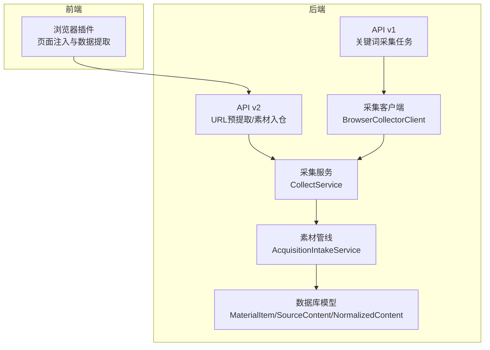
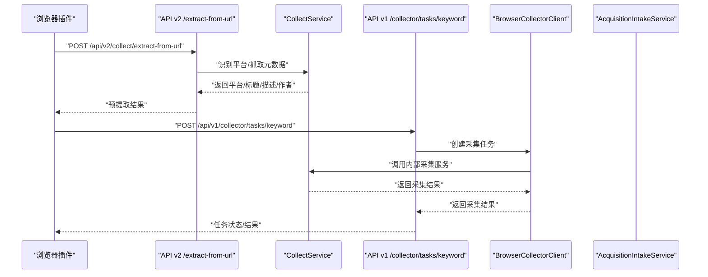
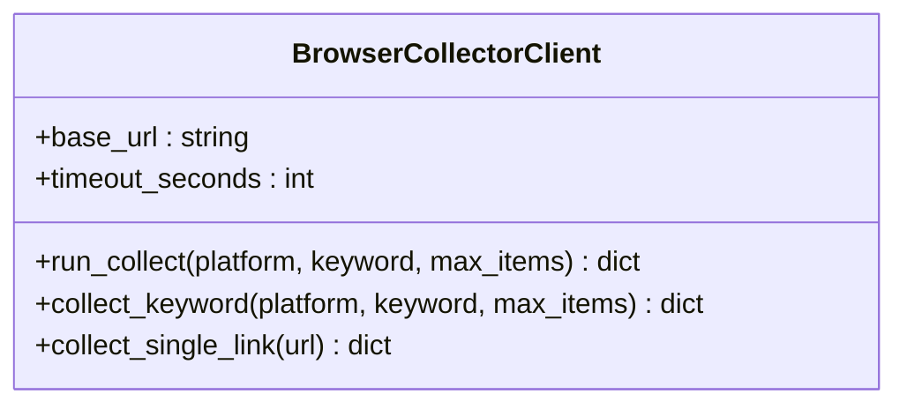
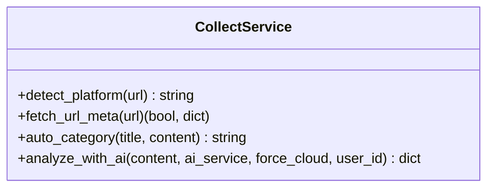
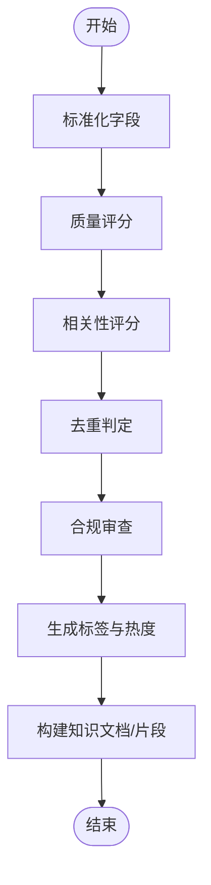
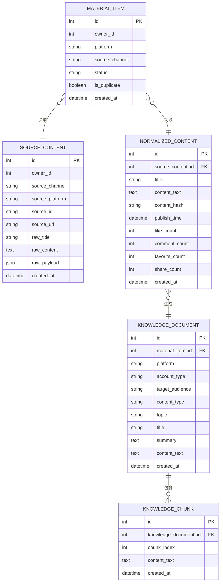
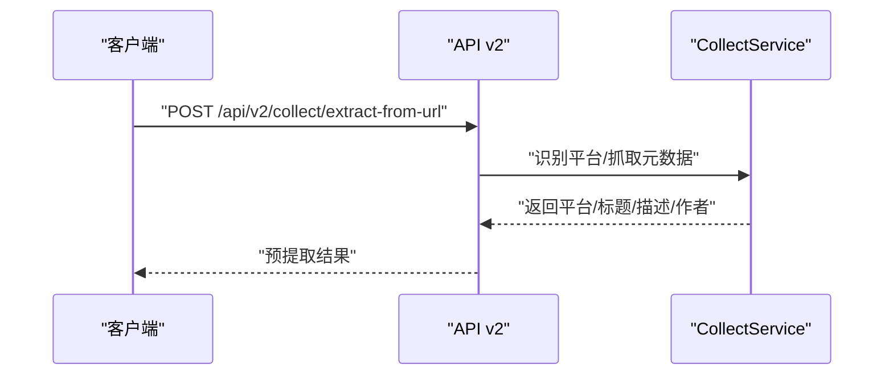
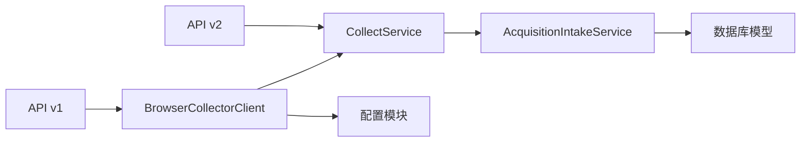

# 第三方平台对接

<cite>
**本文引用的文件**
- [browser_collector_client.py](file://backend/app/services/collector/browser_collector_client.py)
- [material_pipeline_service.py](file://backend/app/services/collector/material_pipeline_service.py)
- [collect_service.py](file://backend/app/domains/acquisition/collect_service.py)
- [config.py](file://backend/app/core/config.py)
- [models.py](file://backend/app/models/models.py)
- [collect.py（v1）](file://backend/app/api/v1/endpoints/collect.py)
- [collect.py（v2）](file://backend/app/api/v2/endpoints/collect.py)
- [collect.py（旧接口）](file://backend/app/api/endpoints/collect.py)
- [douyin.yaml](file://backend/app/rules/local/douyin.yaml)
- [xiaohongshu.yaml](file://backend/app/rules/local/xiaohongshu.yaml)
- [zhihu.yaml](file://backend/app/rules/local/zhihu.yaml)
- [db_sync.py](file://backend/app/rule/sync/db_sync.py)
- [knowledge_sync.py](file://backend/app/rule/sync/knowledge_sync.py)
- [integration_test_pipeline.py](file://scripts/integration_test_pipeline.py)
- [采集与素材重构执行任务单_2026-03-24.md](file://docs/architecture/采集与素材重构执行任务单_2026-03-24.md)
</cite>

## 目录
1. [简介](#简介)
2. [项目结构](#项目结构)
3. [核心组件](#核心组件)
4. [架构总览](#架构总览)
5. [详细组件分析](#详细组件分析)
6. [依赖关系分析](#依赖关系分析)
7. [性能考量](#性能考量)
8. [故障排查指南](#故障排查指南)
9. [结论](#结论)
10. [附录](#附录)

## 简介
本文件面向第三方平台对接，系统性阐述浏览器插件采集客户端的实现原理与配置方法，覆盖页面注入、数据提取与通信协议；深入解析内容采集的通用模式与扩展机制，包括新平台接入流程、数据标准化与质量控制；说明数据库与知识库的同步策略（增量、冲突处理与一致性）；给出平台API适配器设计模式与实现示例；提供对接新平台的开发指南与最佳实践，并解释数据安全、隐私保护与合规要求。

## 项目结构
后端采用分层架构：API 层负责路由与鉴权，领域服务封装采集与素材处理逻辑，数据模型定义持久化结构，配置模块集中管理外部服务地址与超时参数。采集链路由浏览器插件触发，经采集客户端调用内部采集服务，最终进入素材入仓与知识库构建流程。

图表来源
- [collect.py（v1）:18-34](file://backend/app/api/v1/endpoints/collect.py#L18-L34)
- [collect.py（v2）:172-197](file://backend/app/api/v2/endpoints/collect.py#L172-L197)
- [collect_service.py:78-84](file://backend/app/domains/acquisition/collect_service.py#L78-L84)
- [browser_collector_client.py:16-30](file://backend/app/services/collector/browser_collector_client.py#L16-L30)
- [material_pipeline_service.py:30-120](file://backend/app/services/collector/material_pipeline_service.py#L30-L120)
- [models.py:45-120](file://backend/app/models/models.py#L45-L120)

章节来源
- [collect.py（v1）:18-34](file://backend/app/api/v1/endpoints/collect.py#L18-L34)
- [collect.py（v2）:172-197](file://backend/app/api/v2/endpoints/collect.py#L172-L197)
- [collect_service.py:78-84](file://backend/app/domains/acquisition/collect_service.py#L78-L84)
- [browser_collector_client.py:16-30](file://backend/app/services/collector/browser_collector_client.py#L16-L30)
- [material_pipeline_service.py:30-120](file://backend/app/services/collector/material_pipeline_service.py#L30-L120)
- [models.py:45-120](file://backend/app/models/models.py#L45-L120)

## 核心组件
- 浏览器采集客户端：封装与内部采集服务的通信，统一请求体与超时控制。
- 采集服务：平台识别、URL元数据提取、AI辅助分类与热度分析。
- 素材管线：数据标准化、质量评分、去重、合规审查、知识库构建与分块。
- 数据模型：定义素材、源内容、标准化内容、知识文档与片段等实体。
- API 层：v1 关键词任务与 v2 URL 预提取/入仓接口，以及旧接口迁移提示。

章节来源
- [browser_collector_client.py:9-40](file://backend/app/services/collector/browser_collector_client.py#L9-L40)
- [collect_service.py:74-285](file://backend/app/domains/acquisition/collect_service.py#L74-L285)
- [material_pipeline_service.py:30-800](file://backend/app/services/collector/material_pipeline_service.py#L30-L800)
- [models.py:45-120](file://backend/app/models/models.py#L45-L120)
- [collect.py（v1）:18-34](file://backend/app/api/v1/endpoints/collect.py#L18-L34)
- [collect.py（v2）:172-197](file://backend/app/api/v2/endpoints/collect.py#L172-L197)
- [collect.py（旧接口）:16-20](file://backend/app/api/endpoints/collect.py#L16-L20)

## 架构总览
采集链路从浏览器插件或桌面端触发，通过 API v2 的 URL 预提取能力识别平台并抓取页面元信息；若需批量/自动化采集，则由 API v1 创建关键词采集任务，采集客户端调用内部采集服务，最终进入素材入仓与知识库构建。

图表来源
- [collect.py（v2）:172-197](file://backend/app/api/v2/endpoints/collect.py#L172-L197)
- [collect.py（v1）:18-34](file://backend/app/api/v1/endpoints/collect.py#L18-L34)
- [browser_collector_client.py:16-30](file://backend/app/services/collector/browser_collector_client.py#L16-L30)
- [collect_service.py:78-84](file://backend/app/domains/acquisition/collect_service.py#L78-L84)

## 详细组件分析

### 浏览器采集客户端（BrowserCollectorClient）
- 职责：封装与内部采集服务的通信，构造统一请求体，设置超时与去重策略。
- 关键点：
  - 请求体包含平台、关键词/链接、最大条数、是否需要详情、是否需要评论、去重开关与超时秒数。
  - 通过配置模块读取基础地址与超时，确保跨环境一致。
  - 支持按关键词与单链接采集，单链接采集前进行平台识别，不支持的平台直接报错。

图表来源
- [browser_collector_client.py:9-40](file://backend/app/services/collector/browser_collector_client.py#L9-L40)

章节来源
- [browser_collector_client.py:9-40](file://backend/app/services/collector/browser_collector_client.py#L9-L40)
- [config.py:98-101](file://backend/app/core/config.py#L98-L101)

### 采集服务（CollectService）
- 职责：平台识别、HTML 元信息提取、AI 分类与热度分析、统计与查询。
- 关键点：
  - 平台识别基于正则匹配，支持小红书、抖音、知乎、公众号、咸鱼、微博、B站、快手、头条等。
  - URL 元信息提取优先 Open Graph/Twitter/Author 等标准字段，清洗 HTML 标签与实体。
  - 提供 AI 分析能力，返回标签、分类、热度、是否爆款、卖点与改写建议等。

图表来源
- [collect_service.py:74-285](file://backend/app/domains/acquisition/collect_service.py#L74-L285)

章节来源
- [collect_service.py:18-84](file://backend/app/domains/acquisition/collect_service.py#L18-L84)
- [collect_service.py:118-158](file://backend/app/domains/acquisition/collect_service.py#L118-L158)
- [collect_service.py:224-285](file://backend/app/domains/acquisition/collect_service.py#L224-L285)

### 素材管线（AcquisitionIntakeService）
- 职责：采集数据的标准化、质量与相关性评分、去重、合规审查、生成素材标签与知识库构建。
- 关键点：
  - 标准化：统一标题、正文、作者、封面、发布时间、点赞/评论/收藏/分享等字段。
  - 质量与相关性：基于长度、字段完整性、关键词命中等计算分数。
  - 去重：优先按 source_id，其次按内容哈希。
  - 合规审查：结合自定义风险词与合规服务，二次校验与纠偏。
  - 知识库：按内容分块构建知识文档与片段，标注账号类型、受众、内容类型、主题等。

图表来源
- [material_pipeline_service.py:228-259](file://backend/app/services/collector/material_pipeline_service.py#L228-L259)
- [material_pipeline_service.py:272-291](file://backend/app/services/collector/material_pipeline_service.py#L272-L291)
- [material_pipeline_service.py:660-694](file://backend/app/services/collector/material_pipeline_service.py#L660-L694)
- [material_pipeline_service.py:591-627](file://backend/app/services/collector/material_pipeline_service.py#L591-L627)
- [material_pipeline_service.py:770-800](file://backend/app/services/collector/material_pipeline_service.py#L770-L800)

章节来源
- [material_pipeline_service.py:228-291](file://backend/app/services/collector/material_pipeline_service.py#L228-L291)
- [material_pipeline_service.py:660-694](file://backend/app/services/collector/material_pipeline_service.py#L660-L694)
- [material_pipeline_service.py:591-627](file://backend/app/services/collector/material_pipeline_service.py#L591-L627)
- [material_pipeline_service.py:770-800](file://backend/app/services/collector/material_pipeline_service.py#L770-L800)

### 数据模型（MaterialItem/SourceContent/NormalizedContent/KnowledgeDocument/KnowledgeChunk）
- 职责：持久化采集与处理后的素材、源内容、标准化内容、知识文档与片段。
- 关键点：
  - MaterialItem 作为素材主表，关联 SourceContent 与 NormalizedContent。
  - KnowledgeDocument/KnowledgeChunk 将正文切分为片段，便于检索与RAG。

图表来源
- [models.py:45-120](file://backend/app/models/models.py#L45-L120)
- [models.py:700-790](file://backend/app/models/models.py#L700-L790)

章节来源
- [models.py:45-120](file://backend/app/models/models.py#L45-L120)
- [models.py:700-790](file://backend/app/models/models.py#L700-L790)

### API 设计与迁移
- v2 新接口：
  - /api/v2/collect/extract-from-url：根据 URL 预提取平台与元信息。
  - /api/v2/collect/logs 与 /api/v2/materials：查看采集日志与素材列表。
- 旧接口已下线，统一迁移至新素材管道。

图表来源
- [collect.py（v2）:172-197](file://backend/app/api/v2/endpoints/collect.py#L172-L197)

章节来源
- [collect.py（v2）:172-197](file://backend/app/api/v2/endpoints/collect.py#L172-L197)
- [collect.py（旧接口）:16-20](file://backend/app/api/endpoints/collect.py#L16-L20)

## 依赖关系分析
- 组件耦合：
  - API v1 依赖采集客户端；API v2 依赖采集服务。
  - 采集客户端依赖配置模块；采集服务独立于外部采集器，仅用于 URL 元信息提取。
  - 素材管线依赖采集客户端返回的标准化数据，完成去重、合规与知识库构建。
- 外部依赖：
  - 内部采集服务地址与超时由配置模块统一管理。
  - 素材管线依赖合规服务进行内容审查。

图表来源
- [collect.py（v1）:18-34](file://backend/app/api/v1/endpoints/collect.py#L18-L34)
- [collect.py（v2）:172-197](file://backend/app/api/v2/endpoints/collect.py#L172-L197)
- [browser_collector_client.py:12-14](file://backend/app/services/collector/browser_collector_client.py#L12-L14)
- [material_pipeline_service.py:26-27](file://backend/app/services/collector/material_pipeline_service.py#L26-L27)

章节来源
- [browser_collector_client.py:12-14](file://backend/app/services/collector/browser_collector_client.py#L12-L14)
- [material_pipeline_service.py:26-27](file://backend/app/services/collector/material_pipeline_service.py#L26-L27)

## 性能考量
- 超时与并发：采集客户端与采集服务均设置合理超时，避免阻塞；建议在高并发场景下配合限流与重试策略。
- 去重与缓存：优先按 source_id 去重，其次按内容哈希；可结合缓存减少重复解析。
- 分块与索引：知识库分块大小与索引策略影响检索效率，应平衡片段粒度与召回质量。
- I/O 与序列化：批量导入与分页查询需注意 JSON 字段的序列化开销与数据库索引。

## 故障排查指南
- 旧接口迁移：所有旧采集接口已返回 410，并提示迁移路径，需尽快切换至新素材管道。
- 采集失败：检查采集客户端的基础地址与超时配置，确认内部采集服务可达；核对平台识别是否正确。
- 预提取异常：确认 URL 完整性与页面可访问性；若无法提取元信息，返回“已识别平台但未提取到完整页面信息”。
- 端到端联调：可参考集成测试脚本，验证浏览器插件到素材中心的全链路流程。

章节来源
- [collect.py（旧接口）:16-20](file://backend/app/api/endpoints/collect.py#L16-L20)
- [config.py:98-101](file://backend/app/core/config.py#L98-L101)
- [integration_test_pipeline.py:147-161](file://scripts/integration_test_pipeline.py#L147-L161)

## 结论
本系统通过清晰的分层与职责划分，实现了从浏览器插件到素材入仓与知识库构建的完整链路。平台接入以“URL 预提取 + 关键词任务”的双通道模式支撑，标准化与质量控制保障数据可用性，合规审查与去重机制提升内容质量。建议在新平台接入时遵循统一的适配器模式与规则体系，确保扩展性与一致性。

## 附录

### 浏览器插件采集与页面注入
- 页面注入：在目标页面注入脚本，提取标题、正文、封面、评论与元信息，打包为标准化载荷。
- 通信协议：通过 API v2 的 URL 预提取接口识别平台并抓取元信息；若需批量采集，走 API v1 的关键词任务。
- 配置方法：确保后端配置项中的采集服务地址与超时符合部署环境；插件侧按接口规范组织请求体。

章节来源
- [collect.py（v2）:172-197](file://backend/app/api/v2/endpoints/collect.py#L172-L197)
- [config.py:98-101](file://backend/app/core/config.py#L98-L101)

### 内容采集通用模式与扩展机制
- 通用模式：
  - URL 预提取：识别平台与抓取元信息，快速评估是否纳入采集。
  - 关键词任务：针对特定关键词发起采集，支持去重与超时控制。
  - 手工/员工提交：通过素材入仓接口提交手动采集内容。
- 扩展机制：
  - 新平台接入：在采集服务中新增平台识别规则与元信息提取逻辑；在素材管线中完善字段映射与标签规则。
  - 规则文件：平台规则可通过本地 YAML 文件维护，便于版本化与灰度。

章节来源
- [collect_service.py:18-84](file://backend/app/domains/acquisition/collect_service.py#L18-L84)
- [material_pipeline_service.py:228-259](file://backend/app/services/collector/material_pipeline_service.py#L228-L259)
- [douyin.yaml:1-4](file://backend/app/rules/local/douyin.yaml#L1-L4)
- [xiaohongshu.yaml:1-4](file://backend/app/rules/local/xiaohongshu.yaml#L1-L4)
- [zhihu.yaml:1-4](file://backend/app/rules/local/zhihu.yaml#L1-L4)

### 数据库同步与知识库同步
- 增量同步：素材管线按内容哈希与 source_id 判重，避免重复入库；日志接口支持按来源类型筛选。
- 冲突处理：当存在相同 source_id 或内容哈希时，优先保留最新记录；必要时引入幂等标识（如 client_request_id）。
- 一致性保证：事务内完成源内容、标准化内容与知识库文档/片段的原子落库；对外暴露只读查询接口。
- 规则同步：规则从数据库或本地文件加载，知识库同步函数预留扩展点。

章节来源
- [material_pipeline_service.py:660-694](file://backend/app/services/collector/material_pipeline_service.py#L660-L694)
- [collect.py（v2）:245-297](file://backend/app/api/v2/endpoints/collect.py#L245-L297)
- [db_sync.py:1-3](file://backend/app/rule/sync/db_sync.py#L1-L3)
- [knowledge_sync.py:1-3](file://backend/app/rule/sync/knowledge_sync.py#L1-L3)

### 平台 API 适配器设计模式与实现示例
- 设计模式：适配器模式将不同平台的响应结构映射到统一的标准化字段，屏蔽差异。
- 实现要点：
  - 字段映射：标题、正文、作者、封面、发布时间、互动指标等。
  - 解析策略：HTML 清洗、时间戳解析、正文分段与去噪。
  - 风险与合规：内置风险词检测与合规审查流程，支持自定义阈值。
- 示例参考：素材管线中的标准化与合规审查方法，可作为新平台适配的模板。

章节来源
- [material_pipeline_service.py:228-259](file://backend/app/services/collector/material_pipeline_service.py#L228-L259)
- [material_pipeline_service.py:591-627](file://backend/app/services/collector/material_pipeline_service.py#L591-L627)

### 对接新平台的开发指南与最佳实践
- 平台识别：在采集服务中添加正则规则与平台标签。
- 元信息提取：优先抓取 og/title/description/author 等标准字段，补充清洗与去噪逻辑。
- 素材标准化：在素材管线中完善字段映射与评分规则，确保去重与合规。
- 规则与灰度：通过本地 YAML 文件维护平台规则，先灰度后全量。
- 端到端联调：使用集成测试脚本验证全链路，确保插件、后端与数据库协同工作。

章节来源
- [collect_service.py:18-84](file://backend/app/domains/acquisition/collect_service.py#L18-L84)
- [material_pipeline_service.py:228-259](file://backend/app/services/collector/material_pipeline_service.py#L228-L259)
- [douyin.yaml:1-4](file://backend/app/rules/local/douyin.yaml#L1-L4)
- [integration_test_pipeline.py:147-161](file://scripts/integration_test_pipeline.py#L147-L161)
- [采集与素材重构执行任务单_2026-03-24.md:270-298](file://docs/architecture/采集与素材重构执行任务单_2026-03-24.md#L270-L298)

### 数据安全、隐私保护与合规要求
- 数据最小化：仅采集必要字段，避免敏感信息泄露。
- 访问控制：API 通过令牌鉴权，限制来源与速率，防止滥用。
- 合规审查：内置风险词与合规服务，支持自定义阈值与纠偏建议。
- 日志与审计：保留采集日志与状态变更记录，便于追溯与审计。
- 隐私政策：遵守平台隐私条款与数据使用范围，避免违规采集与传播。

章节来源
- [collect.py（v2）:172-197](file://backend/app/api/v2/endpoints/collect.py#L172-L197)
- [material_pipeline_service.py:591-627](file://backend/app/services/collector/material_pipeline_service.py#L591-L627)