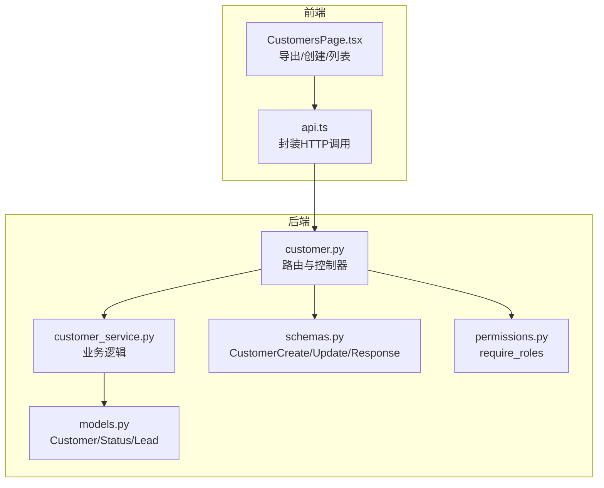
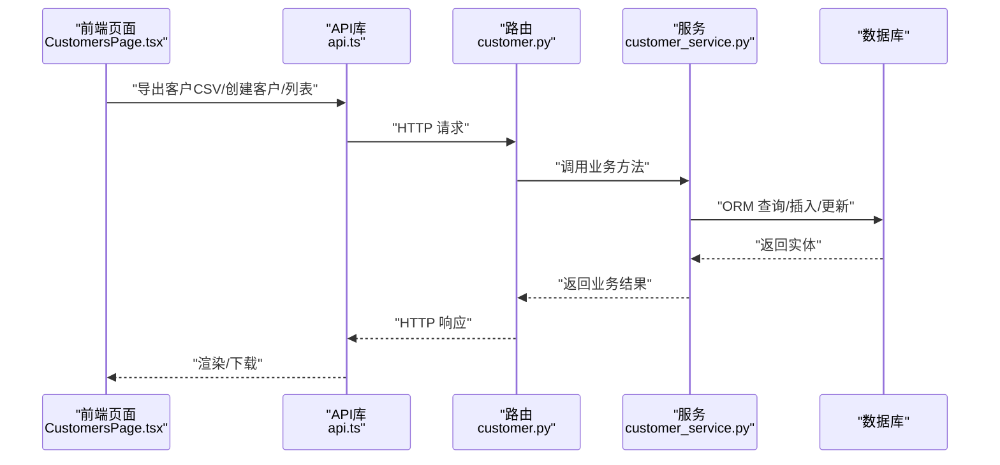
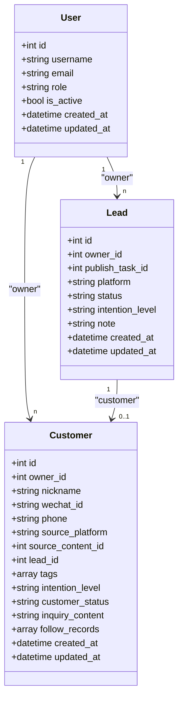
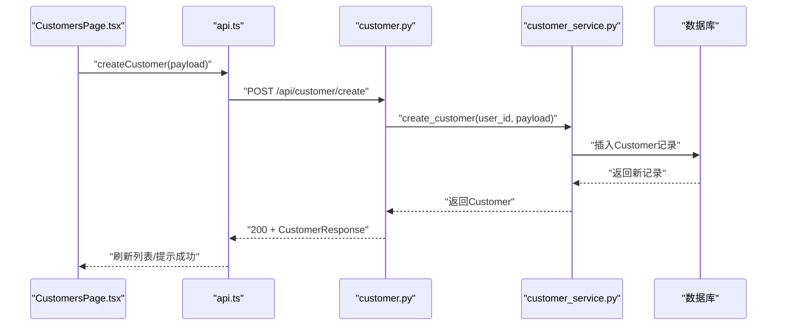
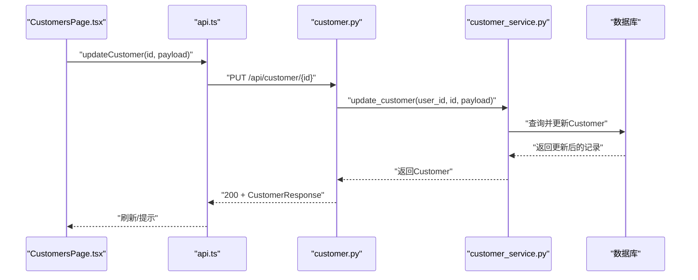
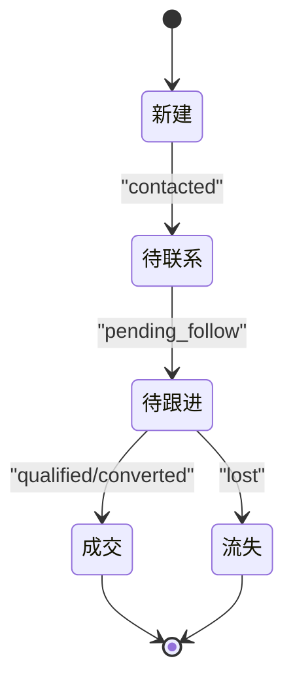
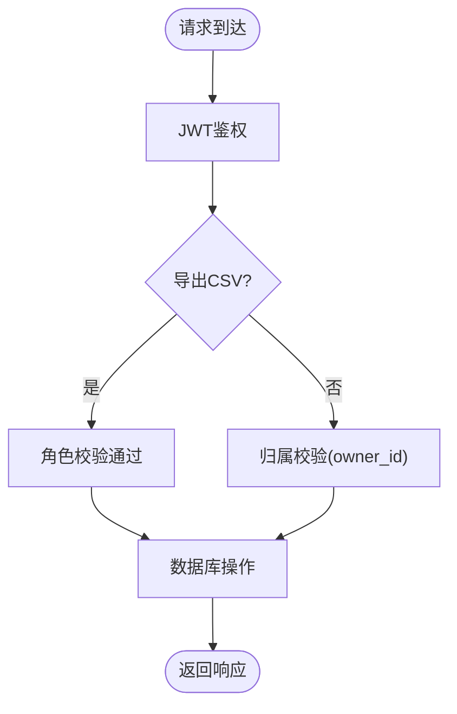
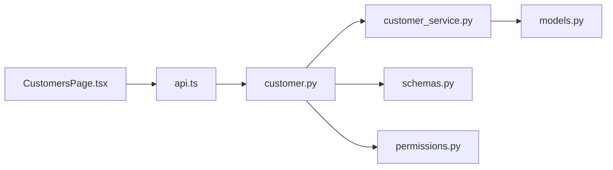

# 客户信息维护

<cite>
**本文引用的文件**
- [models.py](file://backend/app/models/models.py)
- [schemas.py](file://backend/app/schemas/schemas.py)
- [customer.py](file://backend/app/api/endpoints/customer.py)
- [customer_service.py](file://backend/app/services/customer_service.py)
- [permissions.py](file://backend/app/core/permissions.py)
- [lead.py](file://backend/app/api/endpoints/lead.py)
- [QUICKSTART.md](file://backend/QUICKSTART.md)
- [api.ts](file://desktop/src/lib/api.ts)
- [CustomersPage.tsx](file://desktop/src/pages/CustomersPage.tsx)
- [test_material_pipeline_postgres_regression.py](file://backend/test_material_pipeline_postgres_regression.py)
</cite>

## 目录
1. [简介](#简介)
2. [项目结构](#项目结构)
3. [核心组件](#核心组件)
4. [架构总览](#架构总览)
5. [详细组件分析](#详细组件分析)
6. [依赖分析](#依赖分析)
7. [性能考虑](#性能考虑)
8. [故障排查指南](#故障排查指南)
9. [结论](#结论)
10. [附录](#附录)

## 简介
本文件面向“智获客客户信息维护系统”，围绕客户数据模型、创建与更新流程、状态管理、权限控制、分组与标签、以及数据导入导出与API接口进行系统化说明。文档以仓库现有代码为依据，结合前端调用与测试用例，帮助开发者与运营人员快速理解并正确使用客户数据相关能力。

## 项目结构
客户相关能力主要分布在以下层次：
- 数据模型层：定义客户实体、状态枚举、JSON字段等
- Schema 层：定义API请求/响应数据结构
- API 层：暴露REST接口（创建、列表、详情、更新、删除、跟进、导出等）
- 服务层：封装业务逻辑（权限校验、数据持久化、状态与流程控制）
- 权限层：基于角色的访问控制
- 前端集成：桌面端页面与API库对接

图表来源
- [customer.py:18-148](file://backend/app/api/endpoints/customer.py#L18-L148)
- [customer_service.py:1-115](file://backend/app/services/customer_service.py#L1-L115)
- [models.py:190-257](file://backend/app/models/models.py#L190-L257)
- [schemas.py:163-200](file://backend/app/schemas/schemas.py#L163-L200)
- [permissions.py:9-30](file://backend/app/core/permissions.py#L9-L30)
- [CustomersPage.tsx:1-156](file://desktop/src/pages/CustomersPage.tsx#L1-L156)
- [api.ts:220-243](file://desktop/src/lib/api.ts#L220-L243)

章节来源
- [customer.py:18-148](file://backend/app/api/endpoints/customer.py#L18-L148)
- [QUICKSTART.md:135-144](file://backend/QUICKSTART.md#L135-L144)

## 核心组件
- 客户数据模型
  - 字段：昵称、微信号、手机号、来源平台、来源内容ID、线索ID、标签数组、意向等级、客户状态、咨询内容、跟进记录数组、创建/更新时间
  - 状态枚举：new、contacted、pending_follow、qualified、converted、lost
- 客户Schema
  - 创建：昵称、微信号、手机号、来源平台、来源内容ID、标签数组、意向等级、咨询内容
  - 更新：昵称、微信号、标签数组、意向等级、客户状态
  - 响应：包含上述字段及跟进记录与创建时间
- API端点
  - 创建、列表、详情、更新、删除、添加跟进、导出CSV、待跟进列表
- 服务层
  - 创建、查询、更新、添加跟进、删除、待跟进查询
- 权限控制
  - 导出CSV要求管理员或运营角色；其他客户操作基于JWT鉴权与归属校验

章节来源
- [models.py:190-257](file://backend/app/models/models.py#L190-L257)
- [schemas.py:163-200](file://backend/app/schemas/schemas.py#L163-L200)
- [customer.py:21-148](file://backend/app/api/endpoints/customer.py#L21-L148)
- [customer_service.py:9-115](file://backend/app/services/customer_service.py#L9-L115)
- [permissions.py:9-30](file://backend/app/core/permissions.py#L9-L30)

## 架构总览
客户模块遵循“路由-服务-模型”的分层设计，前端通过桌面端页面与API库发起请求，后端路由解析请求并调用服务层，服务层对数据进行持久化与业务规则校验，最终返回响应。

图表来源
- [CustomersPage.tsx:50-63](file://desktop/src/pages/CustomersPage.tsx#L50-L63)
- [api.ts:220-243](file://desktop/src/lib/api.ts#L220-L243)
- [customer.py:108-148](file://backend/app/api/endpoints/customer.py#L108-L148)
- [customer_service.py:1-115](file://backend/app/services/customer_service.py#L1-L115)

## 详细组件分析

### 客户数据模型与字段定义
- 实体：Customer
- 关键字段
  - 基本信息：昵称、微信号、手机号
  - 来源：来源平台、来源内容ID
  - 关联：线索ID（唯一外键）
  - 业务：标签数组、意向等级、客户状态、咨询内容、跟进记录数组
  - 时间：创建/更新时间
- 状态枚举：new、contacted、pending_follow、qualified、converted、lost
- 关系：与User（owner）一对多；与Lead（lead_id）一对一（唯一）

图表来源
- [models.py:190-257](file://backend/app/models/models.py#L190-L257)

章节来源
- [models.py:190-257](file://backend/app/models/models.py#L190-L257)

### 客户创建流程与验证
- 请求体：CustomerCreate（昵称、微信号、手机号、来源平台、来源内容ID、标签数组、意向等级、咨询内容）
- 业务规则
  - 创建者必须存在（服务层校验）
  - 将owner_id绑定到当前用户
  - 其他字段按Schema定义写入
- 前端行为
  - 页面收集表单并调用API库的创建函数
  - 成功后刷新列表并提示

图表来源
- [CustomersPage.tsx:27-48](file://desktop/src/pages/CustomersPage.tsx#L27-L48)
- [api.ts:233-243](file://desktop/src/lib/api.ts#L233-L243)
- [customer.py:21-29](file://backend/app/api/endpoints/customer.py#L21-L29)
- [customer_service.py:11-27](file://backend/app/services/customer_service.py#L11-L27)

章节来源
- [schemas.py:163-173](file://backend/app/schemas/schemas.py#L163-L173)
- [customer.py:21-29](file://backend/app/api/endpoints/customer.py#L21-L29)
- [customer_service.py:11-27](file://backend/app/services/customer_service.py#L11-L27)
- [CustomersPage.tsx:27-48](file://desktop/src/pages/CustomersPage.tsx#L27-L48)
- [api.ts:233-243](file://desktop/src/lib/api.ts#L233-L243)

### 客户信息更新与权限控制
- 请求体：CustomerUpdate（昵称、微信号、标签数组、意向等级、客户状态）
- 权限
  - 所有客户操作依赖JWT鉴权
  - 读取/更新/删除均校验“当前用户是否为该客户的归属者”
- 业务规则
  - 仅更新传入的字段（exclude_unset）
  - 支持更新客户状态，用于状态流转

图表来源
- [customer.py:58-69](file://backend/app/api/endpoints/customer.py#L58-L69)
- [customer_service.py:60-75](file://backend/app/services/customer_service.py#L60-L75)

章节来源
- [schemas.py:175-181](file://backend/app/schemas/schemas.py#L175-L181)
- [customer.py:58-69](file://backend/app/api/endpoints/customer.py#L58-L69)
- [customer_service.py:60-75](file://backend/app/services/customer_service.py#L60-L75)

### 客户状态管理与转换逻辑
- 状态枚举：new、contacted、pending_follow、qualified、converted、lost
- 当前代码体现的状态流转
  - 线索转客户时，客户初始状态为new
  - 服务层提供待跟进查询（new/pending_follow/contacted）
- 注意：当前仓库未发现显式的状态机转换API端点（如PUT /customer/{id}/status）。若需严格的状态机控制，可在路由与服务层补充相应端点与校验。

图表来源
- [models.py:190-196](file://backend/app/models/models.py#L190-L196)
- [customer_service.py:109-115](file://backend/app/services/customer_service.py#L109-L115)

章节来源
- [models.py:190-196](file://backend/app/models/models.py#L190-L196)
- [customer_service.py:109-115](file://backend/app/services/customer_service.py#L109-L115)

### 权限控制与数据一致性
- 导出CSV：require_roles("admin", "operator")
- 客户CRUD：verify_token + 归属校验（owner_id匹配）
- 数据一致性
  - 客户与线索关联：Customer.lead_id为唯一外键，避免重复关联
  - 线索转客户幂等：若已存在对应客户则直接返回，不重复创建

图表来源
- [permissions.py:9-30](file://backend/app/core/permissions.py#L9-L30)
- [customer.py:111-111](file://backend/app/api/endpoints/customer.py#L111-L111)
- [customer_service.py:46-57](file://backend/app/services/customer_service.py#L46-L57)

章节来源
- [permissions.py:9-30](file://backend/app/core/permissions.py#L9-L30)
- [customer.py:111-111](file://backend/app/api/endpoints/customer.py#L111-L111)
- [customer_service.py:46-57](file://backend/app/services/customer_service.py#L46-L57)
- [test_material_pipeline_postgres_regression.py:841-854](file://backend/test_material_pipeline_postgres_regression.py#L841-L854)

### 分组与标签系统
- 标签字段：Customer.tags为JSON数组，默认空数组
- 前端支持
  - 创建时允许输入逗号分隔的标签字符串，客户端会拆分为数组
  - 列表展示时以逗号拼接显示
- 扩展建议
  - 可引入独立的标签实体与中间表，支持标签统计与过滤
  - 提供标签管理API（增删改查）

章节来源
- [models.py:244-244](file://backend/app/models/models.py#L244-L244)
- [CustomersPage.tsx:103-106](file://desktop/src/pages/CustomersPage.tsx#L103-L106)
- [api.ts:233-243](file://desktop/src/lib/api.ts#L233-L243)

### 数据导入导出功能
- 导出CSV
  - 端点：GET /api/customer/export/csv
  - 角色：admin/operator
  - 字段：id、昵称、微信号、来源平台、标签、意向等级、客户状态、创建时间
  - 限制：最多导出5000条
- 导入CSV
  - 当前仓库未提供导入端点与实现
  - 建议：新增POST /api/customer/import/csv，解析上传文件并批量创建客户

章节来源
- [customer.py:108-148](file://backend/app/api/endpoints/customer.py#L108-L148)
- [QUICKSTART.md:135-144](file://backend/QUICKSTART.md#L135-L144)
- [api.ts:225-231](file://desktop/src/lib/api.ts#L225-L231)

### API接口文档
- 客户管理
  - POST /api/customer/create：创建客户
  - GET /api/customer/list：客户列表（支持status、skip、limit）
  - GET /api/customer/{id}：获取客户
  - PUT /api/customer/{id}：更新客户
  - POST /api/customer/{id}/follow：添加跟进记录
  - DELETE /api/customer/{id}：删除客户
  - GET /api/customer/pending/list：待跟进客户列表
  - GET /api/customer/export/csv：导出CSV（admin/operator）
- 线索转客户（与客户强关联）
  - POST /api/lead/{lead_id}/convert-customer：将线索转为客户（幂等）

章节来源
- [QUICKSTART.md:135-144](file://backend/QUICKSTART.md#L135-L144)
- [customer.py:21-148](file://backend/app/api/endpoints/customer.py#L21-L148)
- [lead.py:140-174](file://backend/app/api/endpoints/lead.py#L140-L174)

## 依赖分析
- 组件耦合
  - 路由依赖服务层；服务层依赖模型与数据库会话
  - Schema用于请求/响应的结构约束
  - 权限装饰器用于角色与归属校验
- 外部依赖
  - FastAPI（路由）、SQLAlchemy（ORM）、Pydantic（Schema）
  - 前端通过api.ts封装HTTP调用

图表来源
- [customer.py:10-16](file://backend/app/api/endpoints/customer.py#L10-L16)
- [customer_service.py:1-6](file://backend/app/services/customer_service.py#L1-L6)
- [models.py:1-6](file://backend/app/models/models.py#L1-L6)
- [schemas.py:163-200](file://backend/app/schemas/schemas.py#L163-L200)
- [permissions.py:1-6](file://backend/app/core/permissions.py#L1-L6)
- [CustomersPage.tsx:1-6](file://desktop/src/pages/CustomersPage.tsx#L1-L6)
- [api.ts:220-243](file://desktop/src/lib/api.ts#L220-L243)

## 性能考虑
- 查询优化
  - 列表接口支持limit上限与排序（按创建时间倒序）
  - 待跟进查询使用状态集合过滤
- 导出性能
  - 导出限制最大5000条，避免超大数据集导出导致内存压力
- 建议
  - 对常用过滤字段建立索引（如owner_id、status、lead_id）
  - 导出支持分页或异步任务

## 故障排查指南
- 404/403错误
  - 确认用户身份与归属（非客户归属者访问会被拒绝）
  - 导出CSV需满足角色要求
- 重复创建/幂等问题
  - 线索转客户已实现幂等：若已有对应客户则直接返回
- 前端导出失败
  - 检查响应类型与headers，确保以blob方式接收并触发下载

章节来源
- [customer_service.py:46-57](file://backend/app/services/customer_service.py#L46-L57)
- [permissions.py:16-27](file://backend/app/core/permissions.py#L16-L27)
- [test_material_pipeline_postgres_regression.py:841-854](file://backend/test_material_pipeline_postgres_regression.py#L841-L854)
- [api.ts:225-231](file://desktop/src/lib/api.ts#L225-L231)

## 结论
本系统提供了完整的客户数据模型与基础CRUD能力，并通过权限控制保障数据安全。状态管理与流程控制在现有代码中以“线索转客户”和“待跟进查询”体现。建议后续完善：
- 明确的状态机转换API与校验
- 标签实体化与管理接口
- 导入CSV能力
- 更细粒度的字段校验与重复检测（如微信/手机号唯一性）

## 附录
- 快速参考（端点）
  - 创建客户：POST /api/customer/create
  - 列表：GET /api/customer/list
  - 详情：GET /api/customer/{id}
  - 更新：PUT /api/customer/{id}
  - 删除：DELETE /api/customer/{id}
  - 添加跟进：POST /api/customer/{id}/follow
  - 待跟进列表：GET /api/customer/pending/list
  - 导出CSV：GET /api/customer/export/csv
  - 线索转客户：POST /api/lead/{lead_id}/convert-customer

章节来源
- [QUICKSTART.md:135-144](file://backend/QUICKSTART.md#L135-L144)