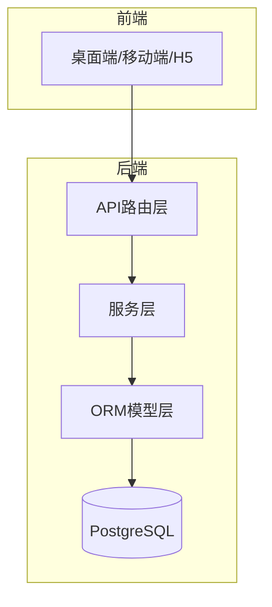
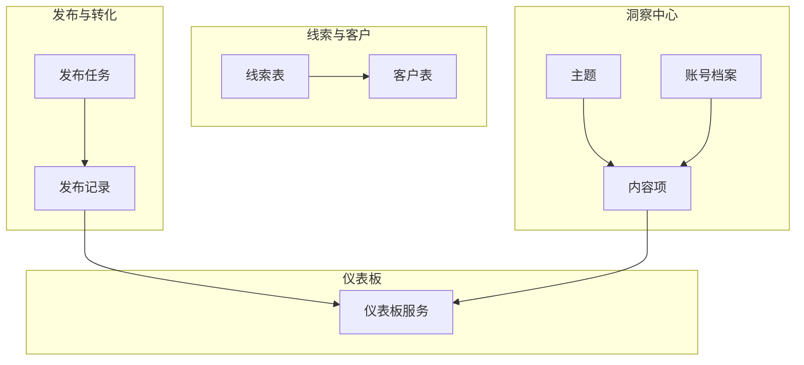
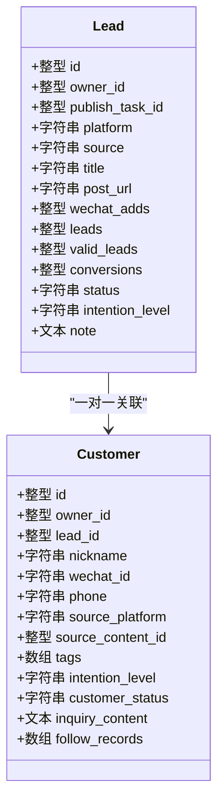
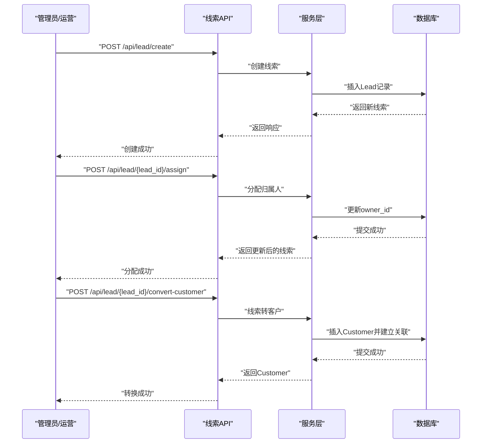
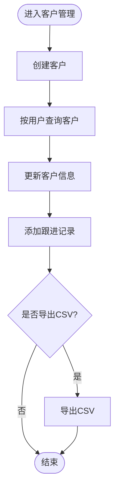
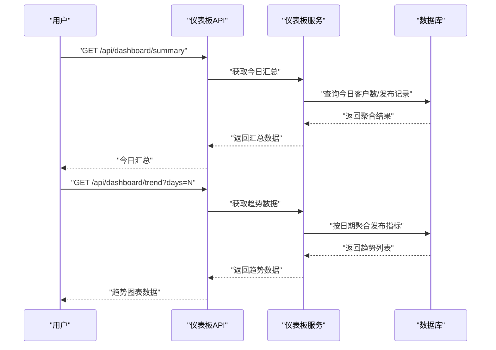
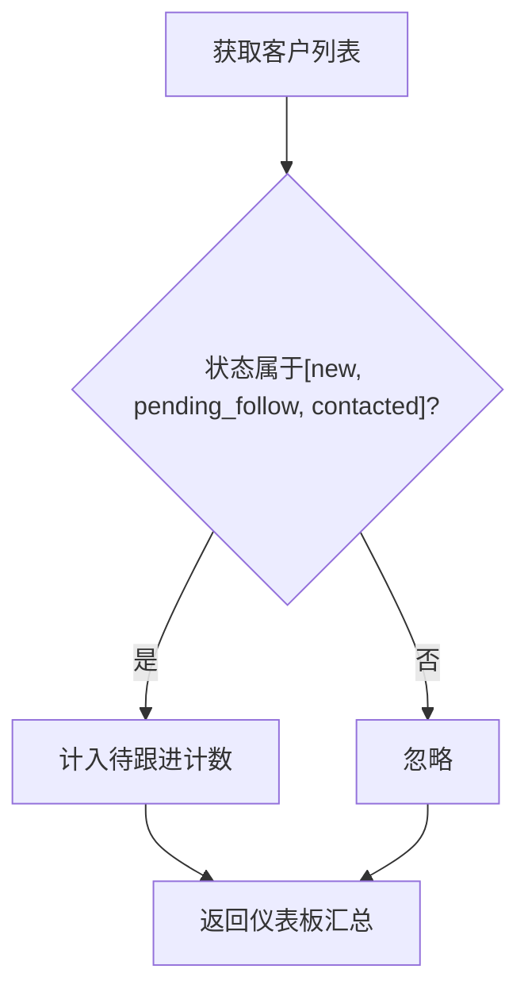
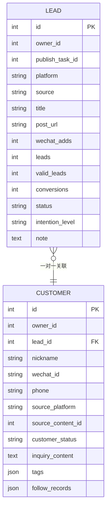
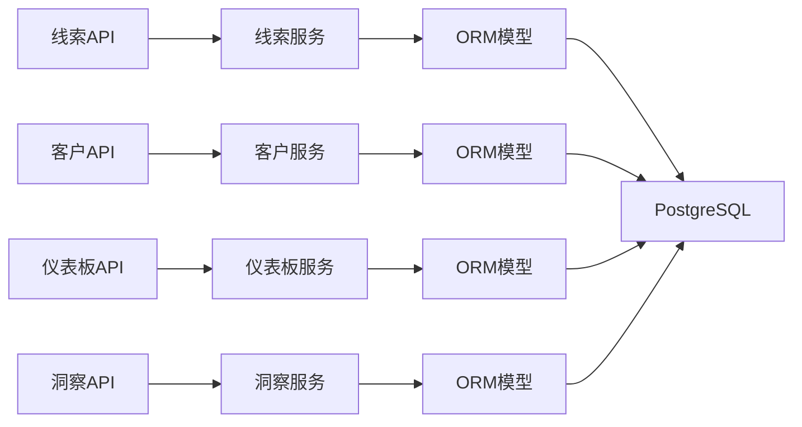

# 客户关系管理

<cite>
**本文引用的文件**
- [backend/README.md](file://backend/README.md)
- [docs/product/business-flow.md](file://docs/product/business-flow.md)
- [backend/app/models/models.py](file://backend/app/models/models.py)
- [backend/app/schemas/schemas.py](file://backend/app/schemas/schemas.py)
- [backend/app/api/endpoints/lead.py](file://backend/app/api/endpoints/lead.py)
- [backend/app/api/endpoints/customer.py](file://backend/app/api/endpoints/customer.py)
- [backend/app/services/customer_service.py](file://backend/app/services/customer_service.py)
- [backend/app/api/endpoints/dashboard.py](file://backend/app/api/endpoints/dashboard.py)
- [backend/app/services/dashboard_service.py](file://backend/app/services/dashboard_service.py)
- [backend/app/api/endpoints/insight.py](file://backend/app/api/endpoints/insight.py)
- [backend/app/services/insight_service.py](file://backend/app/services/insight_service.py)
- [backend/app/tasks/reminder_tasks.py](file://backend/app/tasks/reminder_tasks.py)
</cite>

## 目录
1. [引言](#引言)
2. [项目结构](#项目结构)
3. [核心组件](#核心组件)
4. [架构总览](#架构总览)
5. [详细组件分析](#详细组件分析)
6. [依赖分析](#依赖分析)
7. [性能考虑](#性能考虑)
8. [故障排查指南](#故障排查指南)
9. [结论](#结论)
10. [附录](#附录)

## 引言
本文件面向“智获客客户关系管理系统”，围绕线索池管理、客户信息维护、转化跟踪、跟进提醒、客户生命周期与价值评估、预测分析、管理界面使用与API说明，以及与其他业务模块的集成与数据同步机制，提供系统化、可操作的技术文档。文档基于后端FastAPI + PostgreSQL架构，结合模型、服务与API端点的实际实现进行梳理。

## 项目结构
后端采用分层架构：路由层（API端点）、服务层（业务逻辑）、模型层（SQLAlchemy ORM）、数据层（PostgreSQL）。产品层面明确了“采集 -> 收件箱 -> 素材 -> AI -> 审核 -> 发布 -> 线索 -> 客户 -> 提醒”的闭环业务流。

图示来源
- [backend/README.md:90-107](file://backend/README.md#L90-L107)

章节来源
- [backend/README.md:90-107](file://backend/README.md#L90-L107)
- [docs/product/business-flow.md:1-4](file://docs/product/business-flow.md#L1-L4)

## 核心组件
- 线索池管理：线索创建、状态变更、归属人分配、线索转客户。
- 客户信息维护：客户创建、查询、更新、跟进记录、导出。
- 转化跟踪：发布记录指标（浏览、点赞、评论、收藏、分享、私信、微信加好友、线索、有效线索、转化）的统计与趋势分析。
- 跟进提醒：待跟进客户数量统计与提醒任务占位。
- 客户生命周期与价值：基于发布记录与客户状态的统计口径；通过洞察中心内容热度与主题知识沉淀辅助价值评估。
- 管理界面与API：提供REST接口与前端页面，支持CSV导出、权限控制与角色校验。

章节来源
- [backend/app/api/endpoints/lead.py:29-175](file://backend/app/api/endpoints/lead.py#L29-L175)
- [backend/app/api/endpoints/customer.py:21-148](file://backend/app/api/endpoints/customer.py#L21-L148)
- [backend/app/services/customer_service.py:9-115](file://backend/app/services/customer_service.py#L9-L115)
- [backend/app/api/endpoints/dashboard.py:11-100](file://backend/app/api/endpoints/dashboard.py#L11-L100)
- [backend/app/services/dashboard_service.py:7-209](file://backend/app/services/dashboard_service.py#L7-L209)
- [backend/app/tasks/reminder_tasks.py:1-3](file://backend/app/tasks/reminder_tasks.py#L1-L3)

## 架构总览
系统围绕“线索 -> 客户”闭环展开，发布记录承载转化指标，洞察中心提供主题与账号画像，仪表板汇总当日与趋势数据。

图示来源
- [backend/app/models/models.py:199-257](file://backend/app/models/models.py#L199-L257)
- [backend/app/models/models.py:259-329](file://backend/app/models/models.py#L259-L329)
- [backend/app/models/models.py:758-800](file://backend/app/models/models.py#L758-L800)
- [backend/app/services/dashboard_service.py:7-209](file://backend/app/services/dashboard_service.py#L7-L209)

## 详细组件分析

### 线索池管理
- 线索实体与状态：包含平台来源、标题、链接、意向等级、状态、备注等，并与发布任务与客户建立关联。
- 关键能力：
  - 创建线索
  - 列表过滤（状态、归属人）
  - 更新状态
  - 分配归属人
  - 线索转客户（幂等处理）

图示来源
- [backend/app/models/models.py:199-227](file://backend/app/models/models.py#L199-L227)
- [backend/app/models/models.py:229-257](file://backend/app/models/models.py#L229-L257)

图示来源
- [backend/app/api/endpoints/lead.py:29-175](file://backend/app/api/endpoints/lead.py#L29-L175)

章节来源
- [backend/app/api/endpoints/lead.py:29-175](file://backend/app/api/endpoints/lead.py#L29-L175)
- [backend/app/models/models.py:199-257](file://backend/app/models/models.py#L199-L257)

### 客户信息维护
- 客户实体：包含昵称、微信ID、手机号、来源平台、标签、意向等级、客户状态、跟进记录等。
- 关键能力：
  - 创建客户
  - 用户维度查询与分页
  - 更新客户信息
  - 添加跟进记录（结构化时间线）
  - 导出CSV（受角色限制）

图示来源
- [backend/app/api/endpoints/customer.py:21-148](file://backend/app/api/endpoints/customer.py#L21-L148)
- [backend/app/services/customer_service.py:9-115](file://backend/app/services/customer_service.py#L9-L115)

章节来源
- [backend/app/api/endpoints/customer.py:21-148](file://backend/app/api/endpoints/customer.py#L21-L148)
- [backend/app/services/customer_service.py:9-115](file://backend/app/services/customer_service.py#L9-L115)

### 转化跟踪与统计
- 发布记录指标：浏览、点赞、评论、收藏、分享、私信、微信加好友、线索、有效线索、转化。
- 仪表板能力：
  - 今日汇总（新增客户、微信加好友、线索、有效线索、转化）
  - 趋势数据（近N日）
  - 平台分析（按平台统计）
  - 主题排行（按有效线索排序）
  - 高质量内容（按有效线索排序）
  - AI调用统计（按日、按用户聚合）

图示来源
- [backend/app/api/endpoints/dashboard.py:11-100](file://backend/app/api/endpoints/dashboard.py#L11-L100)
- [backend/app/services/dashboard_service.py:7-209](file://backend/app/services/dashboard_service.py#L7-L209)

章节来源
- [backend/app/api/endpoints/dashboard.py:11-100](file://backend/app/api/endpoints/dashboard.py#L11-L100)
- [backend/app/services/dashboard_service.py:7-209](file://backend/app/services/dashboard_service.py#L7-L209)

### 跟进提醒系统
- 待跟进客户统计：根据客户状态集合进行计数，用于提醒展示。
- 提醒任务：当前任务占位函数，后续可扩展定时任务或消息推送。

图示来源
- [backend/app/services/dashboard_service.py:24-27](file://backend/app/services/dashboard_service.py#L24-L27)
- [backend/app/tasks/reminder_tasks.py:1-3](file://backend/app/tasks/reminder_tasks.py#L1-L3)

章节来源
- [backend/app/services/dashboard_service.py:24-27](file://backend/app/services/dashboard_service.py#L24-L27)
- [backend/app/tasks/reminder_tasks.py:1-3](file://backend/app/tasks/reminder_tasks.py#L1-L3)

### 客户生命周期管理、价值评估与预测分析
- 生命周期：线索 -> 客户（跟进/转化），状态流转与标签驱动。
- 价值评估：结合发布记录的有效线索与转化，以及洞察中心内容热度与主题知识沉淀，形成内容价值与账号影响力参考。
- 预测分析：洞察中心通过AI对内容进行结构、钩子、风格、风险等分析，辅助生成策略与主题聚类。

图示来源
- [backend/app/models/models.py:199-257](file://backend/app/models/models.py#L199-L257)

章节来源
- [backend/app/models/models.py:199-257](file://backend/app/models/models.py#L199-L257)
- [backend/app/api/endpoints/insight.py:106-209](file://backend/app/api/endpoints/insight.py#L106-L209)
- [backend/app/services/insight_service.py:57-659](file://backend/app/services/insight_service.py#L57-L659)

### 管理界面使用指南与API说明
- 管理界面：桌面端/移动端/H5页面提供线索、客户、仪表板、洞察中心等功能入口。
- API概览（节选）：
  - 认证：注册、登录、获取当前用户
  - 内容：创建、列表、详情、更新、删除
  - 合规：合规检查
  - 客户：创建、列表、详情、更新、删除、添加跟进、导出CSV
  - 发布：创建发布记录、列表、更新
  - 仪表板：今日概览、趋势、平台分析、主题排行、高质量内容、AI调用统计
  - AI：改写（小红书、抖音、知乎）、图片理解（火山方舟）
  - 素材中台：采集、解析、去重、批量处理
  - 洞察中心：主题管理、内容导入/列表/详情/删除、AI分析、检索召回、统计

章节来源
- [backend/README.md:119-163](file://backend/README.md#L119-L163)

### 与其他业务模块的集成与数据同步
- 采集 -> 收件箱 -> 素材 -> AI -> 审核 -> 发布 -> 线索 -> 客户 -> 提醒：贯穿采集、素材、洞察、发布、线索、客户、提醒的完整闭环。
- 数据一致性：通过ORM模型与服务层封装，保证跨模块数据读写的一致性；发布记录作为转化跟踪的统一来源，线索与客户通过外键关联形成闭环。

章节来源
- [docs/product/business-flow.md:1-4](file://docs/product/business-flow.md#L1-L4)
- [backend/app/models/models.py:199-329](file://backend/app/models/models.py#L199-L329)

## 依赖分析
- 组件耦合：
  - API端点依赖服务层；服务层依赖ORM模型；模型依赖数据库。
  - 线索与客户存在一对一关联，发布记录为转化指标来源。
- 外部依赖：
  - 数据库：PostgreSQL
  - AI/合规：本地或云端大模型（可选）
  - 限流：Redis分布式限流（可选）

图示来源
- [backend/app/api/endpoints/lead.py:17-175](file://backend/app/api/endpoints/lead.py#L17-L175)
- [backend/app/api/endpoints/customer.py:18-148](file://backend/app/api/endpoints/customer.py#L18-L148)
- [backend/app/api/endpoints/dashboard.py:8-100](file://backend/app/api/endpoints/dashboard.py#L8-L100)
- [backend/app/api/endpoints/insight.py:50-410](file://backend/app/api/endpoints/insight.py#L50-L410)

章节来源
- [backend/app/api/endpoints/lead.py:17-175](file://backend/app/api/endpoints/lead.py#L17-L175)
- [backend/app/api/endpoints/customer.py:18-148](file://backend/app/api/endpoints/customer.py#L18-L148)
- [backend/app/api/endpoints/dashboard.py:8-100](file://backend/app/api/endpoints/dashboard.py#L8-L100)
- [backend/app/api/endpoints/insight.py:50-410](file://backend/app/api/endpoints/insight.py#L50-L410)

## 性能考虑
- 查询优化：列表接口支持分页与过滤，避免一次性加载过多数据。
- 聚合统计：仪表板服务按日期分组聚合，注意索引与分区策略（如按时间列建立索引）。
- AI调用：限流与降级策略（Redis可用时启用分布式限流，不可用时降级）。
- 数据一致性：事务边界明确，避免长事务；批量操作采用批量提交。

## 故障排查指南
- 常见错误与处理：
  - 权限不足：当请求用户与资源归属不符时，返回403。
  - 资源不存在：线索/客户/内容等查询不到时，返回404。
  - 参数校验：Pydantic模型负责输入校验，异常时返回422。
- 运维健康检查：
  - 健康检查端点：/api/system/ops/health、/api/system/ops/readiness
  - 日志与监控：关注Ark调用日志、Redis限流状态、数据库连接状态。

章节来源
- [backend/app/api/endpoints/lead.py:80-114](file://backend/app/api/endpoints/lead.py#L80-L114)
- [backend/app/api/endpoints/customer.py:48-94](file://backend/app/api/endpoints/customer.py#L48-L94)
- [backend/README.md:212-221](file://backend/README.md#L212-L221)

## 结论
本系统以“发布记录”为核心数据源，串联起线索、客户、洞察与仪表板，形成从内容生产到客户转化的闭环。通过清晰的模型设计、服务层封装与API端点，实现了线索池管理、客户维护、转化跟踪与提醒的基础能力；同时，洞察中心为价值评估与预测分析提供支撑。建议后续完善提醒任务调度、扩展客户生命周期评分与预测模型，并持续优化查询与聚合性能。

## 附录
- 数据模型关键字段与含义可参考模型文件对应注释与枚举类型。
- API端点与响应模型可参考schemas文件与各端点实现。