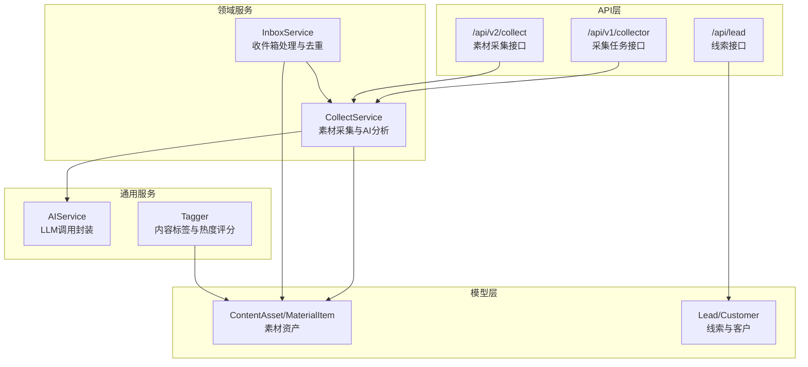
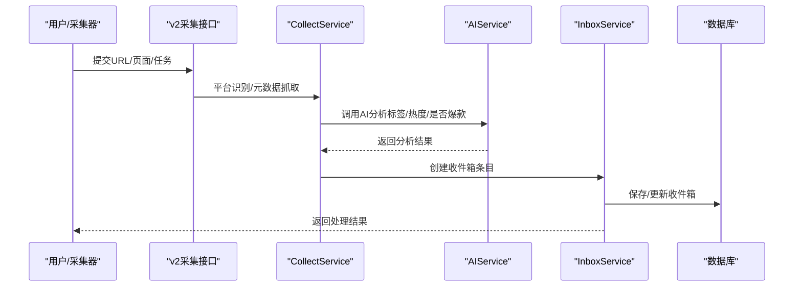
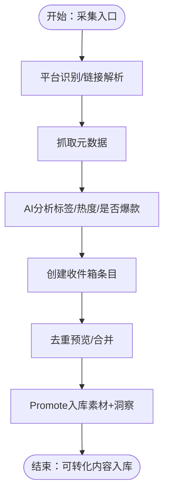
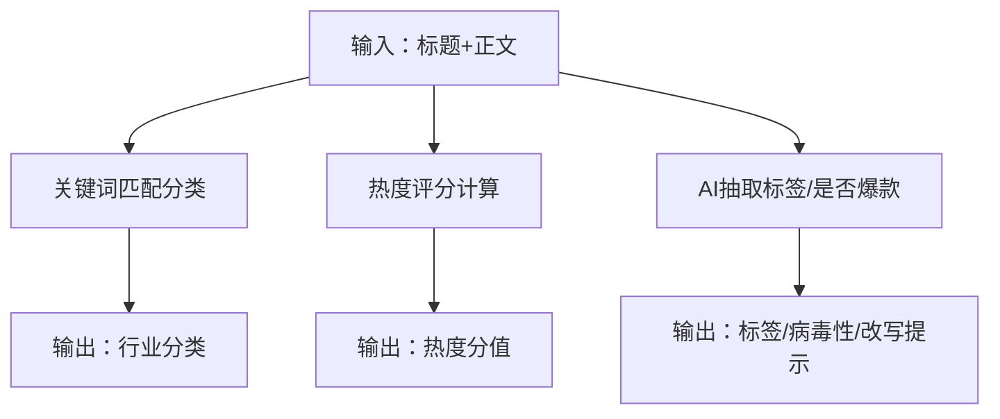
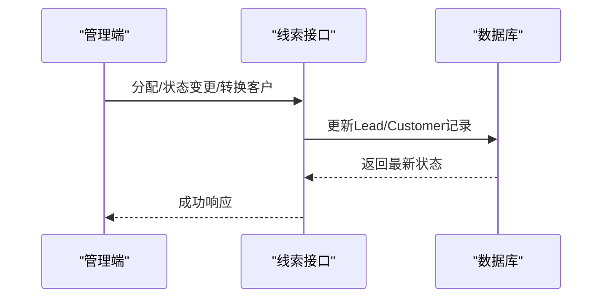
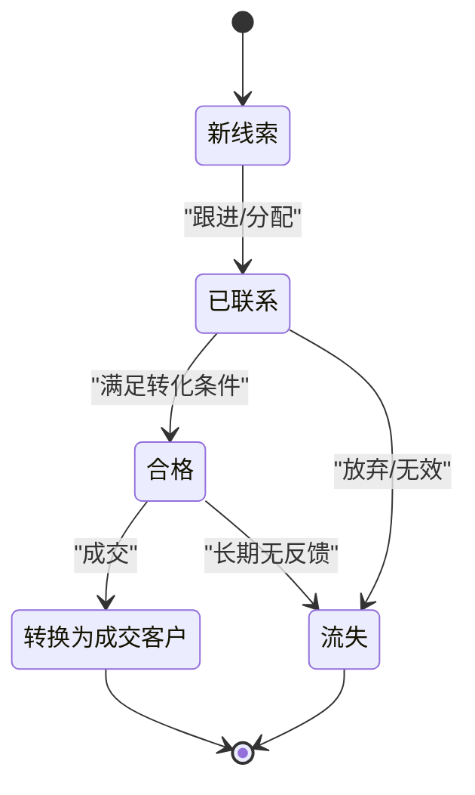
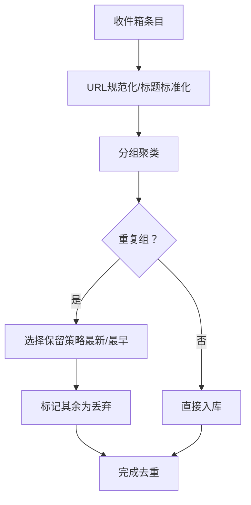
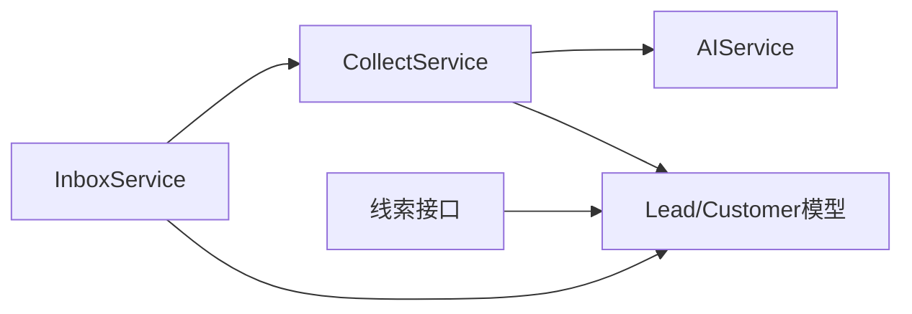
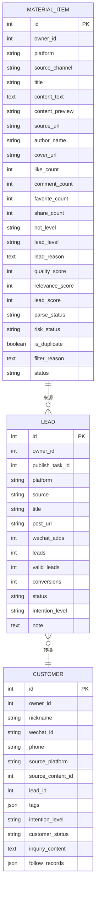

# 线索池管理

<cite>
**本文引用的文件**
- [models.py](file://backend/app/models/models.py)
- [schemas.py](file://backend/app/schemas/schemas.py)
- [collect_service.py](file://backend/app/domains/acquisition/collect_service.py)
- [inbox_service.py](file://backend/app/domains/acquisition/inbox_service.py)
- [lead.py](file://backend/app/api/endpoints/lead.py)
- [collect.py（v1）](file://backend/app/api/v1/endpoints/collect.py)
- [collect.py（v2）](file://backend/app/api/v2/endpoints/collect.py)
- [tagger.py](file://backend/app/services/tagger.py)
- [ai_service.py](file://backend/app/services/ai_service.py)
- [lead_triage_agent.py](file://backend/app/ai/agents/lead_triage_agent.py)
- [douyin.yaml](file://backend/app/rules/local/douyin.yaml)
- [xiaohongshu.yaml](file://backend/app/rules/local/xiaohongshu.yaml)
</cite>

## 目录
1. [简介](#简介)
2. [项目结构](#项目结构)
3. [核心组件](#核心组件)
4. [架构总览](#架构总览)
5. [详细组件分析](#详细组件分析)
6. [依赖分析](#依赖分析)
7. [性能考量](#性能考量)
8. [故障排查指南](#故障排查指南)
9. [结论](#结论)
10. [附录](#附录)

## 简介
本文件面向“智获客线索池管理系统”，围绕线索获取、AI分析、分类与去重、分配策略、状态流转、质量评估与API/界面操作进行系统化说明。系统支持从浏览器插件、关键字采集、员工提交、链接解析、OCR截图等多种渠道采集内容，并通过统一的素材管道进行标准化、AI分析与入库；随后将可转化的线索进入线索池，支持手动/自动分配、状态跟踪与客户转化。

## 项目结构
后端采用FastAPI + SQLAlchemy架构，模型定义在models.py中，API路由位于app/api，领域服务在app/domains，通用服务在app/services，AI相关在app/ai，规则在app/rules，前端位于desktop目录。

图表来源
- [lead.py:1-175](file://backend/app/api/endpoints/lead.py#L1-L175)
- [collect.py（v1）:1-34](file://backend/app/api/v1/endpoints/collect.py#L1-L34)
- [collect.py（v2）:1-302](file://backend/app/api/v2/endpoints/collect.py#L1-L302)
- [collect_service.py:1-285](file://backend/app/domains/acquisition/collect_service.py#L1-L285)
- [inbox_service.py:1-439](file://backend/app/domains/acquisition/inbox_service.py#L1-L439)
- [ai_service.py:1-460](file://backend/app/services/ai_service.py#L1-L460)
- [tagger.py:1-113](file://backend/app/services/tagger.py#L1-L113)
- [models.py:1-928](file://backend/app/models/models.py#L1-L928)

章节来源
- [lead.py:1-175](file://backend/app/api/endpoints/lead.py#L1-L175)
- [collect.py（v1）:1-34](file://backend/app/api/v1/endpoints/collect.py#L1-L34)
- [collect.py（v2）:1-302](file://backend/app/api/v2/endpoints/collect.py#L1-L302)
- [collect_service.py:1-285](file://backend/app/domains/acquisition/collect_service.py#L1-L285)
- [inbox_service.py:1-439](file://backend/app/domains/acquisition/inbox_service.py#L1-L439)
- [ai_service.py:1-460](file://backend/app/services/ai_service.py#L1-L460)
- [tagger.py:1-113](file://backend/app/services/tagger.py#L1-L113)
- [models.py:1-928](file://backend/app/models/models.py#L1-L928)

## 核心组件
- 线索与客户模型：Lead、Customer、PublishTask、PublishRecord等，支撑线索从“新线索”到“意向客户/成交”的全生命周期。
- 素材与洞察：ContentAsset、MaterialItem、InboxItem、Insight*系列，支撑内容采集、标准化、AI分析与洞察沉淀。
- 采集与AI：CollectService负责平台识别、元数据抓取、AI分析；InboxService负责收件箱、去重与入库；AIService封装本地/云端LLM调用；Tagger提供话题/意图/人群/风险标签与热度评分。
- 规则与策略：rules/local/*.yaml用于平台规则占位；AI Agent预留线索分流策略扩展点。

章节来源
- [models.py:199-257](file://backend/app/models/models.py#L199-L257)
- [models.py:292-333](file://backend/app/models/models.py#L292-L333)
- [models.py:458-494](file://backend/app/models/models.py#L458-L494)
- [collect_service.py:74-285](file://backend/app/domains/acquisition/collect_service.py#L74-L285)
- [inbox_service.py:14-439](file://backend/app/domains/acquisition/inbox_service.py#L14-L439)
- [ai_service.py:15-460](file://backend/app/services/ai_service.py#L15-L460)
- [tagger.py:1-113](file://backend/app/services/tagger.py#L1-L113)
- [lead_triage_agent.py:1-3](file://backend/app/ai/agents/lead_triage_agent.py#L1-L3)

## 架构总览
线索池管理由“采集—分析—入库—线索—客户”链路构成。采集入口统一接入v2收集器，经AI分析与标签评分后进入素材库；满足转化条件的内容可生成线索，进入线索池并支持手动/自动分配与状态流转，最终转化为客户。

图表来源
- [collect.py（v2）:172-197](file://backend/app/api/v2/endpoints/collect.py#L172-L197)
- [collect_service.py:78-158](file://backend/app/domains/acquisition/collect_service.py#L78-L158)
- [collect_service.py:224-285](file://backend/app/domains/acquisition/collect_service.py#L224-L285)
- [inbox_service.py:27-41](file://backend/app/domains/acquisition/inbox_service.py#L27-L41)

## 详细组件分析

### 线索获取机制
- 多渠道采集
  - 浏览器插件采集：收集网页正文、评论、截图等，形成InboxItem，后续AI分析与去重。
  - 关键字采集任务：v1接口创建采集任务，触发CollectService抓取与入库。
  - 链接解析：v2接口识别平台、抓取元数据，生成预提取结果。
  - OCR截图：移动端OCR提取文本，结合去重策略进入收件箱。
- 统一入口与迁移
  - 旧collect接口已下线，统一迁移到v1任务与v2素材管道。
- 数据落库
  - 收件箱条目经AI分析后，Promote为ContentAsset与Insight内容项，同时标记状态为imported。

图表来源
- [collect.py（v2）:172-197](file://backend/app/api/v2/endpoints/collect.py#L172-L197)
- [collect.py（v1）:18-33](file://backend/app/api/v1/endpoints/collect.py#L18-L33)
- [collect_service.py:78-158](file://backend/app/domains/acquisition/collect_service.py#L78-L158)
- [collect_service.py:224-285](file://backend/app/domains/acquisition/collect_service.py#L224-L285)
- [inbox_service.py:112-143](file://backend/app/domains/acquisition/inbox_service.py#L112-L143)
- [inbox_service.py:351-386](file://backend/app/domains/acquisition/inbox_service.py#L351-L386)
- [inbox_service.py:388-439](file://backend/app/domains/acquisition/inbox_service.py#L388-L439)

章节来源
- [collect.py（v1）:1-34](file://backend/app/api/v1/endpoints/collect.py#L1-L34)
- [collect.py（v2）:1-302](file://backend/app/api/v2/endpoints/collect.py#L1-L302)
- [collect_service.py:1-285](file://backend/app/domains/acquisition/collect_service.py#L1-L285)
- [inbox_service.py:1-439](file://backend/app/domains/acquisition/inbox_service.py#L1-L439)

### 线索分类算法
- 内容特征
  - 平台识别：基于URL正则匹配，支持小红书、抖音、知乎、公众号、微博、B站、快手、头条等。
  - 行业分类：基于关键词集合（额度提升、征信修复、负债优化、职业认证、房贷公积金、车贷、企业贷款、引流获客、客户话术、爆款参考、其他）进行自动分类。
- 用户行为
  - 热度评分：基于互动指标与文本长度计算热度分值，作为线索价值参考。
  - 病毒性判定：AI判断是否具备爆款潜质及原因。
- AI智能判断
  - AIService封装Ollama/火山引擎Responses API，提供统一LLM调用能力，CollectService调用AI生成标签、分类、热度、病毒性与改写建议。
  - Tagger模块提供话题/意图/人群/风险标签与热度评分，便于快速筛选与排序。

图表来源
- [collect_service.py:58-71](file://backend/app/domains/acquisition/collect_service.py#L58-L71)
- [collect_service.py:160-166](file://backend/app/domains/acquisition/collect_service.py#L160-L166)
- [collect_service.py:224-285](file://backend/app/domains/acquisition/collect_service.py#L224-L285)
- [tagger.py:72-82](file://backend/app/services/tagger.py#L72-L82)
- [ai_service.py:15-460](file://backend/app/services/ai_service.py#L15-L460)

章节来源
- [collect_service.py:58-71](file://backend/app/domains/acquisition/collect_service.py#L58-L71)
- [collect_service.py:160-166](file://backend/app/domains/acquisition/collect_service.py#L160-L166)
- [collect_service.py:224-285](file://backend/app/domains/acquisition/collect_service.py#L224-L285)
- [tagger.py:1-113](file://backend/app/services/tagger.py#L1-L113)
- [ai_service.py:1-460](file://backend/app/services/ai_service.py#L1-L460)

### 线索分配策略
- 当前实现
  - 线索池支持按负责人(owner_id)分配与状态变更；支持将线索转换为客户并继承部分属性。
- 可扩展方向
  - 区域/产品类别/优先级：可在Lead模型基础上扩展字段（如区域、产品标签、优先级），并在API层增加分配策略参数。
  - 自动分配Agent：预留lead_triage_agent扩展点，未来可接入规则引擎或机器学习模型进行自动分派。

图表来源
- [lead.py:93-114](file://backend/app/api/endpoints/lead.py#L93-L114)
- [lead.py:74-90](file://backend/app/api/endpoints/lead.py#L74-L90)
- [lead.py:140-174](file://backend/app/api/endpoints/lead.py#L140-L174)

章节来源
- [lead.py:1-175](file://backend/app/api/endpoints/lead.py#L1-L175)
- [lead_triage_agent.py:1-3](file://backend/app/ai/agents/lead_triage_agent.py#L1-L3)

### 线索状态流转
- 线索生命周期
  - 新线索 → 已联系 → 合格 → 转换为成交客户/流失
  - 状态枚举：new、contacted、pending_follow、qualified、converted、lost
- 关键节点
  - 线索创建与列表查询
  - 线索状态更新
  - 线索负责人变更
  - 线索转换为客户（继承平台来源、意向等级、备注等）

图表来源
- [models.py:190-197](file://backend/app/models/models.py#L190-L197)
- [lead.py:29-39](file://backend/app/api/endpoints/lead.py#L29-L39)
- [lead.py:74-90](file://backend/app/api/endpoints/lead.py#L74-L90)
- [lead.py:140-174](file://backend/app/api/endpoints/lead.py#L140-L174)

章节来源
- [models.py:190-197](file://backend/app/models/models.py#L190-L197)
- [lead.py:1-175](file://backend/app/api/endpoints/lead.py#L1-L175)

### 线索质量评估与去重机制
- 质量评估
  - 热度分值：基于文本关键词与长度计算，辅助筛选高价值内容。
  - 风险标签：低/中/高风险，用于合规与风控。
  - 病毒性判定：AI识别爆款潜质与原因，指导内容复用。
- 去重机制
  - 收件箱去重预览：按规范化URL或标题相似度分组，展示重复组与数量。
  - 自动合并：支持保留最新/最早条目，其余标记为丢弃，避免重复入库。

图表来源
- [inbox_service.py:351-386](file://backend/app/domains/acquisition/inbox_service.py#L351-L386)
- [inbox_service.py:388-439](file://backend/app/domains/acquisition/inbox_service.py#L388-L439)

章节来源
- [tagger.py:56-69](file://backend/app/services/tagger.py#L56-L69)
- [tagger.py:72-82](file://backend/app/services/tagger.py#L72-L82)
- [inbox_service.py:351-439](file://backend/app/domains/acquisition/inbox_service.py#L351-L439)

### API接口说明
- 线索接口（/api/lead）
  - 创建线索：POST /api/lead/create
  - 列表查询：GET /api/lead/list（支持status、owner_id过滤）
  - 更新状态：PUT /api/lead/{lead_id}/status
  - 分配负责人：POST /api/lead/{lead_id}/assign
  - 跟踪线索：GET /api/lead/{lead_id}/trace
  - 转换客户：POST /api/lead/{lead_id}/convert-customer
- 采集接口（/api/v1/collector）
  - 创建关键字采集任务：POST /api/v1/collector/tasks/keyword
- 采集接口（/api/v2/collect）
  - URL预提取：POST /api/v2/collect/extract-from-url
  - 日志查询：GET /api/v2/collect/logs
  - 统计：GET /api/v2/collect/stats
- 采集接口（旧v1直写接口）
  - ingest-page、ingest-spider-xhs、ingest-spider-xhs/batch已停用，需迁移至新管道

章节来源
- [lead.py:1-175](file://backend/app/api/endpoints/lead.py#L1-L175)
- [collect.py（v1）:1-34](file://backend/app/api/v1/endpoints/collect.py#L1-L34)
- [collect.py（v2）:1-302](file://backend/app/api/v2/endpoints/collect.py#L1-L302)

### 管理界面操作指南
- 线索管理
  - 在线索列表中按状态/负责人筛选，进行状态更新与负责人分配。
  - 将符合条件的线索转换为客户，完善客户标签与跟进记录。
- 素材与洞察
  - 使用v2采集接口进行URL预提取与日志查看，核对平台识别与元数据准确性。
  - 在收件箱中进行AI分析、去重预览与批量Promote入库。
- 规则与Agent
  - 平台规则文件位于rules/local/*.yaml，当前为空占位，可用于后续扩展。
  - AI Agent预留扩展点，支持未来接入智能分流策略。

章节来源
- [collect.py（v2）:245-297](file://backend/app/api/v2/endpoints/collect.py#L245-L297)
- [inbox_service.py:112-143](file://backend/app/domains/acquisition/inbox_service.py#L112-L143)
- [lead.py:1-175](file://backend/app/api/endpoints/lead.py#L1-L175)
- [douyin.yaml:1-4](file://backend/app/rules/local/douyin.yaml#L1-L4)
- [xiaohongshu.yaml:1-4](file://backend/app/rules/local/xiaohongshu.yaml#L1-L4)
- [lead_triage_agent.py:1-3](file://backend/app/ai/agents/lead_triage_agent.py#L1-L3)

## 依赖分析
- 组件耦合
  - CollectService与AIService强耦合，负责采集与AI分析；InboxService依赖CollectService进行AI分析与入库。
  - 线索接口依赖Lead/Customer模型与数据库会话，提供状态与分配能力。
- 外部依赖
  - LLM：本地Ollama或火山引擎Responses API，通过AIService统一封装。
  - 平台识别：基于正则匹配，扩展性强。
- 循环依赖
  - 未发现循环依赖，模块职责清晰。

图表来源
- [collect_service.py:1-285](file://backend/app/domains/acquisition/collect_service.py#L1-L285)
- [inbox_service.py:1-439](file://backend/app/domains/acquisition/inbox_service.py#L1-L439)
- [ai_service.py:1-460](file://backend/app/services/ai_service.py#L1-L460)
- [lead.py:1-175](file://backend/app/api/endpoints/lead.py#L1-L175)
- [models.py:199-257](file://backend/app/models/models.py#L199-L257)

章节来源
- [collect_service.py:1-285](file://backend/app/domains/acquisition/collect_service.py#L1-L285)
- [inbox_service.py:1-439](file://backend/app/domains/acquisition/inbox_service.py#L1-L439)
- [ai_service.py:1-460](file://backend/app/services/ai_service.py#L1-L460)
- [lead.py:1-175](file://backend/app/api/endpoints/lead.py#L1-L175)
- [models.py:1-928](file://backend/app/models/models.py#L1-L928)

## 性能考量
- 异步抓取与AI调用
  - URL元数据抓取与AI分析采用异步方式，减少阻塞；建议合理设置超时与并发限制。
- 去重与批处理
  - 收件箱支持批量分配、丢弃与Promote，降低数据库往返次数。
- 缓存与索引
  - 建议对平台、分类、状态、去重标识建立索引，提升查询性能。
- LLM成本控制
  - 优先使用本地Ollama，必要时启用云端模型；对高频调用进行限流与缓存。

## 故障排查指南
- 采集失败
  - URL无法解析：检查URL格式与平台正则匹配；确认网络代理与User-Agent设置。
  - AI分析异常：检查AIService配置（本地/云端）、模型可用性与日志记录。
- 去重误判
  - URL未规范化导致误判：检查_inbox_service.normalize_url逻辑；必要时补充标题相似度策略。
- 线索状态异常
  - 线索状态不可更新：确认当前用户权限与线索归属；检查状态枚举是否正确。
- 规则与Agent
  - 规则文件为空：按平台新增规则；Agent预留扩展点尚未实现，需按需开发。

章节来源
- [collect.py（v2）:177-197](file://backend/app/api/v2/endpoints/collect.py#L177-L197)
- [collect_service.py:118-158](file://backend/app/domains/acquisition/collect_service.py#L118-L158)
- [ai_service.py:39-62](file://backend/app/services/ai_service.py#L39-L62)
- [inbox_service.py:16-25](file://backend/app/domains/acquisition/inbox_service.py#L16-L25)
- [lead.py:74-90](file://backend/app/api/endpoints/lead.py#L74-L90)
- [douyin.yaml:1-4](file://backend/app/rules/local/douyin.yaml#L1-L4)
- [xiaohongshu.yaml:1-4](file://backend/app/rules/local/xiaohongshu.yaml#L1-L4)
- [lead_triage_agent.py:1-3](file://backend/app/ai/agents/lead_triage_agent.py#L1-L3)

## 结论
系统通过统一的素材采集与AI分析能力，实现了从多渠道内容到线索池的自动化闭环。当前已具备完善的线索生命周期管理与去重策略，建议后续在分配策略、规则引擎与Agent智能分流方面持续增强，以进一步提升线索转化效率与运营智能化水平。

## 附录
- 数据模型概览（线索与素材）

图表来源
- [models.py:199-257](file://backend/app/models/models.py#L199-L257)
- [models.py:584-640](file://backend/app/models/models.py#L584-L640)