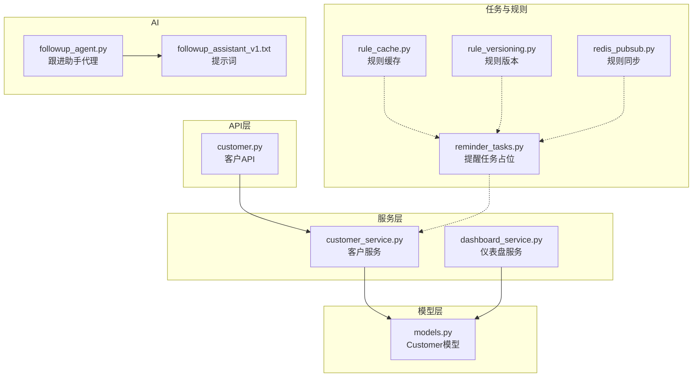
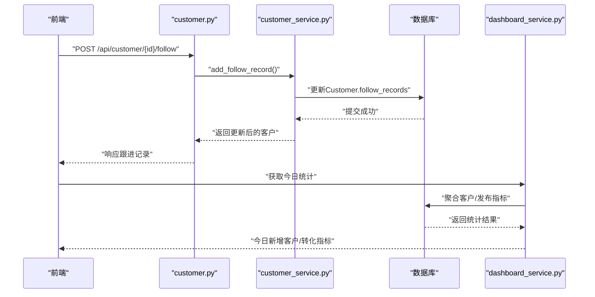
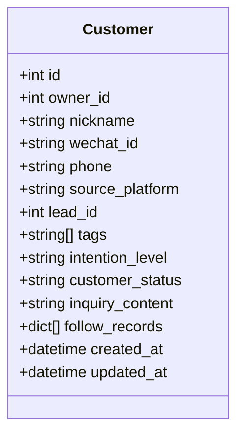
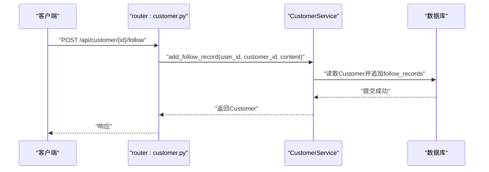
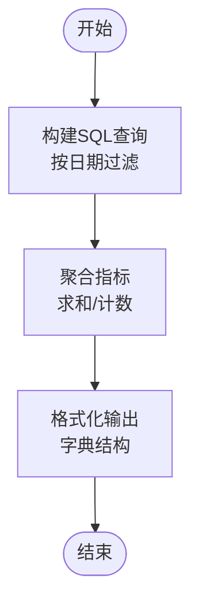
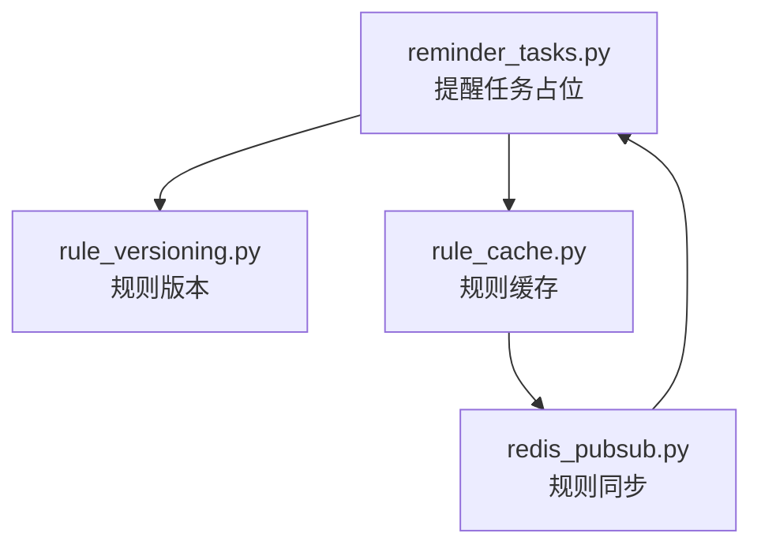
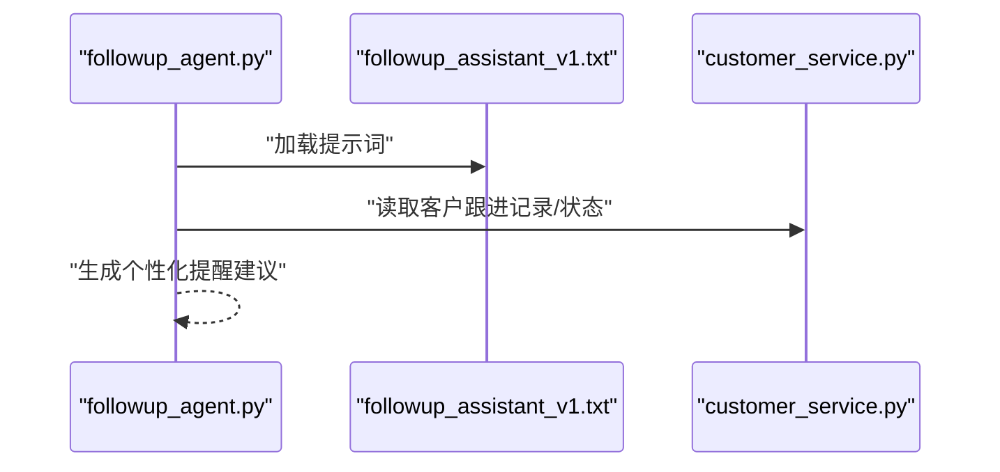
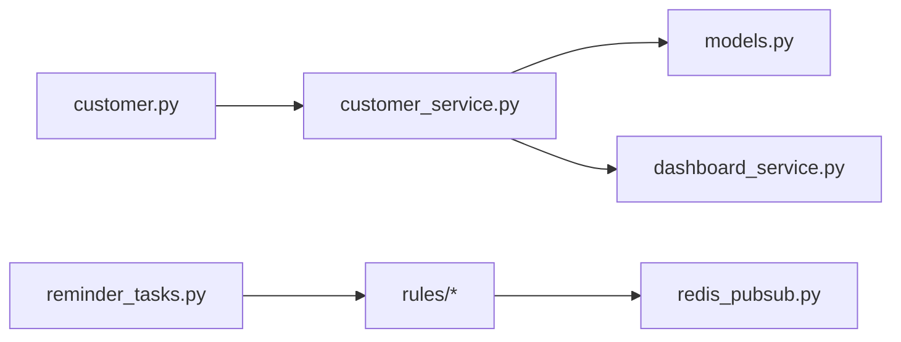

# 跟进提醒系统

<cite>
**本文引用的文件**
- [backend/app/taks/reminder_tasks.py](file://backend/app/tasks/reminder_tasks.py)
- [backend/app/ai/agents/followup_agent.py](file://backend/app/ai/agents/followup_agent.py)
- [backend/app/ai/prompts/followup_assistant_v1.txt](file://backend/app/ai/prompts/followup_assistant_v1.txt)
- [backend/app/services/customer_service.py](file://backend/app/services/customer_service.py)
- [backend/app/api/endpoints/customer.py](file://backend/app/api/endpoints/customer.py)
- [backend/app/models/models.py](file://backend/app/models/models.py)
- [backend/app/schemas/schemas.py](file://backend/app/schemas/schemas.py)
- [backend/app/services/dashboard_service.py](file://backend/app/services/dashboard_service.py)
- [backend/app/rules/dynamic/rule_cache.py](file://backend/app/rules/dynamic/rule_cache.py)
- [backend/app/rules/dynamic/rule_versioning.py](file://backend/app/rules/dynamic/rule_versioning.py)
- [backend/app/rules/sync/redis_pubsub.py](file://backend/app/rules/sync/redis_pubsub.py)
- [backend/alembic/versions/20260327_02_add_material_knowledge_pipeline.py](file://backend/alembic/versions/20260327_02_add_material_knowledge_pipeline.py)
- [backend/test_material_pipeline_postgres_regression.py](file://backend/test_material_pipeline_postgres_regression.py)
</cite>

## 目录
1. [简介](#简介)
2. [项目结构](#项目结构)
3. [核心组件](#核心组件)
4. [架构总览](#架构总览)
5. [详细组件分析](#详细组件分析)
6. [依赖分析](#依赖分析)
7. [性能考虑](#性能考虑)
8. [故障排查指南](#故障排查指南)
9. [结论](#结论)
10. [附录](#附录)

## 简介
本文件面向“智获客”跟进提醒系统，围绕“跟进计划制定、提醒规则配置、智能提醒算法、提醒执行机制、跟进记录管理、提醒模板与批量操作”等关键能力，提供从架构到实现细节的完整说明。当前代码库已具备客户模型、跟进记录字段、基础API接口与仪表盘统计能力，并包含AI跟进助手提示词与规则动态化基础设施，为后续扩展“定期跟进、事件触发、智能提醒”提供坚实基础。

## 项目结构
- 后端采用分层架构：API路由层、服务层、模型层、任务与规则层、AI提示词与代理层。
- 客户相关能力集中在模型与服务层，提供跟进记录字段与待跟进查询；仪表盘服务提供统计数据聚合；提醒任务与AI代理预留扩展点；规则系统支持动态版本与缓存。

图表来源
- [backend/app/api/endpoints/customer.py:1-148](file://backend/app/api/endpoints/customer.py#L1-L148)
- [backend/app/services/customer_service.py:46-114](file://backend/app/services/customer_service.py#L46-L114)
- [backend/app/models/models.py:229-255](file://backend/app/models/models.py#L229-L255)
- [backend/app/services/dashboard_service.py:1-209](file://backend/app/services/dashboard_service.py#L1-L209)
- [backend/app/taks/reminder_tasks.py:1-3](file://backend/app/tasks/reminder_tasks.py#L1-L3)
- [backend/app/rules/dynamic/rule_cache.py:1-6](file://backend/app/rules/dynamic/rule_cache.py#L1-L6)
- [backend/app/rules/dynamic/rule_versioning.py:1-2](file://backend/app/rules/dynamic/rule_versioning.py#L1-L2)
- [backend/app/rules/sync/redis_pubsub.py:1-2](file://backend/app/rules/sync/redis_pubsub.py#L1-L2)
- [backend/app/ai/agents/followup_agent.py:1-3](file://backend/app/ai/agents/followup_agent.py#L1-L3)
- [backend/app/ai/prompts/followup_assistant_v1.txt:1-1](file://backend/app/ai/prompts/followup_assistant_v1.txt#L1-L1)

章节来源
- [backend/app/api/endpoints/customer.py:1-148](file://backend/app/api/endpoints/customer.py#L1-L148)
- [backend/app/services/customer_service.py:46-114](file://backend/app/services/customer_service.py#L46-L114)
- [backend/app/models/models.py:229-255](file://backend/app/models/models.py#L229-L255)
- [backend/app/services/dashboard_service.py:1-209](file://backend/app/services/dashboard_service.py#L1-L209)
- [backend/app/taks/reminder_tasks.py:1-3](file://backend/app/tasks/reminder_tasks.py#L1-L3)
- [backend/app/rules/dynamic/rule_cache.py:1-6](file://backend/app/rules/dynamic/rule_cache.py#L1-L6)
- [backend/app/rules/dynamic/rule_versioning.py:1-2](file://backend/app/rules/dynamic/rule_versioning.py#L1-L2)
- [backend/app/rules/sync/redis_pubsub.py:1-2](file://backend/app/rules/sync/redis_pubsub.py#L1-L2)
- [backend/app/ai/agents/followup_agent.py:1-3](file://backend/app/ai/agents/followup_agent.py#L1-L3)
- [backend/app/ai/prompts/followup_assistant_v1.txt:1-1](file://backend/app/ai/prompts/followup_assistant_v1.txt#L1-L1)

## 核心组件
- 客户模型与跟进记录
  - Customer模型包含跟进记录数组字段，用于存储每次跟进的时间、内容与负责人信息。
  - 提供“添加跟进记录”“获取待跟进客户列表”等服务方法。
- 客户API
  - 提供创建、查询、更新、删除客户以及添加跟进记录、导出CSV等接口。
- 仪表盘统计
  - 提供今日新增客户、转化指标等汇总数据，便于评估跟进效果。
- 提醒任务与规则系统
  - 提供提醒任务占位函数、规则缓存、规则版本与Redis发布订阅接口，为后续实现定时/事件触发提醒与规则下发提供基础。
- AI跟进助手
  - 提供跟进助手代理与提示词文件，为智能提醒策略提供AI能力入口。

章节来源
- [backend/app/models/models.py:229-255](file://backend/app/models/models.py#L229-L255)
- [backend/app/services/customer_service.py:78-114](file://backend/app/services/customer_service.py#L78-L114)
- [backend/app/api/endpoints/customer.py:21-105](file://backend/app/api/endpoints/customer.py#L21-L105)
- [backend/app/services/dashboard_service.py:9-35](file://backend/app/services/dashboard_service.py#L9-L35)
- [backend/app/taks/reminder_tasks.py:1-3](file://backend/app/tasks/reminder_tasks.py#L1-L3)
- [backend/app/rules/dynamic/rule_cache.py:1-6](file://backend/app/rules/dynamic/rule_cache.py#L1-L6)
- [backend/app/rules/dynamic/rule_versioning.py:1-2](file://backend/app/rules/dynamic/rule_versioning.py#L1-L2)
- [backend/app/rules/sync/redis_pubsub.py:1-2](file://backend/app/rules/sync/redis_pubsub.py#L1-L2)
- [backend/app/ai/agents/followup_agent.py:1-3](file://backend/app/ai/agents/followup_agent.py#L1-L3)
- [backend/app/ai/prompts/followup_assistant_v1.txt:1-1](file://backend/app/ai/prompts/followup_assistant_v1.txt#L1-L1)

## 架构总览
系统以“API → 服务 → 模型/规则/任务/AI”的分层组织，客户数据贯穿跟进记录、提醒规则与AI策略，仪表盘提供效果评估。

图表来源
- [backend/app/api/endpoints/customer.py:72-83](file://backend/app/api/endpoints/customer.py#L72-L83)
- [backend/app/services/customer_service.py:78-98](file://backend/app/services/customer_service.py#L78-L98)
- [backend/app/services/dashboard_service.py:9-35](file://backend/app/services/dashboard_service.py#L9-L35)

## 详细组件分析

### 客户模型与跟进记录
- 数据结构要点
  - follow_records为JSON数组，每条记录包含日期、内容、负责人等字段。
  - 支持按状态筛选“待跟进客户”，便于提醒任务识别目标群体。
- 复杂度与性能
  - 追加跟进记录为O(1)，查询列表受索引与过滤条件影响；建议对owner_id、customer_status建立索引以提升查询效率。

图表来源
- [backend/app/models/models.py:229-255](file://backend/app/models/models.py#L229-L255)

章节来源
- [backend/app/models/models.py:229-255](file://backend/app/models/models.py#L229-L255)
- [backend/app/services/customer_service.py:78-114](file://backend/app/services/customer_service.py#L78-L114)

### 客户API与跟进记录接口
- 接口能力
  - 创建/查询/更新/删除客户
  - 添加跟进记录（内容、可选跟进日期）
  - 导出客户数据为CSV
  - 获取“待跟进客户”列表
- 参数与返回
  - 使用Pydantic模型进行请求/响应校验，确保字段类型与默认值一致。

图表来源
- [backend/app/api/endpoints/customer.py:72-83](file://backend/app/api/endpoints/customer.py#L72-L83)
- [backend/app/services/customer_service.py:78-98](file://backend/app/services/customer_service.py#L78-L98)
- [backend/app/schemas/schemas.py:183-186](file://backend/app/schemas/schemas.py#L183-L186)

章节来源
- [backend/app/api/endpoints/customer.py:21-105](file://backend/app/api/endpoints/customer.py#L21-L105)
- [backend/app/schemas/schemas.py:164-201](file://backend/app/schemas/schemas.py#L164-L201)

### 仪表盘统计与效果评估
- 统计维度
  - 今日新增客户数、微信添加数、线索数、有效线索数、转化数等。
- 查询逻辑
  - 基于SQLAlchemy聚合函数与日期过滤，支持趋势与平台分析。

图表来源
- [backend/app/services/dashboard_service.py:9-35](file://backend/app/services/dashboard_service.py#L9-L35)

章节来源
- [backend/app/services/dashboard_service.py:1-209](file://backend/app/services/dashboard_service.py#L1-L209)

### 提醒任务与规则系统
- 当前状态
  - 提醒任务占位函数存在但未实现具体逻辑。
  - 规则系统提供缓存、版本与Redis发布订阅接口，便于后续接入提醒规则下发与生效。
- 扩展建议
  - 在reminder_tasks中实现定时扫描、事件触发与规则匹配逻辑。
  - 结合follow_records与customer_status，判断是否需要发送提醒。
  - 通过规则版本与缓存控制提醒策略的动态更新。

图表来源
- [backend/app/taks/reminder_tasks.py:1-3](file://backend/app/tasks/reminder_tasks.py#L1-L3)
- [backend/app/rules/dynamic/rule_versioning.py:1-2](file://backend/app/rules/dynamic/rule_versioning.py#L1-L2)
- [backend/app/rules/dynamic/rule_cache.py:1-6](file://backend/app/rules/dynamic/rule_cache.py#L1-L6)
- [backend/app/rules/sync/redis_pubsub.py:1-2](file://backend/app/rules/sync/redis_pubsub.py#L1-L2)

章节来源
- [backend/app/taks/reminder_tasks.py:1-3](file://backend/app/tasks/reminder_tasks.py#L1-L3)
- [backend/app/rules/dynamic/rule_versioning.py:1-2](file://backend/app/rules/dynamic/rule_versioning.py#L1-L2)
- [backend/app/rules/dynamic/rule_cache.py:1-6](file://backend/app/rules/dynamic/rule_cache.py#L1-L6)
- [backend/app/rules/sync/redis_pubsub.py:1-2](file://backend/app/rules/sync/redis_pubsub.py#L1-L2)

### AI跟进助手与智能提醒策略
- 能力入口
  - followup_agent提供代理入口，followup_assistant_v1.txt提供提示词模板。
- 应用方向
  - 可结合客户行为、意向等级、跟进记录与购买历史，生成个性化提醒话术与建议。
  - 将AI生成内容作为提醒模板的一部分，或驱动提醒策略决策。

图表来源
- [backend/app/ai/agents/followup_agent.py:1-3](file://backend/app/ai/agents/followup_agent.py#L1-L3)
- [backend/app/ai/prompts/followup_assistant_v1.txt:1-1](file://backend/app/ai/prompts/followup_assistant_v1.txt#L1-L1)
- [backend/app/services/customer_service.py:78-114](file://backend/app/services/customer_service.py#L78-L114)

章节来源
- [backend/app/ai/agents/followup_agent.py:1-3](file://backend/app/ai/agents/followup_agent.py#L1-L3)
- [backend/app/ai/prompts/followup_assistant_v1.txt:1-1](file://backend/app/ai/prompts/followup_assistant_v1.txt#L1-L1)

### 提醒模板管理与批量操作
- 提醒模板
  - 规则系统迁移脚本中包含rules表结构，可用于存储提醒模板名称、内容、优先级与上下文字段（平台、账号类型、目标受众）。
- 批量操作
  - 客户导出CSV接口可用于批量导出跟进客户数据，便于离线处理与批量提醒。
  - 可在规则系统基础上扩展“批量应用提醒模板”“批量标记状态”等功能。

章节来源
- [backend/alembic/versions/20260327_02_add_material_knowledge_pipeline.py:200-220](file://backend/alembic/versions/20260327_02_add_material_knowledge_pipeline.py#L200-L220)
- [backend/app/api/endpoints/customer.py:108-147](file://backend/app/api/endpoints/customer.py#L108-L147)

## 依赖分析
- 组件耦合
  - API层仅依赖服务层；服务层依赖模型层与数据库；规则与任务层相互解耦，通过缓存与版本号交互。
- 外部集成
  - Redis发布订阅用于规则变更通知；数据库提供客户与发布记录等核心数据。
- 循环依赖
  - 当前文件间未见循环依赖迹象。

图表来源
- [backend/app/api/endpoints/customer.py:1-148](file://backend/app/api/endpoints/customer.py#L1-L148)
- [backend/app/services/customer_service.py:46-114](file://backend/app/services/customer_service.py#L46-L114)
- [backend/app/models/models.py:229-255](file://backend/app/models/models.py#L229-L255)
- [backend/app/services/dashboard_service.py:1-209](file://backend/app/services/dashboard_service.py#L1-L209)
- [backend/app/taks/reminder_tasks.py:1-3](file://backend/app/tasks/reminder_tasks.py#L1-L3)
- [backend/app/rules/sync/redis_pubsub.py:1-2](file://backend/app/rules/sync/redis_pubsub.py#L1-L2)

## 性能考虑
- 查询优化
  - 对owner_id、customer_status、created_at等字段建立索引，提升“待跟进客户”与统计查询性能。
- 写入优化
  - 追加跟进记录为数组拼接，建议限制单次记录数量或采用分页展示，避免单文档过大。
- 规则系统
  - 规则缓存与版本控制可减少频繁读库；Redis发布订阅降低广播延迟。
- AI调用
  - 提示词加载与模型调用应异步化，避免阻塞主线程。

## 故障排查指南
- 客户不存在
  - 获取客户接口若找不到记录会抛出HTTP 404，需检查用户权限与客户ID。
- 跟进记录为空
  - 若follow_records为空，需确认是否正确调用添加接口或数据库写入是否成功。
- 仪表盘数据异常
  - 检查日期过滤逻辑与聚合字段是否匹配实际数据结构。
- 规则未生效
  - 确认规则版本号递增、缓存命中、Redis发布订阅通道正常。

章节来源
- [backend/app/services/customer_service.py:46-57](file://backend/app/services/customer_service.py#L46-L57)
- [backend/app/api/endpoints/customer.py:48-55](file://backend/app/api/endpoints/customer.py#L48-L55)
- [backend/app/services/dashboard_service.py:9-35](file://backend/app/services/dashboard_service.py#L9-L35)
- [backend/app/rules/dynamic/rule_cache.py:1-6](file://backend/app/rules/dynamic/rule_cache.py#L1-L6)
- [backend/app/rules/dynamic/rule_versioning.py:1-2](file://backend/app/rules/dynamic/rule_versioning.py#L1-L2)
- [backend/app/rules/sync/redis_pubsub.py:1-2](file://backend/app/rules/sync/redis_pubsub.py#L1-L2)

## 结论
当前系统已具备客户模型与跟进记录、基础API与仪表盘统计能力，并预留提醒任务、规则系统与AI助手扩展点。建议下一步完善提醒任务调度、事件触发与规则下发机制，结合AI生成个性化提醒策略，并在规则系统基础上实现提醒模板与批量操作能力，最终形成“定期+事件+智能”的完整跟进提醒体系。

## 附录
- 数据库迁移与规则表结构
  - 迁移脚本展示了rules与prompt_templates表结构，可用于存储提醒模板与规则。
- 测试用例参考
  - 测试文件中包含线索转客户与状态流转的断言，可作为提醒触发条件设计的参考。

章节来源
- [backend/alembic/versions/20260327_02_add_material_knowledge_pipeline.py:200-220](file://backend/alembic/versions/20260327_02_add_material_knowledge_pipeline.py#L200-L220)
- [backend/test_material_pipeline_postgres_regression.py:638-854](file://backend/test_material_pipeline_postgres_regression.py#L638-L854)