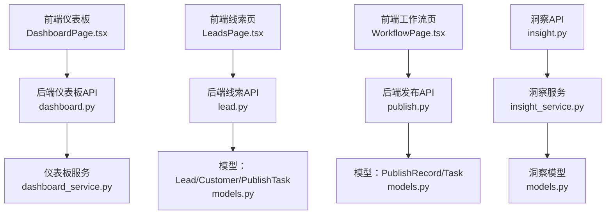
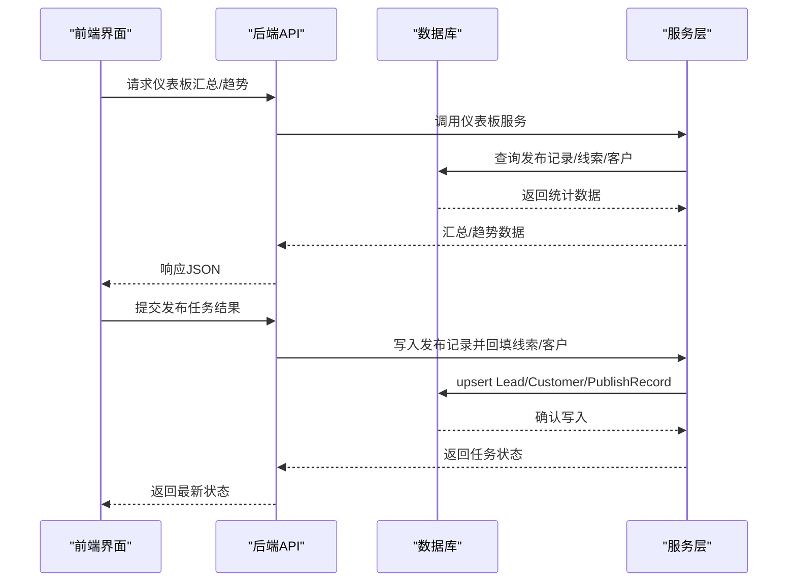
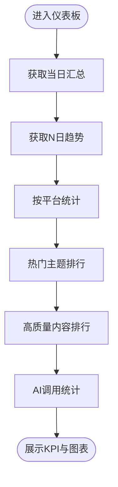
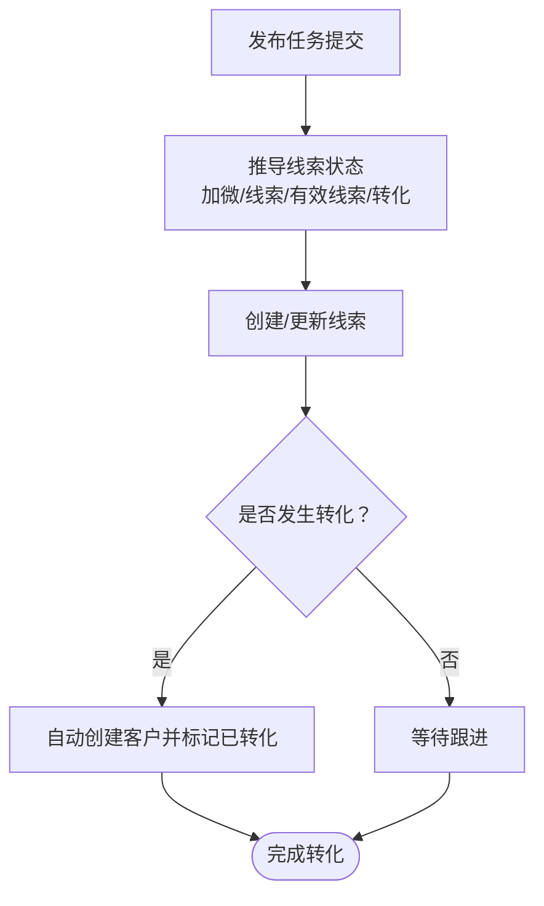
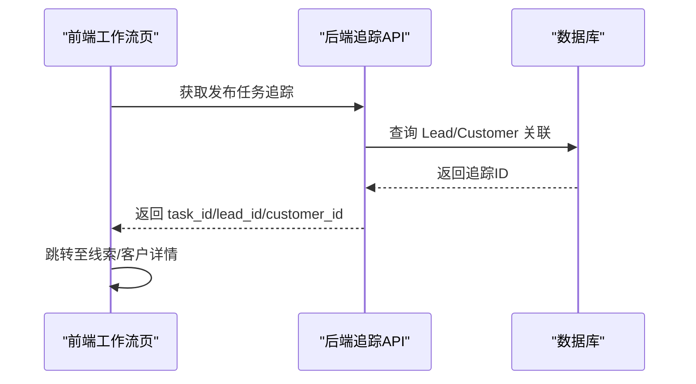
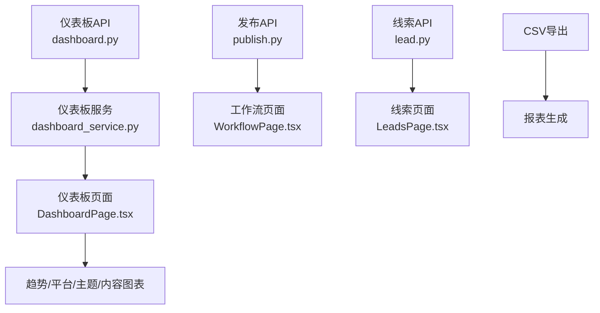
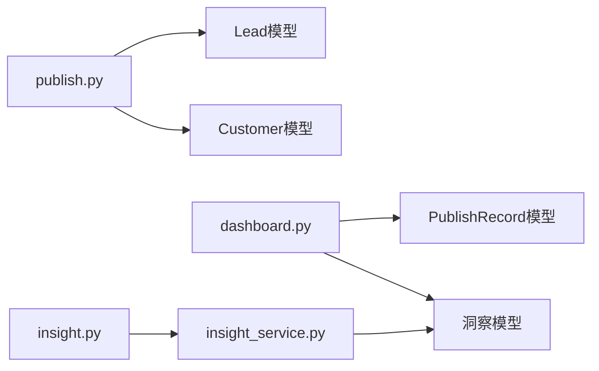
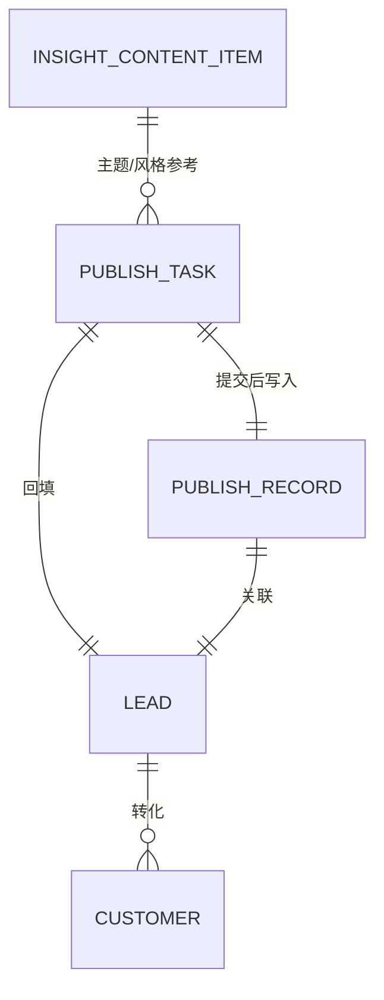

# 转化跟踪

<cite>
**本文引用的文件**
- [backend/app/api/endpoints/dashboard.py](file://backend/app/api/endpoints/dashboard.py)
- [backend/app/services/dashboard_service.py](file://backend/app/services/dashboard_service.py)
- [backend/app/api/endpoints/insight.py](file://backend/app/api/endpoints/insight.py)
- [backend/app/services/insight_service.py](file://backend/app/services/insight_service.py)
- [backend/app/models/models.py](file://backend/app/models/models.py)
- [backend/app/schemas/schemas.py](file://backend/app/schemas/schemas.py)
- [backend/app/api/endpoints/lead.py](file://backend/app/api/endpoints/lead.py)
- [backend/app/api/endpoints/publish.py](file://backend/app/api/endpoints/publish.py)
- [backend/app/api/endpoints/customer.py](file://backend/app/api/endpoints/customer.py)
- [backend/app/services/customer_service.py](file://backend/app/services/customer_service.py)
- [desktop/src/pages/dashboard/DashboardPage.tsx](file://desktop/src/pages/dashboard/DashboardPage.tsx)
- [desktop/src/pages/leads/LeadsPage.tsx](file://desktop/src/pages/leads/LeadsPage.tsx)
- [desktop/src/pages/WorkflowPage.tsx](file://desktop/src/pages/WorkflowPage.tsx)
</cite>

## 目录
1. [简介](#简介)
2. [项目结构](#项目结构)
3. [核心组件](#核心组件)
4. [架构总览](#架构总览)
5. [详细组件分析](#详细组件分析)
6. [依赖分析](#依赖分析)
7. [性能考虑](#性能考虑)
8. [故障排查指南](#故障排查指南)
9. [结论](#结论)
10. [附录](#附录)

## 简介
本文件面向“智获客转化跟踪系统”，围绕线索到成交的转化漏斗、转化路径、转化归因、转化预测与KPI指标体系进行系统化技术文档梳理，并结合后端API与前端页面实现，给出可操作的可视化与报表能力说明。文档同时提供流程图与时序图帮助非技术读者理解业务闭环。

## 项目结构
系统采用前后端分离架构：
- 后端：FastAPI + SQLAlchemy，提供转化漏斗、线索管理、发布任务与客户管理等能力
- 前端：桌面端 Electron + React，提供仪表板、线索与客户管理、工作流追踪等界面
- 数据模型：统一定义线索、客户、发布记录、洞察内容等实体与关系

图表来源
- [backend/app/api/endpoints/dashboard.py:11-32](file://backend/app/api/endpoints/dashboard.py#L11-L32)
- [backend/app/services/dashboard_service.py:7-35](file://backend/app/services/dashboard_service.py#L7-L35)
- [backend/app/api/endpoints/lead.py:29-39](file://backend/app/api/endpoints/lead.py#L29-L39)
- [backend/app/api/endpoints/publish.py:70-122](file://backend/app/api/endpoints/publish.py#L70-L122)
- [backend/app/models/models.py:199-257](file://backend/app/models/models.py#L199-L257)
- [backend/app/api/endpoints/insight.py:216-231](file://backend/app/api/endpoints/insight.py#L216-L231)
- [backend/app/services/insight_service.py:382-496](file://backend/app/services/insight_service.py#L382-L496)

章节来源
- [backend/app/api/endpoints/dashboard.py:1-100](file://backend/app/api/endpoints/dashboard.py#L1-L100)
- [backend/app/services/dashboard_service.py:1-209](file://backend/app/services/dashboard_service.py#L1-L209)
- [backend/app/api/endpoints/lead.py:1-175](file://backend/app/api/endpoints/lead.py#L1-L175)
- [backend/app/api/endpoints/publish.py:1-606](file://backend/app/api/endpoints/publish.py#L1-L606)
- [backend/app/models/models.py:199-290](file://backend/app/models/models.py#L199-L290)
- [backend/app/api/endpoints/insight.py:1-410](file://backend/app/api/endpoints/insight.py#L1-L410)
- [backend/app/services/insight_service.py:1-659](file://backend/app/services/insight_service.py#L1-L659)

## 核心组件
- 仪表板与趋势：提供当日新增客户、加微、线索、有效线索、转化等汇总与近N日趋势
- 转化漏斗：通过发布任务回填生成线索，再由线索转化为客户，形成“发布-线索-客户”的漏斗链路
- 转化路径：提供发布任务-线索-客户的追踪ID链路，便于可视化展示与人工核验
- 转化归因：当前系统以发布任务为归因起点，后续可在发布记录层面扩展首次/末次/时间衰减等归因
- 转化预测：系统具备洞察内容的热度与风格等特征，可作为预测输入；预测算法需在现有特征基础上扩展
- KPI指标：转化率、有效线索率、加微率、客单价与客户生命周期价值等指标可基于现有数据派生

章节来源
- [backend/app/api/endpoints/dashboard.py:11-67](file://backend/app/api/endpoints/dashboard.py#L11-L67)
- [backend/app/services/dashboard_service.py:7-83](file://backend/app/services/dashboard_service.py#L7-L83)
- [backend/app/api/endpoints/publish.py:291-309](file://backend/app/api/endpoints/publish.py#L291-L309)
- [backend/app/api/endpoints/lead.py:117-137](file://backend/app/api/endpoints/lead.py#L117-L137)
- [backend/app/models/models.py:259-289](file://backend/app/models/models.py#L259-L289)

## 架构总览
系统围绕“发布-线索-客户”闭环构建，后端提供REST API，前端负责可视化与交互。

图表来源
- [backend/app/api/endpoints/dashboard.py:11-67](file://backend/app/api/endpoints/dashboard.py#L11-L67)
- [backend/app/services/dashboard_service.py:7-83](file://backend/app/services/dashboard_service.py#L7-L83)
- [backend/app/api/endpoints/publish.py:407-481](file://backend/app/api/endpoints/publish.py#L407-L481)
- [backend/app/api/endpoints/lead.py:140-174](file://backend/app/api/endpoints/lead.py#L140-L174)

## 详细组件分析

### 仪表板与KPI
- 当日汇总：新增客户、加微、线索、有效线索、转化
- 趋势分析：近N日发布次数、阅读量、私信、加微、线索、有效线索、转化
- 平台分析：按平台统计线索与转化
- 热门主题：按有效线索排序的主题TOP
- 高质量内容：按有效线索排序的内容TOP
- AI调用统计：按日期与用户聚合调用次数、失败率、Token用量、延迟

图表来源
- [backend/app/api/endpoints/dashboard.py:11-99](file://backend/app/api/endpoints/dashboard.py#L11-L99)
- [backend/app/services/dashboard_service.py:7-209](file://backend/app/services/dashboard_service.py#L7-L209)

章节来源
- [backend/app/api/endpoints/dashboard.py:11-99](file://backend/app/api/endpoints/dashboard.py#L11-L99)
- [backend/app/services/dashboard_service.py:7-209](file://backend/app/services/dashboard_service.py#L7-L209)
- [backend/app/schemas/schemas.py:418-480](file://backend/app/schemas/schemas.py#L418-L480)

### 转化漏斗分析
- 发布任务提交后，系统根据任务指标自动回填线索状态与数量，并在有转化时自动创建客户
- 漏斗阶段：
  - 发布：发布任务提交
  - 线索：根据加微、线索、有效线索、转化等指标判定线索状态
  - 客户：当转化数大于0时自动创建客户并标记为已转化

图表来源
- [backend/app/api/endpoints/publish.py:70-122](file://backend/app/api/endpoints/publish.py#L70-L122)
- [backend/app/models/models.py:199-257](file://backend/app/models/models.py#L199-L257)

章节来源
- [backend/app/api/endpoints/publish.py:70-122](file://backend/app/api/endpoints/publish.py#L70-L122)
- [backend/app/models/models.py:199-257](file://backend/app/models/models.py#L199-L257)

### 转化路径分析
- 提供发布任务-线索-客户的追踪链路，便于可视化展示与人工核验
- 前端可基于追踪ID跳转至对应线索或客户详情页

图表来源
- [backend/app/api/endpoints/publish.py:291-309](file://backend/app/api/endpoints/publish.py#L291-L309)
- [desktop/src/pages/WorkflowPage.tsx:208-236](file://desktop/src/pages/WorkflowPage.tsx#L208-L236)

章节来源
- [backend/app/api/endpoints/publish.py:291-309](file://backend/app/api/endpoints/publish.py#L291-L309)
- [desktop/src/pages/WorkflowPage.tsx:208-236](file://desktop/src/pages/WorkflowPage.tsx#L208-L236)

### 转化归因模型
- 归因起点：发布任务（发布渠道/账号/内容）
- 归因扩展建议：
  - 首次接触：以首次触达平台/内容为归因
  - 最后接触：以最后一次触达平台/内容为归因
  - 时间衰减：按时间窗口对点击/浏览赋予不同权重
- 实现要点：在发布记录或线索表中增加归因字段，结合用户行为序列进行计算

章节来源
- [backend/app/models/models.py:259-289](file://backend/app/models/models.py#L259-L289)
- [backend/app/api/endpoints/publish.py:407-481](file://backend/app/api/endpoints/publish.py#L407-L481)

### 转化预测算法
- 现状：系统具备洞察内容的互动分、热度分层、主题与风格等特征
- 预测输入：内容特征（标题公式、痛点、结构、风格）、平台、受众标签、风险等级
- 建议步骤：
  - 特征工程：将洞察内容特征映射为数值向量
  - 模型选择：逻辑回归/GBDT/XGBoost/LightGBM等
  - 目标变量：有效线索/转化率（需历史标注）
  - 训练与评估：交叉验证、AUC/MAP等指标
  - 在线推理：将新内容特征输入模型得到转化概率

章节来源
- [backend/app/api/endpoints/insight.py:216-231](file://backend/app/api/endpoints/insight.py#L216-L231)
- [backend/app/services/insight_service.py:382-496](file://backend/app/services/insight_service.py#L382-L496)
- [backend/app/models/models.py:810-884](file://backend/app/models/models.py#L810-L884)

### KPI指标体系
- 转化率：转化数/有效线索
- 有效线索率：有效线索/线索
- 加微率：加微/线索
- 客单价：成交金额/转化数（需业务补充）
- 客户生命周期价值：需结合客户后续消费与留存建模（需业务补充）

章节来源
- [backend/app/services/dashboard_service.py:118-149](file://backend/app/services/dashboard_service.py#L118-L149)
- [backend/app/schemas/schemas.py:471-480](file://backend/app/schemas/schemas.py#L471-L480)

### 实时监控与报表
- 仪表板：前端展示当日汇总、趋势折线、平台对比、热门主题与高质量内容
- 报表导出：发布任务与客户导出CSV，便于离线分析

图表来源
- [backend/app/api/endpoints/dashboard.py:11-99](file://backend/app/api/endpoints/dashboard.py#L11-L99)
- [backend/app/services/dashboard_service.py:7-209](file://backend/app/services/dashboard_service.py#L7-L209)
- [desktop/src/pages/dashboard/DashboardPage.tsx:74-93](file://desktop/src/pages/dashboard/DashboardPage.tsx#L74-L93)
- [backend/app/api/endpoints/publish.py:543-605](file://backend/app/api/endpoints/publish.py#L543-L605)
- [desktop/src/pages/WorkflowPage.tsx:208-236](file://desktop/src/pages/WorkflowPage.tsx#L208-L236)
- [desktop/src/pages/leads/LeadsPage.tsx:1-38](file://desktop/src/pages/leads/LeadsPage.tsx#L1-L38)

章节来源
- [desktop/src/pages/dashboard/DashboardPage.tsx:74-93](file://desktop/src/pages/dashboard/DashboardPage.tsx#L74-L93)
- [backend/app/api/endpoints/publish.py:543-605](file://backend/app/api/endpoints/publish.py#L543-L605)
- [backend/app/api/endpoints/customer.py:108-147](file://backend/app/api/endpoints/customer.py#L108-L147)

## 依赖分析
- 模块耦合：
  - 发布API依赖线索与客户模型，用于回填与自动转化
  - 仪表板服务依赖发布记录与洞察内容模型，用于统计与排行
  - 前端页面依赖后端API提供的数据结构
- 外部依赖：
  - 数据库：PostgreSQL（通过SQLAlchemy ORM）
  - 前端：React + ECharts（趋势图）

图表来源
- [backend/app/api/endpoints/publish.py:13-25](file://backend/app/api/endpoints/publish.py#L13-L25)
- [backend/app/models/models.py:199-289](file://backend/app/models/models.py#L199-L289)
- [backend/app/api/endpoints/dashboard.py:1-20](file://backend/app/api/endpoints/dashboard.py#L1-L20)
- [backend/app/api/endpoints/insight.py:46-48](file://backend/app/api/endpoints/insight.py#L46-L48)
- [backend/app/services/insight_service.py:14-19](file://backend/app/services/insight_service.py#L14-L19)

章节来源
- [backend/app/models/models.py:199-289](file://backend/app/models/models.py#L199-L289)
- [backend/app/api/endpoints/publish.py:13-25](file://backend/app/api/endpoints/publish.py#L13-L25)
- [backend/app/api/endpoints/dashboard.py:1-20](file://backend/app/api/endpoints/dashboard.py#L1-L20)
- [backend/app/api/endpoints/insight.py:46-48](file://backend/app/api/endpoints/insight.py#L46-L48)

## 性能考虑
- 查询优化：仪表板趋势按日期分组聚合，建议在日期与平台字段建立索引
- 批量导入：洞察内容批量导入时注意事务与异常处理，避免单条失败影响整体
- 缓存策略：热点排行（热门主题/高质量内容）可引入Redis缓存
- 导出性能：CSV导出限制最大行数，避免超大数据集导致内存压力

## 故障排查指南
- 权限校验：线索与发布任务接口均包含访问控制，确保当前用户为任务/线索所有者或经授权
- 数据一致性：发布任务提交后会回填线索与客户，若状态异常，检查任务指标是否正确提交
- 前端跳转：工作流追踪需确保存在对应的线索/客户ID，否则前端按钮不可用

章节来源
- [backend/app/api/endpoints/lead.py:80-90](file://backend/app/api/endpoints/lead.py#L80-L90)
- [backend/app/api/endpoints/publish.py:407-481](file://backend/app/api/endpoints/publish.py#L407-L481)
- [desktop/src/pages/WorkflowPage.tsx:208-236](file://desktop/src/pages/WorkflowPage.tsx#L208-L236)

## 结论
系统已具备完整的“发布-线索-客户”转化闭环与基础的可视化能力。建议下一步完善归因模型、引入转化预测算法，并扩展KPI指标与报表能力，以支撑更精细化的营销效果评估与决策。

## 附录
- 数据模型概览（与转化相关的关键实体）
  - Lead：线索池，包含平台、标题、加微、线索、有效线索、转化、状态等
  - Customer：客户，包含来源平台、标签、意向等级、状态等
  - PublishRecord：发布记录，包含平台、账号、发布时间、阅读/点赞/分享/私信/加微/线索/有效线索/转化等
  - PublishTask：发布任务，包含任务标题、内容文本、状态、分配与提交等
  - InsightContentItem：洞察内容，包含互动分、热度分层、主题、受众标签、风格、CTA等

图表来源
- [backend/app/models/models.py:199-289](file://backend/app/models/models.py#L199-L289)
- [backend/app/models/models.py:810-884](file://backend/app/models/models.py#L810-L884)