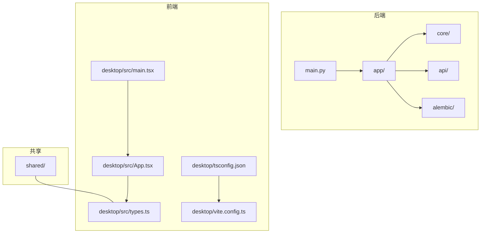
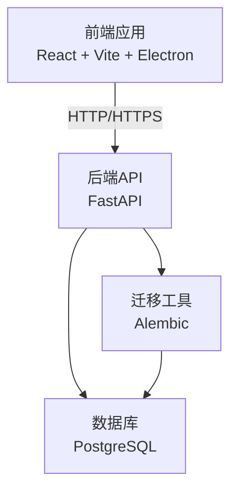
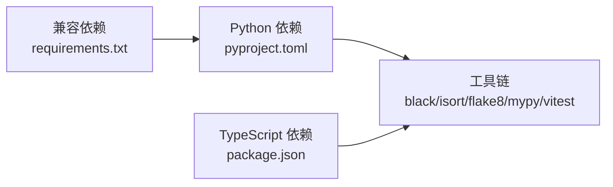

# 代码规范与约定

<cite>
**本文引用的文件**
- [backend/pyproject.toml](file://backend/pyproject.toml)
- [backend/requirements.txt](file://backend/requirements.txt)
- [backend/alembic.ini](file://backend/alembic.ini)
- [backend/app/core/config.py](file://backend/app/core/config.py)
- [backend/app/api/router.py](file://backend/app/api/router.py)
- [backend/app/api/endpoints/auth.py](file://backend/app/api/endpoints/auth.py)
- [backend/QUICKSTART.md](file://backend/QUICKSTART.md)
- [desktop/package.json](file://desktop/package.json)
- [desktop/tsconfig.json](file://desktop/tsconfig.json)
- [desktop/vite.config.ts](file://desktop/vite.config.ts)
- [desktop/src/types.ts](file://desktop/src/types.ts)
- [desktop/src/App.tsx](file://desktop/src/App.tsx)
- [desktop/src/main.tsx](file://desktop/src/main.tsx)
- [shared/README.md](file://shared/README.md)
</cite>

## 目录
1. [引言](#引言)
2. [项目结构](#项目结构)
3. [核心组件](#核心组件)
4. [架构总览](#架构总览)
5. [详细组件分析](#详细组件分析)
6. [依赖分析](#依赖分析)
7. [性能考虑](#性能考虑)
8. [故障排查指南](#故障排查指南)
9. [结论](#结论)
10. [附录](#附录)

## 引言
本文件为“智获客”项目制定统一的代码规范与约定，覆盖后端 Python、前端 TypeScript/React、数据库模型与迁移、API 设计、文件组织与模块导入、依赖管理、代码审查与提交规范，以及自动化格式化与静态分析工具配置建议。目标是提升代码一致性、可维护性与协作效率。

## 项目结构
项目采用前后端分离与多子工程布局：
- 后端：FastAPI 应用，包含核心配置、API 路由、领域服务、数据模型与 Alembic 迁移。
- 前端：Vite + React + Electron 多端应用，包含页面、组件、类型定义与构建配置。
- 共享层：跨端共享的常量、枚举、类型与协议。
- 部署与运维：Docker 编排与部署脚本。

图表来源
- [backend/app/api/router.py:1-35](file://backend/app/api/router.py#L1-L35)
- [desktop/src/main.tsx:1-14](file://desktop/src/main.tsx#L1-L14)
- [desktop/src/App.tsx:1-163](file://desktop/src/App.tsx#L1-L163)
- [desktop/tsconfig.json:1-19](file://desktop/tsconfig.json#L1-L19)
- [desktop/vite.config.ts:1-23](file://desktop/vite.config.ts#L1-L23)

章节来源
- [backend/QUICKSTART.md:71-105](file://backend/QUICKSTART.md#L71-L105)
- [desktop/package.json:1-77](file://desktop/package.json#L1-L77)

## 核心组件
- 后端配置与安全：集中式配置类负责数据库、JWT、CORS、速率限制、上传等全局设置，并内置校验规则。
- API 路由注册：统一注册各模块路由，便于扩展与维护。
- 认证与授权：基于 JWT 的登录、用户信息获取、移动端短票据交换与企业微信 OAuth。
- 前端类型与路由：统一的 TS 类型定义与 React 路由保护机制。

章节来源
- [backend/app/core/config.py:1-103](file://backend/app/core/config.py#L1-L103)
- [backend/app/api/router.py:1-35](file://backend/app/api/router.py#L1-L35)
- [backend/app/api/endpoints/auth.py:1-280](file://backend/app/api/endpoints/auth.py#L1-L280)
- [desktop/src/types.ts:1-329](file://desktop/src/types.ts#L1-L329)
- [desktop/src/App.tsx:1-163](file://desktop/src/App.tsx#L1-L163)

## 架构总览
后端通过 FastAPI 提供 REST API，前端通过 Vite + React 渲染，Electron 用于桌面端封装。数据库迁移由 Alembic 管理，配置通过 Pydantic Settings 统一加载。

图表来源
- [backend/app/api/router.py:1-35](file://backend/app/api/router.py#L1-L35)
- [backend/alembic.ini:1-43](file://backend/alembic.ini#L1-L43)
- [backend/app/core/config.py:27-35](file://backend/app/core/config.py#L27-L35)

## 详细组件分析

### Python 后端代码规范
- 语言与框架
  - Python 版本：^3.10
  - Web 框架：FastAPI
  - ORM：SQLAlchemy
  - 验证与配置：Pydantic、pydantic-settings
- 代码风格与静态分析
  - 工具链：black（格式化）、isort（导入排序）、flake8（风格检查）、mypy（类型检查）
  - 测试标记：pytest.ini_options 中定义了回归测试标记
- 命名约定
  - 模块与包：小写下划线命名（如 app/api/endpoints/auth.py）
  - 类：PascalCase（如 UserService）
  - 函数与变量：snake_case（如 create_access_token）
  - 常量：大写下划线（如 ACCESS_TOKEN_EXPIRE_MINUTES）
  - 私有成员：前缀下划线（如 _build_token_response）
- 注释与文档字符串
  - 函数/方法：使用简洁的英文 docstring 描述用途、参数与返回值
  - 关键流程：在复杂逻辑处添加简要注释说明
- 错误处理
  - 使用 HTTPException 返回标准错误状态码
  - 自定义异常基类：AppException、DomainValidationError
- 导入与模块组织
  - 标准库优先，第三方库次之，项目内部模块最后
  - 同一层次内按字母序排列，不同层次间空行分隔
- 配置与安全
  - 所有敏感配置从环境变量加载，禁止硬编码
  - SECRET_KEY 长度至少 32 字符且非默认占位值
  - CORS 白名单在生产环境禁止使用通配符

章节来源
- [backend/pyproject.toml:1-47](file://backend/pyproject.toml#L1-L47)
- [backend/requirements.txt:1-21](file://backend/requirements.txt#L1-L21)
- [backend/app/core/config.py:1-103](file://backend/app/core/config.py#L1-L103)
- [backend/app/api/endpoints/auth.py:1-280](file://backend/app/api/endpoints/auth.py#L1-L280)
- [backend/app/core/exceptions.py:1-6](file://backend/app/core/exceptions.py#L1-L6)

### TypeScript/JavaScript 前端代码规范
- 语言与工具链
  - TypeScript ^5.x，严格模式
  - Vite 构建，React 18，Electron 桌面端
  - Vitest/JSDOM 测试环境
- 命名约定
  - 类型：PascalCase（如 DashboardSummary）
  - 接口：PascalCase（如 UserSummary）
  - 变量与函数：camelCase（如 isLoggedIn、applyRuntimeApiBaseUrl）
  - 常量：SCREAMING_SNAKE_CASE（如 BACKEND_PORT）
- 类型定义与 React 组件
  - 类型集中定义于 src/types.ts，避免分散重复
  - React 组件使用函数式组件与 Hooks，路由保护通过高阶组件/自定义 Hook 实现
- 文件组织
  - 页面组件按功能目录划分（pages/*）
  - 通用组件位于 components/*
  - 工具与 API 封装在 lib/*
- 导入与模块解析
  - 使用 Bundler 解析策略，支持 ESNext 模块
  - 严格区分 types 与实现模块
- ESLint 配置建议
  - 推荐使用 @typescript-eslint/eslint-plugin 与 @typescript-eslint/parser
  - 规则：no-undef、no-unused-vars、@typescript-eslint/no-unused-vars、@typescript-eslint/explicit-function-return-type
  - 与 TypeScript 严格模式配合，确保类型安全

章节来源
- [desktop/package.json:1-77](file://desktop/package.json#L1-L77)
- [desktop/tsconfig.json:1-19](file://desktop/tsconfig.json#L1-L19)
- [desktop/vite.config.ts:1-23](file://desktop/vite.config.ts#L1-L23)
- [desktop/src/types.ts:1-329](file://desktop/src/types.ts#L1-L329)
- [desktop/src/App.tsx:1-163](file://desktop/src/App.tsx#L1-L163)
- [desktop/src/main.tsx:1-14](file://desktop/src/main.tsx#L1-L14)

### 数据库模型命名约定与 SQL 规范
- 命名约定
  - 表名与字段：小写下划线（如 user_id、created_at）
  - 外键：使用 _id 后缀（如 owner_id、customer_id）
  - 索引：使用 idx_table_field 或 uk_table_field 表示索引/唯一约束
- SQL 查询规范
  - 使用 SQLAlchemy ORM 进行类型安全的查询
  - 避免 SELECT *，显式列出所需字段
  - 使用参数化查询防止注入攻击
  - 分页查询使用 offset/limit 或基于游标的分页
- Alembic 迁移文件
  - 文件名格式：YYYYMMDD_HHMM_migration_name.py
  - 迁移脚本：使用 upgrade/down 函数，保持幂等
  - 日志与调试：通过 alembic.ini 控制日志级别

章节来源
- [backend/alembic.ini:1-43](file://backend/alembic.ini#L1-L43)
- [backend/QUICKSTART.md:53-69](file://backend/QUICKSTART.md#L53-L69)

### API 接口设计规范
- RESTful 设计原则
  - 资源命名：复数名词（如 /api/users），层级清晰
  - 动作通过 HTTP 方法表达：GET/POST/PUT/PATCH/DELETE
  - 资源标识：使用路径参数（如 /api/users/{id}）
- 参数命名与验证
  - 查询参数：小写下划线（如 sort_by、page_size）
  - 请求体：使用 Pydantic 模型进行字段校验
  - 可选参数：明确默认值与边界条件
- 响应格式
  - 成功响应：统一包装 {data: ...} 或直接返回资源对象
  - 错误响应：统一 {error: {code, message, details?}}
  - 分页：{items: [...], total: number, page: number, page_size: number}
- 认证与授权
  - 所有受保护端点要求 Bearer Token
  - 企业微信 OAuth：公开回调端点，内部换取用户信息并签发 JWT
- 版本控制
  - 路由前缀区分版本（如 /api/v1, /api/v2）

章节来源
- [backend/app/api/router.py:1-35](file://backend/app/api/router.py#L1-L35)
- [backend/app/api/endpoints/auth.py:1-280](file://backend/app/api/endpoints/auth.py#L1-L280)
- [backend/QUICKSTART.md:107-165](file://backend/QUICKSTART.md#L107-L165)

### 文件组织结构、模块导入与依赖管理
- 后端
  - 按功能域分层：core（配置/数据库/安全）、api（路由/端点）、services（业务）、models/schemas/repositories（数据层）
  - 依赖管理：Poetry 为主，requirements.txt 作为兼容层
- 前端
  - 按功能模块组织：pages、components、hooks、lib、store、utils
  - 类型定义集中于 types.ts，避免类型漂移
- 共享层
  - shared 目录用于跨端共享常量、枚举、类型与协议

章节来源
- [backend/QUICKSTART.md:71-105](file://backend/QUICKSTART.md#L71-L105)
- [shared/README.md:1-4](file://shared/README.md#L1-L4)

### 代码审查标准、提交信息与分支命名
- 代码审查
  - 至少一名合作者批准
  - 关注点：命名一致性、错误处理、安全性（CORS/密钥）、性能与可测试性
  - 新增/修改：配套单元测试或集成测试
- 提交信息格式
  - 格式：type(scope): subject
  - 示例：feat(api): 添加用户注册端点；fix(auth): 修复 CORS 配置
  - 类型：feat、fix、docs、style、refactor、perf、test、chore
- 分支命名
  - develop、feature/*、fix/*、docs/*、chore/*、release/X.Y.Z

[本节为通用规范说明，不直接分析具体文件，故无章节来源]

### 自动化代码格式化与静态分析
- 后端
  - black：统一缩进、引号、空行
  - isort：导入排序与分组
  - flake8：基础风格检查
  - mypy：类型检查
  - 配置位置：pyproject.toml 中的工具段落
- 前端
  - TypeScript 严格模式与类型检查
  - Vitest/JSDOM 进行单元测试
  - ESLint（建议）：与 @typescript-eslint 配合
- Git 钩子建议
  - pre-commit：black/isort/mypy/flake8 + vitest run
  - CI：全量静态分析 + 测试矩阵

章节来源
- [backend/pyproject.toml:32-36](file://backend/pyproject.toml#L32-L36)
- [desktop/package.json:1-77](file://desktop/package.json#L1-L77)
- [desktop/tsconfig.json:1-19](file://desktop/tsconfig.json#L1-L19)

## 依赖分析
后端与前端均采用明确的依赖声明与工具链，确保一致的开发体验与质量保障。

图表来源
- [backend/pyproject.toml:1-47](file://backend/pyproject.toml#L1-L47)
- [backend/requirements.txt:1-21](file://backend/requirements.txt#L1-L21)
- [desktop/package.json:1-77](file://desktop/package.json#L1-L77)

章节来源
- [backend/pyproject.toml:1-47](file://backend/pyproject.toml#L1-L47)
- [backend/requirements.txt:1-21](file://backend/requirements.txt#L1-L21)
- [desktop/package.json:1-77](file://desktop/package.json#L1-L77)

## 性能考虑
- 后端
  - 使用连接池与异步客户端（aiohttp/httpx）降低 I/O 阻塞
  - 速率限制：Redis 分布式限流，避免突发流量
  - 缓存：企业微信 access_token 内存缓存，减少外部调用
- 前端
  - 懒加载与路由分割，减少首屏体积
  - 图表与列表使用虚拟滚动优化大数据渲染
- 数据库
  - 合理索引与查询计划，避免全表扫描
  - 迁移时注意锁表时间，尽量在维护窗口执行

[本节提供一般性指导，不直接分析具体文件，故无章节来源]

## 故障排查指南
- 后端
  - 配置校验：检查 SECRET_KEY 长度与非默认值、CORS 白名单
  - 数据库：确认 DATABASE_URL 可达，执行 alembic current/upgrade
  - 认证：核对 JWT 算法与过期时间，确保前端携带 Bearer Token
- 前端
  - 跨域：确认后端允许的 Origin 与协议
  - 路由保护：检查登录状态与重定向逻辑
  - 类型错误：启用 TypeScript 严格模式，修复类型不匹配

章节来源
- [backend/app/core/config.py:55-69](file://backend/app/core/config.py#L55-L69)
- [backend/alembic.ini:1-43](file://backend/alembic.ini#L1-L43)
- [desktop/src/App.tsx:38-46](file://desktop/src/App.tsx#L38-L46)

## 结论
通过统一的代码规范与约定，结合成熟的工具链与清晰的项目结构，“智获客”项目能够在保证质量的前提下快速迭代。建议团队在日常开发中严格执行命名、注释、测试与审查流程，并持续完善自动化工具链。

## 附录
- 快速开始与常用命令参见后端快速入门文档
- 前端构建与测试命令参见 package.json scripts

章节来源
- [backend/QUICKSTART.md:12-51](file://backend/QUICKSTART.md#L12-L51)
- [desktop/package.json:8-20](file://desktop/package.json#L8-L20)