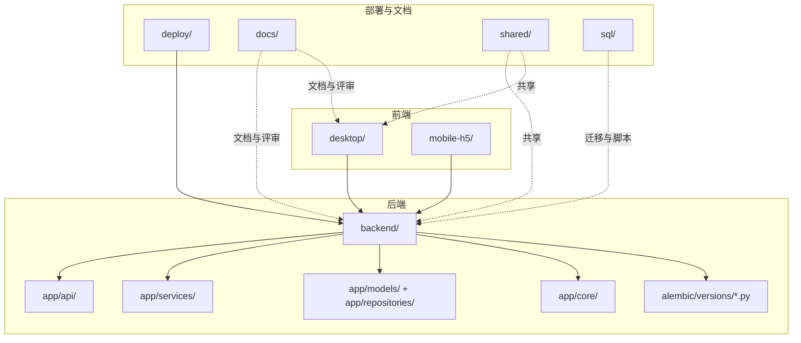
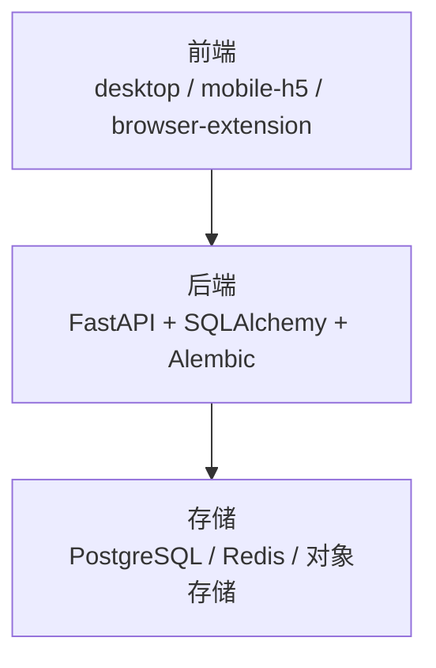
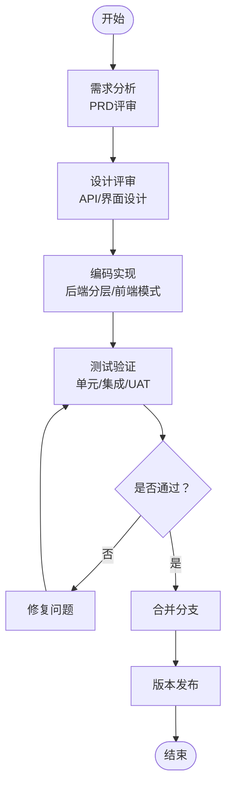
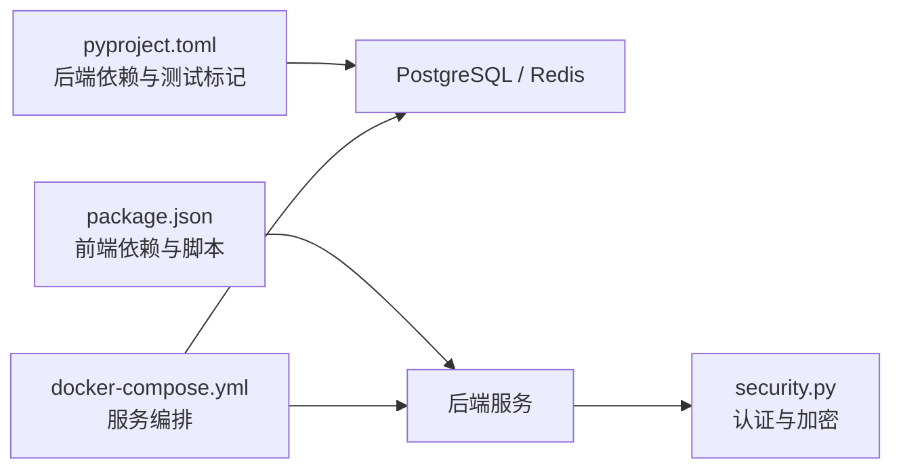

# 开发工作流程

<cite>
**本文引用的文件**
- [README.md](file://README.md)
- [QUICKSTART.md](file://backend/QUICKSTART.md)
- [backend/README.md](file://backend/README.md)
- [backend/pyproject.toml](file://backend/pyproject.toml)
- [backend/docker-compose.yml](file://backend/docker-compose.yml)
- [desktop/README.md](file://desktop/README.md)
- [desktop/package.json](file://desktop/package.json)
- [.github/copilot-instructions.md](file://.github/copilot-instructions.md)
- [docs/architecture/system-architecture.md](file://docs/architecture/system-architecture.md)
- [docs/product/PRD_v1.1.md](file://docs/product/PRD_v1.1.md)
- [docs/operations/UAT执行记录_发布线索客户闭环_2026-03-23.md](file://docs/operations/UAT执行记录_发布线索客户闭环_2026-03-23.md)
- [backend/alembic/versions/20260323_0008_legacy_baseline.py](file://backend/alembic/versions/20260323_0008_legacy_baseline.py)
- [backend/alembic/versions/20260323_01_add_leads_and_customer_lead_id.py](file://backend/alembic/versions/20260323_01_add_leads_and_customer_lead_id.py)
- [backend/alembic/versions/20260323_02_add_user_role.py](file://backend/alembic/versions/20260323_02_add_user_role.py)
- [backend/alembic/versions/20260323_03_add_inbox_assignment_fields.py](file://backend/alembic/versions/20260323_03_add_inbox_assignment_fields.py)
- [backend/alembic/versions/20260323_04_add_user_wecom_userid.py](file://backend/alembic/versions/20260323_04_add_user_wecom_userid.py)
- [backend/alembic/versions/20260324_01_add_structured_content_tables.py](file://backend/alembic/versions/20260324_01_add_structured_content_tables.py)
- [backend/alembic/versions/20260325_01_add_acquisition_inbox_pipeline.py](file://backend/alembic/versions/20260325_01_add_acquisition_inbox_pipeline.py)
- [backend/alembic/versions/20260327_01_refactor_material_inbox_filtering.py](file://backend/alembic/versions/20260327_01_refactor_material_inbox_filtering.py)
- [backend/alembic/versions/20260327_02_add_material_knowledge_pipeline.py](file://backend/alembic/versions/20260327_02_add_material_knowledge_pipeline.py)
- [backend/alembic/versions/20260328_01_extend_generation_task_structured_outputs.py](file://backend/alembic/versions/20260328_01_extend_generation_task_structured_outputs.py)
</cite>

## 目录
1. [引言](#引言)
2. [项目结构](#项目结构)
3. [核心组件](#核心组件)
4. [架构总览](#架构总览)
5. [详细组件分析](#详细组件分析)
6. [依赖分析](#依赖分析)
7. [性能考虑](#性能考虑)
8. [故障排查指南](#故障排查指南)
9. [结论](#结论)
10. [附录](#附录)

## 引言
本文件面向“智获客”项目团队，旨在建立标准化的开发工作流程，覆盖以下方面：
- Git 工作流程：分支策略、提交规范、合并流程
- 功能开发流程：需求分析、设计评审、编码实现、测试验证
- 代码审查流程：Pull Request 模板、审查标准、反馈处理
- 版本管理策略：语义化版本控制、发布标签、变更日志维护
- 文档更新流程：代码注释、API 文档、用户文档的同步更新
- 团队协作规范：沟通渠道、会议制度、进度跟踪
- 新功能开发的全生命周期管理与验收标准

本指南以仓库现有实践为基础，结合后端、桌面端、文档与数据库迁移的实际配置，形成可落地的工作规范。

## 项目结构
项目采用多端多服务的 monorepo 结构，主要子项目与职责如下：
- backend：FastAPI + SQLAlchemy + Alembic + Redis/Postgres 集成的后端服务
- desktop：Electron + React(Vite) 的桌面端渲染
- mobile-h5：静态移动端入口页
- browser-extension：Manifest v3 内容采集扩展（预留）
- deploy：部署制品与编排文档
- docs：产品、架构、部署、运维文档
- shared：共享常量、枚举、协议与类型
- sql：数据库索引、初始化、迁移、种子数据

图表来源
- [README.md: 90-107:90-107](file://README.md#L90-L107)
- [docs/architecture/system-architecture.md: 1-8:1-8](file://docs/architecture/system-architecture.md#L1-L8)

章节来源
- [README.md: 90-107:90-107](file://README.md#L90-L107)
- [docs/architecture/system-architecture.md: 1-8:1-8](file://docs/architecture/system-architecture.md#L1-L8)

## 核心组件
- 后端服务：FastAPI 应用、API 路由、业务服务层、数据访问层、核心配置与安全、任务与工作器
- 数据库与迁移：Alembic 迁移脚本、版本化演进
- 桌面端：Vite + Electron 开发与打包流程
- 文档体系：产品 PRD、架构文档、部署与运维文档
- 测试与回归：pytest 标记与回归套件、UAT 执行记录

章节来源
- [backend/README.md: 90-107:90-107](file://backend/README.md#L90-L107)
- [backend/pyproject.toml: 42-46:42-46](file://backend/pyproject.toml#L42-L46)
- [desktop/package.json: 8-20:8-20](file://desktop/package.json#L8-L20)
- [docs/product/PRD_v1.1.md: 1-9:1-9](file://docs/product/PRD_v1.1.md#L1-L9)

## 架构总览
系统采用分层清晰的多端架构：
- 前端：desktop、mobile-h5、browser-extension
- 后端：api、domains、services、integrations、workers
- 存储：postgres、redis、对象存储

图表来源
- [docs/architecture/system-architecture.md: 1-8:1-8](file://docs/architecture/system-architecture.md#L1-L8)

章节来源
- [docs/architecture/system-architecture.md: 1-8:1-8](file://docs/architecture/system-architecture.md#L1-L8)

## 详细组件分析

### Git 工作流程与分支策略
- 分支命名规范
  - feature/<功能主题>：新功能开发
  - fix/<问题编号或简述>：缺陷修复
  - hotfix/<紧急修复>：线上紧急修复
  - refactor/<重构主题>：架构或代码重构
  - docs/<文档主题>：文档更新
- 提交信息规范
  - 格式：<类型>(<作用域>): <简要描述>
  - 类型：feat、fix、docs、style、refactor、perf、test、chore
  - 例如：feat(api): 新增素材改写端点；fix(auth): 修复权限校验
- 合并流程
  - 通过 Pull Request 合并，要求通过 CI 与代码审查
  - 合并前确保无冲突、无语法错误、无破坏性变更
  - 合并后清理分支，保持仓库整洁

章节来源
- [.github/copilot-instructions.md: 3-11:3-11](file://.github/copilot-instructions.md#L3-L11)

### 功能开发流程
- 需求分析
  - 以 PRD 为依据，明确业务目标与验收条件
  - 评审通过后形成任务卡片，拆解为可执行的子任务
- 设计评审
  - 后端：API 设计、数据模型、服务边界
  - 前端：页面与交互设计、与后端接口契约
- 编码实现
  - 后端：遵循现有分层（api/services/models/schemas），避免过度重构无关文件
  - 前端：遵循现有 React + TypeScript 模式与 API 访问约定
- 测试验证
  - 单元测试与集成测试：pytest 标记与回归套件
  - UAT：自动化 + 人工页面验收相结合

章节来源
- [docs/product/PRD_v1.1.md: 1-9:1-9](file://docs/product/PRD_v1.1.md#L1-L9)
- [.github/copilot-instructions.md: 3-11:3-11](file://.github/copilot-instructions.md#L3-L11)
- [backend/README.md: 186-210:186-210](file://backend/README.md#L186-L210)
- [docs/operations/UAT执行记录_发布线索客户闭环_2026-03-23.md: 1-74:1-74](file://docs/operations/UAT执行记录_发布线索客户闭环_2026-03-23.md#L1-L74)

### 代码审查流程
- Pull Request 模板
  - 标题：类型(作用域): 简要描述
  - 摘要：变更内容、影响范围、风险评估
  - 截图/演示：必要时提供
  - 测试方法：如何验证
- 审查标准
  - 正确性：功能符合需求，边界条件覆盖
  - 可维护性：代码风格一致、注释清晰、模块职责单一
  - 性能与安全：无明显性能瓶颈，无安全漏洞
  - 兼容性：不破坏既有接口与数据一致性
- 反馈处理
  - 明确责任人与截止时间
  - 修订后重新审查，直至通过

章节来源
- [.github/copilot-instructions.md: 3-11:3-11](file://.github/copilot-instructions.md#L3-L11)
- [backend/README.md: 186-210:186-210](file://backend/README.md#L186-L210)

### 版本管理策略
- 语义化版本控制
  - 主版本号：破坏性变更
  - 次版本号：向下兼容的功能新增
  - 修订号：向下兼容的问题修正
- 发布标签
  - 使用 Git 标签标记发布版本，如 v0.1.0
  - 标签名与后端/桌面端版本号保持一致
- 变更日志维护
  - 每次发布更新变更日志，记录新增、修复、改进与破坏性变更
  - 变更日志与发布说明同步维护

章节来源
- [backend/pyproject.toml: 1-6:1-6](file://backend/pyproject.toml#L1-L6)
- [desktop/package.json: 1-8:1-8](file://desktop/package.json#L1-L8)

### 文档更新流程
- 代码注释
  - 保持现有风格，避免对无关文件进行格式化
  - 重要业务逻辑与边界条件需补充注释
- API 文档
  - Swagger UI 自动生成，随代码变更自动更新
  - 端点变更需同步更新文档与示例
- 用户文档
  - 产品 PRD、架构文档、部署与运维文档同步更新
  - UAT 执行记录与验收清单作为验收依据

章节来源
- [.github/copilot-instructions.md: 3-11:3-11](file://.github/copilot-instructions.md#L3-L11)
- [backend/README.md: 81-86:81-86](file://backend/README.md#L81-L86)
- [docs/product/PRD_v1.1.md: 1-9:1-9](file://docs/product/PRD_v1.1.md#L1-L9)
- [docs/operations/UAT执行记录_发布线索客户闭环_2026-03-23.md: 1-74:1-74](file://docs/operations/UAT执行记录_发布线索客户闭环_2026-03-23.md#L1-L74)

### 团队协作规范
- 沟通渠道
  - 日常沟通：即时通讯群组
  - 问题跟踪：Issue/任务卡片
  - 文档共享：共享文档与仓库文档
- 会议制度
  - 每日站会：同步进展与阻塞
  - 双周迭代规划：确定迭代目标与排期
  - 评审会：需求、设计、代码与UAT评审
- 进度跟踪
  - 任务看板：可视化跟踪任务状态
  - 回归测试报告：持续反馈质量

章节来源
- [docs/operations/UAT执行记录_发布线索客户闭环_2026-03-23.md: 1-74:1-74](file://docs/operations/UAT执行记录_发布线索客户闭环_2026-03-23.md#L1-L74)

### 新功能开发的全生命周期管理与验收标准
- 生命周期管理
  - 需求 → 设计 → 开发 → 测试 → UAT → 发布 → 运维
  - 每个阶段设置里程碑与检查点
- 验收标准
  - 自动化测试通过：pytest 标记与回归套件
  - UAT 页面验收：人工验证关键业务闭环
  - 环境与兼容性：不同环境下的稳定性与兼容性

章节来源
- [backend/README.md: 186-210:186-210](file://backend/README.md#L186-L210)
- [docs/operations/UAT执行记录_发布线索客户闭环_2026-03-23.md: 1-74:1-74](file://docs/operations/UAT执行记录_发布线索客户闭环_2026-03-23.md#L1-L74)

## 依赖分析
- 后端依赖与测试标记
  - 依赖管理：Poetry（pyproject.toml）
  - 测试标记：regression、postgres_regression
- 前端依赖与构建
  - 依赖管理：npm（package.json）
  - 构建与打包：Vite + Electron Builder
- 部署与运行时
  - Docker Compose 编排：后端、数据库、缓存、AI 服务
  - 环境变量：DATABASE_URL、REDIS_URL、SECRET_KEY 等

图表来源
- [backend/pyproject.toml: 1-47:1-47](file://backend/pyproject.toml#L1-L47)
- [desktop/package.json: 1-77:1-77](file://desktop/package.json#L1-L77)
- [backend/docker-compose.yml: 1-67:1-67](file://backend/docker-compose.yml#L1-L67)

章节来源
- [backend/pyproject.toml: 1-47:1-47](file://backend/pyproject.toml#L1-L47)
- [desktop/package.json: 1-77:1-77](file://desktop/package.json#L1-L77)
- [backend/docker-compose.yml: 1-67:1-67](file://backend/docker-compose.yml#L1-L67)

## 性能考虑
- 后端性能
  - 使用 Alembic 管理数据库演进，避免在迁移中导入运行时配置
  - Redis 分布式限流在不可用时自动降级
- 前端性能
  - Vite 开发体验与 Electron 打包优化
- 部署性能
  - Docker Compose 统一编排，减少环境差异带来的性能波动

章节来源
- [.github/copilot-instructions.md: 54-58:54-58](file://.github/copilot-instructions.md#L54-L58)
- [backend/README.md: 160-163:160-163](file://backend/README.md#L160-L163)

## 故障排查指南
- 常见问题定位
  - 数据库连接失败：检查 DATABASE_URL 与 PostgreSQL 运行状态
  - CORS 错误：配置 CORS_ORIGINS
  - Token 过期：重新登录获取新 token
- 健康检查
  - 运维健康检查端点：/api/system/ops/health 与 /api/system/ops/readiness
- UAT 环境问题
  - 密码哈希兼容性问题：pbkdf2_sha256 与 bcrypt 兼容路径

章节来源
- [backend/README.md: 223-233:223-233](file://backend/README.md#L223-L233)
- [docs/operations/UAT执行记录_发布线索客户闭环_2026-03-23.md: 54-59:54-59](file://docs/operations/UAT执行记录_发布线索客户闭环_2026-03-23.md#L54-L59)

## 结论
本工作流程以现有仓库实践为基础，明确了从需求到发布的全流程规范，并强调了文档、测试与协作的重要性。建议团队在实际执行中持续回顾与优化，确保流程与项目发展相匹配。

## 附录
- 快速开始与开发指南
  - 后端：Docker 一键启动、本地开发、数据库迁移、API 文档
  - 桌面端：Vite + Electron 开发与打包
- 数据库迁移脚本
  - 以版本化方式演进，覆盖线索、客户、收件箱、素材知识库等关键表与流程

章节来源
- [README.md: 55-86:55-86](file://README.md#L55-L86)
- [desktop/README.md: 1-54:1-54](file://desktop/README.md#L1-L54)
- [backend/docker-compose.yml: 1-67:1-67](file://backend/docker-compose.yml#L1-L67)
- [backend/alembic/versions/20260323_0008_legacy_baseline.py](file://backend/alembic/versions/20260323_0008_legacy_baseline.py)
- [backend/alembic/versions/20260323_01_add_leads_and_customer_lead_id.py](file://backend/alembic/versions/20260323_01_add_leads_and_customer_lead_id.py)
- [backend/alembic/versions/20260323_02_add_user_role.py](file://backend/alembic/versions/20260323_02_add_user_role.py)
- [backend/alembic/versions/20260323_03_add_inbox_assignment_fields.py](file://backend/alembic/versions/20260323_03_add_inbox_assignment_fields.py)
- [backend/alembic/versions/20260323_04_add_user_wecom_userid.py](file://backend/alembic/versions/20260323_04_add_user_wecom_userid.py)
- [backend/alembic/versions/20260324_01_add_structured_content_tables.py](file://backend/alembic/versions/20260324_01_add_structured_content_tables.py)
- [backend/alembic/versions/20260325_01_add_acquisition_inbox_pipeline.py](file://backend/alembic/versions/20260325_01_add_acquisition_inbox_pipeline.py)
- [backend/alembic/versions/20260327_01_refactor_material_inbox_filtering.py](file://backend/alembic/versions/20260327_01_refactor_material_inbox_filtering.py)
- [backend/alembic/versions/20260327_02_add_material_knowledge_pipeline.py](file://backend/alembic/versions/20260327_02_add_material_knowledge_pipeline.py)
- [backend/alembic/versions/20260328_01_extend_generation_task_structured_outputs.py](file://backend/alembic/versions/20260328_01_extend_generation_task_structured_outputs.py)