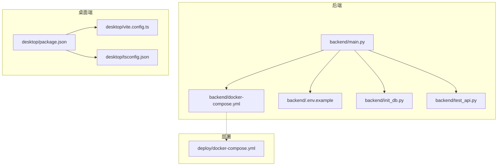
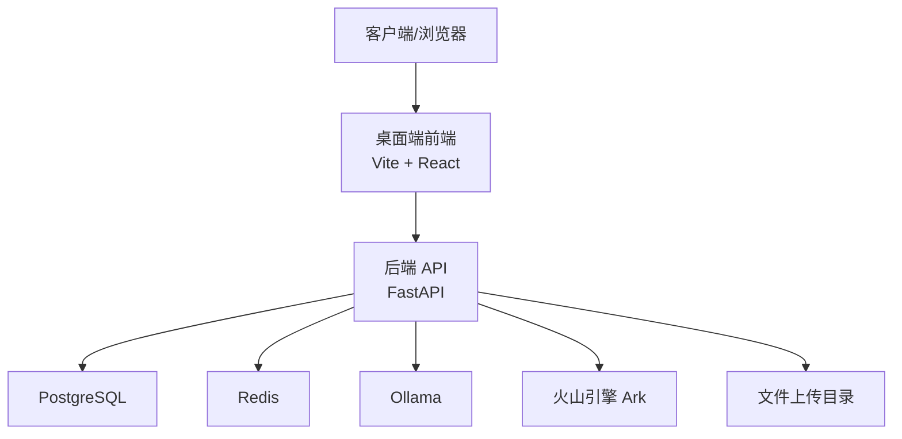
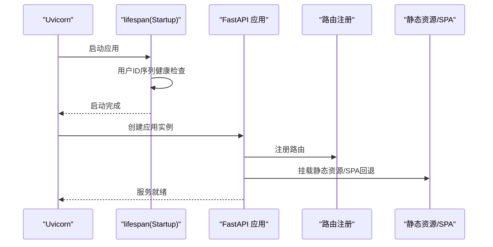
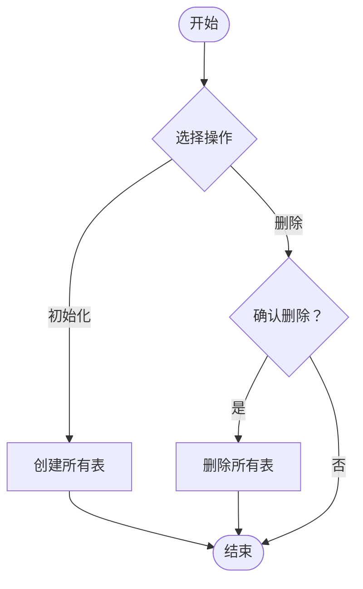
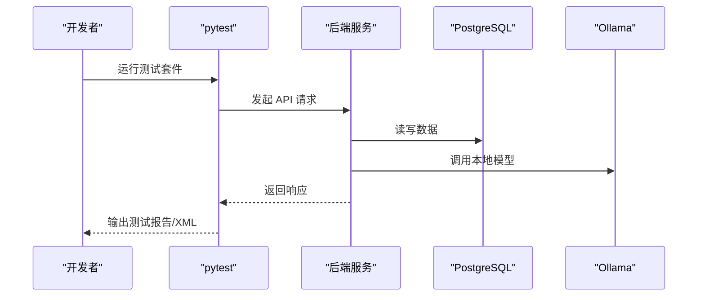
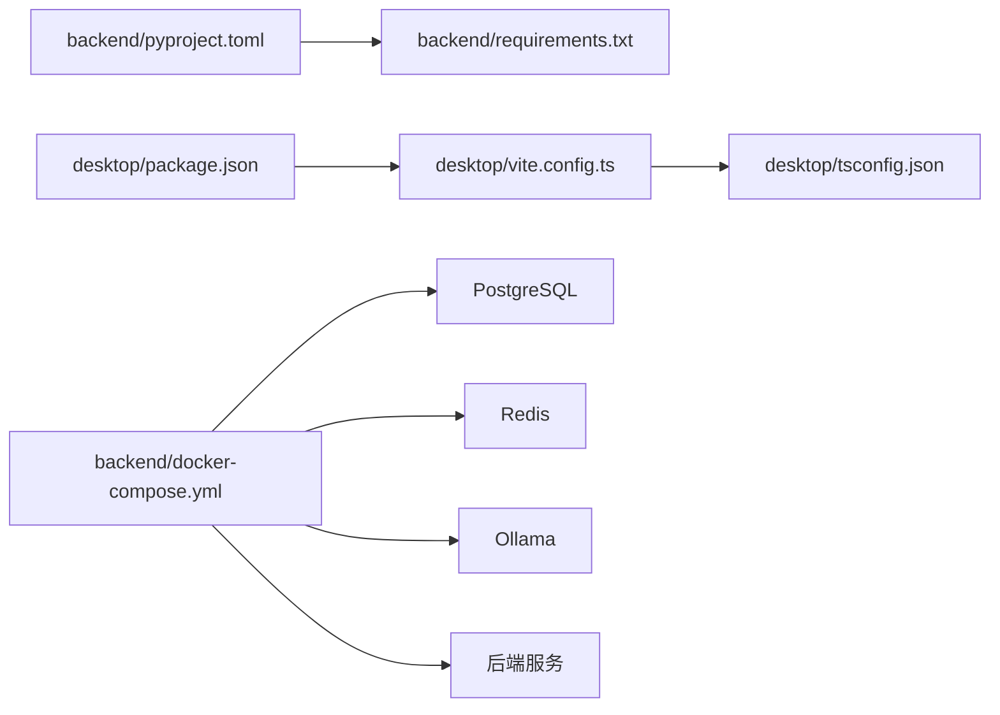

# 开发指南

<cite>
**本文引用的文件**
- [backend/pyproject.toml](file://backend/pyproject.toml)
- [backend/requirements.txt](file://backend/requirements.txt)
- [backend/Dockerfile](file://backend/Dockerfile)
- [backend/docker-compose.yml](file://backend/docker-compose.yml)
- [backend/setup-venv.sh](file://backend/setup-venv.sh)
- [backend/QUICKSTART.md](file://backend/QUICKSTART.md)
- [backend/README.md](file://backend/README.md)
- [backend/.env.example](file://backend/.env.example)
- [backend/init_db.py](file://backend/init_db.py)
- [backend/create_test_user.py](file://backend/create_test_user.py)
- [backend/main.py](file://backend/main.py)
- [backend/test_api.py](file://backend/test_api.py)
- [desktop/package.json](file://desktop/package.json)
- [desktop/vite.config.ts](file://desktop/vite.config.ts)
- [desktop/tsconfig.json](file://desktop/tsconfig.json)
- [.github/copilot-instructions.md](file://.github/copilot-instructions.md)
- [backend/pytest-focus.xml](file://backend/pytest-focus.xml)
- [backend/pytest-uat-errperm.xml](file://backend/pytest-uat-errperm.xml)
- [backend/pytest-uat-evidence.xml](file://backend/pytest-uat-evidence.xml)
</cite>

## 目录
1. [简介](#简介)
2. [项目结构](#项目结构)
3. [核心组件](#核心组件)
4. [架构总览](#架构总览)
5. [详细组件分析](#详细组件分析)
6. [依赖关系分析](#依赖关系分析)
7. [性能考虑](#性能考虑)
8. [故障排查指南](#故障排查指南)
9. [结论](#结论)
10. [附录](#附录)

## 简介
本开发指南面向“智获客”项目的后端、桌面端与移动端/H5子项目，提供从开发环境搭建、代码规范、测试策略、调试与性能分析、Git 工作流与分支管理、到构建与发布的全流程说明。目标是帮助新成员快速上手，并在保持一致性的前提下高效协作。

## 项目结构
项目采用多运行时的单仓（monorepo）组织方式：
- backend：FastAPI + SQLAlchemy + Alembic + Redis/Postgres + Ollama 的后端服务
- desktop：Electron + React(Vite) 的桌面端渲染层
- mobile-h5：静态 H5 页面集合
- deploy：部署编排与说明
- shared：共享常量/枚举/协议/类型等
- docs：架构、部署、运维与产品文档
- scripts：数据库初始化、规则同步、回归测试等辅助脚本

图表来源
- [backend/main.py:1-138](file://backend/main.py#L1-L138)
- [backend/docker-compose.yml:1-67](file://backend/docker-compose.yml#L1-L67)
- [backend/.env.example:1-56](file://backend/.env.example#L1-L56)
- [backend/init_db.py:1-44](file://backend/init_db.py#L1-L44)
- [backend/test_api.py:1-159](file://backend/test_api.py#L1-L159)
- [desktop/package.json:1-77](file://desktop/package.json#L1-L77)
- [desktop/vite.config.ts:1-23](file://desktop/vite.config.ts#L1-L23)
- [desktop/tsconfig.json:1-19](file://desktop/tsconfig.json#L1-L19)

章节来源
- [backend/README.md:90-107](file://backend/README.md#L90-L107)
- [backend/QUICKSTART.md:71-105](file://backend/QUICKSTART.md#L71-L105)

## 核心组件
- 后端应用入口与生命周期：负责应用启动时的健康检查、CORS 配置、路由注册、静态资源挂载与 SPA 回退。
- 数据库初始化与迁移：提供初始化/删除表的脚本，配合 Alembic 进行版本化迁移。
- 环境配置：.env.example 提供数据库、JWT、CORS、AI 模型、Redis、上传限制等关键参数。
- 测试与示例：test_api.py 提供端到端示例；pytest-* XML 文件用于 UAT 结果归档。
- 桌面端构建与开发：Vite + React + Electron，支持本地开发、LAN 预览与打包分发。

章节来源
- [backend/main.py:22-107](file://backend/main.py#L22-L107)
- [backend/init_db.py:16-44](file://backend/init_db.py#L16-L44)
- [backend/.env.example:1-56](file://backend/.env.example#L1-L56)
- [backend/test_api.py:1-159](file://backend/test_api.py#L1-L159)
- [desktop/package.json:8-20](file://desktop/package.json#L8-L20)
- [desktop/vite.config.ts:4-22](file://desktop/vite.config.ts#L4-L22)

## 架构总览
后端以 FastAPI 为核心，通过 SQLAlchemy 连接 PostgreSQL，使用 Alembic 管理迁移；Redis 用于分布式限流；Ollama 提供本地大模型推理；Volcano Engine（Ark）提供云端模型能力；桌面端通过 Vite + React 渲染，Electron 承载桌面宿主；H5 页面提供移动端入口。

图表来源
- [backend/README.md:164-171](file://backend/README.md#L164-L171)
- [backend/docker-compose.yml:40-57](file://backend/docker-compose.yml#L40-L57)
- [backend/.env.example:27-40](file://backend/.env.example#L27-L40)

## 详细组件分析

### 后端应用入口与路由
- 生命周期钩子：启动时进行用户 ID 序列健康检查，确保数据库序列一致性。
- CORS：根据配置动态允许来源与凭证策略。
- 路由注册：集中注册各模块路由。
- 静态资源与 SPA 回退：当桌面端构建产物存在时，挂载静态资源并回退到 index.html；否则返回友好提示。

图表来源
- [backend/main.py:22-107](file://backend/main.py#L22-L107)

章节来源
- [backend/main.py:22-107](file://backend/main.py#L22-L107)

### 数据库初始化与迁移
- 初始化：创建所有表，适用于全新环境或重置。
- 删除：交互式确认删除所有表（危险操作）。
- 迁移：通过 Alembic 升级/回滚版本，支持查看历史与当前版本。

图表来源
- [backend/init_db.py:16-44](file://backend/init_db.py#L16-L44)

章节来源
- [backend/init_db.py:16-44](file://backend/init_db.py#L16-L44)
- [backend/README.md:50-75](file://backend/README.md#L50-L75)

### 环境变量与配置
- 数据库：DATABASE_URL、主机/端口/凭据、是否自动建表。
- 安全：SECRET_KEY、算法、Token 过期时间、CORS 白名单。
- AI 模型：Ollama 基础地址与模型名、是否使用云端模型及火山引擎相关参数。
- Redis：是否启用分布式限流、Redis 连接串与键前缀。
- 文件上传：最大大小与存储目录。
- WeCom：企业微信通知 webhook。
- 运维：健康检查端点提示。

章节来源
- [backend/.env.example:1-56](file://backend/.env.example#L1-L56)

### 桌面端开发与构建
- 开发模式：同时启动 Vite Web 与 Electron，支持 LAN 预览。
- 构建：仅构建 Web 资源，打包为 NSIS 安装器。
- 测试：基于 Vitest + jsdom 的前端测试配置。
- TypeScript：严格模式与 JSX 配置。

章节来源
- [desktop/package.json:8-20](file://desktop/package.json#L8-L20)
- [desktop/package.json:45-75](file://desktop/package.json#L45-L75)
- [desktop/vite.config.ts:4-22](file://desktop/vite.config.ts#L4-L22)
- [desktop/tsconfig.json:1-19](file://desktop/tsconfig.json#L1-L19)

### 测试策略与用例
- 单元测试：pytest 驱动，支持标记回归套件与 PostgreSQL 回归。
- 端到端测试：test_api.py 提供典型流程示例（注册、登录、创建素材、合规检查、列表查询、创建客户、仪表板）。
- UAT 结果：pytest-focus.xml、pytest-uat-errperm.xml、pytest-uat-evidence.xml 用于归档不同维度的 UAT 结果。

图表来源
- [backend/README.md:186-210](file://backend/README.md#L186-L210)
- [backend/test_api.py:129-159](file://backend/test_api.py#L129-L159)
- [backend/pytest-focus.xml:1-1](file://backend/pytest-focus.xml#L1-L1)
- [backend/pytest-uat-errperm.xml:1-1](file://backend/pytest-uat-errperm.xml#L1-L1)
- [backend/pytest-uat-evidence.xml:1-1](file://backend/pytest-uat-evidence.xml#L1-L1)

章节来源
- [backend/README.md:186-210](file://backend/README.md#L186-L210)
- [backend/test_api.py:1-159](file://backend/test_api.py#L1-L159)

### Git 工作流与代码审查
- 仓库结构：多运行时子项目，遵循 monorepo 组织。
- 代码风格：后端保持业务在 services 层、路由处理器薄逻辑；桌面端遵循现有 React/TS 约定；避免对无关文件进行格式化。
- 架构约定：API 路由在 app/api/，业务服务在 app/services/，schemas 在 app/schemas/，models 在 app/models/。
- 命名与路由：优先将静态路由置于动态路由之前，避免路径捕获问题。
- Alembic 环境：优先使用 DATABASE_URL 环境变量，避免在迁移脚本顶层导入运行时配置。
- 部署/调试脚本：优先读取/校验再应用变更，避免假设脚本适用于所有环境。

章节来源
- [.github/copilot-instructions.md:1-59](file://.github/copilot-instructions.md#L1-L59)

## 依赖关系分析
- 后端依赖：FastAPI、SQLAlchemy、Alembic、Pydantic、Redis、Ollama、Volcano Engine 客户端等。
- 桌面端依赖：React、Vite、Electron、测试框架等。
- 构建系统：Poetry（后端）、NPM（桌面端）。
- 运行时：Docker Compose 编排数据库、Redis、Ollama 与后端服务。

图表来源
- [backend/pyproject.toml:1-47](file://backend/pyproject.toml#L1-L47)
- [backend/requirements.txt:1-21](file://backend/requirements.txt#L1-L21)
- [desktop/package.json:21-44](file://desktop/package.json#L21-L44)
- [desktop/vite.config.ts:4-22](file://desktop/vite.config.ts#L4-L22)
- [desktop/tsconfig.json:1-19](file://desktop/tsconfig.json#L1-L19)
- [backend/docker-compose.yml:1-67](file://backend/docker-compose.yml#L1-L67)

章节来源
- [backend/pyproject.toml:1-47](file://backend/pyproject.toml#L1-L47)
- [backend/requirements.txt:1-21](file://backend/requirements.txt#L1-L21)
- [desktop/package.json:1-77](file://desktop/package.json#L1-L77)

## 性能考虑
- 本地模型与网络：Ollama 本地推理可降低延迟，但需关注模型拉取与磁盘 IO；云端模型（Volcano Engine）具备弹性但受网络与配额限制。
- 数据库：合理设计索引、批量写入与事务边界控制；迁移前后对比慢查询与锁等待。
- 缓存与限流：Redis 分布式限流在可用时启用，不可用时自动降级；注意限流窗口与阈值配置。
- 前端构建：Vite 生产构建优化资源体积与加载顺序，减少首屏阻塞。
- 运行时指标：利用健康检查端点与序列指标监控后端状态。

## 故障排查指南
- 数据库连接失败：检查 DATABASE_URL、PostgreSQL 是否健康、容器网络连通性。
- CORS 错误：核对 .env 中 CORS_ORIGINS 配置，生产环境禁止使用通配符。
- Token 过期：重新登录获取新令牌；确认 SECRET_KEY 与算法一致。
- 健康检查：部署后访问 /api/system/ops/health 与 /api/system/ops/readiness 验证数据库、Redis、Ollama 状态。
- 本地开发：Docker Compose 启动后，使用 uvicorn --reload 快速迭代；必要时开启 DEBUG。
- 回归测试：针对 PostgreSQL 的回归测试需满足前置条件与环境变量设置。

章节来源
- [backend/README.md:223-240](file://backend/README.md#L223-L240)
- [backend/QUICKSTART.md:347-357](file://backend/QUICKSTART.md#L347-L357)

## 结论
本指南提供了从环境搭建到测试、调试、部署与发布的完整路径。建议在开发过程中始终遵循 monorepo 的模块化约定与代码风格，结合 Alembic 进行数据库演进，利用 pytest 与 UAT 结果保障质量，并通过 Docker Compose 与部署文档确保一致性与可重复性。

## 附录

### 开发环境配置步骤
- 后端（Docker 一键启动）
  - 进入 backend 目录，执行 docker-compose up -d 启动数据库、Redis、Ollama 与后端服务。
  - 访问 http://localhost:8000/docs 查看 API 文档。
- 后端（本地开发）
  - 安装 Poetry 并执行 poetry install。
  - 启动 PostgreSQL（Docker 或本地），初始化数据库并可选执行 alembic upgrade head。
  - 复制 .env.example 为 .env 并按需调整参数，然后 uvicorn main:app --host 0.0.0.0 --port 8000 --reload。
- 桌面端
  - 在 desktop 目录执行 npm install，使用 npm run dev:web 或 npm run dev 启动开发服务器。
  - 构建安装包使用 npm run dist（Windows NSIS）。
- 移动端/H5
  - 在 mobile-h5 目录使用本地静态服务器进行预览。

章节来源
- [backend/QUICKSTART.md:14-51](file://backend/QUICKSTART.md#L14-L51)
- [backend/README.md:16-48](file://backend/README.md#L16-L48)
- [desktop/package.json:8-19](file://desktop/package.json#L8-L19)

### 代码规范与最佳实践
- 后端 Python
  - 业务逻辑集中在 services 层，路由处理器保持薄逻辑。
  - 数据访问遵循 SQLAlchemy 模型/仓储模式。
- 桌面端 React/TypeScript
  - 遵循现有 API 访问约定，避免引入新的客户端封装。
  - 严格模式与 JSX 配置已内置。
- 路由与迁移
  - FastAPI 路由：静态路由优先于动态路由。
  - Alembic：优先使用 DATABASE_URL 环境变量，避免在迁移脚本顶层导入运行时设置。

章节来源
- [.github/copilot-instructions.md:3-11](file://.github/copilot-instructions.md#L3-L11)
- [.github/copilot-instructions.md:52-56](file://.github/copilot-instructions.md#L52-L56)

### 测试策略与验收标准
- 单元测试：使用 pytest，支持标记回归套件与 PostgreSQL 回归。
- 集成测试：通过 test_api.py 覆盖典型业务流程。
- UAT：使用 pytest-focus.xml、pytest-uat-errperm.xml、pytest-uat-evidence.xml 归档不同维度的验收结果。
- 回归覆盖：用户注册唯一约束与序列漂移自愈、素材主链路（清洗->知识->检索->生成->落库）、发布任务生命周期、线索与客户闭环等。

章节来源
- [backend/README.md:186-210](file://backend/README.md#L186-L210)
- [backend/test_api.py:129-159](file://backend/test_api.py#L129-L159)
- [backend/pytest-focus.xml:1-1](file://backend/pytest-focus.xml#L1-L1)
- [backend/pytest-uat-errperm.xml:1-1](file://backend/pytest-uat-errperm.xml#L1-L1)
- [backend/pytest-uat-evidence.xml:1-1](file://backend/pytest-uat-evidence.xml#L1-L1)

### 调试技巧与性能分析
- 启用 DEBUG 模式并使用 uvicorn --reload 快速迭代。
- 使用 Swagger UI 交互式调试 API。
- 通过健康检查端点验证数据库、Redis、Ollama 状态。
- 对热点接口进行压测与链路追踪，结合日志与指标定位瓶颈。

章节来源
- [backend/QUICKSTART.md:337-345](file://backend/QUICKSTART.md#L337-L345)
- [backend/README.md:209-210](file://backend/README.md#L209-L210)

### Git 工作流、分支管理与代码审查
- 仓库为 monorepo，多运行时并行演进。
- 代码风格与架构约定已在 copilot 指令中明确。
- 部署/调试脚本遵循“先读取/校验再应用”的安全流程。

章节来源
- [.github/copilot-instructions.md:12-18](file://.github/copilot-instructions.md#L12-L18)
- [.github/copilot-instructions.md:56-59](file://.github/copilot-instructions.md#L56-L59)

### 构建系统、打包流程与发布机制
- 后端
  - Docker 镜像基于 Python slim，使用 requirements.txt 安装依赖。
  - Docker Compose 编排数据库、Redis、Ollama 与后端服务。
  - setup-venv.sh 提供非容器环境下的虚拟环境部署与 systemd 集成。
- 桌面端
  - Vite 生产构建，Electron Builder 打包为 NSIS 安装器。
- 发布
  - 生产主路径使用 docker-compose.prod.yml，建议在部署后访问健康检查端点验证状态。

章节来源
- [backend/Dockerfile:1-19](file://backend/Dockerfile#L1-L19)
- [backend/docker-compose.yml:1-67](file://backend/docker-compose.yml#L1-L67)
- [backend/setup-venv.sh:1-129](file://backend/setup-venv.sh#L1-L129)
- [desktop/package.json:45-75](file://desktop/package.json#L45-L75)
- [backend/README.md:212-221](file://backend/README.md#L212-L221)

### 新功能开发完整工作流程与验收标准
- 设计与评审：在 docs/product 与 docs/architecture 中沉淀 PRD 与架构说明。
- 开发
  - 定义 schema → 实现 service → 创建 API 路由 → 注册路由 → 编写单元测试 → 编写集成测试。
- 数据库变更
  - 修改 models 与 schemas → 生成迁移 → 在测试环境中验证迁移 → 合并。
- 测试与验收
  - 运行 pytest 与 PostgreSQL 回归 → 生成 UAT 结果 XML → 汇总验收清单。
- 部署与验证
  - 使用 docker-compose.prod.yml 部署 → 访问健康检查端点 → 观察指标与日志。

章节来源
- [backend/QUICKSTART.md:196-236](file://backend/QUICKSTART.md#L196-L236)
- [backend/README.md:186-210](file://backend/README.md#L186-L210)
- [docs/product/PRD_v1.1.md](file://docs/product/PRD_v1.1.md)
- [docs/architecture/system-architecture.md](file://docs/architecture/system-architecture.md)