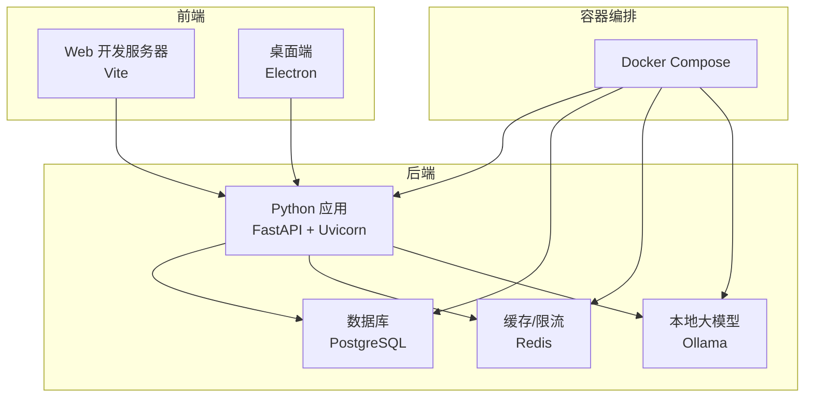
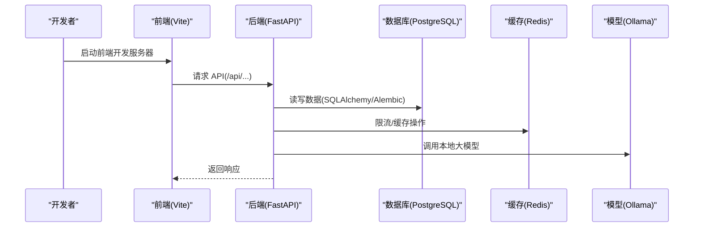
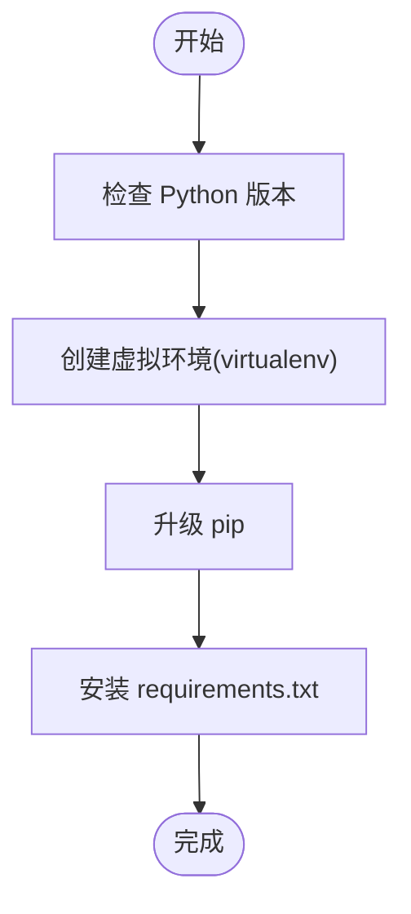
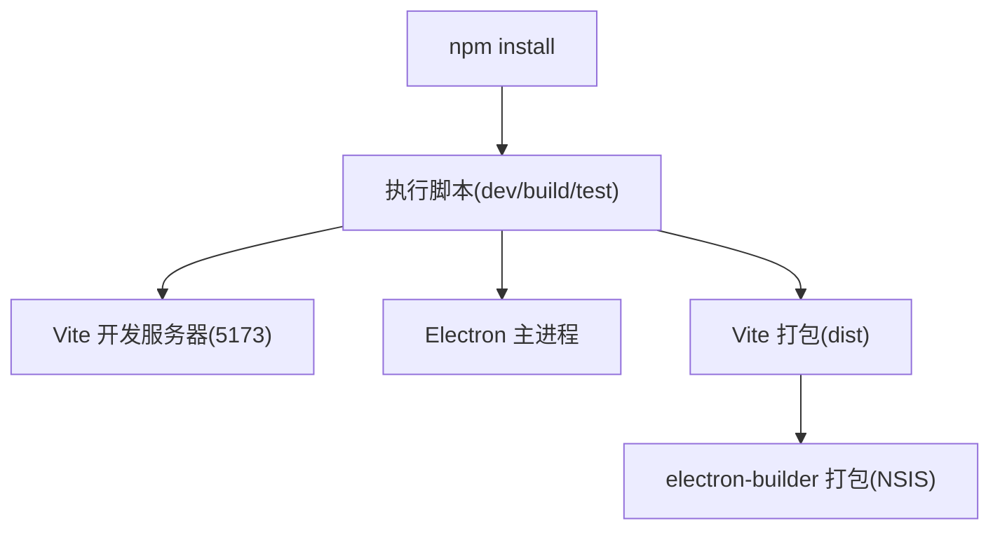
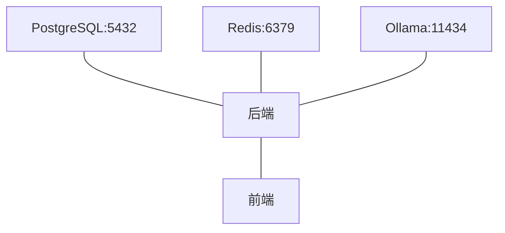
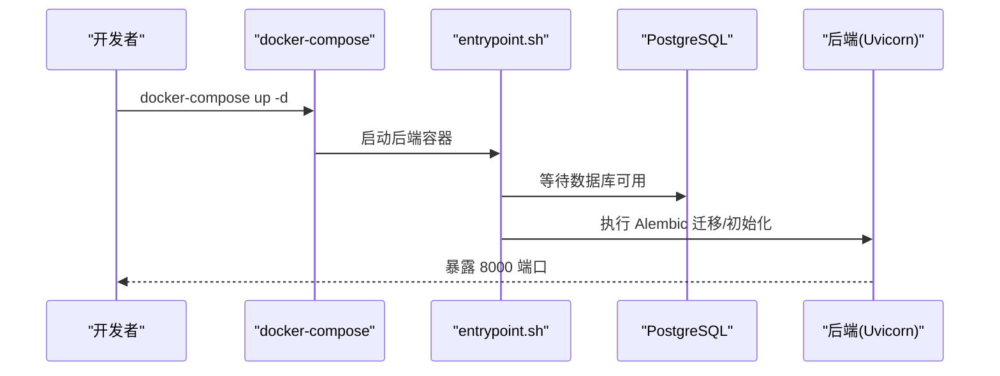
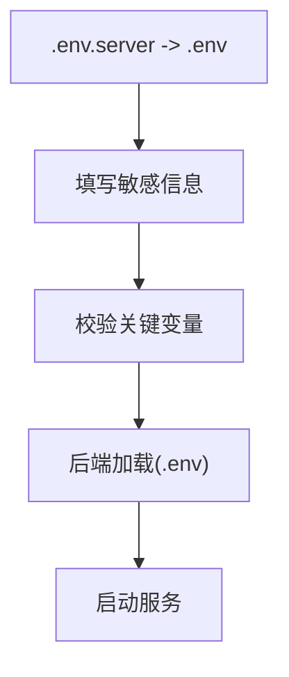
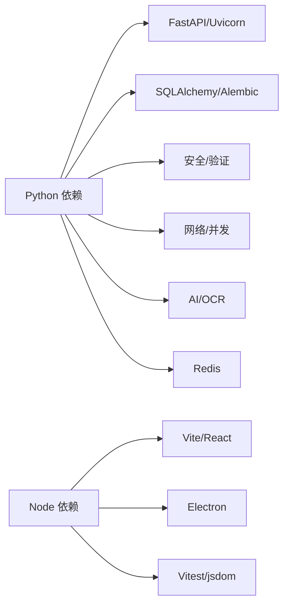

# 开发环境配置

<cite>
**本文引用的文件**
- [backend/pyproject.toml](file://backend/pyproject.toml)
- [backend/requirements.txt](file://backend/requirements.txt)
- [desktop/package.json](file://desktop/package.json)
- [desktop/vite.config.ts](file://desktop/vite.config.ts)
- [desktop/tsconfig.json](file://desktop/tsconfig.json)
- [backend/Dockerfile](file://backend/Dockerfile)
- [backend/docker-compose.yml](file://backend/docker-compose.yml)
- [backend/setup-venv.sh](file://backend/setup-venv.sh)
- [backend/.env.server](file://backend/.env.server)
- [backend/entrypoint.sh](file://backend/entrypoint.sh)
- [backend/init_db.py](file://backend/init_db.py)
- [backend/create_test_user.py](file://backend/create_test_user.py)
- [backend/main.py](file://backend/main.py)
- [backend/QUICKSTART.md](file://backend/QUICKSTART.md)
- [docs/deploy/env-example.md](file://docs/deploy/env-example.md)
- [scripts/init_db.sh](file://scripts/init_db.sh)
</cite>

## 目录
1. [简介](#简介)
2. [项目结构](#项目结构)
3. [核心组件](#核心组件)
4. [架构总览](#架构总览)
5. [详细组件分析](#详细组件分析)
6. [依赖关系分析](#依赖关系分析)
7. [性能考虑](#性能考虑)
8. [故障排查指南](#故障排查指南)
9. [结论](#结论)
10. [附录](#附录)

## 简介
本指南面向“智获客”项目的开发者，提供从零搭建开发环境的完整流程，覆盖：
- Python 3.10+ 虚拟环境创建与依赖安装
- Node.js 与前端依赖管理
- 数据库与缓存（PostgreSQL、Redis）本地部署
- Docker 容器化与服务编排
- 环境变量与敏感信息管理
- 开发工具、IDE 与调试环境建议
- 常见问题排查与解决方案

## 项目结构
项目采用前后端分离与多语言技术栈：
- 后端：Python FastAPI 应用，使用 SQLAlchemy、Alembic、Pydantic、Redis、Ollama 等
- 前端：Electron + React/Vite，提供桌面端与 Web 预览
- 部署：Docker Compose 编排 PostgreSQL、Redis、Ollama 与后端服务
- 文档与脚本：Quickstart、环境变量示例、数据库初始化脚本等

图表来源
- [backend/docker-compose.yml:1-67](file://backend/docker-compose.yml#L1-L67)
- [backend/Dockerfile:1-19](file://backend/Dockerfile#L1-L19)
- [desktop/vite.config.ts:1-23](file://desktop/vite.config.ts#L1-L23)
- [backend/main.py:1-138](file://backend/main.py#L1-L138)

章节来源
- [backend/QUICKSTART.md:1-382](file://backend/QUICKSTART.md#L1-L382)

## 核心组件
- Python 版本与依赖
  - Python 3.10+，使用 Poetry 或 pip 安装依赖
  - 关键依赖：FastAPI、SQLAlchemy、Alembic、PostgreSQL 驱动、Redis、Pydantic、dotenv、Ollama、OCR 等
- Node.js 与前端
  - Vite + React + TypeScript；支持本地开发、LAN 预览、打包与 Electron 打包
- 数据库与缓存
  - PostgreSQL 15；Redis 7；Alembic 迁移；Ollama 提供本地大模型推理
- 容器化
  - Dockerfile、docker-compose.yml 统一编排后端、数据库、缓存与模型服务
- 环境变量
  - .env.server 为服务器示例配置，需复制为 .env 并按需修改

章节来源
- [backend/pyproject.toml:1-47](file://backend/pyproject.toml#L1-L47)
- [backend/requirements.txt:1-21](file://backend/requirements.txt#L1-L21)
- [desktop/package.json:1-77](file://desktop/package.json#L1-L77)
- [backend/docker-compose.yml:1-67](file://backend/docker-compose.yml#L1-L67)
- [backend/.env.server:1-54](file://backend/.env.server#L1-L54)

## 架构总览
下图展示开发环境中的服务交互与数据流向。

图表来源
- [backend/main.py:1-138](file://backend/main.py#L1-L138)
- [backend/docker-compose.yml:1-67](file://backend/docker-compose.yml#L1-L67)

## 详细组件分析

### Python 虚拟环境与依赖安装
- 版本要求
  - Python 3.10+（Poetry 与 requirements 均声明）
- 两种安装方式
  - Poetry（推荐）：安装依赖与开发工具（格式化、类型检查等）
  - pip：直接安装 requirements.txt
- 升级 pip 与安装依赖
  - 在虚拟环境中优先升级 pip，再安装 requirements
- 依赖清单要点
  - Web 框架与异步：FastAPI、Uvicorn
  - ORM 与迁移：SQLAlchemy、Alembic、psycopg2-binary
  - 验证与安全：Pydantic、Pydantic Settings、python-jose、passlib、bcrypt
  - 网络与并发：aiohttp、httpx、requests
  - AI/OCR：ollama、Pillow、pytesseract
  - 缓存与限流：redis
  - 开发工具：pytest、pytest-asyncio、black、isort、flake8、mypy、python-dotenv

图表来源
- [backend/requirements.txt:1-21](file://backend/requirements.txt#L1-L21)
- [backend/pyproject.toml:1-47](file://backend/pyproject.toml#L1-L47)

章节来源
- [backend/pyproject.toml:1-47](file://backend/pyproject.toml#L1-L47)
- [backend/requirements.txt:1-21](file://backend/requirements.txt#L1-L21)
- [backend/QUICKSTART.md:26-51](file://backend/QUICKSTART.md#L26-L51)

### Node.js 与前端开发环境
- 包管理与脚本
  - 使用 npm；常用脚本：dev:web、dev:electron、dev、build、test、preview、dist
- 开发服务器
  - Vite 默认监听 0.0.0.0:5173；LAN 预览 0.0.0.0:4173
- 类型与测试
  - TypeScript、React、Vitest + jsdom；测试入口与环境配置
- Electron 打包
  - 产物目录 dist；打包时将后端二进制资源注入；Windows 安装包（NSIS）

图表来源
- [desktop/package.json:1-77](file://desktop/package.json#L1-L77)
- [desktop/vite.config.ts:1-23](file://desktop/vite.config.ts#L1-L23)
- [desktop/tsconfig.json:1-19](file://desktop/tsconfig.json#L1-L19)

章节来源
- [desktop/package.json:1-77](file://desktop/package.json#L1-L77)
- [desktop/vite.config.ts:1-23](file://desktop/vite.config.ts#L1-L23)
- [desktop/tsconfig.json:1-19](file://desktop/tsconfig.json#L1-L19)

### 数据库与缓存环境设置（PostgreSQL 与 Redis）
- PostgreSQL
  - 镜像：postgres:15；端口 5432；卷持久化；健康检查
  - 初始化：可通过 Alembic 迁移或 init_db.py 创建表
- Redis
  - 镜像：redis:7-alpine；持久化 appendonly；端口 6379
- Ollama（本地大模型）
  - 镜像：ollama/ollama；端口 11434；卷持久化；容器内拉取模型

图表来源
- [backend/docker-compose.yml:1-67](file://backend/docker-compose.yml#L1-L67)

章节来源
- [backend/docker-compose.yml:1-67](file://backend/docker-compose.yml#L1-L67)
- [backend/init_db.py:1-44](file://backend/init_db.py#L1-L44)

### Docker 容器化与服务编排
- 镜像与入口
  - 基于 python:3.10-slim；使用 requirements.txt 安装依赖；设置 PYTHONUNBUFFERED；ENTRYPOINT 指向 entrypoint.sh
- 编排服务
  - postgres、redis、ollama、backend；backend 依赖数据库健康；暴露端口 8000（后端）、5432（数据库）、6379（Redis）、11434（Ollama）
- 网络
  - 自定义网络 zhihuokeke-network，便于服务间以服务名通信

图表来源
- [backend/Dockerfile:1-19](file://backend/Dockerfile#L1-L19)
- [backend/entrypoint.sh:1-48](file://backend/entrypoint.sh#L1-L48)
- [backend/docker-compose.yml:1-67](file://backend/docker-compose.yml#L1-L67)

章节来源
- [backend/Dockerfile:1-19](file://backend/Dockerfile#L1-L19)
- [backend/entrypoint.sh:1-48](file://backend/entrypoint.sh#L1-L48)
- [backend/docker-compose.yml:1-67](file://backend/docker-compose.yml#L1-L67)

### 环境变量与敏感信息管理
- .env.server 为服务器示例配置，需复制为 .env 并替换敏感值
- 关键变量
  - 数据库：DATABASE_URL、DATABASE_HOST、DATABASE_PORT、DATABASE_USER、DATABASE_PASSWORD、DATABASE_NAME
  - 安全：SECRET_KEY、ALGORITHM、ACCESS_TOKEN_EXPIRE_MINUTES
  - CORS：CORS_ORIGINS（生产禁止使用通配符）
  - AI/模型：OLLAMA_BASE_URL、OLLAMA_MODEL、USE_CLOUD_MODEL、ARK_*（火山引擎）
  - 缓存：USE_REDIS_RATE_LIMIT、REDIS_URL、RATE_LIMIT_KEY_PREFIX
  - 文件上传：MAX_UPLOAD_SIZE、UPLOAD_DIR
  - 企业微信：WECOM_WEBHOOK_URL
- 环境变量示例文档
  - 参考 docs/deploy/env-example.md 补充 SECRET_KEY、DATABASE_URL、REDIS_URL、ARK_API_KEY

图表来源
- [backend/.env.server:1-54](file://backend/.env.server#L1-L54)
- [docs/deploy/env-example.md:1-8](file://docs/deploy/env-example.md#L1-L8)

章节来源
- [backend/.env.server:1-54](file://backend/.env.server#L1-L54)
- [docs/deploy/env-example.md:1-8](file://docs/deploy/env-example.md#L1-L8)

### 开发工具、IDE 与调试环境
- Python
  - 推荐 IDE：VS Code（配合 Python/Black/isort/flake8/mypy 扩展）
  - 调试：Uvicorn 本地热重载；DEBUG=True 时启用 reload
- 前端
  - VS Code（TypeScript/React/Vitest 扩展）
  - Vite 开发服务器与 LAN 预览；Electron 与 Web 并行开发
- 数据库
  - psql 连接本地数据库；查看表与数据
- 常用命令
  - Alembic 迁移：current、upgrade head、downgrade -1、history
  - 初始化数据库：init_db.py（支持 drop/init 子命令）
  - 创建测试用户：create_test_user.py（支持 TEST_USER_* 环境变量）

章节来源
- [backend/QUICKSTART.md:53-69](file://backend/QUICKSTART.md#L53-L69)
- [backend/init_db.py:1-44](file://backend/init_db.py#L1-L44)
- [backend/create_test_user.py:1-54](file://backend/create_test_user.py#L1-L54)
- [backend/main.py:1-138](file://backend/main.py#L1-L138)

## 依赖关系分析
- 后端依赖
  - Web 框架与 ASGI：FastAPI、Uvicorn
  - ORM 与迁移：SQLAlchemy、Alembic、psycopg2-binary
  - 验证与安全：Pydantic、Pydantic Settings、python-jose、passlib、bcrypt
  - 网络与并发：aiohttp、httpx、requests
  - AI/OCR：ollama、Pillow、pytesseract
  - 缓存：redis
  - 开发工具：pytest、pytest-asyncio、black、isort、flake8、mypy、python-dotenv
- 前端依赖
  - React、Vite、TypeScript、Electron、electron-builder、Vitest、jsdom 等

图表来源
- [backend/pyproject.toml:1-47](file://backend/pyproject.toml#L1-L47)
- [desktop/package.json:1-77](file://desktop/package.json#L1-L77)

章节来源
- [backend/pyproject.toml:1-47](file://backend/pyproject.toml#L1-L47)
- [desktop/package.json:1-77](file://desktop/package.json#L1-L77)

## 性能考虑
- 数据库连接池与并发
  - 使用 SQLAlchemy 异步客户端与连接池参数优化（在实际项目中按需配置）
- 缓存策略
  - Redis 用于限流与热点数据缓存；合理设置键空间与过期策略
- 大模型推理
  - Ollama 本地推理，注意显存与并发限制；必要时调整模型大小或切换云端
- 前端构建
  - 生产构建开启压缩与代码分割；Vite 预览端口与严格端口绑定减少冲突

## 故障排查指南
- 数据库连接失败
  - 检查 DATABASE_URL、PostgreSQL 是否运行、端口映射与健康检查
- CORS 错误
  - 在 .env 中正确配置 CORS_ORIGINS，避免使用通配符
- Alembic 迁移失败
  - 回退到 init_db.py 创建表；或修复迁移脚本后再次 upgrade head
- Ollama 模型不可用
  - 确认容器已启动且端口 11434 可达；在容器内执行模型拉取命令
- 端口占用
  - 修改 Vite/后端/数据库/Redis/Ollama 的映射端口，确保无冲突
- 环境变量缺失
  - 复制 .env.server 为 .env，补齐 SECRET_KEY、DATABASE_URL、REDIS_URL、ARK_* 等

章节来源
- [backend/QUICKSTART.md:347-357](file://backend/QUICKSTART.md#L347-L357)
- [backend/entrypoint.sh:1-48](file://backend/entrypoint.sh#L1-L48)
- [backend/docker-compose.yml:1-67](file://backend/docker-compose.yml#L1-L67)
- [backend/.env.server:1-54](file://backend/.env.server#L1-L54)

## 结论
通过本指南，您可以在本地快速搭建“智获客”开发环境：使用 Docker 一键启动数据库、缓存与模型服务，结合 Python 与 Node.js 开发工具链，完成前后端联调与调试。建议在开发过程中遵循环境变量管理规范、定期进行数据库迁移与缓存策略优化，并在生产前完善 CORS、密钥与模型配置。

## 附录

### A. 快速启动（Docker 一键）
- 进入 backend 目录，执行编排启动
- 访问：API、Swagger 文档、数据库、Ollama

章节来源
- [backend/QUICKSTART.md:14-25](file://backend/QUICKSTART.md#L14-L25)
- [backend/docker-compose.yml:1-67](file://backend/docker-compose.yml#L1-L67)

### B. 本地开发（非 Docker）
- 安装 Poetry 并安装依赖
- 启动 PostgreSQL（Docker），初始化数据库与迁移
- 创建测试用户
- 启动后端服务（支持热重载）

章节来源
- [backend/QUICKSTART.md:26-51](file://backend/QUICKSTART.md#L26-L51)

### C. 数据库初始化与迁移
- 初始化：init_db.py（支持 drop/init 子命令）
- 迁移：Alembic 常用命令（current、upgrade head、downgrade -1、history）

章节来源
- [backend/init_db.py:1-44](file://backend/init_db.py#L1-L44)
- [backend/QUICKSTART.md:53-69](file://backend/QUICKSTART.md#L53-L69)

### D. 前端开发与打包
- 开发：npm run dev（Web 与 Electron 并行）
- 预览：npm run preview（LAN）
- 打包：npm run build（Web）；npm run dist（Electron 安装包）

章节来源
- [desktop/package.json:1-77](file://desktop/package.json#L1-L77)
- [desktop/vite.config.ts:1-23](file://desktop/vite.config.ts#L1-L23)

### E. 环境变量清单与示例
- 参考 .env.server 与 docs/deploy/env-example.md，补齐关键变量

章节来源
- [backend/.env.server:1-54](file://backend/.env.server#L1-L54)
- [docs/deploy/env-example.md:1-8](file://docs/deploy/env-example.md#L1-L8)