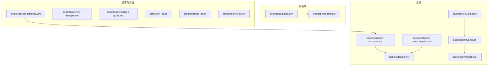
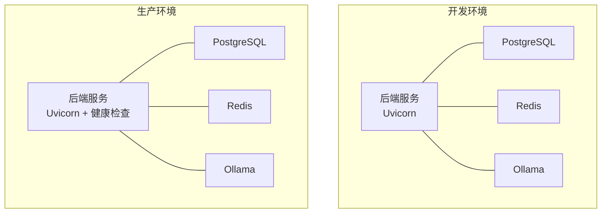
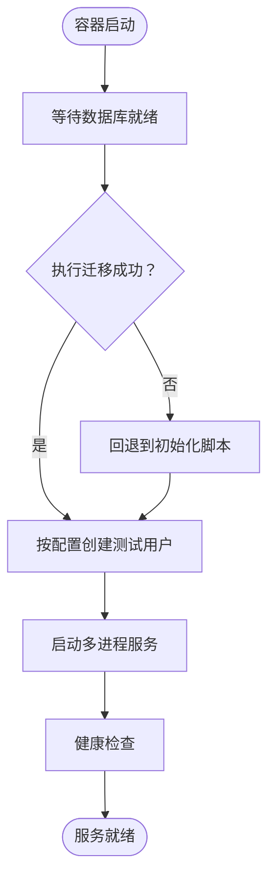
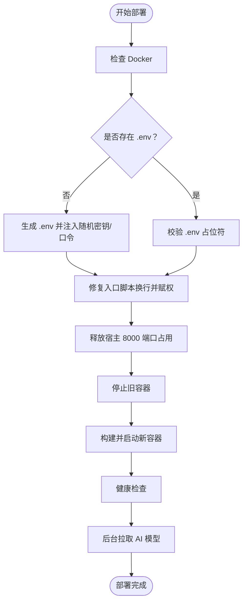
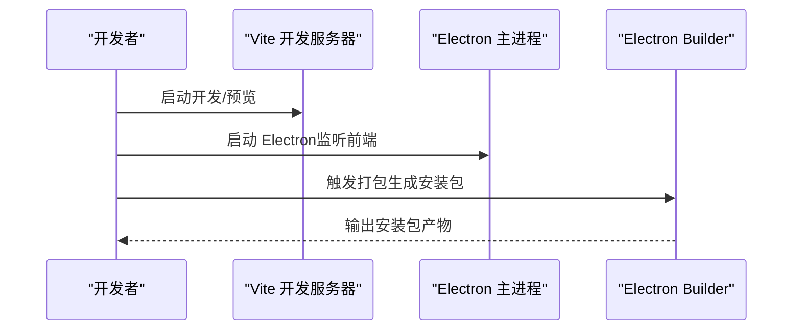
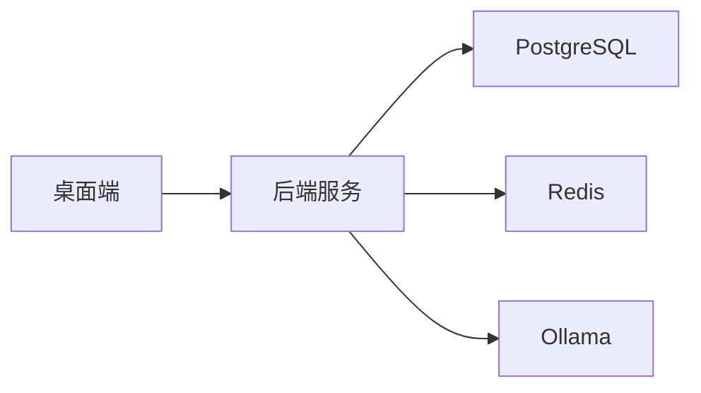

# 构建与部署

<cite>
**本文引用的文件**
- [backend/Dockerfile](file://backend/Dockerfile)
- [backend/pyproject.toml](file://backend/pyproject.toml)
- [backend/docker-compose.yml](file://backend/docker-compose.yml)
- [backend/docker-compose.prod.yml](file://backend/docker-compose.prod.yml)
- [backend/entrypoint.sh](file://backend/entrypoint.sh)
- [backend/deploy.sh](file://backend/deploy.sh)
- [backend/.env.example](file://backend/.env.example)
- [desktop/package.json](file://desktop/package.json)
- [desktop/vite.config.ts](file://desktop/vite.config.ts)
- [deploy/docker-compose.yml](file://deploy/docker-compose.yml)
- [docs/deploy/env-example.md](file://docs/deploy/env-example.md)
- [docs/deploy/rollback-guide.md](file://docs/deploy/rollback-guide.md)
- [scripts/init_db.sh](file://scripts/init_db.sh)
- [scripts/backup_db.sh](file://scripts/backup_db.sh)
- [scripts/restore_db.sh](file://scripts/restore_db.sh)
</cite>

## 目录
1. [引言](#引言)
2. [项目结构](#项目结构)
3. [核心组件](#核心组件)
4. [架构总览](#架构总览)
5. [详细组件分析](#详细组件分析)
6. [依赖关系分析](#依赖关系分析)
7. [性能考量](#性能考量)
8. [故障排查指南](#故障排查指南)
9. [结论](#结论)
10. [附录](#附录)

## 引言
本文件面向智获客项目的构建与部署，覆盖后端服务（FastAPI + PostgreSQL + Redis + Ollama）、桌面端（Electron + React + Vite）以及部署流水线与多环境策略。内容基于仓库现有脚本与配置文件进行系统化梳理，帮助研发与运维团队快速理解并执行本地开发、容器化部署与生产回滚。

## 项目结构
- 后端服务位于 backend 目录，采用 Python 3.10、Poetry 管理依赖、FastAPI 提供 API、Uvicorn 运行服务；通过 Dockerfile 和 docker-compose 编排数据库、缓存与本地 AI 模型服务。
- 桌面端位于 desktop 目录，使用 Vite + React 开发，Electron 打包为 Windows 安装包；提供开发与构建脚本。
- 部署相关文档与脚本位于 deploy、docs、scripts 目录，涵盖环境变量示例、回滚指南与数据库初始化/备份/恢复脚本。

图表来源
- [backend/Dockerfile:1-19](file://backend/Dockerfile#L1-L19)
- [backend/docker-compose.yml:1-67](file://backend/docker-compose.yml#L1-L67)
- [backend/docker-compose.prod.yml:1-112](file://backend/docker-compose.prod.yml#L1-L112)
- [backend/entrypoint.sh:1-48](file://backend/entrypoint.sh#L1-L48)
- [backend/pyproject.toml:1-47](file://backend/pyproject.toml#L1-L47)
- [backend/.env.example:1-56](file://backend/.env.example#L1-L56)
- [desktop/package.json:1-77](file://desktop/package.json#L1-L77)
- [desktop/vite.config.ts:1-23](file://desktop/vite.config.ts#L1-L23)
- [deploy/docker-compose.yml:1-7](file://deploy/docker-compose.yml#L1-L7)
- [docs/deploy/env-example.md:1-8](file://docs/deploy/env-example.md#L1-L8)
- [docs/deploy/rollback-guide.md:1-49](file://docs/deploy/rollback-guide.md#L1-L49)
- [scripts/init_db.sh:1-5](file://scripts/init_db.sh#L1-L5)
- [scripts/backup_db.sh:1-4](file://scripts/backup_db.sh#L1-L4)
- [scripts/restore_db.sh:1-4](file://scripts/restore_db.sh#L1-L4)

章节来源
- [backend/Dockerfile:1-19](file://backend/Dockerfile#L1-L19)
- [backend/docker-compose.yml:1-67](file://backend/docker-compose.yml#L1-L67)
- [backend/docker-compose.prod.yml:1-112](file://backend/docker-compose.prod.yml#L1-L112)
- [backend/entrypoint.sh:1-48](file://backend/entrypoint.sh#L1-L48)
- [backend/pyproject.toml:1-47](file://backend/pyproject.toml#L1-L47)
- [backend/.env.example:1-56](file://backend/.env.example#L1-L56)
- [desktop/package.json:1-77](file://desktop/package.json#L1-L77)
- [desktop/vite.config.ts:1-23](file://desktop/vite.config.ts#L1-L23)
- [deploy/docker-compose.yml:1-7](file://deploy/docker-compose.yml#L1-L7)
- [docs/deploy/env-example.md:1-8](file://docs/deploy/env-example.md#L1-L8)
- [docs/deploy/rollback-guide.md:1-49](file://docs/deploy/rollback-guide.md#L1-L49)
- [scripts/init_db.sh:1-5](file://scripts/init_db.sh#L1-L5)
- [scripts/backup_db.sh:1-4](file://scripts/backup_db.sh#L1-L4)
- [scripts/restore_db.sh:1-4](file://scripts/restore_db.sh#L1-L4)

## 核心组件
- 后端镜像与运行
  - 基于 Python 3.10 slim 镜像，安装依赖并通过入口脚本完成数据库等待、迁移或初始化、可选测试用户创建，最后以多进程方式启动服务。
- 开发与生产编排
  - 开发环境通过 docker-compose.yml 启动 Postgres、Redis、Ollama 与后端服务；生产环境通过 docker-compose.prod.yml 设置健康检查、日志轮转、重启策略与持久卷。
- 桌面端构建
  - 使用 Vite + React 开发，Electron 打包 Windows 安装包；提供开发、预览与构建脚本。
- 部署脚本
  - 服务器端部署脚本负责环境变量初始化、端口清理、容器编排与健康检查，支持后台拉取 AI 模型。
- 环境变量与回滚
  - 提供 .env 示例与回滚指南，强调生产环境安全与可逆性原则。

章节来源
- [backend/Dockerfile:1-19](file://backend/Dockerfile#L1-L19)
- [backend/entrypoint.sh:1-48](file://backend/entrypoint.sh#L1-L48)
- [backend/docker-compose.yml:1-67](file://backend/docker-compose.yml#L1-L67)
- [backend/docker-compose.prod.yml:1-112](file://backend/docker-compose.prod.yml#L1-L112)
- [desktop/package.json:1-77](file://desktop/package.json#L1-L77)
- [desktop/vite.config.ts:1-23](file://desktop/vite.config.ts#L1-L23)
- [backend/deploy.sh:1-132](file://backend/deploy.sh#L1-L132)
- [backend/.env.example:1-56](file://backend/.env.example#L1-L56)
- [docs/deploy/rollback-guide.md:1-49](file://docs/deploy/rollback-guide.md#L1-L49)

## 架构总览
下图展示后端服务在开发与生产环境中的容器化部署视图，以及与数据库、缓存与本地 AI 的交互关系。

图表来源
- [backend/docker-compose.yml:1-67](file://backend/docker-compose.yml#L1-L67)
- [backend/docker-compose.prod.yml:1-112](file://backend/docker-compose.prod.yml#L1-L112)

## 详细组件分析

### 后端服务构建与启动流程
- 镜像构建
  - 基于 Python 3.10 slim，复制依赖清单并使用国内镜像源加速安装，随后复制应用代码，修正入口脚本换行并设置可执行权限，最终以入口脚本作为容器入口。
- 启动流程
  - 入口脚本顺序执行：等待数据库就绪、执行数据库迁移或回退到初始化脚本、按配置决定是否创建测试用户、最后以多进程模式启动服务。
- 开发与生产差异
  - 开发环境开启热重载与挂载源码；生产环境启用健康检查、日志轮转、重启策略与持久卷，并挂载上传目录与桌面端产物目录。

图表来源
- [backend/entrypoint.sh:1-48](file://backend/entrypoint.sh#L1-L48)
- [backend/Dockerfile:1-19](file://backend/Dockerfile#L1-L19)

章节来源
- [backend/Dockerfile:1-19](file://backend/Dockerfile#L1-L19)
- [backend/entrypoint.sh:1-48](file://backend/entrypoint.sh#L1-L48)
- [backend/docker-compose.yml:1-67](file://backend/docker-compose.yml#L1-L67)
- [backend/docker-compose.prod.yml:1-112](file://backend/docker-compose.prod.yml#L1-L112)

### 服务器端部署脚本
- 脚本职责
  - 检查 Docker、生成/校验 .env、修复入口脚本换行、释放宿主 8000 端口、停止旧容器、构建并启动新镜像、健康检查、后台拉取 AI 模型、输出操作指引。
- 关键步骤
  - 首次部署自动生成密钥与数据库口令并写入 .env；健康检查失败时输出最近日志便于排障；提供常用运维命令。

图表来源
- [backend/deploy.sh:1-132](file://backend/deploy.sh#L1-L132)

章节来源
- [backend/deploy.sh:1-132](file://backend/deploy.sh#L1-L132)

### 桌面端构建与打包
- 开发与构建
  - 提供 Web 开发、LAN 预览、Electron 开发与打包脚本；Vite 配置允许局域网访问与测试环境。
- 打包配置
  - Electron Builder 配置 Windows 安装包目标、图标、快捷方式与额外资源（后端可执行文件）。

图表来源
- [desktop/package.json:1-77](file://desktop/package.json#L1-L77)
- [desktop/vite.config.ts:1-23](file://desktop/vite.config.ts#L1-L23)

章节来源
- [desktop/package.json:1-77](file://desktop/package.json#L1-L77)
- [desktop/vite.config.ts:1-23](file://desktop/vite.config.ts#L1-L23)

### CI/CD 流水线与自动化
- 当前状态
  - 仓库包含 .github/workflows 目录但未发现具体工作流文件；因此本节提供通用建议与最佳实践，不绑定具体文件。
- 建议流程
  - 触发条件：推送分支、PR 合并、标签创建。
  - 步骤：安装依赖、静态检查（lint/mypy）、单元测试、集成测试、Docker 镜像构建与推送、制品扫描（SAST/Secrets）、部署到测试环境、人工审批后部署到生产。
- 与现有脚本的衔接
  - 可在流水线中复用部署脚本与编排文件，确保环境变量与密钥通过受控渠道注入。

[本节为概念性指导，不直接分析具体文件，故无“章节来源”]

### 多环境部署策略
- 开发环境
  - 使用 docker-compose.yml 启动，开启热重载与源码挂载，便于联调。
- 测试环境
  - 参考生产编排文件，使用独立 .env，启用健康检查与日志轮转，限制并发与资源。
- 生产环境
  - 使用 docker-compose.prod.yml，严格的安全与可观测性配置，启用持久卷与只读挂载桌面端产物目录。

章节来源
- [backend/docker-compose.yml:1-67](file://backend/docker-compose.yml#L1-L67)
- [backend/docker-compose.prod.yml:1-112](file://backend/docker-compose.prod.yml#L1-L112)
- [deploy/docker-compose.yml:1-7](file://deploy/docker-compose.yml#L1-L7)

### 容器化部署方案
- Docker Compose
  - 通过 compose 文件定义后端、数据库、缓存与本地 AI 服务，设置健康检查、重启策略与日志轮转。
- Kubernetes 部署
  - 建议将后端服务抽象为 Deployment/Service，数据库与缓存使用 StatefulSet/Service，结合 ConfigMap/Secret 管理配置与密钥；通过 Ingress 暴露 API。
- 云平台部署
  - 推荐托管数据库与缓存服务，后端容器化部署至弹性计算或容器服务，配合负载均衡与自动伸缩。

[本节为概念性指导，不直接分析具体文件，故无“章节来源”]

### 部署监控与回滚机制
- 健康检查
  - 后端健康检查通过内部接口验证数据库、缓存与 AI 服务状态；生产环境健康检查与日志轮转已配置。
- 流量切换
  - 建议通过反向代理或 Ingress 实现蓝绿/金丝雀发布，逐步切流并观察指标。
- 紧急回滚
  - 回滚指南明确了触发条件、流程与回滚后检查项；建议默认先回滚应用层，必要时评估数据库迁移回退。

章节来源
- [backend/docker-compose.prod.yml:49-54](file://backend/docker-compose.prod.yml#L49-L54)
- [docs/deploy/rollback-guide.md:1-49](file://docs/deploy/rollback-guide.md#L1-L49)

## 依赖关系分析
- 组件耦合
  - 后端服务对数据库、缓存与本地 AI 存在强依赖；入口脚本负责顺序化初始化与启动。
- 外部依赖
  - Python 依赖由 Poetry 管理；桌面端依赖由 npm 管理；Dockerfile 中使用国内镜像源提升下载速度。
- 潜在风险
  - 生产环境需避免使用通配 CORS；健康检查失败应优先查看后端与依赖服务日志。

图表来源
- [backend/docker-compose.yml:1-67](file://backend/docker-compose.yml#L1-L67)
- [backend/docker-compose.prod.yml:1-112](file://backend/docker-compose.prod.yml#L1-L112)

章节来源
- [backend/pyproject.toml:1-47](file://backend/pyproject.toml#L1-L47)
- [desktop/package.json:1-77](file://desktop/package.json#L1-L77)
- [backend/docker-compose.yml:1-67](file://backend/docker-compose.yml#L1-L67)
- [backend/docker-compose.prod.yml:1-112](file://backend/docker-compose.prod.yml#L1-L112)

## 性能考量
- 服务并发
  - 入口脚本以多进程方式启动服务，适合 CPU 密集型场景；可根据 CPU 核数调整进程数。
- 数据库与缓存
  - 生产环境启用持久卷与健康检查，建议为数据库与缓存设置合理的连接池与超时参数。
- 静态资源与打包
  - 桌面端构建产物与后端可执行文件通过只读挂载共享，减少重复拷贝；建议对静态资源进行压缩与缓存控制。

[本节提供一般性建议，不直接分析具体文件，故无“章节来源”]

## 故障排查指南
- 健康检查失败
  - 使用部署脚本提供的健康检查接口与日志查看命令定位问题；优先检查数据库、缓存与 AI 服务状态。
- 端口冲突
  - 部署脚本会尝试释放宿主 8000 端口占用；如仍失败，检查系统进程并终止占用者。
- 环境变量问题
  - 参考 .env 示例与文档，确保密钥、数据库连接与 AI 服务地址正确；生产环境禁止使用占位符。
- 数据库初始化
  - 可通过初始化脚本或迁移工具进行数据库初始化；备份与恢复脚本为后续完善留有扩展点。

章节来源
- [backend/deploy.sh:84-108](file://backend/deploy.sh#L84-L108)
- [backend/.env.example:1-56](file://backend/.env.example#L1-L56)
- [scripts/init_db.sh:1-5](file://scripts/init_db.sh#L1-L5)
- [scripts/backup_db.sh:1-4](file://scripts/backup_db.sh#L1-L4)
- [scripts/restore_db.sh:1-4](file://scripts/restore_db.sh#L1-L4)

## 结论
本文件基于仓库现有配置与脚本，给出了后端与桌面端的构建与部署要点、多环境策略、容器化部署建议、监控与回滚机制，并提供了故障排查与最佳实践。建议在 CI/CD 流水线中复用现有脚本与编排文件，确保安全与可观测性贯穿整个交付生命周期。

## 附录
- 环境变量示例与补充项
  - 参考文档中列出需要补充的关键变量，确保生产环境安全与合规。
- 回滚流程与检查清单
  - 明确触发条件、步骤与回滚后检查项，保障发布失败时快速恢复。

章节来源
- [docs/deploy/env-example.md:1-8](file://docs/deploy/env-example.md#L1-L8)
- [docs/deploy/rollback-guide.md:1-49](file://docs/deploy/rollback-guide.md#L1-L49)