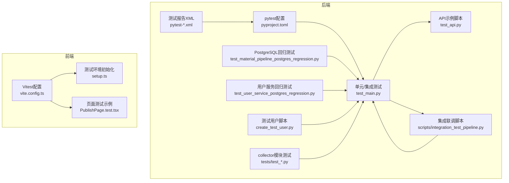
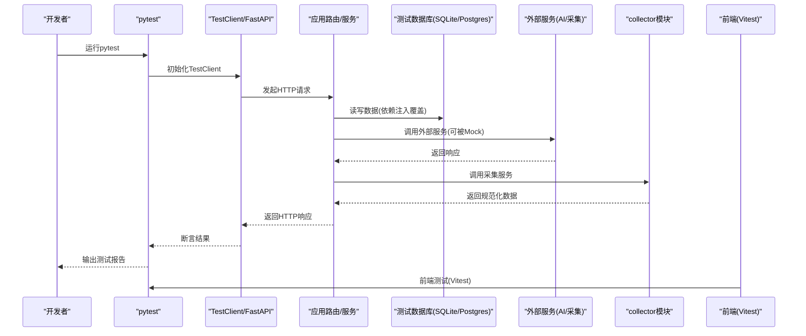
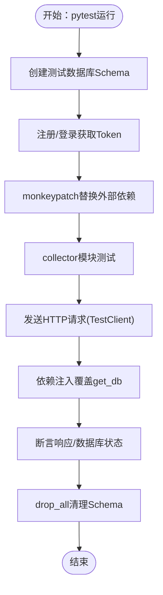
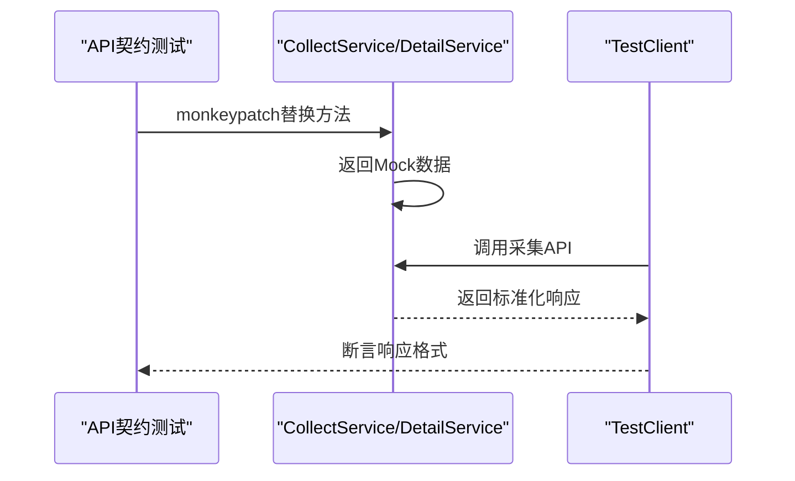
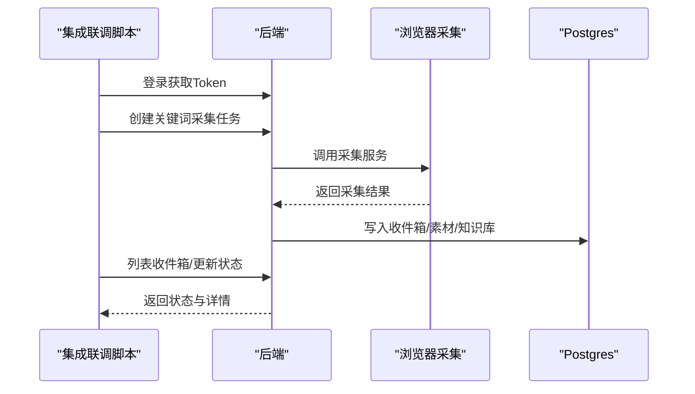
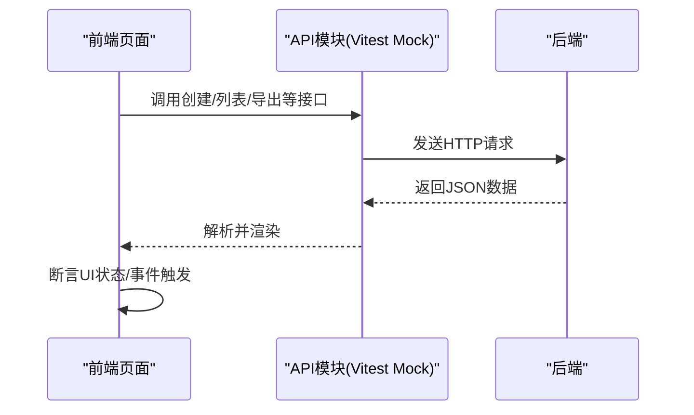
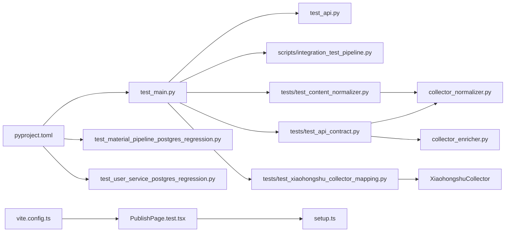

# 测试策略

<cite>
**本文引用的文件**   
- [pyproject.toml](file://backend/pyproject.toml)
- [test_main.py](file://backend/test_main.py)
- [test_api.py](file://backend/test_api.py)
- [create_test_user.py](file://backend/create_test_user.py)
- [integration_test_pipeline.py](file://scripts/integration_test_pipeline.py)
- [test_material_pipeline_postgres_regression.py](file://backend/test_material_pipeline_postgres_regression.py)
- [test_user_service_postgres_regression.py](file://backend/test_user_service_postgres_regression.py)
- [pytest-focus.xml](file://backend/pytest-focus.xml)
- [pytest-uat-errperm.xml](file://backend/pytest-uat-errperm.xml)
- [pytest-uat-evidence.xml](file://backend/pytest-uat-evidence.xml)
- [PublishPage.test.tsx](file://desktop/src/pages/PublishPage.test.tsx)
- [setup.ts](file://desktop/src/test/setup.ts)
- [vite.config.ts](file://desktop/vite.config.ts)
- [test_api_contract.py](file://tests/test_api_contract.py)
- [test_content_normalizer.py](file://tests/test_content_normalizer.py)
- [test_xiaohongshu_collector_mapping.py](file://tests/test_xiaohongshu_collector_mapping.py)
- [collector_normalizer.py](file://backend/app/services/collector_normalizer.py)
- [collector_enricher.py](file://backend/app/services/collector_enricher.py)
- [xiaohongshu_list_card.html](file://tests/fixtures/xiaohongshu_list_card.html)
</cite>

## 更新摘要
**所做更改**   
- 新增collector模块测试策略章节，涵盖API契约测试、内容规范化测试和小红书采集映射测试
- 更新单元测试策略，增加collector模块相关测试用例
- 新增专门的collector模块测试文件分析和最佳实践
- 完善测试数据管理策略，包含新的测试夹具和规范化测试

## 目录
1. [引言](#引言)
2. [项目结构](#项目结构)
3. [核心组件](#核心组件)
4. [架构总览](#架构总览)
5. [详细组件分析](#详细组件分析)
6. [依赖关系分析](#依赖关系分析)
7. [性能考虑](#性能考虑)
8. [故障排查指南](#故障排查指南)
9. [结论](#结论)
10. [附录](#附录)

## 引言
本测试策略面向"智获客"项目，旨在建立覆盖单元测试、集成测试、端到端测试、性能与负载测试、测试数据管理、覆盖率与CI执行、以及调试与排错的完整体系。文档基于仓库现有测试代码与配置进行归纳总结，并给出可操作的实践建议。

**更新** 新增collector模块测试策略，涵盖API契约测试、内容规范化测试和采集器映射测试，替代原有分散的测试方法。

## 项目结构
后端采用FastAPI + SQLAlchemy架构，测试以pytest为主，辅以HTTP客户端与数据库会话；前端使用Vitest + React Testing Library。测试相关的关键位置如下：
- 后端测试：backend目录下的pytest测试、API示例脚本、PostgreSQL回归测试、集成联调脚本
- 前端测试：desktop/src/pages下页面级测试与vite配置
- CI测试报告：pytest*.xml输出文件
- **新增** collector模块测试：tests目录下的专门测试文件

**图表来源**
- [pyproject.toml:42-47](file://backend/pyproject.toml#L42-L47)
- [test_main.py:1-120](file://backend/test_main.py#L1-L120)
- [test_api.py:1-159](file://backend/test_api.py#L1-L159)
- [integration_test_pipeline.py:1-192](file://scripts/integration_test_pipeline.py#L1-L192)
- [test_material_pipeline_postgres_regression.py:1-120](file://backend/test_material_pipeline_postgres_regression.py#L1-L120)
- [test_user_service_postgres_regression.py:1-107](file://backend/test_user_service_postgres_regression.py#L1-L107)
- [create_test_user.py:1-54](file://backend/create_test_user.py#L1-L54)
- [vite.config.ts:16-22](file://desktop/vite.config.ts#L16-L22)
- [setup.ts:1-3](file://desktop/src/test/setup.ts#L1-L3)
- [PublishPage.test.tsx:1-97](file://desktop/src/pages/PublishPage.test.tsx#L1-L97)
- [test_api_contract.py:1-124](file://tests/test_api_contract.py#L1-L124)
- [test_content_normalizer.py:1-61](file://tests/test_content_normalizer.py#L1-L61)
- [test_xiaohongshu_collector_mapping.py:1-110](file://tests/test_xiaohongshu_collector_mapping.py#L1-L110)

**章节来源**
- [pyproject.toml:42-47](file://backend/pyproject.toml#L42-L47)
- [test_main.py:1-120](file://backend/test_main.py#L1-L120)
- [vite.config.ts:16-22](file://desktop/vite.config.ts#L16-L22)

## 核心组件
- 测试框架与标记
  - 使用pytest与pytest-asyncio，定义了回归测试与PostgreSQL回归测试标记，便于分层执行与选择性运行
- 测试客户端
  - FastAPI TestClient用于端到端HTTP测试
  - requests/httpx用于独立API脚本与集成联调
- 数据库与会话
  - SQLite内存数据库用于单元测试；PostgreSQL用于回归测试
  - 通过依赖注入覆盖get_db，实现测试数据库切换
- Mock与桩
  - 使用monkeypatch替换AI服务与采集客户端方法，隔离外部依赖
- 前端测试
  - Vitest + React Testing Library，通过hoisted mocks模拟API模块
- **新增** collector模块测试
  - 专门的API契约测试、内容规范化测试和采集器映射测试
  - 使用FakeLocator和FakeCard模拟DOM解析过程

**章节来源**
- [pyproject.toml:23-25](file://backend/pyproject.toml#L23-L25)
- [pyproject.toml:43-46](file://backend/pyproject.toml#L43-L46)
- [test_main.py:18-37](file://backend/test_main.py#L18-L37)
- [test_api.py:10-159](file://backend/test_api.py#L10-L159)
- [integration_test_pipeline.py:20-22](file://scripts/integration_test_pipeline.py#L20-L22)
- [PublishPage.test.tsx:7-22](file://desktop/src/pages/PublishPage.test.tsx#L7-L22)
- [test_api_contract.py:47-124](file://tests/test_api_contract.py#L47-L124)
- [test_content_normalizer.py:5-61](file://tests/test_content_normalizer.py#L5-L61)
- [test_xiaohongshu_collector_mapping.py:7-110](file://tests/test_xiaohongshu_collector_mapping.py#L7-L110)

## 架构总览
下图展示测试执行路径与组件交互，包括HTTP端点测试、数据库测试、外部服务Mock、以及前后端协同。

**图表来源**
- [test_main.py:34-37](file://backend/test_main.py#L34-L37)
- [test_main.py:130-225](file://backend/test_main.py#L130-L225)
- [integration_test_pipeline.py:64-91](file://scripts/integration_test_pipeline.py#L64-L91)
- [PublishPage.test.tsx:24-96](file://desktop/src/pages/PublishPage.test.tsx#L24-L96)
- [test_api_contract.py:47-87](file://tests/test_api_contract.py#L47-L87)
- [test_content_normalizer.py:5-33](file://tests/test_content_normalizer.py#L5-L33)
- [test_xiaohongshu_collector_mapping.py:77-94](file://tests/test_xiaohongshu_collector_mapping.py#L77-L94)

## 详细组件分析

### 单元测试策略（pytest）
- 测试组织
  - 使用TestClient与依赖注入覆盖get_db，确保每个测试在独立数据库中运行
  - 使用fixture创建测试数据库schema与清理逻辑
- 认证与授权
  - 通过注册/登录流程获取Bearer Token，构造带认证头的请求
- Mock对象
  - 使用monkeypatch替换AI服务与采集客户端方法，避免真实外部调用
- 断言与边界
  - 对状态码、响应体字段、幂等行为进行断言
- **新增** collector模块测试
  - 专门测试内容规范化和富化逻辑
  - 使用FakeLocator和FakeCard模拟DOM解析
- 示例定位
  - 用户注册/登录、内容创建、合规检查、V1路由与收件箱状态流转、N+1查询优化验证、素材管线API闭环、发布任务生命周期、线索池状态与分配等

**图表来源**
- [test_main.py:84-89](file://backend/test_main.py#L84-L89)
- [test_main.py:40-81](file://backend/test_main.py#L40-L81)
- [test_main.py:284-588](file://backend/test_main.py#L284-L588)
- [test_api_contract.py:47-124](file://tests/test_api_contract.py#L47-L124)
- [test_content_normalizer.py:5-61](file://tests/test_content_normalizer.py#L5-L61)
- [test_xiaohongshu_collector_mapping.py:77-110](file://tests/test_xiaohongshu_collector_mapping.py#L77-L110)

**章节来源**
- [test_main.py:40-81](file://backend/test_main.py#L40-L81)
- [test_main.py:84-89](file://backend/test_main.py#L84-L89)
- [test_main.py:284-588](file://backend/test_main.py#L284-L588)
- [test_api_contract.py:47-124](file://tests/test_api_contract.py#L47-L124)
- [test_content_normalizer.py:5-61](file://tests/test_content_normalizer.py#L5-L61)
- [test_xiaohongshu_collector_mapping.py:77-110](file://tests/test_xiaohongshu_collector_mapping.py#L77-L110)

### collector模块测试策略

#### API契约测试
- 测试目标
  - 验证采集API的输入输出契约，确保数据格式和字段完整性
  - 测试采集服务的Mock行为，保证API端点稳定性
- 测试范围
  - `/api/collect/run` 采集运行端点
  - `/api/collect/detail` 详情采集端点
  - 请求参数验证和错误处理
- Mock策略
  - 使用monkeypatch替换CollectService.run_collect和DetailService.fetch_detail
  - 构建标准化的ContentItem和CollectResponse对象

**图表来源**
- [test_api_contract.py:47-87](file://tests/test_api_contract.py#L47-L87)
- [test_api_contract.py:89-115](file://tests/test_api_contract.py#L89-L115)
- [test_api_contract.py:117-124](file://tests/test_api_contract.py#L117-L124)

**章节来源**
- [test_api_contract.py:47-124](file://tests/test_api_contract.py#L47-L124)

#### 内容规范化测试
- 测试目标
  - 验证collector_normalizer模块的文本清理、去重和数值转换功能
  - 测试collector_enricher模块的评分计算和风险评估逻辑
- 测试范围
  - 文本清理和标准化（去除特殊字符、空白处理）
  - 图片URL去重和过滤
  - 数值格式转换（千位符、单位识别）
  - 字段完整性计算和质量评分
- 测试策略
  - 输入各种格式的原始数据，验证规范化后的结果
  - 测试边界情况和异常输入

**章节来源**
- [test_content_normalizer.py:5-61](file://tests/test_content_normalizer.py#L5-L61)
- [collector_normalizer.py:11-163](file://backend/app/services/collector_normalizer.py#L11-L163)
- [collector_enricher.py:13-63](file://backend/app/services/collector_enricher.py#L13-L63)

#### 采集器映射测试
- 测试目标
  - 验证XiaohongshuCollector的HTML解析和字段映射逻辑
  - 测试DOM选择器的正确性和数据提取准确性
- 测试范围
  - 列表卡片解析（标题、作者、点赞数、封面图等）
  - 详情页面字段提取
  - 错误HTML处理和边界情况
- 测试策略
  - 使用FakeLocator和FakeCard模拟DOM结构
  - 基于真实HTML夹具文件进行解析测试
  - 测试缺失字段时的降级处理

**章节来源**
- [test_xiaohongshu_collector_mapping.py:7-110](file://tests/test_xiaohongshu_collector_mapping.py#L7-L110)

### 集成测试策略（API端点、数据库、外部服务）
- API端点测试
  - 使用TestClient对/v1、/v2、/api等路由进行端到端验证，覆盖健康检查、采集任务、收件箱状态流转、素材入库与改写、发布任务生命周期、线索池等
- 数据库集成测试
  - SQLite用于本地快速测试；PostgreSQL回归测试通过环境变量启用，覆盖去重、采纳回写、知识重建、规则与提示词影响、多用户检索隔离等
- 外部服务集成测试
  - 通过monkeypatch替换AIService与BrowserCollectorClient，确保测试稳定且可重复
- 独立集成联调脚本
  - scripts/integration_test_pipeline.py串联浏览器采集、关键词采集、收件箱、状态流转，支持命令行参数与健康检查

**图表来源**
- [integration_test_pipeline.py:64-141](file://scripts/integration_test_pipeline.py#L64-L141)
- [test_material_pipeline_postgres_regression.py:76-156](file://backend/test_material_pipeline_postgres_regression.py#L76-L156)

**章节来源**
- [integration_test_pipeline.py:1-192](file://scripts/integration_test_pipeline.py#L1-L192)
- [test_material_pipeline_postgres_regression.py:1-120](file://backend/test_material_pipeline_postgres_regression.py#L1-L120)
- [test_user_service_postgres_regression.py:26-73](file://backend/test_user_service_postgres_regression.py#L26-L73)

### 端到端测试策略（用户工作流与跨组件交互）
- 用户工作流
  - 发布任务从创建、认领、提交、追踪到关闭的完整生命周期
  - 线索池从生成、分配、转客户到追踪的闭环
- 跨组件交互
  - 前端页面通过mock API与后端交互，验证渲染、表单提交、按钮点击等行为
- 示例定位
  - 发布任务生命周期测试、线索池状态与分配、前端PublishPage测试

**图表来源**
- [PublishPage.test.tsx:24-96](file://desktop/src/pages/PublishPage.test.tsx#L24-L96)
- [vite.config.ts:16-22](file://desktop/vite.config.ts#L16-L22)
- [setup.ts:1-3](file://desktop/src/test/setup.ts#L1-L3)

**章节来源**
- [test_main.py:706-784](file://backend/test_main.py#L706-L784)
- [test_main.py:786-804](file://backend/test_main.py#L786-L804)
- [PublishPage.test.tsx:1-97](file://desktop/src/pages/PublishPage.test.tsx#L1-L97)

### 测试数据管理策略
- 测试数据库
  - SQLite内存数据库：快速、隔离、自动清理
  - PostgreSQL回归测试：通过环境变量启用，支持复杂场景验证
- 种子数据与测试用户
  - create_test_user.py用于开发环境快速创建测试用户
  - test_main.py中通过注册/登录流程在测试中创建用户
- 清理策略
  - 使用fixture在测试前后创建/删除Schema，避免测试间污染
- **新增** collector模块测试数据
  - 使用xiaohongshu_list_card.html作为真实HTML夹具
  - FakeLocator和FakeCard模拟DOM解析环境
  - 标准化的ContentItem构建器

**章节来源**
- [test_main.py:18-37](file://backend/test_main.py#L18-L37)
- [test_main.py:84-89](file://backend/test_main.py#L84-L89)
- [create_test_user.py:15-50](file://backend/create_test_user.py#L15-L50)
- [test_material_pipeline_postgres_regression.py:40-62](file://backend/test_material_pipeline_postgres_regression.py#L40-L62)
- [test_xiaohongshu_collector_mapping.py:77-94](file://tests/test_xiaohongshu_collector_mapping.py#L77-L94)

### 性能测试与负载测试
- 现状
  - 仓库未提供专用的性能/负载测试脚本或工具配置
- 建议
  - 使用pytest-benchmark或locust进行基准测试与并发压力测试
  - 对关键API端点（如/v2/materials列表、/api/v2/materials/ingest-and-rewrite）设定阈值与回归基线
  - 结合数据库查询计数（如N+1检测）与外部服务Mock控制变量
  - **新增** collector模块性能测试建议
    - 采集器映射性能基准测试
    - 规范化函数的批量处理性能
    - Mock服务的响应时间监控

[本节为通用建议，不直接分析具体文件]

## 依赖关系分析
- 测试框架与标记
  - pyproject.toml定义pytest与异步支持，以及回归测试标记
- 测试客户端与数据库
  - test_main.py通过依赖注入覆盖get_db，统一测试数据库
- Mock与桩
  - test_main.py与回归测试广泛使用monkeypatch
- 前端测试
  - vite.config.ts配置Vitest环境与setup文件
- **新增** collector模块测试依赖
  - collector_normalizer和collector_enricher服务
  - XiaohongshuCollector采集器
  - HTML夹具文件

**图表来源**
- [pyproject.toml:23-25](file://backend/pyproject.toml#L23-L25)
- [pyproject.toml:43-46](file://backend/pyproject.toml#L43-L46)
- [test_main.py:34-37](file://backend/test_main.py#L34-L37)
- [test_material_pipeline_postgres_regression.py:40-62](file://backend/test_material_pipeline_postgres_regression.py#L40-L62)
- [test_user_service_postgres_regression.py:26-73](file://backend/test_user_service_postgres_regression.py#L26-L73)
- [test_api.py:10-159](file://backend/test_api.py#L10-L159)
- [integration_test_pipeline.py:20-22](file://scripts/integration_test_pipeline.py#L20-L22)
- [vite.config.ts:16-22](file://desktop/vite.config.ts#L16-L22)
- [PublishPage.test.tsx:24-96](file://desktop/src/pages/PublishPage.test.tsx#L24-L96)
- [setup.ts:1-3](file://desktop/src/test/setup.ts#L1-L3)
- [test_api_contract.py:8-10](file://tests/test_api_contract.py#L8-L10)
- [test_content_normalizer.py:1-2](file://tests/test_content_normalizer.py#L1-L2)
- [test_xiaohongshu_collector_mapping.py:4](file://tests/test_xiaohongshu_collector_mapping.py#L4)

**章节来源**
- [pyproject.toml:42-47](file://backend/pyproject.toml#L42-L47)
- [test_main.py:34-37](file://backend/test_main.py#L34-L37)
- [vite.config.ts:16-22](file://desktop/vite.config.ts#L16-L22)

## 性能考虑
- 查询优化
  - 通过before_cursor_execute统计SELECT次数，验证列表查询预加载与N+1优化
- 外部服务Mock
  - 在性能测试中保持外部依赖稳定，避免网络抖动影响指标
- 数据库选择
  - SQLite适合快速迭代，PostgreSQL回归测试用于真实性能与一致性验证
- **新增** collector模块性能考虑
  - 规范化函数的字符串处理开销
  - DOM解析的正则表达式性能
  - Mock服务的响应时间基准

**章节来源**
- [test_main.py:590-649](file://backend/test_main.py#L590-L649)
- [test_material_pipeline_postgres_regression.py:76-156](file://backend/test_material_pipeline_postgres_regression.py#L76-L156)
- [collector_normalizer.py:11-163](file://backend/app/services/collector_normalizer.py#L11-L163)
- [test_xiaohongshu_collector_mapping.py:27-75](file://tests/test_xiaohongshu_collector_mapping.py#L27-L75)

## 故障排查指南
- 常见问题
  - 缺少认证头导致401/403：确认auth_headers fixture是否正确注入
  - 外部服务不可达：使用monkeypatch替换AI/采集客户端方法
  - 数据库序列漂移：PostgreSQL回归测试覆盖序列恢复逻辑
  - 状态流转幂等：断言重复操作返回预期状态码
  - **新增** collector模块问题
    - HTML解析失败：检查FakeLocator的属性访问
    - 规范化结果异常：验证输入数据格式
    - Mock服务返回None：确认monkeypatch替换是否生效
- 排查步骤
  - 打印请求/响应与关键上下文
  - 使用独立脚本（如test_api.py、integration_test_pipeline.py）快速复现
  - 查看pytest XML报告定位失败用例
  - **新增** collector模块调试技巧
    - 使用pytest --pdb调试规范化函数
    - 检查HTML夹具文件的编码和格式
    - 验证正则表达式的匹配结果

**章节来源**
- [test_main.py:40-81](file://backend/test_main.py#L40-L81)
- [test_main.py:130-225](file://backend/test_main.py#L130-L225)
- [test_user_service_postgres_regression.py:26-73](file://backend/test_user_service_postgres_regression.py#L26-L73)
- [pytest-focus.xml:1-1](file://backend/pytest-focus.xml#L1-L1)
- [pytest-uat-errperm.xml:1-1](file://backend/pytest-uat-errperm.xml#L1-L1)
- [pytest-uat-evidence.xml:1-1](file://backend/pytest-uat-evidence.xml#L1-L1)
- [test_xiaohongshu_collector_mapping.py:77-110](file://tests/test_xiaohongshu_collector_mapping.py#L77-L110)

## 结论
本项目已具备完善的单元与集成测试基础，覆盖核心业务流程与外部依赖隔离。**更新** 新增的collector模块测试策略进一步完善了测试体系，提供了专门的API契约测试、内容规范化测试和采集器映射测试。建议在现有基础上补充：
- 明确覆盖率门槛与CI中强制校验
- 引入性能/负载测试工具与基线
- 规范化测试报告与缺陷跟踪
- 前端测试用例扩展与快照测试
- **新增** collector模块测试的自动化执行

[本节为总结，不直接分析具体文件]

## 附录

### 测试覆盖率与CI执行建议
- 覆盖率
  - 建议在CI中开启覆盖率收集（如pytest-cov），设定阈值（如函数/分支/行覆盖率）
  - **新增** collector模块覆盖率要求：规范化函数应达到90%以上覆盖率
- CI执行
  - 将pytest与前端测试纳入流水线，分别运行SQLite与PostgreSQL回归套件
  - 使用pytest-xml输出供CI报告系统解析
  - **新增** collector模块测试的独立执行策略

**章节来源**
- [pyproject.toml:23-25](file://backend/pyproject.toml#L23-L25)
- [pytest-focus.xml:1-1](file://backend/pytest-focus.xml#L1-L1)
- [pytest-uat-errperm.xml:1-1](file://backend/pytest-uat-errperm.xml#L1-L1)
- [pytest-uat-evidence.xml:1-1](file://backend/pytest-uat-evidence.xml#L1-L1)

### 前端测试配置与最佳实践
- 配置
  - vite.config.ts启用globals与jsdom环境，setup.ts引入DOM匹配器
- 最佳实践
  - 使用hoisted mock集中管理API依赖
  - 针对关键交互（创建任务、状态变更、导出）编写断言

**章节来源**
- [vite.config.ts:16-22](file://desktop/vite.config.ts#L16-L22)
- [setup.ts:1-3](file://desktop/src/test/setup.ts#L1-L3)
- [PublishPage.test.tsx:24-96](file://desktop/src/pages/PublishPage.test.tsx#L24-L96)

### collector模块测试最佳实践
- **API契约测试**
  - 使用静态方法替换服务调用，确保测试隔离性
  - 验证所有响应字段的存在性和类型正确性
  - 测试请求参数验证和错误响应
- **内容规范化测试**
  - 覆盖各种输入格式和边界情况
  - 验证数据转换的准确性和一致性
  - 测试性能敏感的字符串处理函数
- **采集器映射测试**
  - 使用真实的HTML夹具文件进行端到端测试
  - 验证DOM选择器的健壮性和容错性
  - 测试缺失字段时的降级处理逻辑

**章节来源**
- [test_api_contract.py:47-124](file://tests/test_api_contract.py#L47-L124)
- [test_content_normalizer.py:5-61](file://tests/test_content_normalizer.py#L5-L61)
- [test_xiaohongshu_collector_mapping.py:77-110](file://tests/test_xiaohongshu_collector_mapping.py#L77-L110)
- [collector_normalizer.py:11-163](file://backend/app/services/collector_normalizer.py#L11-L163)
- [collector_enricher.py:13-63](file://backend/app/services/collector_enricher.py#L13-L63)