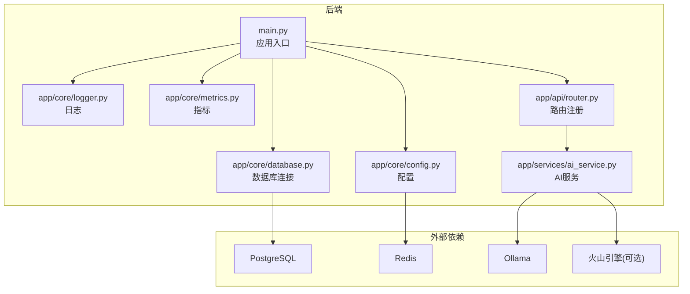
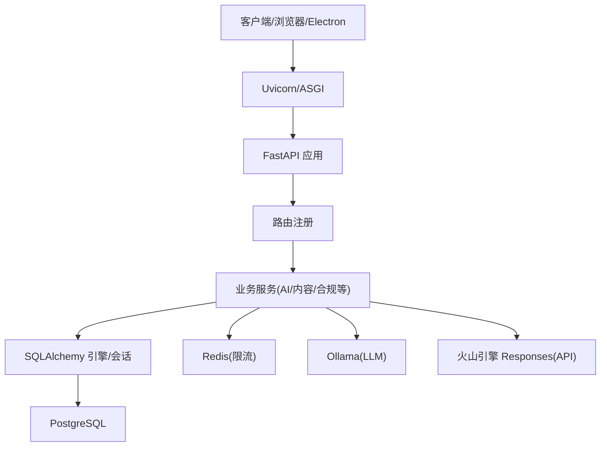
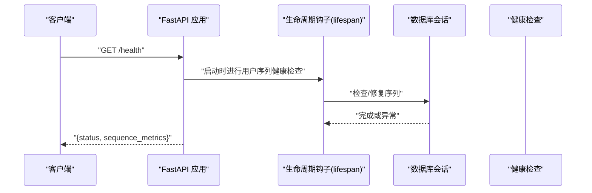
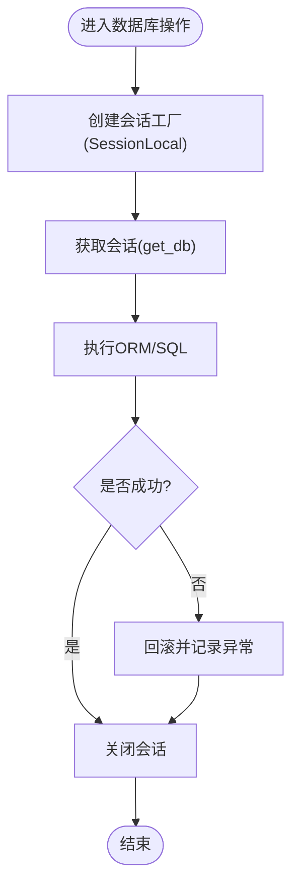
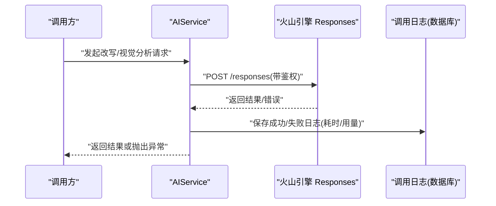
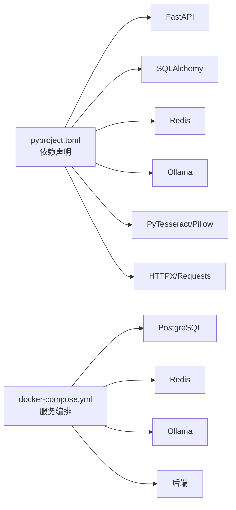

# 调试与故障排除

<cite>
**本文引用的文件**
- [backend/README.md](file://backend/README.md)
- [backend/pyproject.toml](file://backend/pyproject.toml)
- [backend/main.py](file://backend/main.py)
- [backend/app/core/config.py](file://backend/app/core/config.py)
- [backend/app/core/database.py](file://backend/app/core/database.py)
- [backend/app/core/logger.py](file://backend/app/core/logger.py)
- [backend/app/core/metrics.py](file://backend/app/core/metrics.py)
- [backend/app/core/exceptions.py](file://backend/app/core/exceptions.py)
- [backend/app/api/router.py](file://backend/app/api/router.py)
- [backend/docker-compose.yml](file://backend/docker-compose.yml)
- [backend/app/services/ai_service.py](file://backend/app/services/ai_service.py)
- [desktop/package.json](file://desktop/package.json)
</cite>

## 目录
1. [简介](#简介)
2. [项目结构](#项目结构)
3. [核心组件](#核心组件)
4. [架构总览](#架构总览)
5. [详细组件分析](#详细组件分析)
6. [依赖分析](#依赖分析)
7. [性能考虑](#性能考虑)
8. [故障排除指南](#故障排除指南)
9. [结论](#结论)
10. [附录](#附录)

## 简介
本指南面向“智获客”项目的开发与运维人员，提供从后端服务、前端应用、数据库、网络到AI服务的系统化调试与故障排除方法。内容涵盖日志分析、错误追踪、性能监控、浏览器与Electron调试、数据库诊断、网络问题排查、AI服务可观测性、系统监控与告警配置，以及常见问题的快速修复与应急流程。

## 项目结构
后端采用 FastAPI + SQLAlchemy + PostgreSQL 架构，配合 Redis、Ollama 与火山引擎（可选）。前端为 Electron/Vite React 应用，通过 Docker 编排统一运行。关键目录与职责如下：
- backend/app：核心业务模块（API、服务、领域模型、核心配置与中间件）
- backend/app/core：配置、数据库连接、日志、指标、安全与权限
- backend/app/api/endpoints 与 app/api/v1/v2：路由与端点
- backend/app/services：业务服务层（如 AI 服务）
- backend/alembic：数据库迁移
- desktop：桌面端 Electron + Vite + React
- docker-compose.yml：服务编排（PostgreSQL、Redis、Ollama、后端）

图表来源
- [backend/main.py:1-138](file://backend/main.py#L1-L138)
- [backend/app/core/config.py:1-103](file://backend/app/core/config.py#L1-L103)
- [backend/app/core/database.py:1-29](file://backend/app/core/database.py#L1-L29)
- [backend/app/core/logger.py:1-6](file://backend/app/core/logger.py#L1-L6)
- [backend/app/core/metrics.py:1-44](file://backend/app/core/metrics.py#L1-L44)
- [backend/app/api/router.py:1-35](file://backend/app/api/router.py#L1-L35)
- [backend/app/services/ai_service.py:1-460](file://backend/app/services/ai_service.py#L1-L460)

章节来源
- [backend/README.md:90-107](file://backend/README.md#L90-L107)
- [backend/docker-compose.yml:1-67](file://backend/docker-compose.yml#L1-L67)

## 核心组件
- 应用入口与生命周期：应用在启动时进行用户序列健康检查，并提供健康检查端点与静态资源托管。
- 配置系统：集中管理数据库、CORS、AI模型、限流、上传、WeCom、浏览器采集器等参数。
- 数据库连接：基于 SQLAlchemy 的连接池配置，支持 pre_ping 与溢出连接数控制。
- 日志与指标：统一日志工厂与用户序列指标计数器，便于健康检查与可观测性。
- 路由注册：集中注册各模块路由，便于扩展与维护。
- AI 服务：封装本地 Ollama 与火山引擎 Responses API 调用，记录调用日志与用量。

章节来源
- [backend/main.py:22-36](file://backend/main.py#L22-L36)
- [backend/main.py:71-77](file://backend/main.py#L71-L77)
- [backend/app/core/config.py:15-103](file://backend/app/core/config.py#L15-L103)
- [backend/app/core/database.py:6-29](file://backend/app/core/database.py#L6-L29)
- [backend/app/core/logger.py:4-6](file://backend/app/core/logger.py#L4-L6)
- [backend/app/core/metrics.py:36-44](file://backend/app/core/metrics.py#L36-L44)
- [backend/app/api/router.py:32-35](file://backend/app/api/router.py#L32-L35)
- [backend/app/services/ai_service.py:15-304](file://backend/app/services/ai_service.py#L15-L304)

## 架构总览
后端服务通过 Uvicorn 运行，FastAPI 提供 REST API 与文档端点；数据库通过 SQLAlchemy 连接池访问；AI 推理可通过本地 Ollama 或火山引擎；Redis 用于分布式限流；Docker Compose 统一编排。

图表来源
- [backend/main.py:46-51](file://backend/main.py#L46-L51)
- [backend/app/api/router.py:32-35](file://backend/app/api/router.py#L32-L35)
- [backend/app/core/database.py:6-29](file://backend/app/core/database.py#L6-L29)
- [backend/app/services/ai_service.py:15-304](file://backend/app/services/ai_service.py#L15-L304)

## 详细组件分析

### 后端服务调试要点
- 启动与健康检查
  - 启动阶段执行用户序列健康检查，失败会记录异常日志。
  - 健康检查端点返回应用状态与用户序列指标快照。
- CORS 配置
  - 生产环境禁止使用通配来源，需显式配置白名单。
- 静态资源与 SPA 回退
  - 若前端构建产物存在，挂载静态资源并提供 SPA 回退；否则返回版本信息与文档链接。
- 日志与指标
  - 使用统一日志工厂；用户序列指标通过原子计数器保护并发安全。
- 路由与端点
  - 所有路由集中注册，便于定位新增端点与中间件顺序。

图表来源
- [backend/main.py:22-36](file://backend/main.py#L22-L36)
- [backend/main.py:71-77](file://backend/main.py#L71-L77)
- [backend/app/core/metrics.py:36-44](file://backend/app/core/metrics.py#L36-L44)

章节来源
- [backend/main.py:46-107](file://backend/main.py#L46-L107)
- [backend/app/core/config.py:65-69](file://backend/app/core/config.py#L65-L69)
- [backend/app/core/metrics.py:12-44](file://backend/app/core/metrics.py#L12-L44)

### 数据库与连接池调试
- 连接池参数
  - 预检查与溢出连接数控制，避免连接失效导致的请求阻塞。
- 会话管理
  - 通过上下文管理器确保会话正确关闭，防止连接泄漏。
- 迁移与版本
  - 使用 Alembic 管理数据库迁移，支持查看当前版本、升级/回滚与历史记录。

图表来源
- [backend/app/core/database.py:22-29](file://backend/app/core/database.py#L22-L29)

章节来源
- [backend/app/core/database.py:6-29](file://backend/app/core/database.py#L6-L29)
- [backend/README.md:50-75](file://backend/README.md#L50-L75)

### AI 服务与可观测性
- 调用路径
  - 优先使用云模型（火山引擎），否则回退至本地 Ollama。
  - 图像理解通过多模态 Responses API，支持请求/响应日志与用量统计。
- 日志与持久化
  - 记录请求开始、成功、HTTP 错误与异常失败，包含耗时、Token 用量与错误摘要。
  - 调用日志持久化到数据库表，便于审计与统计。
- 限流
  - Ark 视觉场景具备速率限制配置项，结合 Redis 实现分布式限流（不可用时降级）。

图表来源
- [backend/app/services/ai_service.py:132-304](file://backend/app/services/ai_service.py#L132-L304)

章节来源
- [backend/app/services/ai_service.py:15-460](file://backend/app/services/ai_service.py#L15-L460)
- [backend/README.md:160-163](file://backend/README.md#L160-L163)

### 前端应用调试（浏览器与 Electron）
- 开发模式
  - Web 开发服务器与 Electron 主进程并行启动，支持局域网预览。
- 构建与打包
  - Vite 构建 Web 资源，Electron Builder 打包为桌面应用。
- 调试建议
  - 浏览器端：使用开发者工具检查网络、存储与控制台错误；关注跨域与静态资源加载。
  - Electron：在主进程与渲染进程分别开启调试，检查 IPC 通信与资源路径。

章节来源
- [desktop/package.json:8-20](file://desktop/package.json#L8-L20)
- [desktop/package.json:45-77](file://desktop/package.json#L45-L77)

## 依赖分析
- 后端依赖
  - FastAPI、SQLAlchemy、Pydantic、HTTP 客户端、Redis、OCR/PIL、Ollama 等。
- Docker 编排
  - PostgreSQL、Redis、Ollama 与后端服务容器化，统一网络与卷管理。
- 版本与标记
  - Pytest 标记用于回归测试分组，便于选择性执行。

图表来源
- [backend/pyproject.toml:7-31](file://backend/pyproject.toml#L7-L31)
- [backend/docker-compose.yml:3-67](file://backend/docker-compose.yml#L3-L67)

章节来源
- [backend/pyproject.toml:42-47](file://backend/pyproject.toml#L42-L47)
- [backend/docker-compose.yml:1-67](file://backend/docker-compose.yml#L1-L67)

## 性能考虑
- 数据库连接池
  - 合理设置 pool_size 与 max_overflow，结合 pre_ping 降低连接失效概率。
- AI 推理超时
  - 为火山引擎与本地 Ollama 设置合理超时，避免请求堆积。
- 限流与降级
  - Redis 可用时启用分布式限流，不可用时自动降级，保障系统稳定性。
- 日志与指标
  - 通过 Ark 调用日志与用户序列指标，持续观察延迟与错误率趋势。

章节来源
- [backend/app/core/database.py:6-13](file://backend/app/core/database.py#L6-L13)
- [backend/app/services/ai_service.py:157-163](file://backend/app/services/ai_service.py#L157-L163)
- [backend/app/core/config.py:86-89](file://backend/app/core/config.py#L86-L89)
- [backend/app/core/metrics.py:36-44](file://backend/app/core/metrics.py#L36-L44)

## 故障排除指南

### 后端服务调试
- 启动失败或健康检查异常
  - 检查数据库连接字符串与可达性；确认 Alembic 迁移版本一致。
  - 查看启动日志中用户序列健康检查异常堆栈。
- CORS 问题
  - 生产环境禁止使用通配来源，需在配置中明确白名单。
- 静态资源与 SPA 回退
  - 确认前端构建产物存在且路径正确；若不存在，返回的是版本信息与文档链接。
- 日志与指标
  - 使用统一日志工厂输出；通过健康端点查看用户序列指标快照。

章节来源
- [backend/README.md:50-75](file://backend/README.md#L50-L75)
- [backend/main.py:22-36](file://backend/main.py#L22-L36)
- [backend/app/core/config.py:65-69](file://backend/app/core/config.py#L65-L69)
- [backend/app/core/logger.py:4-6](file://backend/app/core/logger.py#L4-L6)
- [backend/app/core/metrics.py:36-44](file://backend/app/core/metrics.py#L36-L44)

### 数据库问题诊断
- 连接池与锁等待
  - 检查 pool_size 与 max_overflow 是否过小；结合慢查询日志定位热点 SQL。
- 迁移与版本
  - 使用 Alembic 查看当前版本与历史，必要时执行升级或回滚。
- 事务与回滚
  - 在业务层捕获异常并回滚，避免脏数据；记录异常以便复盘。

章节来源
- [backend/app/core/database.py:6-29](file://backend/app/core/database.py#L6-L29)
- [backend/README.md:50-75](file://backend/README.md#L50-L75)
- [backend/app/core/exceptions.py:1-7](file://backend/app/core/exceptions.py#L1-L7)

### 网络问题排查
- API 调用与跨域
  - 使用浏览器开发者工具 Network 面板检查请求/响应头与状态码；核对 CORS 配置。
- 代理与连通性
  - 使用命令行工具验证后端、数据库、Redis、Ollama 与火山引擎的连通性。
- 限流与超时
  - 关注 Ark 视觉场景的速率限制配置，必要时调整窗口与阈值。

章节来源
- [backend/app/core/config.py:49-53](file://backend/app/core/config.py#L49-L53)
- [backend/app/services/ai_service.py:157-163](file://backend/app/services/ai_service.py#L157-L163)

### AI 服务调试
- 模型推理问题
  - 检查本地 Ollama 服务是否可用；确认模型名称与基础 URL 正确。
- 火山引擎 Responses 异常
  - 核对 API Key 与基础 URL；查看 Ark 调用日志中的错误摘要与耗时。
- OCR 识别错误
  - 确认图像 URL 可达；检查 PIL 与 Tesseract 依赖；逐步缩小输入范围定位问题。

章节来源
- [backend/app/services/ai_service.py:39-62](file://backend/app/services/ai_service.py#L39-L62)
- [backend/app/services/ai_service.py:132-240](file://backend/app/services/ai_service.py#L132-L240)
- [backend/pyproject.toml:30](file://backend/pyproject.toml#L30)

### 前端应用调试
- 浏览器开发者工具
  - Network：查看 API 请求与响应；Console：定位 JS 错误；Sources：断点调试；Application：检查缓存与静态资源。
- React DevTools
  - 检查组件树与 props/state；定位渲染性能瓶颈。
- Electron 应用
  - 主进程与渲染进程分别调试；检查 IPC 通道与资源路径；打包后验证静态资源加载。

章节来源
- [desktop/package.json:8-20](file://desktop/package.json#L8-L20)

### 系统监控与告警
- 关键指标
  - 用户序列指标、Ark 调用耗时与错误率、数据库连接池使用率、Redis 限流命中率。
- 健康检查
  - 使用运维健康端点验证数据库、Redis、Ollama 状态。
- 告警建议
  - 设定阈值告警（错误率、P95 延迟、连接池空闲率低、限流触发率）；结合日志与指标联动。

章节来源
- [backend/app/core/metrics.py:36-44](file://backend/app/core/metrics.py#L36-L44)
- [backend/README.md:209-221](file://backend/README.md#L209-L221)

### 常见问题快速解决
- 数据库连接失败
  - 检查 DATABASE_URL 与网络连通；确认 Alembic 迁移版本。
- CORS 报错
  - 生产环境配置明确来源白名单，避免使用通配符。
- AI 推理超时
  - 调整超时时间与模型参数；必要时切换到本地 Ollama。
- 前端静态资源 404
  - 确认前端已构建；检查 SPA 回退逻辑与静态资源挂载路径。

章节来源
- [backend/app/core/config.py:27-35](file://backend/app/core/config.py#L27-L35)
- [backend/app/core/config.py:65-69](file://backend/app/core/config.py#L65-L69)
- [backend/app/services/ai_service.py:157-163](file://backend/app/services/ai_service.py#L157-L163)
- [backend/main.py:78-107](file://backend/main.py#L78-L107)

### 紧急处理流程
- 快速止损
  - 降级 AI 云模型为本地 Ollama；临时关闭高负载端点；启用只读模式。
- 诊断与恢复
  - 采集日志与指标；定位根因（数据库/网络/模型）；执行回滚或修复。
- 复盘与预防
  - 补充监控与告警；完善限流与熔断；优化配置与依赖版本。

[本节为通用流程说明，无需特定文件引用]

## 结论
通过统一的日志与指标体系、完善的配置与限流策略、清晰的路由与服务边界，以及前后端一体化的调试工具链，“智获客”项目能够在复杂场景下实现快速定位与高效恢复。建议持续完善自动化测试与监控告警，以提升系统的稳定性与可维护性。

## 附录
- 快速参考
  - 后端启动与日志：[backend/README.md:16-27](file://backend/README.md#L16-L27)
  - API 文档端点：[backend/README.md:83-85](file://backend/README.md#L83-L85)
  - 运维健康检查端点：[backend/README.md:197-221](file://backend/README.md#L197-L221)
  - Docker 编排：[backend/docker-compose.yml:1-67](file://backend/docker-compose.yml#L1-L67)
  - 前端开发脚本：[desktop/package.json:8-20](file://desktop/package.json#L8-L20)