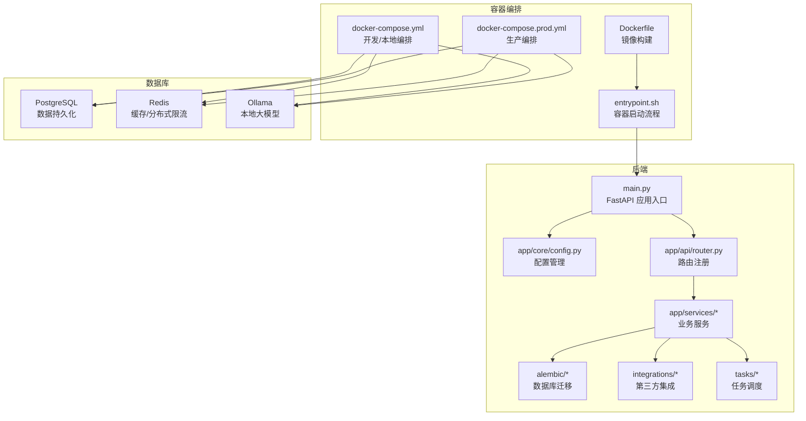
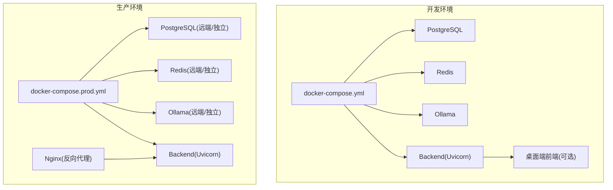
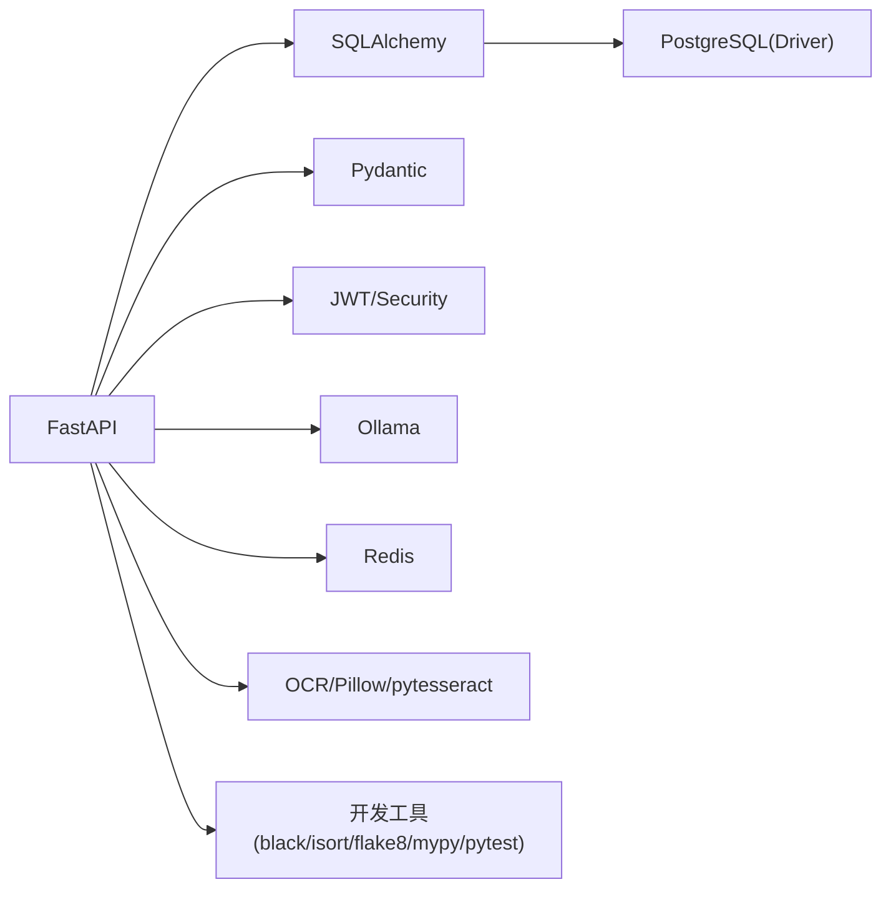

# 快速开始

<cite>
**本文引用的文件**
- [QUICKSTART.md](file://backend/QUICKSTART.md)
- [README.md](file://backend/README.md)
- [pyproject.toml](file://backend/pyproject.toml)
- [docker-compose.yml](file://backend/docker-compose.yml)
- [docker-compose.prod.yml](file://backend/docker-compose.prod.yml)
- [Dockerfile](file://backend/Dockerfile)
- [main.py](file://backend/main.py)
- [app/core/config.py](file://backend/app/core/config.py)
- [init_db.py](file://backend/init_db.py)
- [create_test_user.py](file://backend/create_test_user.py)
- [entrypoint.sh](file://backend/entrypoint.sh)
- [requirements.txt](file://backend/requirements.txt)
- [test_api.py](file://backend/test_api.py)
- [desktop/package.json](file://desktop/package.json)
</cite>

## 目录
1. [简介](#简介)
2. [项目结构](#项目结构)
3. [核心组件](#核心组件)
4. [架构总览](#架构总览)
5. [详细组件分析](#详细组件分析)
6. [依赖分析](#依赖分析)
7. [性能考虑](#性能考虑)
8. [故障排除指南](#故障排除指南)
9. [结论](#结论)
10. [附录](#附录)

## 简介
智获客是一个基于 FastAPI + PostgreSQL 的 AI 内容获客运营系统，支持内容采集、AI 改写、合规审核、客户管理、数据分析看板等功能。本“快速开始”旨在帮助新用户在最短时间内完成环境准备、依赖安装、数据库配置与应用启动，并提供开发与生产环境的差异配置、常见问题排查与基础使用示例。

## 项目结构
后端采用分层架构，主要目录与职责如下：
- app：核心业务层，包含模型、模式、服务、API 路由、核心配置与中间件等
- alembic：数据库迁移骨架与版本
- integrations：第三方集成（如火山引擎、OCR、存储等）
- services：业务服务封装
- tasks：定时任务与异步任务
- workers：工作进程（如浏览器采集客户端等）
- scripts：辅助脚本（如数据库初始化、规则同步等）

图表来源
- [main.py:46-68](file://backend/main.py#L46-L68)
- [app/core/config.py:15-102](file://backend/app/core/config.py#L15-L102)
- [docker-compose.yml:3-58](file://backend/docker-compose.yml#L3-L58)
- [docker-compose.prod.yml:6-107](file://backend/docker-compose.prod.yml#L6-L107)
- [Dockerfile:1-19](file://backend/Dockerfile#L1-L19)
- [entrypoint.sh:1-48](file://backend/entrypoint.sh#L1-L48)

章节来源
- [README.md:90-107](file://backend/README.md#L90-L107)
- [QUICKSTART.md:71-105](file://backend/QUICKSTART.md#L71-L105)

## 核心组件
- 应用入口与生命周期：应用在启动时进行健康检查、CORS 配置、静态资源挂载与路由注册。
- 配置管理：集中管理数据库、JWT、CORS、AI 模型、限流、上传等配置项。
- 数据库初始化：支持通过 Alembic 迁移或直接创建表两种方式。
- 容器启动流程：等待数据库就绪、执行迁移/建表、可选创建测试用户、启动服务。

章节来源
- [main.py:22-68](file://backend/main.py#L22-L68)
- [app/core/config.py:15-102](file://backend/app/core/config.py#L15-L102)
- [init_db.py:16-21](file://backend/init_db.py#L16-L21)
- [entrypoint.sh:7-47](file://backend/entrypoint.sh#L7-L47)

## 架构总览
下图展示了开发与生产两种部署形态下的组件关系与数据流向。

图表来源
- [docker-compose.yml:3-58](file://backend/docker-compose.yml#L3-L58)
- [docker-compose.prod.yml:6-107](file://backend/docker-compose.prod.yml#L6-L107)

## 详细组件分析

### 安装与环境准备
- 系统要求
  - Python：3.10 及以上
  - Docker 与 Docker Compose：用于一键启动（推荐）
  - Git：克隆仓库
- 前置条件
  - 确保端口未被占用：8000（后端）、5432（PostgreSQL）、6379（Redis）、11434（Ollama）
  - 网络连通：若使用云服务或远端数据库/Redis/Ollama，需开放对应端口与安全组

章节来源
- [pyproject.toml:7-8](file://backend/pyproject.toml#L7-L8)
- [docker-compose.yml:11-12](file://backend/docker-compose.yml#L11-L12)
- [docker-compose.prod.yml:39-40](file://backend/docker-compose.prod.yml#L39-L40)

### 依赖安装
- 方案 A：使用 Poetry（推荐）
  - 在 backend 目录安装依赖：[pyproject.toml:1-47](file://backend/pyproject.toml#L1-L47)
- 方案 B：使用 requirements.txt
  - 直接安装：[requirements.txt:1-21](file://backend/requirements.txt#L1-L21)
- 方案 C：Docker 镜像构建
  - 使用 Dockerfile 构建镜像：[Dockerfile:1-19](file://backend/Dockerfile#L1-L19)

章节来源
- [pyproject.toml:1-47](file://backend/pyproject.toml#L1-L47)
- [requirements.txt:1-21](file://backend/requirements.txt#L1-L21)
- [Dockerfile:1-19](file://backend/Dockerfile#L1-L19)

### 数据库配置与初始化
- 开发环境
  - 使用 docker-compose 启动 PostgreSQL、Redis、Ollama 与后端服务：[docker-compose.yml:3-58](file://backend/docker-compose.yml#L3-L58)
  - 初始化数据库：可选择 Alembic 迁移或直接建表
    - Alembic 迁移：[QUICKSTART.md:57-69](file://backend/QUICKSTART.md#L57-L69)
    - 直接建表：[init_db.py:16-21](file://backend/init_db.py#L16-L21)
- 生产环境
  - 使用 docker-compose.prod.yml 启动（建议）：[docker-compose.prod.yml:6-107](file://backend/docker-compose.prod.yml#L6-L107)
  - 数据库、Redis、Ollama 可独立部署，通过环境变量连接

章节来源
- [docker-compose.yml:3-58](file://backend/docker-compose.yml#L3-L58)
- [docker-compose.prod.yml:6-107](file://backend/docker-compose.prod.yml#L6-L107)
- [init_db.py:16-21](file://backend/init_db.py#L16-L21)
- [QUICKSTART.md:57-69](file://backend/QUICKSTART.md#L57-L69)

### 应用启动
- 方案 A：Docker 一键启动（推荐）
  - 进入 backend 目录，启动服务并后台运行：[QUICKSTART.md:14-18](file://backend/QUICKSTART.md#L14-L18)
  - 访问地址：后端 API、Swagger 文档、数据库、Ollama
- 方案 B：本地开发
  - 安装依赖、启动 PostgreSQL（Docker）、初始化数据库、创建测试用户、启动后端：[QUICKSTART.md:26-51](file://backend/QUICKSTART.md#L26-L51)
- 方案 C：虚拟环境直启（服务器部署）
  - 使用脚本启动 PostgreSQL 与 Ollama，创建虚拟环境，安装依赖，初始化数据库，创建测试用户，启动后端服务：[setup-venv.sh:1-129](file://backend/setup-venv.sh#L1-L129)

章节来源
- [QUICKSTART.md:14-51](file://backend/QUICKSTART.md#L14-L51)
- [setup-venv.sh:1-129](file://backend/setup-venv.sh#L1-L129)

### 开发环境与生产环境差异
- 环境变量
  - 开发：默认配置见 .env.example，可复制为 .env 并按需修改：[README.md:9-14](file://backend/README.md#L9-L14)
  - 生产：通过 docker-compose.prod.yml 的 env_file 引入 .env，务必设置强密钥、关闭 DEBUG、限制 CORS 来源：[docker-compose.prod.yml:37-38](file://backend/docker-compose.prod.yml#L37-L38)
- CORS 与安全
  - 开发默认允许本地前端源；生产禁止使用通配符，需明确白名单：[app/core/config.py:65-69](file://backend/app/core/config.py#L65-L69)
- 限流与可观测性
  - 生产建议开启 Redis 分布式限流，避免 Ollama/火山引擎限流导致雪崩：[app/core/config.py:86-89](file://backend/app/core/config.py#L86-L89)
- 反向代理
  - 生产可通过 Nginx 将 80/443 转发至后端 8000：[QUICKSTART.md:303-315](file://backend/QUICKSTART.md#L303-L315)

章节来源
- [README.md:9-14](file://backend/README.md#L9-L14)
- [docker-compose.prod.yml:37-38](file://backend/docker-compose.prod.yml#L37-L38)
- [app/core/config.py:65-69](file://backend/app/core/config.py#L65-L69)
- [app/core/config.py:86-89](file://backend/app/core/config.py#L86-L89)
- [QUICKSTART.md:303-315](file://backend/QUICKSTART.md#L303-L315)

### 基本使用与验证
- 认证与测试
  - 注册与登录获取 token，再调用受保护的 API：[test_api.py:17-47](file://backend/test_api.py#L17-L47)
- API 文档
  - Swagger UI：http://localhost:8000/docs；ReDoc：http://localhost:8000/redoc
- 健康检查
  - 运维健康检查端点：/api/system/ops/health 与 /api/system/ops/readiness（生产部署后验证）：[README.md:197-200](file://backend/README.md#L197-L200)

章节来源
- [test_api.py:17-47](file://backend/test_api.py#L17-L47)
- [README.md:81-86](file://backend/README.md#L81-L86)
- [README.md:197-200](file://backend/README.md#L197-L200)

## 依赖分析
- 应用框架与数据库
  - FastAPI、SQLAlchemy、Pydantic、PostgreSQL 驱动
- 认证与安全
  - JWT、bcrypt、python-jose
- AI 与 OCR
  - Ollama、Pillow、pytesseract
- 缓存与限流
  - Redis、分布式限流策略
- 开发工具
  - black、isort、flake8、mypy、pytest

图表来源
- [pyproject.toml:7-31](file://backend/pyproject.toml#L7-L31)

章节来源
- [pyproject.toml:1-47](file://backend/pyproject.toml#L1-L47)

## 性能考虑
- 启动阶段
  - 容器启动脚本会等待数据库就绪后再执行迁移/建表，避免冷启动失败：[entrypoint.sh:7-35](file://backend/entrypoint.sh#L7-L35)
- 并发与工作者
  - 生产建议使用多 worker 启动后端服务，提升并发处理能力：[entrypoint.sh](file://backend/entrypoint.sh#L47)
- 缓存与限流
  - Redis 分布式限流可降低上游服务压力，避免突发流量导致系统不可用：[app/core/config.py:86-89](file://backend/app/core/config.py#L86-L89)
- 存储与上传
  - 控制最大上传大小与上传目录，避免磁盘膨胀：[app/core/config.py:91-94](file://backend/app/core/config.py#L91-L94)

章节来源
- [entrypoint.sh:7-35](file://backend/entrypoint.sh#L7-L35)
- [entrypoint.sh](file://backend/entrypoint.sh#L47)
- [app/core/config.py:86-89](file://backend/app/core/config.py#L86-L89)
- [app/core/config.py:91-94](file://backend/app/core/config.py#L91-L94)

## 故障排除指南
- 数据库连接失败
  - 检查 DATABASE_URL、PostgreSQL 是否运行、网络连通性与防火墙设置：[QUICKSTART.md:348-350](file://backend/QUICKSTART.md#L348-L350)
- Token 过期或无效
  - 重新登录获取新 token，并在后续请求中携带 Authorization: Bearer {token}：[QUICKSTART.md:255-264](file://backend/QUICKSTART.md#L255-L264)
- CORS 错误
  - 在 .env 中正确配置 CORS_ORIGINS，生产环境禁止使用通配符：[app/core/config.py:65-69](file://backend/app/core/config.py#L65-L69)
- Alembic 迁移失败
  - 容器启动脚本会回退到直接建表；也可在 backend 目录手动执行迁移命令：[entrypoint.sh:24-35](file://backend/entrypoint.sh#L24-L35)，[QUICKSTART.md:57-69](file://backend/QUICKSTART.md#L57-L69)
- 健康检查失败
  - 生产部署后通过 /api/system/ops/health 与 /api/system/ops/readiness 验证后端、数据库、Redis、Ollama 状态：[README.md:197-200](file://backend/README.md#L197-L200)
- 前端静态资源未显示
  - 若未构建前端，根路径返回提示信息；请先在 desktop 目录执行构建：[main.py:101-107](file://backend/main.py#L101-L107)

章节来源
- [QUICKSTART.md:348-350](file://backend/QUICKSTART.md#L348-L350)
- [QUICKSTART.md:255-264](file://backend/QUICKSTART.md#L255-L264)
- [app/core/config.py:65-69](file://backend/app/core/config.py#L65-L69)
- [entrypoint.sh:24-35](file://backend/entrypoint.sh#L24-L35)
- [QUICKSTART.md:57-69](file://backend/QUICKSTART.md#L57-L69)
- [README.md:197-200](file://backend/README.md#L197-L200)
- [main.py:101-107](file://backend/main.py#L101-L107)

## 结论
通过本指南，您可以在本地或服务器环境中快速完成智获客后端的安装与启动。推荐优先使用 Docker Compose 进行开发与生产部署，配合严格的环境变量配置与健康检查，确保系统稳定运行。如需进一步扩展功能，可参考 API 文档与开发指南逐步完善。

## 附录

### 常用命令速查
- Docker 开发启动
  - 进入 backend 目录，启动服务并后台运行：[QUICKSTART.md:14-18](file://backend/QUICKSTART.md#L14-L18)
- 数据库迁移
  - 查看/升级/回滚/查看历史：[QUICKSTART.md:57-69](file://backend/QUICKSTART.md#L57-L69)
- 本地开发
  - 安装依赖、启动 PostgreSQL（Docker）、初始化数据库、创建测试用户、启动后端：[QUICKSTART.md:26-51](file://backend/QUICKSTART.md#L26-L51)
- 生产部署
  - 使用 docker-compose.prod.yml 启动并构建镜像，设置 .env 中的敏感信息与 CORS 白名单：[docker-compose.prod.yml:37-38](file://backend/docker-compose.prod.yml#L37-L38)，[README.md:212-221](file://backend/README.md#L212-L221)

章节来源
- [QUICKSTART.md:14-69](file://backend/QUICKSTART.md#L14-L69)
- [docker-compose.prod.yml:37-38](file://backend/docker-compose.prod.yml#L37-L38)
- [README.md:212-221](file://backend/README.md#L212-L221)