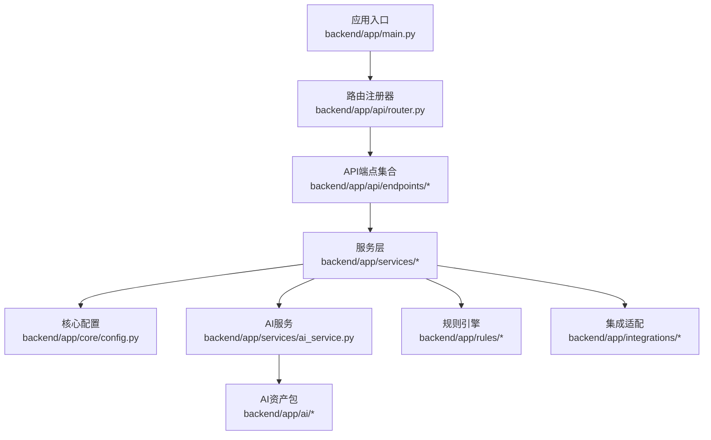
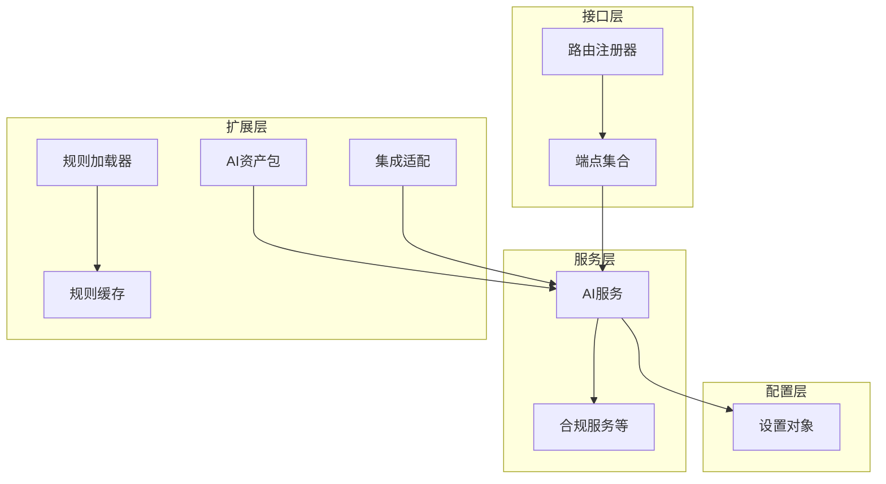
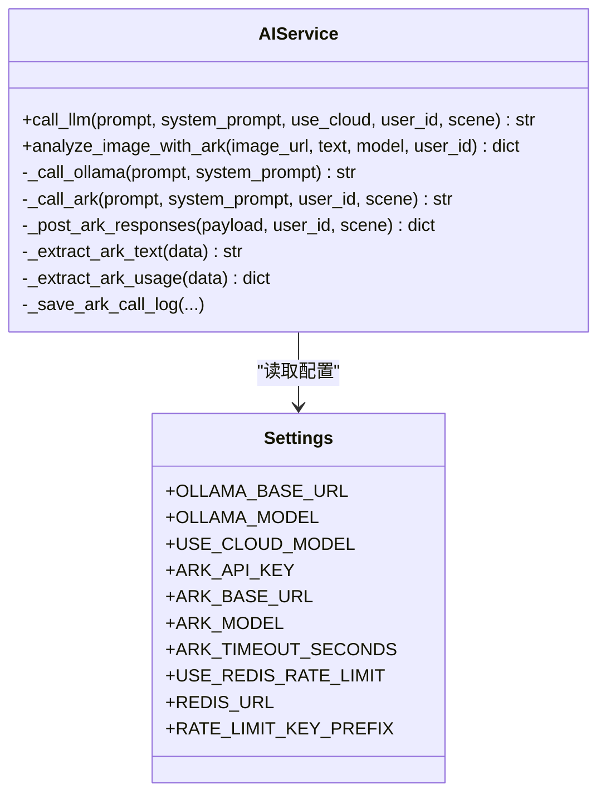
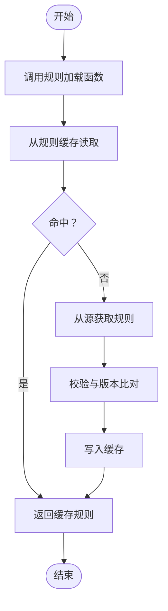
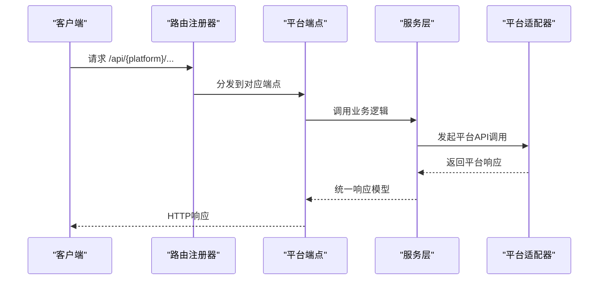
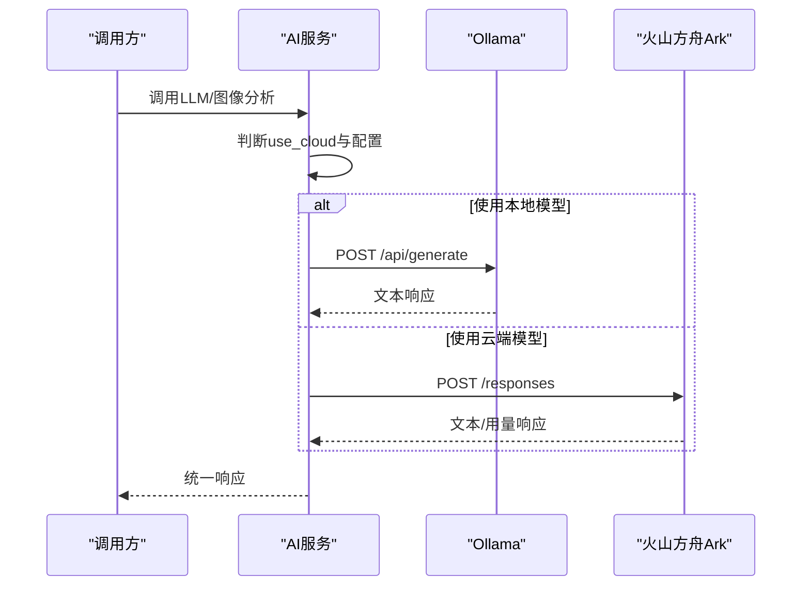
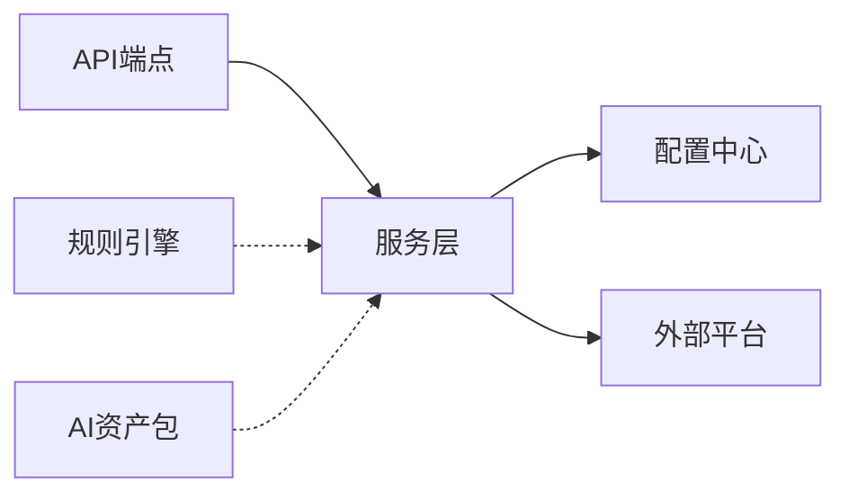

# 扩展与定制

<cite>
**本文引用的文件**
- [backend/app/main.py](file://backend/app/main.py)
- [backend/app/api/router.py](file://backend/app/api/router.py)
- [backend/app/api/endpoints/ai.py](file://backend/app/api/endpoints/ai.py)
- [backend/app/services/ai_service.py](file://backend/app/services/ai_service.py)
- [backend/app/core/config.py](file://backend/app/core/config.py)
- [backend/app/integrations/wecom/__init__.py](file://backend/app/integrations/wecom/__init__.py)
- [backend/app/integrations/storage/__init__.py](file://backend/app/integrations/storage/__init__.py)
- [backend/app/rules/dynamic/rule_loader.py](file://backend/app/rules/dynamic/rule_loader.py)
- [backend/app/rules/dynamic/rule_cache.py](file://backend/app/rules/dynamic/rule_cache.py)
- [backend/app/rules/local/douyin.yaml](file://backend/app/rules/local/douyin.yaml)
- [backend/app/ai/__init__.py](file://backend/app/ai/__init__.py)
- [backend/app/ai/agents/compliance_agent.py](file://backend/app/ai/agents/compliance_agent.py)
- [backend/app/ai/rag/retriever.py](file://backend/app/ai/rag/retriever.py)
</cite>

## 目录
1. [简介](#简介)
2. [项目结构](#项目结构)
3. [核心组件](#核心组件)
4. [架构总览](#架构总览)
5. [详细组件分析](#详细组件分析)
6. [依赖分析](#依赖分析)
7. [性能考虑](#性能考虑)
8. [故障排查指南](#故障排查指南)
9. [结论](#结论)
10. [附录](#附录)

## 简介
本文件面向需要对“智获客”系统进行扩展与定制的开发者，围绕以下主题提供系统化说明：
- 插件开发的架构设计与实现模式（AI模型插件与平台扩展插件）
- 规则引擎的扩展方法与动态规则加载机制
- 新平台集成的开发流程与API适配方法
- 自定义AI模型的训练、部署与集成流程
- 配置定制、界面定制与业务流程定制的方法
- 扩展点的设计原理与最佳实践
- 向后兼容性保证与版本管理策略

## 项目结构
后端采用FastAPI应用入口集中注册路由的方式组织模块，API层负责HTTP接口编排，服务层封装业务能力，核心配置提供统一参数来源，规则与AI相关模块分别位于独立包中。

图表来源
- [backend/app/main.py:1-4](file://backend/app/main.py#L1-L4)
- [backend/app/api/router.py:1-35](file://backend/app/api/router.py#L1-L35)
- [backend/app/api/endpoints/ai.py:1-103](file://backend/app/api/endpoints/ai.py#L1-L103)
- [backend/app/services/ai_service.py:1-460](file://backend/app/services/ai_service.py#L1-L460)
- [backend/app/core/config.py:1-103](file://backend/app/core/config.py#L1-L103)
- [backend/app/ai/__init__.py:1-2](file://backend/app/ai/__init__.py#L1-L2)
- [backend/app/rules/dynamic/rule_loader.py:1-3](file://backend/app/rules/dynamic/rule_loader.py#L1-L3)
- [backend/app/rules/dynamic/rule_cache.py:1-6](file://backend/app/rules/dynamic/rule_cache.py#L1-L6)
- [backend/app/integrations/wecom/__init__.py:1-2](file://backend/app/integrations/wecom/__init__.py#L1-L2)
- [backend/app/integrations/storage/__init__.py:1-2](file://backend/app/integrations/storage/__init__.py#L1-L2)

章节来源
- [backend/app/main.py:1-4](file://backend/app/main.py#L1-L4)
- [backend/app/api/router.py:1-35](file://backend/app/api/router.py#L1-L35)

## 核心组件
- 应用入口与路由注册：通过集中注册器将各模块路由纳入应用，便于扩展新的端点与版本。
- 配置中心：统一管理数据库、安全、AI模型、限流、上传、第三方平台等参数。
- AI服务：封装本地Ollama与火山方舟Ark多模态响应API调用，支持速率限制与调用日志持久化。
- 规则引擎：提供动态规则加载与缓存接口，本地规则以YAML形式维护。
- 平台集成：WeCom与存储等集成适配包预留扩展点。

章节来源
- [backend/app/api/router.py:32-35](file://backend/app/api/router.py#L32-L35)
- [backend/app/core/config.py:15-103](file://backend/app/core/config.py#L15-L103)
- [backend/app/services/ai_service.py:15-304](file://backend/app/services/ai_service.py#L15-L304)
- [backend/app/rules/dynamic/rule_loader.py:1-3](file://backend/app/rules/dynamic/rule_loader.py#L1-L3)
- [backend/app/rules/dynamic/rule_cache.py:1-6](file://backend/app/rules/dynamic/rule_cache.py#L1-L6)
- [backend/app/rules/local/douyin.yaml:1-4](file://backend/app/rules/local/douyin.yaml#L1-L4)
- [backend/app/integrations/wecom/__init__.py:1-2](file://backend/app/integrations/wecom/__init__.py#L1-L2)
- [backend/app/integrations/storage/__init__.py:1-2](file://backend/app/integrations/storage/__init__.py#L1-L2)

## 架构总览
系统采用分层架构：API层负责请求接入与鉴权，服务层承载业务逻辑，配置层提供参数与外部依赖接入，规则与AI模块作为可插拔能力存在。

图表来源
- [backend/app/api/router.py:32-35](file://backend/app/api/router.py#L32-L35)
- [backend/app/api/endpoints/ai.py:1-103](file://backend/app/api/endpoints/ai.py#L1-L103)
- [backend/app/services/ai_service.py:15-304](file://backend/app/services/ai_service.py#L15-L304)
- [backend/app/core/config.py:15-103](file://backend/app/core/config.py#L15-L103)
- [backend/app/rules/dynamic/rule_loader.py:1-3](file://backend/app/rules/dynamic/rule_loader.py#L1-L3)
- [backend/app/rules/dynamic/rule_cache.py:1-6](file://backend/app/rules/dynamic/rule_cache.py#L1-L6)
- [backend/app/ai/__init__.py:1-2](file://backend/app/ai/__init__.py#L1-L2)
- [backend/app/integrations/wecom/__init__.py:1-2](file://backend/app/integrations/wecom/__init__.py#L1-L2)
- [backend/app/integrations/storage/__init__.py:1-2](file://backend/app/integrations/storage/__init__.py#L1-L2)

## 详细组件分析

### 插件开发：AI模型插件与平台扩展插件
- AI模型插件
  - 设计要点：通过配置中心切换本地Ollama或云端火山方舟Ark模型；AI服务统一抽象调用入口，便于替换与扩展。
  - 实现路径：AI服务封装LLM调用、图像分析、速率限制与调用日志持久化。
  - 扩展建议：新增模型时优先在配置中声明参数，AI服务内部按条件分支选择具体实现，避免侵入式修改。
- 平台扩展插件
  - 设计要点：通过路由注册器集中挂载新端点；平台适配以集成包形式存在，便于隔离与复用。
  - 实现路径：WeCom与存储等集成包预留扩展点，可在对应目录下新增适配器与客户端。
  - 扩展建议：遵循现有端点命名与鉴权约定，确保速率限制与日志埋点一致。

图表来源
- [backend/app/services/ai_service.py:15-304](file://backend/app/services/ai_service.py#L15-L304)
- [backend/app/core/config.py:71-90](file://backend/app/core/config.py#L71-L90)

章节来源
- [backend/app/services/ai_service.py:15-304](file://backend/app/services/ai_service.py#L15-L304)
- [backend/app/core/config.py:71-90](file://backend/app/core/config.py#L71-L90)
- [backend/app/api/endpoints/ai.py:87-103](file://backend/app/api/endpoints/ai.py#L87-L103)
- [backend/app/integrations/wecom/__init__.py:1-2](file://backend/app/integrations/wecom/__init__.py#L1-L2)
- [backend/app/integrations/storage/__init__.py:1-2](file://backend/app/integrations/storage/__init__.py#L1-L2)

### 规则引擎：扩展方法与动态规则加载
- 动态规则加载
  - 当前实现：提供规则加载函数与全局缓存访问接口，便于后续接入数据库或远端配置中心。
  - 扩展建议：在加载函数中实现版本校验与回滚策略，缓存层支持TTL与失效通知。
- 本地规则
  - 当前实现：以YAML文件维护平台规则，版本字段用于演进控制。
  - 扩展建议：引入规则校验器与迁移脚本，确保规则变更不影响运行稳定性。

图表来源
- [backend/app/rules/dynamic/rule_loader.py:1-3](file://backend/app/rules/dynamic/rule_loader.py#L1-L3)
- [backend/app/rules/dynamic/rule_cache.py:1-6](file://backend/app/rules/dynamic/rule_cache.py#L1-L6)
- [backend/app/rules/local/douyin.yaml:1-4](file://backend/app/rules/local/douyin.yaml#L1-L4)

章节来源
- [backend/app/rules/dynamic/rule_loader.py:1-3](file://backend/app/rules/dynamic/rule_loader.py#L1-L3)
- [backend/app/rules/dynamic/rule_cache.py:1-6](file://backend/app/rules/dynamic/rule_cache.py#L1-L6)
- [backend/app/rules/local/douyin.yaml:1-4](file://backend/app/rules/local/douyin.yaml#L1-L4)

### 新平台集成：开发流程与API适配
- 开发流程
  - 定义平台常量与路由前缀，新增端点与依赖服务。
  - 在路由注册器中挂载新路由，确保鉴权与限流策略一致。
  - 编写平台适配器（如WeCom），实现统一的请求/响应处理。
- API适配方法
  - 统一使用配置中心参数，避免硬编码。
  - 对外暴露标准化响应模型，便于前端消费。
  - 记录调用日志与指标，便于监控与审计。

图表来源
- [backend/app/api/router.py:32-35](file://backend/app/api/router.py#L32-L35)
- [backend/app/api/endpoints/ai.py:1-103](file://backend/app/api/endpoints/ai.py#L1-L103)
- [backend/app/integrations/wecom/__init__.py:1-2](file://backend/app/integrations/wecom/__init__.py#L1-L2)

章节来源
- [backend/app/api/router.py:32-35](file://backend/app/api/router.py#L32-L35)
- [backend/app/api/endpoints/ai.py:1-103](file://backend/app/api/endpoints/ai.py#L1-L103)
- [backend/app/integrations/wecom/__init__.py:1-2](file://backend/app/integrations/wecom/__init__.py#L1-L2)

### 自定义AI模型：训练、部署与集成
- 训练与部署
  - 本地模型：在配置中指定Ollama基础地址与模型名，确保网络可达。
  - 云端模型：配置火山方舟Ark的API Key、Base URL与模型名，启用速率限制与超时控制。
- 集成流程
  - 在AI服务中新增调用分支，按配置选择模型。
  - 保持统一的输入输出格式与错误处理，便于灰度与回滚。
  - 记录调用日志与用量统计，支撑成本与质量治理。

图表来源
- [backend/app/services/ai_service.py:24-38](file://backend/app/services/ai_service.py#L24-L38)
- [backend/app/services/ai_service.py:39-62](file://backend/app/services/ai_service.py#L39-L62)
- [backend/app/services/ai_service.py:63-91](file://backend/app/services/ai_service.py#L63-L91)
- [backend/app/services/ai_service.py:132-240](file://backend/app/services/ai_service.py#L132-L240)
- [backend/app/core/config.py:71-84](file://backend/app/core/config.py#L71-L84)

章节来源
- [backend/app/services/ai_service.py:15-304](file://backend/app/services/ai_service.py#L15-L304)
- [backend/app/core/config.py:71-90](file://backend/app/core/config.py#L71-L90)

### 配置定制、界面定制与业务流程定制
- 配置定制
  - 使用配置中心集中管理所有可变参数，支持环境变量注入与运行时校验。
  - 关键领域：数据库连接、JWT密钥、CORS白名单、AI模型参数、限流与上传策略。
- 界面定制
  - 前端页面与组件按功能域划分，可通过新增页面与路由扩展业务入口。
  - 建议保持API契约稳定，以便前端独立迭代。
- 业务流程定制
  - 通过规则引擎与服务层组合实现流程编排，确保可测试与可观测。
  - 对关键节点增加日志与指标，便于定位与优化。

章节来源
- [backend/app/core/config.py:15-103](file://backend/app/core/config.py#L15-L103)
- [backend/app/api/router.py:32-35](file://backend/app/api/router.py#L32-L35)

### 扩展点设计原理与最佳实践
- 设计原则
  - 单一职责：每个模块聚焦特定能力（AI、规则、集成）。
  - 松耦合：通过配置与接口解耦外部依赖。
  - 可观测：统一的日志、指标与调用链路。
- 最佳实践
  - 以配置驱动行为，避免硬编码。
  - 以服务层封装复杂流程，端点仅做编排。
  - 以缓存与限流保障稳定性，以日志与指标保障可运维性。
  - 以YAML/数据库等介质管理规则，配合版本与回滚策略。

章节来源
- [backend/app/core/config.py:15-103](file://backend/app/core/config.py#L15-L103)
- [backend/app/services/ai_service.py:15-304](file://backend/app/services/ai_service.py#L15-L304)
- [backend/app/rules/dynamic/rule_cache.py:1-6](file://backend/app/rules/dynamic/rule_cache.py#L1-L6)

### 向后兼容性与版本管理
- 版本策略
  - API版本化：v1与v2路由并行，逐步迁移旧接口。
  - 规则版本：YAML文件包含版本字段，便于演进与回退。
  - 配置版本：新增参数时保留默认值与兼容逻辑。
- 兼容性保障
  - 旧接口标记下线并提供替代路径提示。
  - 速率限制与超时策略统一，避免外部依赖波动影响系统稳定性。
  - 日志与指标覆盖关键路径，便于快速定位兼容性问题。

章节来源
- [backend/app/api/endpoints/ai.py:27-33](file://backend/app/api/endpoints/ai.py#L27-L33)
- [backend/app/api/endpoints/ai.py:75-84](file://backend/app/api/endpoints/ai.py#L75-L84)
- [backend/app/rules/local/douyin.yaml:1-4](file://backend/app/rules/local/douyin.yaml#L1-L4)

## 依赖分析
- 组件耦合
  - API层依赖服务层；服务层依赖配置中心与外部平台。
  - 规则引擎与AI资产包作为可插拔模块，降低对核心流程的影响。
- 外部依赖
  - 数据库、Redis、Ollama、火山方舟Ark等均通过配置中心统一接入。
- 循环依赖
  - 当前结构未见循环导入迹象，扩展时需避免模块间相互依赖。

图表来源
- [backend/app/api/router.py:32-35](file://backend/app/api/router.py#L32-L35)
- [backend/app/services/ai_service.py:15-304](file://backend/app/services/ai_service.py#L15-L304)
- [backend/app/core/config.py:15-103](file://backend/app/core/config.py#L15-L103)
- [backend/app/rules/dynamic/rule_loader.py:1-3](file://backend/app/rules/dynamic/rule_loader.py#L1-L3)
- [backend/app/ai/__init__.py:1-2](file://backend/app/ai/__init__.py#L1-L2)

章节来源
- [backend/app/api/router.py:32-35](file://backend/app/api/router.py#L32-L35)
- [backend/app/services/ai_service.py:15-304](file://backend/app/services/ai_service.py#L15-L304)
- [backend/app/core/config.py:15-103](file://backend/app/core/config.py#L15-L103)

## 性能考虑
- 速率限制：基于Redis的分布式限流，针对不同场景（如图像分析）设置独立阈值与窗口。
- 超时控制：对Ollama与Ark请求设置合理超时，避免阻塞与资源耗尽。
- 缓存策略：规则缓存与响应缓存结合，减少重复计算与外部依赖压力。
- 日志与指标：统一记录调用耗时、用量与错误，支撑容量规划与性能优化。

章节来源
- [backend/app/services/ai_service.py:18-24](file://backend/app/services/ai_service.py#L18-L24)
- [backend/app/core/config.py:86-90](file://backend/app/core/config.py#L86-L90)

## 故障排查指南
- 常见问题
  - AI模型不可用：检查Ollama或Ark的配置项是否正确，确认网络连通性与API Key。
  - 规则加载失败：核对规则文件格式与版本字段，查看缓存是否命中。
  - 速率限制触发：调整限流阈值或等待窗口，关注用户维度的限流键前缀。
- 排查步骤
  - 查看AI服务日志与Ark调用记录，定位错误原因。
  - 使用统一的错误响应模型，便于前端与监控系统识别。
  - 对关键流程增加重试与熔断策略，提升系统韧性。

章节来源
- [backend/app/services/ai_service.py:132-240](file://backend/app/services/ai_service.py#L132-L240)
- [backend/app/core/config.py:86-90](file://backend/app/core/config.py#L86-L90)

## 结论
通过对AI服务、规则引擎、平台集成与配置中心的系统化梳理，本文件提供了可操作的扩展与定制方法。建议在新增能力时遵循“配置驱动、服务编排、可观测先行”的原则，并以版本化与兼容性策略保障长期演进的稳定性。

## 附录
- 快速定位
  - AI服务与模型调用：[backend/app/services/ai_service.py:15-304](file://backend/app/services/ai_service.py#L15-L304)
  - 规则加载与缓存：[backend/app/rules/dynamic/rule_loader.py:1-3](file://backend/app/rules/dynamic/rule_loader.py#L1-L3)、[backend/app/rules/dynamic/rule_cache.py:1-6](file://backend/app/rules/dynamic/rule_cache.py#L1-L6)
  - 平台集成适配：[backend/app/integrations/wecom/__init__.py:1-2](file://backend/app/integrations/wecom/__init__.py#L1-L2)、[backend/app/integrations/storage/__init__.py:1-2](file://backend/app/integrations/storage/__init__.py#L1-L2)
  - 配置中心：[backend/app/core/config.py:15-103](file://backend/app/core/config.py#L15-L103)
  - API路由注册：[backend/app/api/router.py:32-35](file://backend/app/api/router.py#L32-L35)