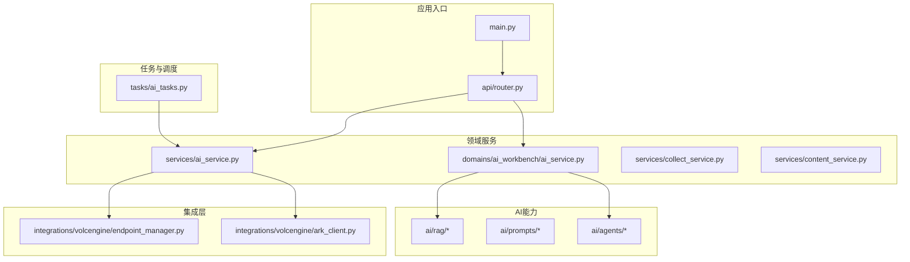
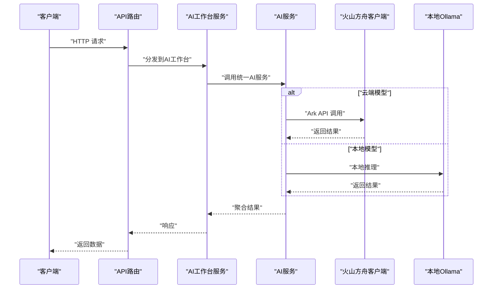
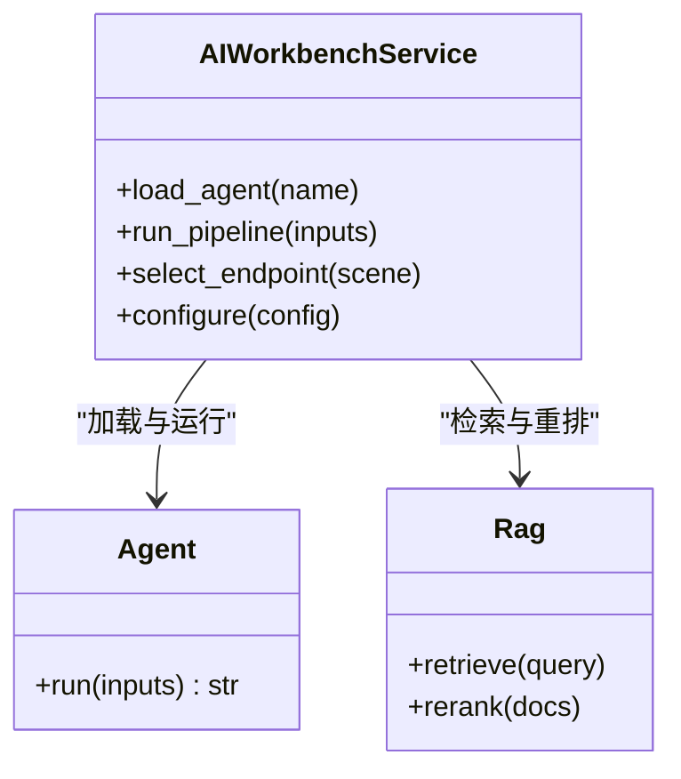
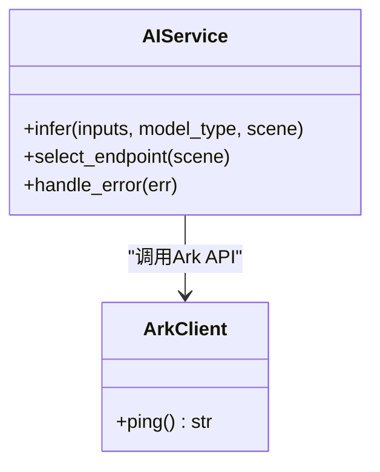
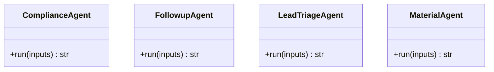
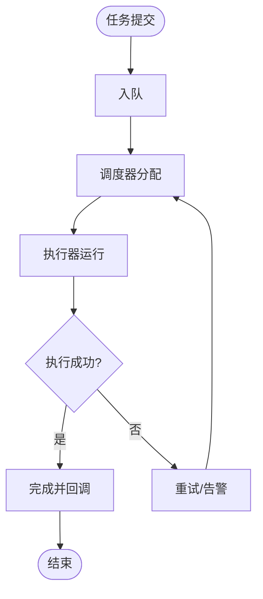
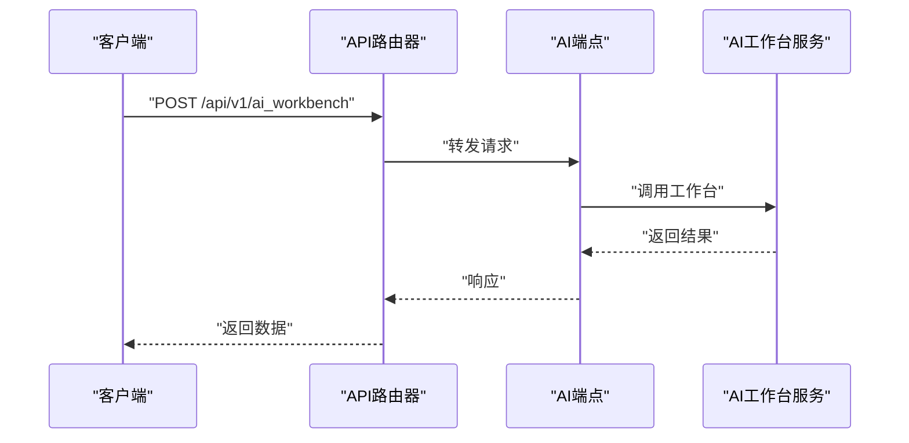
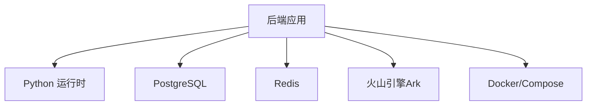

# 插件开发

<cite>
**本文引用的文件**
- [backend/app/ai/__init__.py](file://backend/app/ai/__init__.py)
- [backend/app/ai/agents/compliance_agent.py](file://backend/app/ai/agents/compliance_agent.py)
- [backend/app/ai/agents/followup_agent.py](file://backend/app/ai/agents/followup_agent.py)
- [backend/app/ai/agents/lead_triage_agent.py](file://backend/app/ai/agents/lead_triage_agent.py)
- [backend/app/ai/agents/material_agent.py](file://backend/app/ai/agents/material_agent.py)
- [backend/app/integrations/volcengine/ark_client.py](file://backend/app/integrations/volcengine/ark_client.py)
- [backend/app/integrations/volcengine/endpoint_manager.py](file://backend/app/integrations/volcengine/endpoint_manager.py)
- [backend/app/tasks/ai_tasks.py](file://backend/app/tasks/ai_tasks.py)
- [backend/app/domains/ai_workbench/ai_service.py](file://backend/app/domains/ai_workbench/ai_service.py)
- [backend/app/services/ai_service.py](file://backend/app/services/ai_service.py)
- [backend/app/api/endpoints/ai.py](file://backend/app/api/endpoints/ai.py)
- [backend/app/api/v1/endpoints/ai_workbench.py](file://backend/app/api/v1/endpoints/ai_workbench.py)
- [backend/app/api/router.py](file://backend/app/api/router.py)
- [backend/app/main.py](file://backend/app/main.py)
- [backend/QUICKSTART.md](file://backend/QUICKSTART.md)
- [backend/README.md](file://backend/README.md)
- [backend/pyproject.toml](file://backend/pyproject.toml)
- [backend/requirements.txt](file://backend/requirements.txt)
- [backend/Dockerfile](file://backend/Dockerfile)
- [backend/docker-compose.yml](file://backend/docker-compose.yml)
- [backend/create_test_user.py](file://backend/create_test_user.py)
- [backend/init_db.py](file://backend/init_db.py)
- [backend/server.py](file://backend/server.py)
- [backend/_debug_backend_start.py](file://backend/_debug_backend_start.py)
- [backend/_check_server.py](file://backend/_check_server.py)
- [backend/_deploy_check.py](file://backend/_deploy_check.py)
- [backend/_deploy_run.py](file://backend/_deploy_run.py)
- [backend/deploy.sh](file://backend/deploy.sh)
- [backend/entrypoint.sh](file://backend/entrypoint.sh)
- [backend/scripts/backfill_material_pipeline.py](file://backend/scripts/backfill_material_pipeline.py)
- [backend/scripts/import_spider_xhs.py](file://backend/scripts/import_spider_xhs.py)
- [backend/scripts/sync_rules.py](file://backend/scripts/sync_rules.py)
- [backend/docs/architecture/ai-architecture.md](file://backend/docs/architecture/ai-architecture.md)
- [backend/docs/architecture/system-architecture.md](file://backend/docs/architecture/system-architecture.md)
- [backend/README.md](file://backend/README.md)
- [backend/QUICKSTART.md](file://backend/QUICKSTART.md)
</cite>

## 目录
1. [引言](#引言)
2. [项目结构](#项目结构)
3. [核心组件](#核心组件)
4. [架构总览](#架构总览)
5. [详细组件分析](#详细组件分析)
6. [依赖分析](#依赖分析)
7. [性能考虑](#性能考虑)
8. [故障排查指南](#故障排查指南)
9. [结论](#结论)
10. [附录](#附录)

## 引言
本文件面向“智获客”系统的插件开发者，聚焦于AI模型插件的架构设计与实现模式，覆盖本地Ollama模型与云端火山方舟（Volcengine Ark）API的集成路径；同时阐明插件接口规范、生命周期管理与配置参数，并对Workers系统的插件化架构与任务调度机制进行深入解析。文档还提供最佳实践、错误处理与性能优化策略，以及完整的插件开发示例与调试方法，帮助开发者快速上手并稳定交付。

## 项目结构
后端采用分层与领域驱动相结合的组织方式：
- 应用入口与路由：通过主程序与API路由器组织请求入口
- 领域服务：围绕采集、内容、合规、洞察等业务域划分模块
- AI能力：包含提示词、RAG工具与多Agent能力
- 集成层：封装第三方服务（如火山引擎Ark）
- 任务与调度：以任务模块组织后台执行流程
- 开发与部署：提供启动脚本、容器化与部署脚本

图表来源
- [backend/app/main.py](file://backend/app/main.py)
- [backend/app/api/router.py](file://backend/app/api/router.py)
- [backend/app/domains/ai_workbench/ai_service.py](file://backend/app/domains/ai_workbench/ai_service.py)
- [backend/app/services/ai_service.py](file://backend/app/services/ai_service.py)
- [backend/app/ai/agents/compliance_agent.py](file://backend/app/ai/agents/compliance_agent.py)
- [backend/app/integrations/volcengine/ark_client.py](file://backend/app/integrations/volcengine/ark_client.py)
- [backend/app/integrations/volcengine/endpoint_manager.py](file://backend/app/integrations/volcengine/endpoint_manager.py)
- [backend/app/tasks/ai_tasks.py](file://backend/app/tasks/ai_tasks.py)

章节来源
- [backend/app/main.py](file://backend/app/main.py)
- [backend/app/api/router.py](file://backend/app/api/router.py)
- [backend/app/domains/ai_workbench/ai_service.py](file://backend/app/domains/ai_workbench/ai_service.py)
- [backend/app/services/ai_service.py](file://backend/app/services/ai_service.py)
- [backend/app/ai/agents/compliance_agent.py](file://backend/app/ai/agents/compliance_agent.py)
- [backend/app/integrations/volcengine/ark_client.py](file://backend/app/integrations/volcengine/ark_client.py)
- [backend/app/integrations/volcengine/endpoint_manager.py](file://backend/app/integrations/volcengine/endpoint_manager.py)
- [backend/app/tasks/ai_tasks.py](file://backend/app/tasks/ai_tasks.py)

## 核心组件
- AI工作台服务：负责编排AI能力（Agent/RAG/Prompts），并作为插件化能力的统一出口
- AI服务：封装外部模型调用（本地Ollama与云端火山方舟Ark），提供统一接口
- 火山方舟客户端：封装Ark API调用，提供ping等基础能力
- 端点管理：根据场景选择合适的API端点
- 任务模块：承载后台AI任务的执行与调度
- Agent集合：合规、跟进、线索分流、素材等Agent作为可插拔能力单元

章节来源
- [backend/app/domains/ai_workbench/ai_service.py](file://backend/app/domains/ai_workbench/ai_service.py)
- [backend/app/services/ai_service.py](file://backend/app/services/ai_service.py)
- [backend/app/integrations/volcengine/ark_client.py](file://backend/app/integrations/volcengine/ark_client.py)
- [backend/app/integrations/volcengine/endpoint_manager.py](file://backend/app/integrations/volcengine/endpoint_manager.py)
- [backend/app/tasks/ai_tasks.py](file://backend/app/tasks/ai_tasks.py)
- [backend/app/ai/agents/compliance_agent.py](file://backend/app/ai/agents/compliance_agent.py)
- [backend/app/ai/agents/followup_agent.py](file://backend/app/ai/agents/followup_agent.py)
- [backend/app/ai/agents/lead_triage_agent.py](file://backend/app/ai/agents/lead_triage_agent.py)
- [backend/app/ai/agents/material_agent.py](file://backend/app/ai/agents/material_agent.py)

## 架构总览
下图展示了从API入口到AI工作台、再到外部模型调用的整体链路，以及Agent与RAG能力的插件化接入方式。

图表来源
- [backend/app/api/router.py](file://backend/app/api/router.py)
- [backend/app/domains/ai_workbench/ai_service.py](file://backend/app/domains/ai_workbench/ai_service.py)
- [backend/app/services/ai_service.py](file://backend/app/services/ai_service.py)
- [backend/app/integrations/volcengine/ark_client.py](file://backend/app/integrations/volcengine/ark_client.py)

## 详细组件分析

### AI工作台服务（插件化编排）
- 角色定位：作为AI能力的统一编排层，聚合Agent、RAG与提示词资源，对外暴露一致的插件接口
- 生命周期管理：支持按需加载Agent与RAG组件，动态选择执行策略
- 配置参数：通过场景参数选择端点与模型策略，支持本地与云端切换
- 接口规范：对外提供标准化输入输出契约，便于扩展新Agent或替换底层模型

图表来源
- [backend/app/domains/ai_workbench/ai_service.py](file://backend/app/domains/ai_workbench/ai_service.py)
- [backend/app/ai/agents/compliance_agent.py](file://backend/app/ai/agents/compliance_agent.py)
- [backend/app/ai/agents/followup_agent.py](file://backend/app/ai/agents/followup_agent.py)
- [backend/app/ai/agents/lead_triage_agent.py](file://backend/app/ai/agents/lead_triage_agent.py)
- [backend/app/ai/agents/material_agent.py](file://backend/app/ai/agents/material_agent.py)

章节来源
- [backend/app/domains/ai_workbench/ai_service.py](file://backend/app/domains/ai_workbench/ai_service.py)

### AI服务（模型适配层）
- 角色定位：屏蔽本地Ollama与云端火山方舟Ark的差异，向上提供统一的推理接口
- 端点选择：根据场景参数选择最优端点，支持灰度与容灾
- 错误处理：对网络异常、鉴权失败、限流等情况进行分类与降级
- 性能优化：缓存热点查询、并发控制与超时设置

图表来源
- [backend/app/services/ai_service.py](file://backend/app/services/ai_service.py)
- [backend/app/integrations/volcengine/ark_client.py](file://backend/app/integrations/volcengine/ark_client.py)

章节来源
- [backend/app/services/ai_service.py](file://backend/app/services/ai_service.py)
- [backend/app/integrations/volcengine/ark_client.py](file://backend/app/integrations/volcengine/ark_client.py)
- [backend/app/integrations/volcengine/endpoint_manager.py](file://backend/app/integrations/volcengine/endpoint_manager.py)

### Agent插件（可插拔能力）
- 合规Agent：用于内容合规审查
- 跟进Agent：用于自动跟进与提醒
- 线索分流Agent：用于潜在客户分级与分配
- 素材Agent：用于素材分析与改写

图表来源
- [backend/app/ai/agents/compliance_agent.py](file://backend/app/ai/agents/compliance_agent.py)
- [backend/app/ai/agents/followup_agent.py](file://backend/app/ai/agents/followup_agent.py)
- [backend/app/ai/agents/lead_triage_agent.py](file://backend/app/ai/agents/lead_triage_agent.py)
- [backend/app/ai/agents/material_agent.py](file://backend/app/ai/agents/material_agent.py)

章节来源
- [backend/app/ai/agents/compliance_agent.py](file://backend/app/ai/agents/compliance_agent.py)
- [backend/app/ai/agents/followup_agent.py](file://backend/app/ai/agents/followup_agent.py)
- [backend/app/ai/agents/lead_triage_agent.py](file://backend/app/ai/agents/lead_triage_agent.py)
- [backend/app/ai/agents/material_agent.py](file://backend/app/ai/agents/material_agent.py)

### 任务调度（Workers插件化）
- 作用：承载后台AI任务的异步执行，支持队列化与重试
- 设计：以任务模块为中心，通过统一的任务注册与调度机制，将AI工作台的计算负载下沉至后台
- 扩展：新增任务类型只需遵循统一的输入输出契约，并在调度器中注册

图表来源
- [backend/app/tasks/ai_tasks.py](file://backend/app/tasks/ai_tasks.py)

章节来源
- [backend/app/tasks/ai_tasks.py](file://backend/app/tasks/ai_tasks.py)

### API与路由（插件入口）
- API路由：集中管理各领域端点，AI相关端点由AI工作台服务承接
- AI端点：提供统一的AI工作台访问入口，支持版本化路由

图表来源
- [backend/app/api/router.py](file://backend/app/api/router.py)
- [backend/app/api/v1/endpoints/ai_workbench.py](file://backend/app/api/v1/endpoints/ai_workbench.py)
- [backend/app/domains/ai_workbench/ai_service.py](file://backend/app/domains/ai_workbench/ai_service.py)

章节来源
- [backend/app/api/router.py](file://backend/app/api/router.py)
- [backend/app/api/v1/endpoints/ai_workbench.py](file://backend/app/api/v1/endpoints/ai_workbench.py)
- [backend/app/api/endpoints/ai.py](file://backend/app/api/endpoints/ai.py)

## 依赖分析
- 运行时依赖：Python运行时、数据库、Redis、消息队列等
- 外部集成：火山引擎Ark API、OCR服务、存储服务
- 构建与打包：Docker镜像、Compose编排、部署脚本

图表来源
- [backend/requirements.txt](file://backend/requirements.txt)
- [backend/pyproject.toml](file://backend/pyproject.toml)
- [backend/Dockerfile](file://backend/Dockerfile)
- [backend/docker-compose.yml](file://backend/docker-compose.yml)

章节来源
- [backend/requirements.txt](file://backend/requirements.txt)
- [backend/pyproject.toml](file://backend/pyproject.toml)
- [backend/Dockerfile](file://backend/Dockerfile)
- [backend/docker-compose.yml](file://backend/docker-compose.yml)

## 性能考虑
- 模型调用优化
  - 并发控制：限制并发请求数，避免下游过载
  - 超时设置：为本地与云端调用分别设定合理超时
  - 缓存策略：对热点查询与中间结果进行缓存
- 网络与I/O
  - 连接池：复用HTTP连接，减少握手开销
  - 分片与限流：对Ark API进行分片与速率限制
- 存储与索引
  - 数据库索引：为高频查询字段建立索引
  - Redis缓存：热点数据驻留内存
- 调度与任务
  - 优先级队列：高优任务优先执行
  - 批处理：合并小任务，降低调度开销

## 故障排查指南
- 本地启动与健康检查
  - 使用启动脚本与健康检查脚本验证服务状态
  - 查看日志与环境变量配置
- 火山方舟集成
  - 端点可用性：通过客户端ping方法验证连通性
  - 场景选择：确认场景参数正确，避免错误端点
- 数据库与缓存
  - 初始化数据库与Redis，确保连接正常
- 部署与回滚
  - 使用部署脚本与回滚脚本，确保变更可控

章节来源
- [backend/_debug_backend_start.py](file://backend/_debug_backend_start.py)
- [backend/_check_server.py](file://backend/_check_server.py)
- [backend/_deploy_check.py](file://backend/_deploy_check.py)
- [backend/_deploy_run.py](file://backend/_deploy_run.py)
- [backend/deploy.sh](file://backend/deploy.sh)
- [backend/entrypoint.sh](file://backend/entrypoint.sh)
- [backend/init_db.py](file://backend/init_db.py)

## 结论
本插件开发文档基于现有代码结构，明确了AI工作台的插件化编排思路、模型适配层的设计要点、Agent与RAG能力的接入方式，以及Workers系统的任务调度机制。通过统一接口、清晰的生命周期管理与完善的错误处理策略，开发者可以快速扩展新的AI能力并稳定上线。

## 附录

### 插件接口规范（建议）
- 输入输出契约
  - 统一的输入结构：包含场景参数、上下文、元数据
  - 标准化输出结构：包含结果、置信度、溯源信息
- 生命周期
  - 加载：按需加载Agent与RAG组件
  - 运行：执行推理与后处理
  - 卸载：释放资源，清理缓存
- 配置参数
  - 模型类型：本地Ollama或云端Ark
  - 场景参数：决定端点与策略
  - 超时与并发：影响性能与稳定性

### 开发与调试示例（步骤）
- 创建新Agent
  - 在Agent目录新增实现文件，遵循统一接口
  - 在AI工作台注册并测试
- 集成新模型
  - 在AI服务中新增模型适配逻辑
  - 更新端点选择策略
- 调试方法
  - 使用健康检查脚本验证服务
  - 通过日志与指标监控性能与错误
  - 使用回滚脚本保障变更安全

章节来源
- [backend/app/ai/agents/compliance_agent.py](file://backend/app/ai/agents/compliance_agent.py)
- [backend/app/services/ai_service.py](file://backend/app/services/ai_service.py)
- [backend/_check_server.py](file://backend/_check_server.py)
- [backend/_deploy_run.py](file://backend/_deploy_run.py)