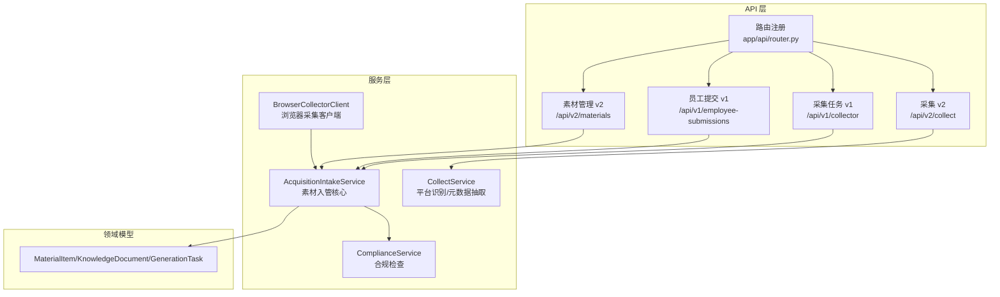
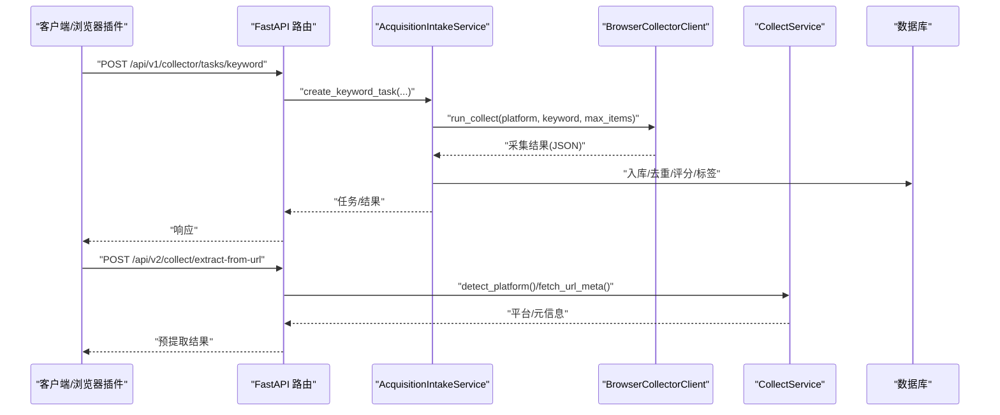
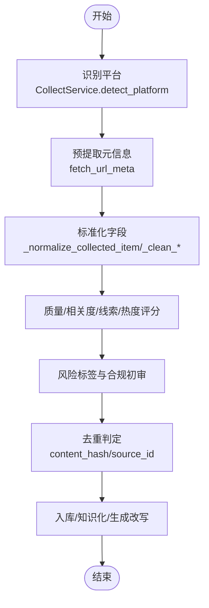
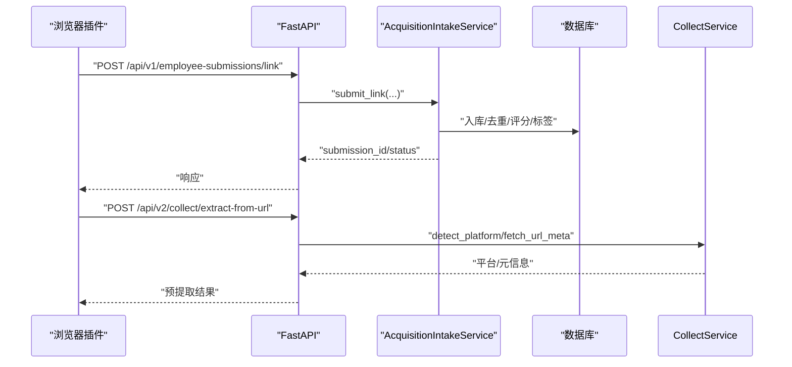
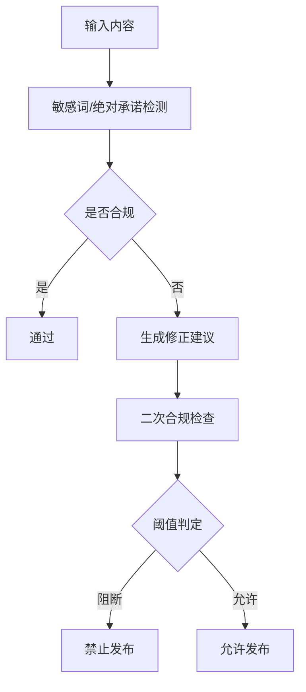
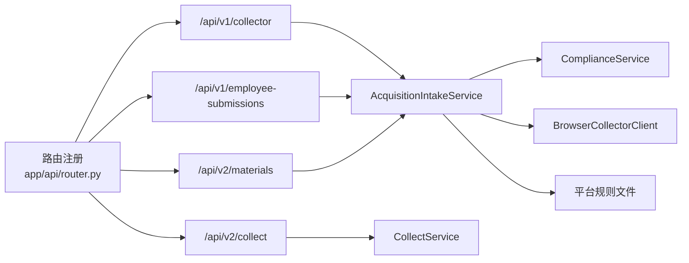

# 新平台集成

<cite>
**本文引用的文件**
- [backend/app/main.py](file://backend/app/main.py)
- [backend/app/api/router.py](file://backend/app/api/router.py)
- [backend/app/api/endpoints/collect.py](file://backend/app/api/endpoints/collect.py)
- [backend/app/api/v1/endpoints/collect.py](file://backend/app/api/v1/endpoints/collect.py)
- [backend/app/api/v1/endpoints/submissions.py](file://backend/app/api/v1/endpoints/submissions.py)
- [backend/app/api/v2/endpoints/collect.py](file://backend/app/api/v2/endpoints/collect.py)
- [backend/app/api/v2/endpoints/materials.py](file://backend/app/api/v2/endpoints/materials.py)
- [backend/app/domains/acquisition/collect_service.py](file://backend/app/domains/acquisition/collect_service.py)
- [backend/app/services/collect_service.py](file://backend/app/services/collect_service.py)
- [backend/app/services/collector/material_pipeline_service.py](file://backend/app/services/collector/material_pipeline_service.py)
- [backend/app/services/collector/intake_service.py](file://backend/app/services/collector/intake_service.py)
- [backend/app/services/collector/browser_collector_client.py](file://backend/app/services/collector/browser_collector_client.py)
- [backend/app/services/compliance_service.py](file://backend/app/services/compliance_service.py)
- [backend/app/rules/local/douyin.yaml](file://backend/app/rules/local/douyin.yaml)
- [backend/app/rules/local/xiaohongshu.yaml](file://backend/app/rules/local/xiaohongshu.yaml)
</cite>

## 目录
1. [简介](#简介)
2. [项目结构](#项目结构)
3. [核心组件](#核心组件)
4. [架构总览](#架构总览)
5. [详细组件分析](#详细组件分析)
6. [依赖分析](#依赖分析)
7. [性能考虑](#性能考虑)
8. [故障排查指南](#故障排查指南)
9. [结论](#结论)
10. [附录](#附录)

## 简介
本文件面向“智获客新平台集成”的开发与运维人员，系统化阐述平台扩展的架构设计、API 适配方法、采集服务扩展模式与数据标准化流程、浏览器插件与手工提交接口的开发要点、平台特定认证机制与数据解析策略、平台兼容性检查与错误处理机制，并提供完整的平台集成开发示例与测试方法。

## 项目结构
后端采用 FastAPI 路由聚合与领域服务分层，采集与素材处理通过 v1/v2 两代 API 体系实现，核心逻辑集中在 domains 与 services 层，配合规则与合规模块完成平台识别、元数据抽取、内容清洗、标签与热度计算、合规审查与生成改写等能力。

图表来源
- [backend/app/api/router.py:32-35](file://backend/app/api/router.py#L32-L35)
- [backend/app/api/v1/endpoints/collect.py:18-34](file://backend/app/api/v1/endpoints/collect.py#L18-L34)
- [backend/app/api/v1/endpoints/submissions.py:31-49](file://backend/app/api/v1/endpoints/submissions.py#L31-L49)
- [backend/app/api/v2/endpoints/collect.py:172-198](file://backend/app/api/v2/endpoints/collect.py#L172-L198)
- [backend/app/api/v2/endpoints/materials.py:151-177](file://backend/app/api/v2/endpoints/materials.py#L151-L177)
- [backend/app/services/collector/material_pipeline_service.py:30-80](file://backend/app/services/collector/material_pipeline_service.py#L30-L80)
- [backend/app/services/collector/browser_collector_client.py:9-40](file://backend/app/services/collector/browser_collector_client.py#L9-L40)
- [backend/app/domains/acquisition/collect_service.py:74-158](file://backend/app/domains/acquisition/collect_service.py#L74-L158)
- [backend/app/services/compliance_service.py:5-113](file://backend/app/services/compliance_service.py#L5-L113)

章节来源
- [backend/app/api/router.py:16-35](file://backend/app/api/router.py#L16-L35)
- [backend/app/main.py:1-4](file://backend/app/main.py#L1-L4)

## 核心组件
- 平台识别与元数据抽取：基于正则匹配的平台识别与 OpenGraph/描述等 meta 抽取，支持标题、描述、作者、站点名清洗与截断。
- 素材采集与入管：v1 关键词采集任务、v2 预提取 URL 元信息；手工提交与微信回调批量提交；统一进入 AcquisitionIntakeService 的标准化与去重、质量/相关度/线索评分、标签与热度、合规审查、知识化与生成改写。
- 合规审查：内置敏感词与绝对承诺检测，提供风险评分、级别与修正建议。
- 浏览器采集客户端：封装外部浏览器采集服务的调用，支持关键词采集与单链路采集。

章节来源
- [backend/app/domains/acquisition/collect_service.py:18-158](file://backend/app/domains/acquisition/collect_service.py#L18-L158)
- [backend/app/services/collector/material_pipeline_service.py:228-470](file://backend/app/services/collector/material_pipeline_service.py#L228-L470)
- [backend/app/services/compliance_service.py:23-71](file://backend/app/services/compliance_service.py#L23-L71)
- [backend/app/services/collector/browser_collector_client.py:16-40](file://backend/app/services/collector/browser_collector_client.py#L16-L40)

## 架构总览
新平台集成遵循“API → 服务 → 领域模型/规则/合规”的分层，v1 侧重采集任务与手工提交，v2 强化预提取与素材管理，统一接入 AcquisitionIntakeService 完成标准化与治理。

图表来源
- [backend/app/api/v1/endpoints/collect.py:18-34](file://backend/app/api/v1/endpoints/collect.py#L18-L34)
- [backend/app/api/v2/endpoints/collect.py:172-198](file://backend/app/api/v2/endpoints/collect.py#L172-L198)
- [backend/app/services/collector/browser_collector_client.py:16-34](file://backend/app/services/collector/browser_collector_client.py#L16-L34)
- [backend/app/domains/acquisition/collect_service.py:78-158](file://backend/app/domains/acquisition/collect_service.py#L78-L158)

## 详细组件分析

### 组件A：采集服务扩展与数据标准化
- 扩展模式
  - 新增平台：在 CollectService 的平台正则字典中添加域名/短链规则，并在平台标签映射中补充中文标签。
  - 采集入口：v1 使用关键词采集任务，v2 使用预提取 URL 元信息；两者最终均进入 AcquisitionIntakeService 的标准化流程。
  - 去重与哈希：基于标题、正文、来源 URL 的组合哈希进行重复判定。
  - 字段标准化：统一字段名（如 source_id、source_url、raw_title、content_text 等），缺失时进行容错与默认值填充。
- 数据标准化流程
  - 文本清洗：HTML 标签清理、实体转义还原、多余空白折叠、噪声行过滤。
  - 标题/正文规范化：长度限制、标点规整、首尾去噪。
  - 质量/相关度/线索/热度评分：综合标题、正文、互动指标与关键词命中。
  - 风险标签：高/中/低风险分级，结合敏感词与平台规则。
  - 知识化与分块：生成知识文档与知识片段，便于检索增强与二次创作。
- 平台特定解析策略
  - 小红书/抖音等平台：优先使用官方 API 或结构化爬虫导入（Spider_XHS），否则回退到 URL 预提取。
  - 微信公众号：通过 URL 预提取 + 手工补充封面/作者等信息。
  - 其他平台：若不在支持列表，需在 CollectService 中扩展平台识别与元数据抽取策略。

图表来源
- [backend/app/domains/acquisition/collect_service.py:78-158](file://backend/app/domains/acquisition/collect_service.py#L78-L158)
- [backend/app/services/collector/material_pipeline_service.py:228-470](file://backend/app/services/collector/material_pipeline_service.py#L228-L470)
- [backend/app/services/collector/material_pipeline_service.py:660-694](file://backend/app/services/collector/material_pipeline_service.py#L660-L694)

章节来源
- [backend/app/domains/acquisition/collect_service.py:18-158](file://backend/app/domains/acquisition/collect_service.py#L18-L158)
- [backend/app/services/collector/material_pipeline_service.py:228-470](file://backend/app/services/collector/material_pipeline_service.py#L228-L470)

### 组件B：API 适配与浏览器插件/手工提交
- v1 采集任务
  - 接口：POST /api/v1/collector/tasks/keyword
  - 参数：platform、keyword、max_items
  - 行为：创建采集任务，调用浏览器采集客户端执行采集，返回任务结果。
- v1 员工提交
  - 接口：POST /api/v1/employee-submissions/link
  - 行为：提交单个链接，支持微信机器人回调批量提交。
- v2 采集与素材管理
  - 预提取：POST /api/v2/collect/extract-from-url
  - 素材列表/详情/更新/删除：GET/GET/PATCH/DELETE /api/v2/materials/{material_id}
  - 改写与采纳：POST /api/v2/materials/{material_id}/rewrite 与 POST /api/v2/materials/{material_id}/generation/{generation_task_id}/adopt
- 浏览器插件集成要点
  - 插件向 /api/v1/employee-submissions/link 提交链接，或通过 /api/v2/collect/extract-from-url 获取预提取结果。
  - 若平台未内置采集器，需在 /api/v1/collector/tasks/keyword 中配置平台与关键词。
- 手工提交接口
  - 通过 /api/v1/employee-submissions/link 或 /api/v2/collect/extract-from-url 完成手工录入与预提取。

图表来源
- [backend/app/api/v1/endpoints/submissions.py:31-49](file://backend/app/api/v1/endpoints/submissions.py#L31-L49)
- [backend/app/api/v2/endpoints/collect.py:172-198](file://backend/app/api/v2/endpoints/collect.py#L172-L198)
- [backend/app/domains/acquisition/collect_service.py:78-158](file://backend/app/domains/acquisition/collect_service.py#L78-L158)

章节来源
- [backend/app/api/v1/endpoints/collect.py:18-34](file://backend/app/api/v1/endpoints/collect.py#L18-L34)
- [backend/app/api/v1/endpoints/submissions.py:31-88](file://backend/app/api/v1/endpoints/submissions.py#L31-L88)
- [backend/app/api/v2/endpoints/collect.py:172-298](file://backend/app/api/v2/endpoints/collect.py#L172-L298)
- [backend/app/api/v2/endpoints/materials.py:151-382](file://backend/app/api/v2/endpoints/materials.py#L151-L382)

### 组件C：平台特定认证机制与数据解析策略
- 认证机制
  - 所有采集与素材相关接口均依赖令牌校验中间件，确保 owner_id 与业务隔离。
- 平台解析策略
  - 平台识别：基于域名/短链正则，支持小红书、抖音、知乎、公众号、咸鱼、微博、B站、快手、头条等。
  - 元数据抽取：优先 OpenGraph/Title/Description/AUTHOR/SITE_NAME，其次 Twitter 等备用字段。
  - 解析失败降级：当无法获取完整 HTML 时，返回“已识别平台但未提取到完整页面信息”。

章节来源
- [backend/app/domains/acquisition/collect_service.py:18-43](file://backend/app/domains/acquisition/collect_service.py#L18-L43)
- [backend/app/domains/acquisition/collect_service.py:119-158](file://backend/app/domains/acquisition/collect_service.py#L119-L158)

### 组件D：合规与风险控制
- 合规检查
  - 敏感词与绝对承诺检测，输出风险级别、分数、风险点与改进建议。
- 风险标签
  - 高/中/低风险，结合敏感词命中与平台规则。
- 处理流程
  - 初审 → 自动修正 → 再审 → 决策是否阻断发布。

图表来源
- [backend/app/services/compliance_service.py:23-71](file://backend/app/services/compliance_service.py#L23-L71)
- [backend/app/services/collector/material_pipeline_service.py:592-627](file://backend/app/services/collector/material_pipeline_service.py#L592-L627)

章节来源
- [backend/app/services/compliance_service.py:5-113](file://backend/app/services/compliance_service.py#L5-L113)
- [backend/app/services/collector/material_pipeline_service.py:592-627](file://backend/app/services/collector/material_pipeline_service.py#L592-L627)

## 依赖分析
- 路由聚合：所有子路由在统一入口注册，便于集中管理与版本演进。
- 服务依赖：AcquisitionIntakeService 作为核心编排者，依赖合规服务、浏览器采集客户端、数据库模型与 AI 服务（用于改写与分析）。
- 规则与平台：平台规则文件（如 douyin.yaml、xiaohongshu.yaml）用于扩展平台行为，当前为空规则，便于后续注入。

图表来源
- [backend/app/api/router.py:32-35](file://backend/app/api/router.py#L32-L35)
- [backend/app/services/collector/intake_service.py:1-3](file://backend/app/services/collector/intake_service.py#L1-L3)
- [backend/app/rules/local/douyin.yaml:1-4](file://backend/app/rules/local/douyin.yaml#L1-L4)
- [backend/app/rules/local/xiaohongshu.yaml:1-4](file://backend/app/rules/local/xiaohongshu.yaml#L1-L4)

章节来源
- [backend/app/api/router.py:16-35](file://backend/app/api/router.py#L16-L35)
- [backend/app/services/collector/intake_service.py:1-3](file://backend/app/services/collector/intake_service.py#L1-L3)
- [backend/app/rules/local/douyin.yaml:1-4](file://backend/app/rules/local/douyin.yaml#L1-L4)
- [backend/app/rules/local/xiaohongshu.yaml:1-4](file://backend/app/rules/local/xiaohongshu.yaml#L1-L4)

## 性能考虑
- 异步元数据抓取：URL 预提取采用异步 HTTP 客户端，设置超时与重定向跟随，避免阻塞。
- 正则匹配与文本清洗：平台识别与 HTML 清洗采用预编译正则与一次性替换，减少重复开销。
- 去重与评分：基于哈希与 SQL 分组统计，避免重复计算；评分函数尽量常数时间复杂度。
- 批量提交：微信回调接口支持批量 URL 提交，内部循环处理并汇总结果，便于前端展示。

## 故障排查指南
- 旧接口迁移
  - /api/collect 下所有路径返回 410，提示迁移至新素材管道与 v1/v2 对应接口。
- 采集失败
  - 关键词任务：捕获异常并返回 502，携带具体错误信息。
  - 单链接采集：若平台无法识别，抛出参数错误。
- 预提取失败
  - 返回“已识别平台，但未提取到完整页面信息”，检查网络连通性与目标站点可用性。
- 合规阻断
  - 当风险级别为高或超过阈值时，禁止发布；可通过修正建议降低风险分数。
- 日志与统计
  - /api/v2/collect/logs 与 /api/v2/collect/stats 提供采集日志与统计，辅助定位问题。

章节来源
- [backend/app/api/endpoints/collect.py:16-20](file://backend/app/api/endpoints/collect.py#L16-L20)
- [backend/app/api/v1/endpoints/collect.py:24-34](file://backend/app/api/v1/endpoints/collect.py#L24-L34)
- [backend/app/api/v2/endpoints/collect.py:177-197](file://backend/app/api/v2/endpoints/collect.py#L177-L197)
- [backend/app/services/collector/browser_collector_client.py:35-40](file://backend/app/services/collector/browser_collector_client.py#L35-L40)
- [backend/app/services/collector/material_pipeline_service.py:592-627](file://backend/app/services/collector/material_pipeline_service.py#L592-L627)
- [backend/app/api/v2/endpoints/collect.py:245-298](file://backend/app/api/v2/endpoints/collect.py#L245-L298)

## 结论
新平台集成以“平台识别 + 元数据抽取 + 统一标准化 + 合规治理 + 知识化与生成改写”为核心路径，v1/v2 双通道满足不同场景需求。通过扩展 CollectService 的平台规则与 AcquisitionIntakeService 的标准化流程，即可快速接入新平台；同时依托合规与风险控制，保障内容安全与质量。

## 附录

### 平台集成开发示例（步骤）
- 步骤1：平台识别与元数据抽取
  - 在 CollectService 中新增平台正则与中文标签。
  - 若存在结构化数据源（如 Spider_XHS），在 v2 中使用对应导入接口。
- 步骤2：采集入口
  - 若需要关键词采集：调用 /api/v1/collector/tasks/keyword 创建任务。
  - 若仅需预提取：调用 /api/v2/collect/extract-from-url。
- 步骤3：手工提交
  - 通过 /api/v1/employee-submissions/link 提交链接，或微信回调批量提交。
- 步骤4：合规与改写
  - 素材入库后，可调用 /api/v2/materials/{material_id}/rewrite 进行改写，或直接 /api/v2/materials/ingest-and-rewrite 一键入管并改写。
- 步骤5：监控与回溯
  - 使用 /api/v2/collect/logs 与 /api/v2/collect/stats 查看采集与统计。

章节来源
- [backend/app/domains/acquisition/collect_service.py:18-43](file://backend/app/domains/acquisition/collect_service.py#L18-L43)
- [backend/app/api/v1/endpoints/collect.py:18-34](file://backend/app/api/v1/endpoints/collect.py#L18-L34)
- [backend/app/api/v2/endpoints/collect.py:172-198](file://backend/app/api/v2/endpoints/collect.py#L172-L198)
- [backend/app/api/v1/endpoints/submissions.py:31-88](file://backend/app/api/v1/endpoints/submissions.py#L31-L88)
- [backend/app/api/v2/endpoints/materials.py:260-308](file://backend/app/api/v2/endpoints/materials.py#L260-L308)

### 平台兼容性检查清单
- 平台识别：确认域名/短链正则覆盖主要入口。
- 元数据抽取：验证 og/title/description/author/sitename 是否可稳定提取。
- 去重策略：确认 source_id 与 content_hash 生成逻辑是否唯一且稳定。
- 合规阈值：根据业务调整风险阈值，确保合规策略与平台特性匹配。
- 规则文件：在 app/rules/local 下新增平台规则文件，便于后续扩展。

章节来源
- [backend/app/domains/acquisition/collect_service.py:18-43](file://backend/app/domains/acquisition/collect_service.py#L18-L43)
- [backend/app/rules/local/douyin.yaml:1-4](file://backend/app/rules/local/douyin.yaml#L1-L4)
- [backend/app/rules/local/xiaohongshu.yaml:1-4](file://backend/app/rules/local/xiaohongshu.yaml#L1-L4)