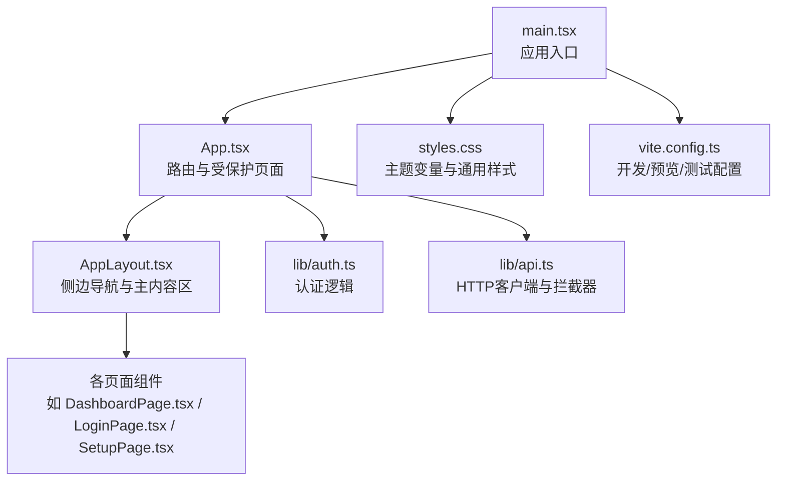
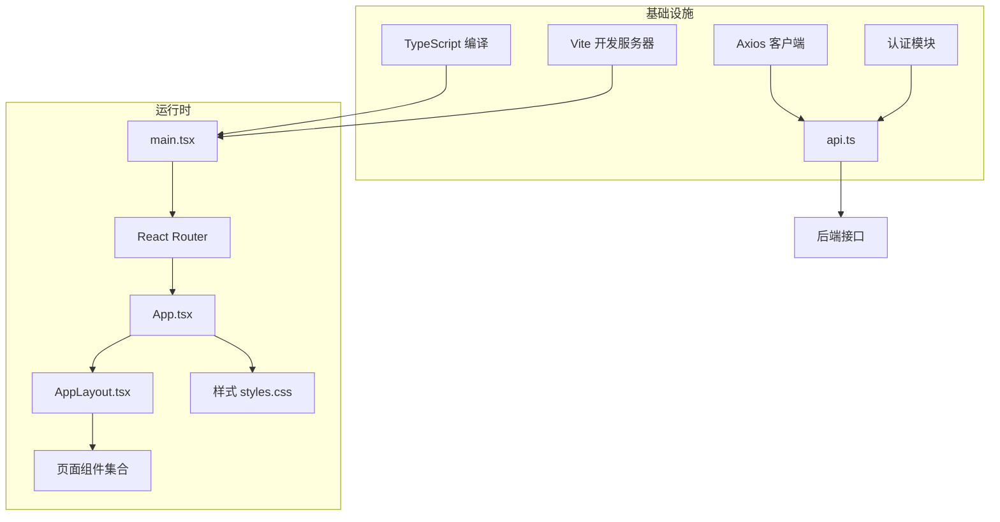
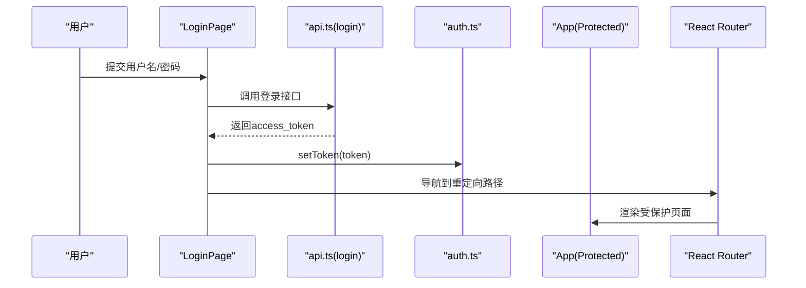
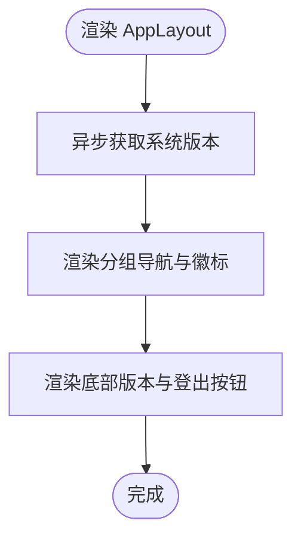
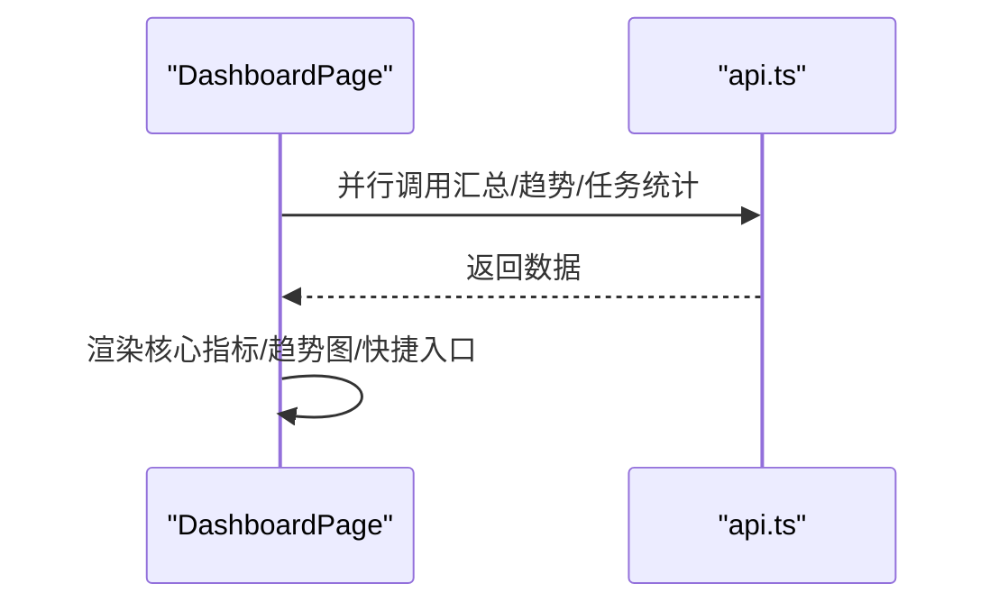
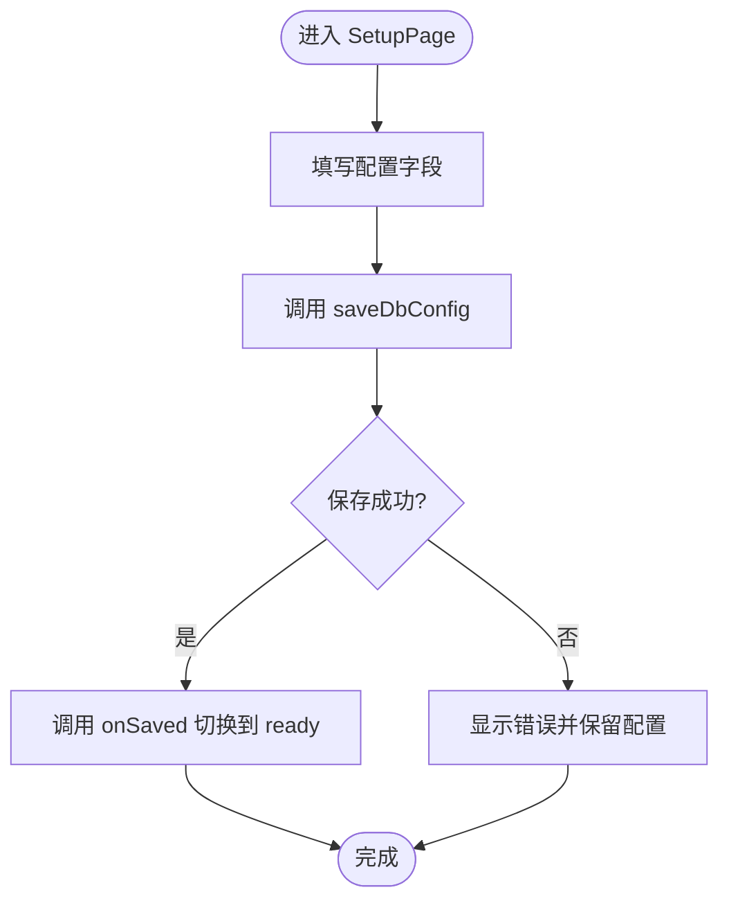
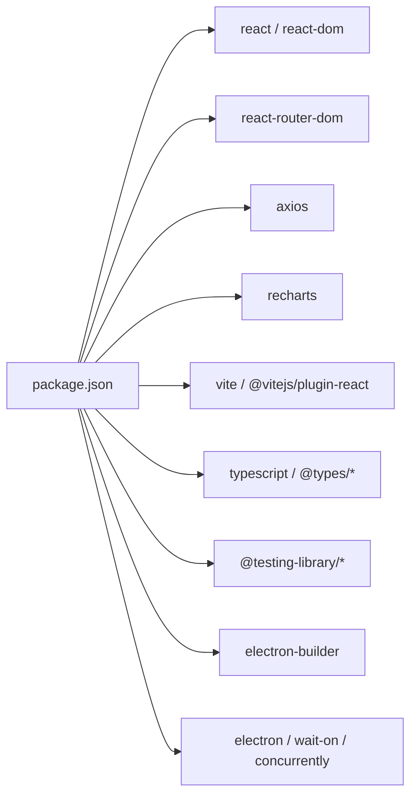

# 界面定制

<cite>
**本文引用的文件**   
- [desktop/package.json](file://desktop/package.json)
- [desktop/vite.config.ts](file://desktop/vite.config.ts)
- [desktop/src/App.tsx](file://desktop/src/App.tsx)
- [desktop/src/main.tsx](file://desktop/src/main.tsx)
- [desktop/src/components/AppLayout.tsx](file://desktop/src/components/AppLayout.tsx)
- [desktop/src/pages/LoginPage.tsx](file://desktop/src/pages/LoginPage.tsx)
- [desktop/src/lib/auth.ts](file://desktop/src/lib/auth.ts)
- [desktop/src/styles.css](file://desktop/src/styles.css)
- [desktop/src/types.ts](file://desktop/src/types.ts)
- [desktop/src/pages/dashboard/DashboardPage.tsx](file://desktop/src/pages/dashboard/DashboardPage.tsx)
- [desktop/src/pages/SetupPage.tsx](file://desktop/src/pages/SetupPage.tsx)
- [desktop/src/lib/api.ts](file://desktop/src/lib/api.ts)
- [desktop/src/pages/PublishPage.test.tsx](file://desktop/src/pages/PublishPage.test.tsx)
- [desktop/src/test/setup.ts](file://desktop/src/test/setup.ts)
- [desktop/tsconfig.json](file://desktop/tsconfig.json)
</cite>

## 目录
1. [简介](#简介)
2. [项目结构](#项目结构)
3. [核心组件](#核心组件)
4. [架构总览](#架构总览)
5. [组件详解](#组件详解)
6. [依赖关系分析](#依赖关系分析)
7. [性能考量](#性能考量)
8. [故障排查指南](#故障排查指南)
9. [结论](#结论)
10. [附录](#附录)

## 简介
本文件面向“智获客”桌面端前端界面的定制开发，围绕React组件扩展与自定义、页面布局与主题样式、交互行为定制、状态管理与数据流、组件库二次开发与复用模式、响应式设计与无障碍访问、性能优化与用户体验最佳实践等方面进行系统化说明。目标是帮助开发者在现有代码基础上高效扩展界面功能，保持一致的视觉与交互体验，并确保可维护性与可测试性。

## 项目结构
桌面端采用Vite + React 18 + TypeScript构建，使用React Router进行路由控制，Axios封装API请求，Electron作为宿主环境支持本地化部署与配置流程。核心目录与职责如下：
- desktop/src：源码根目录
  - components：可复用UI容器与布局组件（如AppLayout）
  - pages：页面级组件（如DashboardPage、LoginPage、SetupPage等）
  - lib：认证与API封装（auth.ts、api.ts）
  - types.ts：全局类型定义
  - styles.css：全局样式与主题变量
  - main.tsx：应用入口
- desktop/package.json：依赖与脚本
- desktop/vite.config.ts：开发服务器与测试配置
- desktop/tsconfig.json：TypeScript编译选项

图表来源
- [desktop/src/main.tsx:1-14](file://desktop/src/main.tsx#L1-L14)
- [desktop/src/App.tsx:1-163](file://desktop/src/App.tsx#L1-L163)
- [desktop/src/components/AppLayout.tsx:1-108](file://desktop/src/components/AppLayout.tsx#L1-L108)
- [desktop/src/lib/auth.ts:1-38](file://desktop/src/lib/auth.ts#L1-L38)
- [desktop/src/lib/api.ts:1-604](file://desktop/src/lib/api.ts#L1-L604)
- [desktop/src/styles.css:1-666](file://desktop/src/styles.css#L1-L666)
- [desktop/vite.config.ts:1-23](file://desktop/vite.config.ts#L1-L23)

章节来源
- [desktop/src/main.tsx:1-14](file://desktop/src/main.tsx#L1-L14)
- [desktop/src/App.tsx:1-163](file://desktop/src/App.tsx#L1-L163)
- [desktop/package.json:1-77](file://desktop/package.json#L1-L77)
- [desktop/vite.config.ts:1-23](file://desktop/vite.config.ts#L1-L23)
- [desktop/tsconfig.json:1-19](file://desktop/tsconfig.json#L1-L19)

## 核心组件
- 应用入口与路由
  - main.tsx：在BrowserRouter包裹下渲染App，挂载根节点
  - App.tsx：集中处理登录态校验、受保护路由、Electron启动流程与页面切换
- 布局与导航
  - AppLayout.tsx：左侧分组导航、品牌信息、版本信息展示、登出按钮
- 认证与会话
  - auth.ts：Token存储/清除、重定向路径缓存、登出事件派发
  - api.ts：Axios实例、请求/响应拦截器（自动注入Authorization、401处理）
- 页面示例
  - LoginPage.tsx：登录表单与错误提示
  - DashboardPage.tsx：看板数据聚合、趋势图、快捷入口与工作流概览
  - SetupPage.tsx：首次启动配置（数据库与后端端口），与Electron桥接
- 样式与主题
  - styles.css：CSS变量主题、网格布局、卡片与表格、动画与媒体查询

章节来源
- [desktop/src/main.tsx:1-14](file://desktop/src/main.tsx#L1-L14)
- [desktop/src/App.tsx:1-163](file://desktop/src/App.tsx#L1-L163)
- [desktop/src/components/AppLayout.tsx:1-108](file://desktop/src/components/AppLayout.tsx#L1-L108)
- [desktop/src/lib/auth.ts:1-38](file://desktop/src/lib/auth.ts#L1-L38)
- [desktop/src/lib/api.ts:1-604](file://desktop/src/lib/api.ts#L1-L604)
- [desktop/src/pages/LoginPage.tsx:1-69](file://desktop/src/pages/LoginPage.tsx#L1-L69)
- [desktop/src/pages/dashboard/DashboardPage.tsx:1-217](file://desktop/src/pages/dashboard/DashboardPage.tsx#L1-L217)
- [desktop/src/pages/SetupPage.tsx:1-198](file://desktop/src/pages/SetupPage.tsx#L1-L198)
- [desktop/src/styles.css:1-666](file://desktop/src/styles.css#L1-L666)

## 架构总览
应用采用“入口 -> 路由 -> 布局 -> 页面”的分层结构；认证与API通过独立模块解耦，便于扩展与替换。

图表来源
- [desktop/src/main.tsx:1-14](file://desktop/src/main.tsx#L1-L14)
- [desktop/src/App.tsx:1-163](file://desktop/src/App.tsx#L1-L163)
- [desktop/src/components/AppLayout.tsx:1-108](file://desktop/src/components/AppLayout.tsx#L1-L108)
- [desktop/src/lib/api.ts:1-604](file://desktop/src/lib/api.ts#L1-L604)
- [desktop/src/lib/auth.ts:1-38](file://desktop/src/lib/auth.ts#L1-L38)
- [desktop/vite.config.ts:1-23](file://desktop/vite.config.ts#L1-L23)
- [desktop/tsconfig.json:1-19](file://desktop/tsconfig.json#L1-L19)

## 组件详解

### 登录与受保护路由
- 登录流程
  - LoginPage.tsx：表单收集用户名/密码，调用api.ts中的login，成功后设置Token并跳转到重定向路径
  - App.tsx：Protected高阶组件在未登录时拦截并保存当前路径，统一跳转至/login
- 认证与会话
  - auth.ts：Token持久化、登出事件派发、重定向路径消费
  - api.ts：请求拦截器自动附加Authorization头；响应拦截器处理401并触发登出

图表来源
- [desktop/src/pages/LoginPage.tsx:1-69](file://desktop/src/pages/LoginPage.tsx#L1-L69)
- [desktop/src/lib/api.ts:40-43](file://desktop/src/lib/api.ts#L40-L43)
- [desktop/src/lib/auth.ts:1-38](file://desktop/src/lib/auth.ts#L1-L38)
- [desktop/src/App.tsx:38-46](file://desktop/src/App.tsx#L38-L46)

章节来源
- [desktop/src/pages/LoginPage.tsx:1-69](file://desktop/src/pages/LoginPage.tsx#L1-L69)
- [desktop/src/lib/auth.ts:1-38](file://desktop/src/lib/auth.ts#L1-L38)
- [desktop/src/lib/api.ts:1-604](file://desktop/src/lib/api.ts#L1-L604)
- [desktop/src/App.tsx:38-46](file://desktop/src/App.tsx#L38-L46)

### 布局与导航定制
- 导航分组与徽标
  - AppLayout.tsx定义navGroups，支持图标、标签与badge，便于快速扩展新菜单项
- 版本信息与登出
  - 通过getSystemVersion异步加载版本信息；点击登出触发onLogout回调
- 主题与间距
  - styles.css提供--brand、--brand-2、--radius等变量，统一卡片圆角、按钮渐变与阴影

图表来源
- [desktop/src/components/AppLayout.tsx:1-108](file://desktop/src/components/AppLayout.tsx#L1-L108)
- [desktop/src/lib/api.ts:471-474](file://desktop/src/lib/api.ts#L471-L474)

章节来源
- [desktop/src/components/AppLayout.tsx:1-108](file://desktop/src/components/AppLayout.tsx#L1-L108)
- [desktop/src/styles.css:1-666](file://desktop/src/styles.css#L1-L666)

### 页面定制：看板与趋势
- DashboardPage.tsx
  - 并行拉取看板汇总、趋势与任务统计，错误统一提示
  - 使用Recharts绘制趋势折线图，支持ResponsiveContainer自适应
  - 提供“升级横幅”“工作流线路图”“快捷入口”等业务组件，便于按需增删

图表来源
- [desktop/src/pages/dashboard/DashboardPage.tsx:1-217](file://desktop/src/pages/dashboard/DashboardPage.tsx#L1-L217)
- [desktop/src/lib/api.ts:67-75](file://desktop/src/lib/api.ts#L67-L75)
- [desktop/src/lib/api.ts:341-344](file://desktop/src/lib/api.ts#L341-L344)

章节来源
- [desktop/src/pages/dashboard/DashboardPage.tsx:1-217](file://desktop/src/pages/dashboard/DashboardPage.tsx#L1-L217)
- [desktop/src/lib/api.ts:1-604](file://desktop/src/lib/api.ts#L1-L604)

### 首次启动配置（Electron）
- SetupPage.tsx
  - 支持配置数据库主机/端口/用户/密码/库名/密钥/后端端口
  - 通过window.desktop.saveDbConfig写入配置并校验连通性
  - 成功后调用onSaved，App.tsx根据后端状态决定进入setup还是ready

图表来源
- [desktop/src/pages/SetupPage.tsx:1-198](file://desktop/src/pages/SetupPage.tsx#L1-L198)
- [desktop/src/App.tsx:76-97](file://desktop/src/App.tsx#L76-L97)

章节来源
- [desktop/src/pages/SetupPage.tsx:1-198](file://desktop/src/pages/SetupPage.tsx#L1-L198)
- [desktop/src/App.tsx:71-124](file://desktop/src/App.tsx#L71-L124)

### 样式与主题定制策略
- 主题变量
  - styles.css在:root定义颜色与圆角变量，页面通过var(--brand)等引用，便于整体换肤
- 组件化样式
  - 卡片、表格、按钮、徽标、入口卡片、工作流步骤等均以独立类名组织，便于局部修改
- 响应式
  - 在980px与620px断点下调整网格列数、边距与布局，保证移动端可用

章节来源
- [desktop/src/styles.css:1-666](file://desktop/src/styles.css#L1-L666)

### 交互行为定制方法
- 导航高亮：NavLink的active类名由路由状态驱动，可结合badge实现“新功能”提示
- 点击跳转：DashboardPage的工作流步骤通过onClick导航到对应页面，便于扩展业务流程
- 表单提交：LoginPage的handleSubmit统一处理加载态与错误提示，可复用到其他表单

章节来源
- [desktop/src/components/AppLayout.tsx:70-101](file://desktop/src/components/AppLayout.tsx#L70-L101)
- [desktop/src/pages/dashboard/DashboardPage.tsx:90-139](file://desktop/src/pages/dashboard/DashboardPage.tsx#L90-L139)
- [desktop/src/pages/LoginPage.tsx:14-33](file://desktop/src/pages/LoginPage.tsx#L14-L33)

### 状态管理与数据流定制
- 当前实现
  - 页面内使用useState/useEffect管理本地状态（如DashboardPage的summary/taskStats/trend）
  - API封装在lib/api.ts，统一拦截器处理鉴权与异常
- 扩展建议
  - 大型页面可引入轻量状态库（如Valtio/Zustand）或Redux Toolkit，将共享状态（如用户信息、筛选条件、全局通知）集中管理
  - 将API调用抽象为异步切片（thunks或async thunks），配合Suspense/错误边界提升稳定性

章节来源
- [desktop/src/pages/dashboard/DashboardPage.tsx:44-71](file://desktop/src/pages/dashboard/DashboardPage.tsx#L44-L71)
- [desktop/src/lib/api.ts:1-604](file://desktop/src/lib/api.ts#L1-L604)

### 组件库二次开发与复用模式
- 可复用小组件
  - InsightPage.tsx中Tag、MetricBadge等小组件展示了“传入文本/颜色/数值”的通用模式，适合抽取为独立组件
- 复用策略
  - 将通用UI（按钮、输入框、徽标、状态点）收敛到styles.css与少量工具函数，避免重复样式
  - 对复杂页面（如Dashboard）拆分为多个子组件（指标卡、趋势图、列表等），提升可测试性与可维护性

章节来源
- [desktop/src/styles.css:200-272](file://desktop/src/styles.css#L200-L272)
- [desktop/src/pages/dashboard/DashboardPage.tsx:152-211](file://desktop/src/pages/dashboard/DashboardPage.tsx#L152-L211)

### 响应式设计与无障碍访问
- 响应式
  - 在980px与620px断点下调整网格列数与边距，确保在平板与手机上仍具可用性
- 无障碍
  - 建议为按钮与链接提供明确的aria-label；表单控件绑定label；为图片与图标提供alt或替代文本
  - 保持键盘可访问性（Tab顺序合理、焦点可见）

章节来源
- [desktop/src/styles.css:274-301](file://desktop/src/styles.css#L274-L301)

### 性能优化与用户体验
- 图表性能
  - Recharts默认启用ResponsiveContainer，建议在大数据集时考虑虚拟化或采样
- 网络与错误
  - Axios超时与401拦截已在api.ts中处理；建议增加重试与离线提示
- 加载体验
  - DashboardPage对错误进行统一提示；可引入骨架屏或占位符提升感知速度

章节来源
- [desktop/src/lib/api.ts:16-38](file://desktop/src/lib/api.ts#L16-L38)
- [desktop/src/pages/dashboard/DashboardPage.tsx:141-149](file://desktop/src/pages/dashboard/DashboardPage.tsx#L141-L149)

## 依赖关系分析
- 运行时依赖
  - React、React DOM、React Router DOM、Axios、Recharts
- 开发依赖
  - Vite、TypeScript、Testing Library（Jest DOM、React、User Event）、Electron、Wait-On、Concurrently
- 构建与打包
  - Vite负责开发/预览/测试；Electron Builder用于打包Windows安装包

图表来源
- [desktop/package.json:1-77](file://desktop/package.json#L1-L77)

章节来源
- [desktop/package.json:1-77](file://desktop/package.json#L1-L77)
- [desktop/vite.config.ts:1-23](file://desktop/vite.config.ts#L1-L23)
- [desktop/tsconfig.json:1-19](file://desktop/tsconfig.json#L1-L19)

## 性能考量
- 资源加载
  - 仅在需要时加载第三方图表库；对静态资源使用CDN或内联关键CSS
- 状态与渲染
  - 将昂贵计算放入useMemo/useCallback；避免不必要的重渲染
- 网络
  - 合理设置超时与重试；对高频请求做节流/防抖
- 测试
  - 使用Vitest与Testing Library进行单元与集成测试，保障变更质量

## 故障排查指南
- 登录失败
  - 检查api.ts中的login调用与后端返回；确认auth.ts中setToken与重定向路径
- 401未授权
  - 查看api.ts拦截器是否正确附加Authorization头；确认clearToken是否被触发
- Electron启动问题
  - 确认桌面配置流程（SetupPage）保存成功；检查App.tsx中checkBackend与applyRuntimeApiBaseUrl
- 样式异常
  - 检查styles.css中变量覆盖与媒体查询断点；确认类名拼写与作用域

章节来源
- [desktop/src/lib/api.ts:16-38](file://desktop/src/lib/api.ts#L16-L38)
- [desktop/src/lib/auth.ts:13-18](file://desktop/src/lib/auth.ts#L13-L18)
- [desktop/src/pages/SetupPage.tsx:61-76](file://desktop/src/pages/SetupPage.tsx#L61-L76)
- [desktop/src/App.tsx:76-97](file://desktop/src/App.tsx#L76-L97)
- [desktop/src/styles.css:1-666](file://desktop/src/styles.css#L1-L666)

## 结论
通过对AppLayout、LoginPage、DashboardPage、SetupPage以及auth与api模块的系统化梳理，可以基于现有代码高效扩展界面功能。建议在保持样式变量与组件化结构的前提下，逐步引入状态管理与测试体系，完善响应式与无障碍能力，并持续优化网络与渲染性能，以获得稳定、可维护且优秀的用户体验。

## 附录
- 类型定义
  - types.ts提供了DashboardSummary、TrendItem、CollectItem、InboxItem、PublishTask等核心数据模型，便于在页面与API之间传递与校验
- 测试示例
  - PublishPage.test.tsx展示了如何mock api模块并验证渲染与交互行为

章节来源
- [desktop/src/types.ts:1-329](file://desktop/src/types.ts#L1-L329)
- [desktop/src/pages/PublishPage.test.tsx:1-97](file://desktop/src/pages/PublishPage.test.tsx#L1-L97)
- [desktop/src/test/setup.ts:1-3](file://desktop/src/test/setup.ts#L1-L3)