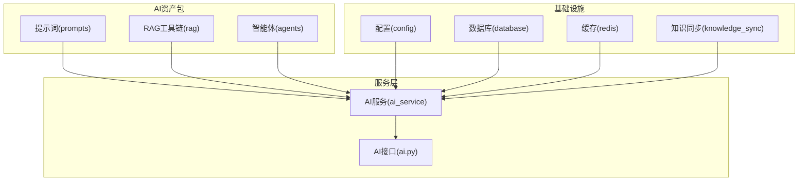
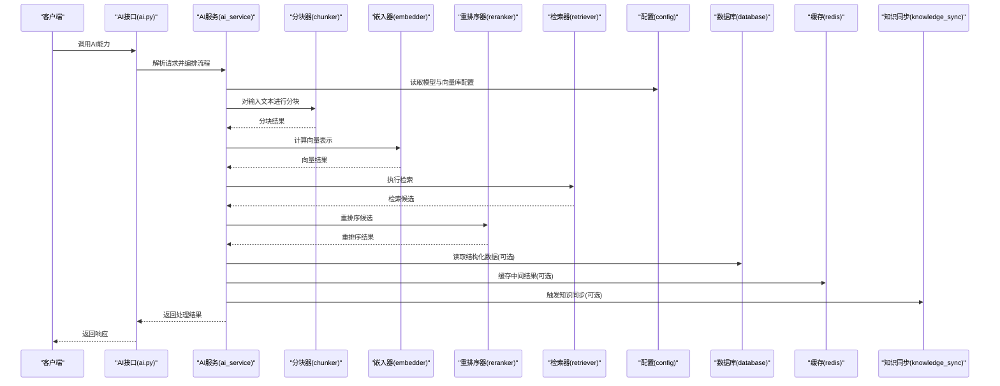
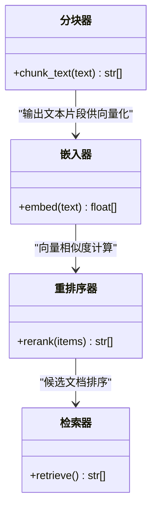
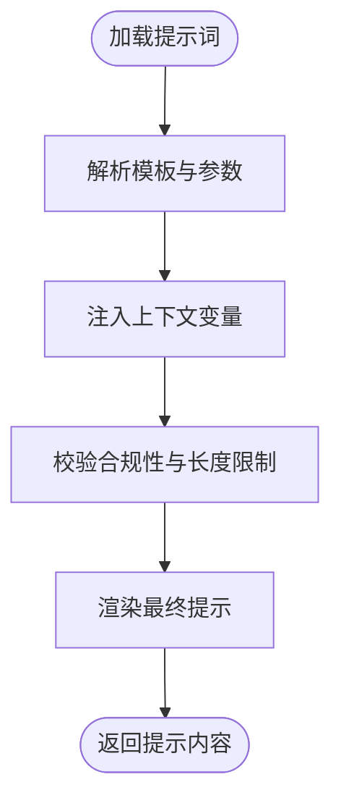
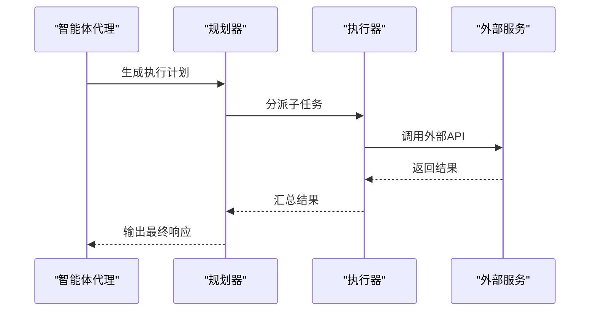
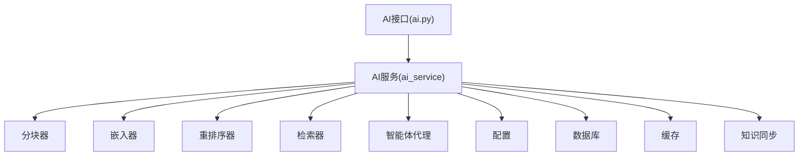
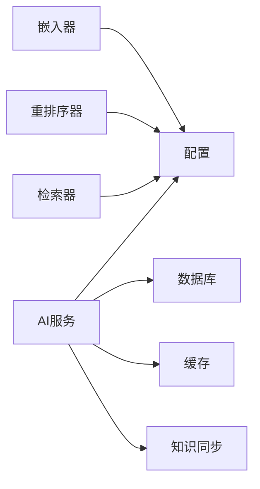

# 自定义AI模型

<cite>
**本文引用的文件**
- [backend/app/ai/rag/embedder.py](file://backend/app/ai/rag/embedder.py)
- [backend/app/ai/rag/reranker.py](file://backend/app/ai/rag/reranker.py)
- [backend/app/ai/rag/retriever.py](file://backend/app/ai/rag/retriever.py)
- [backend/app/ai/rag/chunker.py](file://backend/app/ai/rag/chunker.py)
- [backend/app/ai/prompts/compliance_review_v1.txt](file://backend/app/ai/prompts/compliance_review_v1.txt)
- [backend/app/ai/prompts/followup_assistant_v1.txt](file://backend/app/ai/prompts/followup_assistant_v1.txt)
- [backend/app/ai/prompts/material_analyze_v1.txt](file://backend/app/ai/prompts/material_analyze_v1.txt)
- [backend/app/ai/prompts/rewrite_douyin_v1.txt](file://backend/app/ai/prompts/rewrite_douyin_v1.txt)
- [backend/app/ai/prompts/rewrite_xhs_v1.txt](file://backend/app/ai/prompts/rewrite_xhs_v1.txt)
- [backend/app/ai/agents/compliance_agent.py](file://backend/app/ai/agents/compliance_agent.py)
- [backend/app/ai/agents/followup_agent.py](file://backend/app/ai/agents/followup_agent.py)
- [backend/app/ai/agents/lead_triage_agent.py](file://backend/app/ai/agents/lead_triage_agent.py)
- [backend/app/ai/agents/material_agent.py](file://backend/app/ai/agents/material_agent.py)
- [backend/app/ai/agents/rewrite_agent.py](file://backend/app/ai/agents/rewrite_agent.py)
- [backend/app/ai/__init__.py](file://backend/app/ai/__init__.py)
- [backend/app/services/ai_service.py](file://backend/app/services/ai_service.py)
- [backend/app/api/endpoints/ai.py](file://backend/app/api/endpoints/ai.py)
- [backend/app/main.py](file://backend/app/main.py)
- [backend/README.md](file://backend/README.md)
- [backend/pyproject.toml](file://backend/pyproject.toml)
- [backend/requirements.txt](file://backend/requirements.txt)
- [backend/app/core/config.py](file://backend/app/core/config.py)
- [backend/app/core/database.py](file://backend/app/core/database.py)
- [backend/app/core/redis.py](file://backend/app/core/redis.py)
- [backend/app/tasks/ai_tasks.py](file://backend/app/tasks/ai_tasks.py)
- [backend/app/workers/ai_workers.py](file://backend/app/workers/ai_workers.py)
- [backend/app/integrations/volcengine/knowledge_api.py](file://backend/app/integrations/volcengine/knowledge_api.py)
- [backend/app/integrations/volcengine/endpoint_manager.py](file://backend/app/integrations/volcengine/endpoint_manager.py)
- [backend/app/rules/sync/knowledge_sync.py](file://backend/app/rules/sync/knowledge_sync.py)
- [backend/docs/architecture/ai-architecture.md](file://backend/docs/architecture/ai-architecture.md)
</cite>

## 目录
1. [简介](#简介)
2. [项目结构](#项目结构)
3. [核心组件](#核心组件)
4. [架构总览](#架构总览)
5. [详细组件分析](#详细组件分析)
6. [依赖分析](#依赖分析)
7. [性能考虑](#性能考虑)
8. [故障排查指南](#故障排查指南)
9. [结论](#结论)
10. [附录](#附录)

## 简介
本文件面向“智获客”项目中自定义AI模型的开发与集成，重点覆盖以下方面：
- RAG（检索增强生成）系统的扩展方法与向量化存储策略
- 提示词工程与模型微调的实现流程
- 嵌入器、重排序器、检索器的自定义开发方法
- 本地模型与云端模型的集成策略
- 模型性能评估与A/B测试方法
- 模型版本管理与热更新机制

当前仓库中的AI相关模块仍处于骨架阶段，核心能力以占位函数形式存在。本文在不改变现有实现的前提下，提供可扩展的设计蓝图与最佳实践，帮助团队在保持兼容的同时逐步完善AI能力。

## 项目结构
AI相关代码主要集中在后端应用的AI资产包中，包括提示词、RAG工具链、智能体代理等。整体组织采用按功能分层的方式：
- 提示词：位于 prompts 目录，按业务场景分类
- RAG工具链：位于 rag 目录，包含分块、嵌入、重排序、检索等组件
- 智能体：位于 agents 目录，按业务角色划分
- 集成与配置：位于 core、integrations、rules 等目录
- 接口与服务：位于 api、services 层，对外提供能力

**图表来源**
- [backend/app/ai/prompts/compliance_review_v1.txt:1-1](file://backend/app/ai/prompts/compliance_review_v1.txt#L1-L1)
- [backend/app/ai/rag/chunker.py:1-3](file://backend/app/ai/rag/chunker.py#L1-L3)
- [backend/app/ai/rag/embedder.py:1-3](file://backend/app/ai/rag/embedder.py#L1-L3)
- [backend/app/ai/rag/reranker.py:1-3](file://backend/app/ai/rag/reranker.py#L1-L3)
- [backend/app/ai/rag/retriever.py:1-3](file://backend/app/ai/rag/retriever.py#L1-L3)
- [backend/app/ai/agents/compliance_agent.py:1-3](file://backend/app/ai/agents/compliance_agent.py#L1-L3)
- [backend/app/services/ai_service.py](file://backend/app/services/ai_service.py)
- [backend/app/api/endpoints/ai.py](file://backend/app/api/endpoints/ai.py)
- [backend/app/core/config.py](file://backend/app/core/config.py)
- [backend/app/core/database.py](file://backend/app/core/database.py)
- [backend/app/core/redis.py](file://backend/app/core/redis.py)
- [backend/app/rules/sync/knowledge_sync.py](file://backend/app/rules/sync/knowledge_sync.py)

**章节来源**
- [backend/app/ai/__init__.py:1-2](file://backend/app/ai/__init__.py#L1-L2)
- [backend/README.md](file://backend/README.md)

## 核心组件
本节概述当前AI资产包中的核心组件及其职责：
- 提示词：按业务场景提供标准化提示模板，便于统一风格与合规性
- RAG工具链：提供文本分块、向量化嵌入、重排序与检索的占位实现，为后续接入具体模型与向量库做准备
- 智能体：按角色划分的代理函数，用于编排不同业务流程

当前实现均为占位函数，返回固定字符串或空列表，实际逻辑需在后续迭代中补充。

**章节来源**
- [backend/app/ai/prompts/compliance_review_v1.txt:1-1](file://backend/app/ai/prompts/compliance_review_v1.txt#L1-L1)
- [backend/app/ai/prompts/followup_assistant_v1.txt:1-1](file://backend/app/ai/prompts/followup_assistant_v1.txt#L1-L1)
- [backend/app/ai/prompts/material_analyze_v1.txt:1-1](file://backend/app/ai/prompts/material_analyze_v1.txt#L1-L1)
- [backend/app/ai/prompts/rewrite_douyin_v1.txt:1-1](file://backend/app/ai/prompts/rewrite_douyin_v1.txt#L1-L1)
- [backend/app/ai/prompts/rewrite_xhs_v1.txt:1-1](file://backend/app/ai/prompts/rewrite_xhs_v1.txt#L1-L1)
- [backend/app/ai/rag/chunker.py:1-3](file://backend/app/ai/rag/chunker.py#L1-L3)
- [backend/app/ai/rag/embedder.py:1-3](file://backend/app/ai/rag/embedder.py#L1-L3)
- [backend/app/ai/rag/reranker.py:1-3](file://backend/app/ai/rag/reranker.py#L1-L3)
- [backend/app/ai/rag/retriever.py:1-3](file://backend/app/ai/rag/retriever.py#L1-L3)
- [backend/app/ai/agents/compliance_agent.py:1-3](file://backend/app/ai/agents/compliance_agent.py#L1-L3)
- [backend/app/ai/agents/followup_agent.py:1-3](file://backend/app/ai/agents/followup_agent.py#L1-L3)
- [backend/app/ai/agents/lead_triage_agent.py:1-3](file://backend/app/ai/agents/lead_triage_agent.py#L1-L3)
- [backend/app/ai/agents/material_agent.py:1-3](file://backend/app/ai/agents/material_agent.py#L1-L3)
- [backend/app/ai/agents/rewrite_agent.py:1-3](file://backend/app/ai/agents/rewrite_agent.py#L1-L3)

## 架构总览
下图展示了从接口到服务再到RAG与智能体的整体调用路径，以及与配置、数据库、缓存和知识同步的交互关系。

**图表来源**
- [backend/app/api/endpoints/ai.py](file://backend/app/api/endpoints/ai.py)
- [backend/app/services/ai_service.py](file://backend/app/services/ai_service.py)
- [backend/app/ai/rag/chunker.py:1-3](file://backend/app/ai/rag/chunker.py#L1-L3)
- [backend/app/ai/rag/embedder.py:1-3](file://backend/app/ai/rag/embedder.py#L1-L3)
- [backend/app/ai/rag/reranker.py:1-3](file://backend/app/ai/rag/reranker.py#L1-L3)
- [backend/app/ai/rag/retriever.py:1-3](file://backend/app/ai/rag/retriever.py#L1-L3)
- [backend/app/core/config.py](file://backend/app/core/config.py)
- [backend/app/core/database.py](file://backend/app/core/database.py)
- [backend/app/core/redis.py](file://backend/app/core/redis.py)
- [backend/app/rules/sync/knowledge_sync.py](file://backend/app/rules/sync/knowledge_sync.py)

## 详细组件分析

### RAG工具链组件
RAG工具链包含四个核心组件：分块器、嵌入器、重排序器与检索器。当前实现为占位函数，后续应替换为实际的算法与外部服务调用。

**图表来源**
- [backend/app/ai/rag/chunker.py:1-3](file://backend/app/ai/rag/chunker.py#L1-L3)
- [backend/app/ai/rag/embedder.py:1-3](file://backend/app/ai/rag/embedder.py#L1-L3)
- [backend/app/ai/rag/reranker.py:1-3](file://backend/app/ai/rag/reranker.py#L1-L3)
- [backend/app/ai/rag/retriever.py:1-3](file://backend/app/ai/rag/retriever.py#L1-L3)

**章节来源**
- [backend/app/ai/rag/chunker.py:1-3](file://backend/app/ai/rag/chunker.py#L1-L3)
- [backend/app/ai/rag/embedder.py:1-3](file://backend/app/ai/rag/embedder.py#L1-L3)
- [backend/app/ai/rag/reranker.py:1-3](file://backend/app/ai/rag/reranker.py#L1-L3)
- [backend/app/ai/rag/retriever.py:1-3](file://backend/app/ai/rag/retriever.py#L1-L3)

### 提示词工程
提示词按业务场景分类存放，当前每个文件仅包含一行提示内容。建议后续引入模板引擎与参数化机制，支持动态注入上下文信息，并建立版本控制与A/B测试能力。

**图表来源**
- [backend/app/ai/prompts/compliance_review_v1.txt:1-1](file://backend/app/ai/prompts/compliance_review_v1.txt#L1-L1)
- [backend/app/ai/prompts/followup_assistant_v1.txt:1-1](file://backend/app/ai/prompts/followup_assistant_v1.txt#L1-L1)
- [backend/app/ai/prompts/material_analyze_v1.txt:1-1](file://backend/app/ai/prompts/material_analyze_v1.txt#L1-L1)
- [backend/app/ai/prompts/rewrite_douyin_v1.txt:1-1](file://backend/app/ai/prompts/rewrite_douyin_v1.txt#L1-L1)
- [backend/app/ai/prompts/rewrite_xhs_v1.txt:1-1](file://backend/app/ai/prompts/rewrite_xhs_v1.txt#L1-L1)

**章节来源**
- [backend/app/ai/prompts/compliance_review_v1.txt:1-1](file://backend/app/ai/prompts/compliance_review_v1.txt#L1-L1)
- [backend/app/ai/prompts/followup_assistant_v1.txt:1-1](file://backend/app/ai/prompts/followup_assistant_v1.txt#L1-L1)
- [backend/app/ai/prompts/material_analyze_v1.txt:1-1](file://backend/app/ai/prompts/material_analyze_v1.txt#L1-L1)
- [backend/app/ai/prompts/rewrite_douyin_v1.txt:1-1](file://backend/app/ai/prompts/rewrite_douyin_v1.txt#L1-L1)
- [backend/app/ai/prompts/rewrite_xhs_v1.txt:1-1](file://backend/app/ai/prompts/rewrite_xhs_v1.txt#L1-L1)

### 智能体代理
智能体代理按业务角色划分，当前实现为占位函数。建议后续引入状态机或工作流编排，支持多轮对话、条件分支与外部API调用。

**图表来源**
- [backend/app/ai/agents/compliance_agent.py:1-3](file://backend/app/ai/agents/compliance_agent.py#L1-L3)
- [backend/app/ai/agents/followup_agent.py:1-3](file://backend/app/ai/agents/followup_agent.py#L1-L3)
- [backend/app/ai/agents/lead_triage_agent.py:1-3](file://backend/app/ai/agents/lead_triage_agent.py#L1-L3)
- [backend/app/ai/agents/material_agent.py:1-3](file://backend/app/ai/agents/material_agent.py#L1-L3)
- [backend/app/ai/agents/rewrite_agent.py:1-3](file://backend/app/ai/agents/rewrite_agent.py#L1-L3)

**章节来源**
- [backend/app/ai/agents/compliance_agent.py:1-3](file://backend/app/ai/agents/compliance_agent.py#L1-L3)
- [backend/app/ai/agents/followup_agent.py:1-3](file://backend/app/ai/agents/followup_agent.py#L1-L3)
- [backend/app/ai/agents/lead_triage_agent.py:1-3](file://backend/app/ai/agents/lead_triage_agent.py#L1-L3)
- [backend/app/ai/agents/material_agent.py:1-3](file://backend/app/ai/agents/material_agent.py#L1-L3)
- [backend/app/ai/agents/rewrite_agent.py:1-3](file://backend/app/ai/agents/rewrite_agent.py#L1-L3)

### 服务与接口层
服务层负责编排RAG与智能体流程，接口层提供对外访问入口。当前接口与服务文件为空或占位实现，后续需要补充具体逻辑与错误处理。

**图表来源**
- [backend/app/api/endpoints/ai.py](file://backend/app/api/endpoints/ai.py)
- [backend/app/services/ai_service.py](file://backend/app/services/ai_service.py)
- [backend/app/ai/rag/chunker.py:1-3](file://backend/app/ai/rag/chunker.py#L1-L3)
- [backend/app/ai/rag/embedder.py:1-3](file://backend/app/ai/rag/embedder.py#L1-L3)
- [backend/app/ai/rag/reranker.py:1-3](file://backend/app/ai/rag/reranker.py#L1-L3)
- [backend/app/ai/rag/retriever.py:1-3](file://backend/app/ai/rag/retriever.py#L1-L3)
- [backend/app/ai/agents/compliance_agent.py:1-3](file://backend/app/ai/agents/compliance_agent.py#L1-L3)
- [backend/app/core/config.py](file://backend/app/core/config.py)
- [backend/app/core/database.py](file://backend/app/core/database.py)
- [backend/app/core/redis.py](file://backend/app/core/redis.py)
- [backend/app/rules/sync/knowledge_sync.py](file://backend/app/rules/sync/knowledge_sync.py)

**章节来源**
- [backend/app/api/endpoints/ai.py](file://backend/app/api/endpoints/ai.py)
- [backend/app/services/ai_service.py](file://backend/app/services/ai_service.py)

## 依赖分析
AI模块的依赖关系相对简单，主要依赖于配置、数据库与缓存。当前未发现循环依赖，但建议在后续扩展中明确各组件的接口契约，避免紧耦合。

**图表来源**
- [backend/app/ai/rag/embedder.py:1-3](file://backend/app/ai/rag/embedder.py#L1-L3)
- [backend/app/ai/rag/reranker.py:1-3](file://backend/app/ai/rag/reranker.py#L1-L3)
- [backend/app/ai/rag/retriever.py:1-3](file://backend/app/ai/rag/retriever.py#L1-L3)
- [backend/app/services/ai_service.py](file://backend/app/services/ai_service.py)
- [backend/app/core/config.py](file://backend/app/core/config.py)
- [backend/app/core/database.py](file://backend/app/core/database.py)
- [backend/app/core/redis.py](file://backend/app/core/redis.py)
- [backend/app/rules/sync/knowledge_sync.py](file://backend/app/rules/sync/knowledge_sync.py)

**章节来源**
- [backend/app/core/config.py](file://backend/app/core/config.py)
- [backend/app/core/database.py](file://backend/app/core/database.py)
- [backend/app/core/redis.py](file://backend/app/core/redis.py)
- [backend/app/rules/sync/knowledge_sync.py](file://backend/app/rules/sync/knowledge_sync.py)

## 性能考虑
- 向量化与检索：优先使用批量向量化与向量库的近似最近邻搜索，减少查询延迟；对高频查询结果进行缓存
- 提示词渲染：对模板进行预编译与参数校验，避免运行时重复解析
- 智能体编排：采用异步任务与队列机制，避免阻塞主线程；对长耗时步骤设置超时与重试
- 数据一致性：通过事务与幂等设计保证知识同步与向量索引的一致性

## 故障排查指南
- 接口层：检查请求参数与权限校验，确保服务层正确捕获并转换异常
- 服务层：验证配置项是否正确加载，数据库连接与缓存可用性
- RAG组件：确认分块策略与嵌入维度匹配，重排序与检索返回格式一致
- 知识同步：监控同步任务状态与失败重试，必要时回滚至上一个稳定版本

**章节来源**
- [backend/app/api/endpoints/ai.py](file://backend/app/api/endpoints/ai.py)
- [backend/app/services/ai_service.py](file://backend/app/services/ai_service.py)
- [backend/app/core/config.py](file://backend/app/core/config.py)
- [backend/app/core/database.py](file://backend/app/core/database.py)
- [backend/app/core/redis.py](file://backend/app/core/redis.py)
- [backend/app/rules/sync/knowledge_sync.py](file://backend/app/rules/sync/knowledge_sync.py)

## 结论
当前AI模块处于基础骨架阶段，具备清晰的分层结构与可扩展接口。建议按照以下路线推进：
- 完善RAG工具链：替换占位函数为实际算法与外部服务调用
- 建立提示词工程体系：引入模板引擎、参数化与版本管理
- 设计智能体编排：采用工作流与状态机提升复杂任务处理能力
- 引入性能优化与可观测性：缓存、批量化、指标与日志
- 实施版本管理与A/B测试：灰度发布与回滚机制

## 附录
- 配置与环境：参考配置文件与依赖清单，确保模型与向量库的正确部署
- 架构文档：结合架构文档理解AI模块在整个系统中的定位与边界

**章节来源**
- [backend/README.md](file://backend/README.md)
- [backend/pyproject.toml](file://backend/pyproject.toml)
- [backend/requirements.txt](file://backend/requirements.txt)
- [backend/docs/architecture/ai-architecture.md](file://backend/docs/architecture/ai-architecture.md)