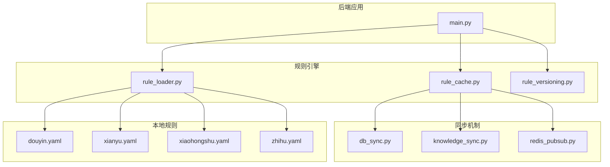
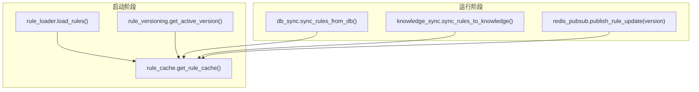
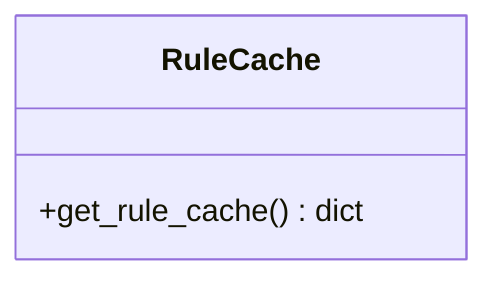
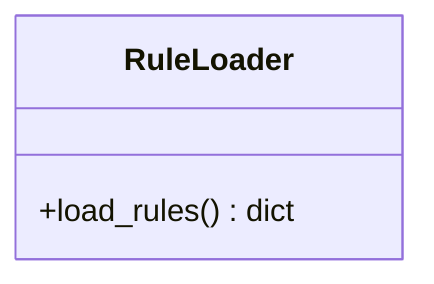
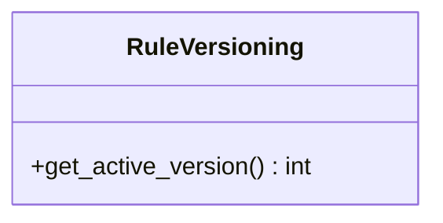
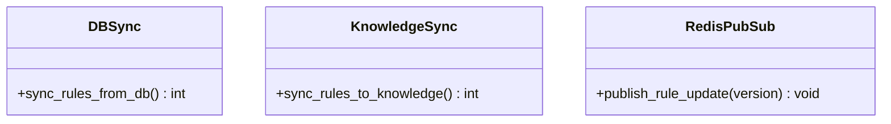
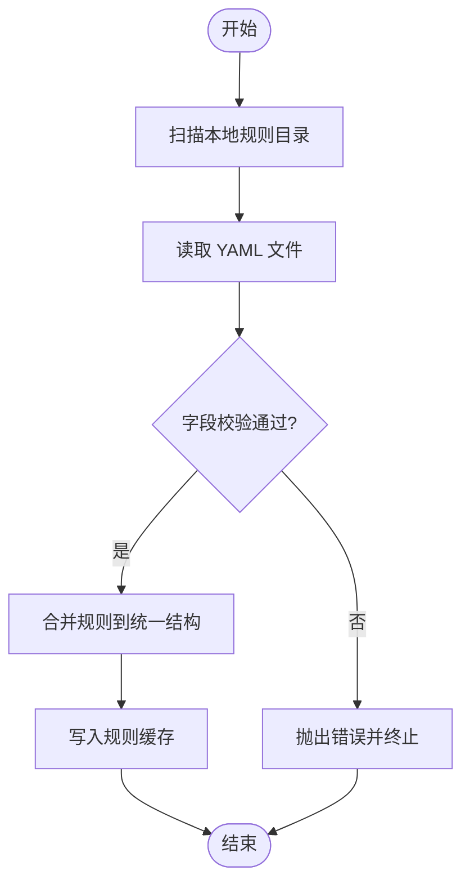
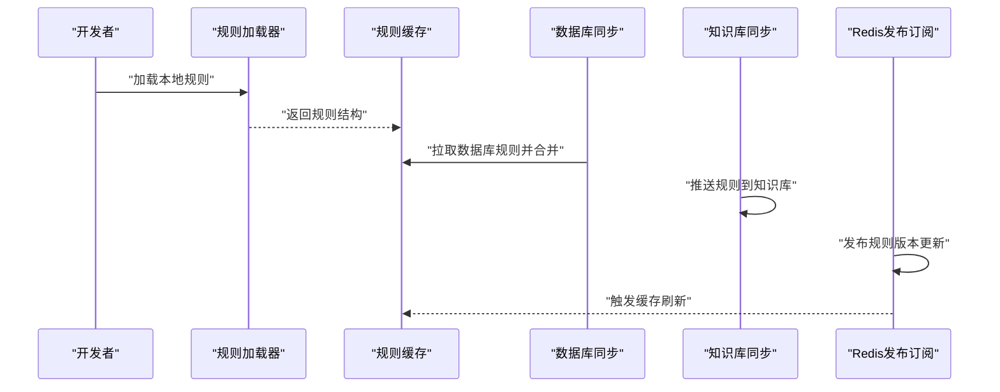
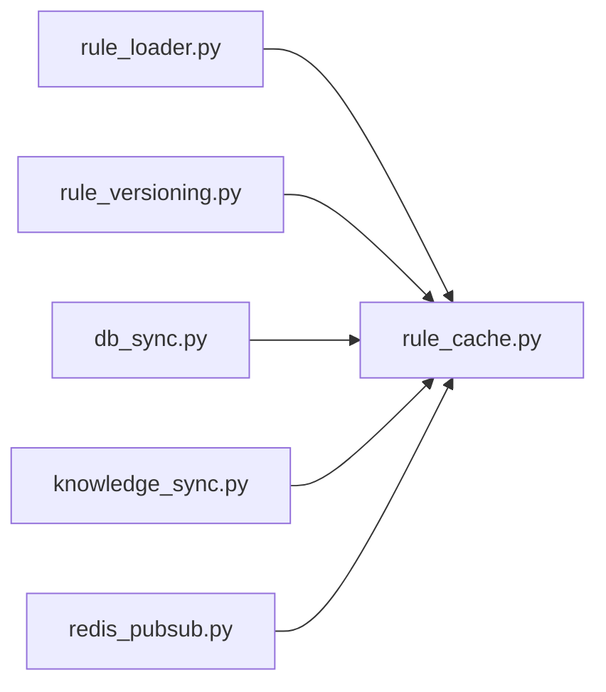

# 规则引擎扩展

<cite>
**本文引用的文件**
- [backend/app/main.py](file://backend/app/main.py)
- [backend/app/rule_cache.py](file://backend/app/rule_cache.py)
- [backend/app/rule_loader.py](file://backend/app/rule_loader.py)
- [backend/app/rule_versioning.py](file://backend/app/rule_versioning.py)
- [backend/app/sync/db_sync.py](file://backend/app/sync/db_sync.py)
- [backend/app/sync/knowledge_sync.py](file://backend/app/sync/knowledge_sync.py)
- [backend/app/sync/redis_pubsub.py](file://backend/app/sync/redis_pubsub.py)
- [backend/app/rules/local/douyin.yaml](file://backend/app/rules/local/douyin.yaml)
- [backend/app/rules/local/xianyu.yaml](file://backend/app/rules/local/xianyu.yaml)
- [backend/app/rules/local/xiaohongshu.yaml](file://backend/app/rules/local/xiaohongshu.yaml)
- [backend/app/rules/local/zhihu.yaml](file://backend/app/rules/local/zhihu.yaml)
- [scripts/sync_rules.py](file://scripts/sync_rules.py)
- [docs/operations/rule-update-guide.md](file://docs/operations/rule-update-guide.md)
</cite>

## 目录
1. [简介](#简介)
2. [项目结构](#项目结构)
3. [核心组件](#核心组件)
4. [架构总览](#架构总览)
5. [详细组件分析](#详细组件分析)
6. [依赖分析](#依赖分析)
7. [性能考虑](#性能考虑)
8. [故障排查指南](#故障排查指南)
9. [结论](#结论)
10. [附录](#附录)

## 简介
本文件面向“智获客规则引擎”的扩展开发者，系统性梳理动态规则加载机制、缓存策略、本地规则文件格式与加载流程、规则同步与版本管理、扩展点设计与自定义规则开发方法，并给出规则测试、验证与部署的完整流程，以及规则优先级、冲突处理与回滚机制的设计建议。

## 项目结构
规则引擎相关代码主要分布在以下位置：
- 后端应用入口与主程序：backend/app/main.py
- 动态规则模块：backend/app/rule_cache.py、backend/app/rule_loader.py、backend/app/rule_versioning.py
- 规则同步模块：backend/app/sync/db_sync.py、backend/app/sync/knowledge_sync.py、backend/app/sync/redis_pubsub.py
- 本地规则文件：backend/app/rules/local/*.yaml（抖音、闲鱼、小红书、知乎）
- 规则同步脚本：scripts/sync_rules.py
- 运维文档：docs/operations/rule-update-guide.md

**图示来源**
- [backend/app/main.py:1-4](file://backend/app/main.py#L1-L4)
- [backend/app/rule_cache.py:1-6](file://backend/app/rule_cache.py#L1-L6)
- [backend/app/rule_loader.py:1-3](file://backend/app/rule_loader.py#L1-L3)
- [backend/app/rule_versioning.py:1-3](file://backend/app/rule_versioning.py#L1-L3)
- [backend/app/sync/db_sync.py:1-3](file://backend/app/sync/db_sync.py#L1-L3)
- [backend/app/sync/knowledge_sync.py:1-3](file://backend/app/sync/knowledge_sync.py#L1-L3)
- [backend/app/sync/redis_pubsub.py:1-3](file://backend/app/sync/redis_pubsub.py#L1-L3)
- [backend/app/rules/local/douyin.yaml:1-4](file://backend/app/rules/local/douyin.yaml#L1-L4)
- [backend/app/rules/local/xianyu.yaml:1-4](file://backend/app/rules/local/xianyu.yaml#L1-L4)
- [backend/app/rules/local/xiaohongshu.yaml:1-4](file://backend/app/rules/local/xiaohongshu.yaml#L1-L4)
- [backend/app/rules/local/zhihu.yaml:1-4](file://backend/app/rules/local/zhihu.yaml#L1-L4)

**章节来源**
- [backend/app/main.py:1-4](file://backend/app/main.py#L1-L4)

## 核心组件
- 规则缓存：提供全局规则字典的访问接口，用于在内存中持有已加载的规则集合，避免重复IO与解析开销。
- 规则加载器：负责从本地规则文件或外部源加载规则，返回统一的数据结构供后续使用。
- 规则版本化：提供当前活动版本号的查询接口，支撑灰度与回滚策略。
- 同步模块：提供数据库同步、知识库同步与Redis发布订阅等能力，用于规则变更的分发与传播。
- 本地规则文件：以YAML格式描述平台维度的规则集合，包含版本号、平台标识与规则数组。

**章节来源**
- [backend/app/rule_cache.py:1-6](file://backend/app/rule_cache.py#L1-L6)
- [backend/app/rule_loader.py:1-3](file://backend/app/rule_loader.py#L1-L3)
- [backend/app/rule_versioning.py:1-3](file://backend/app/rule_versioning.py#L1-L3)
- [backend/app/sync/db_sync.py:1-3](file://backend/app/sync/db_sync.py#L1-L3)
- [backend/app/sync/knowledge_sync.py:1-3](file://backend/app/sync/knowledge_sync.py#L1-L3)
- [backend/app/sync/redis_pubsub.py:1-3](file://backend/app/sync/redis_pubsub.py#L1-L3)
- [backend/app/rules/local/douyin.yaml:1-4](file://backend/app/rules/local/douyin.yaml#L1-L4)
- [backend/app/rules/local/xianyu.yaml:1-4](file://backend/app/rules/local/xianyu.yaml#L1-L4)
- [backend/app/rules/local/xiaohongshu.yaml:1-4](file://backend/app/rules/local/xiaohongshu.yaml#L1-L4)
- [backend/app/rules/local/zhihu.yaml:1-4](file://backend/app/rules/local/zhihu.yaml#L1-L4)

## 架构总览
规则引擎采用“本地规则文件 + 内存缓存 + 多源同步”的架构。启动时由加载器读取本地YAML规则，构建内存缓存；运行期通过版本化接口控制生效版本；通过数据库同步、知识库同步与Redis发布订阅实现跨实例传播。

**图示来源**
- [backend/app/rule_loader.py:1-3](file://backend/app/rule_loader.py#L1-L3)
- [backend/app/rule_cache.py:1-6](file://backend/app/rule_cache.py#L1-L6)
- [backend/app/rule_versioning.py:1-3](file://backend/app/rule_versioning.py#L1-L3)
- [backend/app/sync/db_sync.py:1-3](file://backend/app/sync/db_sync.py#L1-L3)
- [backend/app/sync/knowledge_sync.py:1-3](file://backend/app/sync/knowledge_sync.py#L1-L3)
- [backend/app/sync/redis_pubsub.py:1-3](file://backend/app/sync/redis_pubsub.py#L1-L3)

## 详细组件分析

### 规则缓存（rule_cache.py）
- 职责：维护全局规则字典，提供只读访问接口。
- 设计要点：
  - 单例式全局字典，避免重复加载。
  - 与加载器配合，首次加载后可直接命中缓存。
  - 与同步模块协作，在收到新版本或外部变更时刷新缓存。
- 性能特性：O(1)读取，适合高频规则匹配场景。

**图示来源**
- [backend/app/rule_cache.py:1-6](file://backend/app/rule_cache.py#L1-L6)

**章节来源**
- [backend/app/rule_cache.py:1-6](file://backend/app/rule_cache.py#L1-L6)

### 规则加载器（rule_loader.py）
- 职责：从本地规则文件或外部数据源加载规则，返回统一结构。
- 设计要点：
  - 支持多平台规则文件（抖音、闲鱼、小红书、知乎）。
  - 返回值作为缓存的输入，便于后续版本化与同步。
- 扩展建议：
  - 增加校验逻辑（YAML格式、字段完整性、规则语法）。
  - 支持远程拉取与增量更新。

**图示来源**
- [backend/app/rule_loader.py:1-3](file://backend/app/rule_loader.py#L1-L3)

**章节来源**
- [backend/app/rule_loader.py:1-3](file://backend/app/rule_loader.py#L1-L3)
- [backend/app/rules/local/douyin.yaml:1-4](file://backend/app/rules/local/douyin.yaml#L1-L4)
- [backend/app/rules/local/xianyu.yaml:1-4](file://backend/app/rules/local/xianyu.yaml#L1-L4)
- [backend/app/rules/local/xiaohongshu.yaml:1-4](file://backend/app/rules/local/xiaohongshu.yaml#L1-L4)
- [backend/app/rules/local/zhihu.yaml:1-4](file://backend/app/rules/local/zhihu.yaml#L1-L4)

### 规则版本化（rule_versioning.py）
- 职责：提供当前活动版本号，支持灰度与回滚。
- 设计要点：
  - 版本号来源于本地规则文件或外部配置。
  - 与发布流程绑定，确保变更有序生效。

**图示来源**
- [backend/app/rule_versioning.py:1-3](file://backend/app/rule_versioning.py#L1-L3)

**章节来源**
- [backend/app/rule_versioning.py:1-3](file://backend/app/rule_versioning.py#L1-L3)
- [backend/app/rules/local/douyin.yaml:1-4](file://backend/app/rules/local/douyin.yaml#L1-L4)
- [backend/app/rules/local/xianyu.yaml:1-4](file://backend/app/rules/local/xianyu.yaml#L1-L4)
- [backend/app/rules/local/xiaohongshu.yaml:1-4](file://backend/app/rules/local/xiaohongshu.yaml#L1-L4)
- [backend/app/rules/local/zhihu.yaml:1-4](file://backend/app/rules/local/zhihu.yaml#L1-L4)

### 规则同步模块
- 数据库同步（db_sync.py）：从数据库拉取规则并合并到缓存。
- 知识库同步（knowledge_sync.py）：将规则推送到知识库，供其他系统消费。
- Redis发布订阅（redis_pubsub.py）：向集群广播规则版本更新事件。

**图示来源**
- [backend/app/sync/db_sync.py:1-3](file://backend/app/sync/db_sync.py#L1-L3)
- [backend/app/sync/knowledge_sync.py:1-3](file://backend/app/sync/knowledge_sync.py#L1-L3)
- [backend/app/sync/redis_pubsub.py:1-3](file://backend/app/sync/redis_pubsub.py#L1-L3)

**章节来源**
- [backend/app/sync/db_sync.py:1-3](file://backend/app/sync/db_sync.py#L1-L3)
- [backend/app/sync/knowledge_sync.py:1-3](file://backend/app/sync/knowledge_sync.py#L1-L3)
- [backend/app/sync/redis_pubsub.py:1-3](file://backend/app/sync/redis_pubsub.py#L1-L3)

### 本地规则文件格式规范
- 文件命名：platform.yaml（如 douyin.yaml、xianyu.yaml、xiaohongshu.yaml、zhihu.yaml）。
- 字段要求：
  - version：整数，表示规则集版本。
  - platform：字符串，平台标识。
  - rules：数组，规则条目列表。
- 加载流程：
  - 规则加载器按平台扫描本地目录，读取YAML文件。
  - 校验字段完整性与类型正确性。
  - 将规则合并到统一结构并交由缓存管理。

**图示来源**
- [backend/app/rule_loader.py:1-3](file://backend/app/rule_loader.py#L1-L3)
- [backend/app/rules/local/douyin.yaml:1-4](file://backend/app/rules/local/douyin.yaml#L1-L4)
- [backend/app/rules/local/xianyu.yaml:1-4](file://backend/app/rules/local/xianyu.yaml#L1-L4)
- [backend/app/rules/local/xiaohongshu.yaml:1-4](file://backend/app/rules/local/xiaohongshu.yaml#L1-L4)
- [backend/app/rules/local/zhihu.yaml:1-4](file://backend/app/rules/local/zhihu.yaml#L1-L4)

**章节来源**
- [backend/app/rules/local/douyin.yaml:1-4](file://backend/app/rules/local/douyin.yaml#L1-L4)
- [backend/app/rules/local/xianyu.yaml:1-4](file://backend/app/rules/local/xianyu.yaml#L1-L4)
- [backend/app/rules/local/xiaohongshu.yaml:1-4](file://backend/app/rules/local/xiaohongshu.yaml#L1-L4)
- [backend/app/rules/local/zhihu.yaml:1-4](file://backend/app/rules/local/zhihu.yaml#L1-L4)

### 规则同步机制与版本管理
- 版本管理：
  - 通过版本号控制生效范围，支持灰度发布与快速回滚。
  - 发布前需在运维文档中遵循“编辑草稿 -> 版本发布 -> 灰度验证 -> 全量生效”的流程。
- 同步策略：
  - 数据库同步：从数据库拉取最新规则，合并到本地缓存。
  - 知识库同步：将规则推送至知识库，供其他系统消费。
  - Redis发布订阅：广播规则版本更新事件，触发各节点刷新缓存。

**图示来源**
- [backend/app/rule_loader.py:1-3](file://backend/app/rule_loader.py#L1-L3)
- [backend/app/rule_cache.py:1-6](file://backend/app/rule_cache.py#L1-L6)
- [backend/app/sync/db_sync.py:1-3](file://backend/app/sync/db_sync.py#L1-L3)
- [backend/app/sync/knowledge_sync.py:1-3](file://backend/app/sync/knowledge_sync.py#L1-L3)
- [backend/app/sync/redis_pubsub.py:1-3](file://backend/app/sync/redis_pubsub.py#L1-L3)

**章节来源**
- [docs/operations/rule-update-guide.md:1-5](file://docs/operations/rule-update-guide.md#L1-L5)

### 扩展点设计与自定义规则开发
- 扩展点：
  - 规则加载器：支持新增平台或数据源。
  - 缓存策略：可替换为分布式缓存（如Redis）以支持多实例共享。
  - 同步模块：可扩展更多目标（如消息队列、对象存储）。
- 自定义规则开发步骤：
  - 在本地规则目录新增平台YAML文件，填写版本、平台与规则数组。
  - 使用规则加载器进行加载与校验。
  - 通过版本管理与同步模块发布到生产环境。

**章节来源**
- [backend/app/rule_loader.py:1-3](file://backend/app/rule_loader.py#L1-L3)
- [backend/app/rules/local/douyin.yaml:1-4](file://backend/app/rules/local/douyin.yaml#L1-L4)
- [backend/app/rules/local/xianyu.yaml:1-4](file://backend/app/rules/local/xianyu.yaml#L1-L4)
- [backend/app/rules/local/xiaohongshu.yaml:1-4](file://backend/app/rules/local/xiaohongshu.yaml#L1-L4)
- [backend/app/rules/local/zhihu.yaml:1-4](file://backend/app/rules/local/zhihu.yaml#L1-L4)

### 规则测试、验证与部署流程
- 测试：
  - 单元测试：对规则加载器与版本化接口进行断言。
  - 集成测试：模拟数据库同步、知识库同步与发布订阅。
- 验证：
  - 灰度验证：先在小范围实例上启用新版本，观察行为与指标。
- 部署：
  - 通过运维指南执行版本发布与全量生效。
  - 使用脚本或CI/CD自动化同步与发布。

**章节来源**
- [docs/operations/rule-update-guide.md:1-5](file://docs/operations/rule-update-guide.md#L1-L5)
- [scripts/sync_rules.py:1-7](file://scripts/sync_rules.py#L1-L7)

### 规则优先级、冲突处理与回滚机制
- 优先级：
  - 建议在规则结构中引入优先级字段，按降序排序后依次匹配。
- 冲突处理：
  - 对同一实体的多条规则，采用“最后写入优先”或“显式覆盖”策略。
- 回滚机制：
  - 通过降低活动版本号实现快速回滚；结合发布流程确保可追溯。

[本节为概念性说明，不直接分析具体文件，故不附加章节来源]

## 依赖分析
- 组件内聚与耦合：
  - 规则缓存与加载器耦合度低，通过返回值解耦。
  - 版本化接口独立于加载与缓存，便于替换实现。
  - 同步模块与缓存存在间接耦合，通过广播或拉取刷新缓存。
- 外部依赖：
  - YAML解析与序列化依赖标准库或第三方库。
  - Redis发布订阅依赖Redis服务。
  - 数据库同步依赖数据库连接与事务控制。

**图示来源**
- [backend/app/rule_loader.py:1-3](file://backend/app/rule_loader.py#L1-L3)
- [backend/app/rule_cache.py:1-6](file://backend/app/rule_cache.py#L1-L6)
- [backend/app/rule_versioning.py:1-3](file://backend/app/rule_versioning.py#L1-L3)
- [backend/app/sync/db_sync.py:1-3](file://backend/app/sync/db_sync.py#L1-L3)
- [backend/app/sync/knowledge_sync.py:1-3](file://backend/app/sync/knowledge_sync.py#L1-L3)
- [backend/app/sync/redis_pubsub.py:1-3](file://backend/app/sync/redis_pubsub.py#L1-L3)

## 性能考虑
- 缓存命中率：规则匹配频繁场景下，确保缓存常驻与热键优化。
- IO与解析：批量加载与延迟解析，减少启动时间。
- 广播风暴：发布订阅频率应受控，避免频繁刷新导致抖动。
- 版本切换：灰度比例与回滚窗口应结合监控指标动态调整。

[本节提供一般性指导，不直接分析具体文件，故不附加章节来源]

## 故障排查指南
- 规则未生效：
  - 检查版本号是否正确，确认活动版本与发布版本一致。
  - 查看同步模块日志，确认数据库与知识库同步状态。
- 缓存异常：
  - 清理缓存并重新加载，检查加载器返回结构是否为空。
- 发布失败：
  - 检查Redis连通性与发布订阅通道状态。
  - 审核YAML文件格式与字段完整性。

**章节来源**
- [backend/app/rule_cache.py:1-6](file://backend/app/rule_cache.py#L1-L6)
- [backend/app/rule_loader.py:1-3](file://backend/app/rule_loader.py#L1-L3)
- [backend/app/sync/redis_pubsub.py:1-3](file://backend/app/sync/redis_pubsub.py#L1-L3)

## 结论
规则引擎通过“本地规则文件 + 内存缓存 + 多源同步”的架构实现了高可用与可扩展的规则管理。建议在现有基础上完善规则校验、分布式缓存与可观测性，以支撑更大规模的业务场景。

## 附录
- 规则同步脚本：scripts/sync_rules.py 提供了统一入口，可用于编排规则同步流程。
- 运维指南：docs/operations/rule-update-guide.md 明确了规则更新的流程与注意事项。

**章节来源**
- [scripts/sync_rules.py:1-7](file://scripts/sync_rules.py#L1-L7)
- [docs/operations/rule-update-guide.md:1-5](file://docs/operations/rule-update-guide.md#L1-L5)