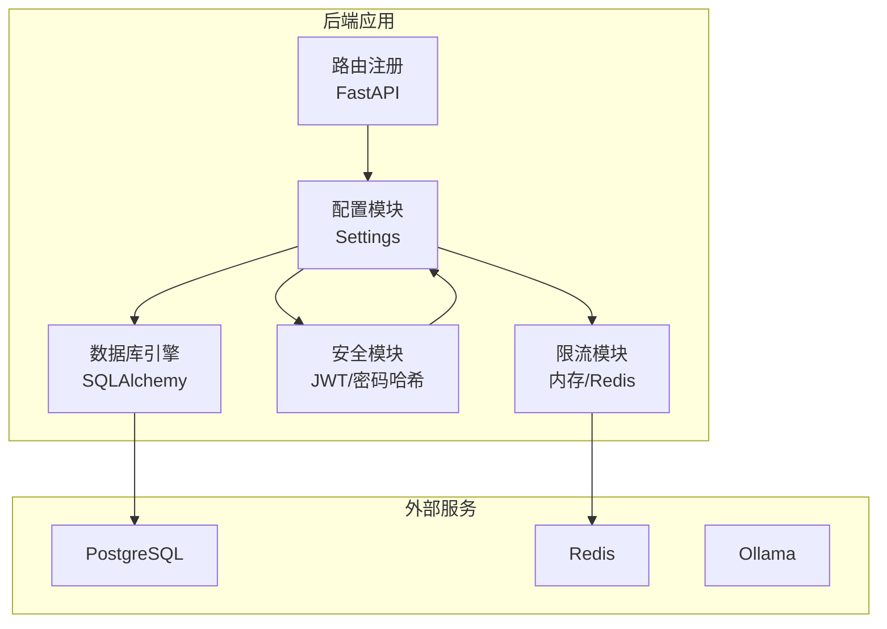
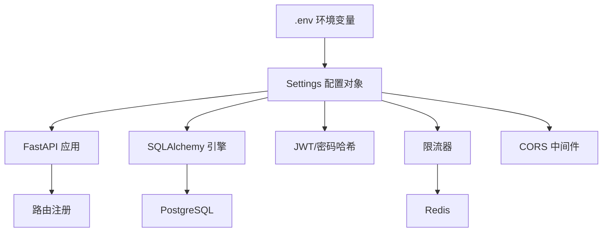
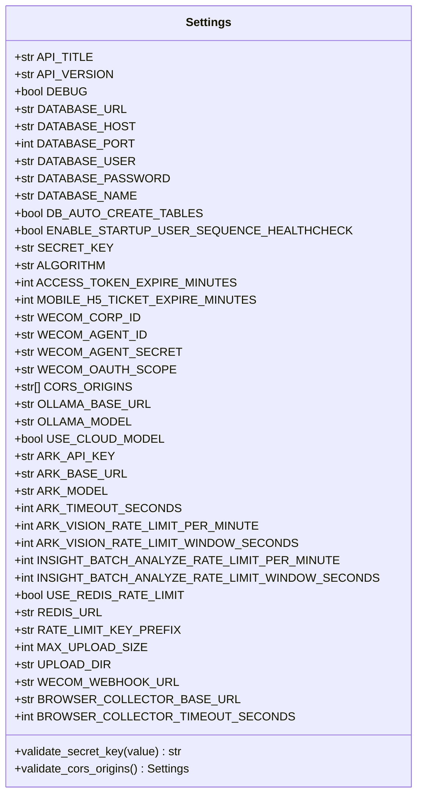
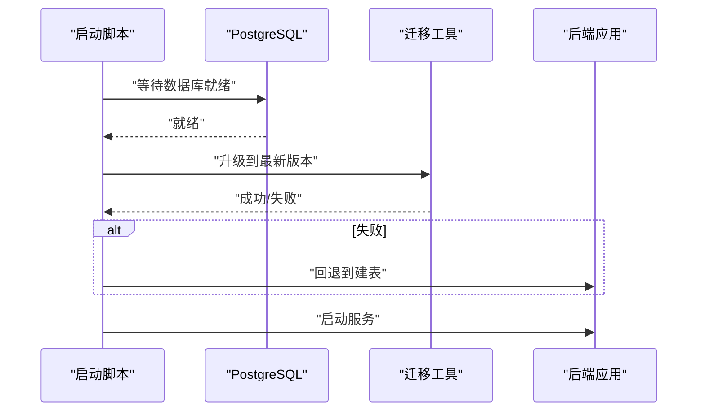
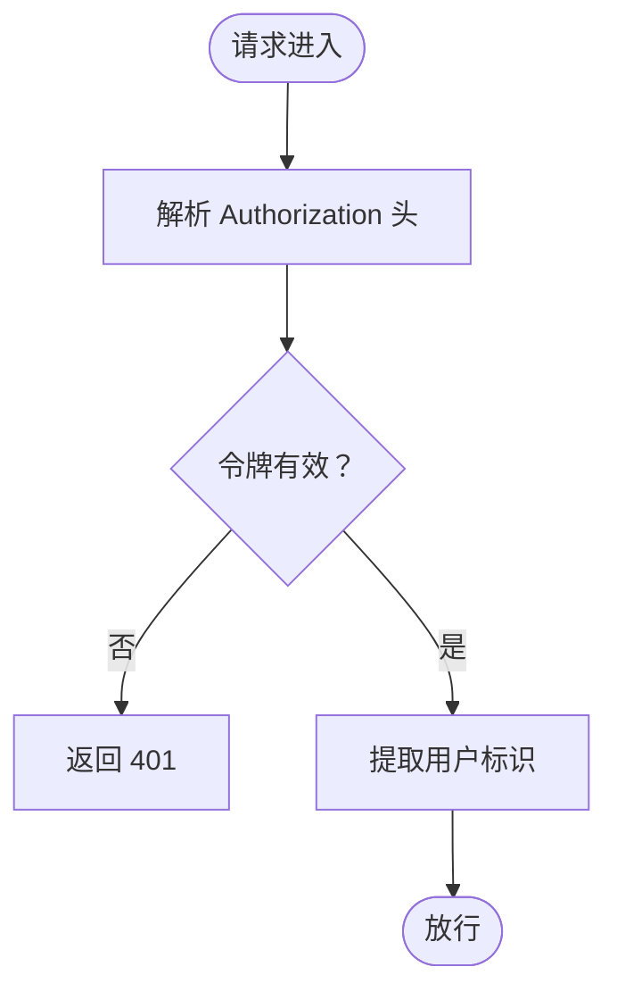
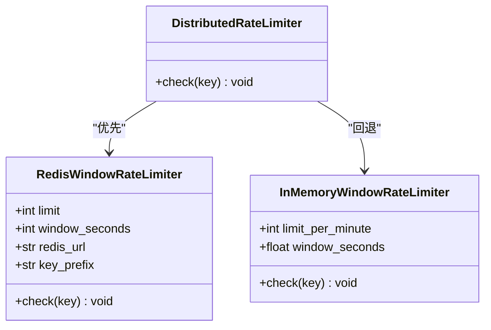
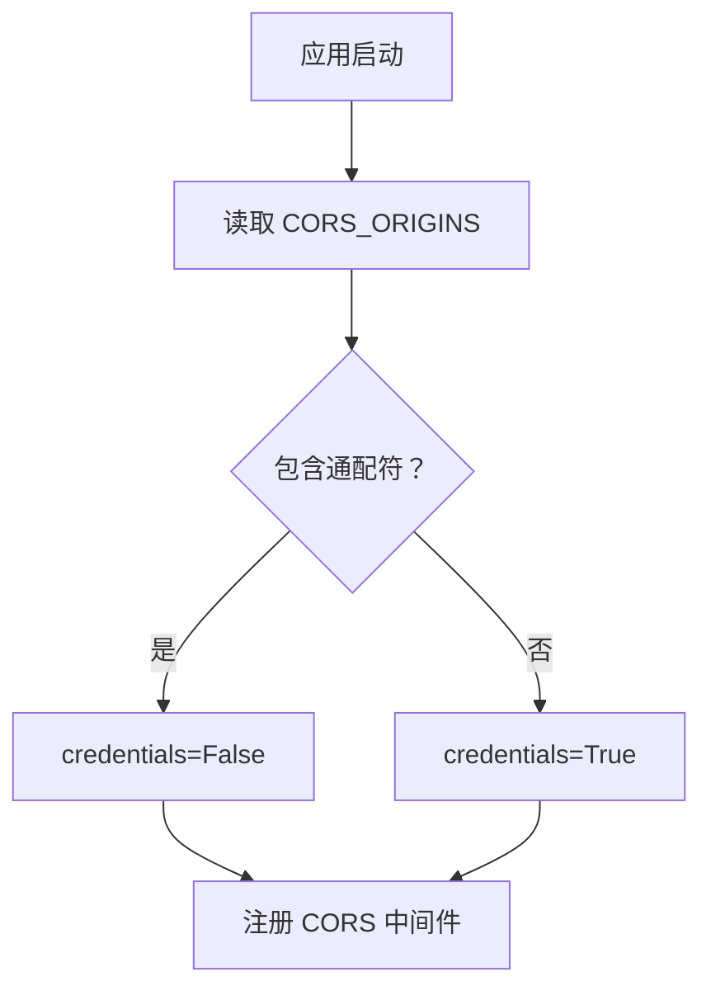
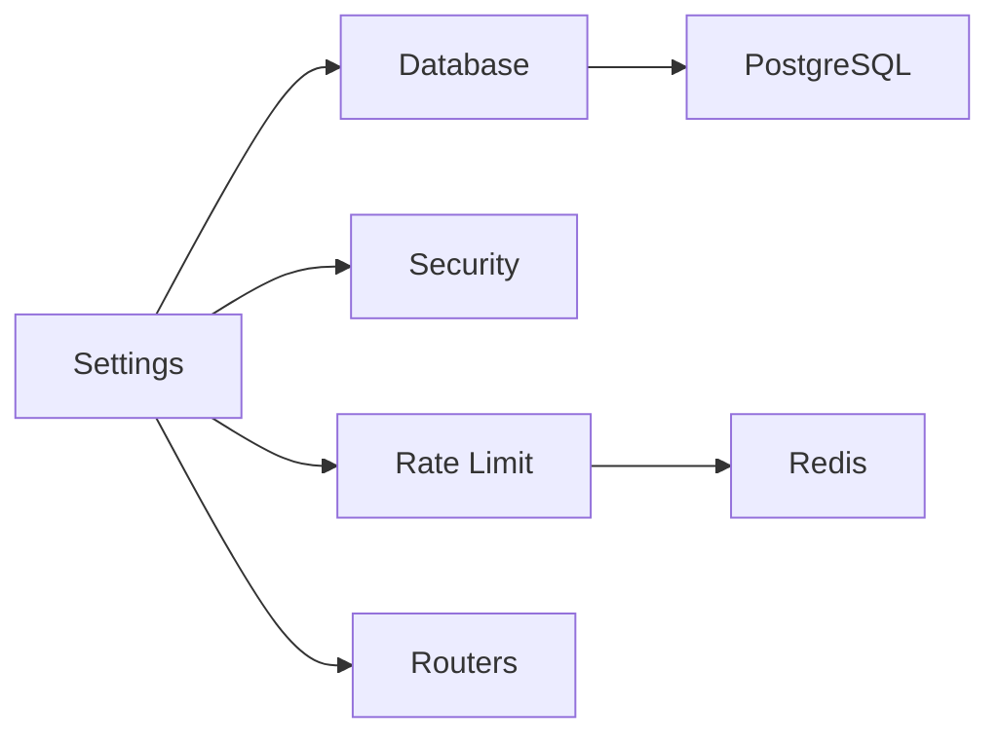

# 配置定制

<cite>
**本文引用的文件**
- [backend/app/core/config.py](file://backend/app/core/config.py)
- [backend/main.py](file://backend/main.py)
- [backend/app/core/database.py](file://backend/app/core/database.py)
- [backend/app/core/security.py](file://backend/app/core/security.py)
- [backend/app/core/redis.py](file://backend/app/core/redis.py)
- [backend/app/core/rate_limit.py](file://backend/app/core/rate_limit.py)
- [backend/docker-compose.yml](file://backend/docker-compose.yml)
- [backend/entrypoint.sh](file://backend/entrypoint.sh)
- [backend/alembic/env.py](file://backend/alembic/env.py)
- [backend/alembic.ini](file://backend/alembic.ini)
- [backend/pyproject.toml](file://backend/pyproject.toml)
- [docs/deploy/env-example.md](file://docs/deploy/env-example.md)
</cite>

## 目录
1. [简介](#简介)
2. [项目结构](#项目结构)
3. [核心组件](#核心组件)
4. [架构总览](#架构总览)
5. [详细组件分析](#详细组件分析)
6. [依赖分析](#依赖分析)
7. [性能考虑](#性能考虑)
8. [故障排查指南](#故障排查指南)
9. [结论](#结论)
10. [附录](#附录)

## 简介
本文件面向“智获客系统”的配置定制需求，系统性阐述环境变量配置、运行时配置管理、安全配置、数据库连接、中间件配置、配置验证、热重载与迁移策略、多环境管理与敏感信息保护、配置模板与最佳实践，以及配置冲突处理与降级策略。目标是帮助运维与开发团队在不同环境中稳定、安全地部署与维护系统。

## 项目结构
后端采用 FastAPI + SQLAlchemy + Alembic 架构，配置集中于 settings 对象并通过 Pydantic Settings 加载环境变量与默认值。数据库、安全、速率限制、AI 引擎、浏览器采集服务等均通过 settings 注入到运行时模块中。容器化通过 docker-compose 编排数据库、缓存与推理服务，启动脚本负责数据库迁移与服务启动。

图表来源
- [backend/app/core/config.py:15-103](file://backend/app/core/config.py#L15-L103)
- [backend/app/core/database.py:1-29](file://backend/app/core/database.py#L1-L29)
- [backend/app/core/security.py:1-57](file://backend/app/core/security.py#L1-L57)
- [backend/app/core/rate_limit.py:1-108](file://backend/app/core/rate_limit.py#L1-L108)
- [backend/main.py:46-68](file://backend/main.py#L46-L68)

章节来源
- [backend/app/core/config.py:15-103](file://backend/app/core/config.py#L15-L103)
- [backend/main.py:46-68](file://backend/main.py#L46-L68)

## 核心组件
- 配置加载与校验
  - 使用 Pydantic Settings 从 .env 文件加载键值，支持大小写敏感与额外字段忽略。
  - 内置对密钥长度与默认占位符的校验，以及生产环境 CORS 白名单限制。
- 数据库连接
  - 通过 settings.DATABASE_URL 创建 SQLAlchemy 引擎，启用 pre_ping 与连接池参数。
- 安全配置
  - JWT 密钥、算法与过期时间由 settings 提供；密码哈希策略兼容多种后端。
- 速率限制
  - 支持内存滑动窗口与 Redis 分布式计数两种模式，具备降级回退能力。
- 中间件与路由
  - CORS 中间件按配置注入；OpenAPI 自定义与健康检查端点。
- 运行时与容器编排
  - 启动脚本等待数据库就绪、执行迁移或回退建表、启动服务；docker-compose 统一编排。

章节来源
- [backend/app/core/config.py:15-103](file://backend/app/core/config.py#L15-L103)
- [backend/app/core/database.py:1-29](file://backend/app/core/database.py#L1-L29)
- [backend/app/core/security.py:1-57](file://backend/app/core/security.py#L1-L57)
- [backend/app/core/rate_limit.py:1-108](file://backend/app/core/rate_limit.py#L1-L108)
- [backend/main.py:46-68](file://backend/main.py#L46-L68)
- [backend/docker-compose.yml:24-38](file://backend/docker-compose.yml#L24-L38)
- [backend/entrypoint.sh:7-47](file://backend/entrypoint.sh#L7-L47)

## 架构总览
下图展示配置在系统中的注入路径与依赖关系，包括环境变量来源、配置对象、各运行时模块以及外部依赖。

图表来源
- [backend/app/core/config.py:15-103](file://backend/app/core/config.py#L15-L103)
- [backend/main.py:46-68](file://backend/main.py#L46-L68)
- [backend/app/core/database.py:1-29](file://backend/app/core/database.py#L1-L29)
- [backend/app/core/security.py:1-57](file://backend/app/core/security.py#L1-L57)
- [backend/app/core/rate_limit.py:1-108](file://backend/app/core/rate_limit.py#L1-L108)

## 详细组件分析

### 配置对象与验证规则
- 环境变量文件与加载
  - 通过 Settings.model_config 指定 env_file=".env"，大小写敏感，额外字段忽略。
- 关键配置项
  - 项目元数据：API_TITLE、API_VERSION、DEBUG。
  - 数据库：DATABASE_URL、DATABASE_HOST、DATABASE_PORT、DATABASE_USER、DATABASE_PASSWORD、DATABASE_NAME、DB_AUTO_CREATE_TABLES、ENABLE_STARTUP_USER_SEQUENCE_HEALTHCHECK。
  - 安全：SECRET_KEY、ALGORITHM、ACCESS_TOKEN_EXPIRE_MINUTES、MOBILE_H5_TICKET_EXPIRE_MINUTES。
  - 企业微信：WECOM_CORP_ID、WECOM_AGENT_ID、WECOM_AGENT_SECRET、WECOM_OAUTH_SCOPE。
  - CORS：CORS_ORIGINS。
  - AI 引擎：OLLAMA_BASE_URL、OLLAMA_MODEL、USE_CLOUD_MODEL。
  - 火山引擎：ARK_API_KEY、ARK_BASE_URL、ARK_MODEL、ARK_TIMEOUT_SECONDS、ARK_VISION_RATE_LIMIT_PER_MINUTE、ARK_VISION_RATE_LIMIT_WINDOW_SECONDS、INSIGHT_BATCH_ANALYZE_RATE_LIMIT_PER_MINUTE、INSIGHT_BATCH_ANALYZE_RATE_LIMIT_WINDOW_SECONDS。
  - Redis 限流：USE_REDIS_RATE_LIMIT、REDIS_URL、RATE_LIMIT_KEY_PREFIX。
  - 文件上传：MAX_UPLOAD_SIZE、UPLOAD_DIR。
  - WeCom 机器人：WECOM_WEBHOOK_URL。
  - 浏览器采集服务：BROWSER_COLLECTOR_BASE_URL、BROWSER_COLLECTOR_TIMEOUT_SECONDS。
- 校验逻辑
  - SECRET_KEY：禁止默认占位符，长度至少 32 字符。
  - CORS_ORIGINS：生产环境不允许包含通配符“*”。

图表来源
- [backend/app/core/config.py:15-103](file://backend/app/core/config.py#L15-L103)

章节来源
- [backend/app/core/config.py:15-103](file://backend/app/core/config.py#L15-L103)

### 数据库连接与迁移
- 连接配置
  - 通过 settings.DATABASE_URL 创建引擎，开启 echo（DEBUG 时），pre_ping 与连接池参数优化。
- 迁移入口
  - Alembic 通过 env.py 优先读取环境变量 DATABASE_URL，若为空则回退 alembic.ini 的 sqlalchemy.url。
- 启动流程
  - 容器启动脚本等待数据库就绪，尝试执行 Alembic 升级；失败则回退到 init_db 建表。

图表来源
- [backend/entrypoint.sh:7-47](file://backend/entrypoint.sh#L7-L47)
- [backend/alembic/env.py:37-44](file://backend/alembic/env.py#L37-L44)
- [backend/alembic.ini:5-6](file://backend/alembic.ini#L5-L6)

章节来源
- [backend/app/core/database.py:1-29](file://backend/app/core/database.py#L1-L29)
- [backend/alembic/env.py:37-44](file://backend/alembic/env.py#L37-L44)
- [backend/alembic.ini:5-6](file://backend/alembic.ini#L5-L6)
- [backend/entrypoint.sh:7-47](file://backend/entrypoint.sh#L7-L47)

### 安全配置（JWT 与密码）
- JWT 令牌
  - 使用 settings.SECRET_KEY 与 settings.ALGORITHM 生成与验证令牌；过期时间由配置控制。
- 密码哈希
  - 采用 pbkdf2_sha256 作为默认方案，兼容 bcrypt 以保证历史哈希可验证。
- 企业微信集成
  - 未配置时 OAuth 入口自动隐藏，系统降级为短票据模式。

图表来源
- [backend/app/core/security.py:42-57](file://backend/app/core/security.py#L42-L57)
- [backend/app/core/config.py:37-47](file://backend/app/core/config.py#L37-L47)

章节来源
- [backend/app/core/security.py:1-57](file://backend/app/core/security.py#L1-L57)
- [backend/app/core/config.py:37-47](file://backend/app/core/config.py#L37-L47)

### 速率限制与降级策略
- 限流模式
  - 内存滑动窗口：适用于单进程部署。
  - Redis 分布式计数：跨进程/多实例共享状态。
- 降级策略
  - Redis 不可用时回退到内存限流，保障服务连续性。
- 配置开关
  - 通过 USE_REDIS_RATE_LIMIT 控制是否启用 Redis；REDIS_URL 与 RATE_LIMIT_KEY_PREFIX 用于 Redis 连接与键空间隔离。

图表来源
- [backend/app/core/rate_limit.py:14-108](file://backend/app/core/rate_limit.py#L14-L108)

章节来源
- [backend/app/core/rate_limit.py:1-108](file://backend/app/core/rate_limit.py#L1-L108)
- [backend/app/core/config.py:86-90](file://backend/app/core/config.py#L86-L90)

### 中间件与 CORS
- CORS 中间件
  - 依据 settings.CORS_ORIGINS 注入；当允许通配符时，credentials 必须为 False。
- 应用生命周期
  - 在 lifespan 中进行用户序列健康检查；在 DEBUG 开启时启用热重载。

图表来源
- [backend/main.py:56-65](file://backend/main.py#L56-L65)
- [backend/app/core/config.py:49-54](file://backend/app/core/config.py#L49-L54)

章节来源
- [backend/main.py:46-68](file://backend/main.py#L46-L68)
- [backend/app/core/config.py:49-54](file://backend/app/core/config.py#L49-L54)

### 运行时配置管理与热重载
- 热重载
  - DEBUG 为 True 时，uvicorn 启动时启用 --reload；本地开发推荐开启。
- 生产部署
  - docker-compose 中设置 DEBUG=False，并通过命令行传入环境变量覆盖默认值。
- 启动脚本
  - 容器启动时自动等待数据库、执行迁移或回退建表、启动服务。

章节来源
- [backend/main.py:130-138](file://backend/main.py#L130-L138)
- [backend/docker-compose.yml:24-38](file://backend/docker-compose.yml#L24-L38)
- [backend/entrypoint.sh:7-47](file://backend/entrypoint.sh#L7-L47)

### 多环境配置与敏感信息保护
- 环境变量示例
  - 参考 docs/deploy/env-example.md，至少包含 SECRET_KEY、DATABASE_URL、REDIS_URL、ARK_API_KEY。
- 敏感信息保护
  - 禁止使用默认占位密钥；生产环境禁止 CORS 使用通配符；建议使用只读权限的数据库账号。
- 多环境实践
  - 通过 .env 文件区分 dev/staging/prod；在 docker-compose 中使用环境变量覆盖默认值。

章节来源
- [docs/deploy/env-example.md:1-8](file://docs/deploy/env-example.md#L1-L8)
- [backend/app/core/config.py:55-69](file://backend/app/core/config.py#L55-L69)
- [backend/docker-compose.yml:24-28](file://backend/docker-compose.yml#L24-L28)

### 配置验证与冲突处理
- 验证策略
  - 密钥长度与占位符校验；生产 CORS 白名单校验。
- 冲突处理
  - 若 DATABASE_URL 未设置，Alembic 回退到 alembic.ini 的 sqlalchemy.url。
  - Redis 限流不可用时自动回退内存限流。
- 降级策略
  - 企业微信未配置时隐藏 OAuth，使用短票据模式。

章节来源
- [backend/app/core/config.py:55-69](file://backend/app/core/config.py#L55-L69)
- [backend/alembic/env.py:37-44](file://backend/alembic/env.py#L37-L44)
- [backend/app/core/rate_limit.py:104-107](file://backend/app/core/rate_limit.py#L104-L107)

## 依赖分析
- 配置依赖
  - 所有运行时模块（数据库、安全、限流、路由）均依赖 settings。
- 外部依赖
  - PostgreSQL、Redis、Ollama 通过 URL 配置注入。
- 工具链
  - Alembic 用于数据库迁移；uvicorn 用于 ASGI 服务器；docker-compose 用于容器编排。

图表来源
- [backend/app/core/config.py:15-103](file://backend/app/core/config.py#L15-L103)
- [backend/app/core/database.py:1-29](file://backend/app/core/database.py#L1-L29)
- [backend/app/core/security.py:1-57](file://backend/app/core/security.py#L1-L57)
- [backend/app/core/rate_limit.py:1-108](file://backend/app/core/rate_limit.py#L1-L108)

章节来源
- [backend/pyproject.toml:7-31](file://backend/pyproject.toml#L7-L31)

## 性能考虑
- 数据库连接池
  - 合理设置 pool_size 与 max_overflow，避免高并发下的连接争用。
- 限流策略
  - 分布式部署建议启用 Redis 限流；单机部署可使用内存限流并关注线程锁开销。
- 日志与调试
  - DEBUG 下开启 SQL echo 便于诊断，但会带来性能损耗，生产应关闭。

## 故障排查指南
- 数据库迁移失败
  - 检查 DATABASE_URL 是否正确；确认 Alembic 配置与 .env 一致；查看启动脚本输出。
- Redis 限流异常
  - 确认 Redis_URL 可达；检查 USE_REDIS_RATE_LIMIT 开关；观察回退日志。
- CORS 访问被拒绝
  - 生产环境不得使用通配符；核对 CORS_ORIGINS 列表。
- JWT 无效
  - 核对 SECRET_KEY 与 ALGORITHM；确保客户端使用相同算法签名。

章节来源
- [backend/entrypoint.sh:24-35](file://backend/entrypoint.sh#L24-L35)
- [backend/alembic/env.py:37-44](file://backend/alembic/env.py#L37-L44)
- [backend/app/core/rate_limit.py:104-107](file://backend/app/core/rate_limit.py#L104-L107)
- [backend/app/core/config.py:55-69](file://backend/app/core/config.py#L55-L69)

## 结论
通过集中化的配置对象与严格的校验规则，智获客系统实现了在多环境下的可移植性与安全性。结合 Alembic 迁移、Redis 分布式限流与容器编排，系统在开发、测试与生产环境中均可稳定运行。建议在生产中严格管理环境变量、最小化权限与访问范围，并定期审查配置变更。

## 附录
- 环境变量模板（摘自部署文档）
  - 参考：docs/deploy/env-example.md
- 依赖声明（用于理解外部组件）
  - 参考：backend/pyproject.toml