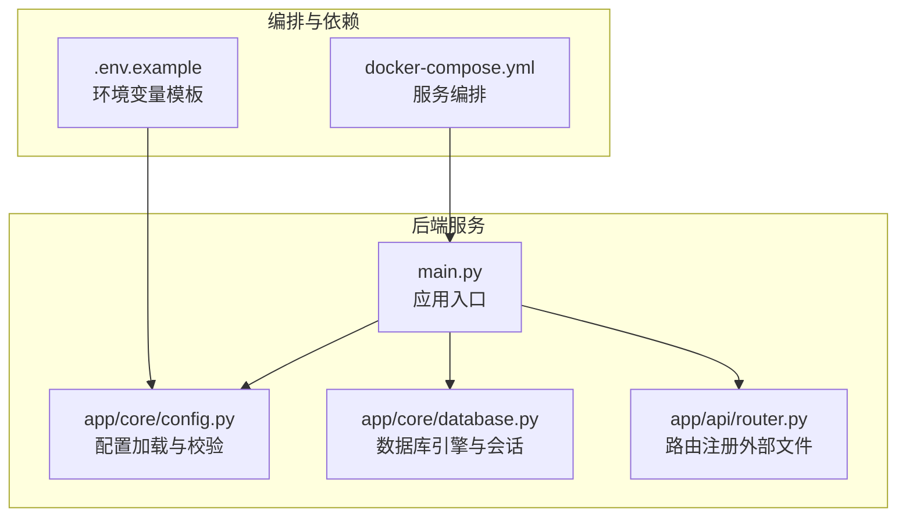
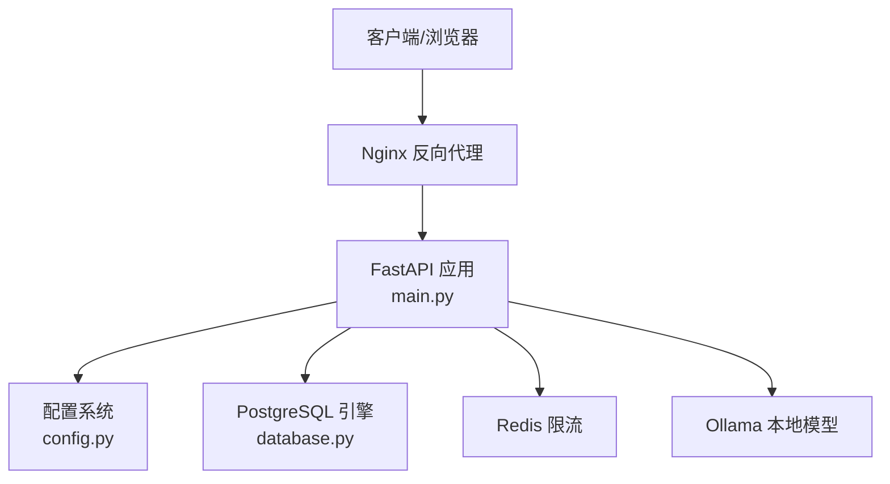
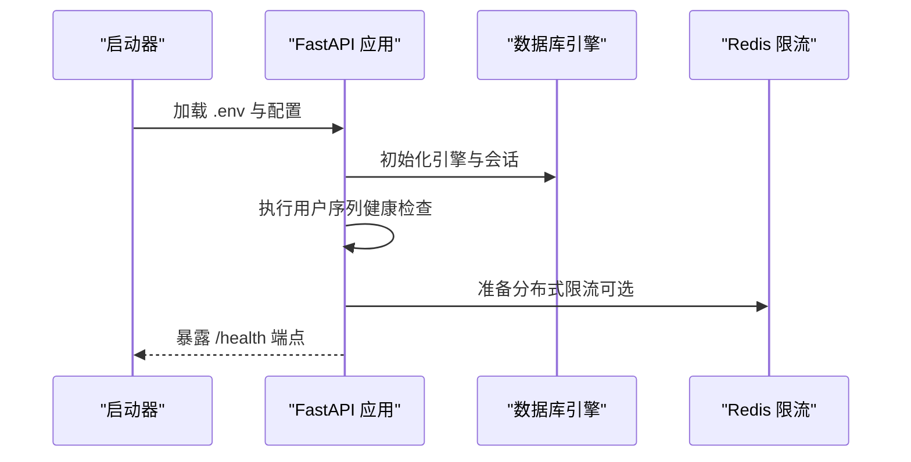
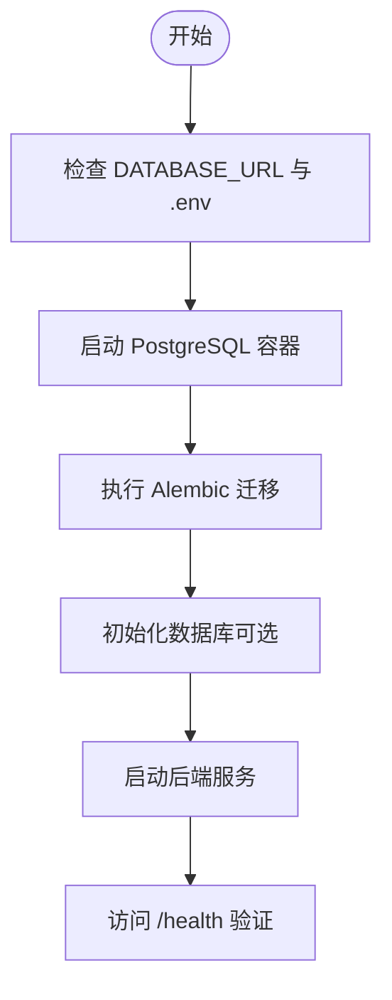
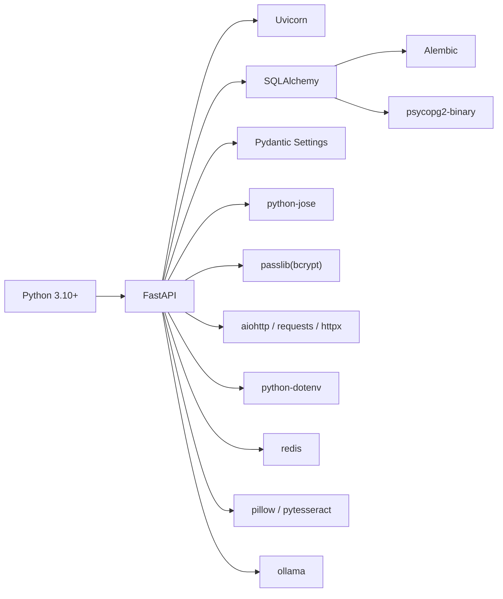

# 常见问题解决

<cite>
**本文引用的文件**
- [backend/README.md](file://backend/README.md)
- [backend/QUICKSTART.md](file://backend/QUICKSTART.md)
- [backend/pyproject.toml](file://backend/pyproject.toml)
- [backend/requirements.txt](file://backend/requirements.txt)
- [backend/main.py](file://backend/main.py)
- [backend/app/core/config.py](file://backend/app/core/config.py)
- [backend/app/core/database.py](file://backend/app/core/database.py)
- [backend/docker-compose.yml](file://backend/docker-compose.yml)
- [backend/.env.example](file://backend/.env.example)
- [_backend_status_check.py](file://_backend_status_check.py)
- [_check_server.py](file://_check_server.py)
- [_deploy_check.py](file://_deploy_check.py)
</cite>

## 目录
1. [简介](#简介)
2. [项目结构](#项目结构)
3. [核心组件](#核心组件)
4. [架构总览](#架构总览)
5. [详细组件分析](#详细组件分析)
6. [依赖分析](#依赖分析)
7. [性能考虑](#性能考虑)
8. [故障排查指南](#故障排查指南)
9. [结论](#结论)
10. [附录](#附录)

## 简介
本指南面向“智获客”后端系统的运维与开发人员，聚焦启动失败、连接超时、内存不足等常见问题的诊断与解决。内容涵盖数据库连接、网络连接、服务启动异常的排查步骤，配置错误、依赖缺失与版本兼容性的识别与修复方法，并提供快速修复步骤、预防措施、问题自检清单及自动化检测脚本的使用方法。

## 项目结构
后端采用 FastAPI + SQLAlchemy + PostgreSQL 的技术栈，通过 Docker Compose 编排数据库、后端、Redis、Ollama 等服务。核心入口为应用主文件，配置集中于设置模块，数据库连接由 ORM 层负责。

图表来源
- [backend/main.py:1-138](file://backend/main.py#L1-L138)
- [backend/app/core/config.py:1-103](file://backend/app/core/config.py#L1-L103)
- [backend/app/core/database.py:1-29](file://backend/app/core/database.py#L1-L29)
- [backend/docker-compose.yml:1-67](file://backend/docker-compose.yml#L1-L67)
- [backend/.env.example:1-56](file://backend/.env.example#L1-L56)

章节来源
- [backend/README.md:90-107](file://backend/README.md#L90-L107)
- [backend/QUICKSTART.md:71-105](file://backend/QUICKSTART.md#L71-L105)

## 核心组件
- 应用入口与生命周期：应用在启动时进行用户序列健康检查、挂载静态资源、注册路由、暴露健康检查端点。
- 配置系统：集中读取 .env，对密钥长度与白名单进行严格校验，支持数据库、CORS、AI模型、Redis、上传等配置项。
- 数据库连接：基于 SQLAlchemy 创建引擎与会话工厂，启用连接池与 pre_ping，支持调试输出。
- 编排与依赖：Docker Compose 提供数据库、Redis、Ollama、后端服务的健康检查与依赖顺序。

章节来源
- [backend/main.py:22-35](file://backend/main.py#L22-L35)
- [backend/main.py:46-51](file://backend/main.py#L46-L51)
- [backend/main.py:71-77](file://backend/main.py#L71-L77)
- [backend/app/core/config.py:55-63](file://backend/app/core/config.py#L55-L63)
- [backend/app/core/config.py:65-69](file://backend/app/core/config.py#L65-L69)
- [backend/app/core/database.py:7-13](file://backend/app/core/database.py#L7-L13)
- [backend/docker-compose.yml:15-19](file://backend/docker-compose.yml#L15-L19)
- [backend/docker-compose.yml:31-35](file://backend/docker-compose.yml#L31-L35)

## 架构总览
后端通过 Uvicorn 运行，FastAPI 路由对外提供 API；数据库连接由 SQLAlchemy 引擎管理；Redis 用于分布式限流；Ollama 作为本地大模型服务；Nginx 可作为反向代理（部署阶段建议）。

图表来源
- [backend/main.py:46-51](file://backend/main.py#L46-L51)
- [backend/app/core/config.py:72-84](file://backend/app/core/config.py#L72-L84)
- [backend/app/core/database.py:7-13](file://backend/app/core/database.py#L7-L13)
- [backend/docker-compose.yml:40-48](file://backend/docker-compose.yml#L40-L48)

## 详细组件分析

### 启动流程与健康检查
- 应用启动时执行用户序列健康检查，随后进入服务生命周期。
- 提供 /health 健康检查端点，返回状态与序列指标快照。
- 建议在部署后主动访问该端点验证数据库、Redis、Ollama 状态。

图表来源
- [backend/main.py:22-35](file://backend/main.py#L22-L35)
- [backend/main.py:71-77](file://backend/main.py#L71-L77)
- [backend/app/core/config.py:86-89](file://backend/app/core/config.py#L86-L89)

章节来源
- [backend/main.py:22-35](file://backend/main.py#L22-L35)
- [backend/main.py:71-77](file://backend/main.py#L71-L77)
- [backend/README.md:210-211](file://backend/README.md#L210-L211)

### 数据库连接与迁移
- 引擎参数包含连接池大小、溢出、pre_ping 等，有助于提升稳定性。
- Alembic 迁移支持查看当前版本、升级到最新、回滚指定版本、查看历史。
- 建议在本地开发时先启动数据库容器，再执行迁移。

图表来源
- [backend/app/core/database.py:7-13](file://backend/app/core/database.py#L7-L13)
- [backend/README.md:58-75](file://backend/README.md#L58-L75)
- [backend/docker-compose.yml:4-19](file://backend/docker-compose.yml#L4-L19)

章节来源
- [backend/app/core/database.py:7-13](file://backend/app/core/database.py#L7-L13)
- [backend/README.md:58-75](file://backend/README.md#L58-L75)
- [backend/docker-compose.yml:4-19](file://backend/docker-compose.yml#L4-L19)

### CORS 与认证配置
- SECRET_KEY 长度不得少于 32 字符，且不可使用默认占位值。
- 生产环境禁止 CORS_ORIGINS 使用通配符，需配置明确来源白名单。
- JWT 算法与过期时间可配置，移动端票据过期时间独立。

章节来源
- [backend/app/core/config.py:55-63](file://backend/app/core/config.py#L55-L63)
- [backend/app/core/config.py:65-69](file://backend/app/core/config.py#L65-L69)
- [backend/.env.example:10-18](file://backend/.env.example#L10-L18)

### AI 与限流配置
- Ollama 本地模型基础地址与模型名可配置；也可启用云端火山引擎模型。
- Redis 分布式限流开关与连接地址可配置；Redis 不可用时自动降级到进程内限流。

章节来源
- [backend/app/core/config.py:72-84](file://backend/app/core/config.py#L72-L84)
- [backend/app/core/config.py:86-89](file://backend/app/core/config.py#L86-L89)
- [backend/README.md:160-162](file://backend/README.md#L160-L162)

## 依赖分析
- 语言与框架：Python 3.10+、FastAPI、Uvicorn。
- 数据库与 ORM：SQLAlchemy、Alembic、psycopg2-binary。
- 认证与安全：Pydantic Settings、python-jose、passlib bcrypt。
- 网络与异步：aiohttp、requests、httpx。
- 其他：python-dotenv、redis、pillow、pytesseract、ollama。

图表来源
- [backend/pyproject.toml:7-31](file://backend/pyproject.toml#L7-L31)
- [backend/requirements.txt:1-21](file://backend/requirements.txt#L1-L21)

章节来源
- [backend/pyproject.toml:7-31](file://backend/pyproject.toml#L7-L31)
- [backend/requirements.txt:1-21](file://backend/requirements.txt#L1-L21)

## 性能考虑
- 连接池参数：预取连接、池大小与溢出数量有助于缓解高并发下的连接竞争。
- 调试输出：DEBUG 开启时 SQL 输出可能带来额外开销，建议生产关闭。
- 限流策略：Redis 限流可用时优先使用，避免 Ollama 或 Ark 调用过载。
- 静态资源：SPA 回退与缓存头设置减少不必要的后端负载。

章节来源
- [backend/app/core/database.py:7-13](file://backend/app/core/database.py#L7-L13)
- [backend/app/core/config.py](file://backend/app/core/config.py#L25)
- [backend/app/core/config.py:86-89](file://backend/app/core/config.py#L86-L89)
- [backend/main.py:79-99](file://backend/main.py#L79-L99)

## 故障排查指南

### 一、启动失败
- 现象
  - 进程退出、日志报错、无法访问 /health。
- 诊断步骤
  - 检查 .env 是否存在且关键字段完整（DATABASE_URL、SECRET_KEY、CORS_ORIGINS）。
  - 使用 Docker Compose 启动全部服务，确认数据库、Redis、Ollama 健康。
  - 查看后端容器日志与健康检查端点响应。
- 快速修复
  - 补齐 .env，修正密钥长度与白名单。
  - 确保数据库容器健康，端口映射正确。
  - 重启后端服务并再次访问 /health。
- 预防措施
  - 生产环境固定 CORS 白名单，禁用 DEBUG。
  - 部署后立即执行健康检查端点验证。

章节来源
- [backend/.env.example:1-56](file://backend/.env.example#L1-L56)
- [backend/docker-compose.yml:24-38](file://backend/docker-compose.yml#L24-L38)
- [backend/main.py:71-77](file://backend/main.py#L71-L77)
- [backend/README.md:212-221](file://backend/README.md#L212-L221)

### 二、数据库连接问题
- 现象
  - 启动时报数据库连接错误、迁移失败、ORM 初始化异常。
- 诊断步骤
  - 校验 DATABASE_URL 格式与凭据。
  - 确认数据库容器健康、端口可达、卷数据持久化正常。
  - 在容器内执行数据库连接测试（psql）。
- 快速修复
  - 修正 .env 中 DATABASE_URL。
  - 启动数据库容器并等待健康检查通过。
  - 执行 Alembic 迁移至最新版本。
- 预防措施
  - 使用 Docker Compose 编排，设置健康检查与依赖条件。
  - 生产环境使用强密码与只读账号。

章节来源
- [backend/app/core/config.py:27-35](file://backend/app/core/config.py#L27-L35)
- [backend/app/core/database.py:7-13](file://backend/app/core/database.py#L7-L13)
- [backend/docker-compose.yml:15-19](file://backend/docker-compose.yml#L15-L19)
- [backend/README.md:58-75](file://backend/README.md#L58-L75)

### 三、网络连接问题（CORS/代理/端口）
- 现象
  - 前端跨域失败、Nginx 代理 502/404、端口占用。
- 诊断步骤
  - 检查 CORS_ORIGINS 是否包含前端地址，生产禁止通配符。
  - 确认后端端口映射与防火墙放行。
  - 使用 curl 或浏览器开发者工具验证跨域头。
- 快速修复
  - 在 .env 中添加前端域名白名单。
  - 释放被占用端口或调整映射。
  - 配置 Nginx 反向代理指向后端 8000 端口。
- 预防措施
  - 明确 CORS 白名单，避免使用通配符。
  - 使用 Nginx 作为统一入口，开启 HTTPS。

章节来源
- [backend/app/core/config.py:49-53](file://backend/app/core/config.py#L49-L53)
- [backend/app/core/config.py:65-69](file://backend/app/core/config.py#L65-L69)
- [backend/QUICKSTART.md:303-315](file://backend/QUICKSTART.md#L303-L315)

### 四、服务启动异常（端口冲突/权限/依赖）
- 现象
  - 端口被占用、权限不足、依赖缺失导致启动失败。
- 诊断步骤
  - 检查端口占用情况，必要时更换映射或释放端口。
  - 确认 Python 环境与依赖安装完成。
  - 对比 requirements.txt 与 pyproject.toml 的一致性。
- 快速修复
  - 更换端口或停止占用进程。
  - 清理虚拟环境后重新安装依赖。
  - 使用 Poetry 或 pip 安装 requirements.txt。
- 预防措施
  - 使用 Docker Compose 统一运行环境。
  - 在 CI 中校验依赖安装与基本健康检查。

章节来源
- [backend/requirements.txt:1-21](file://backend/requirements.txt#L1-L21)
- [backend/pyproject.toml:7-31](file://backend/pyproject.toml#L7-L31)
- [backend/docker-compose.yml:29-38](file://backend/docker-compose.yml#L29-L38)

### 五、内存不足与性能瓶颈
- 现象
  - 后端频繁重启、响应缓慢、数据库连接池耗尽。
- 诊断步骤
  - 查看容器资源限制与日志中的 OOM/连接超时。
  - 检查连接池参数与并发请求量。
  - 关注 AI/OCR 处理任务的内存峰值。
- 快速修复
  - 调整连接池大小与溢出数量。
  - 降低并发或增加容器资源。
  - 优化任务批处理与缓存策略。
- 预防措施
  - 生产环境启用资源限制与健康检查。
  - 使用 Redis 缓存热点数据，减少数据库压力。

章节来源
- [backend/app/core/database.py:10-13](file://backend/app/core/database.py#L10-L13)
- [backend/app/core/config.py:86-89](file://backend/app/core/config.py#L86-L89)

### 六、配置错误、依赖缺失与版本兼容性
- 配置错误
  - 密钥长度不足、CORS 使用通配符、数据库 URL 格式错误。
- 依赖缺失
  - 缺少 psycopg2-binary、redis、ollama 客户端等。
- 版本兼容性
  - bcrypt 限制小于 5；Python 版本需满足 ^3.10。
- 快速修复
  - 修正 .env 中配置项，补齐依赖包。
  - 使用 Poetry 或 pip 安装 requirements.txt。
  - 校验 Python 版本与第三方库版本范围。
- 预防措施
  - 在 CI 中执行依赖安装与基本健康检查。
  - 使用 Docker 镜像固化运行环境。

章节来源
- [backend/app/core/config.py:55-63](file://backend/app/core/config.py#L55-L63)
- [backend/app/core/config.py:65-69](file://backend/app/core/config.py#L65-L69)
- [backend/pyproject.toml](file://backend/pyproject.toml#L18)
- [backend/requirements.txt:9-10](file://backend/requirements.txt#L9-L10)

### 七、自动化检测脚本使用
- 后端稳定性检查脚本
  - 作用：检查容器状态、CORS 配置、后端日志、健康检查。
  - 使用：通过 SSH 连接目标主机，执行脚本查看输出。
- 服务器状态检查脚本
  - 作用：列出容器、镜像、.env 存在性、脚本文件、关键配置。
- 部署进度检查脚本
  - 作用：查看构建日志尾部、容器状态、Docker 进程、健康检查。
- 使用建议
  - 将脚本中的主机与凭据替换为实际目标。
  - 结合 /health 与容器日志综合判断问题根因。

章节来源
- [_backend_status_check.py:1-24](file://_backend_status_check.py#L1-L24)
- [_check_server.py:1-25](file://_check_server.py#L1-L25)
- [_deploy_check.py:1-29](file://_deploy_check.py#L1-L29)

## 结论
通过规范的环境变量配置、严格的启动健康检查、完善的 Docker 编排与自动化检测脚本，可以有效降低启动失败、连接超时与内存不足等问题的发生概率。建议在生产环境中固定白名单、禁用 DEBUG、启用 Nginx 代理与 HTTPS，并持续监控 /health 端点与容器日志。

## 附录

### 问题自检清单
- 环境变量
  - [ ] DATABASE_URL 正确且可连通
  - [ ] SECRET_KEY 长度 ≥ 32 且非默认值
  - [ ] CORS_ORIGINS 非通配符白名单
  - [ ] USE_CLOUD_MODEL 与 ARK_* 配置一致
- 服务依赖
  - [ ] PostgreSQL 健康检查通过
  - [ ] Redis 可用（限流启用时）
  - [ ] Ollama 可达（本地模型）
- 运行与部署
  - [ ] /health 返回正常
  - [ ] Nginx 反代 8000 端口
  - [ ] DEBUG 已关闭
- 自动化检查
  - [ ] 执行 _backend_status_check.py/_deploy_check.py/_check_server.py 并核对输出

### 常用命令与端点
- 启动与日志
  - [ ] docker-compose up -d
  - [ ] docker-compose logs -f backend
- 数据库迁移
  - [ ] alembic current / upgrade head / downgrade -1
- 健康检查
  - [ ] curl http://localhost:8000/health
  - [ ] curl http://localhost:8000/api/system/ops/health
  - [ ] curl http://localhost:8000/api/system/ops/readiness