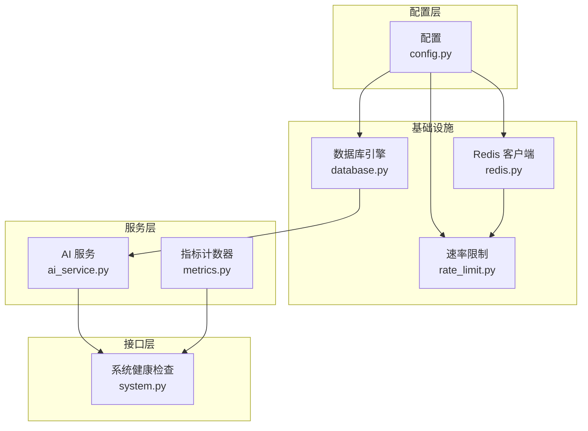
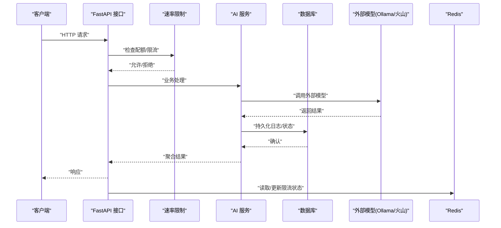
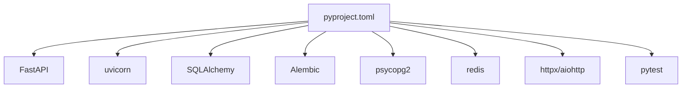

# 性能优化

<cite>
**本文引用的文件**
- [backend/app/core/config.py](file://backend/app/core/config.py)
- [backend/app/core/database.py](file://backend/app/core/database.py)
- [backend/app/core/redis.py](file://backend/app/core/redis.py)
- [backend/app/core/rate_limit.py](file://backend/app/core/rate_limit.py)
- [backend/app/core/metrics.py](file://backend/app/core/metrics.py)
- [backend/app/services/ai_service.py](file://backend/app/services/ai_service.py)
- [backend/app/api/endpoints/system.py](file://backend/app/api/endpoints/system.py)
- [backend/pyproject.toml](file://backend/pyproject.toml)
- [backend/alembic/versions/20260323_0008_legacy_baseline.py](file://backend/alembic/versions/20260323_0008_legacy_baseline.py)
</cite>

## 目录
1. [简介](#简介)
2. [项目结构](#项目结构)
3. [核心组件](#核心组件)
4. [架构总览](#架构总览)
5. [详细组件分析](#详细组件分析)
6. [依赖分析](#依赖分析)
7. [性能考虑](#性能考虑)
8. [故障排查指南](#故障排查指南)
9. [结论](#结论)
10. [附录](#附录)

## 简介
本指南面向“智获客”系统的性能优化，聚焦于以下目标：
- 快速识别与分析性能问题：慢查询、高延迟、资源瓶颈定位技巧
- 数据库性能优化：索引优化、查询优化、连接池配置
- 缓存策略与内存管理最佳实践
- 监控指标解读与性能基准测试方法
- AI任务调度优化、并发处理改进与资源利用率提升
- 基于指标监控发现问题并制定优化计划

## 项目结构
后端采用 FastAPI + SQLAlchemy 架构，核心模块围绕配置、数据库、Redis、速率限制、AI服务与系统健康检查展开。整体以“配置驱动 + 服务层 + API 层”的分层组织，便于在不改动业务逻辑的前提下进行性能参数调优。

图表来源
- [backend/app/core/config.py:15-103](file://backend/app/core/config.py#L15-L103)
- [backend/app/core/database.py:1-29](file://backend/app/core/database.py#L1-L29)
- [backend/app/core/redis.py:1-8](file://backend/app/core/redis.py#L1-L8)
- [backend/app/core/rate_limit.py:1-108](file://backend/app/core/rate_limit.py#L1-L108)
- [backend/app/services/ai_service.py:1-460](file://backend/app/services/ai_service.py#L1-L460)
- [backend/app/api/endpoints/system.py:1-171](file://backend/app/api/endpoints/system.py#L1-L171)
- [backend/app/core/metrics.py:1-44](file://backend/app/core/metrics.py#L1-L44)

章节来源
- [backend/app/core/config.py:15-103](file://backend/app/core/config.py#L15-L103)
- [backend/app/core/database.py:1-29](file://backend/app/core/database.py#L1-L29)
- [backend/app/core/redis.py:1-8](file://backend/app/core/redis.py#L1-L8)
- [backend/app/core/rate_limit.py:1-108](file://backend/app/core/rate_limit.py#L1-L108)
- [backend/app/services/ai_service.py:1-460](file://backend/app/services/ai_service.py#L1-L460)
- [backend/app/api/endpoints/system.py:1-171](file://backend/app/api/endpoints/system.py#L1-L171)
- [backend/app/core/metrics.py:1-44](file://backend/app/core/metrics.py#L1-L44)

## 核心组件
- 配置中心：集中管理数据库、Redis、AI模型、速率限制、超时等性能相关参数
- 数据库引擎：连接池参数、预检、调试开关
- Redis 客户端：分布式限流与缓存
- 速率限制：内存滑动窗口与 Redis 分布式计数器双通道
- AI 服务：外部模型调用（本地 Ollama 或火山引擎），内置耗时与用量统计
- 系统健康检查：数据库、Redis、Ollama 的连通性与延迟探测
- 指标计数器：用户序列修复/对齐的只读计数器，辅助诊断数据一致性问题

章节来源
- [backend/app/core/config.py:15-103](file://backend/app/core/config.py#L15-L103)
- [backend/app/core/database.py:1-29](file://backend/app/core/database.py#L1-L29)
- [backend/app/core/redis.py:1-8](file://backend/app/core/redis.py#L1-L8)
- [backend/app/core/rate_limit.py:1-108](file://backend/app/core/rate_limit.py#L1-L108)
- [backend/app/services/ai_service.py:1-460](file://backend/app/services/ai_service.py#L1-L460)
- [backend/app/api/endpoints/system.py:1-171](file://backend/app/api/endpoints/system.py#L1-L171)
- [backend/app/core/metrics.py:1-44](file://backend/app/core/metrics.py#L1-L44)

## 架构总览
系统运行时的关键路径包括：API 请求进入，经由速率限制与认证，访问服务层，服务层通过数据库或外部模型完成业务处理，并记录调用日志与指标，最终返回响应。系统健康检查接口用于快速验证数据库、Redis、Ollama 的可用性与延迟。

图表来源
- [backend/app/api/endpoints/system.py:134-171](file://backend/app/api/endpoints/system.py#L134-L171)
- [backend/app/core/rate_limit.py:75-108](file://backend/app/core/rate_limit.py#L75-L108)
- [backend/app/services/ai_service.py:24-304](file://backend/app/services/ai_service.py#L24-L304)
- [backend/app/core/database.py:22-29](file://backend/app/core/database.py#L22-L29)
- [backend/app/core/redis.py:6-8](file://backend/app/core/redis.py#L6-L8)

## 详细组件分析

### 数据库性能优化
- 连接池配置
  - 当前连接池参数：池大小与溢出数量已设定，支持连接预检以降低无效连接开销
  - 建议：结合峰值并发与慢查询占比评估是否需要调整池大小、溢出上限与回收策略
- 查询优化
  - 使用 ORM 时注意避免 N+1 查询，优先使用联结与批量加载
  - 对高频查询字段建立合适索引，定期审查执行计划
- 调试与诊断
  - 在开发模式开启 SQL 输出，定位异常慢查询
  - 通过系统健康检查接口观测数据库连通性与延迟

章节来源
- [backend/app/core/database.py:6-16](file://backend/app/core/database.py#L6-L16)
- [backend/app/api/endpoints/system.py:39-60](file://backend/app/api/endpoints/system.py#L39-L60)

### 缓存策略与内存管理
- Redis 限流与缓存
  - 提供内存滑动窗口与 Redis 分布式计数器两种限流实现，支持降级回退
  - 建议：在多实例部署中启用 Redis 限流，确保全局配额一致
- 内存使用
  - 严格控制请求体大小与上传文件上限，避免内存峰值过高
  - 对大对象处理采用流式或分块策略，减少峰值内存占用

章节来源
- [backend/app/core/rate_limit.py:14-108](file://backend/app/core/rate_limit.py#L14-L108)
- [backend/app/core/config.py:91-94](file://backend/app/core/config.py#L91-L94)

### AI 任务调度与外部模型性能
- 外部模型调用
  - 支持本地 Ollama 与火山引擎两种模式，具备超时控制与调用日志
  - 建议：为不同场景设置差异化超时与重试策略，记录输入输出 token 用量，用于成本与性能分析
- 调度与并发
  - 将长耗时的 AI 生成任务放入后台队列，避免阻塞主请求线程
  - 对外部 API 设置合理的并发上限与排队机制，防止触发上游限流

章节来源
- [backend/app/services/ai_service.py:24-304](file://backend/app/services/ai_service.py#L24-L304)
- [backend/app/core/config.py:71-84](file://backend/app/core/config.py#L71-L84)

### 监控指标与健康检查
- 系统健康检查
  - 提供数据库、Redis、Ollama 的探测接口，返回延迟与可用性信息
  - 建议：将健康检查纳入探活与告警策略，出现异常时自动报警
- 用户序列指标
  - 提供用户自增序列修复/对齐的只读计数器，辅助诊断数据一致性问题
  - 建议：结合业务峰值与序列修复频率，评估数据库序列增长策略

章节来源
- [backend/app/api/endpoints/system.py:134-171](file://backend/app/api/endpoints/system.py#L134-L171)
- [backend/app/core/metrics.py:1-44](file://backend/app/core/metrics.py#L1-L44)

### 速率限制与并发控制
- 限流策略
  - 内存滑动窗口适合单进程部署；Redis 计数器适合多实例部署
  - 支持降级回退：当 Redis 不可用时自动切换到内存限流
- 并发控制
  - 为外部模型调用设置并发上限，避免资源争用
  - 对热点接口增加本地缓存与去抖策略，降低重复计算

章节来源
- [backend/app/core/rate_limit.py:75-108](file://backend/app/core/rate_limit.py#L75-L108)
- [backend/app/core/config.py:86-90](file://backend/app/core/config.py#L86-L90)

## 依赖分析
后端依赖以 Python 生态为主，关键组件如下：
- Web 框架与异步：FastAPI、httpx、aiohttp
- 数据库：SQLAlchemy、Alembic、psycopg2
- 缓存与限流：redis
- OCR 与图像处理：pillow、pytesseract
- 工具链：pytest、black、isort、flake8、mypy

图表来源
- [backend/pyproject.toml:7-31](file://backend/pyproject.toml#L7-L31)

章节来源
- [backend/pyproject.toml:1-47](file://backend/pyproject.toml#L1-L47)

## 性能考虑
- 慢查询识别与分析
  - 启用数据库 SQL 输出（开发模式），收集慢查询日志
  - 使用执行计划对比优化前后差异，关注索引使用情况
- 高延迟定位
  - 利用系统健康检查接口观测数据库、Redis、Ollama 的延迟
  - 对外部模型调用记录耗时与 token 用量，识别热点与异常
- 资源瓶颈
  - 监控 CPU、内存、连接池饱和度与 Redis 延迟
  - 通过速率限制与并发上限控制资源占用
- 基准测试
  - 使用压测工具对关键接口施加稳定负载，记录 P50/P95 延迟与错误率
  - 对比不同配置下的吞吐与延迟，确定最优参数组合

## 故障排查指南
- 数据库不可用
  - 使用系统健康检查接口确认数据库连通性与延迟
  - 检查连接池参数与数据库实例状态
- Redis 不可用
  - 确认 Redis 限流开关与连接地址
  - 观察限流降级回退逻辑是否生效
- 外部模型超时
  - 调整模型调用超时与重试策略
  - 关注日志中的耗时与错误码，定位上游问题
- 指标异常
  - 查看用户序列指标快照，结合业务峰值评估序列增长策略

章节来源
- [backend/app/api/endpoints/system.py:39-99](file://backend/app/api/endpoints/system.py#L39-L99)
- [backend/app/core/rate_limit.py:97-108](file://backend/app/core/rate_limit.py#L97-L108)
- [backend/app/services/ai_service.py:132-240](file://backend/app/services/ai_service.py#L132-L240)
- [backend/app/core/metrics.py:36-44](file://backend/app/core/metrics.py#L36-L44)

## 结论
通过配置中心统一管理性能参数、利用数据库连接池与索引优化、结合 Redis 限流与缓存、完善外部模型调用监控与基准测试，以及基于健康检查与指标的持续观测，可以系统性地提升“智获客”系统的性能与稳定性。建议将上述优化措施纳入 CI/CD 与运维流程，形成持续改进的闭环。

## 附录
- 数据库迁移基线版本：用于兼容旧版本数据库，确保迁移链路连续性
- 建议的性能参数对照表（示例）
  - 数据库连接池：根据并发与慢查询占比动态调整池大小与溢出上限
  - Redis 限流：多实例部署启用 Redis 计数器，单实例可使用内存滑动窗口
  - 外部模型超时：根据 SLA 设定最大超时与重试次数
  - 上传文件上限：结合内存与磁盘容量设定合理阈值

章节来源
- [backend/alembic/versions/20260323_0008_legacy_baseline.py:18-25](file://backend/alembic/versions/20260323_0008_legacy_baseline.py#L18-L25)