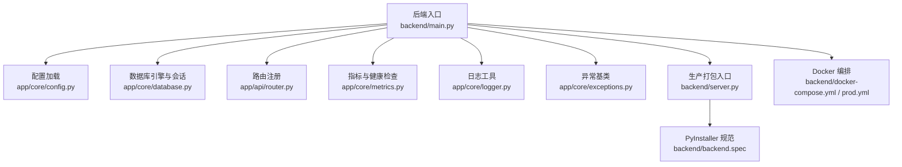
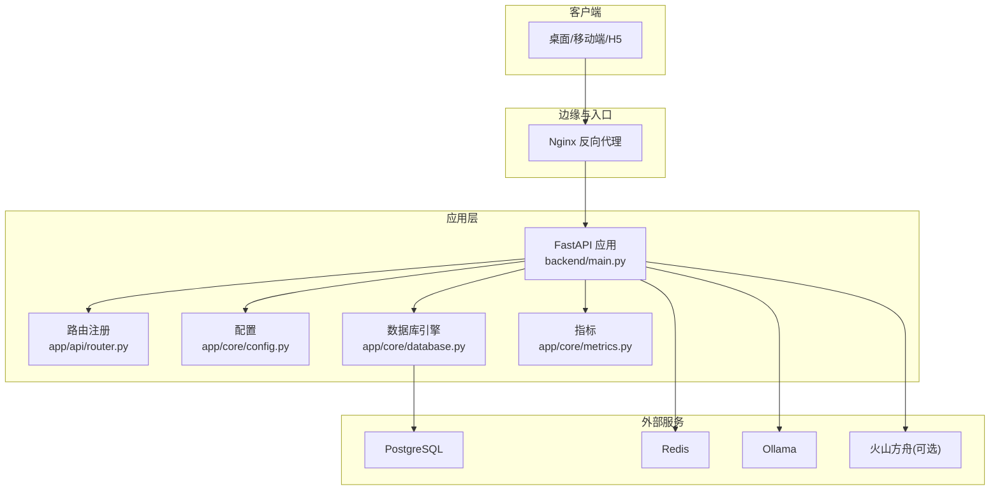
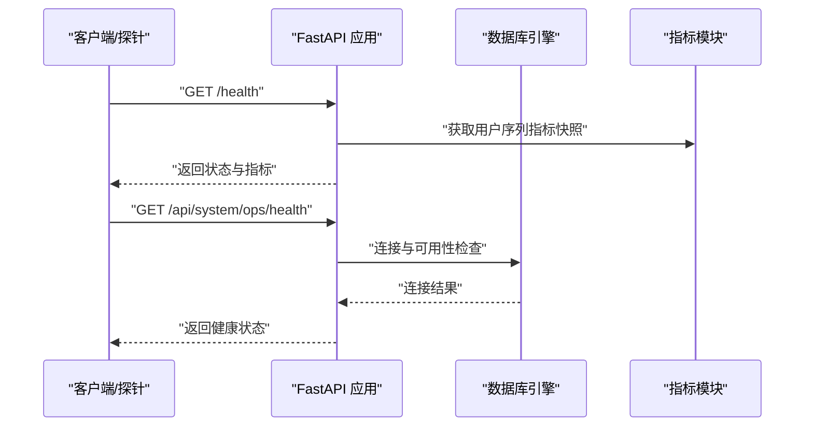
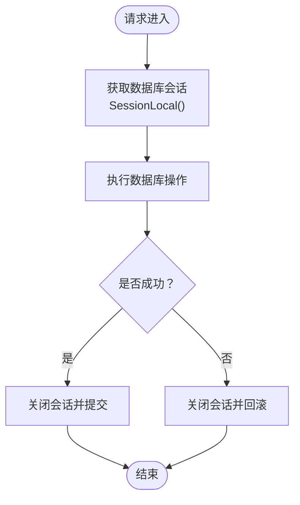
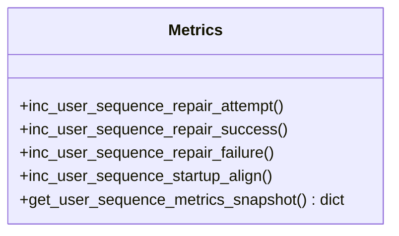
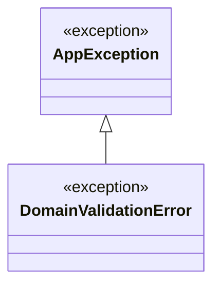
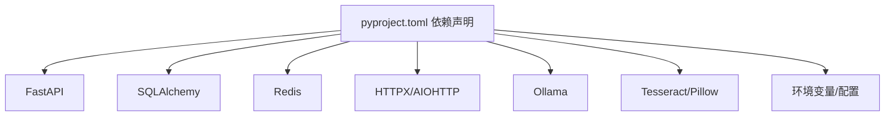

# 故障排除

<cite>
**本文引用的文件**
- [backend/README.md](file://backend/README.md)
- [backend/pyproject.toml](file://backend/pyproject.toml)
- [backend/main.py](file://backend/main.py)
- [backend/server.py](file://backend/server.py)
- [backend/backend.spec](file://backend/backend.spec)
- [backend/app/core/config.py](file://backend/app/core/config.py)
- [backend/app/core/database.py](file://backend/app/core/database.py)
- [backend/app/core/logger.py](file://backend/app/core/logger.py)
- [backend/app/core/metrics.py](file://backend/app/core/metrics.py)
- [backend/app/core/exceptions.py](file://backend/app/core/exceptions.py)
- [backend/app/api/router.py](file://backend/app/api/router.py)
- [backend/docker-compose.yml](file://backend/docker-compose.yml)
- [backend/docker-compose.prod.yml](file://backend/docker-compose.prod.yml)
- [scripts/init_db.sh](file://scripts/init_db.sh)
- [scripts/backup_db.sh](file://scripts/backup_db.sh)
- [scripts/restore_db.sh](file://scripts/restore_db.sh)
- [scripts/_deploy_check.py](file://scripts/_deploy_check.py)
- [scripts/_check_server.py](file://scripts/_check_server.py)
- [scripts/_diag.py](file://scripts/_diag.py)
- [scripts/_net_check.py](file://scripts/_net_check.py)
- [scripts/_net_check2.py](file://scripts/_net_check2.py)
- [scripts/_fix_env.py](file://scripts/_fix_env.py)
- [scripts/_fix_env_inject.py](file://scripts/_fix_env_inject.py)
- [scripts/_fix_backend_env_and_restart.py](file://scripts/_fix_backend_env_and_restart.py)
- [scripts/_fix_cors_and_restart.py](file://scripts/_fix_cors_and_restart.py)
- [scripts/_free_port_and_start_backend.py](file://scripts/_free_port_and_start_backend.py)
- [scripts/_hotfix_entrypoint_and_recover.py](file://scripts/_hotfix_entrypoint_and_recover.py)
- [scripts/_inspect_env_remote.py](file://scripts/_inspect_env_remote.py)
- [scripts/_verify_remote.py](file://scripts/_verify_remote.py)
- [deploy/README.md](file://deploy/README.md)
- [deploy/docker-compose.yml](file://deploy/docker-compose.yml)
- [deploy/postgres/README.md](file://deploy/postgres/README.md)
- [deploy/redis/README.md](file://deploy/redis/README.md)
- [deploy/nginx/README.md](file://deploy/nginx/README.md)
- [deploy/monitoring/README.md](file://deploy/monitoring/README.md)
- [docs/operations/incident-playbook.md](file://docs/operations/incident-playbook.md)
- [docs/deploy/rollback-guide.md](file://docs/deploy/rollback-guide.md)
- [docs/deploy/env-example.md](file://docs/deploy/env-example.md)
</cite>

## 目录
1. [简介](#简介)
2. [项目结构](#项目结构)
3. [核心组件](#核心组件)
4. [架构总览](#架构总览)
5. [详细组件分析](#详细组件分析)
6. [依赖关系分析](#依赖关系分析)
7. [性能考量](#性能考量)
8. [故障排除指南](#故障排除指南)
9. [结论](#结论)
10. [附录](#附录)

## 简介
本指南面向智获客系统的运维与开发人员，提供系统化的故障排除方法与应急流程。内容涵盖启动失败、连接超时、内存不足、慢查询、高延迟、资源瓶颈、日志分析、错误追踪、数据库与第三方服务问题处理、监控指标与告警响应策略，以及工具使用与自动化排查脚本。

## 项目结构
后端采用 FastAPI + SQLAlchemy + PostgreSQL 架构，配合 Redis、Ollama、火山方舟（Volcano Engine）等外部组件。系统通过 Docker Compose 编排，支持本地开发与生产部署。核心入口位于后端根目录，配置集中于 settings，数据库连接与会话工厂在 core/database 中定义，路由在 api/router 中统一注册。

图表来源
- [backend/main.py:1-138](file://backend/main.py#L1-L138)
- [backend/app/core/config.py:1-103](file://backend/app/core/config.py#L1-L103)
- [backend/app/core/database.py:1-29](file://backend/app/core/database.py#L1-L29)
- [backend/app/api/router.py:1-35](file://backend/app/api/router.py#L1-L35)
- [backend/app/core/metrics.py:1-44](file://backend/app/core/metrics.py#L1-L44)
- [backend/app/core/logger.py:1-6](file://backend/app/core/logger.py#L1-L6)
- [backend/app/core/exceptions.py:1-7](file://backend/app/core/exceptions.py#L1-L7)
- [backend/server.py:1-30](file://backend/server.py#L1-L30)
- [backend/backend.spec:1-148](file://backend/backend.spec#L1-L148)
- [backend/docker-compose.yml](file://backend/docker-compose.yml)
- [backend/docker-compose.prod.yml](file://backend/docker-compose.prod.yml)

章节来源
- [backend/README.md:90-107](file://backend/README.md#L90-L107)
- [backend/main.py:46-51](file://backend/main.py#L46-L51)
- [backend/app/core/config.py:15-103](file://backend/app/core/config.py#L15-L103)
- [backend/app/core/database.py:6-29](file://backend/app/core/database.py#L6-L29)
- [backend/app/api/router.py:32-35](file://backend/app/api/router.py#L32-L35)

## 核心组件
- 配置系统：集中管理数据库、JWT、CORS、AI 模型、限流、上传、WeCom、采集器等参数，并进行安全校验（如 SECRET_KEY 强度与 CORS 白名单）。
- 数据库层：基于 SQLAlchemy，启用连接池预检、池大小与溢出配置，提供会话工厂与上下文管理。
- 路由与中间件：统一注册各领域路由，内置 CORS 中间件，健康检查端点用于快速验证服务状态。
- 指标与可观测性：用户序列修复与对齐的计数指标，结合健康检查端点输出运行快照。
- 日志与异常：通用日志器与基础异常类型，便于统一记录与捕获。
- 打包与运行：PyInstaller 打包入口与规范，支持桌面端静态资源托管与 SPA 回退。

章节来源
- [backend/app/core/config.py:15-103](file://backend/app/core/config.py#L15-L103)
- [backend/app/core/database.py:6-29](file://backend/app/core/database.py#L6-L29)
- [backend/app/api/router.py:32-35](file://backend/app/api/router.py#L32-L35)
- [backend/app/core/metrics.py:36-44](file://backend/app/core/metrics.py#L36-L44)
- [backend/app/core/logger.py:4-6](file://backend/app/core/logger.py#L4-L6)
- [backend/app/core/exceptions.py:1-7](file://backend/app/core/exceptions.py#L1-L7)
- [backend/server.py:18-29](file://backend/server.py#L18-L29)
- [backend/backend.spec:12-147](file://backend/backend.spec#L12-L147)

## 架构总览
系统以 FastAPI 为核心，通过路由分发至各业务模块；数据库层负责持久化；Redis 用于分布式限流；Ollama 与火山方舟提供 AI 能力；Nginx 作为反向代理；PostgreSQL 与 Redis 通过 Docker Compose 编排。

图表来源
- [backend/main.py:46-51](file://backend/main.py#L46-L51)
- [backend/app/api/router.py:32-35](file://backend/app/api/router.py#L32-L35)
- [backend/app/core/config.py:72-89](file://backend/app/core/config.py#L72-L89)
- [backend/app/core/database.py:6-13](file://backend/app/core/database.py#L6-L13)
- [backend/docker-compose.yml](file://backend/docker-compose.yml)
- [backend/docker-compose.prod.yml](file://backend/docker-compose.prod.yml)

## 详细组件分析

### 启动与健康检查
- 启动阶段：应用在 lifespan 中执行用户序列健康检查，确保数据库主键序列一致性；随后注册路由并挂载静态资源。
- 健康检查端点：/health 返回服务状态与用户序列指标快照；运维健康检查端点 /api/system/ops/health 与 /api/system/ops/readiness 用于验证数据库、Redis、Ollama 状态。
- 打包运行：PyInstaller 打包入口 server.py 支持从环境变量 HOST/PORT 启动，打包模式禁用 reload。

图表来源
- [backend/main.py:22-35](file://backend/main.py#L22-L35)
- [backend/main.py:71-77](file://backend/main.py#L71-L77)
- [backend/app/core/metrics.py:36-44](file://backend/app/core/metrics.py#L36-L44)
- [backend/README.md:197-200](file://backend/README.md#L197-L200)

章节来源
- [backend/main.py:22-35](file://backend/main.py#L22-L35)
- [backend/main.py:71-77](file://backend/main.py#L71-L77)
- [backend/README.md:197-200](file://backend/README.md#L197-L200)
- [backend/server.py:18-29](file://backend/server.py#L18-L29)

### 数据库连接与会话
- 连接池：启用 pool_pre_ping，池大小与溢出配置，避免连接失效与突发流量导致的拥塞。
- 会话工厂：提供线程安全的 SessionLocal，确保请求生命周期内的事务一致性。
- 配置来源：DATABASE_URL 优先来自环境变量，其次回退到 alembic.ini 的 sqlalchemy.url。

图表来源
- [backend/app/core/database.py:15-29](file://backend/app/core/database.py#L15-L29)
- [backend/app/core/config.py:27-36](file://backend/app/core/config.py#L27-L36)

章节来源
- [backend/app/core/database.py:6-29](file://backend/app/core/database.py#L6-L29)
- [backend/app/core/config.py:27-36](file://backend/app/core/config.py#L27-L36)

### 路由与中间件
- 路由注册：统一在 api/router 中注册认证、内容、合规、客户、线索、发布、仪表板、洞察、系统、企业微信、v1/v2 版本路由。
- CORS 中间件：根据 CORS_ORIGINS 配置动态允许来源，生产环境禁止通配符。

图表来源
- [backend/app/api/router.py:16-35](file://backend/app/api/router.py#L16-L35)
- [backend/main.py:59-65](file://backend/main.py#L59-L65)

章节来源
- [backend/app/api/router.py:16-35](file://backend/app/api/router.py#L16-L35)
- [backend/main.py:59-65](file://backend/main.py#L59-L65)

### 指标与可观测性
- 用户序列指标：包含修复尝试、成功、失败与启动对齐次数，通过锁保护并发安全。
- 健康检查：/health 输出指标快照，辅助定位序列问题与启动异常。

图表来源
- [backend/app/core/metrics.py:12-44](file://backend/app/core/metrics.py#L12-L44)

章节来源
- [backend/app/core/metrics.py:12-44](file://backend/app/core/metrics.py#L12-L44)

### 日志与异常
- 日志器：提供按模块命名的 Logger 实例，便于分类记录。
- 异常基类：AppException 作为领域错误基类，DomainValidationError 用于业务校验失败场景。

图表来源
- [backend/app/core/exceptions.py:1-7](file://backend/app/core/exceptions.py#L1-L7)

章节来源
- [backend/app/core/exceptions.py:1-7](file://backend/app/core/exceptions.py#L1-L7)

## 依赖关系分析
- 应用依赖：FastAPI、SQLAlchemy、Pydantic、Redis、HTTP 客户端、OCR/图像处理等。
- 运行时依赖：PostgreSQL、Redis、Ollama、火山方舟（可选）。
- 部署依赖：Docker Compose、Nginx、监控与备份脚本。

图表来源
- [backend/pyproject.toml:7-31](file://backend/pyproject.toml#L7-L31)

章节来源
- [backend/pyproject.toml:7-31](file://backend/pyproject.toml#L7-L31)

## 性能考量
- 连接池与预检：pool_pre_ping 与池大小/溢出配置有助于降低连接失效与突发压力。
- 限流策略：Redis 分布式限流（降级到进程内限流），减少上游服务压力。
- AI 调用：Ark 调用记录日志，便于分析耗时与成功率。
- 健康检查：定期调用 /api/system/ops/health 与 /api/system/ops/readiness，提前发现数据库、缓存与模型服务异常。

章节来源
- [backend/app/core/database.py:10-13](file://backend/app/core/database.py#L10-L13)
- [backend/README.md:160-162](file://backend/README.md#L160-L162)
- [backend/app/core/config.py:86-89](file://backend/app/core/config.py#L86-L89)

## 故障排除指南

### 启动失败
- 症状：服务无法启动或启动后立即退出。
- 排查步骤：
  - 检查环境变量与 .env 配置，确认 DATABASE_URL、SECRET_KEY、CORS_ORIGINS 等。
  - 查看容器日志：docker-compose logs -f backend。
  - 使用健康检查端点验证数据库、Redis、Ollama 状态。
  - 若为打包运行，确认 HOST/PORT 环境变量与端口占用情况。
- 解决方案：
  - 修复 .env 中的无效配置，确保 SECRET_KEY 长度≥32且非默认占位值。
  - 使用 scripts/_fix_env.py 与 _fix_env_inject.py 修正环境注入问题。
  - 使用 scripts/_free_port_and_start_backend.py 释放被占用端口后重启。
  - 使用 scripts/_hotfix_entrypoint_and_recover.py 修复入口异常后恢复。

章节来源
- [backend/README.md:223-233](file://backend/README.md#L223-L233)
- [backend/README.md:212-221](file://backend/README.md#L212-L221)
- [backend/server.py:18-29](file://backend/server.py#L18-L29)
- [scripts/_fix_env.py](file://scripts/_fix_env.py)
- [scripts/_fix_env_inject.py](file://scripts/_fix_env_inject.py)
- [scripts/_free_port_and_start_backend.py](file://scripts/_free_port_and_start_backend.py)
- [scripts/_hotfix_entrypoint_and_recover.py](file://scripts/_hotfix_entrypoint_and_recover.py)

### 连接超时与数据库不可达
- 症状：请求超时、数据库连接失败、健康检查失败。
- 排查步骤：
  - 使用 scripts/_net_check.py 与 _net_check2.py 检查网络连通性与端口可达性。
  - 确认 PostgreSQL 服务状态与监听地址/端口。
  - 检查连接池配置与数据库负载。
- 解决方案：
  - 使用 scripts/init_db.sh 初始化数据库或修复权限。
  - 使用 scripts/backup_db.sh 与 restore_db.sh 进行备份与恢复。
  - 调整连接池参数（pool_size、max_overflow）以适配峰值流量。

章节来源
- [scripts/_net_check.py](file://scripts/_net_check.py)
- [scripts/_net_check2.py](file://scripts/_net_check2.py)
- [scripts/init_db.sh](file://scripts/init_db.sh)
- [scripts/backup_db.sh](file://scripts/backup_db.sh)
- [scripts/restore_db.sh](file://scripts/restore_db.sh)
- [backend/app/core/database.py:10-13](file://backend/app/core/database.py#L10-L13)

### 内存不足与高延迟
- 症状：进程 OOM、响应缓慢、CPU 占用高。
- 排查步骤：
  - 结合系统监控查看内存/CPU/IO 使用率。
  - 分析慢查询：检查数据库慢日志与长事务。
  - 检查 AI 任务队列与并发限制，必要时降低并发或扩容。
- 解决方案：
  - 优化数据库索引与查询计划，减少全表扫描。
  - 调整连接池与限流阈值，避免瞬时洪峰。
  - 对热点接口增加缓存（如 Redis），并评估缓存命中率。

章节来源
- [backend/app/core/config.py:86-89](file://backend/app/core/config.py#L86-L89)
- [backend/app/core/database.py:10-13](file://backend/app/core/database.py#L10-L13)

### 日志分析与错误追踪
- 日志位置：Docker 容器日志；本地开发可通过 uvicorn 控制台查看。
- 关注点：
  - 数据库连接异常与会话泄漏。
  - AI 调用失败与超时（Ark 调用日志）。
  - 用户序列修复与启动对齐失败。
- 工具：
  - 使用 scripts/_diag.py 进行系统性诊断。
  - 使用 scripts/_inspect_env_remote.py 检查远端环境变量。

章节来源
- [backend/README.md:23-27](file://backend/README.md#L23-L27)
- [backend/README.md:160-162](file://backend/README.md#L160-L162)
- [backend/app/core/metrics.py:36-44](file://backend/app/core/metrics.py#L36-L44)
- [scripts/_diag.py](file://scripts/_diag.py)
- [scripts/_inspect_env_remote.py](file://scripts/_inspect_env_remote.py)

### 紧急处理流程与应急预案
- 流程要点：
  - 快速隔离：停止新流量进入，保留关键端点可用。
  - 降级策略：关闭非关键 AI 功能，启用本地模型或降级限流。
  - 快速恢复：修复配置后重启，验证 /health 与 /api/system/ops/health。
  - 回滚策略：参考 docs/deploy/rollback-guide.md 执行回滚。
- 工具：
  - 使用 scripts/_deploy_check.py 与 _verify_remote.py 进行部署验证。
  - 使用 scripts/_fix_backend_env_and_restart.py 一键修复并重启。

章节来源
- [docs/operations/incident-playbook.md](file://docs/operations/incident-playbook.md)
- [docs/deploy/rollback-guide.md](file://docs/deploy/rollback-guide.md)
- [scripts/_deploy_check.py](file://scripts/_deploy_check.py)
- [scripts/_verify_remote.py](file://scripts/_verify_remote.py)
- [scripts/_fix_backend_env_and_restart.py](file://scripts/_fix_backend_env_and_restart.py)

### 监控指标与告警响应
- 指标建议：
  - 数据库：连接数、等待时间、慢查询数、事务失败率。
  - 应用：请求延迟 P50/P95、错误率、队列长度、限流触发次数。
  - 外部服务：Ark 调用成功率、平均耗时、超时次数。
- 告警策略：
  - 延迟与错误率超过阈值持续 N 分钟触发告警。
  - 连接池耗尽或限流频繁触发即时告警。
  - 健康检查连续失败触发最高级别告警。

章节来源
- [backend/README.md:160-162](file://backend/README.md#L160-L162)
- [backend/app/core/metrics.py:36-44](file://backend/app/core/metrics.py#L36-L44)

### 数据库问题
- 常见问题：连接失败、死锁、慢查询、主键序列不一致。
- 处理方法：
  - 使用 scripts/init_db.sh 初始化或修复。
  - 使用 scripts/backup_db.sh 与 restore_db.sh 进行备份与恢复。
  - 检查索引与查询计划，必要时重建索引。
  - 关注用户序列修复与启动对齐指标，定位序列漂移。

章节来源
- [scripts/init_db.sh](file://scripts/init_db.sh)
- [scripts/backup_db.sh](file://scripts/backup_db.sh)
- [scripts/restore_db.sh](file://scripts/restore_db.sh)
- [backend/app/core/metrics.py:36-44](file://backend/app/core/metrics.py#L36-L44)

### 网络问题
- 症状：服务间通信失败、超时、DNS 解析异常。
- 处理方法：
  - 使用 scripts/_net_check.py 与 _net_check2.py 检查连通性与端口。
  - 校验容器网络与端口映射，确保服务暴露正确。
  - 检查防火墙与安全组策略。

章节来源
- [scripts/_net_check.py](file://scripts/_net_check.py)
- [scripts/_net_check2.py](file://scripts/_net_check2.py)

### 第三方服务故障（火山方舟、OCR、存储）
- 症状：Ark 调用失败、OCR 识别异常、对象存储不可用。
- 处理方法：
  - 切换到本地模型或降级限流，避免级联故障。
  - 检查 API Key、Base URL、超时配置。
  - 使用 app/integrations 下对应模块的日志与重试机制。

章节来源
- [backend/app/core/config.py:76-84](file://backend/app/core/config.py#L76-L84)

### 工具使用指南与自动化排查脚本
- 常用脚本：
  - _deploy_check.py、_verify_remote.py：部署验证与远端校验。
  - _diag.py、_tmp_diag.py：系统性诊断。
  - _net_check.py、_net_check2.py：网络连通性检查。
  - _fix_env.py、_fix_env_inject.py、_fix_backend_env_and_restart.py：环境修复与重启。
  - _fix_cors_and_restart.py：CORS 配置修复。
  - _free_port_and_start_backend.py：端口释放与启动。
  - _hotfix_entrypoint_and_recover.py：入口修复与恢复。
  - init_db.sh、backup_db.sh、restore_db.sh：数据库初始化与备份恢复。
- 使用建议：
  - 在生产环境谨慎执行修复脚本，优先在测试环境验证。
  - 执行前做好备份与变更记录，遵循变更管理流程。

章节来源
- [scripts/_deploy_check.py](file://scripts/_deploy_check.py)
- [scripts/_verify_remote.py](file://scripts/_verify_remote.py)
- [scripts/_diag.py](file://scripts/_diag.py)
- [scripts/_net_check.py](file://scripts/_net_check.py)
- [scripts/_net_check2.py](file://scripts/_net_check2.py)
- [scripts/_fix_env.py](file://scripts/_fix_env.py)
- [scripts/_fix_env_inject.py](file://scripts/_fix_env_inject.py)
- [scripts/_fix_backend_env_and_restart.py](file://scripts/_fix_backend_env_and_restart.py)
- [scripts/_fix_cors_and_restart.py](file://scripts/_fix_cors_and_restart.py)
- [scripts/_free_port_and_start_backend.py](file://scripts/_free_port_and_start_backend.py)
- [scripts/_hotfix_entrypoint_and_recover.py](file://scripts/_hotfix_entrypoint_and_recover.py)
- [scripts/init_db.sh](file://scripts/init_db.sh)
- [scripts/backup_db.sh](file://scripts/backup_db.sh)
- [scripts/restore_db.sh](file://scripts/restore_db.sh)

## 结论
通过规范的配置管理、完善的健康检查、可观测性指标与自动化脚本，智获客系统能够在多数故障场景下实现快速定位与恢复。建议将本指南纳入日常运维手册，结合监控告警形成闭环，持续优化性能与稳定性。

## 附录
- 部署与编排：参考 deploy/README.md 与 deploy/docker-compose.yml。
- 环境示例：docs/deploy/env-example.md。
- 回滚指南：docs/deploy/rollback-guide.md。