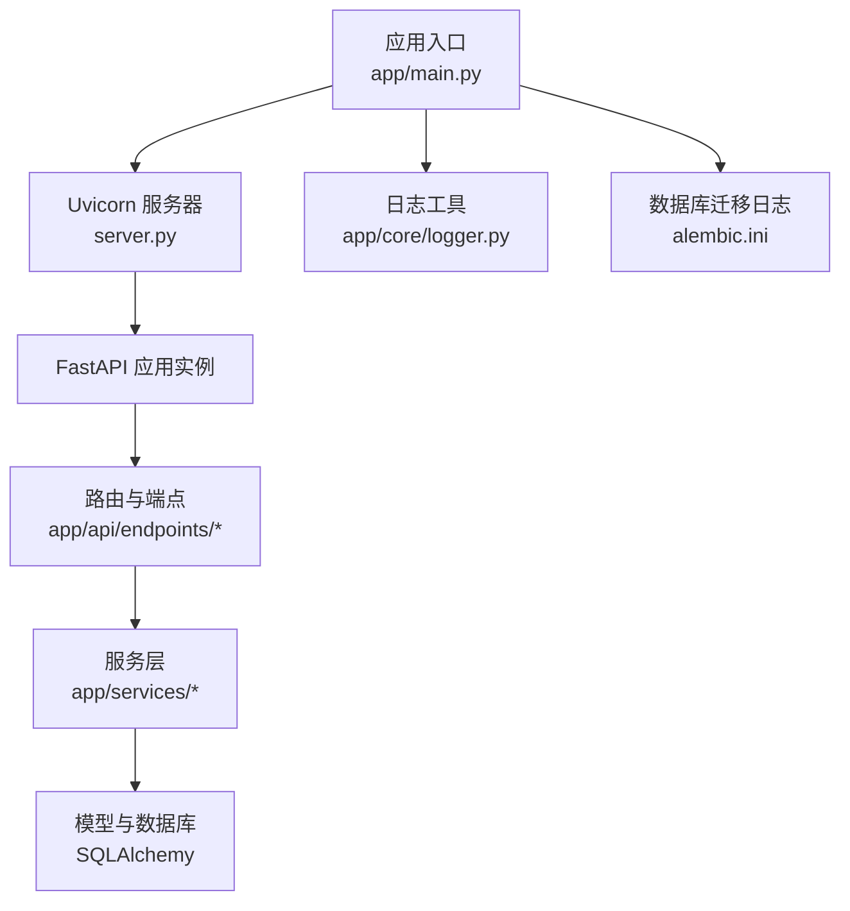
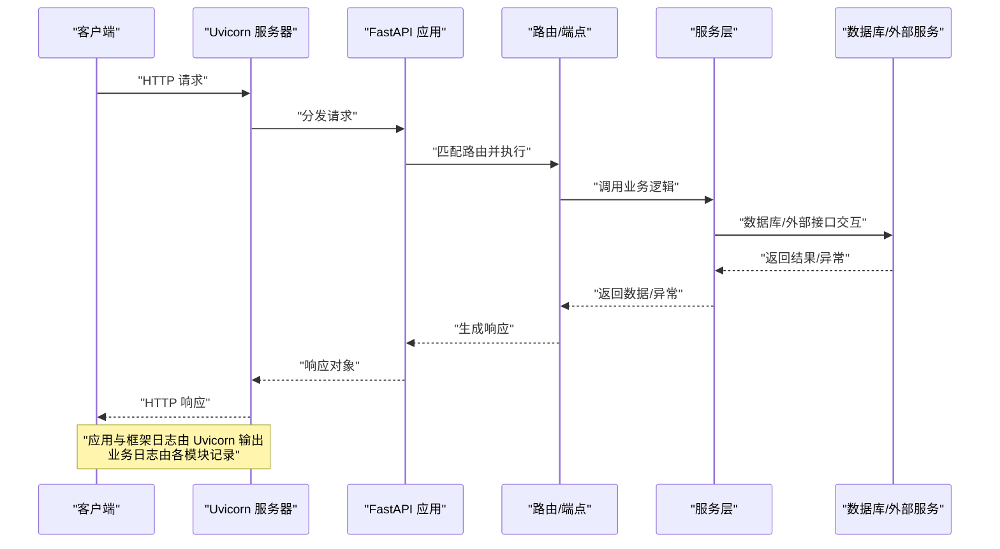
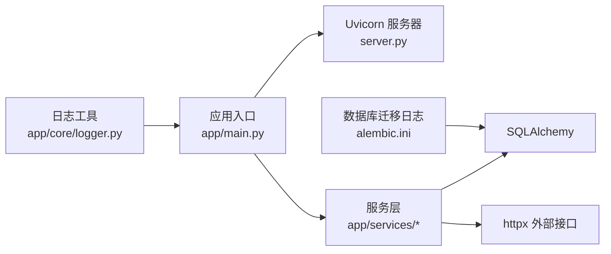

# 日志分析

<cite>
**本文引用的文件**
- [backend/app/core/logger.py](file://backend/app/core/logger.py)
- [backend/app/main.py](file://backend/app/main.py)
- [backend/server.py](file://backend/server.py)
- [backend/alembic.ini](file://backend/alembic.ini)
- [backend/app/services/user_service.py](file://backend/app/services/user_service.py)
- [backend/app/api/endpoints/auth.py](file://backend/app/api/endpoints/auth.py)
- [backend/app/api/endpoints/customer.py](file://backend/app/api/endpoints/customer.py)
- [backend/app/api/endpoints/lead.py](file://backend/app/api/endpoints/lead.py)
- [backend/pyproject.toml](file://backend/pyproject.toml)
</cite>

## 目录
1. [简介](#简介)
2. [项目结构](#项目结构)
3. [核心组件](#核心组件)
4. [架构总览](#架构总览)
5. [详细组件分析](#详细组件分析)
6. [依赖分析](#依赖分析)
7. [性能考虑](#性能考虑)
8. [故障排查指南](#故障排查指南)
9. [结论](#结论)
10. [附录](#附录)

## 简介
本指南面向“智获客”系统的运维与开发人员，提供一套完整的日志分析方法论与实操建议。内容涵盖日志系统架构与配置、日志级别与格式、输出目标、关键字段含义与分析技巧、错误/访问/业务日志的解读方法、日志聚合与检索最佳实践、常见错误特征与排查思路、问题重现与根因分析流程，以及日志监控与告警配置建议。读者可据此快速定位问题、沉淀经验并优化系统稳定性。

## 项目结构
后端采用 FastAPI + Uvicorn 的标准 Python Web 架构，日志体系由以下部分组成：
- 应用启动与生命周期：主程序负责应用实例创建、中间件注册、路由挂载与健康检查。
- 日志工具：统一通过标准库 logging 获取 Logger 实例，便于集中管理与扩展。
- 数据库迁移：Alembic 使用独立的日志配置，控制 SQLAlchemy 与 Alembic 的日志级别。
- 打包运行：PyInstaller 打包入口通过 server.py 设置 Uvicorn 的日志级别。

图表来源
- [backend/app/main.py:1-138](file://backend/app/main.py#L1-L138)
- [backend/server.py:1-30](file://backend/server.py#L1-L30)
- [backend/app/core/logger.py:1-6](file://backend/app/core/logger.py#L1-L6)
- [backend/alembic.ini:1-42](file://backend/alembic.ini#L1-L42)

章节来源
- [backend/app/main.py:1-138](file://backend/app/main.py#L1-L138)
- [backend/server.py:1-30](file://backend/server.py#L1-L30)
- [backend/app/core/logger.py:1-6](file://backend/app/core/logger.py#L1-L6)
- [backend/alembic.ini:1-42](file://backend/alembic.ini#L1-L42)

## 核心组件
- 日志工具函数：提供统一的 Logger 获取方式，便于在各模块中复用。
- 应用生命周期日志：在启动阶段进行健康检查并记录异常，确保序列一致性等关键步骤有据可查。
- 服务层日志：在关键业务流程（如用户注册、序列修复重试）记录事件与指标，支持审计与追踪。
- 认证与外部集成日志：对外部服务调用（如企业微信）进行错误与状态记录，便于定位集成问题。
- 数据库迁移日志：通过 Alembic 配置控制 SQLAlchemy 与 Alembic 的日志级别，避免噪声干扰。

章节来源
- [backend/app/core/logger.py:1-6](file://backend/app/core/logger.py#L1-L6)
- [backend/app/main.py:22-35](file://backend/app/main.py#L22-L35)
- [backend/app/services/user_service.py:24-153](file://backend/app/services/user_service.py#L24-L153)
- [backend/app/api/endpoints/auth.py:44-74](file://backend/app/api/endpoints/auth.py#L44-L74)

## 架构总览
下图展示从请求进入至响应返回的关键日志落点与来源模块，帮助理解日志在系统中的流动路径与落盘位置。

图表来源
- [backend/app/main.py:46-68](file://backend/app/main.py#L46-L68)
- [backend/server.py:22-29](file://backend/server.py#L22-L29)

## 详细组件分析

### 日志系统架构与配置
- 日志级别与格式
  - 应用层：通过 Uvicorn 的 log_level 控制框架日志级别，默认在打包入口设置为 info。
  - 数据库迁移：Alembic 配置对 SQLAlchemy 与 Alembic 的日志分别设定级别，通用格式包含级别、名称与消息。
- 输出目标
  - 默认输出到标准错误流，便于容器与日志收集系统采集。
- 日志工具
  - 统一通过 logging.getLogger 获取 Logger，便于后续接入结构化日志与集中化存储。

章节来源
- [backend/server.py:22-29](file://backend/server.py#L22-L29)
- [backend/alembic.ini:19-42](file://backend/alembic.ini#L19-L42)
- [backend/app/core/logger.py:1-6](file://backend/app/core/logger.py#L1-L6)

### 关键日志字段与含义
- 时间戳：用于排序与关联分析。
- 级别：区分普通信息、警告、错误等，便于筛选与告警。
- 名称：标识日志来源模块或组件，便于定位问题域。
- 消息：描述事件内容，配合上下文字段可实现结构化分析。
- 上下文字段（extra）：用于携带事件类型、约束名、用户 ID、请求 ID 等关键元数据，提升检索与聚合效率。

章节来源
- [backend/alembic.ini:40-42](file://backend/alembic.ini#L40-L42)
- [backend/app/services/user_service.py:104-146](file://backend/app/services/user_service.py#L104-L146)

### 错误日志解读
- 用户注册序列修复
  - 特征：检测到主键冲突时尝试修复序列并重试，记录事件类型与约束名；若重试失败则记录失败事件。
  - 排查：关注序列修复尝试次数、约束名、重试是否成功；结合数据库状态与并发写入量评估风险。
- 外部服务调用失败
  - 特征：企业微信获取 access_token 或用户信息失败时抛出 HTTP 异常并记录错误详情。
  - 排查：核对企业微信配置、网络连通性、配额限制与超时设置。

章节来源
- [backend/app/services/user_service.py:101-151](file://backend/app/services/user_service.py#L101-L151)
- [backend/app/api/endpoints/auth.py:51-74](file://backend/app/api/endpoints/auth.py#L51-L74)
- [backend/app/api/endpoints/auth.py:218-254](file://backend/app/api/endpoints/auth.py#L218-L254)

### 访问日志解读
- 访问路径：由 Uvicorn 输出，包含请求方法、路径、状态码与耗时等信息。
- 分析要点：统计 4xx/5xx 比例、慢请求分布、峰值 QPS、热点端点；结合业务流量特征识别异常波动。

章节来源
- [backend/server.py:22-29](file://backend/server.py#L22-L29)

### 业务日志解读
- 启动健康检查：记录用户序列对齐结果与异常，便于上线后快速发现数据一致性问题。
- 权限与认证：记录认证失败、权限不足、外部 OAuth 配置缺失等情况，辅助安全审计与问题定位。
- 客户与线索管理：记录查询、更新、删除等操作的边界条件与异常分支，支撑业务闭环验证。

章节来源
- [backend/app/main.py:25-33](file://backend/app/main.py#L25-L33)
- [backend/app/api/endpoints/auth.py:185-254](file://backend/app/api/endpoints/auth.py#L185-L254)
- [backend/app/api/endpoints/customer.py:21-94](file://backend/app/api/endpoints/customer.py#L21-L94)
- [backend/app/api/endpoints/lead.py:29-175](file://backend/app/api/endpoints/lead.py#L29-L175)

### 日志聚合、过滤与搜索最佳实践
- 结构化字段优先：在日志中使用 extra 字段记录事件类型、用户 ID、资源 ID、约束名等，便于后续过滤与聚合。
- 分层过滤：先按级别过滤（如 ERROR/WARNING），再按模块/端点过滤，最后按关键词与时间窗口收敛。
- 关联分析：以请求 ID 或会话 ID 串联访问日志与业务日志，还原完整调用链。
- 指标化：将关键事件转化为指标（如序列修复成功率、外部接口错误率）并可视化，便于趋势观察。

章节来源
- [backend/app/services/user_service.py:104-146](file://backend/app/services/user_service.py#L104-L146)

### 常见错误类型与排查思路
- 数据库主键冲突
  - 特征：用户注册时出现唯一约束冲突；触发序列修复与重试。
  - 思路：检查导入数据的主键范围、并发写入策略与序列状态；必要时手动校正序列。
- 外部服务不可用
  - 特征：企业微信接口返回错误或网络异常。
  - 思路：核对配置项、重试策略与超时设置；在网关或代理层增加熔断与降级。
- 权限不足或认证失败
  - 特征：认证端点返回 401/403 或服务不可用。
  - 思路：检查令牌有效性、角色权限与外部 OAuth 配置开关。

章节来源
- [backend/app/services/user_service.py:91-151](file://backend/app/services/user_service.py#L91-L151)
- [backend/app/api/endpoints/auth.py:185-254](file://backend/app/api/endpoints/auth.py#L185-L254)

### 问题重现与根因分析
- 复现步骤
  - 明确触发条件（如特定并发写入、导入数据、外部服务抖动）。
  - 收集相关时间段内的访问日志、业务日志与错误日志。
  - 通过请求 ID 关联调用链，定位首错点与传播路径。
- 根因分析
  - 从日志中提取关键字段（事件类型、约束名、错误码、外部服务返回码）。
  - 结合数据库状态与外部服务可用性，判断是数据问题、配置问题还是外部依赖问题。

章节来源
- [backend/app/services/user_service.py:104-146](file://backend/app/services/user_service.py#L104-L146)
- [backend/app/api/endpoints/auth.py:51-74](file://backend/app/api/endpoints/auth.py#L51-L74)

### 日志监控与告警配置建议
- 告警维度
  - 错误率：ERROR/WARNING 占比异常升高。
  - 外部依赖错误：企业微信等接口错误率突增。
  - 启动异常：启动健康检查失败或序列修复失败。
- 告警阈值
  - 基于历史基线设定阈值，并结合业务峰谷动态调整。
- 告警渠道
  - 集成企业微信/钉钉机器人或邮件通知，确保及时处置。
- 可视化
  - 展示错误趋势、端点错误分布、外部依赖可用性与关键指标。

章节来源
- [backend/app/services/user_service.py:104-146](file://backend/app/services/user_service.py#L104-L146)
- [backend/app/api/endpoints/auth.py:218-254](file://backend/app/api/endpoints/auth.py#L218-L254)

## 依赖分析
- 模块耦合
  - 应用入口依赖 Uvicorn 与 FastAPI；服务层依赖 SQLAlchemy；外部集成依赖 httpx。
- 日志依赖
  - 日志工具依赖标准库 logging；业务日志通过 Logger 记录；框架日志由 Uvicorn 输出。
- 配置依赖
  - Alembic 配置独立于应用配置，但共享数据库连接参数；应用通过环境变量加载配置。

图表来源
- [backend/app/core/logger.py:1-6](file://backend/app/core/logger.py#L1-L6)
- [backend/app/main.py:1-138](file://backend/app/main.py#L1-L138)
- [backend/server.py:1-30](file://backend/server.py#L1-L30)
- [backend/alembic.ini:1-42](file://backend/alembic.ini#L1-L42)

章节来源
- [backend/app/core/logger.py:1-6](file://backend/app/core/logger.py#L1-L6)
- [backend/app/main.py:1-138](file://backend/app/main.py#L1-L138)
- [backend/server.py:1-30](file://backend/server.py#L1-L30)
- [backend/alembic.ini:1-42](file://backend/alembic.ini#L1-L42)

## 性能考虑
- 日志级别选择：生产环境建议 INFO 或更高，避免过多 DEBUG 信息影响 I/O。
- 结构化日志：使用 extra 字段承载关键元数据，减少解析成本。
- 异步写入：在高并发场景下考虑异步日志写入或批量刷盘，降低阻塞风险。
- 采样与脱敏：对敏感字段进行脱敏处理，对高频事件进行采样，平衡可观测性与性能。

## 故障排查指南
- 快速定位
  - 以时间窗与状态码为索引，筛选 ERROR/WARNING。
  - 通过请求 ID 关联访问日志与业务日志，还原调用链。
- 常见问题
  - 用户注册失败：检查用户名/邮箱冲突、序列修复是否成功。
  - 企业微信认证失败：检查配置项、网络连通性与返回码。
- 处置建议
  - 对外依赖问题：增加重试与熔断；对数据问题：补充校验与回滚策略。

章节来源
- [backend/app/services/user_service.py:91-151](file://backend/app/services/user_service.py#L91-L151)
- [backend/app/api/endpoints/auth.py:218-254](file://backend/app/api/endpoints/auth.py#L218-L254)

## 结论
通过统一的日志工具、清晰的日志级别与格式、完善的业务事件记录与结构化字段，结合访问日志与错误日志的协同分析，可以高效地定位问题、沉淀经验并持续优化系统稳定性。建议在现有基础上完善结构化字段与指标化监控，形成闭环的可观测性体系。

## 附录
- 参考配置文件
  - 应用日志与启动配置：[backend/server.py:1-30](file://backend/server.py#L1-L30)
  - Alembic 日志配置：[backend/alembic.ini:1-42](file://backend/alembic.ini#L1-L42)
  - 依赖与工具链：[backend/pyproject.toml:1-47](file://backend/pyproject.toml#L1-L47)