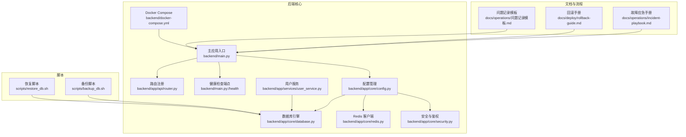
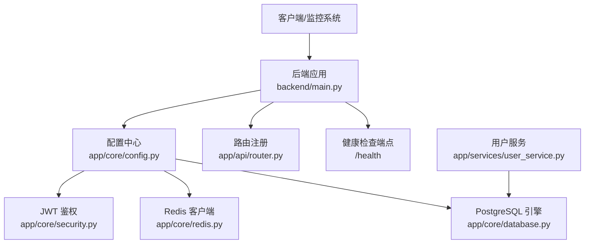
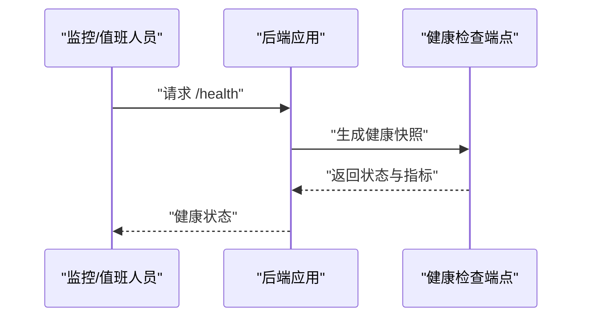
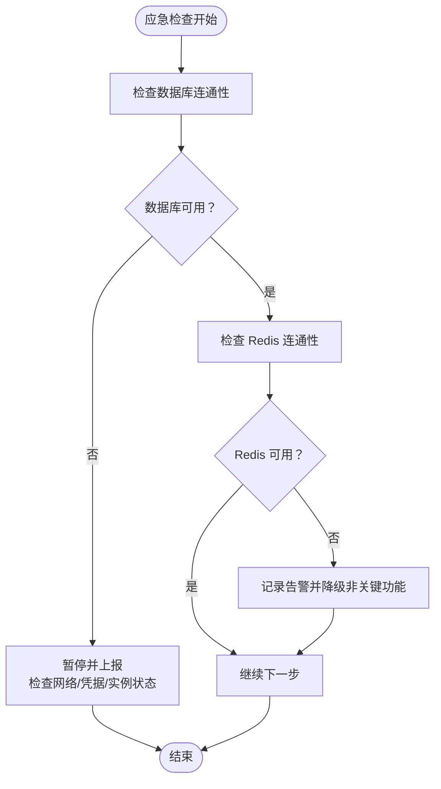
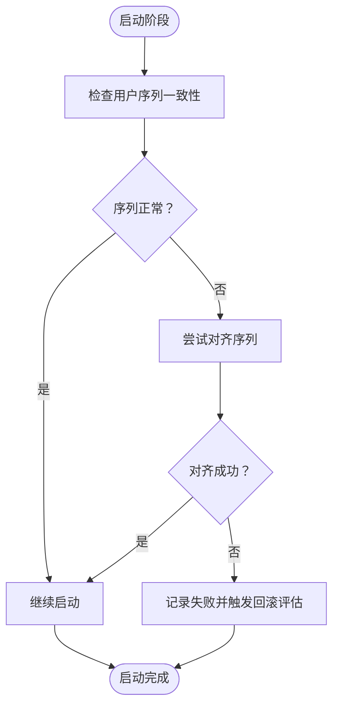
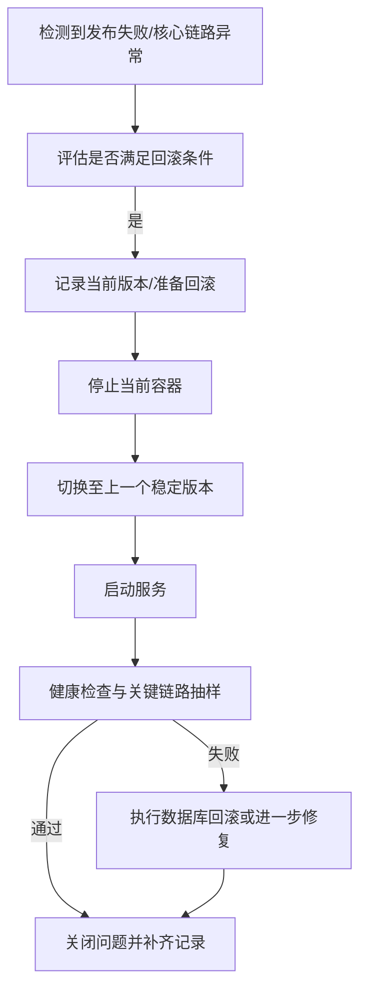
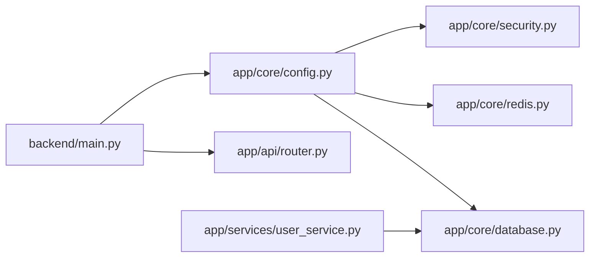

# 紧急处理流程

<cite>
**本文引用的文件**
- [docs/operations/incident-playbook.md](file://docs/operations/incident-playbook.md)
- [docs/deploy/rollback-guide.md](file://docs/deploy/rollback-guide.md)
- [docs/operations/问题记录模板.md](file://docs/operations/问题记录模板.md)
- [backend/main.py](file://backend/main.py)
- [backend/app/api/router.py](file://backend/app/api/router.py)
- [backend/app/core/config.py](file://backend/app/core/config.py)
- [backend/app/core/database.py](file://backend/app/core/database.py)
- [backend/app/core/redis.py](file://backend/app/core/redis.py)
- [backend/app/core/security.py](file://backend/app/core/security.py)
- [backend/app/services/user_service.py](file://backend/app/services/user_service.py)
- [backend/docker-compose.yml](file://backend/docker-compose.yml)
- [scripts/backup_db.sh](file://scripts/backup_db.sh)
- [scripts/restore_db.sh](file://scripts/restore_db.sh)
</cite>

## 目录
1. [简介](#简介)
2. [项目结构](#项目结构)
3. [核心组件](#核心组件)
4. [架构总览](#架构总览)
5. [详细组件分析](#详细组件分析)
6. [依赖分析](#依赖分析)
7. [性能考虑](#性能考虑)
8. [故障排查指南](#故障排查指南)
9. [结论](#结论)
10. [附录](#附录)

## 简介
本指南面向“智获客系统”的紧急处理与应急响应，覆盖系统崩溃、数据丢失、安全事件等突发状况的处置步骤，明确故障升级流程与责任分工，提供快速隔离影响范围、恢复关键服务的方法，并给出数据备份恢复、系统回滚与热修复操作指引。同时，阐明与运维团队的协作流程与沟通机制，提供紧急联系人与联系方式模板，以及事后分析与改进流程，帮助通过演练持续提升应急响应能力。

## 项目结构
围绕紧急处理相关的关键文件与职责分布如下：
- 运维与应急文档：故障应急手册、回滚手册、问题记录模板
- 后端运行与健康检查：主入口、路由注册、健康检查端点
- 配置与连接：数据库、Redis、CORS、JWT、速率限制等
- 用户服务与序列一致性：用户注册、认证、序列修复
- 部署与编排：本地开发/测试环境的 Docker Compose
- 备份与恢复脚本：数据库备份与恢复脚本（待实现）

图表来源
- [backend/main.py:71-77](file://backend/main.py#L71-L77)
- [backend/app/api/router.py:32-35](file://backend/app/api/router.py#L32-L35)
- [backend/app/core/config.py:27-35](file://backend/app/core/config.py#L27-L35)
- [backend/app/core/database.py:6-13](file://backend/app/core/database.py#L6-L13)
- [backend/app/core/redis.py:6-8](file://backend/app/core/redis.py#L6-L8)
- [backend/app/core/security.py:28-39](file://backend/app/core/security.py#L28-L39)
- [backend/app/services/user_service.py:48-58](file://backend/app/services/user_service.py#L48-L58)
- [backend/docker-compose.yml:24-38](file://backend/docker-compose.yml#L24-L38)
- [scripts/backup_db.sh:1-4](file://scripts/backup_db.sh#L1-L4)
- [scripts/restore_db.sh:1-4](file://scripts/restore_db.sh#L1-L4)

章节来源
- [backend/main.py:71-77](file://backend/main.py#L71-L77)
- [backend/app/api/router.py:32-35](file://backend/app/api/router.py#L32-L35)
- [backend/app/core/config.py:27-35](file://backend/app/core/config.py#L27-L35)
- [backend/app/core/database.py:6-13](file://backend/app/core/database.py#L6-L13)
- [backend/app/core/redis.py:6-8](file://backend/app/core/redis.py#L6-L8)
- [backend/app/core/security.py:28-39](file://backend/app/core/security.py#L28-L39)
- [backend/app/services/user_service.py:48-58](file://backend/app/services/user_service.py#L48-L58)
- [backend/docker-compose.yml:24-38](file://backend/docker-compose.yml#L24-L38)
- [scripts/backup_db.sh:1-4](file://scripts/backup_db.sh#L1-L4)
- [scripts/restore_db.sh:1-4](file://scripts/restore_db.sh#L1-L4)

## 核心组件
- 应用主入口与生命周期：负责启动前健康检查、CORS 配置、路由注册与健康检查端点
- 路由注册：集中注册各业务模块路由，便于统一治理与快速定位
- 健康检查端点：提供系统健康状态快照，支持快速判断服务可用性
- 配置与连接：数据库、Redis、JWT、速率限制、CORS 等关键参数集中管理
- 用户服务：包含用户序列修复逻辑，保障 ID 分配一致性
- Docker Compose：定义后端、数据库、缓存与模型服务的编排关系
- 备份与恢复脚本：提供数据库备份与恢复的脚本框架（待完善）

章节来源
- [backend/main.py:22-35](file://backend/main.py#L22-L35)
- [backend/app/api/router.py:32-35](file://backend/app/api/router.py#L32-L35)
- [backend/main.py:71-77](file://backend/main.py#L71-L77)
- [backend/app/core/config.py:27-35](file://backend/app/core/config.py#L27-L35)
- [backend/app/core/database.py:6-13](file://backend/app/core/database.py#L6-L13)
- [backend/app/core/redis.py:6-8](file://backend/app/core/redis.py#L6-L8)
- [backend/app/services/user_service.py:48-58](file://backend/app/services/user_service.py#L48-L58)
- [backend/docker-compose.yml:24-38](file://backend/docker-compose.yml#L24-L38)
- [scripts/backup_db.sh:1-4](file://scripts/backup_db.sh#L1-L4)
- [scripts/restore_db.sh:1-4](file://scripts/restore_db.sh#L1-L4)

## 架构总览
下图展示紧急处理涉及的关键组件与交互路径，强调健康检查、数据库与缓存、鉴权与速率限制等关键路径。

图表来源
- [backend/main.py:71-77](file://backend/main.py#L71-L77)
- [backend/app/api/router.py:32-35](file://backend/app/api/router.py#L32-L35)
- [backend/app/core/config.py:27-35](file://backend/app/core/config.py#L27-L35)
- [backend/app/core/database.py:6-13](file://backend/app/core/database.py#L6-L13)
- [backend/app/core/redis.py:6-8](file://backend/app/core/redis.py#L6-L8)
- [backend/app/core/security.py:28-39](file://backend/app/core/security.py#L28-L39)
- [backend/app/services/user_service.py:48-58](file://backend/app/services/user_service.py#L48-L58)

## 详细组件分析

### 健康检查与快速诊断
- 健康检查端点用于快速确认服务可用性与关键指标快照
- 启动阶段进行用户序列一致性检查，避免 ID 冲突导致的异常
- 建议在应急响应中优先访问该端点，结合日志与监控进行综合判断

图表来源
- [backend/main.py:71-77](file://backend/main.py#L71-L77)

章节来源
- [backend/main.py:22-35](file://backend/main.py#L22-L35)
- [backend/main.py:71-77](file://backend/main.py#L71-L77)

### 数据库与缓存连接
- 数据库引擎与会话工厂集中于配置与数据库模块，确保连接池与预检策略一致
- Redis 客户端按配置注入，用于速率限制等分布式能力
- 应急时优先验证数据库与缓存连通性，必要时进行重试与降级

图表来源
- [backend/app/core/database.py:6-13](file://backend/app/core/database.py#L6-L13)
- [backend/app/core/redis.py:6-8](file://backend/app/core/redis.py#L6-L8)

章节来源
- [backend/app/core/database.py:6-13](file://backend/app/core/database.py#L6-L13)
- [backend/app/core/redis.py:6-8](file://backend/app/core/redis.py#L6-L8)

### 用户序列修复与回滚联动
- 用户服务在启动阶段对用户序列进行对齐，避免序列冲突引发的注册失败
- 回滚手册明确了回滚顺序与数据回滚原则，建议在出现序列或数据异常时优先评估回滚窗口

图表来源
- [backend/app/services/user_service.py:48-58](file://backend/app/services/user_service.py#L48-L58)
- [docs/deploy/rollback-guide.md:31-35](file://docs/deploy/rollback-guide.md#L31-L35)

章节来源
- [backend/app/services/user_service.py:48-58](file://backend/app/services/user_service.py#L48-L58)
- [docs/deploy/rollback-guide.md:31-35](file://docs/deploy/rollback-guide.md#L31-L35)

### 回滚与热修复操作指南
- 回滚手册定义了触发条件、快速回滚流程、数据回滚原则与回滚后检查清单
- 建议在发布失败、核心链路不可用、错误率持续升高时启动回滚
- 回滚后需补齐问题记录与后续修复计划

图表来源
- [docs/deploy/rollback-guide.md:5-29](file://docs/deploy/rollback-guide.md#L5-L29)

章节来源
- [docs/deploy/rollback-guide.md:5-29](file://docs/deploy/rollback-guide.md#L5-L29)

### 数据备份与恢复
- 备份与恢复脚本提供框架，当前为占位实现，需补充具体命令与参数
- 建议在回滚前进行数据库备份，遵循“先备份再回退”的原则

章节来源
- [scripts/backup_db.sh:1-4](file://scripts/backup_db.sh#L1-L4)
- [scripts/restore_db.sh:1-4](file://scripts/restore_db.sh#L1-L4)
- [docs/deploy/rollback-guide.md:31-35](file://docs/deploy/rollback-guide.md#L31-L35)

### 安全事件与鉴权
- JWT 鉴权与密码哈希在安全模块中实现，异常情况需结合日志与令牌校验进行排查
- 建议在安全事件发生时，立即轮换密钥并审查最近的访问日志

章节来源
- [backend/app/core/security.py:28-39](file://backend/app/core/security.py#L28-L39)

### 部署与编排
- Docker Compose 定义了后端、数据库、缓存与模型服务的依赖关系与健康检查
- 应急时可通过编排文件快速拉起/停止服务，配合健康检查端点进行验证

章节来源
- [backend/docker-compose.yml:24-38](file://backend/docker-compose.yml#L24-L38)

## 依赖分析
- 组件耦合与内聚：路由注册集中化，降低模块间耦合；健康检查与配置集中，便于统一治理
- 外部依赖：数据库、Redis、企业微信、火山方舟等外部服务
- 潜在环路：当前结构无明显循环依赖
- 接口契约：健康检查端点、路由注册、配置加载形成稳定的接口契约

图表来源
- [backend/main.py:67-68](file://backend/main.py#L67-L68)
- [backend/app/api/router.py:32-35](file://backend/app/api/router.py#L32-L35)
- [backend/app/core/config.py:27-35](file://backend/app/core/config.py#L27-L35)
- [backend/app/core/database.py:6-13](file://backend/app/core/database.py#L6-L13)
- [backend/app/core/redis.py:6-8](file://backend/app/core/redis.py#L6-L8)
- [backend/app/core/security.py:28-39](file://backend/app/core/security.py#L28-L39)
- [backend/app/services/user_service.py:48-58](file://backend/app/services/user_service.py#L48-L58)

章节来源
- [backend/main.py:67-68](file://backend/main.py#L67-L68)
- [backend/app/api/router.py:32-35](file://backend/app/api/router.py#L32-L35)
- [backend/app/core/config.py:27-35](file://backend/app/core/config.py#L27-L35)
- [backend/app/core/database.py:6-13](file://backend/app/core/database.py#L6-L13)
- [backend/app/core/redis.py:6-8](file://backend/app/core/redis.py#L6-L8)
- [backend/app/core/security.py:28-39](file://backend/app/core/security.py#L28-L39)
- [backend/app/services/user_service.py:48-58](file://backend/app/services/user_service.py#L48-L58)

## 性能考虑
- 连接池与预检：数据库连接池与 pre_ping 配置有助于在高负载下保持稳定性
- 速率限制：Redis 速率限制可用于缓解突发流量
- 健康检查频率：合理设置健康检查间隔，避免过度探测造成额外压力

章节来源
- [backend/app/core/database.py:10-13](file://backend/app/core/database.py#L10-L13)
- [backend/app/core/redis.py:6-8](file://backend/app/core/redis.py#L6-L8)

## 故障排查指南

### 系统崩溃
- 步骤
  1) 确认服务可用性与健康检查端点返回
  2) 检查数据库与缓存连通性
  3) 查看后端日志与监控告警
  4) 执行回滚或切换策略
- 升级与责任
  - 一级故障：值班负责人立即组织回滚，技术负责人跟进
  - 二级故障：区域负责人协调资源，二线支持介入
  - 三级故障：团队内部自愈，后续复盘

章节来源
- [docs/operations/incident-playbook.md:1-7](file://docs/operations/incident-playbook.md#L1-L7)
- [backend/main.py:71-77](file://backend/main.py#L71-L77)
- [backend/app/core/database.py:6-13](file://backend/app/core/database.py#L6-L13)
- [backend/app/core/redis.py:6-8](file://backend/app/core/redis.py#L6-L8)

### 数据丢失
- 步骤
  1) 立即隔离受影响的数据表/租户
  2) 从备份脚本执行数据库备份（如已完成）
  3) 评估回滚窗口与数据一致性
  4) 如需回滚数据库，遵循回滚手册中的数据回滚原则
  5) 完成恢复后进行健康检查与抽样验证
- 升级与责任
  - P0：立即冻结变更，启动回滚与数据恢复，技术负责人与数据负责人共同决策
  - P1：快速恢复，评估数据修复方案，产品与研发协同

章节来源
- [docs/deploy/rollback-guide.md:31-35](file://docs/deploy/rollback-guide.md#L31-L35)
- [scripts/backup_db.sh:1-4](file://scripts/backup_db.sh#L1-L4)
- [scripts/restore_db.sh:1-4](file://scripts/restore_db.sh#L1-L4)

### 安全事件
- 步骤
  1) 快速隔离受影响的用户/租户与令牌
  2) 轮换密钥与重新签发令牌
  3) 审计最近访问日志与异常行为
  4) 通知合规与安全部门
  5) 评估是否需要回滚或热修复
- 升级与责任
  - P0：安全部门主导，技术负责人配合，法务与合规同步
  - P1：安全小组介入，技术团队协助修复

章节来源
- [backend/app/core/security.py:28-39](file://backend/app/core/security.py#L28-L39)

### 快速隔离与恢复关键服务
- 使用健康检查端点与编排文件快速停止/重启服务
- 对数据库与缓存进行连通性测试，必要时降级非关键功能
- 通过回滚手册快速切换至稳定版本

章节来源
- [backend/main.py:71-77](file://backend/main.py#L71-L77)
- [backend/docker-compose.yml:24-38](file://backend/docker-compose.yml#L24-L38)
- [docs/deploy/rollback-guide.md:11-29](file://docs/deploy/rollback-guide.md#L11-L29)

### 数据备份恢复、系统回滚与热修复
- 备份与恢复
  - 备份脚本与恢复脚本需完善具体实现
  - 回滚前必须备份，遵循“先备份再回退”
- 系统回滚
  - 严格按回滚手册执行，完成后进行健康检查与抽样验证
- 热修复
  - 优先通过回滚恢复，热修复仅限低风险补丁并在灰度验证后上线

章节来源
- [scripts/backup_db.sh:1-4](file://scripts/backup_db.sh#L1-L4)
- [scripts/restore_db.sh:1-4](file://scripts/restore_db.sh#L1-L4)
- [docs/deploy/rollback-guide.md:11-29](file://docs/deploy/rollback-guide.md#L11-L29)

### 与运维团队协作与沟通机制
- 值班群：故障发生时在值班群同步状态、影响范围与处置进展
- 问题记录：使用问题记录模板填写故障时间线、根因、修复与预防项
- 复盘会议：在 30 分钟内完成初步验证，补齐问题记录与后续修复计划

章节来源
- [docs/operations/incident-playbook.md:1-7](file://docs/operations/incident-playbook.md#L1-L7)
- [docs/operations/问题记录模板.md:1-43](file://docs/operations/问题记录模板.md#L1-L43)
- [docs/deploy/rollback-guide.md:28-49](file://docs/deploy/rollback-guide.md#L28-L49)

### 紧急联系人与联系方式
- 建议在团队内部维护紧急联系人清单，包含角色、联系方式与优先级
- 与安全部门、合规部门、云平台支持建立直达通道

（本节为通用指导，无需特定文件引用）

### 事后分析与改进
- 使用问题记录模板沉淀根因、修复与预防项
- 将改进项纳入迭代计划，跟踪闭环
- 定期演练，优化应急流程与工具

章节来源
- [docs/operations/问题记录模板.md:38-43](file://docs/operations/问题记录模板.md#L38-L43)
- [docs/deploy/rollback-guide.md:45-49](file://docs/deploy/rollback-guide.md#L45-L49)

### 通过演练完善应急响应能力
- 定期组织模拟演练，覆盖系统崩溃、数据丢失、安全事件等场景
- 针对演练暴露的问题修订流程与工具，持续改进

（本节为通用指导，无需特定文件引用）

## 结论
本指南基于现有代码与文档，给出了智获客系统的紧急处理流程与操作指引。建议尽快完善备份与恢复脚本，固化回滚与热修复流程，并通过定期演练持续提升应急响应能力。在实际执行中，应结合团队职责与现场情况进行动态调整。

## 附录

### 健康检查端点与关键路径
- 健康检查端点：/health
- 关键路径：路由注册 → 配置加载 → 数据库/缓存连通性 → 鉴权与速率限制

章节来源
- [backend/main.py:71-77](file://backend/main.py#L71-L77)
- [backend/app/api/router.py:32-35](file://backend/app/api/router.py#L32-L35)
- [backend/app/core/config.py:27-35](file://backend/app/core/config.py#L27-L35)
- [backend/app/core/database.py:6-13](file://backend/app/core/database.py#L6-L13)
- [backend/app/core/redis.py:6-8](file://backend/app/core/redis.py#L6-L8)
- [backend/app/core/security.py:28-39](file://backend/app/core/security.py#L28-L39)