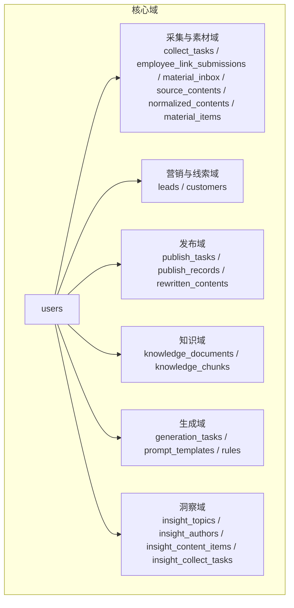
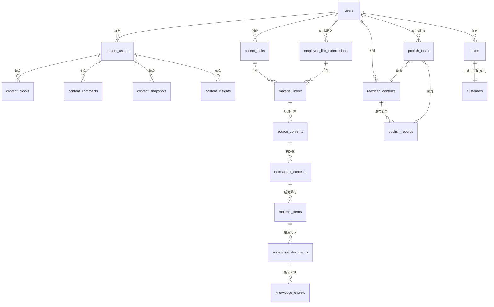
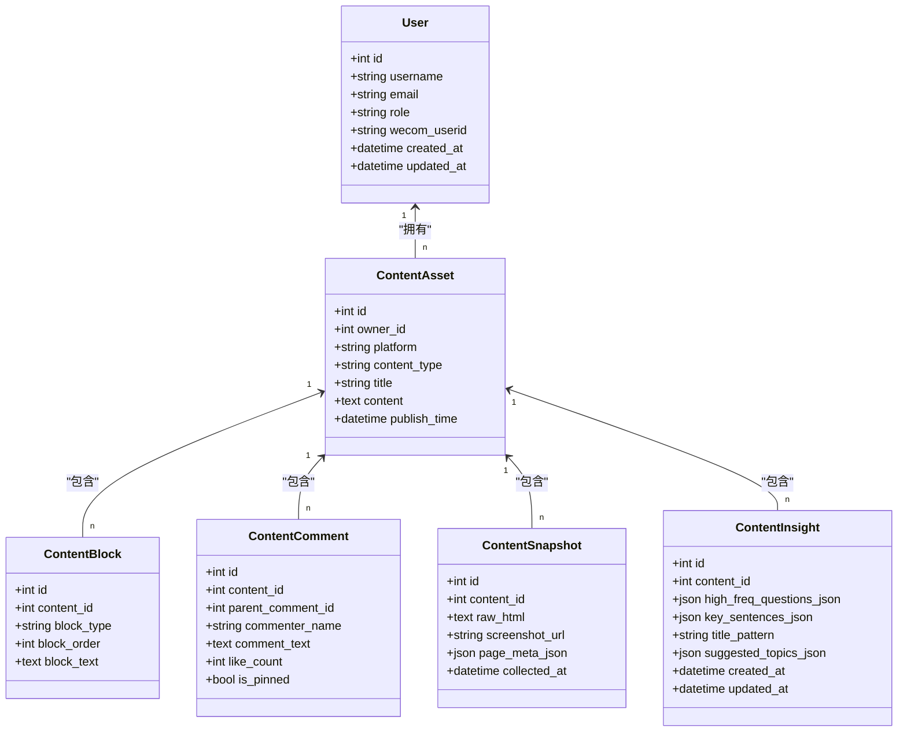
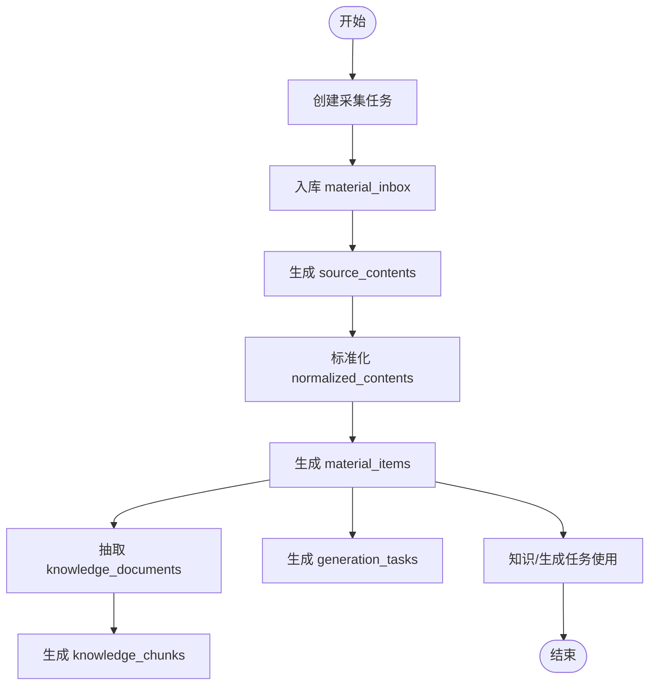
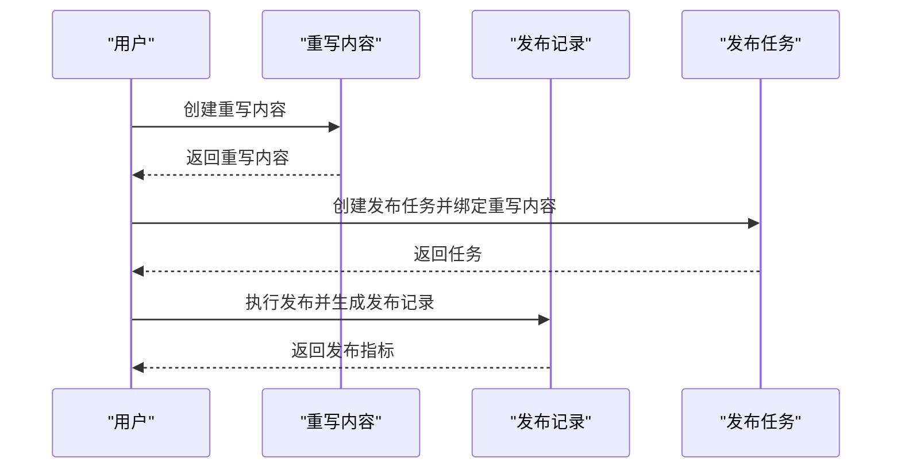
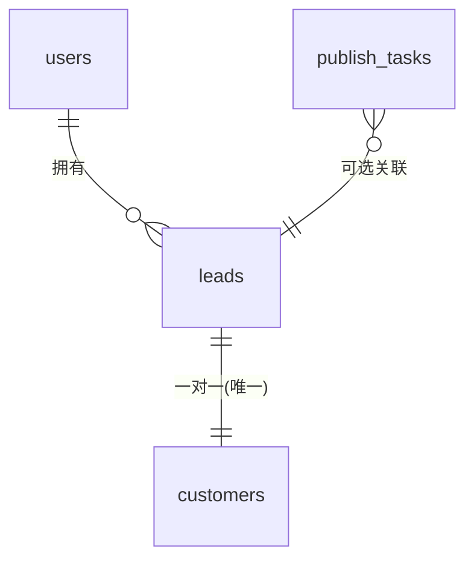
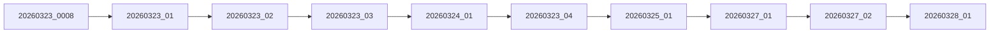

# ER关系图

<cite>
**本文引用的文件**
- [models.py](file://backend/app/models/models.py)
- [20260323_0008_legacy_baseline.py](file://backend/alembic/versions/20260323_0008_legacy_baseline.py)
- [20260323_01_add_leads_and_customer_lead_id.py](file://backend/alembic/versions/20260323_01_add_leads_and_customer_lead_id.py)
- [20260323_02_add_user_role.py](file://backend/alembic/versions/20260323_02_add_user_role.py)
- [20260323_03_add_inbox_assignment_fields.py](file://backend/alembic/versions/20260323_03_add_inbox_assignment_fields.py)
- [20260324_01_add_structured_content_tables.py](file://backend/alembic/versions/20260324_01_add_structured_content_tables.py)
- [20260323_04_add_user_wecom_userid.py](file://backend/alembic/versions/20260323_04_add_user_wecom_userid.py)
- [20260325_01_add_acquisition_inbox_pipeline.py](file://backend/alembic/versions/20260325_01_add_acquisition_inbox_pipeline.py)
- [20260327_01_refactor_material_inbox_filtering.py](file://backend/alembic/versions/20260327_01_refactor_material_inbox_filtering.py)
- [20260327_02_add_material_knowledge_pipeline.py](file://backend/alembic/versions/20260327_02_add_material_knowledge_pipeline.py)
- [20260328_01_extend_generation_task_structured_outputs.py](file://backend/alembic/versions/20260328_01_extend_generation_task_structured_outputs.py)
- [er-overview.md](file://docs/architecture/er-overview.md)
- [README.md](file://sql/README.md)
</cite>

## 目录
1. [简介](#简介)
2. [项目结构](#项目结构)
3. [核心组件](#核心组件)
4. [架构总览](#架构总览)
5. [详细组件分析](#详细组件分析)
6. [依赖分析](#依赖分析)
7. [性能考虑](#性能考虑)
8. [故障排查指南](#故障排查指南)
9. [结论](#结论)
10. [附录](#附录)

## 简介
本文件面向“智获客”项目，系统性梳理数据库实体关系图（ERD），明确各实体之间的主键、外键、一对一、一对多、多对多关系，并结合迁移脚本说明关系约束与索引设计。文档同时解释数据模型的规范化程度与必要的反规范化决策，提供关系图解读指南与最佳实践建议，帮助开发者与产品人员快速理解业务数据模型。

## 项目结构
项目采用“领域驱动”的数据库建模方式，围绕采集、素材、知识、AI工作台、合规、发布、CRM等核心域构建实体与关系。迁移脚本逐步演进，体现了从基础用户域到采集与素材处理域，再到知识抽取与生成任务域的完整演进路径。

图表来源
- [er-overview.md:1-4](file://docs/architecture/er-overview.md#L1-L4)
- [README.md:1-4](file://sql/README.md#L1-L4)

章节来源
- [er-overview.md:1-4](file://docs/architecture/er-overview.md#L1-L4)
- [README.md:1-4](file://sql/README.md#L1-L4)

## 核心组件
本节聚焦于关键实体及其关系，结合模型定义与迁移脚本，给出主键、外键、索引与约束的说明。

- 用户域（Identity）
  - users：主键 id；角色 role；企业微信标识 wecom_userid；软删除 is_active；时间戳 created_at/updated_at。
  - 关系：与 content_assets、leads、customers、rewritten_contents、publish_tasks、publish_records、ark_call_logs 等存在一对多或一对一关系。

- 内容资产与结构化内容（Acquisition）
  - content_assets：主键 id；外键 owner_id → users；平台 platform、类型 content_type、标题 title、正文 content、作者 author、发布时间 publish_time、标签 tags、热力指标 metrics、热度分 heat_score、是否爆文 is_viral；结构化子块 content_blocks、评论 content_comments、快照 content_snapshots、洞察 content_insights。
  - content_blocks：主键 id；外键 content_id → content_assets（级联删除）；块类型 block_type、顺序 block_order、文本 block_text。
  - content_comments：主键 id；外键 content_id → content_assets（级联删除）；父子评论 parent_comment_id → content_comments（SET NULL）；评论者名称 commenter_name、文本 comment_text、点赞数 like_count、置顶 is_pinned。
  - content_snapshots：主键 id；外键 content_id → content_assets（级联删除）；原始 HTML、截图 URL、页面元信息 page_meta_json、采集时间 collected_at。
  - content_insights：主键 id；外键 content_id → content_assets（级联删除）；高频问题、关键句、标题模式、建议主题等洞察结果；更新时间 updated_at。

- 素材采集与处理（Acquisition）
  - collect_tasks：主键 id；外键 owner_id → users；任务类型 task_type、平台 platform、关键词 keyword、最大数量 max_items、统计字段 result_count/inserted_count/review_count/discard_count/duplicate_count/failed_count、状态 status、错误信息 error_message。
  - employee_link_submissions：主键 id；外键 owner_id → users、employee_id → users；来源类型 source_type、平台 platform、URL、备注 note、状态 status、错误信息 error_message。
  - material_inbox：主键 id；外键 owner_id → users、source_task_id → collect_tasks、source_submission_id → employee_link_submissions、submitted_by_employee_id → users；唯一约束（owner_id, platform, source_id）；平台 platform、标题 title、作者 author、正文 content、URL、封面 cover_url、互动数 like/comment/collect/share、发布时间 publish_time、解析状态 parse_status、风险状态 risk_status、质量/相关度/线索分 quality_score/relevance_score/lead_score、重复标记 is_duplicate、过滤原因 filter_reason、原始数据 raw_data、状态 status、备注 remark、审核意见 review_note。
  - source_contents：主键 id；外键 owner_id → users、source_task_id → collect_tasks、source_submission_id → employee_link_submissions、submitted_by_employee_id → users；原始标题/内容/载荷、作者、封面、发布时间、互动数、解析/风险状态、备注；与 normalized_contents 一对多。
  - normalized_contents：主键 id；外键 owner_id → users、source_content_id → source_contents（级联删除）；标准化后的标题/内容/预览、内容哈希 content_hash、平台/源ID/URL/作者/封面/发布时间、互动数、解析/风险状态、关键词；与 material_items 一对多。
  - material_items：主键 id；外键 owner_id → users、source_task_id → collect_tasks、source_submission_id → employee_link_submissions、submitted_by_employee_id → users、source_content_id → source_contents（SET NULL）、normalized_content_id → normalized_contents（级联删除）；平台/源ID/URL/关键词/标题/正文/预览/作者/封面/发布时间、互动数、热度/线索等级 hot_level/lead_level、线索原因 lead_reason、质量/相关度/线索分 quality_score/relevance_score/lead_score、解析/风险状态、重复标记、状态、备注、审核意见；与 knowledge_documents、generation_tasks 多对一。

- 知识与检索（Knowledge）
  - knowledge_documents：主键 id；外键 owner_id → users、material_item_id → material_items（级联删除）；平台/账号类型/目标受众/内容类型、主题/标题/摘要/正文；与 knowledge_chunks 一对多。
  - knowledge_chunks：主键 id；外键 owner_id → users、knowledge_document_id → knowledge_documents（级联删除）；块类型 chunk_type、文本 chunk_text、索引 chunk_index、关键词 keywords。

- 规则与提示词（Rules/Prompts）
  - rules：主键 id；外键 owner_id → users；规则类型 rule_type、平台/账号类型/目标受众、名称 name、内容 content、优先级 priority。
  - prompt_templates：主键 id；外键 owner_id → users；任务类型 task_type、平台/账号类型/目标受众、版本 version、系统提示 system_prompt、用户提示模板 user_prompt_template。

- 生成任务（Generation Tasks）
  - generation_tasks：主键 id；外键 owner_id → users、material_item_id → material_items（级联删除）；平台/账号类型/目标受众/任务类型、提示快照 prompt_snapshot、输出文本 output_text、参考文档IDs、标签/副本/合规JSON、选中变体及索引、采纳状态 adoption_status、采纳时间 adopted_at、采纳人 adopted_by_user_id；与 material_items 一对多。

- 发布与重写（Publish/Rewrite）
  - rewritten_contents：主键 id；外键 source_id → content_assets；目标平台 target_platform、内容类型 content_type、原文 original_content、重写内容 rewritten_content、风险等级 risk_level、合规分数 compliance_score、合规状态 compliance_status、风险点 risk_points、建议 suggestions；与 publish_records 一对多。
  - publish_records：主键 id；外键 rewritten_content_id → rewritten_contents；平台 platform、账号名 account_name、发布时间 publish_time、发布者 published_by、观看/点赞/评论/收藏/分享/私信、微信添加/线索/有效线索/转化等指标；与 rewritten_contents 一对多。
  - publish_tasks：主键 id；外键 owner_id → users、rewritten_content_id → rewritten_contents、publish_record_id → publish_records；平台/账号、任务标题、内容文本、状态 status、指派 assigned_to → users、到期/认领/发布/关闭时间、URL、拒绝/关闭原因、指标、反馈 publish_task_feedbacks（一对多）。

- 线索与客户（CRM）
  - leads：主键 id；外键 owner_id → users、publish_task_id → publish_tasks；平台 platform、来源 source、标题 title、帖子URL post_url、微信添加/线索/有效线索/转化数、状态 status、意向 level、备注 note；与 customers 一对一（通过 unique 约束）。
  - customers：主键 id；外键 owner_id → users、lead_id → leads（唯一）；昵称 nickname、微信号 wechat_id、电话 phone、来源平台/内容、线索 id、标签 tags、意向 level、客户状态 customer_status、咨询内容 inquiry_content、跟进记录 follow_records；与 leads 一对一。

- 洞察与分析（Insight）
  - insight_topics：主键 id；唯一索引 name；平台聚焦/受众标签/常见标题模板/痛点/结构/CTA、风险说明、内容计数；与 insight_content_items、insight_authors 一对多。
  - insight_authors：主键 id；平台 platform、作者名 author_name、平台ID/主页/bio/粉丝数、账号类型/标签、主题覆盖/风格摘要/爆款率/平均互动；与 insight_content_items 一对多。
  - insight_content_items：主键 id；外键 owner_id → users、author_id → insight_authors、topic_id → insight_topics；平台/来源/URL/采集时间/模式；账号字段；内容字段；互动字段；AI分析字段；风控字段；时间戳。
  - insight_collect_tasks：主键 id；外键 owner_id → users；平台、采集模式、目标值、时间范围、状态、结果数、备注、运行时间。

- 其他
  - ark_call_logs：主键 id；外键 user_id → users；场景 scene、提供商 provider、模型 model、端点 endpoint；成功标志 success、状态码 status_code、延迟 latency_ms；Token用量 input/output/total；错误信息 error_message；创建时间 created_at。

章节来源
- [models.py:8-27](file://backend/app/models/models.py#L8-L27)
- [models.py:45-84](file://backend/app/models/models.py#L45-L84)
- [models.py:86-99](file://backend/app/models/models.py#L86-L99)
- [models.py:101-116](file://backend/app/models/models.py#L101-L116)
- [models.py:118-131](file://backend/app/models/models.py#L118-L131)
- [models.py:133-148](file://backend/app/models/models.py#L133-L148)
- [models.py:156-182](file://backend/app/models/models.py#L156-L182)
- [models.py:199-227](file://backend/app/models/models.py#L199-L227)
- [models.py:229-257](file://backend/app/models/models.py#L229-L257)
- [models.py:259-290](file://backend/app/models/models.py#L259-L290)
- [models.py:292-334](file://backend/app/models/models.py#L292-L334)
- [models.py:336-349](file://backend/app/models/models.py#L336-L349)
- [models.py:351-373](file://backend/app/models/models.py#L351-L373)
- [models.py:374-411](file://backend/app/models/models.py#L374-L411)
- [models.py:413-436](file://backend/app/models/models.py#L413-L436)
- [models.py:438-456](file://backend/app/models/models.py#L438-L456)
- [models.py:458-505](file://backend/app/models/models.py#L458-L505)
- [models.py:507-546](file://backend/app/models/models.py#L507-L546)
- [models.py:548-582](file://backend/app/models/models.py#L548-L582)
- [models.py:584-640](file://backend/app/models/models.py#L584-L640)
- [models.py:642-665](file://backend/app/models/models.py#L642-L665)
- [models.py:667-684](file://backend/app/models/models.py#L667-L684)
- [models.py:686-704](file://backend/app/models/models.py#L686-L704)
- [models.py:705-722](file://backend/app/models/models.py#L705-L722)
- [models.py:724-752](file://backend/app/models/models.py#L724-L752)
- [models.py:758-808](file://backend/app/models/models.py#L758-L808)
- [models.py:810-884](file://backend/app/models/models.py#L810-L884)
- [models.py:886-903](file://backend/app/models/models.py#L886-L903)
- [models.py:905-928](file://backend/app/models/models.py#L905-L928)

## 架构总览
下图展示核心实体间的主要关系与流向，体现从采集、素材、知识到生成与发布的闭环。

图表来源
- [models.py:8-27](file://backend/app/models/models.py#L8-L27)
- [models.py:45-84](file://backend/app/models/models.py#L45-L84)
- [models.py:86-99](file://backend/app/models/models.py#L86-L99)
- [models.py:101-116](file://backend/app/models/models.py#L101-L116)
- [models.py:118-131](file://backend/app/models/models.py#L118-L131)
- [models.py:133-148](file://backend/app/models/models.py#L133-L148)
- [models.py:156-182](file://backend/app/models/models.py#L156-L182)
- [models.py:199-227](file://backend/app/models/models.py#L199-L227)
- [models.py:229-257](file://backend/app/models/models.py#L229-L257)
- [models.py:259-290](file://backend/app/models/models.py#L259-L290)
- [models.py:292-334](file://backend/app/models/models.py#L292-L334)
- [models.py:336-349](file://backend/app/models/models.py#L336-L349)
- [models.py:351-373](file://backend/app/models/models.py#L351-L373)
- [models.py:374-411](file://backend/app/models/models.py#L374-L411)
- [models.py:413-436](file://backend/app/models/models.py#L413-L436)
- [models.py:438-456](file://backend/app/models/models.py#L438-L456)
- [models.py:458-505](file://backend/app/models/models.py#L458-L505)
- [models.py:507-546](file://backend/app/models/models.py#L507-L546)
- [models.py:548-582](file://backend/app/models/models.py#L548-L582)
- [models.py:584-640](file://backend/app/models/models.py#L584-L640)
- [models.py:642-665](file://backend/app/models/models.py#L642-L665)
- [models.py:667-684](file://backend/app/models/models.py#L667-L684)
- [models.py:686-704](file://backend/app/models/models.py#L686-L704)
- [models.py:705-722](file://backend/app/models/models.py#L705-L722)
- [models.py:724-752](file://backend/app/models/models.py#L724-L752)

## 详细组件分析

### 用户与内容资产
- 关系
  - users → content_assets：一对多；每用户可拥有多个内容资产。
  - content_assets → content_blocks/comments/snapshots/insights：一对多；内容资产的结构化子块、评论、快照、洞察。
- 设计要点
  - content_blocks/content_comments/content_snapshots/content_insights 对 content_assets 的删除采用级联或 SET NULL，确保数据一致性与可追溯性。
  - content_comments 支持父子评论，使用外键 self-reference 并在删除时 SET NULL，避免孤立评论。

图表来源
- [models.py:8-27](file://backend/app/models/models.py#L8-L27)
- [models.py:45-84](file://backend/app/models/models.py#L45-L84)
- [models.py:86-99](file://backend/app/models/models.py#L86-L99)
- [models.py:101-116](file://backend/app/models/models.py#L101-L116)
- [models.py:118-131](file://backend/app/models/models.py#L118-L131)
- [models.py:133-148](file://backend/app/models/models.py#L133-L148)

章节来源
- [models.py:8-27](file://backend/app/models/models.py#L8-L27)
- [models.py:45-84](file://backend/app/models/models.py#L45-L84)
- [models.py:86-99](file://backend/app/models/models.py#L86-L99)
- [models.py:101-116](file://backend/app/models/models.py#L101-L116)
- [models.py:118-131](file://backend/app/models/models.py#L118-L131)
- [models.py:133-148](file://backend/app/models/models.py#L133-L148)

### 采集与素材处理流水线
- 关系
  - collect_tasks 与 material_inbox：一对多；采集任务产出材料入库。
  - employee_link_submissions 与 material_inbox：一对多；员工提交链接进入入库。
  - material_inbox 与 source_contents：一对多；入库后进入原始内容阶段。
  - source_contents 与 normalized_contents：一对多；标准化处理。
  - normalized_contents 与 material_items：一对多；成为正式素材。
  - material_items 与 knowledge_documents：一对多；抽取知识。
  - knowledge_documents 与 knowledge_chunks：一对多；知识分块。
- 设计要点
  - material_inbox 唯一约束（owner_id, platform, source_id）防止重复入库。
  - 多处 ON DELETE 行为：CASCADE、SET NULL，平衡数据完整性与灵活性。
  - 大量统计字段（质量/相关度/线索分、重复标记、状态、风险/解析状态）用于反规范化，支撑高效查询与报表。

图表来源
- [models.py:413-436](file://backend/app/models/models.py#L413-L436)
- [models.py:438-456](file://backend/app/models/models.py#L438-L456)
- [models.py:458-505](file://backend/app/models/models.py#L458-L505)
- [models.py:507-546](file://backend/app/models/models.py#L507-L546)
- [models.py:548-582](file://backend/app/models/models.py#L548-L582)
- [models.py:584-640](file://backend/app/models/models.py#L584-L640)
- [models.py:642-665](file://backend/app/models/models.py#L642-L665)
- [models.py:667-684](file://backend/app/models/models.py#L667-L684)

章节来源
- [models.py:413-436](file://backend/app/models/models.py#L413-L436)
- [models.py:438-456](file://backend/app/models/models.py#L438-L456)
- [models.py:458-505](file://backend/app/models/models.py#L458-L505)
- [models.py:507-546](file://backend/app/models/models.py#L507-L546)
- [models.py:548-582](file://backend/app/models/models.py#L548-L582)
- [models.py:584-640](file://backend/app/models/models.py#L584-L640)
- [models.py:642-665](file://backend/app/models/models.py#L642-L665)
- [models.py:667-684](file://backend/app/models/models.py#L667-L684)

### 发布与重写
- 关系
  - rewritten_contents 与 publish_records：一对多；重写内容对应多个发布记录。
  - publish_tasks 与 rewritten_contents/publish_records：多对一；任务绑定重写内容与发布记录。
  - users 与 rewritten_contents/publish_tasks：一对多；用户创建与指派。
- 设计要点
  - rewritten_contents 包含合规评分与风险等级，便于发布前风控。
  - publish_tasks 提供完整的生命周期状态与指标，便于追踪与复盘。

图表来源
- [models.py:156-182](file://backend/app/models/models.py#L156-L182)
- [models.py:259-290](file://backend/app/models/models.py#L259-L290)
- [models.py:292-334](file://backend/app/models/models.py#L292-L334)

章节来源
- [models.py:156-182](file://backend/app/models/models.py#L156-L182)
- [models.py:259-290](file://backend/app/models/models.py#L259-L290)
- [models.py:292-334](file://backend/app/models/models.py#L292-L334)

### 线索与客户
- 关系
  - users → leads：一对多；用户拥有线索池。
  - leads → customers：一对一；通过唯一约束 lead_id 实现一对一映射。
  - publish_tasks → leads：可选关联；由发布任务产生的线索。
- 设计要点
  - 意向级别 intention_level、客户状态 customer_status、跟进记录 follow_records 等字段支持 CRM 流程。

图表来源
- [models.py:199-227](file://backend/app/models/models.py#L199-L227)
- [models.py:229-257](file://backend/app/models/models.py#L229-L257)
- [models.py:292-334](file://backend/app/models/models.py#L292-L334)

章节来源
- [models.py:199-227](file://backend/app/models/models.py#L199-L227)
- [models.py:229-257](file://backend/app/models/models.py#L229-L257)
- [models.py:292-334](file://backend/app/models/models.py#L292-L334)

### 洞察与分析
- 关系
  - insight_topics 与 insight_content_items/insight_authors：一对多。
  - insight_authors 与 insight_content_items：一对多。
  - users 与 insight_content_items：一对多。
- 设计要点
  - 多维标签（受众标签、主题覆盖、风格摘要、爆款率、平均互动）支持精细化分析与推荐。

章节来源
- [models.py:758-808](file://backend/app/models/models.py#L758-L808)
- [models.py:810-884](file://backend/app/models/models.py#L810-L884)
- [models.py:886-903](file://backend/app/models/models.py#L886-L903)
- [models.py:905-928](file://backend/app/models/models.py#L905-L928)

## 依赖分析
- 迁移脚本演进
  - 20260323_0008_legacy_baseline：兼容桥接，保持迁移链路连续。
  - 20260323_01_add_leads_and_customer_lead_id：创建 leads 表与 customers.lead_id 唯一约束。
  - 20260323_02_add_user_role：新增 users.role 字段并默认值处理。
  - 20260323_03_add_inbox_assignment_fields：inbox_items 增加 assigned_to/assigned_at 并建立外键。
  - 20260324_01_add_structured_content_tables：创建 content_blocks/comments/snapshots/insights。
  - 20260323_04_add_user_wecom_userid：users.wecom_userid 唯一索引。
  - 20260325_01_add_acquisition_inbox_pipeline：collect_tasks/employee_link_submissions/material_inbox。
  - 20260327_01_refactor_material_inbox_filtering：material_inbox 增加解析/风险/评分/重复/过滤字段与索引，增加唯一约束。
  - 20260327_02_add_material_knowledge_pipeline：source_contents/normalized_contents/material_items/knowledge_documents/knowledge_chunks/rules/prompt_templates/generation_tasks。
  - 20260328_01_extend_generation_task_structured_outputs：generation_tasks 增加结构化输出与采纳状态字段与索引。
- 依赖关系可视化

图表来源
- [20260323_0008_legacy_baseline.py:1-26](file://backend/alembic/versions/20260323_0008_legacy_baseline.py#L1-L26)
- [20260323_01_add_leads_and_customer_lead_id.py:1-117](file://backend/alembic/versions/20260323_01_add_leads_and_customer_lead_id.py#L1-L117)
- [20260323_02_add_user_role.py:1-36](file://backend/alembic/versions/20260323_02_add_user_role.py#L1-L36)
- [20260323_03_add_inbox_assignment_fields.py:1-56](file://backend/alembic/versions/20260323_03_add_inbox_assignment_fields.py#L1-L56)
- [20260324_01_add_structured_content_tables.py:1-104](file://backend/alembic/versions/20260324_01_add_structured_content_tables.py#L1-L104)
- [20260323_04_add_user_wecom_userid.py:1-39](file://backend/alembic/versions/20260323_04_add_user_wecom_userid.py#L1-L39)
- [20260325_01_add_acquisition_inbox_pipeline.py:1-116](file://backend/alembic/versions/20260325_01_add_acquisition_inbox_pipeline.py#L1-L116)
- [20260327_01_refactor_material_inbox_filtering.py:1-142](file://backend/alembic/versions/20260327_01_refactor_material_inbox_filtering.py#L1-L142)
- [20260327_02_add_material_knowledge_pipeline.py:1-372](file://backend/alembic/versions/20260327_02_add_material_knowledge_pipeline.py#L1-L372)
- [20260328_01_extend_generation_task_structured_outputs.py:1-89](file://backend/alembic/versions/20260328_01_extend_generation_task_structured_outputs.py#L1-L89)

章节来源
- [20260323_0008_legacy_baseline.py:1-26](file://backend/alembic/versions/20260323_0008_legacy_baseline.py#L1-L26)
- [20260323_01_add_leads_and_customer_lead_id.py:1-117](file://backend/alembic/versions/20260323_01_add_leads_and_customer_lead_id.py#L1-L117)
- [20260323_02_add_user_role.py:1-36](file://backend/alembic/versions/20260323_02_add_user_role.py#L1-L36)
- [20260323_03_add_inbox_assignment_fields.py:1-56](file://backend/alembic/versions/20260323_03_add_inbox_assignment_fields.py#L1-L56)
- [20260324_01_add_structured_content_tables.py:1-104](file://backend/alembic/versions/20260324_01_add_structured_content_tables.py#L1-L104)
- [20260323_04_add_user_wecom_userid.py:1-39](file://backend/alembic/versions/20260323_04_add_user_wecom_userid.py#L1-L39)
- [20260325_01_add_acquisition_inbox_pipeline.py:1-116](file://backend/alembic/versions/20260325_01_add_acquisition_inbox_pipeline.py#L1-L116)
- [20260327_01_refactor_material_inbox_filtering.py:1-142](file://backend/alembic/versions/20260327_01_refactor_material_inbox_filtering.py#L1-L142)
- [20260327_02_add_material_knowledge_pipeline.py:1-372](file://backend/alembic/versions/20260327_02_add_material_knowledge_pipeline.py#L1-L372)
- [20260328_01_extend_generation_task_structured_outputs.py:1-89](file://backend/alembic/versions/20260328_01_extend_generation_task_structured_outputs.py#L1-L89)

## 性能考虑
- 索引策略
  - 高频查询字段建立索引：如 material_inbox 的 source_id/keyword/status/parse_status/risk_status/is_duplicate，material_items 的 platform/source_id/keyword/parse_status/risk_status/is_duplicate/status，generation_tasks 的 adoption_status/adopted_by_user_id。
  - 唯一约束：material_inbox 的（owner_id, platform, source_id）避免重复入库，提高去重效率。
- 删除行为
  - CASCADE 用于“从属”实体，减少孤儿数据；SET NULL 用于可选父子关系，保证引用完整性。
- 反规范化
  - material_items/knowledge_documents 等表存储质量/相关度/线索分、重复标记、状态等字段，降低跨表查询成本，提升报表与筛选性能。
- 时间戳与审计
  - created_at/updated_at 广泛使用，便于审计与排序；ark_call_logs 的 created_at 建有索引，便于查询分析。

## 故障排查指南
- 常见问题
  - 重复入库：检查 material_inbox 唯一约束冲突；确认 source_id/platform/owner_id 组合是否已存在。
  - 外键约束失败：核对被引用主键是否存在；注意 ON DELETE 行为（CASCADE/SET NULL）导致的数据变化。
  - 查询性能差：确认相关字段是否建立索引；避免在大表上进行全表扫描。
- 排查步骤
  - 使用 Alembic 版本回滚/升级验证迁移影响范围。
  - 检查实体关系图与索引，定位慢查询路径。
  - 结合 Ark 调用日志（ark_call_logs）定位外部服务异常。

章节来源
- [20260327_01_refactor_material_inbox_filtering.py:95-101](file://backend/alembic/versions/20260327_01_refactor_material_inbox_filtering.py#L95-L101)
- [20260328_01_extend_generation_task_structured_outputs.py:56-59](file://backend/alembic/versions/20260328_01_extend_generation_task_structured_outputs.py#L56-L59)
- [models.py:905-928](file://backend/app/models/models.py#L905-L928)

## 结论
本 ERD 文档基于模型定义与迁移脚本，系统梳理了“智获客”项目的核心实体关系，明确了主键、外键与索引约束，解释了规范化与反规范化的权衡，并提供了关系图解读与优化建议。建议在后续迭代中持续完善索引覆盖与监控告警，保障数据一致性与查询性能。

## 附录
- 关系图解读指南
  - 识别主键与外键：主键通常带索引且唯一；外键指向另一张表的主键。
  - 一对一/一对多/多对多：通过唯一约束与外键组合判断；多对多需中间表。
  - 级联与 SET NULL：关注删除行为，避免数据不一致。
- 最佳实践
  - 为高频查询字段建立索引；定期评估索引使用情况。
  - 合理使用唯一约束与外键，确保引用完整性。
  - 在保证一致性的前提下适度反规范化，提升查询性能。
  - 使用迁移脚本管理结构变更，保留审计轨迹。