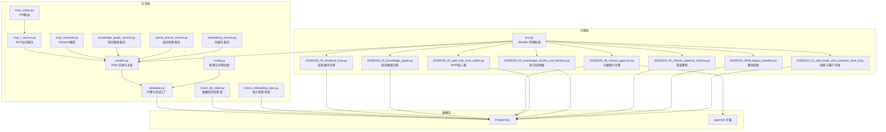
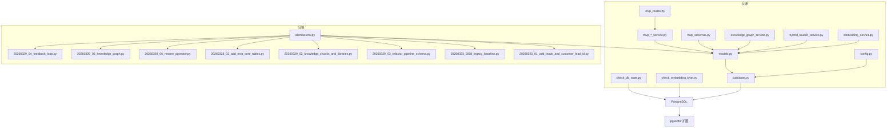
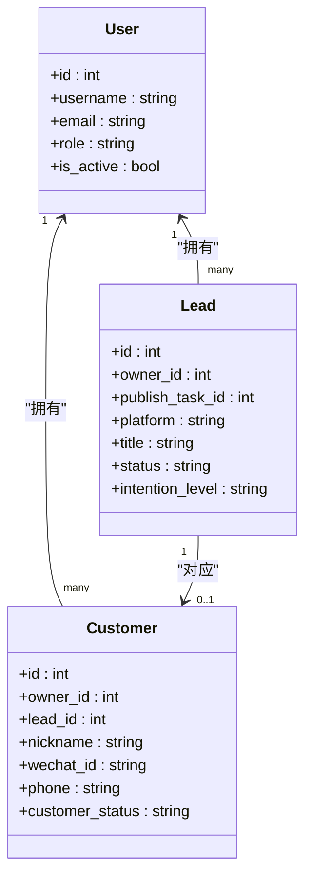
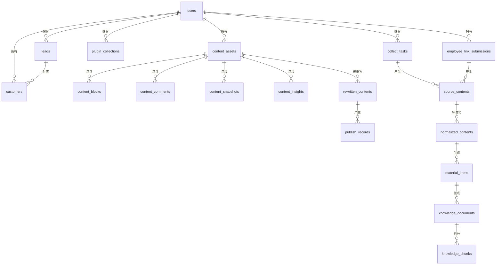
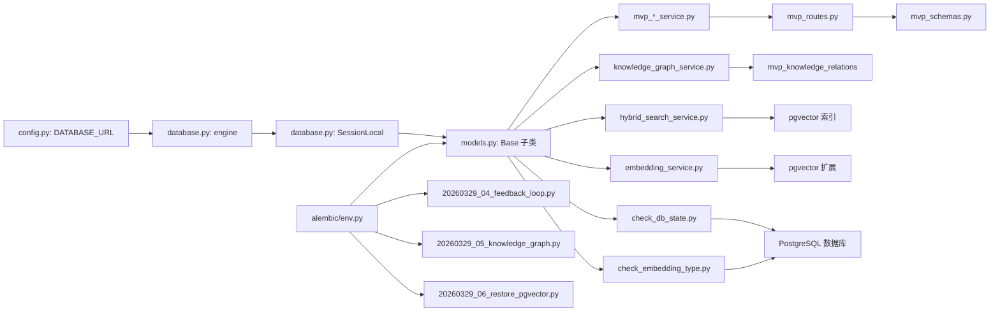
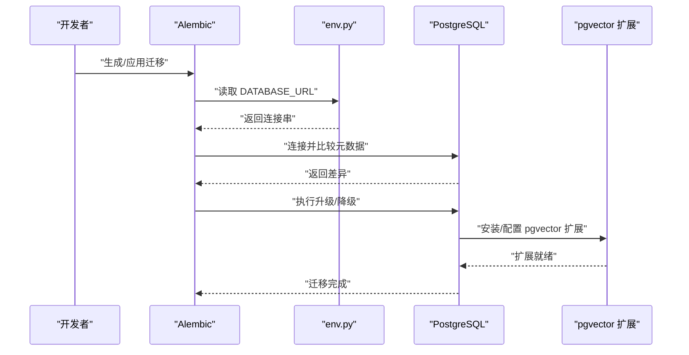

# 数据库设计

<cite>
**本文引用的文件**
- [models.py](file://backend/app/models/models.py)
- [database.py](file://backend/app/core/database.py)
- [config.py](file://backend/app/core/config.py)
- [env.py](file://backend/alembic/env.py)
- [20260323_0008_legacy_baseline.py](file://backend/alembic/versions/20260323_0008_legacy_baseline.py)
- [20260323_01_add_leads_and_customer_lead_id.py](file://backend/alembic/versions/20260323_01_add_leads_and_customer_lead_id.py)
- [20260328_02_add_mvp_core_tables.py](file://backend/alembic/versions/20260328_02_add_mvp_core_tables.py)
- [20260329_02_knowledge_chunks_and_libraries.py](file://backend/alembic/versions/20260329_02_knowledge_chunks_and_libraries.py)
- [20260329_03_refactor_pipeline_schema.py](file://backend/alembic/versions/20260329_03_refactor_pipeline_schema.py)
- [20260329_04_feedback_loop.py](file://backend/alembic/versions/20260329_04_feedback_loop.py)
- [20260329_05_knowledge_graph.py](file://backend/alembic/versions/20260329_05_knowledge_graph.py)
- [20260329_06_restore_pgvector.py](file://backend/alembic/versions/20260329_06_restore_pgvector.py)
- [mvp_inbox_service.py](file://backend/app/services/mvp_inbox_service.py)
- [mvp_material_service.py](file://backend/app/services/mvp_material_service.py)
- [mvp_knowledge_service.py](file://backend/app/services/mvp_knowledge_service.py)
- [mvp_generate_service.py](file://backend/app/services/mvp_generate_service.py)
- [mvp_routes.py](file://backend/app/api/endpoints/mvp_routes.py)
- [mvp_schemas.py](file://backend/app/schemas/mvp_schemas.py)
- [knowledge_graph_service.py](file://backend/app/services/knowledge_graph_service.py)
- [hybrid_search_service.py](file://backend/app/services/hybrid_search_service.py)
- [embedding_service.py](file://backend/app/services/embedding_service.py)
- [check_db_state.py](file://backend/check_db_state.py)
- [check_embedding_type.py](file://backend/check_embedding_type.py)
- [README.md](file://sql/README.md)
</cite>

## 更新摘要
**变更内容**
- 新增数据库状态检查工具和向量嵌入类型检查工具，用于PostgreSQL pgvector扩展调试
- 新增反馈循环数据库结构，包括生成结果反馈表和知识库质量评分表
- 新增知识图谱关系表，支持相似主题、同人群、同平台、互补内容、衍生关系
- 完善向量索引的数据库迁移，支持pgvector扩展和cosine距离算法
- 增强知识库的向量化检索能力和图增强搜索功能
- 新增知识图谱统计分析和主题聚类功能

## 目录
1. [简介](#简介)
2. [项目结构](#项目结构)
3. [核心组件](#核心组件)
4. [架构总览](#架构总览)
5. [详细组件分析](#详细组件分析)
6. [MVP数据库架构](#mvp数据库架构)
7. [反馈循环系统](#反馈循环系统)
8. [知识图谱系统](#知识图谱系统)
9. [向量索引与检索](#向量索引与检索)
10. [数据库调试工具](#数据库调试工具)
11. [依赖分析](#依赖分析)
12. [性能考量](#性能考量)
13. [故障排查指南](#故障排查指南)
14. [结论](#结论)
15. [附录](#附录)

## 简介
本文件为"智获客"数据库提供系统化、可操作的数据模型文档。内容涵盖实体关系、字段定义与数据类型、主键/外键与索引约束、数据验证与业务规则、数据库模式图、示例数据、数据访问模式与缓存策略、性能优化建议、数据生命周期与归档策略、数据迁移路径与版本管理、以及数据安全与隐私要求。特别新增了完整的MVP数据库架构，包括收件箱、素材库、知识库、生成结果等核心表结构，以及反馈循环系统、知识图谱关系表和向量索引的数据库迁移。

**更新** 新增反馈循环数据库结构、知识图谱关系表、以及向量索引的数据库迁移，显著增强了系统的智能化水平和数据管理能力。新增数据库状态检查工具和向量嵌入类型检查工具，用于PostgreSQL pgvector扩展的调试和验证。

## 项目结构
数据库层由 SQLAlchemy ORM 模型、数据库连接与会话工厂、Alembic 迁移配置组成，并通过环境变量与配置类集中管理数据库连接参数。迁移脚本采用版本化管理，确保数据库演进的可追溯性与可回滚性。新增的MVP架构提供了完整的AI内容创作工作流，包括内容采集、素材管理、知识库构建、智能生成和合规审核。反馈循环系统收集用户对AI生成内容的反馈，知识图谱系统构建知识条目的关系网络，向量索引系统支持高效的相似度检索。

**图表来源**
- [models.py:1-1190](file://backend/app/models/models.py#L1-L1190)
- [database.py:1-29](file://backend/app/core/database.py#L1-L29)
- [config.py:27-36](file://backend/app/core/config.py#L27-L36)
- [mvp_inbox_service.py:1-147](file://backend/app/services/mvp_inbox_service.py#L1-L147)
- [mvp_routes.py:1-1401](file://backend/app/api/endpoints/mvp_routes.py#L1-L1401)
- [mvp_schemas.py:1-281](file://backend/app/schemas/mvp_schemas.py#L1-L281)
- [knowledge_graph_service.py:1-621](file://backend/app/services/knowledge_graph_service.py#L1-L621)
- [hybrid_search_service.py:1-464](file://backend/app/services/hybrid_search_service.py#L1-L464)
- [embedding_service.py:1-359](file://backend/app/services/embedding_service.py#L1-L359)
- [check_db_state.py:1-56](file://backend/check_db_state.py#L1-L56)
- [check_embedding_type.py:1-26](file://backend/check_embedding_type.py#L1-L26)
- [env.py:30-34](file://backend/alembic/env.py#L30-L34)
- [20260329_04_feedback_loop.py:1-67](file://backend/alembic/versions/20260329_04_feedback_loop.py#L1-L67)
- [20260329_05_knowledge_graph.py:1-45](file://backend/alembic/versions/20260329_05_knowledge_graph.py#L1-L45)
- [20260329_06_restore_pgvector.py:1-85](file://backend/alembic/versions/20260329_06_restore_pgvector.py#L1-L85)

**章节来源**
- [models.py:1-1190](file://backend/app/models/models.py#L1-L1190)
- [database.py:1-29](file://backend/app/core/database.py#L1-L29)
- [config.py:27-36](file://backend/app/core/config.py#L27-L36)
- [mvp_inbox_service.py:1-147](file://backend/app/services/mvp_inbox_service.py#L1-L147)
- [mvp_routes.py:1-1401](file://backend/app/api/endpoints/mvp_routes.py#L1-L1401)
- [mvp_schemas.py:1-281](file://backend/app/schemas/mvp_schemas.py#L1-L281)
- [knowledge_graph_service.py:1-621](file://backend/app/services/knowledge_graph_service.py#L1-L621)
- [hybrid_search_service.py:1-464](file://backend/app/services/hybrid_search_service.py#L1-L464)
- [embedding_service.py:1-359](file://backend/app/services/embedding_service.py#L1-L359)
- [check_db_state.py:1-56](file://backend/check_db_state.py#L1-L56)
- [check_embedding_type.py:1-26](file://backend/check_embedding_type.py#L1-L26)
- [env.py:30-34](file://backend/alembic/env.py#L30-L34)
- [20260329_04_feedback_loop.py:1-67](file://backend/alembic/versions/20260329_04_feedback_loop.py#L1-L67)
- [20260329_05_knowledge_graph.py:1-45](file://backend/alembic/versions/20260329_05_knowledge_graph.py#L1-L45)
- [20260329_06_restore_pgvector.py:1-85](file://backend/alembic/versions/20260329_06_restore_pgvector.py#L1-L85)

## 核心组件
- 数据库引擎与会话：基于 SQLAlchemy 创建连接池、预检查与会话工厂，支持自动提交与刷新控制。
- 配置中心：集中管理数据库连接字符串、主机、端口、用户、密码、数据库名等。
- ORM 模型：定义用户、素材采集、内容资产、重写内容、线索与客户、发布任务与记录、洞察内容与作者档案、知识库与检索块、生成任务、规则与提示词模板等实体及其关系。
- **MVP架构**：新增完整的AI内容创作工作流，包括收件箱、素材库、知识库、生成结果、合规规则等核心表结构。
- **反馈循环系统**：新增生成结果反馈表和知识库质量评分表，支持用户反馈收集和持续学习机制。
- **知识图谱系统**：新增知识条目关系表，支持多种关系类型的自动发现和构建。
- **向量化支持**：新增pgvector扩展支持，实现向量嵌入和相似度检索，支持cosine距离算法。
- **数据库调试工具**：新增check_db_state.py和check_embedding_type.py工具，用于pgvector扩展状态检查和向量嵌入类型验证。
- **索引优化**：为新字段创建复合索引，提升查询性能。
- 迁移框架：Alembic 环境加载模型元数据，支持离线与在线迁移，兼容旧版本数据库并保持迁移链完整。

**章节来源**
- [database.py:1-29](file://backend/app/core/database.py#L1-L29)
- [config.py:27-36](file://backend/app/core/config.py#L27-L36)
- [models.py:1-1190](file://backend/app/models/models.py#L1-L1190)
- [env.py:30-34](file://backend/alembic/env.py#L30-L34)
- [check_db_state.py:1-56](file://backend/check_db_state.py#L1-L56)
- [check_embedding_type.py:1-26](file://backend/check_embedding_type.py#L1-L26)

## 架构总览
下图展示数据库层与应用层的交互关系，以及迁移工具对模型元数据的依赖，特别突出了MVP架构的完整工作流、反馈循环系统、知识图谱系统和向量化检索能力。

**图表来源**
- [models.py:1-1190](file://backend/app/models/models.py#L1-L1190)
- [database.py:1-29](file://backend/app/core/database.py#L1-L29)
- [config.py:27-36](file://backend/app/core/config.py#L27-L36)
- [mvp_inbox_service.py:1-147](file://backend/app/services/mvp_inbox_service.py#L1-L147)
- [mvp_routes.py:1-1401](file://backend/app/api/endpoints/mvp_routes.py#L1-L1401)
- [mvp_schemas.py:1-281](file://backend/app/schemas/mvp_schemas.py#L1-L281)
- [knowledge_graph_service.py:1-621](file://backend/app/services/knowledge_graph_service.py#L1-L621)
- [hybrid_search_service.py:1-464](file://backend/app/services/hybrid_search_service.py#L1-L464)
- [embedding_service.py:1-359](file://backend/app/services/embedding_service.py#L1-L359)
- [check_db_state.py:1-56](file://backend/check_db_state.py#L1-L56)
- [check_embedding_type.py:1-26](file://backend/check_embedding_type.py#L1-L26)
- [env.py:30-34](file://backend/alembic/env.py#L30-L34)
- [20260329_04_feedback_loop.py:1-67](file://backend/alembic/versions/20260329_04_feedback_loop.py#L1-L67)
- [20260329_05_knowledge_graph.py:1-45](file://backend/alembic/versions/20260329_05_knowledge_graph.py#L1-L45)
- [20260329_06_restore_pgvector.py:1-85](file://backend/alembic/versions/20260329_06_restore_pgvector.py#L1-L85)

## 详细组件分析

### 用户与权限
- 实体：用户表存储登录凭据、角色、激活状态与企业微信关联标识。
- 主键：自增整数 id。
- 约束：用户名、邮箱、企业微信用户标识唯一；默认角色为操作员；时间戳自动维护。
- 关系：一对多到内容资产、线索、客户、Ark 调用日志。

**章节来源**
- [models.py:15-34](file://backend/app/models/models.py#L15-L34)

### 内容资产与派生结构
- 内容资产：采集自各平台的内容条目，包含标题、正文、作者、发布时间、标签、热词、评论、指标、截图、热度与是否爆文等。
- 结构化块与评论：内容块按序排列，评论支持父子层级。
- 快照与洞察：页面快照与异步洞察结果。
- 关系：与用户、重写内容、块、评论、快照、洞察的双向关系。

**章节来源**
- [models.py:52-154](file://backend/app/models/models.py#L52-L154)

### 重写内容与合规
- 重写内容：针对不同平台与内容类型的改写产物，包含风险等级、合规评分与建议。
- 发布记录：记录发布平台、账号、发布时间、发布人及各类指标与转化指标。
- 关系：与源内容、发布记录双向关联。

**章节来源**
- [models.py:163-296](file://backend/app/models/models.py#L163-L296)

### 线索与客户
- 线索：从发布任务或手工操作产生的潜在客户入口，包含意向级别、状态与备注。
- 客户：客户联系信息与来源，一对一绑定线索。
- 关系：线索与客户一对一，均归属用户。

**图表来源**
- [models.py:206-264](file://backend/app/models/models.py#L206-L264)

**章节来源**
- [models.py:206-264](file://backend/app/models/models.py#L206-L264)
- [20260323_01_add_leads_and_customer_lead_id.py:18-117](file://backend/alembic/versions/20260323_01_add_leads_and_customer_lead_id.py#L18-L117)

### 发布任务与反馈
- 发布任务：包含任务标题、内容文本、状态、指派、到期时间、各平台指标与转化指标。
- 反馈记录：记录任务动作、备注与载荷。
- 关系：与重写内容、发布记录、反馈双向关联。

**章节来源**
- [models.py:299-356](file://backend/app/models/models.py#L299-L356)

### 采集与素材管线
- 插件采集：浏览器插件收集的内容条目。
- 收集任务：关键词驱动的采集任务，统计结果与失败信息。
- 员工提交：员工/微信机器人提交的外部链接。
- 素材收件箱：统一入口，去重、过滤、评分与状态管理。
- 原始内容与标准化内容：原始输入经清洗标准化，形成可复用内容。
- 素材条目：主资产表，收件箱是其筛选视图。

**更新** 新增source_id跟踪机制，确保内容去重和唯一性，支持跨平台内容识别。

**图表来源**
- [models.py:52-1190](file://backend/app/models/models.py#L52-L1190)

**章节来源**
- [models.py:357-640](file://backend/app/models/models.py#L357-L640)

### 洞察内容与作者档案
- 主题库：汇聚各主题的常见标题、痛点、结构与风险要点。
- 作者档案：账号定位、主题覆盖、风格与爆款率、平均互动分。
- 内容条目：统一字段集合，支持手动/导入/插件来源，包含互动、AI分析与风控字段。

**更新** 新增engagement metrics指标，包括点赞、评论、收藏、分享、浏览等互动数据，支持系统计算互动分和热度等级。

**章节来源**
- [models.py:765-891](file://backend/app/models/models.py#L765-L891)

### 规则与提示词模板
- 规则：生成边界约束，按类型/平台/受众维度配置。
- 提示词模板：任务类型/平台/受众维度的系统与用户提示词模板。

**章节来源**
- [models.py:693-729](file://backend/app/models/models.py#L693-L729)

### 生成任务
- 生成任务：持久化生成输出与上下文快照，支持引用文档、标签、变体选择与采纳状态。

**章节来源**
- [models.py:731-759](file://backend/app/models/models.py#L731-L759)

### Ark 调用日志
- 日志：记录调用场景、提供商、模型、端点、成功率、耗时、Token 使用与错误信息。

**章节来源**
- [models.py:912-935](file://backend/app/models/models.py#L912-L935)

## MVP数据库架构

### 收件箱系统
MVP架构的核心起点，负责内容采集、筛选和初步处理。

- **mvp_inbox_items**：收件箱条目，包含平台、标题、内容、作者、来源URL、风险等级、重复状态、评分、技术状态、业务状态等字段。
- **新增字段**：source_id（平台内容ID）、content_preview（内容摘要）、author_name（作者姓名）、publish_time（发布时间）、url（原始链接）、like_count、comment_count、favorite_count等互动指标。
- **状态管理**：tech_status（raw/parsed/enriched）、biz_status（pending/to_material/discarded）。
- **风险控制**：risk_level（low/medium/high）、duplicate_status（unique/suspected/duplicate）。
- **质量控制**：clean_status、quality_status、risk_status、material_status等质量状态字段。
- **业务流程**：支持手动创建、批量处理、标记爆款、丢弃等功能。

**更新** 新增1024维向量嵌入支持，用于内容相似度检索和智能排序。

**章节来源**
- [models.py:939-974](file://backend/app/models/models.py#L939-L974)
- [20260329_03_refactor_pipeline_schema.py:24-47](file://backend/alembic/versions/20260329_03_refactor_pipeline_schema.py#L24-L47)
- [mvp_inbox_service.py:1-147](file://backend/app/services/mvp_inbox_service.py#L1-L147)
- [mvp_routes.py:31-135](file://backend/app/api/endpoints/mvp_routes.py#L31-L135)

### 素材库系统
经过筛选和标签化的优质内容库，支持多维度检索和管理。

- **mvp_material_items**：素材条目，包含平台、标题、内容、互动数据（点赞、评论、收藏）、作者、是否爆款、风险等级、使用计数等。
- **新增字段**：inbox_item_id（关联收件箱条目）、quality_score、risk_score、tags_json、topic、persona等增强字段。
- **标签系统**：通过mvp_material_tag_rel关联mvp_tags，支持多标签管理。
- **关联关系**：与收件箱、知识库、生成结果的双向关系。
- **检索功能**：支持按平台、标签、受众、风格、是否爆款等多维度筛选。

**更新** 新增source_id跟踪机制，确保素材去重和唯一性，支持跨平台内容识别。

**章节来源**
- [models.py:976-1000](file://backend/app/models/models.py#L976-L1000)
- [models.py:1007-1028](file://backend/app/models/models.py#L1007-L1028)
- [20260329_03_refactor_pipeline_schema.py:52-63](file://backend/alembic/versions/20260329_03_refactor_pipeline_schema.py#L52-L63)
- [mvp_material_service.py:1-158](file://backend/app/services/mvp_material_service.py#L1-L158)
- [mvp_routes.py:136-203](file://backend/app/api/endpoints/mvp_routes.py#L136-L203)

### 知识库系统
结构化的知识管理体系，支持向量化检索和智能生成。

- **mvp_knowledge_items**：知识条目，包含标题、内容、分类、平台、受众、风格、来源素材ID、使用计数等。
- **增强字段**：topic、content_type、opening_type、hook_sentence、cta_style、risk_level、summary等。
- **分库管理**：library_type（hot_content/industry_phrases/platform_rules/audience_profile/account_positioning/prompt_templates/compliance_rules）。
- **层级结构**：layer（raw/structured/rule/generation）。
- **向量化支持**：embedding字段预留，支持pgvector扩展。
- **新增字段**：emotion_intensity、conversion_goal、is_hot、like_count、comment_count、collect_count、author、source_url等。

**更新** 新增1024维向量嵌入支持，使用ivfflat索引和cosine距离算法，实现高效的相似度检索。

**章节来源**
- [models.py:1030-1075](file://backend/app/models/models.py#L1030-L1075)
- [models.py:1076-1093](file://backend/app/models/models.py#L1076-L1093)
- [20260329_02_knowledge_chunks_and_libraries.py:19-34](file://backend/alembic/versions/20260329_02_knowledge_chunks_and_libraries.py#L19-L34)
- [20260329_03_refactor_pipeline_schema.py:78-82](file://backend/alembic/versions/20260329_03_refactor_pipeline_schema.py#L78-L82)
- [mvp_knowledge_service.py:1-794](file://backend/app/services/mvp_knowledge_service.py#L1-L794)
- [mvp_routes.py:205-430](file://backend/app/api/endpoints/mvp_routes.py#L205-L430)

### 生成系统
完整的AI内容生成工作流，支持多版本生成和合规审核。

- **mvp_generation_results**：生成结果，包含输入文本、输出标题、输出文本、版本、平台、受众、风格、是否最终版本、合规状态等。
- **工作流**：标签识别→知识检索→多版本生成→合规审核→最终输出。
- **版本管理**：professional/casual/seeding三种风格版本。
- **合规集成**：与mvp_compliance_rules联动，支持双引擎合规检查。

**章节来源**
- [models.py:1107-1125](file://backend/app/models/models.py#L1107-L1125)
- [mvp_generate_service.py:1-802](file://backend/app/services/mvp_generate_service.py#L1-L802)
- [mvp_routes.py:475-544](file://backend/app/api/endpoints/mvp_routes.py#L475-L544)

### 合规系统
风险控制和内容审核体系。

- **mvp_compliance_rules**：合规规则，包含规则类型、关键词、建议、风险等级等。
- **规则类型**：keyword/regex/semantic等。
- **风险等级**：low/medium/high。
- **审核流程**：与生成系统深度集成，支持实时合规检查。

**章节来源**
- [models.py:1127-1136](file://backend/app/models/models.py#L1127-L1136)
- [mvp_generate_service.py:310-335](file://backend/app/services/mvp_generate_service.py#L310-L335)

### 标签系统
灵活的内容分类和检索体系。

- **mvp_tags**：标签定义，包含名称、类型、创建时间。
- **标签类型**：platform/audience/style/topic/scenario/content_type等。
- **唯一约束**：name+type组合唯一。
- **关联关系**：通过mvp_material_tag_rel与素材关联。

**章节来源**
- [models.py:1007-1028](file://backend/app/models/models.py#L1007-L1028)
- [mvp_routes.py:554-577](file://backend/app/api/endpoints/mvp_routes.py#L554-L577)

### 提示词模板系统
标准化的AI生成指令体系。

- **mvp_prompt_templates**：提示词模板，包含平台、受众、风格、模板内容等。
- **应用场景**：支持不同平台、受众、风格的内容生成。
- **动态配置**：可根据业务需求灵活调整模板内容。

**章节来源**
- [models.py:1095-1105](file://backend/app/models/models.py#L1095-L1105)
- [mvp_routes.py:546-553](file://backend/app/api/endpoints/mvp_routes.py#L546-L553)

## 反馈循环系统

### 生成结果反馈
反馈循环系统的核心组成部分，用于收集用户对AI生成内容的反馈，实现持续改进。

- **mvp_generation_feedback**：生成结果反馈表，包含生成任务ID、原始查询、生成文本、反馈类型、修改文本、评分、反馈标签、引用的知识库ID等。
- **反馈类型**：adopted（采纳）、modified（修改）、rejected（拒绝）。
- **评分系统**：1-5分评分，支持数值化评估。
- **标签系统**：JSON格式的反馈标签，如"太长"、"不够专业"、"数据错误"等。
- **引用追踪**：记录用户在生成过程中引用的知识库条目ID。

**章节来源**
- [models.py:1138-1151](file://backend/app/models/models.py#L1138-L1151)
- [20260329_04_feedback_loop.py:20-37](file://backend/alembic/versions/20260329_04_feedback_loop.py#L20-L37)
- [mvp_routes.py:1200-1258](file://backend/app/api/endpoints/mvp_routes.py#L1200-L1258)

### 知识库质量评分
基于用户反馈的持续学习机制，动态调整知识库条目的权重和质量分。

- **mvp_knowledge_quality_scores**：知识库条目质量评分表，包含知识条目ID、引用次数、正面/负面/中性反馈次数、综合质量分、检索权重加成、最后引用时间等。
- **质量分计算**：综合正面/负面/中性反馈，计算0-1范围的质量分。
- **权重调整**：根据引用频率和质量分动态调整检索权重（0.5-1.5倍）。
- **引用统计**：跟踪条目的使用情况，支持热度排行和质量改进。

**章节来源**
- [models.py:1154-1169](file://backend/app/models/models.py#L1154-L1169)
- [20260329_04_feedback_loop.py:39-56](file://backend/alembic/versions/20260329_04_feedback_loop.py#L39-L56)
- [mvp_routes.py:1259-1358](file://backend/app/api/endpoints/mvp_routes.py#L1259-L1358)

## 知识图谱系统

### 关系表设计
知识图谱系统的核心数据结构，支持多种关系类型的自动发现和构建。

- **mvp_knowledge_relations**：知识条目关系表，包含源ID、目标ID、关系类型、权重、元数据JSON、创建时间等。
- **关系类型**：
  - similar_topic：相似主题（基于向量相似度）
  - same_audience：同人群
  - same_platform：同平台
  - complementary：互补内容
  - derived_from：衍生自
- **权重系统**：0-1范围的权重值，表示关系强度。
- **元数据存储**：JSON格式存储关系相关的额外信息。

**章节来源**
- [models.py:1172-1189](file://backend/app/models/models.py#L1172-L1189)
- [20260329_05_knowledge_graph.py:19-38](file://backend/alembic/versions/20260329_05_knowledge_graph.py#L19-L38)
- [mvp_routes.py:1264-1328](file://backend/app/api/endpoints/mvp_routes.py#L1264-L1328)

### 自动关系构建
基于向量相似度和元数据匹配的智能关系发现机制。

- **相似主题发现**：基于pgvector扩展的余弦相似度计算，寻找语义相近的知识条目。
- **元数据匹配**：基于audience、platform、topic等字段的精确匹配。
- **权重计算**：相似度转换为0-1权重，支持关系强度排序。
- **批量处理**：支持全量扫描和单条构建两种模式。

**章节来源**
- [knowledge_graph_service.py:37-134](file://backend/app/services/knowledge_graph_service.py#L37-L134)
- [knowledge_graph_service.py:135-200](file://backend/app/services/knowledge_graph_service.py#L135-L200)

### 图遍历与增强检索
基于知识图谱的关系扩展检索功能。

- **图遍历**：支持1跳关系查询，获取直接相关的知识条目。
- **增强检索**：先向量检索，再沿关系图扩展相关条目。
- **主题聚类**：基于关系图发现主题簇，支持内容组织和推荐。
- **统计分析**：提供图谱规模、连接度、主题分布等统计信息。

**章节来源**
- [knowledge_graph_service.py:245-427](file://backend/app/services/knowledge_graph_service.py#L245-L427)
- [knowledge_graph_service.py:428-617](file://backend/app/services/knowledge_graph_service.py#L428-L617)
- [mvp_routes.py:1331-1378](file://backend/app/api/endpoints/mvp_routes.py#L1331-L1378)

## 向量索引与检索

### pgvector扩展集成
完整的向量索引解决方案，支持高效的相似度检索。

- **扩展安装**：自动创建vector扩展，支持768维向量存储。
- **索引类型**：使用ivfflat索引，支持cosine距离算法。
- **索引配置**：为mvp_knowledge_items和mvp_knowledge_chunks表创建向量索引。
- **降级机制**：pgvector扩展不可用时的优雅降级处理。

**章节来源**
- [20260329_06_restore_pgvector.py:19-58](file://backend/alembic/versions/20260329_06_restore_pgvector.py#L19-L58)
- [embedding_service.py:168-200](file://backend/app/services/embedding_service.py#L168-L200)

### 向量化服务
统一的向量化服务接口，支持多种嵌入模型和自动降级。

- **模型选择**：支持Ollama和火山方舟两种嵌入模型。
- **自动降级**：Ollama不可用时自动切换到火山方舟。
- **维度兼容**：确保向量维度与现有数据库兼容（768维）。
- **批量处理**：支持批量向量化，提高处理效率。

**章节来源**
- [embedding_service.py:40-126](file://backend/app/services/embedding_service.py#L40-L126)
- [embedding_service.py:168-359](file://backend/app/services/embedding_service.py#L168-L359)

### 混合检索系统
结合关键词、向量和元数据的综合检索方案。

- **检索流程**：元数据过滤→关键词召回→向量召回→合并去重→rerank。
- **降级策略**：向量检索失败时自动降级为纯关键词检索。
- **参数控制**：支持top_k、keyword_top、vector_top等参数调节。
- **并发优化**：使用asyncio.gather实现并行检索。

**章节来源**
- [hybrid_search_service.py:47-70](file://backend/app/services/hybrid_search_service.py#L47-L70)
- [hybrid_search_service.py:37-464](file://backend/app/services/hybrid_search_service.py#L37-L464)

## 数据库调试工具

### 数据库状态检查工具
专门用于检查PostgreSQL数据库状态和pgvector扩展安装情况的工具脚本。

- **check_db_state.py**：检查MVP知识库表的嵌入列状态和pgvector扩展安装状态。
- **功能特性**：
  - 检查mvp_knowledge_items表的embedding列是否存在
  - 检查mvp_knowledge_chunks表的embedding列是否存在
  - 验证pgvector扩展是否正确安装
  - 提供详细的列类型和扩展状态报告
- **使用场景**：开发调试、部署验证、故障排查

**章节来源**
- [check_db_state.py:1-56](file://backend/check_db_state.py#L1-L56)

### 向量嵌入类型检查工具
专门用于验证向量嵌入数据类型和pgvector扩展状态的工具脚本。

- **check_embedding_type.py**：检查所有mvp_*表中的embedding列数据类型。
- **功能特性**：
  - 查询information_schema.columns获取embedding列的data_type和udt_name
  - 显示所有mvp_*表中embedding列的详细信息
  - 列出已安装的数据库扩展及其版本
  - 提供向量数据类型的诊断报告
- **使用场景**：数据类型验证、向量维度检查、pgvector配置验证

**章节来源**
- [check_embedding_type.py:1-26](file://backend/check_embedding_type.py#L1-L26)

### 向量嵌入服务
统一的向量化服务接口，支持多种嵌入模型和自动降级。

- **模型选择**：支持Ollama和火山方舟两种嵌入模型。
- **自动降级**：Ollama不可用时自动切换到火山方舟。
- **维度兼容**：确保向量维度与现有数据库兼容（768维）。
- **批量处理**：支持批量向量化，提高处理效率。

**章节来源**
- [embedding_service.py:40-126](file://backend/app/services/embedding_service.py#L40-L126)
- [embedding_service.py:168-359](file://backend/app/services/embedding_service.py#L168-L359)

## 依赖分析
- 模型依赖：所有模型继承自统一的 Base 类，Alembic 在运行时加载模型元数据以进行迁移比较。
- 运行时依赖：数据库引擎通过配置类提供的连接串创建；会话工厂负责创建与关闭会话。
- 迁移依赖：迁移脚本通过 Alembic 环境读取数据库 URL，确保迁移目标一致。
- **MVP依赖**：MVP服务层依赖对应的ORM模型，API路由依赖服务层，Pydantic模型定义请求响应格式。
- **反馈循环依赖**：反馈循环系统依赖知识图谱服务和嵌入服务，实现用户反馈的收集和知识质量的持续改进。
- **知识图谱依赖**：知识图谱系统依赖pgvector扩展和嵌入服务，支持向量相似度计算和关系自动构建。
- **向量化依赖**：pgvector扩展支持向量存储和相似度检索，使用ivfflat索引和cosine距离算法。
- **调试工具依赖**：数据库调试工具依赖SQLAlchemy连接和PostgreSQL信息架构，用于状态检查和类型验证。

**图表来源**
- [config.py:27-36](file://backend/app/core/config.py#L27-L36)
- [database.py:7-16](file://backend/app/core/database.py#L7-L16)
- [models.py:1-13](file://backend/app/models/models.py#L1-L13)
- [env.py:37-44](file://backend/alembic/env.py#L37-L44)
- [20260329_04_feedback_loop.py:18-67](file://backend/alembic/versions/20260329_04_feedback_loop.py#L18-L67)
- [20260329_05_knowledge_graph.py:18-45](file://backend/alembic/versions/20260329_05_knowledge_graph.py#L18-L45)
- [20260329_06_restore_pgvector.py:18-85](file://backend/alembic/versions/20260329_06_restore_pgvector.py#L18-L85)
- [check_db_state.py:1-56](file://backend/check_db_state.py#L1-L56)
- [check_embedding_type.py:1-26](file://backend/check_embedding_type.py#L1-L26)

**章节来源**
- [config.py:27-36](file://backend/app/core/config.py#L27-L36)
- [database.py:7-16](file://backend/app/core/database.py#L7-L16)
- [env.py:37-44](file://backend/alembic/env.py#L37-L44)

## 性能考量
- 连接池与预检查：启用 pool_pre_ping 与合理池大小，减少连接失效导致的异常。
- 字段索引：对高频查询字段建立索引（如用户 id、平台、内容 hash、状态、风险状态、重复标记等）。
- **向量化索引**：使用pgvector扩展支持高效相似度检索，ivfflat索引支持大规模向量数据的快速查询。
- **知识图谱索引**：为关系表的source_id、target_id、relation_type字段建立索引，支持快速图遍历。
- JSON 字段：对 JSON 列的常用键建立 GIN/BTree 索引以加速查询与过滤。
- 批处理与分页：对大数据量导出与分析采用分页与批处理，避免长事务锁表。
- 缓存策略：热点内容与规则可缓存于 Redis，降低数据库压力；注意缓存失效与一致性。
- 归档与冷数据：对历史发布记录、日志与低频内容进行归档，减少主表膨胀。
- **MVP性能优化**：
  - 知识库向量化：使用pgvector扩展支持高效相似度检索。
  - 分库策略：按library_type分区存储，提高查询效率。
  - 异步处理：生成和合规检查采用异步模式，提升用户体验。
  - 索引优化：为常用查询字段建立复合索引，如(mvp_knowledge_items.library_type, mvp_knowledge_items.layer)。
  - **反馈循环优化**：质量评分表使用唯一约束确保数据一致性，支持快速查询。
  - **知识图谱优化**：关系表使用复合唯一约束防止重复关系，支持高效的图遍历。
  - **调试工具优化**：数据库状态检查工具使用连接池和批量查询，提高检查效率。

**更新** 新增数据库调试工具的性能优化策略，包括连接池使用和批量查询优化。

## 故障排查指南
- 迁移失败：确认 Alembic 能正确读取 DATABASE_URL，检查模型元数据注册与版本脚本完整性。
- 连接异常：检查数据库可达性、认证信息与连接池配置；开启调试日志定位问题。
- 锁等待与超时：分析慢查询与长事务，优化索引与 SQL；必要时拆分大事务。
- 数据不一致：核对唯一约束与外键约束；对关键更新使用显式事务与幂等逻辑。
- **向量化故障**：检查pgvector扩展安装和权限配置，验证向量维度兼容性。
- **知识图谱故障**：检查pgvector扩展状态，验证向量相似度计算和关系构建过程。
- **反馈循环故障**：检查用户反馈数据格式，验证质量评分计算逻辑。
- **MVP故障排查**：
  - 向量化失败：检查pgvector扩展安装和权限配置。
  - 生成异常：检查AI服务可用性和模型配置。
  - 知识库检索失败：验证索引状态和嵌入向量格式。
  - 合规检查异常：检查合规规则配置和LLM服务状态。
  - **反馈循环异常**：检查反馈数据格式和质量评分计算。
  - **知识图谱异常**：检查关系构建过程和图遍历查询。
  - **调试工具异常**：检查数据库连接权限和SQL查询语法。

**章节来源**
- [env.py:37-44](file://backend/alembic/env.py#L37-L44)
- [database.py:7-16](file://backend/app/core/database.py#L7-L16)
- [check_db_state.py:1-56](file://backend/check_db_state.py#L1-L56)
- [check_embedding_type.py:1-26](file://backend/check_embedding_type.py#L1-L26)

## 结论
本数据库设计围绕内容采集、标准化、重写、发布与洞察分析的全链路需求构建，通过清晰的实体关系、完善的索引与约束、可追溯的迁移机制，支撑业务的持续演进。新增的MVP架构进一步完善了AI内容创作工作流，通过收件箱、素材库、知识库、生成系统和合规体系的协同，实现了从内容采集到智能生成的完整闭环。反馈循环系统收集用户反馈，实现持续学习和质量改进；知识图谱系统构建知识条目的关系网络，支持智能推荐和增强检索；向量索引系统提供高效的相似度检索能力。配合合理的缓存与归档策略，可在保证性能的同时满足合规与安全要求。

**更新** 新增反馈循环数据库结构、知识图谱关系表、以及向量索引的数据库迁移，显著提升了系统的智能化水平和数据管理能力，形成了完整的AI内容创作生态系统。新增的数据库调试工具为pgvector扩展的部署和维护提供了便利，确保向量检索功能的稳定运行。

## 附录

### 数据模型与字段定义概览
- 用户：id、用户名、邮箱、哈希密码、角色、激活状态、企业微信用户标识、时间戳。
- 内容资产：id、所有者 id、平台、来源链接、内容类型、标题、正文、作者、发布时间、标签、评论关键词、热门评论、指标、热度分、是否爆文、来源类型、分类、手动备注、截图、时间戳。
- 结构化块：id、内容 id、块类型、顺序、文本、时间戳。
- 评论：id、内容 id、父评论 id、评论者名称、评论文本、点赞数、是否置顶、时间戳。
- 快照：id、内容 id、原始 HTML、截图 URL、页面元信息、采集时间。
- 洞察：id、内容 id、高频问题、关键句子、标题模式、建议主题、时间戳。
- 重写内容：id、源内容 id、目标平台、内容类型、原文、重写文、风险等级、合规分、合规状态、风险点、建议、时间戳。
- 发布记录：id、重写内容 id、平台、账号名、发布时间、发布人、浏览/点赞/评论/收藏/分享/私信、微信加好友/线索/有效线索/转化、时间戳。
- 线索：id、所有者 id、发布任务 id、平台、来源、标题、链接、微信加好友/线索/有效线索/转化、状态、意向级别、备注、时间戳。
- 客户：id、所有者 id、昵称、微信号、电话、来源平台、来源内容 id、线索 id、标签、意向级别、客户状态、咨询内容、跟进记录、时间戳。
- 发布任务：id、所有者 id、重写内容 id、发布记录 id、平台、账号名、任务标题、内容文本、状态、指派人、到期时间、认领时间、发布时间、关闭时间、链接、拒绝原因、关闭原因、各项指标、时间戳。
- 任务反馈：id、任务 id、动作、备注、载荷、创建人、时间戳。
- 插件采集：id、用户 id、平台、标题、正文、作者、发布时间、标签、评论、URL、热度分、是否爆文、时间戳。
- 收件箱项：id、平台、标题、内容、作者、来源URL、来源类型、关键词、风险等级、重复状态、评分、技术状态、业务状态、创建时间。
- 素材收件箱：id、所有者 id、来源渠道、来源任务 id、来源提交 id、平台、来源 id、关键词、标题、作者、正文、URL、封面、点赞/评论/收藏/分享、发布时间、解析状态、风险状态、质量/相关性/线索评分、重复标记、过滤原因、原始数据、状态、提交员工 id、备注、审核备注、时间戳。
- 原始内容：id、所有者 id、来源渠道、来源任务 id、来源提交 id、提交员工 id、来源类型、来源平台、来源 id、来源链接、关键词、原始标题/内容/载荷、作者名、封面、发布时间、点赞/评论/收藏/分享、解析状态、风险状态、备注、时间戳。
- 标准化内容：id、所有者 id、原始内容 id、标题/正文/预览、内容哈希、平台、来源 id、来源链接、作者名、封面、发布时间、点赞/评论/收藏/分享、解析状态、风险状态、关键词、时间戳。
- 素材条目：id、平台、标题、内容、来源URL、点赞数、评论数、作者、是否爆款、风险等级、使用计数、来源收件箱ID、创建时间。
- 知识文档：id、所有者 id、素材条目 id、平台、账号类型、目标受众、内容类型、主题、标题/摘要/正文、时间戳。
- 知识块：id、所有者 id、知识文档 id、块类型、块文本、块索引、关键词、时间戳。
- 规则：id、所有者 id、规则类型、平台、账号类型、目标受众、名称、内容、优先级、时间戳。
- 提示词模板：id、所有者 id、任务类型、平台、账号类型、目标受众、版本、系统提示、用户提示模板、时间戳。
- 生成任务：id、所有者 id、素材条目 id、平台、账号类型、目标受众、任务类型、提示快照、输出文本、引用文档 id 列表、标签、变体列表、合规信息、选中变体、选中索引、采纳状态、采纳时间、采纳人 id、时间戳。
- 洞察主题：id、名称、描述、平台聚焦、受众标签、常见标题/痛点/结构/CTA、风险说明、内容计数、时间戳。
- 洞察作者档案：id、平台、作者名、平台 id、主页链接、简介、粉丝数、采集时内容数、账号类型/标签、主题覆盖、风格摘要、爆款率、平均互动、主主题 id、时间戳。
- 洞察内容条目：id、所有者 id、平台、来源类型/URL、采集时间、采集模式、作者平台 id/名/主页/粉丝、账号定位/标签、作者 id、内容平台 id、内容类型、标题/正文/摘要、发布时间、原始载荷、手动备注、点赞/评论/分享/收藏/浏览、采集时粉丝数、互动分、是否爆、热度等级、主题 id、受众标签、结构/钩子/语调/CTA、情感/信息密度、标题公式、痛点/亮点、AI 分析、AI 已分析、风险等级/标志、规则版本、合规说明、时间戳。
- Ark 调用日志：id、用户 id、场景、提供商、模型、端点、成功、状态码、耗时、输入/输出/总 Token、错误信息、时间戳。
- **MVP新增表**：
  - mvp_inbox_items：收件箱条目，包含平台、标题、内容、作者、来源URL、来源类型、关键词、风险等级、重复状态、评分、技术状态、业务状态、source_id、content_preview、author_name、publish_time、url、like_count、comment_count、favorite_count、clean_status、quality_status、risk_status、material_status、quality_score、risk_score、inbox_item_id、updated_at。
  - mvp_material_items：素材条目，包含平台、标题、内容、来源URL、互动数据、作者、是否爆款、风险等级、使用计数、来源收件箱ID、inbox_item_id、quality_score、risk_score、tags_json、topic、persona、updated_at。
  - mvp_tags：标签，包含名称、类型、创建时间。
  - mvp_material_tag_rel：素材-标签关联表。
  - mvp_knowledge_items：知识条目，包含标题、内容、分类、平台、受众、风格、来源素材ID、使用计数、增强字段、分库类型、层级、embedding向量、source_url、author、like_count、comment_count、collect_count、emotion_intensity、conversion_goal、is_hot。
  - mvp_knowledge_chunks：知识切块，包含知识ID、切块类型、切块索引、内容、元数据、embedding向量、token计数。
  - mvp_generation_results：生成结果，包含输入文本、输出标题、输出文本、版本、平台、受众、风格、是否最终版本、合规状态。
  - mvp_prompt_templates：提示词模板，包含平台、受众、风格、模板内容。
  - mvp_compliance_rules：合规规则，包含规则类型、关键词、建议、风险等级。
  - **反馈循环新增表**：
  - mvp_generation_feedback：生成结果反馈，包含generation_id、query、generated_text、feedback_type、modified_text、rating、feedback_tags、knowledge_ids_used、created_at。
  - mvp_knowledge_quality_scores：知识库质量评分，包含knowledge_id、reference_count、positive_feedback、negative_feedback、neutral_feedback、quality_score、weight_boost、last_referenced_at、updated_at。
  - **知识图谱新增表**：
  - mvp_knowledge_relations：知识条目关系，包含source_id、target_id、relation_type、weight、metadata_json、created_at。
  - **数据库调试工具**：
  - check_db_state.py：数据库状态检查脚本，验证pgvector扩展和embedding列状态。
  - check_embedding_type.py：向量嵌入类型检查脚本，验证向量数据类型和扩展状态。

**更新** 新增反馈循环系统和知识图谱系统的表结构定义，包括向量化字段和索引配置，以及数据库调试工具的详细说明。

**章节来源**
- [models.py:1-1190](file://backend/app/models/models.py#L1-L1190)
- [check_db_state.py:1-56](file://backend/check_db_state.py#L1-L56)
- [check_embedding_type.py:1-26](file://backend/check_embedding_type.py#L1-L26)

### 示例数据
- 用户：创建管理员与运营人员，设置角色与激活状态。
- 内容资产：采集某平台帖子，填充标题、正文、作者、发布时间、标签与指标。
- 重写内容：基于内容资产生成不同平台风格的重写版本，标注风险与合规分。
- 发布记录：记录发布后的浏览/互动/转化等指标。
- 线索与客户：从发布任务生成线索，匹配到客户联系信息。
- 素材条目：标准化后入库，打上质量/相关性/线索评分与风险状态。
- 洞察内容条目：统一字段，标注主题、风格与风控等级。
- **MVP示例数据**：
  - 收件箱条目：从社交媒体平台采集的原始内容，包含标题、正文、作者、平台信息、source_id跟踪、content_preview内容预览、author_name作者姓名、互动指标等。
  - 素材条目：经过筛选和标签化的优质内容，包含互动数据和风险评估，支持topic和persona标签。
  - 知识条目：结构化的知识内容，包含主题、受众、风格等增强字段，支持向量嵌入。
  - 生成结果：多版本内容生成结果，包含合规状态和使用计数。
- **反馈循环示例数据**：
  - 生成反馈：用户对AI生成内容的反馈，包含采纳/修改/拒绝状态、评分和标签。
  - 质量评分：基于用户反馈的知识条目质量评分，包含引用次数和权重调整。
- **知识图谱示例数据**：
  - 关系条目：知识条目之间的关系，包含相似主题、同人群、同平台等关系类型。
  - 图数据：支持图遍历和增强检索的节点边数据。
- **数据库调试示例数据**：
  - 状态检查：显示pgvector扩展安装状态和embedding列类型。
  - 类型验证：提供向量数据类型的详细信息和扩展版本。

**更新** 新增反馈循环系统和知识图谱系统的示例数据，包括向量化数据和关系数据，以及数据库调试工具的示例输出。

### 数据访问模式与缓存策略
- 访问模式：基于 SQLAlchemy ORM 的关系查询与聚合统计；对高频字段建立索引；对 JSON 字段使用 GIN/BTree 索引。
- 缓存策略：热点规则与模板缓存于 Redis；发布任务状态与合规状态短期缓存；注意缓存失效与一致性。
- **MVP访问模式**：
  - 收件箱：支持分页、筛选、批量处理，新增content_preview搜索和质量状态筛选。
  - 素材库：支持多维度检索、标签管理、使用统计，新增topic和persona标签检索。
  - 知识库：支持关键词检索、向量化检索、分库统计，支持向量相似度查询。
  - 生成系统：支持异步生成、合规检查、版本管理。
- **反馈循环访问模式**：
  - 生成反馈：支持按生成ID、反馈类型、创建时间的查询和统计。
  - 质量评分：支持按知识条目ID、质量分范围的查询和排序。
- **知识图谱访问模式**：
  - 关系查询：支持按源ID、目标ID、关系类型的精确查询。
  - 图遍历：支持1跳关系查询和增强检索。
  - 统计分析：支持图谱规模、连接度、主题分布的统计查询。
- **数据库调试访问模式**：
  - 状态检查：使用SQLAlchemy Inspector检查表结构和列类型。
  - 类型验证：查询information_schema获取向量数据类型信息。
  - 扩展检查：查询pg_extension获取已安装扩展状态。

**更新** 新增反馈循环系统和知识图谱系统的数据访问模式，包括向量化查询和图遍历查询，以及数据库调试工具的访问模式。

### 数据生命周期、保留策略与归档规则
- 生命周期：内容资产与素材条目按业务需要保留；发布记录与日志按法规要求定期清理。
- 保留策略：合规与审计要求的最小保留期；业务报表与分析可保留更长时间。
- 归档规则：历史数据归档至独立表或对象存储；主表仅保留活跃数据。
- **MVP生命周期管理**：
  - 收件箱：待处理内容短期保留，处理后转存至素材库或废弃。
  - 素材库：优质内容长期保留，定期清理低质量内容。
  - 知识库：结构化知识永久保存，支持版本管理和更新。
  - 生成结果：历史生成记录可归档，保留合规审计需要的信息。
- **反馈循环生命周期**：
  - 生成反馈：短期保留用于质量改进，定期清理过期反馈。
  - 质量评分：长期保留用于持续学习，支持历史趋势分析。
- **知识图谱生命周期**：
  - 关系数据：长期保留用于知识发现，支持历史关系追踪。
  - 统计数据：定期归档用于报表分析。
- **数据库调试数据生命周期**：
  - 检查日志：短期保留用于故障排查，定期清理过期日志。
  - 状态报告：按需生成，不长期存储。

### 数据迁移路径与版本管理
- 迁移路径：通过 Alembic 版本脚本逐步演进；基线桥接确保旧版本数据库可接入新迁移链。
- 版本管理：每次变更新增版本脚本，保持向后兼容；回滚时遵循降级脚本。
- **MVP迁移路径**：
  - 20260328_02_add_mvp_core_tables.py：创建MVP核心表结构，包括收件箱、素材库、知识库、生成结果等。
  - 20260329_02_knowledge_chunks_and_libraries.py：增强知识库功能，添加切块表和分库字段。
  - 20260329_03_refactor_pipeline_schema.py：重构管道schema，新增向量化支持和source_id跟踪。
- **反馈循环迁移路径**：
  - 20260329_04_feedback_loop.py：创建生成反馈表和知识质量评分表，实现用户反馈收集。
- **知识图谱迁移路径**：
  - 20260329_05_knowledge_graph.py：创建知识关系表，支持关系自动发现和构建。
- **向量索引迁移路径**：
  - 20260329_06_restore_pgvector.py：恢复pgvector扩展，创建向量索引和cosine距离算法支持。
- **数据库调试工具迁移路径**：
  - 新增check_db_state.py和check_embedding_type.py脚本，无需数据库迁移。

**更新** 新增反馈循环系统、知识图谱系统和向量索引系统的迁移路径，包括pgvector扩展的安装和配置，以及数据库调试工具的新增说明。

**图表来源**
- [env.py:37-44](file://backend/alembic/env.py#L37-L44)
- [20260329_04_feedback_loop.py:18-67](file://backend/alembic/versions/20260329_04_feedback_loop.py#L18-L67)
- [20260329_05_knowledge_graph.py:18-45](file://backend/alembic/versions/20260329_05_knowledge_graph.py#L18-L45)
- [20260329_06_restore_pgvector.py:18-85](file://backend/alembic/versions/20260329_06_restore_pgvector.py#L18-L85)

**章节来源**
- [env.py:37-44](file://backend/alembic/env.py#L37-L44)
- [20260329_04_feedback_loop.py:1-67](file://backend/alembic/versions/20260329_04_feedback_loop.py#L1-L67)
- [20260329_05_knowledge_graph.py:1-45](file://backend/alembic/versions/20260329_05_knowledge_graph.py#L1-L45)
- [20260329_06_restore_pgvector.py:1-85](file://backend/alembic/versions/20260329_06_restore_pgvector.py#L1-L85)

### 数据安全、隐私要求与访问控制
- 访问控制：基于用户角色与资源所有权的权限控制；敏感字段（如密码）仅存储哈希。
- 隐私保护：对个人身份信息（如电话、微信）进行最小化处理与脱敏；合规删除与匿名化。
- 传输与存储：使用加密通道；数据库凭据与密钥通过环境变量注入；定期轮换密钥。
- **MVP安全考虑**：
  - 合规审核：内置合规规则检查，防止违规内容生成。
  - 数据脱敏：对敏感个人信息进行脱敏处理。
  - 访问日志：记录关键操作，便于审计追踪。
  - 权限控制：基于角色的细粒度权限管理。
  - **向量化安全**：pgvector扩展权限管理，确保向量数据安全存储。
  - **反馈循环安全**：用户反馈数据的匿名化处理，保护用户隐私。
  - **知识图谱安全**：关系数据的访问控制，防止敏感知识泄露。
  - **嵌入服务安全**：多模型切换的安全机制，防止恶意模型注入。
  - **调试工具安全**：数据库状态检查工具的最小权限原则，避免敏感数据泄露。

**更新** 新增数据库调试工具的安全考虑，包括最小权限原则和敏感数据保护措施。