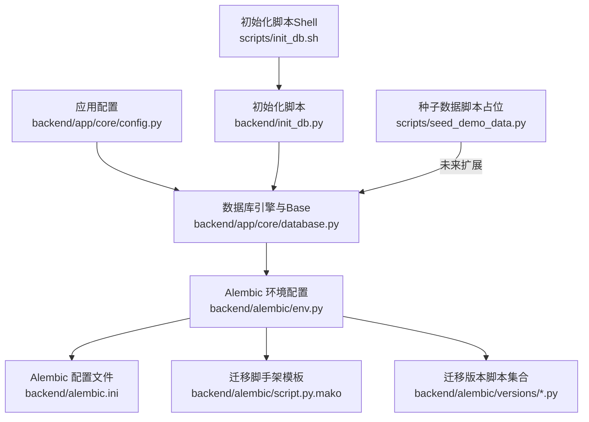
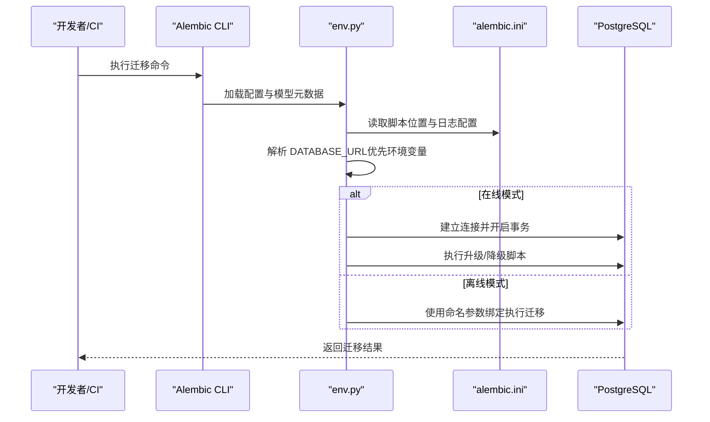
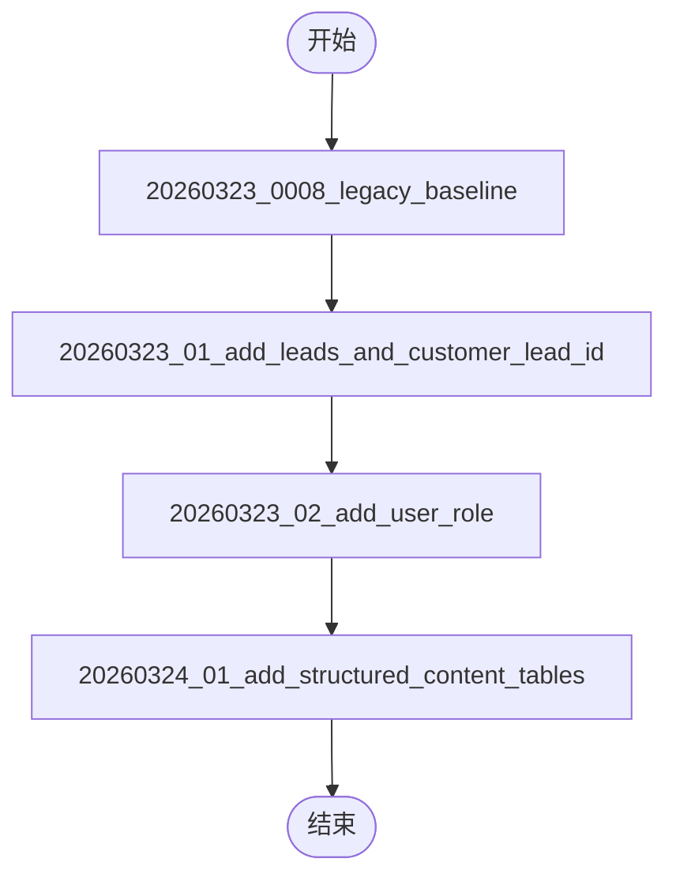
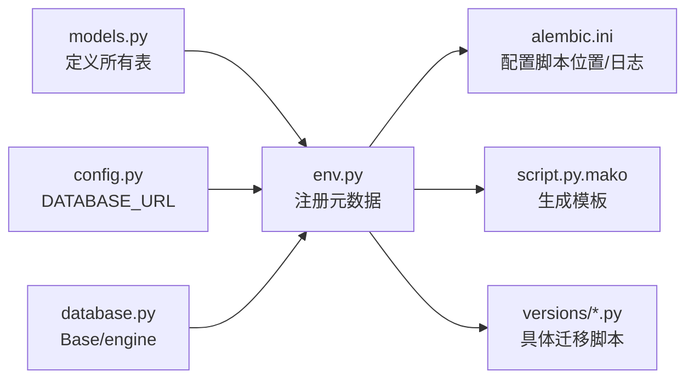

# 数据库迁移

<cite>
**本文引用的文件**
- [backend/alembic.ini](file://backend/alembic.ini)
- [backend/alembic/env.py](file://backend/alembic/env.py)
- [backend/alembic/script.py.mako](file://backend/alembic/script.py.mako)
- [backend/alembic/versions/20260323_0008_legacy_baseline.py](file://backend/alembic/versions/20260323_0008_legacy_baseline.py)
- [backend/alembic/versions/20260323_01_add_leads_and_customer_lead_id.py](file://backend/alembic/versions/20260323_01_add_leads_and_customer_lead_id.py)
- [backend/alembic/versions/20260323_02_add_user_role.py](file://backend/alembic/versions/20260323_02_add_user_role.py)
- [backend/alembic/versions/20260324_01_add_structured_content_tables.py](file://backend/alembic/versions/20260324_01_add_structured_content_tables.py)
- [backend/app/core/database.py](file://backend/app/core/database.py)
- [backend/app/core/config.py](file://backend/app/core/config.py)
- [backend/init_db.py](file://backend/init_db.py)
- [backend/pyproject.toml](file://backend/pyproject.toml)
- [scripts/init_db.sh](file://scripts/init_db.sh)
- [scripts/seed_demo_data.py](file://scripts/seed_demo_data.py)
</cite>

## 目录
1. [简介](#简介)
2. [项目结构](#项目结构)
3. [核心组件](#核心组件)
4. [架构总览](#架构总览)
5. [详细组件分析](#详细组件分析)
6. [依赖关系分析](#依赖关系分析)
7. [性能考虑](#性能考虑)
8. [故障排除指南](#故障排除指南)
9. [结论](#结论)
10. [附录](#附录)

## 简介
本文件为“智获客”数据库迁移系统的全面技术文档，聚焦于基于 Alembic 的迁移框架配置与使用、迁移历史与演进、每次迁移的具体变更与回滚策略、迁移脚本编写规范与最佳实践、数据库初始化流程与种子数据管理，以及迁移故障排除与恢复指南。文档面向开发者与运维人员，既提供高层概览也包含代码级细节与可视化图示。

## 项目结构
与数据库迁移直接相关的目录与文件包括：
- Alembic 配置与入口：backend/alembic.ini、backend/alembic/env.py、backend/alembic/script.py.mako
- 迁移版本脚本：backend/alembic/versions/*.py
- 应用数据库引擎与模型元数据：backend/app/core/database.py、backend/app/models/models.py
- 初始化与清理工具：backend/init_db.py、scripts/init_db.sh
- 依赖与工具链：backend/pyproject.toml
- 种子数据脚本占位：scripts/seed_demo_data.py

图表来源
- [backend/alembic/env.py:1-88](file://backend/alembic/env.py#L1-L88)
- [backend/alembic.ini:1-43](file://backend/alembic.ini#L1-L43)
- [backend/alembic/script.py.mako:1-25](file://backend/alembic/script.py.mako#L1-L25)
- [backend/app/core/database.py:1-29](file://backend/app/core/database.py#L1-L29)
- [backend/app/core/config.py:1-103](file://backend/app/core/config.py#L1-L103)
- [backend/init_db.py:1-44](file://backend/init_db.py#L1-L44)
- [scripts/init_db.sh:1-5](file://scripts/init_db.sh#L1-L5)
- [scripts/seed_demo_data.py:1-7](file://scripts/seed_demo_data.py#L1-L7)

章节来源
- [backend/alembic.ini:1-43](file://backend/alembic.ini#L1-L43)
- [backend/alembic/env.py:1-88](file://backend/alembic/env.py#L1-L88)
- [backend/alembic/script.py.mako:1-25](file://backend/alembic/script.py.mako#L1-L25)
- [backend/app/core/database.py:1-29](file://backend/app/core/database.py#L1-L29)
- [backend/app/core/config.py:1-103](file://backend/app/core/config.py#L1-L103)
- [backend/init_db.py:1-44](file://backend/init_db.py#L1-L44)
- [scripts/init_db.sh:1-5](file://scripts/init_db.sh#L1-L5)
- [scripts/seed_demo_data.py:1-7](file://scripts/seed_demo_data.py#L1-L7)

## 核心组件
- Alembic 配置与运行环境
  - alembic.ini：定义脚本位置、日志级别、SQLAlchemy 连接串（本地调试优先）、钩子与格式化器等。
  - env.py：加载 .env、注册模型元数据、构建目标元数据、在线/离线迁移执行路径、数据库 URL 解析优先级。
  - script.py.mako：迁移脚手架模板，生成 up/down 升降级函数与修订信息。
- 应用数据库层
  - database.py：创建 SQLAlchemy 引擎、会话工厂、声明式基类 Base，并提供 get_db 会话注入。
  - config.py：集中管理 DATABASE_URL 等配置项，支持从 .env 注入。
- 迁移版本脚本
  - versions/*：按时间顺序组织的迁移脚本，包含升级与回滚逻辑，部分脚本采用存在性检查与增量补丁方式。
- 初始化与清理
  - init_db.py：一键创建或删除所有表（谨慎使用），供开发与测试环境快速重置。
  - init_db.sh：Shell 包装脚本，便于 CI/CD 或本地快速初始化。
- 工具链与依赖
  - pyproject.toml：声明 alembic、sqlalchemy、psycopg2 等依赖，确保迁移工具链可用。

章节来源
- [backend/alembic.ini:1-43](file://backend/alembic.ini#L1-L43)
- [backend/alembic/env.py:1-88](file://backend/alembic/env.py#L1-L88)
- [backend/alembic/script.py.mako:1-25](file://backend/alembic/script.py.mako#L1-L25)
- [backend/app/core/database.py:1-29](file://backend/app/core/database.py#L1-L29)
- [backend/app/core/config.py:1-103](file://backend/app/core/config.py#L1-L103)
- [backend/init_db.py:1-44](file://backend/init_db.py#L1-L44)
- [scripts/init_db.sh:1-5](file://scripts/init_db.sh#L1-L5)
- [backend/pyproject.toml:1-47](file://backend/pyproject.toml#L1-L47)

## 架构总览
下图展示 Alembic 在应用中的角色与数据流：env.py 通过 Alembic 配置读取数据库 URL，注册模型元数据，随后根据运行模式选择在线或离线迁移路径，最终对目标数据库执行迁移。

图表来源
- [backend/alembic/env.py:37-87](file://backend/alembic/env.py#L37-L87)
- [backend/alembic.ini:1-43](file://backend/alembic.ini#L1-L43)

章节来源
- [backend/alembic/env.py:1-88](file://backend/alembic/env.py#L1-L88)
- [backend/alembic.ini:1-43](file://backend/alembic.ini#L1-L43)

## 详细组件分析

### 组件一：迁移历史与演进
- 20260323_0008_legacy_baseline：兼容桥接修订，保持现有数据库迁移链路连续性。
- 20260323_01_add_leads_and_customer_lead_id：引入线索池表与客户到线索的关联约束。
- 20260323_02_add_user_role：为用户表增加角色列并填充默认值。
- 20260324_01_add_structured_content_tables：新增结构化内容表族（内容块、评论、快照、洞察）。

图表来源
- [backend/alembic/versions/20260323_0008_legacy_baseline.py:1-26](file://backend/alembic/versions/20260323_0008_legacy_baseline.py#L1-L26)
- [backend/alembic/versions/20260323_01_add_leads_and_customer_lead_id.py:1-117](file://backend/alembic/versions/20260323_01_add_leads_and_customer_lead_id.py#L1-L117)
- [backend/alembic/versions/20260323_02_add_user_role.py:1-36](file://backend/alembic/versions/20260323_02_add_user_role.py#L1-L36)
- [backend/alembic/versions/20260324_01_add_structured_content_tables.py:1-104](file://backend/alembic/versions/20260324_01_add_structured_content_tables.py#L1-L104)

章节来源
- [backend/alembic/versions/20260323_0008_legacy_baseline.py:1-26](file://backend/alembic/versions/20260323_0008_legacy_baseline.py#L1-L26)
- [backend/alembic/versions/20260323_01_add_leads_and_customer_lead_id.py:1-117](file://backend/alembic/versions/20260323_01_add_leads_and_customer_lead_id.py#L1-L117)
- [backend/alembic/versions/20260323_02_add_user_role.py:1-36](file://backend/alembic/versions/20260323_02_add_user_role.py#L1-L36)
- [backend/alembic/versions/20260324_01_add_structured_content_tables.py:1-104](file://backend/alembic/versions/20260324_01_add_structured_content_tables.py#L1-L104)

### 组件二：迁移版本脚本详解

#### 版本 20260323_0008_legacy_baseline
- 目标：作为兼容桥接，保持现有数据库在该修订点的迁移链路可继续。
- 升级/降级：空实现，仅维持修订链完整性。

章节来源
- [backend/alembic/versions/20260323_0008_legacy_baseline.py:1-26](file://backend/alembic/versions/20260323_0008_legacy_baseline.py#L1-L26)

#### 版本 20260323_01_add_leads_and_customer_lead_id
- 升级要点
  - 若不存在则创建线索表，否则对缺失列进行增量添加。
  - 对线索表创建若干索引（如主键、外键字段）。
  - 为客户表增加 lead_id 外键、唯一约束。
- 降级要点
  - 删除客户表唯一与外键约束。
  - 删除客户 lead_id 列。
  - 删除线索表及其索引。

章节来源
- [backend/alembic/versions/20260323_01_add_leads_and_customer_lead_id.py:18-117](file://backend/alembic/versions/20260323_01_add_leads_and_customer_lead_id.py#L18-L117)

#### 版本 20260323_02_add_user_role
- 升级要点
  - 为用户表增加角色列，设置默认值并更新已有记录，再将列设为非空。
- 降级要点
  - 删除角色列。

章节来源
- [backend/alembic/versions/20260323_02_add_user_role.py:18-36](file://backend/alembic/versions/20260323_02_add_user_role.py#L18-L36)

#### 版本 20260324_01_add_structured_content_tables
- 升级要点
  - 条件创建内容块、评论、快照、洞察四张表及必要索引。
  - 表间外键约束与级联删除策略明确。
- 降级要点
  - 逆序删除索引与表，确保外键约束先于表删除。

章节来源
- [backend/alembic/versions/20260324_01_add_structured_content_tables.py:18-104](file://backend/alembic/versions/20260324_01_add_structured_content_tables.py#L18-L104)

### 组件三：迁移脚手架与模板
- script.py.mako：提供标准的升级/降级模板，自动生成修订 ID、上下游关系与时间戳，减少手工错误。

章节来源
- [backend/alembic/script.py.mako:1-25](file://backend/alembic/script.py.mako#L1-L25)

### 组件四：数据库初始化与清理
- init_db.py
  - init：创建所有表（基于 Base.metadata.create_all）。
  - drop：交互式删除所有表（危险操作，需确认）。
- init_db.sh：进入 backend 目录并执行 init_db.py，便于自动化与 CI。

章节来源
- [backend/init_db.py:16-44](file://backend/init_db.py#L16-L44)
- [scripts/init_db.sh:1-5](file://scripts/init_db.sh#L1-L5)

### 组件五：环境与配置
- alembic.ini
  - 指定脚本位置与日志级别，本地调试使用内置 sqlalchemy.url，生产建议通过环境变量 DATABASE_URL。
- env.py
  - 从 .env 加载 DATABASE_URL，若未提供则回退至 alembic.ini 中的 sqlalchemy.url。
  - 注册模型元数据与 Base.metadata，确保 Alembic 能发现应用模型。
- database.py / config.py
  - 提供统一的 ENGINE 与 Base，保证 Alembic 与应用共享同一套模型定义。

章节来源
- [backend/alembic.ini:1-43](file://backend/alembic.ini#L1-L43)
- [backend/alembic/env.py:22-44](file://backend/alembic/env.py#L22-L44)
- [backend/app/core/database.py:1-29](file://backend/app/core/database.py#L1-L29)
- [backend/app/core/config.py:27-35](file://backend/app/core/config.py#L27-L35)

## 依赖关系分析
- Alembic 与应用模型的耦合
  - env.py 导入 app.models 以注册模型元数据，确保 Alembic 能扫描到所有表定义。
  - database.py 提供 Base 与 engine，env.py 通过 target_metadata 与 compare_type/compare_server_default 控制迁移对比行为。
- 依赖与工具链
  - pyproject.toml 声明 alembic、sqlalchemy、psycopg2，保证迁移工具链可用。
- 运行时依赖
  - DATABASE_URL 由 .env 或 alembic.ini 提供，env.py 优先读取环境变量。

图表来源
- [backend/alembic/env.py:30-34](file://backend/alembic/env.py#L30-L34)
- [backend/app/core/config.py:27-35](file://backend/app/core/config.py#L27-L35)
- [backend/app/core/database.py:18-19](file://backend/app/core/database.py#L18-L19)
- [backend/alembic.ini:1-43](file://backend/alembic.ini#L1-L43)
- [backend/alembic/script.py.mako:1-25](file://backend/alembic/script.py.mako#L1-L25)

章节来源
- [backend/alembic/env.py:1-88](file://backend/alembic/env.py#L1-L88)
- [backend/app/core/config.py:1-103](file://backend/app/core/config.py#L1-L103)
- [backend/app/core/database.py:1-29](file://backend/app/core/database.py#L1-L29)
- [backend/alembic.ini:1-43](file://backend/alembic.ini#L1-L43)
- [backend/alembic/script.py.mako:1-25](file://backend/alembic/script.py.mako#L1-L25)

## 性能考虑
- 连接池与预检
  - database.py 启用 pool_pre_ping，避免连接失效导致迁移中断。
  - engine 参数中设置 pool_size 与 max_overflow，平衡并发与资源占用。
- 迁移执行
  - env.py 在在线模式下使用 NullPool 并显式开启事务，确保迁移原子性。
  - script.py.mako 生成的脚本尽量使用条件判断（如表/列/索引存在性检查），减少重复DDL开销。
- 日志与可观测性
  - alembic.ini 设置 INFO 级别日志，便于排查迁移问题。

章节来源
- [backend/app/core/database.py:6-13](file://backend/app/core/database.py#L6-L13)
- [backend/alembic/env.py:62-81](file://backend/alembic/env.py#L62-L81)
- [backend/alembic.ini:29-42](file://backend/alembic.ini#L29-L42)

## 故障排除指南
- 数据库连接失败
  - 确认 .env 中 DATABASE_URL 是否正确，或在 alembic.ini 中设置 sqlalchemy.url（仅本地调试）。
  - env.py 会优先读取环境变量，若两者都为空将抛出异常。
- 迁移无法识别模型
  - 确保 env.py 成功导入 app.models，使模型元数据被注册。
  - 确认 alembic.ini 的 script_location 与实际路径一致。
- 在线/离线模式差异
  - 在线模式通过连接执行迁移，适合生产；离线模式使用命名参数绑定，适合测试或无连接场景。
- 回滚风险
  - 部分脚本（如结构化内容表）在降级时按逆序删除索引与表，确保外键约束先于表删除。
  - 对于有业务数据的生产库，务必先备份，再在低峰期执行回滚。
- 初始化与清理
  - init_db.py 的 drop 操作不可逆，执行前请确认备份与影响范围。
  - init_db.sh 用于自动化初始化，确保 backend 目录可执行。

章节来源
- [backend/alembic/env.py:22-44](file://backend/alembic/env.py#L22-L44)
- [backend/alembic/env.py:47-87](file://backend/alembic/env.py#L47-L87)
- [backend/alembic/versions/20260324_01_add_structured_content_tables.py:80-104](file://backend/alembic/versions/20260324_01_add_structured_content_tables.py#L80-L104)
- [backend/init_db.py:23-32](file://backend/init_db.py#L23-L32)
- [scripts/init_db.sh:1-5](file://scripts/init_db.sh#L1-L5)

## 结论
本系统以 Alembic 为核心，结合应用模型元数据与统一的数据库配置，实现了可追踪、可回滚、可扩展的数据库演进机制。通过版本化的迁移脚本与严格的回滚策略，保障了数据库结构与业务需求的同步演进。配合初始化与清理工具，可在开发与测试环境中高效迭代，在生产环境中通过严谨的回滚与备份流程降低风险。

## 附录

### 迁移脚本编写规范与最佳实践
- 使用条件判断
  - 优先检测表/列/索引是否存在，再决定创建或修改，避免重复执行报错。
- 明确外键与索引
  - 创建表时同步创建常用索引；删除表前先删除索引与约束，遵循逆序删除原则。
- 默认值与非空
  - 新增列时提供合理的默认值与后续更新策略，再将列设为非空。
- 事务与原子性
  - 在在线模式下使用 begin_transaction 包裹迁移，确保原子性。
- 可观测性
  - 通过 alembic.ini 设置合适的日志级别，便于定位问题。

章节来源
- [backend/alembic/versions/20260323_01_add_leads_and_customer_lead_id.py:18-117](file://backend/alembic/versions/20260323_01_add_leads_and_customer_lead_id.py#L18-L117)
- [backend/alembic/versions/20260323_02_add_user_role.py:18-36](file://backend/alembic/versions/20260323_02_add_user_role.py#L18-L36)
- [backend/alembic/versions/20260324_01_add_structured_content_tables.py:18-104](file://backend/alembic/versions/20260324_01_add_structured_content_tables.py#L18-L104)
- [backend/alembic/env.py:62-81](file://backend/alembic/env.py#L62-L81)
- [backend/alembic.ini:29-42](file://backend/alembic.ini#L29-L42)

### 数据库初始化流程与种子数据管理
- 初始化流程
  - 使用 init_db.sh 进入 backend 目录并执行 init_db.py，创建所有表。
  - 如需在应用启动时自动建表，可启用 settings.DB_AUTO_CREATE_TABLES（当前配置为关闭）。
- 种子数据
  - scripts/seed_demo_data.py 当前为占位脚本，未来可在此处实现演示数据的批量插入与校验。

章节来源
- [scripts/init_db.sh:1-5](file://scripts/init_db.sh#L1-L5)
- [backend/init_db.py:16-21](file://backend/init_db.py#L16-L21)
- [backend/app/core/config.py:34-34](file://backend/app/core/config.py#L34-L34)
- [scripts/seed_demo_data.py:1-7](file://scripts/seed_demo_data.py#L1-L7)