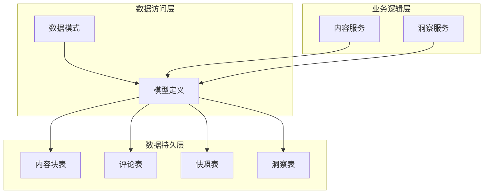
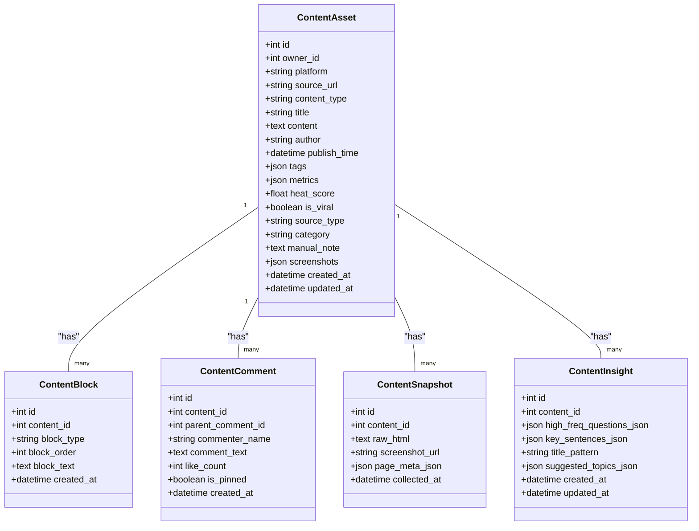
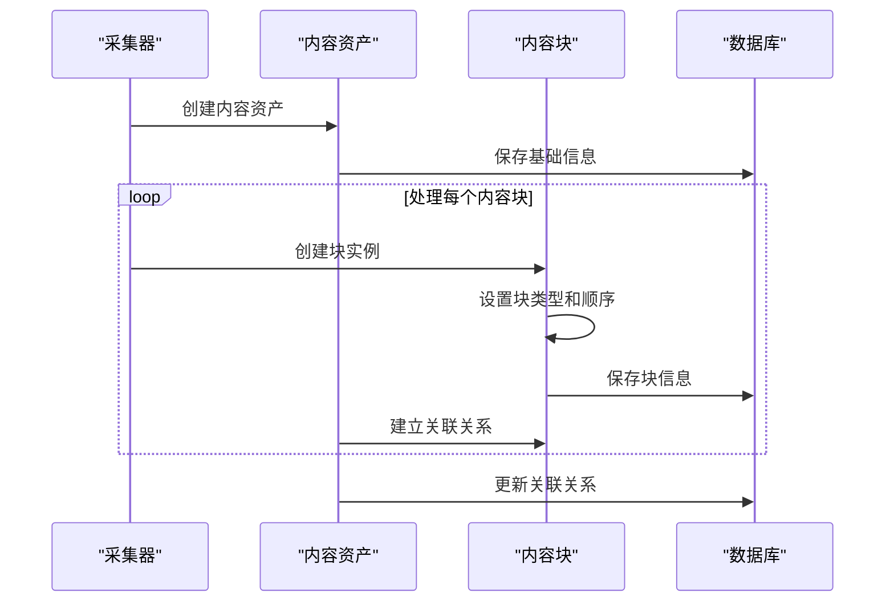
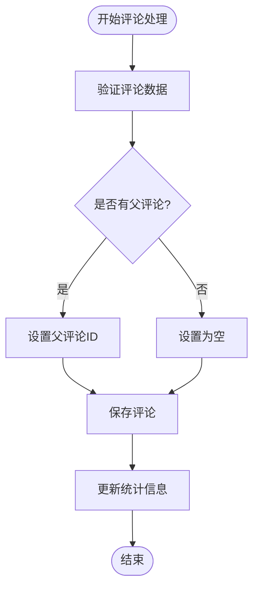
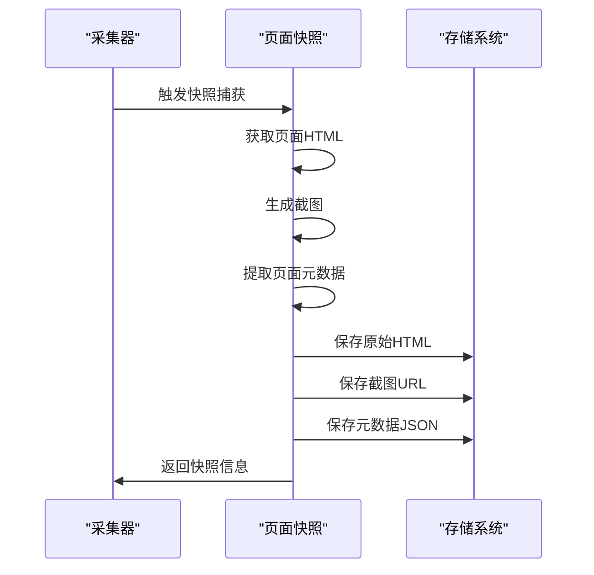
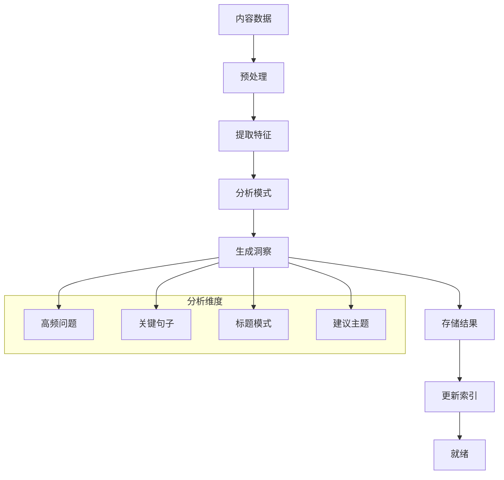
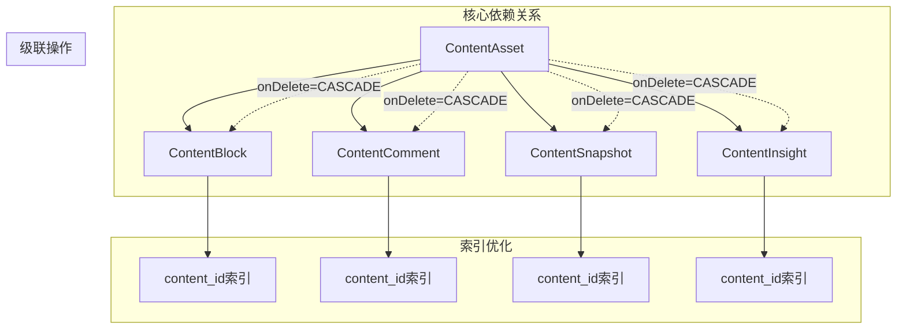

# 内容结构化模型

<cite>
**本文档引用的文件**
- [models.py](file://backend/app/models/models.py)
- [schemas.py](file://backend/app/schemas/schemas.py)
- [20260324_01_add_structured_content_tables.py](file://backend/alembic/versions/20260324_01_add_structured_content_tables.py)
- [content_service.py](file://backend/app/services/content_service.py)
- [insight_service.py](file://backend/app/services/insight_service.py)
</cite>

## 目录
1. [简介](#简介)
2. [项目结构](#项目结构)
3. [核心组件](#核心组件)
4. [架构概览](#架构概览)
5. [详细组件分析](#详细组件分析)
6. [依赖分析](#依赖分析)
7. [性能考虑](#性能考虑)
8. [故障排除指南](#故障排除指南)
9. [结论](#结论)

## 简介

智获客项目中的内容结构化模型是一套完整的数据架构，用于存储和管理从各社交平台采集的内容资产。该模型包含四个核心结构化内容模型：ContentBlock（内容块）、ContentComment（内容评论）、ContentSnapshot（页面快照）和ContentInsight（内容洞察），这些模型共同构成了内容资产管理的完整生命周期。

本系统设计的核心目标是提供结构化的数据存储方案，支持内容的多维度分析、评论管理、页面快照保存和智能洞察生成。通过这些模型，系统能够实现从内容采集、结构化存储到智能分析的完整流程。

## 项目结构

系统采用分层架构设计，主要包含以下层次：

**图表来源**
- [models.py:85-148](file://backend/app/models/models.py#L85-L148)
- [20260324_01_add_structured_content_tables.py:18-78](file://backend/alembic/versions/20260324_01_add_structured_content_tables.py#L18-L78)

**章节来源**
- [models.py:85-148](file://backend/app/models/models.py#L85-L148)
- [20260324_01_add_structured_content_tables.py:18-78](file://backend/alembic/versions/20260324_01_add_structured_content_tables.py#L18-L78)

## 核心组件

### ContentAsset（内容资产）
ContentAsset是所有内容的基础模型，代表从各平台采集的内容资产。它包含了内容的基本信息、元数据和统计数据。

**核心字段：**
- `id`: 主键标识符
- `owner_id`: 所有者用户ID
- `platform`: 内容来源平台
- `source_url`: 原始链接地址
- `content_type`: 内容类型（post、video、answer、listing）
- `title`: 内容标题
- `content`: 原始内容文本
- `author`: 作者信息
- `publish_time`: 发布时间
- `tags`: 标签列表
- `metrics`: 互动统计数据
- `heat_score`: 热度评分
- `is_viral`: 是否为爆款内容
- `source_type`: 来源类型（link、paste、import）
- `category`: 领域分类
- `manual_note`: 手动备注
- `screenshots`: 截图URL列表

**章节来源**
- [models.py:45-84](file://backend/app/models/models.py#L45-L84)

### ContentBlock（内容块）
ContentBlock用于存储结构化的内容块，支持不同类型的文本块按顺序排列。

**核心字段：**
- `id`: 主键标识符
- `content_id`: 关联的内容资产ID
- `block_type`: 块类型，默认为"paragraph"
- `block_order`: 块的顺序位置
- `block_text`: 块的文本内容
- `created_at`: 创建时间

**章节来源**
- [models.py:86-98](file://backend/app/models/models.py#L86-L98)

### ContentComment（内容评论）
ContentComment模型支持评论的层级关系管理，包括父子评论关系。

**核心字段：**
- `id`: 主键标识符
- `content_id`: 关联的内容资产ID
- `parent_comment_id`: 父评论ID（支持多级评论）
- `commenter_name`: 评论者名称
- `comment_text`: 评论内容
- `like_count`: 点赞数量
- `is_pinned`: 是否置顶
- `created_at`: 创建时间

**章节来源**
- [models.py:101-115](file://backend/app/models/models.py#L101-L115)

### ContentSnapshot（页面快照）
ContentSnapshot用于保存内容采集时的页面状态，包括HTML内容和页面元数据。

**核心字段：**
- `id`: 主键标识符
- `content_id`: 关联的内容资产ID
- `raw_html`: 原始HTML内容
- `screenshot_url`: 截图URL
- `page_meta_json`: 页面元数据JSON
- `collected_at`: 采集时间

**章节来源**
- [models.py:118-130](file://backend/app/models/models.py#L118-L130)

### ContentInsight（内容洞察）
ContentInsight模型存储异步生成的内容分析结果，提供高级别的洞察信息。

**核心字段：**
- `id`: 主键标识符
- `content_id`: 关联的内容资产ID
- `high_freq_questions_json`: 高频问题JSON数组
- `key_sentences_json`: 关键句子JSON数组
- `title_pattern`: 标题模式
- `suggested_topics_json`: 建议主题JSON数组
- `created_at`: 创建时间
- `updated_at`: 更新时间

**章节来源**
- [models.py:133-147](file://backend/app/models/models.py#L133-L147)

## 架构概览

系统采用基于关系型数据库的结构化存储方案，通过外键关系建立模型间的关联：

**图表来源**
- [models.py:85-148](file://backend/app/models/models.py#L85-L148)

## 详细组件分析

### 内容块处理流程

内容块是结构化内容的核心组成部分，支持多种块类型和有序排列：

**图表来源**
- [models.py:86-98](file://backend/app/models/models.py#L86-L98)
- [20260324_01_add_structured_content_tables.py:23-34](file://backend/alembic/versions/20260324_01_add_structured_content_tables.py#L23-L34)

### 评论层级关系管理

评论系统支持多级嵌套评论，通过parent_comment_id字段建立层级关系：

**图表来源**
- [models.py:101-115](file://backend/app/models/models.py#L101-L115)
- [20260324_01_add_structured_content_tables.py:36-49](file://backend/alembic/versions/20260324_01_add_structured_content_tables.py#L36-L49)

### 页面快照捕获机制

页面快照功能在内容采集时自动捕获页面状态：

**图表来源**
- [models.py:118-130](file://backend/app/models/models.py#L118-L130)
- [20260324_01_add_structured_content_tables.py:51-62](file://backend/alembic/versions/20260324_01_add_structured_content_tables.py#L51-L62)

### 内容洞察分析流程

内容洞察系统提供异步分析能力，生成结构化的分析结果：

**图表来源**
- [models.py:133-147](file://backend/app/models/models.py#L133-L147)
- [20260324_01_add_structured_content_tables.py:64-77](file://backend/alembic/versions/20260324_01_add_structured_content_tables.py#L64-L77)

**章节来源**
- [models.py:85-148](file://backend/app/models/models.py#L85-L148)

## 依赖分析

系统中的模型间存在明确的依赖关系和外键约束：

**图表来源**
- [models.py:80-83](file://backend/app/models/models.py#L80-L83)
- [20260324_01_add_structured_content_tables.py:33](file://backend/alembic/versions/20260324_01_add_structured_content_tables.py#L33)

**章节来源**
- [models.py:80-83](file://backend/app/models/models.py#L80-L83)
- [20260324_01_add_structured_content_tables.py:33-103](file://backend/alembic/versions/20260324_01_add_structured_content_tables.py#L33-L103)

## 性能考虑

### 查询模式优化

系统提供了多种查询模式以满足不同的使用场景：

**内容资产查询：**
- 用户内容列表：按创建时间倒序排列
- 内容搜索：支持标题和内容的模糊匹配
- 主题过滤：基于关键词和标签的组合查询

**洞察内容查询：**
- 多维度筛选：平台、主题、热度等级、AI分析状态
- 搜索功能：支持标题和正文的全文搜索
- 排序优化：按互动分数进行排序

### 索引策略

为提高查询性能，系统在关键字段上建立了适当的索引：

- `content_id`：所有子表都建立了外键索引
- `created_at`：按时间排序的索引
- `content_type`：内容类型的索引
- `is_viral`：爆款内容的布尔索引

### 缓存策略

对于频繁访问的数据，建议实施缓存策略：
- 热门内容的元数据缓存
- 主题统计信息的定期更新
- 评论数量的实时统计缓存

## 故障排除指南

### 常见问题诊断

**数据完整性问题：**
- 外键约束错误：检查关联的ContentAsset是否存在
- 级联删除异常：确认删除顺序是否正确
- 数据重复：检查唯一性约束和去重逻辑

**性能问题：**
- 查询超时：检查相关索引是否有效
- 内存溢出：优化大数据量的分页查询
- 锁竞争：减少长事务的使用

**数据一致性问题：**
- 异步处理失败：检查队列状态和重试机制
- 数据同步延迟：监控ETL管道的状态
- 版本冲突：处理并发更新的情况

### 调试工具

系统提供了多种调试和监控工具：
- SQL查询日志：跟踪慢查询和错误查询
- 性能监控：监控数据库连接和查询性能
- 错误追踪：记录异常堆栈和上下文信息

**章节来源**
- [content_service.py:28-79](file://backend/app/services/content_service.py#L28-L79)
- [insight_service.py:302-333](file://backend/app/services/insight_service.py#L302-L333)

## 结论

智获客的内容结构化模型提供了一个完整的内容资产管理解决方案。通过ContentBlock、ContentComment、ContentSnapshot和ContentInsight四个核心模型，系统实现了从内容采集、结构化存储到智能分析的全流程管理。

该模型的主要优势包括：
- **结构化存储**：通过明确的数据模型和关系定义，确保数据的一致性和完整性
- **灵活扩展**：支持多种内容类型和评论层级，适应不同的业务需求
- **性能优化**：合理的索引策略和查询模式，保证系统的高效运行
- **智能分析**：内置的洞察生成功能，提供高级别的数据分析能力

未来可以考虑的改进方向：
- 增加更多的内容类型支持
- 优化大规模数据的查询性能
- 加强数据备份和恢复机制
- 扩展实时分析和流式处理能力