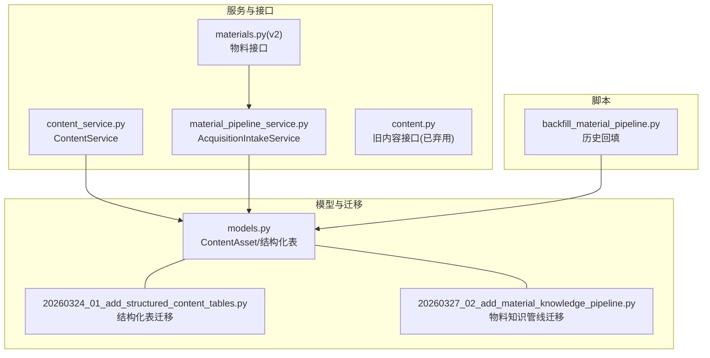
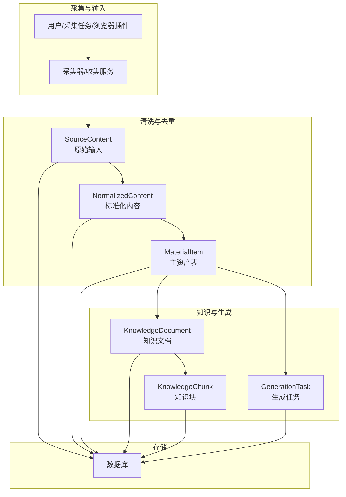
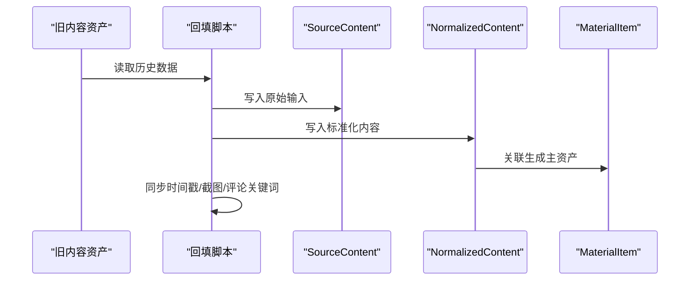
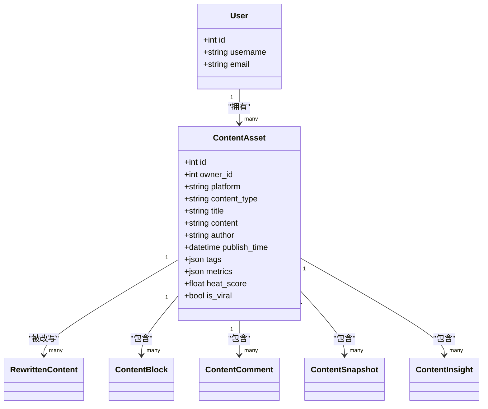

# 内容资产模型

<cite>
**本文引用的文件**
- [models.py](file://backend/app/models/models.py)
- [schemas.py](file://backend/app/schemas/schemas.py)
- [content_service.py](file://backend/app/services/content_service.py)
- [20260324_01_add_structured_content_tables.py](file://backend/alembic/versions/20260324_01_add_structured_content_tables.py)
- [20260327_02_add_material_knowledge_pipeline.py](file://backend/alembic/versions/20260327_02_add_material_knowledge_pipeline.py)
- [material_pipeline_service.py](file://backend/app/services/collector/material_pipeline_service.py)
- [backfill_material_pipeline.py](file://scripts/backfill_material_pipeline.py)
- [content.py](file://backend/app/api/endpoints/content.py)
- [materials.py](file://backend/app/api/v2/endpoints/materials.py)
</cite>

## 目录
1. [简介](#简介)
2. [项目结构](#项目结构)
3. [核心组件](#核心组件)
4. [架构总览](#架构总览)
5. [详细组件分析](#详细组件分析)
6. [依赖分析](#依赖分析)
7. [性能考虑](#性能考虑)
8. [故障排查指南](#故障排查指南)
9. [结论](#结论)
10. [附录](#附录)

## 简介
本文件系统性梳理“智获客”内容资产模型，围绕 ContentAsset 模型的设计理念、字段语义、统计与智能分析指标、生命周期管理与查询优化进行深入说明。同时结合迁移脚本与物料管线服务，给出从采集、清洗、去重、入库到知识抽取与生成的完整链路视图，帮助开发者与产品人员快速理解与使用。

## 项目结构
围绕内容资产模型的关键文件分布如下：
- 数据模型定义：backend/app/models/models.py
- Pydantic 输入输出模型：backend/app/schemas/schemas.py
- 传统内容服务封装：backend/app/services/content_service.py
- 结构化内容表迁移：backend/alembic/versions/20260324_01_add_structured_content_tables.py
- 物料知识管线迁移：backend/alembic/versions/20260327_02_add_material_knowledge_pipeline.py
- 物料采集与去重服务：backend/app/services/collector/material_pipeline_service.py
- 历史数据回填脚本：scripts/backfill_material_pipeline.py
- 旧内容接口（已弃用）：backend/app/api/endpoints/content.py
- 新物料接口（v2）：backend/app/api/v2/endpoints/materials.py

图表来源
- [models.py:45-84](file://backend/app/models/models.py#L45-L84)
- [20260324_01_add_structured_content_tables.py:18-78](file://backend/alembic/versions/20260324_01_add_structured_content_tables.py#L18-L78)
- [20260327_02_add_material_knowledge_pipeline.py:85-102](file://backend/alembic/versions/20260327_02_add_material_knowledge_pipeline.py#L85-L102)
- [content_service.py:8-79](file://backend/app/services/content_service.py#L8-L79)
- [material_pipeline_service.py:30-200](file://backend/app/services/collector/material_pipeline_service.py#L30-L200)
- [content.py:1-19](file://backend/app/api/endpoints/content.py#L1-L19)
- [materials.py:167-196](file://backend/app/api/v2/endpoints/materials.py#L167-L196)
- [backfill_material_pipeline.py:32-100](file://scripts/backfill_material_pipeline.py#L32-L100)

章节来源
- [models.py:45-84](file://backend/app/models/models.py#L45-L84)
- [20260324_01_add_structured_content_tables.py:18-78](file://backend/alembic/versions/20260324_01_add_structured_content_tables.py#L18-L78)
- [20260327_02_add_material_knowledge_pipeline.py:85-102](file://backend/alembic/versions/20260327_02_add_material_knowledge_pipeline.py#L85-L102)
- [content_service.py:8-79](file://backend/app/services/content_service.py#L8-L79)
- [material_pipeline_service.py:30-200](file://backend/app/services/collector/material_pipeline_service.py#L30-L200)
- [content.py:1-19](file://backend/app/api/endpoints/content.py#L1-L19)
- [materials.py:167-196](file://backend/app/api/v2/endpoints/materials.py#L167-L196)
- [backfill_material_pipeline.py:32-100](file://scripts/backfill_material_pipeline.py#L32-L100)

## 核心组件
- ContentAsset：内容资产主表，承载平台类型、内容类型、标题、正文、作者、发布时间、标签、评论关键词、热门评论、统计数据、热度评分、是否热门、来源类型、分类、备注、截图等字段，并维护与用户、改写、块、评论、快照、洞察的关系。
- 结构化内容子表：content_blocks（段落/块）、content_comments（评论树）、content_snapshots（页面快照）、content_insights（洞察结果）。
- 物料知识管线：source_contents → normalized_contents → material_items → knowledge_documents → knowledge_chunks，配套 generation_tasks 与知识检索。
- 传统内容服务：ContentService 提供 CRUD 与搜索能力；v2 接口替代旧内容接口。

章节来源
- [models.py:45-84](file://backend/app/models/models.py#L45-L84)
- [20260324_01_add_structured_content_tables.py:23-77](file://backend/alembic/versions/20260324_01_add_structured_content_tables.py#L23-L77)
- [20260327_02_add_material_knowledge_pipeline.py:85-102](file://backend/alembic/versions/20260327_02_add_material_knowledge_pipeline.py#L85-L102)
- [content_service.py:8-79](file://backend/app/services/content_service.py#L8-L79)
- [content.py:1-19](file://backend/app/api/endpoints/content.py#L1-L19)
- [materials.py:167-196](file://backend/app/api/v2/endpoints/materials.py#L167-L196)

## 架构总览
内容资产从采集到入库再到知识与生成的全链路如下：

图表来源
- [material_pipeline_service.py:30-200](file://backend/app/services/collector/material_pipeline_service.py#L30-L200)
- [models.py:507-640](file://backend/app/models/models.py#L507-L640)
- [20260327_02_add_material_knowledge_pipeline.py:85-102](file://backend/alembic/versions/20260327_02_add_material_knowledge_pipeline.py#L85-L102)

## 详细组件分析

### ContentAsset 字段设计与语义
- 平台类型 platform：枚举值包括小红书、抖音、知乎、闲鱼、微信及其他，用于区分内容来源平台。
- 内容类型 content_type：如帖子、视频、回答、商品等，便于后续改写与发布适配。
- 标题 title 与正文 content：核心内容载体，支持结构化块与评论树扩展。
- 作者 author 与发布时间 publish_time：便于溯源与时间轴展示。
- 标签 tags、评论关键词 comments_keywords、热门评论 top_comments：辅助检索与内容画像。
- 统计数据 metrics：包含点赞、评论、收藏、分享等聚合指标，可直接用于排序与筛选。
- 热度评分 heat_score 与是否热门 is_viral：基于算法计算的热度指标，支持“病毒式”标记。
- 来源类型 source_type：粘贴、链接、导入等，便于追踪采集方式。
- 分类 category：领域分类，如额度提升、客户话术等。
- 备注 manual_note 与截图 screenshots：人工标注与可视化证据。
- 创建/更新时间 created_at/updated_at：用于审计与排序。

章节来源
- [models.py:29-43](file://backend/app/models/models.py#L29-L43)
- [models.py:45-84](file://backend/app/models/models.py#L45-L84)
- [schemas.py:72-108](file://backend/app/schemas/schemas.py#L72-L108)

### 结构化内容子表
- content_blocks：按顺序拆分的内容块，支持段落等类型，便于渲染与二次编辑。
- content_comments：评论树结构，支持置顶、点赞数、父子评论关联。
- content_snapshots：采集时的页面快照与元信息，便于复核与取证。
- content_insights：AI 洞察结果，如高频问题、关键句子、标题模式、建议主题等。

章节来源
- [models.py:86-148](file://backend/app/models/models.py#L86-L148)
- [20260324_01_add_structured_content_tables.py:23-77](file://backend/alembic/versions/20260324_01_add_structured_content_tables.py#L23-L77)

### 物料知识管线与历史回填
- AcquisitionIntakeService：负责从采集任务、员工提交、浏览器插件等多通道接入，进行标准化、去重、入库与知识抽取。
- 去重策略：优先按 source_id 匹配，其次按 content_hash 匹配，避免重复入库。
- 历史回填：backfill_material_pipeline.py 将 legacy content_assets 的字段映射到新的物料知识管线，保留时间戳与截图、评论关键词等元数据。

图表来源
- [backfill_material_pipeline.py:63-94](file://scripts/backfill_material_pipeline.py#L63-L94)
- [material_pipeline_service.py:664-703](file://backend/app/services/collector/material_pipeline_service.py#L664-L703)
- [models.py:507-640](file://backend/app/models/models.py#L507-L640)

章节来源
- [material_pipeline_service.py:664-703](file://backend/app/services/collector/material_pipeline_service.py#L664-L703)
- [backfill_material_pipeline.py:63-94](file://scripts/backfill_material_pipeline.py#L63-L94)
- [models.py:507-640](file://backend/app/models/models.py#L507-L640)

### 传统内容服务与弃用接口
- ContentService：提供创建、查询、更新、删除与按主题搜索的能力，基于 ContentAsset 表操作。
- 旧内容接口：/api/content 已弃用，引导迁移至 /api/v2/materials、/api/v1/material/inbox/manual、/api/v1/collector/tasks/keyword。

章节来源
- [content_service.py:8-79](file://backend/app/services/content_service.py#L8-L79)
- [content.py:1-19](file://backend/app/api/endpoints/content.py#L1-L19)
- [materials.py:167-196](file://backend/app/api/v2/endpoints/materials.py#L167-L196)

### 字段复杂度与查询路径
- ContentAsset 主键索引：支持按 id 快速定位。
- owner_id 外键：支持按用户维度查询与权限控制。
- created_at/updated_at：支持倒序分页与审计。
- 标题/内容模糊匹配：支持按主题词检索。
- 结构化子表 content_blocks/comments/snapshots/insights：通过 content_id 外键关联，支持按内容聚合查询。

章节来源
- [models.py:45-84](file://backend/app/models/models.py#L45-L84)
- [20260324_01_add_structured_content_tables.py:23-77](file://backend/alembic/versions/20260324_01_add_structured_content_tables.py#L23-L77)
- [content_service.py:28-79](file://backend/app/services/content_service.py#L28-L79)

## 依赖分析
- ContentAsset 与用户、改写、块、评论、快照、洞察存在一对多或一对一关系，形成强内聚的数据模型。
- 物料知识管线通过外键串联，形成稳定的 ETL 链路，去重逻辑依赖 source_id 与 content_hash。
- 传统接口已弃用，v2 接口成为主要入口，确保向后兼容的同时推动数据模型演进。

图表来源
- [models.py:8-84](file://backend/app/models/models.py#L8-L84)

章节来源
- [models.py:8-84](file://backend/app/models/models.py#L8-L84)

## 性能考虑
- 索引策略
  - 主表：id 主键索引；owner_id 外键索引；created_at/updated_at 用于分页与排序。
  - 结构化子表：content_id 外键索引；必要时对 platform/source_id/content_hash 建立复合索引以加速去重与查询。
- 查询优化
  - 分页：按 created_at 倒序分页，避免全表扫描。
  - 搜索：对标题/内容进行模糊匹配时，建议配合全文检索或前缀索引。
  - 聚合：统计字段 metrics 可直接命中，减少二次计算。
- 写入优化
  - 去重：优先 source_id，其次 content_hash，降低重复写入成本。
  - 批量：回填脚本采用批量写入，减少事务开销。

章节来源
- [20260324_01_add_structured_content_tables.py:23-77](file://backend/alembic/versions/20260324_01_add_structured_content_tables.py#L23-L77)
- [20260327_02_add_material_knowledge_pipeline.py:85-102](file://backend/alembic/versions/20260327_02_add_material_knowledge_pipeline.py#L85-L102)
- [material_pipeline_service.py:664-703](file://backend/app/services/collector/material_pipeline_service.py#L664-L703)
- [backfill_material_pipeline.py:96-100](file://scripts/backfill_material_pipeline.py#L96-L100)

## 故障排查指南
- 旧接口报错
  - 现象：访问 /api/content 返回 410 并提示迁移路径。
  - 处理：根据响应中的 replacement 路径切换到 v2 接口或采集任务接口。
- 重复内容入库
  - 现象：相同内容多次出现。
  - 处理：确认 source_id 或 content_hash 是否正确；检查去重逻辑与索引。
- 历史数据回填异常
  - 现象：时间戳、截图、评论关键词缺失。
  - 处理：确认回填脚本映射字段与目标表一致；检查 legacy 字段是否存在。
- 查询性能差
  - 现象：按用户/平台/时间范围查询慢。
  - 处理：确认相关索引是否存在；调整分页参数与过滤条件。

章节来源
- [content.py:5-18](file://backend/app/api/endpoints/content.py#L5-L18)
- [material_pipeline_service.py:664-703](file://backend/app/services/collector/material_pipeline_service.py#L664-L703)
- [backfill_material_pipeline.py:63-94](file://scripts/backfill_material_pipeline.py#L63-L94)
- [content_service.py:28-79](file://backend/app/services/content_service.py#L28-L79)

## 结论
ContentAsset 模型在满足内容采集与运营需求的同时，通过结构化子表与物料知识管线实现了从采集到生成的闭环。建议在生产环境中完善索引与缓存策略，严格遵循去重与回填流程，确保数据一致性与查询性能。

## 附录
- 平台类型与内容类型的枚举定义可参考模型文件。
- v2 物料接口提供列表、详情、更新与采纳生成版本等能力，建议优先使用。

章节来源
- [models.py:29-43](file://backend/app/models/models.py#L29-L43)
- [materials.py:167-381](file://backend/app/api/v2/endpoints/materials.py#L167-L381)