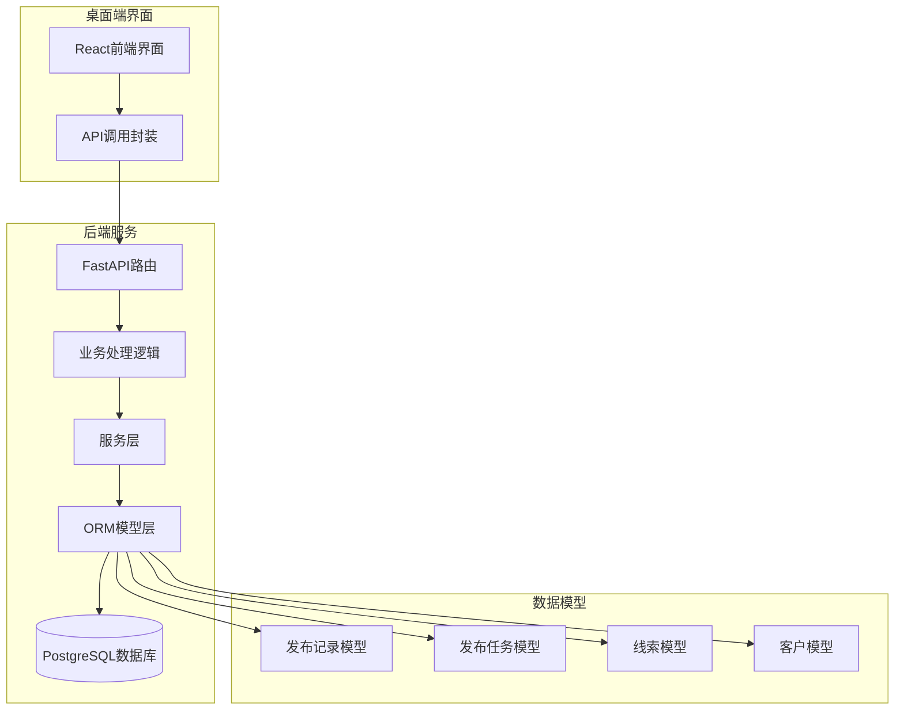
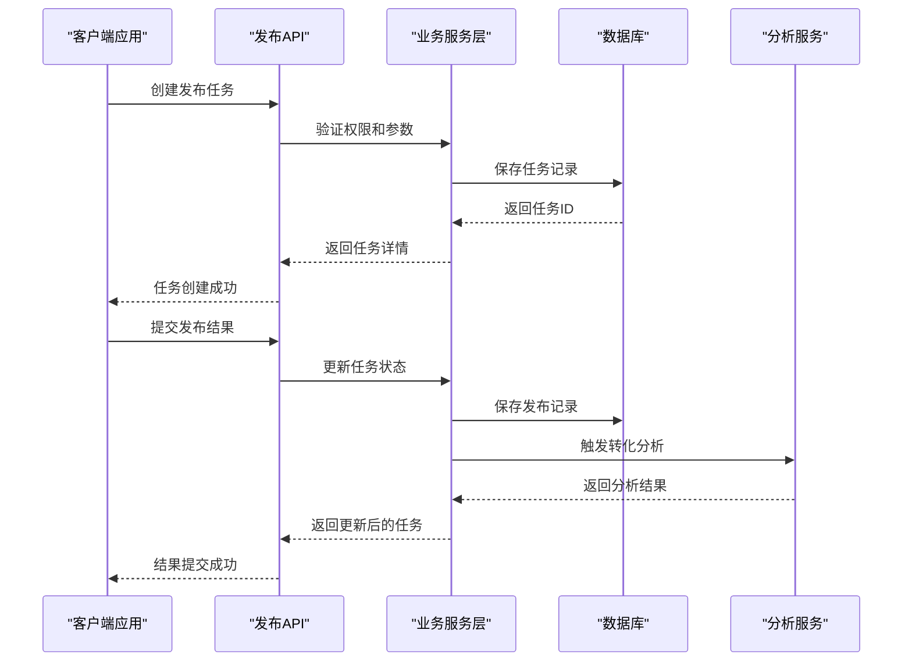
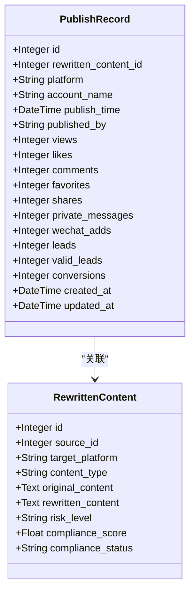
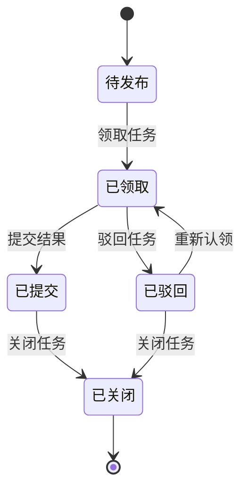
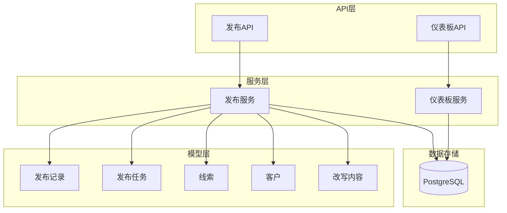
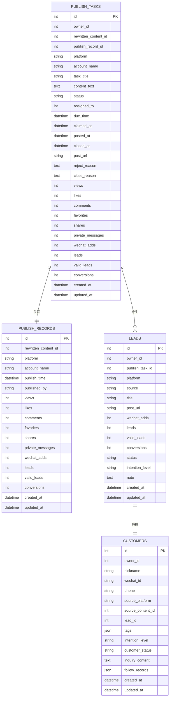

# 发布系统模型

<cite>
**本文档引用的文件**
- [models.py](file://backend/app/models/models.py)
- [publish.py](file://backend/app/api/endpoints/publish.py)
- [schemas.py](file://backend/app/schemas/schemas.py)
- [dashboard_service.py](file://backend/app/services/dashboard_service.py)
- [dashboard.py](file://backend/app/api/endpoints/dashboard.py)
- [PublishPage.tsx](file://desktop/src/pages/PublishPage.tsx)
- [api.ts](file://desktop/src/lib/api.ts)
- [test_material_pipeline_postgres_regression.py](file://backend/test_material_pipeline_postgres_regression.py)
</cite>

## 目录
1. [简介](#简介)
2. [项目结构](#项目结构)
3. [核心组件](#核心组件)
4. [架构概览](#架构概览)
5. [详细组件分析](#详细组件分析)
6. [依赖关系分析](#依赖关系分析)
7. [性能考虑](#性能考虑)
8. [故障排除指南](#故障排除指南)
9. [结论](#结论)
10. [附录](#附录)

## 简介

智获客发布系统是一个完整的社交媒体内容发布和效果追踪平台。该系统通过PublishRecord和PublishTask两个核心模型，实现了从内容创作到发布的全流程管理，以及对发布效果的全面监控。

本系统支持多个主流社交平台的内容发布，包括小红书、抖音、知乎等，并提供了完整的发布任务生命周期管理，从创建、分配、执行到最终的效果追踪和转化分析。

## 项目结构

发布系统采用典型的三层架构设计：



**图表来源**
- [models.py:259-333](file://backend/app/models/models.py#L259-L333)
- [publish.py:27-27](file://backend/app/api/endpoints/publish.py#L27-L27)

**章节来源**
- [models.py:1-800](file://backend/app/models/models.py#L1-L800)
- [publish.py:1-606](file://backend/app/api/endpoints/publish.py#L1-L606)

## 核心组件

发布系统的核心由以下三个关键组件构成：

### 1. 发布记录模型 (PublishRecord)
负责记录实际发布的具体内容和效果指标，是发布效果追踪的基础。

### 2. 发布任务模型 (PublishTask)
管理发布任务的整个生命周期，包括任务创建、分配、执行和状态跟踪。

### 3. 线索转化模型 (Lead/Customer)
实现从发布效果到商业转化的完整闭环，将发布数据转化为可追踪的商业价值。

**章节来源**
- [models.py:259-333](file://backend/app/models/models.py#L259-L333)
- [schemas.py:284-406](file://backend/app/schemas/schemas.py#L284-L406)

## 架构概览

发布系统采用RESTful API架构，通过清晰的分层设计实现功能分离：



**图表来源**
- [publish.py:149-183](file://backend/app/api/endpoints/publish.py#L149-L183)
- [publish.py:407-481](file://backend/app/api/endpoints/publish.py#L407-L481)

## 详细组件分析

### 发布记录模型 (PublishRecord)

PublishRecord模型是发布效果追踪的核心，包含了完整的发布信息和效果指标：

#### 基础信息字段
- **平台信息**: platform (平台类型)、account_name (账号名称)
- **发布时间**: publish_time (发布具体时间)、published_by (发布者标识)
- **关联关系**: rewritten_content_id (关联的改写内容)

#### 性能指标
- **浏览量**: views (总浏览次数)
- **互动指标**: likes (点赞数)、comments (评论数)、favorites (收藏数)、shares (分享数)
- **私信统计**: private_messages (私信数量)

#### 转化指标
- **微信添加**: wechat_adds (微信好友添加数)
- **线索统计**: leads (线索总数)、valid_leads (有效线索数)
- **转化结果**: conversions (最终转化数)



**图表来源**
- [models.py:259-289](file://backend/app/models/models.py#L259-L289)

**章节来源**
- [models.py:259-289](file://backend/app/models/models.py#L259-L289)
- [schemas.py:284-320](file://backend/app/schemas/schemas.py#L284-L320)

### 发布任务模型 (PublishTask)

PublishTask模型管理发布任务的完整生命周期，确保每个发布任务都能被有效跟踪和管理：

#### 任务基本信息
- **任务标识**: id (唯一标识符)、task_title (任务标题)、content_text (发布内容)
- **平台配置**: platform (目标平台)、account_name (发布账号)
- **关联内容**: rewritten_content_id (关联的改写内容)

#### 生命周期状态管理
- **状态字段**: status (任务状态: pending/claimed/submitted/rejected/closed)
- **时间戳**: created_at (创建时间)、updated_at (更新时间)、closed_at (关闭时间)
- **执行时间**: claimed_at (认领时间)、posted_at (发布时间)

#### 责任分配机制
- **创建者**: owner_id (任务创建者)
- **执行者**: assigned_to (任务执行者)
- **截止时间**: due_time (任务截止时间)

#### 效果追踪字段
- **浏览指标**: views、likes、comments、favorites、shares、private_messages
- **转化指标**: wechat_adds、leads、valid_leads、conversions



**图表来源**
- [models.py:292-333](file://backend/app/models/models.py#L292-L333)

**章节来源**
- [models.py:292-333](file://backend/app/models/models.py#L292-L333)
- [schemas.py:322-406](file://backend/app/schemas/schemas.py#L322-L406)

### 线索转化模型

系统通过Lead和Customer模型实现从发布效果到商业转化的完整追踪：

#### 线索状态流转
```mermaid
flowchart TD
新线索 --> 接触中 : wechat_adds > 0 或 leads > 0
接触中 --> 已转化 : conversions > 0
接触中 --> 有效线索 : valid_leads > 0
已转化 --> 客户 : 自动转换
有效线索 --> 客户 : 自动转换
新线索 --> 客户 : 直接转换
```

**图表来源**
- [publish.py:60-68](file://backend/app/api/endpoints/publish.py#L60-L68)

#### 转化指标计算
- **微信添加率**: wechat_adds / views
- **有效线索率**: valid_leads / wechat_adds
- **转化率**: conversions / valid_leads

**章节来源**
- [publish.py:60-122](file://backend/app/api/endpoints/publish.py#L60-L122)

## 依赖关系分析

发布系统各组件之间的依赖关系如下：



**图表来源**
- [models.py:259-333](file://backend/app/models/models.py#L259-L333)
- [publish.py:13-25](file://backend/app/api/endpoints/publish.py#L13-L25)

**章节来源**
- [models.py:259-333](file://backend/app/models/models.py#L259-L333)
- [publish.py:13-25](file://backend/app/api/endpoints/publish.py#L13-L25)

## 性能考虑

### 数据库优化策略
1. **索引设计**: 在常用查询字段上建立适当索引，如platform、status、publish_time等
2. **查询优化**: 使用分页查询避免大量数据一次性加载
3. **连接池管理**: 合理配置数据库连接池大小

### 缓存策略
1. **热点数据缓存**: 对频繁访问的任务状态和统计数据进行缓存
2. **会话管理**: 使用Redis管理用户会话和临时数据

### 异步处理
1. **批量导入**: 支持CSV格式的大批量任务导入
2. **后台任务**: 发布效果统计和分析使用异步任务处理

## 故障排除指南

### 常见问题及解决方案

#### 1. 任务状态异常
- **问题**: 任务状态无法正常流转
- **排查**: 检查任务状态验证逻辑和权限控制
- **解决**: 确保状态转换条件满足，检查用户权限

#### 2. 发布记录缺失
- **问题**: 提交任务后发布记录未创建
- **排查**: 检查任务与发布记录的关联逻辑
- **解决**: 确保任务提交时正确创建对应的发布记录

#### 3. 转化数据不准确
- **问题**: 线索和转化数据统计异常
- **排查**: 检查数据聚合查询和计算逻辑
- **解决**: 验证数据源完整性和计算公式正确性

**章节来源**
- [publish.py:337-481](file://backend/app/api/endpoints/publish.py#L337-L481)
- [test_material_pipeline_postgres_regression.py:510-784](file://backend/test_material_pipeline_postgres_regression.py#L510-L784)

## 结论

智获客发布系统通过精心设计的PublishRecord和PublishTask模型，实现了从内容发布到商业转化的完整闭环。系统具有以下优势：

1. **完整的生命周期管理**: 从任务创建到效果追踪的全流程覆盖
2. **灵活的平台支持**: 支持多个主流社交平台的内容发布
3. **精确的效果追踪**: 全面的性能指标和转化数据分析
4. **良好的扩展性**: 模块化的架构设计便于功能扩展

该系统为内容营销团队提供了强大的工具，能够有效提升内容发布的效率和效果，实现从流量到销售的完整转化路径。

## 附录

### API接口规范

#### 发布任务管理接口
- `POST /api/publish/tasks/create` - 创建发布任务
- `POST /api/publish/tasks/{id}/claim` - 领取任务
- `POST /api/publish/tasks/{id}/assign` - 分配任务
- `POST /api/publish/tasks/{id}/submit` - 提交任务结果
- `POST /api/publish/tasks/{id}/reject` - 驳回任务
- `POST /api/publish/tasks/{id}/close` - 关闭任务

#### 发布记录管理接口
- `POST /api/publish/create` - 创建发布记录
- `GET /api/publish/list` - 查询发布记录列表
- `PUT /api/publish/{id}` - 更新发布记录

### 数据模型关系图



**图表来源**
- [models.py:259-333](file://backend/app/models/models.py#L259-L333)