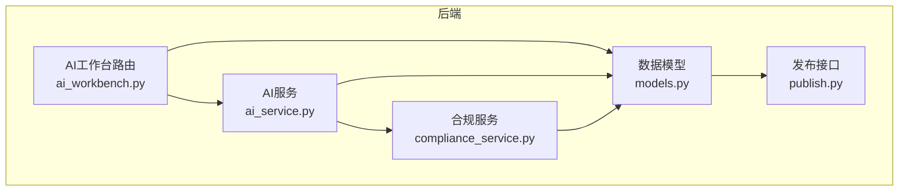
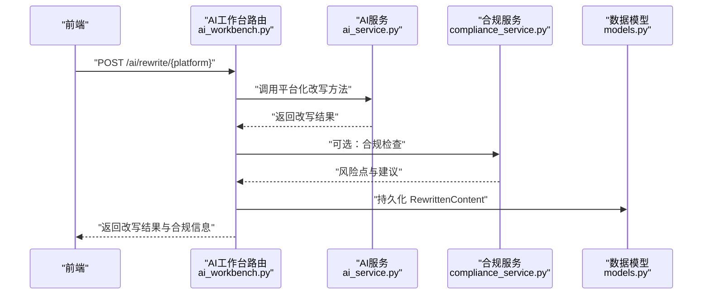
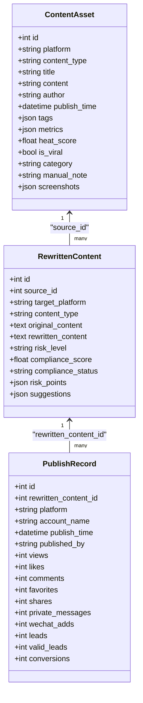
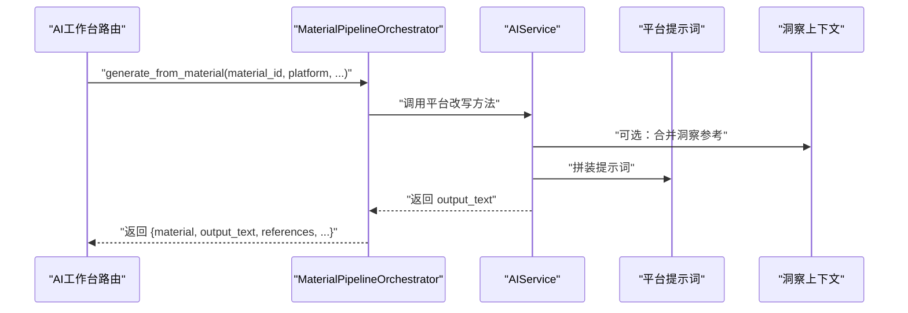
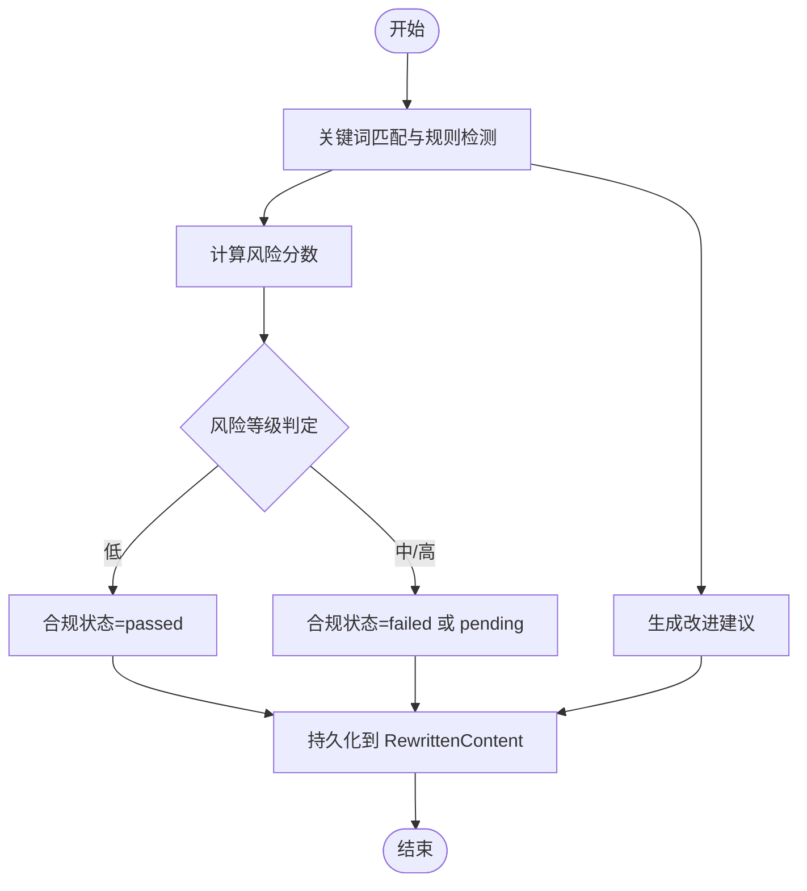
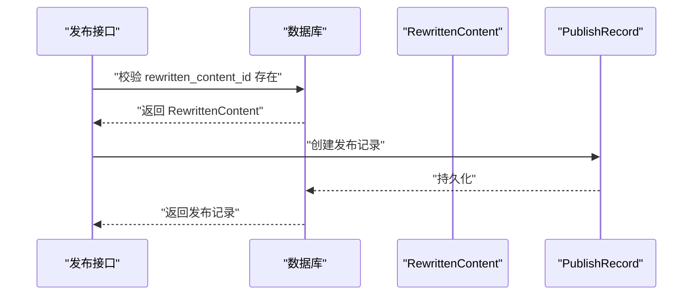
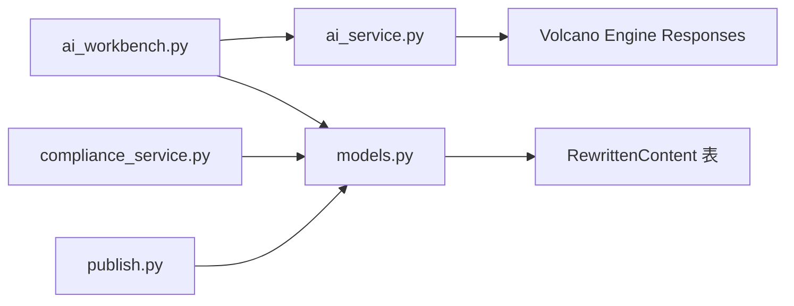

# 改写内容模型

<cite>
**本文引用的文件**
- [models.py](file://backend/app/models/models.py)
- [schemas.py](file://backend/app/schemas/schemas.py)
- [ai_workbench.py](file://backend/app/api/v1/endpoints/ai_workbench.py)
- [ai_service.py](file://backend/app/services/ai_service.py)
- [rewrite_agent.py](file://backend/app/ai/agents/rewrite_agent.py)
- [rewrite_xhs_v1.txt](file://backend/app/ai/prompts/rewrite_xhs_v1.txt)
- [rewrite_douyin_v1.txt](file://backend/app/ai/prompts/rewrite_douyin_v1.txt)
- [compliance_service.py](file://backend/app/services/compliance_service.py)
- [publish.py](file://backend/app/api/endpoints/publish.py)
- [20260324_01_add_structured_content_tables.py](file://backend/alembic/versions/20260324_01_add_structured_content_tables.py)
</cite>

## 目录
1. [简介](#简介)
2. [项目结构](#项目结构)
3. [核心组件](#核心组件)
4. [架构总览](#架构总览)
5. [详细组件分析](#详细组件分析)
6. [依赖分析](#依赖分析)
7. [性能考虑](#性能考虑)
8. [故障排查指南](#故障排查指南)
9. [结论](#结论)
10. [附录](#附录)

## 简介
本文件围绕“改写内容模型”展开，系统阐述RewrittenContent在AI内容改写流程中的职责与数据结构，解释源内容ID、目标平台、内容类型等关联字段，说明原始内容与改写内容的存储方式，以及风险等级、合规分数、合规状态等质量控制字段的来源与用途；并记录风险点列表、改进建议等AI分析结果，解释改写内容与发布记录之间的关联关系，最后给出改写质量评估与合规检查的最佳实践。

## 项目结构
与改写内容模型直接相关的后端模块分布如下：
- 数据模型与关系：位于 models.py，定义 RewrittenContent、ContentAsset、PublishRecord 等实体及其外键与关系
- 接口与路由：位于 ai_workbench.py，提供针对不同平台的改写入口
- 生成服务：位于 ai_service.py，封装 LLM 调用与平台化改写提示词
- 合规服务：位于 compliance_service.py，提供关键词匹配与风险评分
- 发布记录：位于 publish.py，管理发布记录与改写内容的绑定
- 提示词资源：位于 ai/prompts 下，包含平台化提示词文本
- 数据迁移：位于 alembic/versions，包含结构化内容表的创建脚本

**图表来源**
- [ai_workbench.py:18-79](file://backend/app/api/v1/endpoints/ai_workbench.py#L18-L79)
- [ai_service.py:15-460](file://backend/app/services/ai_service.py#L15-L460)
- [compliance_service.py:5-113](file://backend/app/services/compliance_service.py#L5-L113)
- [models.py:155-182](file://backend/app/models/models.py#L155-L182)
- [publish.py:125-147](file://backend/app/api/endpoints/publish.py#L125-L147)

**章节来源**
- [models.py:155-182](file://backend/app/models/models.py#L155-L182)
- [ai_workbench.py:18-79](file://backend/app/api/v1/endpoints/ai_workbench.py#L18-L79)
- [ai_service.py:15-460](file://backend/app/services/ai_service.py#L15-L460)
- [compliance_service.py:5-113](file://backend/app/services/compliance_service.py#L5-L113)
- [publish.py:125-147](file://backend/app/api/endpoints/publish.py#L125-L147)

## 核心组件
- RewrittenContent（改写内容表）
  - 关键字段
    - source_id：关联源内容 ContentAsset 的主键
    - target_platform：目标平台（如 xiaohongshu、douyin、zhihu）
    - content_type：内容类型（post、video、answer、listing 等）
    - original_content：原始内容文本
    - rewritten_content：改写后的内容文本
    - risk_level：风险等级（low、medium、high）
    - compliance_score：合规分数（0-100）
    - compliance_status：合规状态（pending、passed、failed）
    - risk_points：风险点列表（JSON）
    - suggestions：改进建议列表（JSON）
    - created_at/updated_at：创建与更新时间
  - 关系
    - source_content：反向关系指向 ContentAsset
    - publish_records：反向关系指向 PublishRecord

- ContentAsset（源内容资产）
  - 关键字段
    - id：主键
    - platform、content_type、title、content、author、publish_time、tags、metrics、heat_score、is_viral、category、manual_note、screenshots 等
  - 关系
    - rewrites：反向关系指向 RewrittenContent

- PublishRecord（发布记录）
  - 关键字段
    - rewritten_content_id：关联 RewrittenContent 主键
    - platform、account_name、publish_time、published_by
    - 性能与转化指标（views、likes、comments、favorites、shares、private_messages、wechat_adds、leads、valid_leads、conversions）
  - 关系
    - content：正向关系指向 RewrittenContent

- AIRewriteRequest/AIRewriteResponse（请求/响应）
  - 请求字段：content_id、target_platform、content_type、style、marketing_strength、target_audience、topic_name、audience_tags
  - 响应字段：id、source_id、target_platform、rewritten_content、risk_level、compliance_score、compliance_status、created_at

**章节来源**
- [models.py:45-84](file://backend/app/models/models.py#L45-L84)
- [models.py:155-182](file://backend/app/models/models.py#L155-L182)
- [models.py:259-289](file://backend/app/models/models.py#L259-L289)
- [schemas.py:110-134](file://backend/app/schemas/schemas.py#L110-L134)
- [schemas.py:110-120](file://backend/app/schemas/schemas.py#L110-L120)

## 架构总览
AI改写流程从“素材中台”出发，经由“AI工作台路由”触发，调用“AI服务”选择对应平台的提示词与风格进行改写，随后可结合“合规服务”生成风险点与建议，最终形成 RewrittenContent 记录，并可与 PublishRecord 绑定用于发布追踪。

**图表来源**
- [ai_workbench.py:28-51](file://backend/app/api/v1/endpoints/ai_workbench.py#L28-L51)
- [ai_service.py:305-420](file://backend/app/services/ai_service.py#L305-L420)
- [compliance_service.py:24-71](file://backend/app/services/compliance_service.py#L24-L71)
- [models.py:155-182](file://backend/app/models/models.py#L155-L182)

## 详细组件分析

### 数据模型关系图

**图表来源**
- [models.py:45-84](file://backend/app/models/models.py#L45-L84)
- [models.py:155-182](file://backend/app/models/models.py#L155-L182)
- [models.py:259-289](file://backend/app/models/models.py#L259-L289)

**章节来源**
- [models.py:45-84](file://backend/app/models/models.py#L45-L84)
- [models.py:155-182](file://backend/app/models/models.py#L155-L182)
- [models.py:259-289](file://backend/app/models/models.py#L259-L289)

### 改写流程与提示词
- 平台化改写入口
  - 路由：/ai/rewrite/xiaohongshu、/ai/rewrite/douyin、/ai/rewrite/zhihu
  - 实现：_rewrite_with_material_pipeline 调用 MaterialPipelineOrchestrator.generate_from_material，返回原始内容、改写内容、洞察使用情况与引用数量等
- 平台化提示词
  - 小红书：rewrite_xhs_v1.txt
  - 抖音：rewrite_douyin_v1.txt
  - 知乎：ai_service.py 中内置提示词模板
- 提示词注入洞察参考
  - 当请求携带 topic_name/audience_tags 时，AI服务会将洞察库中的标题示例、结构示例、钩子示例、痛点示例、风格摘要、风险提醒等注入提示词，避免直接复制原文

**图表来源**
- [ai_workbench.py:28-51](file://backend/app/api/v1/endpoints/ai_workbench.py#L28-L51)
- [ai_service.py:305-420](file://backend/app/services/ai_service.py#L305-L420)
- [rewrite_xhs_v1.txt:1-1](file://backend/app/ai/prompts/rewrite_xhs_v1.txt#L1-L1)
- [rewrite_douyin_v1.txt:1-1](file://backend/app/ai/prompts/rewrite_douyin_v1.txt#L1-L1)

**章节来源**
- [ai_workbench.py:28-51](file://backend/app/api/v1/endpoints/ai_workbench.py#L28-L51)
- [ai_service.py:305-420](file://backend/app/services/ai_service.py#L305-L420)
- [rewrite_xhs_v1.txt:1-1](file://backend/app/ai/prompts/rewrite_xhs_v1.txt#L1-L1)
- [rewrite_douyin_v1.txt:1-1](file://backend/app/ai/prompts/rewrite_douyin_v1.txt#L1-L1)

### 合规检查与质量控制
- 合规检查
  - 关键词匹配：对“绝对承诺”“敏感金融术语”“过度自信”等进行识别，统计风险点并计算风险分数
  - 风险等级：基于分数阈值划分 low/medium/high
  - 建议生成：提供替换建议与免责声明等
- 质量控制字段
  - RewrittenContent.risk_level、compliance_score、compliance_status、risk_points、suggestions
- 合规状态流转
  - 初始：pending
  - 通过：passed
  - 不通过：failed

**图表来源**
- [compliance_service.py:24-71](file://backend/app/services/compliance_service.py#L24-L71)
- [models.py:169-174](file://backend/app/models/models.py#L169-L174)

**章节来源**
- [compliance_service.py:24-71](file://backend/app/services/compliance_service.py#L24-L71)
- [models.py:169-174](file://backend/app/models/models.py#L169-L174)

### 发布记录与改写内容的关联
- 创建发布记录时，需校验 rewritten_content_id 是否存在
- PublishRecord.rewritten_content_id 外键指向 RewrittenContent.id
- 发布记录用于追踪各平台的发布表现（浏览、点赞、评论、收藏、分享、私信、加微、线索、有效线索、转化）

**图表来源**
- [publish.py:125-147](file://backend/app/api/endpoints/publish.py#L125-L147)
- [models.py:259-289](file://backend/app/models/models.py#L259-L289)

**章节来源**
- [publish.py:125-147](file://backend/app/api/endpoints/publish.py#L125-L147)
- [models.py:259-289](file://backend/app/models/models.py#L259-L289)

### 数据迁移与结构化内容
- 结构化内容表（content_blocks、content_comments、content_snapshots、content_insights）由迁移脚本创建，支撑内容资产的结构化组织与洞察提取
- RewrittenContent 与这些表无直接外键约束，但通过 ContentAsset 建立间接关联

**章节来源**
- [20260324_01_add_structured_content_tables.py:18-104](file://backend/alembic/versions/20260324_01_add_structured_content_tables.py#L18-L104)
- [models.py:86-148](file://backend/app/models/models.py#L86-L148)

## 依赖分析
- 组件耦合
  - ai_workbench.py 依赖 AIService 与 MaterialPipelineOrchestrator，负责路由与编排
  - ai_service.py 依赖外部模型服务（本地 Ollama 或火山引擎 Responses），并产出平台化改写文本
  - compliance_service.py 独立于数据库，提供纯函数式合规检查
  - models.py 定义实体与关系，被 API 层与服务层共同使用
  - publish.py 依赖 RewrittenContent 以确保发布前的改写内容有效性
- 外部依赖
  - Volcano Engine Responses API（Ark Responses）
  - Redis（速率限制）
  - Postgres（数据持久化）

**图表来源**
- [ai_workbench.py:18-79](file://backend/app/api/v1/endpoints/ai_workbench.py#L18-L79)
- [ai_service.py:15-460](file://backend/app/services/ai_service.py#L15-L460)
- [compliance_service.py:5-113](file://backend/app/services/compliance_service.py#L5-L113)
- [models.py:155-182](file://backend/app/models/models.py#L155-L182)
- [publish.py:125-147](file://backend/app/api/endpoints/publish.py#L125-L147)

**章节来源**
- [ai_workbench.py:18-79](file://backend/app/api/v1/endpoints/ai_workbench.py#L18-L79)
- [ai_service.py:15-460](file://backend/app/services/ai_service.py#L15-L460)
- [compliance_service.py:5-113](file://backend/app/services/compliance_service.py#L5-L113)
- [models.py:155-182](file://backend/app/models/models.py#L155-L182)
- [publish.py:125-147](file://backend/app/api/endpoints/publish.py#L125-L147)

## 性能考虑
- LLM 调用延迟与吞吐
  - 使用异步 HTTP 客户端调用外部模型服务，合理设置超时与重试
  - 在火山引擎可用时优先使用云模型，降低本地推理压力
- 速率限制
  - 图像视觉分析接口采用分布式速率限制，避免突发流量导致外部服务限流
- 数据库写入
  - 合规检查与改写结果持久化应尽量减少事务粒度，避免长事务阻塞
- 缓存与复用
  - 对高频平台提示词与洞察参考进行缓存，减少重复拼装成本

[本节为通用指导，无需特定文件引用]

## 故障排查指南
- 改写接口返回失败
  - 检查外部模型服务连通性与鉴权配置
  - 查看 Ark 调用日志记录（ArkCallLog）以定位错误
- 合规检查异常
  - 确认关键词规则与正则表达式是否正确匹配
  - 核对风险点与建议生成逻辑
- 发布记录创建失败
  - 确认 rewritten_content_id 是否存在且未被删除
  - 校验平台与账户名称等字段是否符合约束

**章节来源**
- [ai_service.py:15-460](file://backend/app/services/ai_service.py#L15-L460)
- [compliance_service.py:5-113](file://backend/app/services/compliance_service.py#L5-L113)
- [publish.py:125-147](file://backend/app/api/endpoints/publish.py#L125-L147)

## 结论
RewrittenContent 是智获客AI改写流程的核心数据载体，承载源内容与目标平台的映射、改写结果与质量控制信息，并与发布记录形成闭环。通过平台化提示词、洞察上下文注入与合规检查，系统实现了可追溯、可评估、可发布的改写能力。建议在生产环境中强化外部服务监控、速率限制与合规规则的动态维护，持续优化改写质量与合规稳定性。

## 附录
- 最佳实践
  - 明确目标平台与受众标签，启用洞察上下文以提升风格一致性
  - 在改写完成后立即执行合规检查，确保风险等级与建议可见
  - 将改写内容与发布记录绑定，建立发布后的效果追踪与回溯机制
  - 对提示词与合规规则进行版本化管理，支持灰度与回滚

[本节为通用指导，无需特定文件引用]