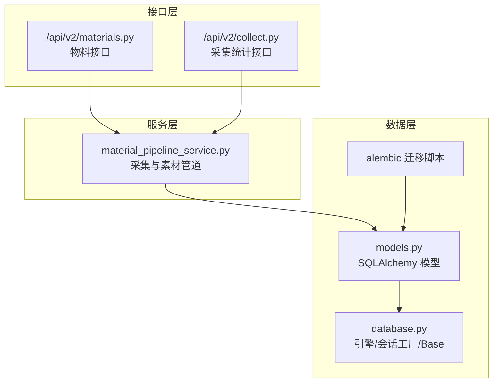
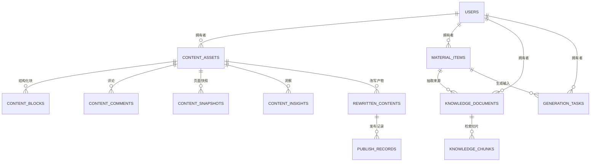
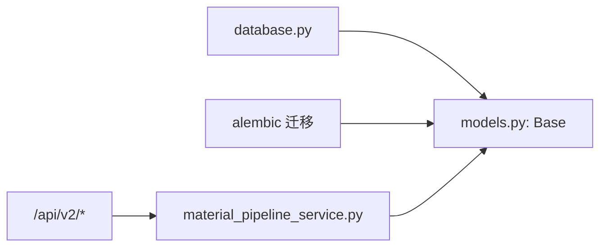

# 核心数据模型

<cite>
**本文引用的文件**
- [models.py](file://backend/app/models/models.py)
- [schemas.py](file://backend/app/schemas/schemas.py)
- [database.py](file://backend/app/core/database.py)
- [20260327_02_add_material_knowledge_pipeline.py](file://backend/alembic/versions/20260327_02_add_material_knowledge_pipeline.py)
- [20260324_01_add_structured_content_tables.py](file://backend/alembic/versions/20260324_01_add_structured_content_tables.py)
- [20260328_01_extend_generation_task_structured_outputs.py](file://backend/alembic/versions/20260328_01_extend_generation_task_structured_outputs.py)
- [material_pipeline_service.py](file://backend/app/services/collector/material_pipeline_service.py)
- [test_main.py](file://backend/test_main.py)
- [collect.py](file://backend/app/api/v2/endpoints/collect.py)
- [materials.py](file://backend/app/api/v2/endpoints/materials.py)
</cite>

## 目录
1. [简介](#简介)
2. [项目结构](#项目结构)
3. [核心组件](#核心组件)
4. [架构总览](#架构总览)
5. [详细组件分析](#详细组件分析)
6. [依赖分析](#依赖分析)
7. [性能考量](#性能考量)
8. [故障排查指南](#故障排查指南)
9. [结论](#结论)
10. [附录](#附录)

## 简介
本文件系统性梳理智获客的核心数据模型，重点围绕以下关键实体展开：User、ContentAsset、MaterialItem、KnowledgeDocument，并补充其相关模型如 ContentBlock、ContentComment、ContentSnapshot、ContentInsight、RewrittenContent、PublishRecord、PublishTask、SourceContent、NormalizedContent、GenerationTask、InsightContentItem、InsightTopic、InsightAuthorProfile、Rule、PromptTemplate、ArkCallLog 等。文档涵盖字段定义、数据类型、约束与默认值、模型间关系映射与级联操作、典型使用场景、查询模式与性能考虑，以及模型扩展与修改的最佳实践。

## 项目结构
后端采用 SQLAlchemy ORM 映射，模型集中于 models.py，数据库连接与会话管理在 core/database.py，迁移脚本位于 alembic/versions 中，API 层通过 v2 端点访问 MaterialItem、Collect 等核心表，服务层通过 material_pipeline_service.py 实现采集与素材管道逻辑，测试用例验证查询优化与 N+1 避免策略。

图表来源
- [models.py:1-928](file://backend/app/models/models.py#L1-L928)
- [database.py:1-29](file://backend/app/core/database.py#L1-L29)
- [20260327_02_add_material_knowledge_pipeline.py:1-372](file://backend/alembic/versions/20260327_02_add_material_knowledge_pipeline.py#L1-L372)
- [material_pipeline_service.py:914-946](file://backend/app/services/collector/material_pipeline_service.py#L914-L946)
- [collect.py:265-297](file://backend/app/api/v2/endpoints/collect.py#L265-L297)
- [materials.py:167-385](file://backend/app/api/v2/endpoints/materials.py#L167-L385)

章节来源
- [models.py:1-928](file://backend/app/models/models.py#L1-L928)
- [database.py:1-29](file://backend/app/core/database.py#L1-L29)

## 核心组件
本节聚焦四大关键模型及其直接关联模型，逐项说明字段、类型、约束与默认值、关系与级联策略，并给出业务语义与使用场景。

- User 用户模型
  - 字段与约束
    - 主键 id；唯一索引 username、email、wecom_userid；布尔字段 is_active 默认 true；时间戳 created_at、updated_at。
  - 关系
    - 一对多：contents（内容资产）、leads（线索）、customers（客户）、ark_call_logs（调用日志）。
  - 业务含义
    - 系统使用者，承载权限与归属关系，支持企业微信绑定。
  - 使用场景
    - 登录认证、内容归属、任务分配、合规审计。

- ContentAsset 内容资产模型
  - 字段与约束
    - 外键 owner_id 指向 User；字符串字段 platform、content_type、source_type 默认 paste；文本 content、title 必填；JSON 字段 tags、comments_keywords、top_comments、metrics、screenshots；数值字段 heat_score 默认 0、is_viral 默认 false；时间字段 publish_time、created_at、updated_at。
  - 关系与级联
    - 一对多：rewrites（改写产物）、blocks（结构化块）、comments（评论）、snapshots（快照）、insights（洞察）；级联 delete-orphan。
  - 业务含义
    - 采集自各平台的内容资产，支持结构化拆分、评论、截图、洞察等扩展。
  - 使用场景
    - 内容入库、结构化解析、改写与发布、洞察分析。

- MaterialItem 素材模型
  - 字段与约束
    - 外键 owner_id 指向 User；外键 source_content_id ondelete SET NULL；外键 normalized_content_id ondelete CASCADE；平台/来源/URL/作者/发布时间等；互动计数字段；质量/相关性/线索评分；状态 parse_status/risk_status/is_duplicate/status；备注 review_note；时间 created_at/updated_at。
  - 关系与级联
    - 一对多：knowledge_documents、generation_tasks；级联 delete-orphan。
  - 业务含义
    - 素材主表，MaterialInbox 是其过滤视图；承载质量评估、重复判定、状态流转。
  - 使用场景
    - 素材采集、去重、评分、知识抽取、生成任务。

- KnowledgeDocument 知识文档模型
  - 字段与约束
    - 外键 material_item_id ondelete CASCADE；平台/账号类型/目标人群/内容类型/主题；标题/摘要/正文；时间 created_at。
  - 关系与级联
    - 一对多：knowledge_chunks；级联 delete-orphan。
  - 业务含义
    - 从素材抽取的结构化知识，支持检索切片。
  - 使用场景
    - 知识检索、RAG 嵌入、提示词工程。

章节来源
- [models.py:8-27](file://backend/app/models/models.py#L8-L27)
- [models.py:45-84](file://backend/app/models/models.py#L45-L84)
- [models.py:584-640](file://backend/app/models/models.py#L584-L640)
- [models.py:642-664](file://backend/app/models/models.py#L642-L664)

## 架构总览
下图展示核心模型间的实体关系与级联策略，体现从采集到知识抽取再到生成任务的完整链路。

图表来源
- [models.py:8-27](file://backend/app/models/models.py#L8-L27)
- [models.py:45-84](file://backend/app/models/models.py#L45-L84)
- [models.py:584-640](file://backend/app/models/models.py#L584-L640)
- [models.py:642-664](file://backend/app/models/models.py#L642-L664)
- [models.py:156-181](file://backend/app/models/models.py#L156-L181)
- [models.py:259-289](file://backend/app/models/models.py#L259-L289)
- [models.py:724-751](file://backend/app/models/models.py#L724-L751)

## 详细组件分析

### User 用户模型
- 设计要点
  - 唯一性约束：username、email、wecom_userid。
  - 角色与激活状态：role 默认 operator，is_active 默认 true。
  - 时间戳：created_at 默认当前 UTC，updated_at 支持自动更新。
- 关系映射
  - contents、leads、customers、ark_call_logs。
- 使用场景
  - 权限控制、归属标记、合规审计。
- 查询模式
  - 按 id/username/email/wecom_userid 查询；支持按角色/激活状态筛选。
- 性能考虑
  - 唯一索引字段需避免并发冲突；批量查询时注意预加载必要关系。

章节来源
- [models.py:8-27](file://backend/app/models/models.py#L8-L27)

### ContentAsset 内容资产模型
- 设计要点
  - 结构化内容：content_blocks、content_comments、content_snapshots、content_insights。
  - 指标与热度：metrics、heat_score、is_viral。
  - 来源与分类：source_type、category、manual_note。
- 关系映射与级联
  - blocks/comments/snapshots/insights delete-orphan；rewrites 一对一反向。
- 使用场景
  - 内容入库、结构化解析、改写与发布、洞察分析。
- 查询模式
  - 按 owner_id、platform、content_type、publish_time、tags 等过滤；支持分页与排序。
- 性能考虑
  - 大文本字段 content/title 需配合全文索引或应用侧缓存；JSON 字段避免过度嵌套。

章节来源
- [models.py:45-84](file://backend/app/models/models.py#L45-L84)

### MaterialItem 素材模型
- 设计要点
  - 来源链路：source_content_id（可空）→ normalized_content_id（必填）→ material_items。
  - 质量与风险：quality_score、relevance_score、lead_score、parse_status、risk_status、is_duplicate。
  - 状态与备注：status、remark、review_note。
- 关系映射与级联
  - knowledge_documents、generation_tasks delete-orphan；source_content SET NULL；normalized_content CASCADE。
- 使用场景
  - 素材采集、去重、评分、知识抽取、生成任务。
- 查询模式
  - API v2 提供列表、详情、更新、删除、分析等端点；支持 include_knowledge/include_generation/include_chunks 预加载。
- 性能考虑
  - 测试验证避免 N+1 查询；建议在列表接口中使用 selectinload/joinedload 预加载常用关系。

章节来源
- [models.py:584-640](file://backend/app/models/models.py#L584-L640)
- [material_pipeline_service.py:914-946](file://backend/app/services/collector/material_pipeline_service.py#L914-L946)
- [test_main.py:590-615](file://backend/test_main.py#L590-L615)
- [collect.py:265-297](file://backend/app/api/v2/endpoints/collect.py#L265-L297)
- [materials.py:167-385](file://backend/app/api/v2/endpoints/materials.py#L167-L385)

### KnowledgeDocument 知识文档模型
- 设计要点
  - 结构化知识：platform/account_type/target_audience/content_type/topic/title/summary/content_text。
  - 关系：material_item（反向）、knowledge_chunks（切片）。
- 关系映射与级联
  - material_item CASCADE；knowledge_chunks delete-orphan。
- 使用场景
  - 知识检索、RAG 嵌入、提示词工程。
- 查询模式
  - 服务层按平台/账号类型/目标人群过滤候选集，结合关键词与语义打分排序。

章节来源
- [models.py:642-664](file://backend/app/models/models.py#L642-L664)
- [material_pipeline_service.py:1363-1382](file://backend/app/services/collector/material_pipeline_service.py#L1363-L1382)
- [material_pipeline_service.py:1413-1436](file://backend/app/services/collector/material_pipeline_service.py#L1413-L1436)

### Related 模型概览
- ContentBlock、ContentComment、ContentSnapshot、ContentInsight
  - 作用：结构化内容块、评论树、页面快照、异步洞察结果。
  - 级联：均对 content_id 设置 CASCADE 或 SET NULL，确保内容删除时清理附属数据。
- RewrittenContent、PublishRecord、PublishTask
  - 作用：改写产物、发布记录、发布任务工作流。
  - 级联：rewritten_content 对 material_item 的 CASCADE；publish_record 对 rewritten_content 的 CASCADE。
- SourceContent、NormalizedContent、GenerationTask
  - 作用：原始输入、标准化内容、生成任务持久化。
  - 级联：source_content → normalized_content CASCADE；material_item → generation_tasks CASCADE。
- InsightContentItem、InsightTopic、InsightAuthorProfile
  - 作用：爆款内容标准化条目、主题库、作者画像。
  - 级联：topic/content_items、author_profile/content_items CASCADE。
- Rule、PromptTemplate、ArkCallLog
  - 作用：生成边界规则、提示词模板、调用日志。
  - 级联：无显式级联，遵循默认行为。

章节来源
- [models.py:86-147](file://backend/app/models/models.py#L86-L147)
- [models.py:156-289](file://backend/app/models/models.py#L156-L289)
- [models.py:507-581](file://backend/app/models/models.py#L507-L581)
- [models.py:724-751](file://backend/app/models/models.py#L724-L751)
- [models.py:758-807](file://backend/app/models/models.py#L758-L807)
- [models.py:810-883](file://backend/app/models/models.py#L810-L883)
- [models.py:886-902](file://backend/app/models/models.py#L886-L902)
- [models.py:905-927](file://backend/app/models/models.py#L905-L927)

## 依赖分析
- 数据库连接
  - database.py 创建 engine、sessionmaker、Base，所有模型继承 Base。
- 迁移脚本
  - 20260327_02_add_material_knowledge_pipeline.py 定义了 source_contents、normalized_contents、material_items、knowledge_documents、knowledge_chunks、rules、prompt_templates、generation_tasks 的表结构与索引。
  - 20260324_01_add_structured_content_tables.py 定义 content_blocks、content_comments、content_snapshots、content_insights 的表结构与索引。
  - 20260328_01_extend_generation_task_structured_outputs.py 为 generation_tasks 增加结构化输出字段。
- 服务与 API
  - material_pipeline_service.py 提供序列化、去重、评分、候选集构建等逻辑。
  - v2 端点 materials.py/collect.py 提供列表、详情、分析、统计等接口。

图表来源
- [database.py:1-29](file://backend/app/core/database.py#L1-L29)
- [20260327_02_add_material_knowledge_pipeline.py:1-372](file://backend/alembic/versions/20260327_02_add_material_knowledge_pipeline.py#L1-L372)
- [20260324_01_add_structured_content_tables.py:1-56](file://backend/alembic/versions/20260324_01_add_structured_content_tables.py#L1-L56)
- [20260328_01_extend_generation_task_structured_outputs.py:1-41](file://backend/alembic/versions/20260328_01_extend_generation_task_structured_outputs.py#L1-L41)
- [material_pipeline_service.py:914-946](file://backend/app/services/collector/material_pipeline_service.py#L914-L946)
- [materials.py:167-385](file://backend/app/api/v2/endpoints/materials.py#L167-L385)
- [collect.py:265-297](file://backend/app/api/v2/endpoints/collect.py#L265-L297)

章节来源
- [database.py:1-29](file://backend/app/core/database.py#L1-L29)
- [20260327_02_add_material_knowledge_pipeline.py:1-372](file://backend/alembic/versions/20260327_02_add_material_knowledge_pipeline.py#L1-L372)
- [20260324_01_add_structured_content_tables.py:1-56](file://backend/alembic/versions/20260324_01_add_structured_content_tables.py#L1-L56)
- [20260328_01_extend_generation_task_structured_outputs.py:1-41](file://backend/alembic/versions/20260328_01_extend_generation_task_structured_outputs.py#L1-L41)

## 性能考量
- 查询优化
  - 列表接口避免 N+1 查询：测试用例验证 MaterialItem 列表查询预加载能力。
  - API v2 在获取详情时支持 include_knowledge/include_generation/include_chunks 预加载，减少多次往返。
- 索引设计
  - 迁移脚本为 material_items、knowledge_documents、knowledge_chunks 等关键字段建立索引，加速过滤与排序。
- 级联策略
  - 对 content_blocks/comments/snapshots/insights、knowledge_documents/knowledge_chunks、generation_tasks 等设置 delete-orphan/CASCADE，降低孤儿数据与维护成本。
- 大字段与 JSON
  - content/title 等大文本字段建议配合应用层缓存与分页；JSON 字段避免过深嵌套，便于检索与序列化。

章节来源
- [test_main.py:590-615](file://backend/test_main.py#L590-L615)
- [material_pipeline_service.py:914-946](file://backend/app/services/collector/material_pipeline_service.py#L914-L946)
- [20260327_02_add_material_knowledge_pipeline.py:139-153](file://backend/alembic/versions/20260327_02_add_material_knowledge_pipeline.py#L139-L153)
- [20260327_02_add_material_knowledge_pipeline.py:171-177](file://backend/alembic/versions/20260327_02_add_material_knowledge_pipeline.py#L171-L177)
- [20260327_02_add_material_knowledge_pipeline.py:191-193](file://backend/alembic/versions/20260327_02_add_material_knowledge_pipeline.py#L191-L193)

## 故障排查指南
- 常见问题
  - 素材重复与去重：检查 material_items.is_duplicate 与 filter_reason；确认 content_hash 与 source_id 的一致性。
  - 知识抽取失败：检查 knowledge_documents.material_item_id 是否存在；确认 normalized_content 已正确生成。
  - 发布任务状态异常：核对 PublishTask.status、claimed_at/posted_at/closed_at 与 PublishRecord 指标字段。
- 排查步骤
  - 使用 API v2 的统计接口查看 by_platform/by_status 分布，定位异常来源。
  - 通过 include_knowledge/include_generation/include_chunks 获取完整上下文，辅助定位。
  - 查看 ArkCallLog 以追踪调用链路与延迟。
- 修复建议
  - 对于 N+1 查询问题，确保在服务层使用 selectinload/joinedload 预加载关系。
  - 对于级联删除导致的数据丢失，确认 ondelete 策略与业务流程匹配。

章节来源
- [collect.py:265-297](file://backend/app/api/v2/endpoints/collect.py#L265-L297)
- [materials.py:167-385](file://backend/app/api/v2/endpoints/materials.py#L167-L385)
- [material_pipeline_service.py:914-946](file://backend/app/services/collector/material_pipeline_service.py#L914-L946)
- [models.py:905-927](file://backend/app/models/models.py#L905-L927)

## 结论
智获客的核心数据模型围绕“采集—标准化—素材—知识—生成”的完整链路设计，通过明确的外键关系、合理的索引与级联策略，支撑起内容资产的结构化管理与高效检索。User 作为归属主体贯穿多个模型；ContentAsset 提供结构化内容的基础；MaterialItem 作为主表承载质量与风险评估；KnowledgeDocument/KnowledgeChunk 支撑知识抽取与检索；GenerationTask 将知识转化为可执行的生成任务。在性能方面，迁移脚本与测试用例共同保障了查询效率与数据一致性。

## 附录
- 字段与约束速查
  - User：唯一索引 username/email/wecom_userid；布尔字段 is_active；时间戳 created_at/updated_at。
  - ContentAsset：外键 owner_id；JSON 字段 tags/comments_keywords/top_comments/metrics/screenshots；数值 heat_score/is_viral；时间 publish_time。
  - MaterialItem：外键 owner_id/source_content_id/normalized_content_id；质量/风险/重复字段；状态与备注；时间 created_at/updated_at。
  - KnowledgeDocument：外键 material_item_id；平台/账号类型/目标人群/内容类型/主题；时间 created_at。
  - GenerationTask：外键 material_item_id；结构化输出字段（tags_json/copies_json/compliance_json）。
- 最佳实践
  - 新增字段时同步迁移脚本与索引；严格区分 ondelete=CASCADE/SET NULL/delete-orphan 的适用场景。
  - 在 API 层提供 include_* 参数以控制预加载，避免 N+1。
  - 对大文本字段进行分页与缓存，减少数据库压力。
  - 通过 ArkCallLog 与系统监控完善可观测性。