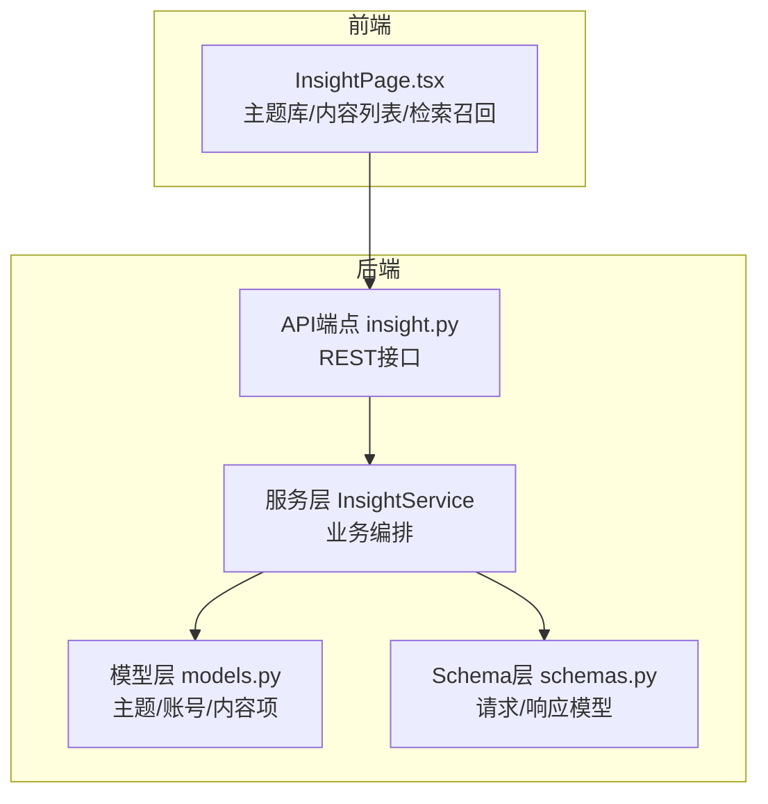
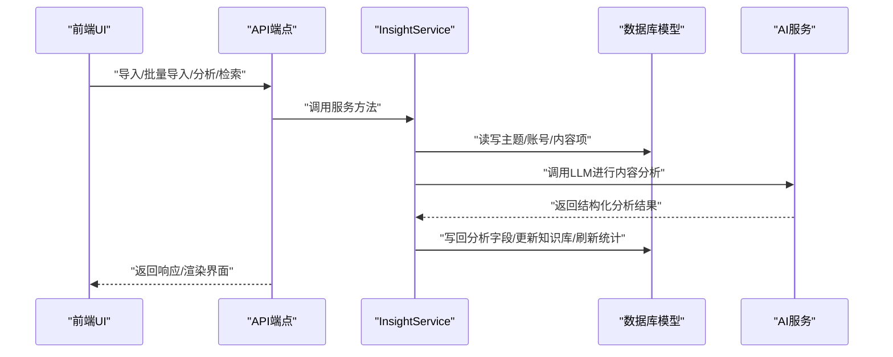
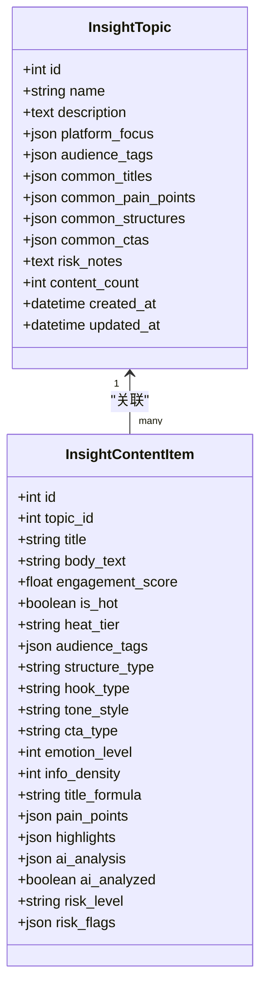
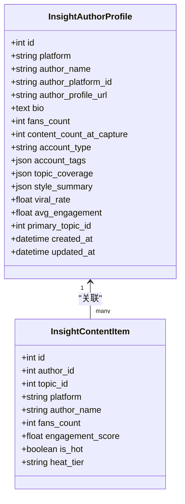
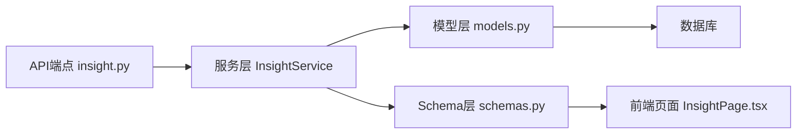

# 洞察分析模型

<cite>
**本文引用的文件**
- [insight_service.py](file://backend/app/services/insight_service.py)
- [models.py](file://backend/app/models/models.py)
- [schemas.py](file://backend/app/schemas/schemas.py)
- [insight.py](file://backend/app/api/endpoints/insight.py)
- [InsightPage.tsx](file://desktop/src/pages/InsightPage.tsx)
- [变更说明_2026-03-23_洞察中心与改写联动.md](file://变更说明_2026-03-23_洞察中心与改写联动.md)
</cite>

## 目录
1. [简介](#简介)
2. [项目结构](#项目结构)
3. [核心组件](#核心组件)
4. [架构总览](#架构总览)
5. [详细组件分析](#详细组件分析)
6. [依赖关系分析](#依赖关系分析)
7. [性能考量](#性能考量)
8. [故障排查指南](#故障排查指南)
9. [结论](#结论)
10. [附录](#附录)

## 简介
本文件系统性阐述“智获客洞察分析模型”的设计与实现，重点围绕两大核心实体：InsightTopic（主题库）与InsightAuthorProfile（账号档案）。文档详细说明主题库的结构化信息（名称、描述、平台聚焦、受众标签等）、账号档案的平台信息、粉丝数量、内容统计、风格分析等特征；并给出爆款率、平均互动等关键指标的计算方法，以及主题覆盖、风格总结等分析维度。最后提供内容趋势分析与爆款预测的实现思路与最佳实践。

## 项目结构
洞察分析模型位于后端服务层，采用“服务层 + 模型层 + API 层 + 前端页面”的分层架构：
- 服务层：负责业务逻辑编排（内容摄入、AI分析、主题知识聚合、账号统计刷新、检索召回等）
- 模型层：定义数据库表结构与关系（主题、账号、内容项、采集任务等）
- API 层：暴露 REST 接口，供前端与外部系统调用
- 前端页面：可视化展示主题库、内容列表、检索召回结果与统计概览

图表来源
- [insight.py:1-22](file://backend/app/api/endpoints/insight.py#L1-L22)
- [insight_service.py:57-659](file://backend/app/services/insight_service.py#L57-L659)
- [models.py:758-928](file://backend/app/models/models.py#L758-L928)
- [schemas.py:800-953](file://backend/app/schemas/schemas.py#L800-L953)
- [InsightPage.tsx:654-669](file://desktop/src/pages/InsightPage.tsx#L654-L669)

章节来源
- [insight.py:1-22](file://backend/app/api/endpoints/insight.py#L1-L22)
- [insight_service.py:57-659](file://backend/app/services/insight_service.py#L57-L659)
- [models.py:758-928](file://backend/app/models/models.py#L758-L928)
- [schemas.py:800-953](file://backend/app/schemas/schemas.py#L800-L953)
- [InsightPage.tsx:654-669](file://desktop/src/pages/InsightPage.tsx#L654-L669)

## 核心组件
- InsightTopic（主题库）：承载主题名称、描述、平台聚焦、受众标签、常见标题模板、常见痛点、常见结构、常见CTA、风险提示、内容计数等结构化信息，并维护与内容项的一对多关系。
- InsightAuthorProfile（账号档案）：记录每个平台账号的定位、粉丝数、内容统计、主题覆盖、风格分布、近期爆款率、平均互动分等分析特征，并维护与内容项、主题的一对多/一对多关系。
- InsightContentItem（内容条目）：标准化的内容载体，包含平台基础字段、账号字段、内容字段、互动字段、AI分析字段、风控字段等，支撑从采集到分析的完整链路。
- InsightService（服务层）：实现内容摄入、去重、热度分计算与分层、AI分析、主题知识聚合、账号统计刷新、检索召回、删除等核心能力。
- API端点与Schema：提供REST接口与请求/响应模型，确保前后端契约一致。

章节来源
- [models.py:758-928](file://backend/app/models/models.py#L758-L928)
- [insight_service.py:57-659](file://backend/app/services/insight_service.py#L57-L659)
- [schemas.py:800-953](file://backend/app/schemas/schemas.py#L800-L953)
- [insight.py:65-100](file://backend/app/api/endpoints/insight.py#L65-L100)

## 架构总览
洞察分析模型采用“采集入库 → 内容清洗 → AI分析 → 主题/账号聚类 → 检索召回”的五层闭环流程。服务层通过统一的服务方法编排各环节，模型层持久化结构化特征，API层对外暴露能力，前端页面用于展示与交互。

图表来源
- [insight.py:106-154](file://backend/app/api/endpoints/insight.py#L106-L154)
- [insight_service.py:183-279](file://backend/app/services/insight_service.py#L183-L279)
- [insight_service.py:382-496](file://backend/app/services/insight_service.py#L382-L496)
- [insight_service.py:553-638](file://backend/app/services/insight_service.py#L553-L638)

章节来源
- [insight.py:106-154](file://backend/app/api/endpoints/insight.py#L106-L154)
- [insight_service.py:183-279](file://backend/app/services/insight_service.py#L183-L279)
- [insight_service.py:382-496](file://backend/app/services/insight_service.py#L382-L496)
- [insight_service.py:553-638](file://backend/app/services/insight_service.py#L553-L638)

## 详细组件分析

### InsightTopic（主题库）
- 结构化信息
  - 名称、描述、平台聚焦（JSON数组）、受众标签（JSON数组）
  - 常见标题模板、常见痛点、常见结构、常见CTA（用于知识库沉淀）
  - 风险提示、内容计数（冗余计数，便于快速统计）
- 关系
  - 与内容项一对多：一个主题可包含多条内容
  - 与账号档案一对多：账号可标注主要主题
- 知识库聚合
  - 服务层在AI分析完成后，基于Top-50已分析内容，聚合常见标题、痛点、结构、CTA，并更新主题内容计数

图表来源
- [models.py:758-778](file://backend/app/models/models.py#L758-L778)
- [models.py:810-883](file://backend/app/models/models.py#L810-L883)

章节来源
- [models.py:758-778](file://backend/app/models/models.py#L758-L778)
- [insight_service.py:498-547](file://backend/app/services/insight_service.py#L498-L547)

### InsightAuthorProfile（账号档案）
- 平台信息与基础资料
  - 平台、账号名、平台ID、主页链接、简介、粉丝数、采集时内容数
- 分析特征
  - 账号类型（流量号/专业顾问号/案例号/清单号/避坑号）、账号标签
  - 主题覆盖（主题名→内容数）、风格分布（风格名→出现次数）
  - 近期爆款率（近期内容中热点内容占比）、平均互动分
  - 主要主题（外键指向主题）
- 统计刷新
  - 服务层根据账号下的所有内容重新计算：热点数/平均互动分、主题覆盖、风格分布、主要主题

图表来源
- [models.py:781-807](file://backend/app/models/models.py#L781-L807)
- [models.py:810-883](file://backend/app/models/models.py#L810-L883)

章节来源
- [models.py:781-807](file://backend/app/models/models.py#L781-L807)
- [insight_service.py:136-177](file://backend/app/services/insight_service.py#L136-L177)

### InsightContentItem（内容条目）
- 平台基础字段：平台、来源类型、来源URL、采集时间、采集模式
- 账号字段：作者平台ID、作者名、主页链接、粉丝数、账号定位、账号标签、作者ID
- 内容字段：内容平台ID、内容类型、标题、正文、摘要、发布时间、原始载荷、人工备注
- 互动字段：点赞/评论/转发/收藏/播放、采集时粉丝数、互动分、是否热点、热度分层
- AI分析字段：主题ID、受众标签、结构类型、钩子类型、语气风格、CTA类型、情感强度、信息密度、标题公式、痛点、亮点、AI分析原文、是否已分析
- 风控字段：风险等级、风险标志、规则版本、合规备注

章节来源
- [models.py:810-883](file://backend/app/models/models.py#L810-L883)

### 关键指标与计算方法
- 互动分（Engagement Score）
  - 计算方式：收藏×3 + 评论×2.5 + 转发×2 + 点赞×1 + 播放×0.05
  - 服务层函数：_calc_engagement
- 热度分层（Heat Tier）
  - 分层阈值：viral≥500 / hot≥200 / warm≥80 / normal
  - 服务层函数：_calc_heat_tier
- 爆款率（Viral Rate）
  - 计算方式：近期热点内容数 / 近期内容总数（保留4位小数）
  - 服务层方法：refresh_author_stats
- 平均互动分（Avg Engagement）
  - 计算方式：所有内容互动分之和 / 内容条数（保留2位小数）
  - 服务层方法：refresh_author_stats
- 主题覆盖（Topic Coverage）
  - 计算方式：按主题名统计内容数，形成字典
  - 服务层方法：refresh_author_stats
- 风格总结（Style Summary）
  - 计算方式：按语气风格统计出现次数，形成字典
  - 服务层方法：refresh_author_stats

章节来源
- [insight_service.py:24-54](file://backend/app/services/insight_service.py#L24-L54)
- [insight_service.py:136-177](file://backend/app/services/insight_service.py#L136-L177)
- [变更说明_2026-03-23_洞察中心与改写联动.md:45-56](file://变更说明_2026-03-23_洞察中心与改写联动.md#L45-L56)

### 分析维度
- 主题覆盖：账号在各主题下的内容分布，辅助识别账号擅长领域与主攻方向
- 风格总结：账号内容的语气风格分布，辅助生成策略与风格一致性控制
- 爆款率与平均互动分：衡量账号近期表现与内容质量，指导内容优化与选题策略
- 风险提示：主题层面的风险提示与内容层面的风险等级/标志，保障合规

章节来源
- [models.py:781-807](file://backend/app/models/models.py#L781-L807)
- [models.py:758-778](file://backend/app/models/models.py#L758-L778)
- [insight_service.py:136-177](file://backend/app/services/insight_service.py#L136-L177)

### 内容趋势分析与爆款预测实现方案
- 内容趋势分析
  - 基于内容项的热度分层与时间序列，统计每日/每周热点内容数量、平均互动分、平台分布等
  - 可结合前端仪表盘接口与服务层趋势方法，形成可视化趋势图
- 爆款预测
  - 特征工程：互动分、结构类型、钩子类型、语气风格、情感强度、信息密度、受众标签、主题热度
  - 模型选择：可采用分类模型（如LightGBM/XGBoost）预测是否热点，或回归模型预测互动分
  - 数据来源：以已分析内容为训练集，主题知识库与账号档案为辅助特征
  - 在线推理：将新内容的结构化特征输入模型，得到预测结果，辅助内容优化与选题决策

章节来源
- [insight_service.py:344-376](file://backend/app/services/insight_service.py#L344-L376)
- [insight.py:404-409](file://backend/app/api/endpoints/insight.py#L404-L409)

## 依赖关系分析
- API端点依赖服务层方法，服务层依赖模型层进行数据持久化，同时调用AI服务进行内容分析
- 模型层定义三类核心实体及其关系：主题→内容、账号→内容、账号→主题
- Schema层定义请求/响应模型，保证前后端契约一致

图表来源
- [insight.py:65-100](file://backend/app/api/endpoints/insight.py#L65-L100)
- [insight_service.py:57-659](file://backend/app/services/insight_service.py#L57-L659)
- [models.py:758-928](file://backend/app/models/models.py#L758-L928)
- [schemas.py:800-953](file://backend/app/schemas/schemas.py#L800-L953)
- [InsightPage.tsx:654-669](file://desktop/src/pages/InsightPage.tsx#L654-L669)

章节来源
- [insight.py:65-100](file://backend/app/api/endpoints/insight.py#L65-L100)
- [insight_service.py:57-659](file://backend/app/services/insight_service.py#L57-L659)
- [models.py:758-928](file://backend/app/models/models.py#L758-L928)
- [schemas.py:800-953](file://backend/app/schemas/schemas.py#L800-L953)
- [InsightPage.tsx:654-669](file://desktop/src/pages/InsightPage.tsx#L654-L669)

## 性能考量
- 批量导入与分析
  - 批量导入支持最多200条，批量分析限制最多50条，避免瞬时高负载
  - 后台任务异步执行，降低阻塞风险
- 查询与排序
  - 列表查询支持多维过滤与分页，优先使用索引字段（平台、主题ID、热度分层、是否热点、是否AI分析）
- 知识聚合
  - 主题知识聚合仅取Top-50已分析内容，控制计算复杂度
- 统计刷新
  - 账号统计刷新遍历该账号全部内容，建议在低峰期或异步触发

章节来源
- [insight.py:140-154](file://backend/app/api/endpoints/insight.py#L140-L154)
- [insight.py:234-302](file://backend/app/api/endpoints/insight.py#L234-L302)
- [insight_service.py:282-296](file://backend/app/services/insight_service.py#L282-L296)
- [insight_service.py:498-547](file://backend/app/services/insight_service.py#L498-L547)
- [insight_service.py:136-177](file://backend/app/services/insight_service.py#L136-L177)

## 故障排查指南
- 内容不存在
  - API层在查询/删除/分析时若找不到内容会返回404
- 批量分析限流
  - 批量分析接口受分布式限流保护，超过阈值会被拒绝
- AI分析失败
  - 服务层捕获异常并记录日志，返回空结果，不影响整体流程
- 去重与重复导入
  - 导入时按“同平台+同URL”去重，避免重复入库

章节来源
- [insight.py:188-209](file://backend/app/api/endpoints/insight.py#L188-L209)
- [insight.py:234-302](file://backend/app/api/endpoints/insight.py#L234-L302)
- [insight_service.py:208-219](file://backend/app/services/insight_service.py#L208-L219)
- [insight_service.py:422-436](file://backend/app/services/insight_service.py#L422-L436)

## 结论
洞察分析模型通过结构化的主题库与账号档案，结合统一的内容摄入、AI分析、知识聚合与检索召回机制，实现了从内容采集到策略输出的闭环。其关键指标（互动分、热度分层、爆款率、平均互动分）与分析维度（主题覆盖、风格总结）为内容运营提供了量化依据。建议在现有基础上进一步完善趋势分析与爆款预测能力，以提升内容生产的智能化水平。

## 附录
- API端点一览
  - 主题管理：POST /api/insight/topics、GET /api/insight/topics、GET /api/insight/topics/{id}
  - 内容导入：POST /api/insight/import、POST /api/insight/import/batch、GET /api/insight/list、GET /api/insight/{id}、DELETE /api/insight/{id}
  - AI分析：POST /api/insight/analyze/{id}、POST /api/insight/analyze/batch、GET /api/insight/analyze/tasks、GET /api/insight/analyze/tasks/{task_id}
  - 账号档案：GET /api/insight/authors、GET /api/insight/authors/{id}
  - 检索召回：POST /api/insight/retrieve
  - 统计：GET /api/insight/stats

章节来源
- [insight.py:4-22](file://backend/app/api/endpoints/insight.py#L4-L22)