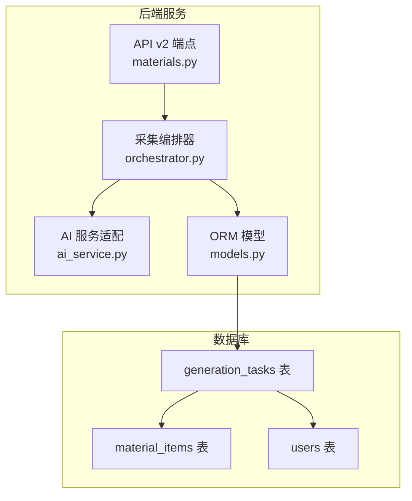
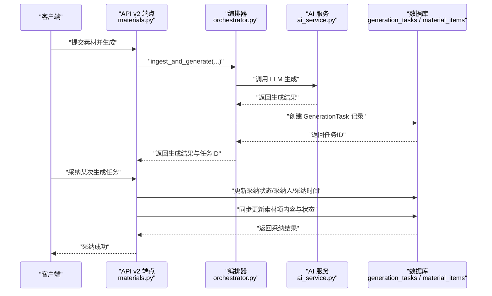
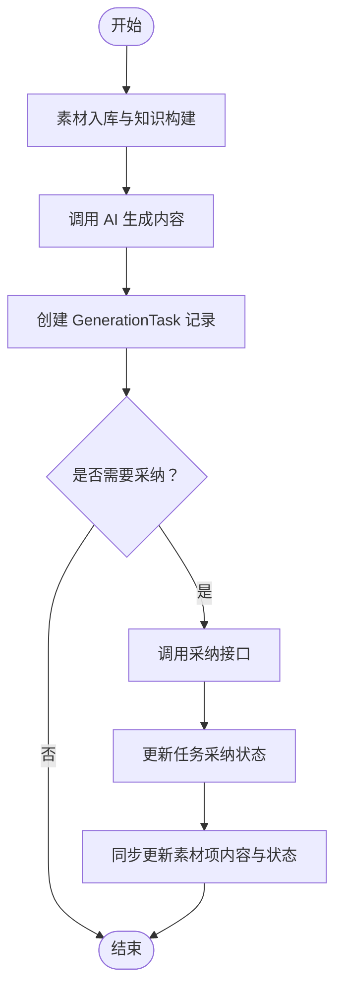
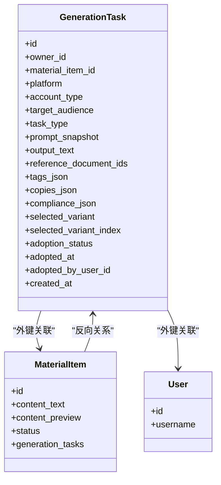

# 生成任务模型

<cite>
**本文引用的文件**
- [models.py](file://backend/app/models/models.py)
- [20260327_02_add_material_knowledge_pipeline.py](file://backend/alembic/versions/20260327_02_add_material_knowledge_pipeline.py)
- [20260328_01_extend_generation_task_structured_outputs.py](file://backend/alembic/versions/20260328_01_extend_generation_task_structured_outputs.py)
- [materials.py](file://backend/app/api/v2/endpoints/materials.py)
- [orchestrator.py](file://backend/app/domains/acquisition/orchestrator.py)
- [ai_service.py](file://backend/app/domains/ai_workbench/ai_service.py)
- [ai_service.py](file://backend/app/services/ai_service.py)
- [test_material_pipeline_postgres_regression.py](file://backend/test_material_pipeline_postgres_regression.py)
</cite>

## 目录
1. [简介](#简介)
2. [项目结构](#项目结构)
3. [核心组件](#核心组件)
4. [架构总览](#架构总览)
5. [组件详细分析](#组件详细分析)
6. [依赖关系分析](#依赖关系分析)
7. [性能考量](#性能考量)
8. [故障排查指南](#故障排查指南)
9. [结论](#结论)
10. [附录](#附录)

## 简介
本文件围绕“生成任务模型”进行系统化说明，重点阐述 GenerationTask 在 AI 内容生成流程中的职责与数据结构，包括任务上下文（任务类型、平台、受众、账号类型）、生成过程数据（提示快照、输出文本、参考文档）、结构化输出（标签 JSON、变体副本、合规 JSON）、管理字段（采纳状态、采纳时间、采纳用户）以及与素材项的关联关系与任务生命周期管理。同时给出生成任务监控与质量评估的实现思路。

## 项目结构
GenerationTask 模型位于后端 ORM 层，配合迁移脚本完成数据库表结构演进；通过 API v2 的素材相关端点提供采纳操作；由采集与知识管线编排器触发生成任务；最终与素材项建立一对多关系，形成“素材项 → 生成任务”的生命周期闭环。

图表来源
- [models.py:724-751](file://backend/app/models/models.py#L724-L751)
- [20260327_02_add_material_knowledge_pipeline.py:237-251](file://backend/alembic/versions/20260327_02_add_material_knowledge_pipeline.py#L237-L251)
- [materials.py:311-381](file://backend/app/api/v2/endpoints/materials.py#L311-L381)
- [orchestrator.py:11-23](file://backend/app/domains/acquisition/orchestrator.py#L11-L23)
- [ai_service.py:1-6](file://backend/app/domains/ai_workbench/ai_service.py#L1-L6)

章节来源
- [models.py:724-751](file://backend/app/models/models.py#L724-L751)
- [20260327_02_add_material_knowledge_pipeline.py:237-251](file://backend/alembic/versions/20260327_02_add_material_knowledge_pipeline.py#L237-L251)
- [materials.py:311-381](file://backend/app/api/v2/endpoints/materials.py#L311-L381)
- [orchestrator.py:11-23](file://backend/app/domains/acquisition/orchestrator.py#L11-L23)

## 核心组件
- GenerationTask 模型：持久化一次 AI 生成任务的上下文与结果，包含任务上下文字段、生成过程数据、结构化输出字段、采纳管理字段，并与素材项建立外键关联。
- 采集编排器：负责从输入到生成的全流程编排，解析账号类型与受众，调用 AI 服务生成内容并落库为 GenerationTask。
- API v2 端点：提供素材采纳接口，将某次生成任务标记为采纳，并同步更新素材项的内容与状态。
- AI 服务适配：对外暴露统一的 AI 调用接口，供编排器使用。

章节来源
- [models.py:724-751](file://backend/app/models/models.py#L724-L751)
- [orchestrator.py:97-125](file://backend/app/domains/acquisition/orchestrator.py#L97-L125)
- [materials.py:311-381](file://backend/app/api/v2/endpoints/materials.py#L311-L381)
- [ai_service.py:1-6](file://backend/app/domains/ai_workbench/ai_service.py#L1-L6)

## 架构总览
下图展示从素材输入到生成任务创建、采纳与素材项更新的端到端流程。

图表来源
- [materials.py:284-325](file://backend/app/api/v2/endpoints/materials.py#L284-L325)
- [materials.py:311-381](file://backend/app/api/v2/endpoints/materials.py#L311-L381)
- [orchestrator.py:127-173](file://backend/app/domains/acquisition/orchestrator.py#L127-L173)
- [ai_service.py](file://backend/app/services/ai_service.py)

## 组件详细分析

### GenerationTask 模型与数据结构
- 任务上下文
  - 平台 platform：目标发布平台，如小红书、抖音等，用于生成策略与风格适配。
  - 账号类型 account_type：流量号/专业顾问号/案例号等，决定内容风格与话术。
  - 目标受众 target_audience：如“上班族”“查询多”，影响语言与痛点切入。
  - 任务类型 task_type：如“改写”“创作”，决定提示工程与生成目标。
- 生成过程数据
  - 提示快照 prompt_snapshot：生成时使用的系统提示与用户提示的快照，便于审计与复现。
  - 输出文本 output_text：LLM 返回的最终内容。
  - 参考文档 reference_document_ids：生成所依据的知识库文档 ID 列表。
- 结构化输出
  - 标签 JSON tags_json：生成内容的标签化元数据。
  - 变体副本 copies_json：同一任务的不同版本或风格变体集合。
  - 合规 JSON compliance_json：合规审查后的结构化结果。
  - 选中变体 selected_variant 与 selected_variant_index：在多个变体中选择的版本标识与索引。
- 管理字段
  - 采纳状态 adoption_status：枚举值，如“待定(pending)”“采纳(adopted)”“回滚(rolled_back)”。
  - 采纳时间 adopted_at：采纳发生的时间戳。
  - 采纳用户 adopted_by_user_id：执行采纳操作的用户 ID。
- 关联关系
  - 所属用户 owner_id：生成任务的创建者。
  - 素材项 material_item_id：与素材项建立一对一或多对一的关系，一个素材可对应多条生成任务。
  - 与素材项的反向关系 material_item：用于读取素材项内容与状态。
- 时间戳 created_at：任务创建时间。

章节来源
- [models.py:724-751](file://backend/app/models/models.py#L724-L751)

### 数据库迁移与索引
- 初始版本（物料与知识管线）：创建 generation_tasks 表，包含任务上下文、提示快照、输出文本、参考文档 ID 与创建时间等字段，并建立多维索引以支持查询与统计。
- 扩展版本（结构化输出与采纳状态）：新增 tags_json、copies_json、compliance_json、selected_variant、selected_variant_index、adoption_status、adopted_at、adopted_by_user_id 等字段，并为 adoption_status 与 adopted_by_user_id 创建索引，提升筛选与聚合效率。

章节来源
- [20260327_02_add_material_knowledge_pipeline.py:237-251](file://backend/alembic/versions/20260327_02_add_material_knowledge_pipeline.py#L237-L251)
- [20260328_01_extend_generation_task_structured_outputs.py:30-59](file://backend/alembic/versions/20260328_01_extend_generation_task_structured_outputs.py#L30-L59)

### 生成任务生命周期与采纳流程
- 生命周期阶段
  - 输入与清洗：通过编排器将原始素材入库并构建知识库。
  - 生成：根据任务上下文调用 AI 服务生成内容，创建 GenerationTask 记录。
  - 采纳：管理员或运营人员通过 API 将某条生成任务标记为采纳，同时回滚其他同素材的采纳状态。
  - 同步更新：采纳后同步更新素材项的内容、预览与状态，进入后续合规与发布流程。
- 关键约束
  - 采纳互斥：同一素材仅允许一条生成任务处于“采纳”状态，其余自动回滚。
  - 用户隔离：所有生成任务与采纳操作均绑定 owner_id 与当前用户，确保权限控制。

图表来源
- [orchestrator.py:127-173](file://backend/app/domains/acquisition/orchestrator.py#L127-L173)
- [materials.py:311-381](file://backend/app/api/v2/endpoints/materials.py#L311-L381)

章节来源
- [orchestrator.py:97-125](file://backend/app/domains/acquisition/orchestrator.py#L97-L125)
- [materials.py:311-381](file://backend/app/api/v2/endpoints/materials.py#L311-L381)

### 与素材项的关联关系
- 外键约束：GenerationTask.material_item_id 引用 material_items.id，并设置级联删除，保证素材项删除时生成任务随之清理。
- 反向关系：MaterialItem.generation_tasks 用于查询某个素材的所有生成任务，支撑“多版本对比、历史回溯”等能力。
- 采纳同步：采纳成功后直接更新素材项的 content_text、content_preview 与状态，确保内容一致性。

章节来源
- [models.py:724-751](file://backend/app/models/models.py#L724-L751)

### 生成任务监控与质量评估
- 监控维度建议
  - 任务吞吐：单位时间内生成任务数量、平均耗时（从请求到生成完成）。
  - 成功率：AI 调用成功率、生成失败重试次数与失败原因分布。
  - 采纳率：采纳任务占总生成任务的比例、不同平台/账号类型的采纳差异。
  - 质量指标：合规审查通过率、人工抽检命中率、用户反馈评分。
- 指标采集
  - 通过 AI 服务日志与 Ark 调用日志记录延迟、错误码与模型参数，结合数据库 adoption_status 变化统计采纳行为。
  - 对采纳任务与未采纳任务分别抽样评估，形成质量趋势。
- 建议实现
  - 在 AIService 中埋点记录每次调用的耗时、模型、端点与成功率。
  - 在 adopt_generation_task 接口处记录采纳人、采纳时间与原因，便于审计与复盘。
  - 使用数据库索引（adoption_status、adopted_by_user_id、created_at）优化统计查询。

章节来源
- [materials.py:311-381](file://backend/app/api/v2/endpoints/materials.py#L311-L381)
- [20260328_01_extend_generation_task_structured_outputs.py:55-59](file://backend/alembic/versions/20260328_01_extend_generation_task_structured_outputs.py#L55-L59)

## 依赖关系分析
- ORM 层依赖
  - GenerationTask 依赖 users 与 material_items 表，形成用户 → 素材 → 生成任务的层级关系。
- 服务层依赖
  - 编排器依赖采集入站服务与 AI 服务，负责生成任务的创建与落库。
  - API v2 端点依赖编排器与数据库会话，提供对外接口。
- 迁移脚本依赖
  - 两个迁移脚本依次演进 generation_tasks 表结构，确保字段与索引的逐步完善。

图表来源
- [models.py:724-751](file://backend/app/models/models.py#L724-L751)

章节来源
- [models.py:724-751](file://backend/app/models/models.py#L724-L751)

## 性能考量
- 索引设计
  - 为 adoption_status 与 adopted_by_user_id 建立索引，有利于快速筛选待审/已采纳任务与按负责人统计。
  - 为平台、账号类型、受众、任务类型建立索引，便于多维查询与报表统计。
- 查询优化
  - 采纳流程中需一次性更新多条任务状态并刷新素材项，建议使用批量更新与事务提交，减少往返开销。
- 存储与序列化
  - JSON 字段（tags_json、copies_json、compliance_json、reference_document_ids）应控制大小与层级，避免超长导致存储与传输压力。
- 并发与隔离
  - 采纳互斥逻辑需在数据库层面通过原子更新与行级锁保障一致性，避免竞态条件。

章节来源
- [20260328_01_extend_generation_task_structured_outputs.py:55-59](file://backend/alembic/versions/20260328_01_extend_generation_task_structured_outputs.py#L55-L59)
- [20260327_02_add_material_knowledge_pipeline.py:252-258](file://backend/alembic/versions/20260327_02_add_material_knowledge_pipeline.py#L252-L258)

## 故障排查指南
- 采纳失败
  - 现象：调用采纳接口返回素材不存在或改写记录不存在。
  - 排查：确认 material_id 与 generation_task_id 是否属于当前用户，检查外键是否存在。
- 采纳冲突
  - 现象：采纳后其他任务未回滚。
  - 排查：确认采纳逻辑是否正确遍历同素材任务并更新状态，检查数据库事务是否提交。
- 生成异常
  - 现象：生成任务创建成功但 output_text 为空或异常。
  - 排查：检查 AI 服务调用日志与错误码，核对提示快照与参考文档是否有效。
- 数据不一致
  - 现象：采纳后素材项内容未更新。
  - 排查：确认采纳后是否同步更新 content_text、content_preview 与状态，检查 ORM 关系是否正确。

章节来源
- [materials.py:311-381](file://backend/app/api/v2/endpoints/materials.py#L311-L381)
- [test_material_pipeline_postgres_regression.py:96-123](file://backend/test_material_pipeline_postgres_regression.py#L96-L123)

## 结论
GenerationTask 模型在智获客的 AI 内容生成体系中承担“上下文+过程+产物+管理”的全栈职责。通过结构化的字段设计与严格的生命周期管理，实现了从素材到生成再到采纳的闭环。配合完善的索引与监控指标，可进一步提升系统的可观测性与稳定性，为后续扩展（如多模态、多模型、A/B 变体对比）奠定基础。

## 附录
- 相关实现路径
  - 生成任务创建与落库：[ingest_and_generate:127-173](file://backend/app/domains/acquisition/orchestrator.py#L127-L173)
  - 采纳接口与状态同步：[adopt_generation_task:311-381](file://backend/app/api/v2/endpoints/materials.py#L311-L381)
  - 模型定义与关系：[GenerationTask:724-751](file://backend/app/models/models.py#L724-L751)
  - 迁移脚本（初始与扩展）：[物料与知识管线:237-251](file://backend/alembic/versions/20260327_02_add_material_knowledge_pipeline.py#L237-L251)，[结构化输出与采纳状态:30-59](file://backend/alembic/versions/20260328_01_extend_generation_task_structured_outputs.py#L30-L59)