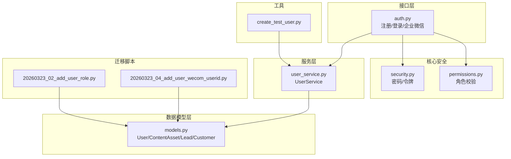
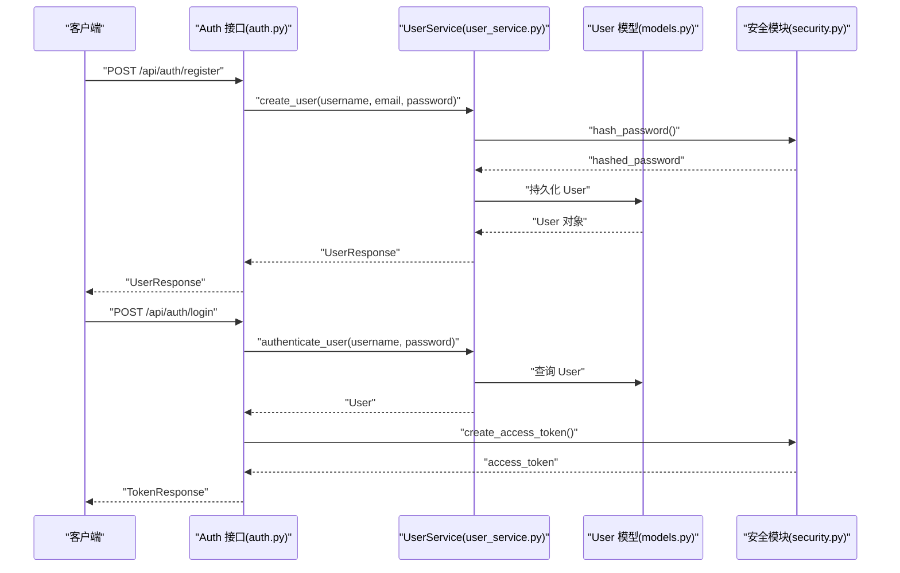
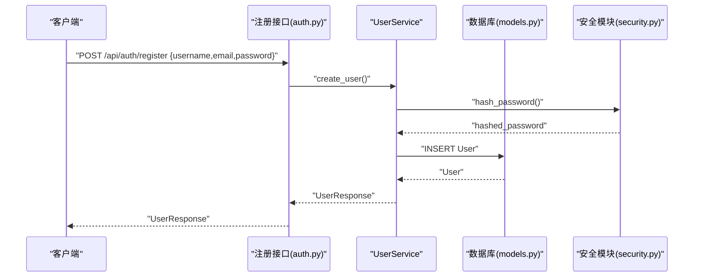
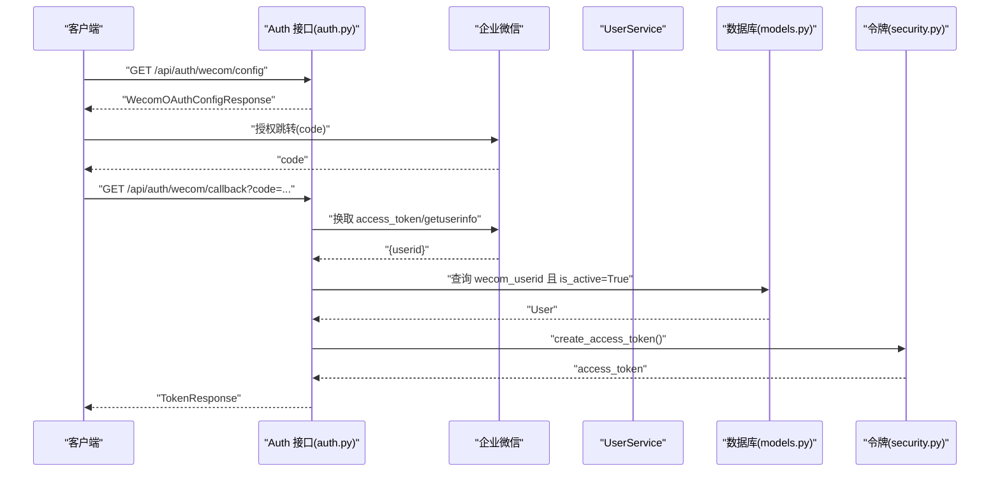
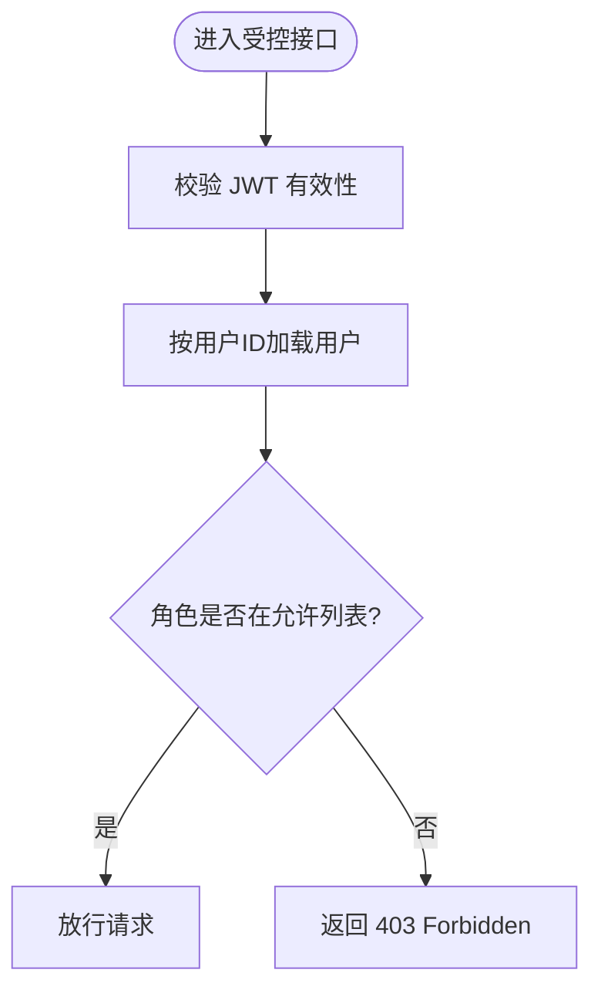
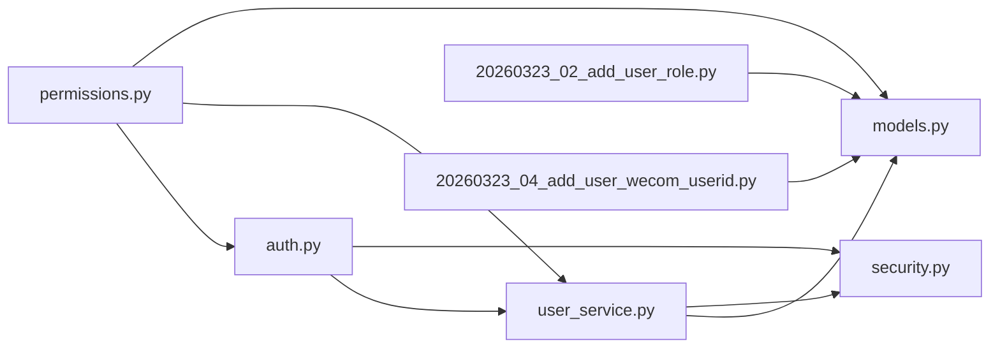

# 用户模型

<cite>
**本文引用的文件**
- [models.py](file://backend/app/models/models.py)
- [user_service.py](file://backend/app/services/user_service.py)
- [auth.py](file://backend/app/api/endpoints/auth.py)
- [schemas.py](file://backend/app/schemas/schemas.py)
- [security.py](file://backend/app/core/security.py)
- [permissions.py](file://backend/app/core/permissions.py)
- [20260323_02_add_user_role.py](file://backend/alembic/versions/20260323_02_add_user_role.py)
- [20260323_04_add_user_wecom_userid.py](file://backend/alembic/versions/20260323_04_add_user_wecom_userid.py)
- [create_test_user.py](file://backend/create_test_user.py)
</cite>

## 目录
1. [简介](#简介)
2. [项目结构](#项目结构)
3. [核心组件](#核心组件)
4. [架构总览](#架构总览)
5. [详细组件分析](#详细组件分析)
6. [依赖分析](#依赖分析)
7. [性能考虑](#性能考虑)
8. [故障排查指南](#故障排查指南)
9. [结论](#结论)
10. [附录](#附录)

## 简介
本文件面向“智获客”系统的用户模型，系统化阐述 User 模型的字段定义、业务含义、约束条件与使用场景，并说明其与内容资产、线索、客户等业务实体的关联关系。同时提供权限管理、角色分配与安全控制的最佳实践，以及用户创建、更新与删除的操作示例路径。

## 项目结构
围绕用户模型的关键代码分布在以下模块：
- 数据模型层：定义 User 表结构及与内容资产、线索、客户的关联关系
- 服务层：封装用户创建、认证、查询等业务逻辑
- 接口层：提供注册、登录、企业微信绑定等对外接口
- 核心安全：密码哈希、JWT 签发与校验、角色权限检查
- 迁移脚本：为用户表添加角色与企业微信标识字段
- 测试与工具：测试用户创建脚本



图表来源
- [models.py:8-27](file://backend/app/models/models.py#L8-L27)
- [user_service.py:24-177](file://backend/app/services/user_service.py#L24-L177)
- [auth.py:1-280](file://backend/app/api/endpoints/auth.py#L1-L280)
- [security.py:1-57](file://backend/app/core/security.py#L1-L57)
- [permissions.py:1-30](file://backend/app/core/permissions.py#L1-L30)
- [20260323_02_add_user_role.py:18-27](file://backend/alembic/versions/20260323_02_add_user_role.py#L18-L27)
- [20260323_04_add_user_wecom_userid.py:18-26](file://backend/alembic/versions/20260323_04_add_user_wecom_userid.py#L18-L26)
- [create_test_user.py:15-54](file://backend/create_test_user.py#L15-L54)

章节来源
- [models.py:8-27](file://backend/app/models/models.py#L8-L27)
- [user_service.py:24-177](file://backend/app/services/user_service.py#L24-L177)
- [auth.py:1-280](file://backend/app/api/endpoints/auth.py#L1-L280)
- [security.py:1-57](file://backend/app/core/security.py#L1-L57)
- [permissions.py:1-30](file://backend/app/core/permissions.py#L1-L30)
- [20260323_02_add_user_role.py:18-27](file://backend/alembic/versions/20260323_02_add_user_role.py#L18-L27)
- [20260323_04_add_user_wecom_userid.py:18-26](file://backend/alembic/versions/20260323_04_add_user_wecom_userid.py#L18-L26)
- [create_test_user.py:15-54](file://backend/create_test_user.py#L15-L54)

## 核心组件
- User 模型：用户基本信息、认证凭据、角色与状态、企业微信标识
- UserService：用户创建、认证、查询与序列修复
- Auth 接口：注册、登录、获取当前用户、企业微信绑定与换码
- 安全模块：密码哈希、JWT 签发与校验
- 权限模块：基于角色的访问控制
- 迁移脚本：角色字段与企业微信标识字段的数据库演进

章节来源
- [models.py:8-27](file://backend/app/models/models.py#L8-L27)
- [user_service.py:61-177](file://backend/app/services/user_service.py#L61-L177)
- [auth.py:95-131](file://backend/app/api/endpoints/auth.py#L95-L131)
- [security.py:18-57](file://backend/app/core/security.py#L18-L57)
- [permissions.py:9-29](file://backend/app/core/permissions.py#L9-L29)
- [20260323_02_add_user_role.py:18-27](file://backend/alembic/versions/20260323_02_add_user_role.py#L18-L27)
- [20260323_04_add_user_wecom_userid.py:18-26](file://backend/alembic/versions/20260323_04_add_user_wecom_userid.py#L18-L26)

## 架构总览
用户模型贯穿“接口层-服务层-数据模型层”，并由安全与权限模块提供认证与授权保障。企业微信集成通过接口层完成换码与绑定流程。



图表来源
- [auth.py:95-111](file://backend/app/api/endpoints/auth.py#L95-L111)
- [user_service.py:61-165](file://backend/app/services/user_service.py#L61-L165)
- [models.py:8-27](file://backend/app/models/models.py#L8-L27)
- [security.py:28-39](file://backend/app/core/security.py#L28-L39)

## 详细组件分析

### User 模型字段定义与业务含义
- id：自增主键，唯一标识用户
- username：唯一索引，长度限制，非空
- email：唯一索引，长度限制，非空
- hashed_password：存储密码哈希值，非空
- role：角色字符串，默认“operator”，非空；用于权限控制
- is_active：布尔标志，控制用户启用/禁用
- wecom_userid：企业微信用户标识，唯一索引，允许为空
- created_at/updated_at：时间戳，自动维护

字段约束与索引
- username/email 唯一且建立索引，保证全局唯一性
- wecom_userid 唯一且建立索引，便于按企业微信身份快速查找
- created_at 默认当前时间，updated_at 支持自动更新

业务含义
- 用户名与邮箱用于登录与识别
- 密码哈希用于安全存储
- 角色用于细粒度权限控制
- 企业微信标识支持企业微信单点登录与绑定
- is_active 控制账户可用性

章节来源
- [models.py:12-20](file://backend/app/models/models.py#L12-L20)
- [20260323_02_add_user_role.py:22-26](file://backend/alembic/versions/20260323_02_add_user_role.py#L22-L26)
- [20260323_04_add_user_wecom_userid.py:22-25](file://backend/alembic/versions/20260323_04_add_user_wecom_userid.py#L22-L25)

### 用户与业务实体的关联关系
User 与内容资产、线索、客户存在一对多关系：
- contents：内容资产 owner 关系
- leads：线索 owner 关系
- customers：客户 owner 关系
- ark_call_logs：通话日志 user 关系

这些关系支撑“用户拥有内容资产、线索与客户”的业务语义，便于按用户维度进行数据隔离与统计。

```mermaid
erDiagram
USER {
int id PK
string username UK
string email UK
string hashed_password
string role
boolean is_active
string wecom_userid UK
timestamp created_at
timestamp updated_at
}
CONTENT_ASSET {
int id PK
int owner_id FK
string platform
string source_url
string content_type
string title
text content
string author
timestamp publish_time
json metrics
float heat_score
boolean is_viral
timestamp created_at
timestamp updated_at
}
LEAD {
int id PK
int owner_id FK
int publish_task_id FK
string platform
string source
string title
string post_url
int wechat_adds
int leads
int valid_leads
int conversions
string status
string intention_level
text note
timestamp created_at
timestamp updated_at
}
CUSTOMER {
int id PK
int owner_id FK
string nickname
string wechat_id
string phone
string source_platform
int source_content_id
int lead_id FK UQ
json tags
string intention_level
string customer_status
text inquiry_content
json follow_records
timestamp created_at
timestamp updated_at
}
USER ||--o{ CONTENT_ASSET : "owner"
USER ||--o{ LEAD : "owner"
USER ||--o{ CUSTOMER : "owner"
```

图表来源
- [models.py:8-27](file://backend/app/models/models.py#L8-L27)
- [models.py:45-84](file://backend/app/models/models.py#L45-L84)
- [models.py:199-227](file://backend/app/models/models.py#L199-L227)
- [models.py:229-257](file://backend/app/models/models.py#L229-L257)

章节来源
- [models.py:23-26](file://backend/app/models/models.py#L23-L26)

### 用户创建、认证与登录流程
- 注册：接口接收用户名、邮箱、明文密码，服务层计算哈希后持久化
- 登录：接口根据用户名与明文密码进行认证，成功后签发 JWT
- 当前用户：携带 JWT 的请求通过安全模块校验后返回用户信息



图表来源
- [auth.py:95-104](file://backend/app/api/endpoints/auth.py#L95-L104)
- [user_service.py:61-91](file://backend/app/services/user_service.py#L61-L91)
- [security.py:18-20](file://backend/app/core/security.py#L18-L20)
- [models.py:8-27](file://backend/app/models/models.py#L8-L27)

章节来源
- [auth.py:95-111](file://backend/app/api/endpoints/auth.py#L95-L111)
- [user_service.py:61-165](file://backend/app/services/user_service.py#L61-L165)
- [security.py:18-39](file://backend/app/core/security.py#L18-L39)

### 企业微信集成与绑定
- 企业微信 OAuth 配置查询、回调换码、绑定接口
- 登录流程：通过企业微信 code 换取 wecom_userid，匹配系统内已绑定的激活用户并签发 JWT
- 绑定流程：管理员为当前登录用户绑定 wecom_userid，避免重复绑定



图表来源
- [auth.py:185-254](file://backend/app/api/endpoints/auth.py#L185-L254)
- [models.py:18-18](file://backend/app/models/models.py#L18-L18)
- [security.py:28-39](file://backend/app/core/security.py#L28-L39)

章节来源
- [auth.py:185-254](file://backend/app/api/endpoints/auth.py#L185-L254)

### 权限管理与角色分配
- 角色字段：用户模型包含 role 字段，默认“operator”
- 角色校验：通过 require_roles 依赖注入器，对路由进行角色限制
- 最佳实践：
  - 明确角色边界（如 operator、admin 等）
  - 在关键接口使用 require_roles 限定访问
  - 使用 JWT 中的用户标识进行资源级权限校验



图表来源
- [permissions.py:9-29](file://backend/app/core/permissions.py#L9-L29)
- [models.py:16-16](file://backend/app/models/models.py#L16-L16)

章节来源
- [permissions.py:9-29](file://backend/app/core/permissions.py#L9-L29)
- [20260323_02_add_user_role.py:22-26](file://backend/alembic/versions/20260323_02_add_user_role.py#L22-L26)

### 用户更新与删除
- 更新：可通过服务层方法按需更新用户属性（如角色、状态、企业微信标识等）
- 删除：建议采用软删除策略（如 is_active=false）以保留审计与关联数据完整性；若执行硬删除，需处理外键约束与级联关系

章节来源
- [user_service.py:168-177](file://backend/app/services/user_service.py#L168-L177)
- [models.py:23-26](file://backend/app/models/models.py#L23-L26)

### 数据库演进与字段变更
- 角色字段：首次引入 role 列，设置默认值并强制非空
- 企业微信标识：新增 wecom_userid 列并建立唯一索引

章节来源
- [20260323_02_add_user_role.py:18-27](file://backend/alembic/versions/20260323_02_add_user_role.py#L18-L27)
- [20260323_04_add_user_wecom_userid.py:18-26](file://backend/alembic/versions/20260323_04_add_user_wecom_userid.py#L18-L26)

## 依赖分析
- 接口层依赖服务层与安全模块
- 服务层依赖数据模型与安全模块
- 权限模块依赖接口层的认证中间件与数据库查询
- 迁移脚本独立于运行时，仅影响数据库结构



图表来源
- [auth.py:1-280](file://backend/app/api/endpoints/auth.py#L1-L280)
- [user_service.py:1-177](file://backend/app/services/user_service.py#L1-L177)
- [models.py:1-928](file://backend/app/models/models.py#L1-L928)
- [security.py:1-57](file://backend/app/core/security.py#L1-L57)
- [permissions.py:1-30](file://backend/app/core/permissions.py#L1-L30)
- [20260323_02_add_user_role.py:1-36](file://backend/alembic/versions/20260323_02_add_user_role.py#L1-L36)
- [20260323_04_add_user_wecom_userid.py:1-38](file://backend/alembic/versions/20260323_04_add_user_wecom_userid.py#L1-L38)

章节来源
- [auth.py:1-280](file://backend/app/api/endpoints/auth.py#L1-L280)
- [user_service.py:1-177](file://backend/app/services/user_service.py#L1-L177)
- [models.py:1-928](file://backend/app/models/models.py#L1-L928)
- [security.py:1-57](file://backend/app/core/security.py#L1-L57)
- [permissions.py:1-30](file://backend/app/core/permissions.py#L1-L30)
- [20260323_02_add_user_role.py:1-36](file://backend/alembic/versions/20260323_02_add_user_role.py#L1-L36)
- [20260323_04_add_user_wecom_userid.py:1-38](file://backend/alembic/versions/20260323_04_add_user_wecom_userid.py#L1-L38)

## 性能考虑
- 唯一索引与查询：username/email/wecom_userid 建有唯一索引，确保登录与绑定查询高效
- 序列修复：在用户创建过程中检测并修复 PostgreSQL 序列不一致，避免主键冲突导致的重试与回滚
- 缓存与令牌：企业微信 access_token 采用内存缓存，降低外部调用频率
- 关系查询：按用户维度查询内容资产、线索、客户时，注意使用合适的过滤条件与分页

章节来源
- [user_service.py:26-58](file://backend/app/services/user_service.py#L26-L58)
- [auth.py:44-73](file://backend/app/api/endpoints/auth.py#L44-L73)

## 故障排查指南
- 用户名或邮箱已存在：注册时若触发唯一约束，服务层会分类处理并返回相应错误
- 序列冲突：在并发环境下可能出现序列冲突，服务层会尝试修复并重试一次
- 企业微信换码失败：检查配置项与网络连通性，关注返回的错误码与错误信息
- JWT 校验失败：确认密钥、算法与过期时间配置正确

章节来源
- [user_service.py:91-152](file://backend/app/services/user_service.py#L91-L152)
- [auth.py:208-254](file://backend/app/api/endpoints/auth.py#L208-L254)
- [security.py:42-57](file://backend/app/core/security.py#L42-L57)

## 结论
User 模型作为系统的核心实体，通过清晰的字段定义、完善的关联关系与安全机制，支撑起内容采集、线索转化与客户管理等业务闭环。配合基于角色的权限控制与企业微信集成，可实现从身份认证到资源授权的完整链路。建议在生产环境中持续关注索引命中、序列健康与令牌安全配置，以保障系统稳定性与安全性。

## 附录
- 操作示例路径
  - 创建用户：[注册接口:95-104](file://backend/app/api/endpoints/auth.py#L95-L104) → [服务层创建:61-91](file://backend/app/services/user_service.py#L61-L91)
  - 登录获取令牌：[登录接口:107-111](file://backend/app/api/endpoints/auth.py#L107-L111) → [签发令牌:28-39](file://backend/app/core/security.py#L28-L39)
  - 获取当前用户：[当前用户接口:114-118](file://backend/app/api/endpoints/auth.py#L114-L118)
  - 企业微信绑定：[绑定接口:257-279](file://backend/app/api/endpoints/auth.py#L257-L279)
  - 测试用户创建脚本：[create_test_user.py:15-54](file://backend/create_test_user.py#L15-L54)