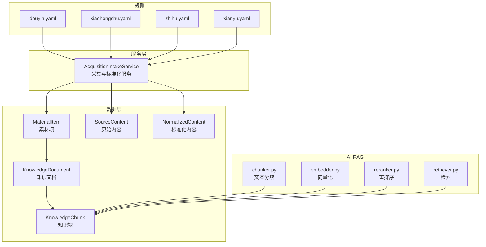
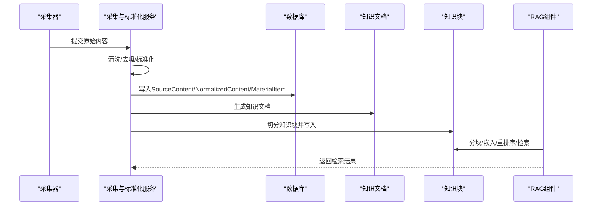
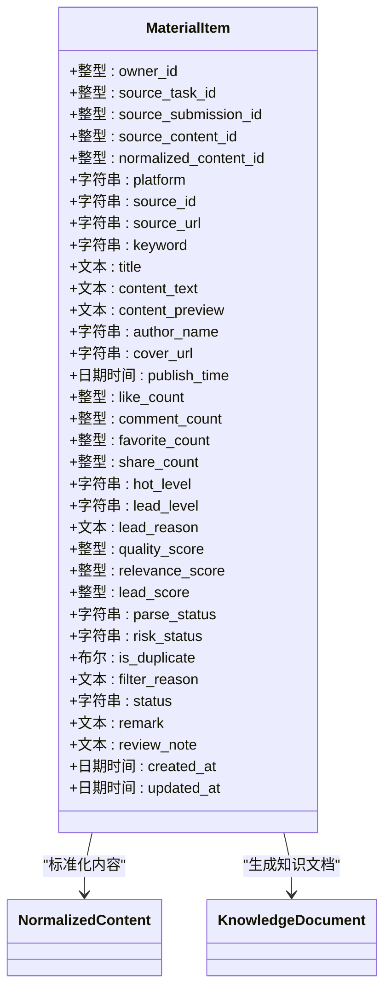
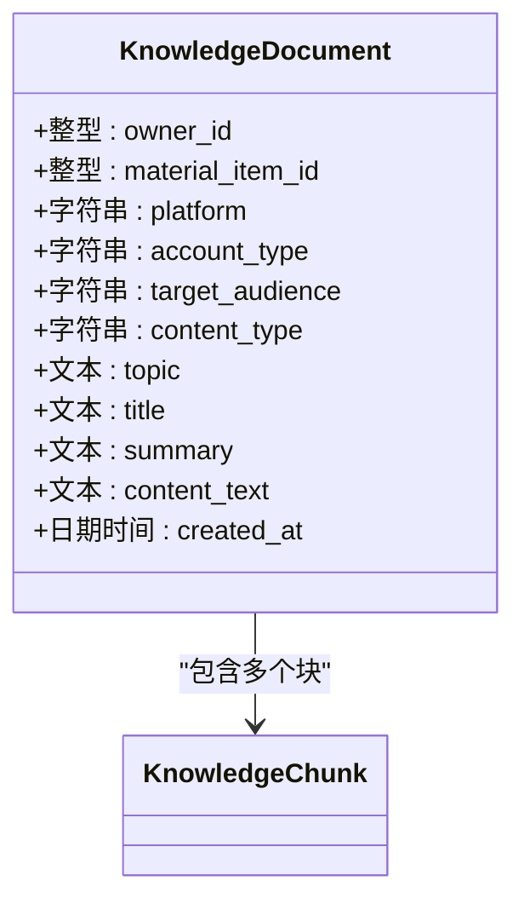
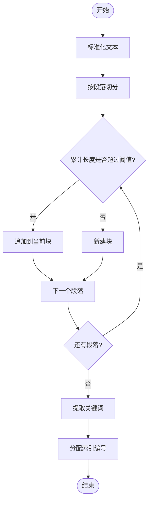
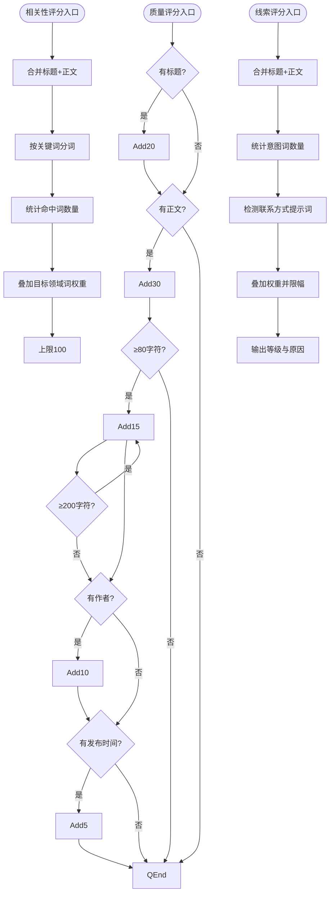
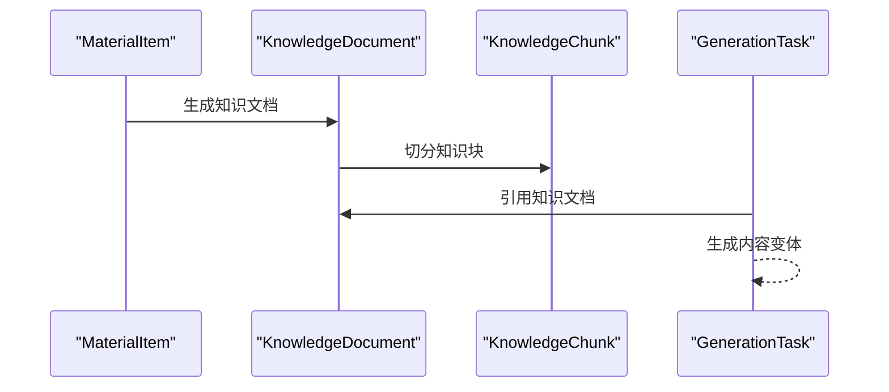
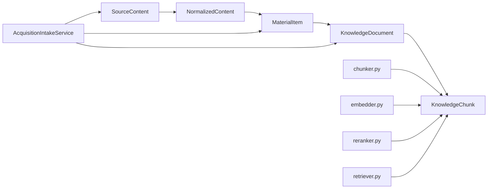

# 素材知识模型

<cite>
**本文引用的文件**
- [models.py](file://backend/app/models/models.py)
- [schemas.py](file://backend/app/schemas/schemas.py)
- [20260327_02_add_material_knowledge_pipeline.py](file://backend/alembic/versions/20260327_02_add_material_knowledge_pipeline.py)
- [material_pipeline_service.py](file://backend/app/services/collector/material_pipeline_service.py)
- [chunker.py](file://backend/app/ai/rag/chunker.py)
- [embedder.py](file://backend/app/ai/rag/embedder.py)
- [reranker.py](file://backend/app/ai/rag/reranker.py)
- [retriever.py](file://backend/app/ai/rag/retriever.py)
- [material_agent.py](file://backend/app/ai/agents/material_agent.py)
- [douyin.yaml](file://backend/app/rules/local/douyin.yaml)
- [xiaohongshu.yaml](file://backend/app/rules/local/xiaohongshu.yaml)
- [zhihu.yaml](file://backend/app/rules/local/zhihu.yaml)
- [xianyu.yaml](file://backend/app/rules/local/xianyu.yaml)
</cite>

## 目录
1. [简介](#简介)
2. [项目结构](#项目结构)
3. [核心组件](#核心组件)
4. [架构总览](#架构总览)
5. [详细组件分析](#详细组件分析)
6. [依赖关系分析](#依赖关系分析)
7. [性能考量](#性能考量)
8. [故障排查指南](#故障排查指南)
9. [结论](#结论)
10. [附录](#附录)

## 简介
本文件系统化梳理“智获客”素材知识模型，围绕以下核心实体展开：MaterialItem（素材项）、KnowledgeDocument（知识文档）、KnowledgeChunk（知识块）。文档解释素材项的来源渠道、平台、关键词、标题、内容预览等字段；阐述知识文档的结构化提取、平台类型、受众群体、内容类型等要素；说明知识块的切分策略、关键词提取、索引编号等技术实现；并记录质量评分、相关性评分、线索评分等智能评估指标。最后给出知识库构建与检索优化的最佳实践。

## 项目结构
本项目采用分层架构，知识模型位于数据层（models），服务层负责采集与标准化流程（material_pipeline_service），AI RAG 组件提供分块、嵌入、重排序与检索能力，规则文件用于平台化约束。

图表来源
- [models.py:584-684](file://backend/app/models/models.py#L584-L684)
- [20260327_02_add_material_knowledge_pipeline.py:26-260](file://backend/alembic/versions/20260327_02_add_material_knowledge_pipeline.py#L26-L260)
- [material_pipeline_service.py:30-800](file://backend/app/services/collector/material_pipeline_service.py#L30-L800)
- [chunker.py:1-3](file://backend/app/ai/rag/chunker.py#L1-L3)
- [embedder.py:1-3](file://backend/app/ai/rag/embedder.py#L1-L3)
- [reranker.py:1-3](file://backend/app/ai/rag/reranker.py#L1-L3)
- [retriever.py:1-3](file://backend/app/ai/rag/retriever.py#L1-L3)
- [douyin.yaml:1-4](file://backend/app/rules/local/douyin.yaml#L1-L4)
- [xiaohongshu.yaml:1-4](file://backend/app/rules/local/xiaohongshu.yaml#L1-L4)
- [zhihu.yaml:1-4](file://backend/app/rules/local/zhihu.yaml#L1-L4)
- [xianyu.yaml:1-4](file://backend/app/rules/local/xianyu.yaml#L1-L4)

章节来源
- [models.py:584-684](file://backend/app/models/models.py#L584-L684)
- [20260327_02_add_material_knowledge_pipeline.py:22-260](file://backend/alembic/versions/20260327_02_add_material_knowledge_pipeline.py#L22-L260)
- [material_pipeline_service.py:30-800](file://backend/app/services/collector/material_pipeline_service.py#L30-L800)

## 核心组件
- MaterialItem（素材项）
  - 字段要点：来源渠道、采集任务/提交来源、员工提交人、原始内容/标准化内容关联、平台、源ID/URL、关键词、标题、正文、封面、发布时间、互动数、热度等级、线索等级与原因、质量/相关性/线索评分、解析/风险状态、去重标记、过滤原因、状态与备注、时间戳。
  - 关系：一对多关联知识文档与生成任务。
- KnowledgeDocument（知识文档）
  - 字段要点：归属用户、素材项外键、平台、账号类型、目标受众、内容类型、主题、标题、摘要、正文。
  - 关系：一对多关联知识块。
- KnowledgeChunk（知识块）
  - 字段要点：归属用户、知识文档外键、块类型、块文本、块索引、关键词列表。
  - 关系：反向关联知识文档。

章节来源
- [models.py:584-684](file://backend/app/models/models.py#L584-L684)
- [20260327_02_add_material_knowledge_pipeline.py:155-194](file://backend/alembic/versions/20260327_02_add_material_knowledge_pipeline.py#L155-L194)

## 架构总览
素材知识模型贯穿“采集—标准化—入库—知识抽取—RAG索引”的完整链路。采集与标准化服务负责清洗、去重、评分、标签化，并生成知识文档与知识块；AI RAG 组件提供分块、嵌入、重排序与检索能力；规则文件用于平台化约束与扩展。

图表来源
- [material_pipeline_service.py:229-800](file://backend/app/services/collector/material_pipeline_service.py#L229-L800)
- [models.py:584-684](file://backend/app/models/models.py#L584-L684)
- [chunker.py:1-3](file://backend/app/ai/rag/chunker.py#L1-L3)
- [embedder.py:1-3](file://backend/app/ai/rag/embedder.py#L1-L3)
- [reranker.py:1-3](file://backend/app/ai/rag/reranker.py#L1-L3)
- [retriever.py:1-3](file://backend/app/ai/rag/retriever.py#L1-L3)

## 详细组件分析

### MaterialItem（素材项）设计与字段
- 来源渠道与任务
  - 支持渠道：采集任务、员工提交、微信机器人、手动输入等；可关联采集任务与员工提交记录。
- 平台与元数据
  - 平台、源ID/URL、关键词、标题、正文、作者、封面、发布时间。
- 内容质量与线索
  - 热度等级、线索等级与原因、质量/相关性/线索评分（0-100）。
- 解析与风险
  - 解析状态、风险状态、去重标记、过滤原因、状态与备注。
- 关系
  - 关联标准化内容与知识文档、生成任务。

图表来源
- [models.py:584-640](file://backend/app/models/models.py#L584-L640)

章节来源
- [models.py:584-640](file://backend/app/models/models.py#L584-L640)
- [20260327_02_add_material_knowledge_pipeline.py:98-154](file://backend/alembic/versions/20260327_02_add_material_knowledge_pipeline.py#L98-L154)

### KnowledgeDocument（知识文档）结构化提取
- 结构化要素
  - 平台、账号类型、目标受众、内容类型、主题、标题、摘要、正文。
- 抽取逻辑
  - 由采集与标准化服务根据素材正文与标题进行规则化分类与主题抽取，形成结构化知识文档。
- 关系
  - 与知识块一对多关联，支撑检索与生成。

图表来源
- [models.py:642-664](file://backend/app/models/models.py#L642-L664)

章节来源
- [models.py:642-664](file://backend/app/models/models.py#L642-L664)
- [material_pipeline_service.py:771-800](file://backend/app/services/collector/material_pipeline_service.py#L771-L800)

### KnowledgeChunk（知识块）切分策略与索引
- 切分策略
  - 按段落拼接，控制每块长度上限，避免超长块影响检索与嵌入效率；限制最大块数以保证检索吞吐。
- 关键词提取
  - 对块文本进行分词与词频统计，提取高频关键词辅助检索。
- 索引编号
  - 块内维护块索引，便于溯源与排序。
- AI RAG 集成
  - 分块后进入嵌入、重排序与检索流程，支撑下游生成任务。

图表来源
- [material_pipeline_service.py:371-393](file://backend/app/services/collector/material_pipeline_service.py#L371-L393)
- [chunker.py:1-3](file://backend/app/ai/rag/chunker.py#L1-L3)

章节来源
- [material_pipeline_service.py:371-393](file://backend/app/services/collector/material_pipeline_service.py#L371-L393)
- [chunker.py:1-3](file://backend/app/ai/rag/chunker.py#L1-L3)

### 评分体系与智能评估
- 质量评分（quality_score）
  - 基于标题、正文、封面、发布时间、作者等字段完整性与长度进行累加打分，上限100。
- 相关性评分（relevance_score）
  - 基于关键词匹配与目标领域词表进行加权计算，上限100。
- 线索评分（lead_score）
  - 基于意图词与联系方式提示词进行加权，同时输出线索等级与原因。
- 状态决策
  - 结合解析/风险状态、评分阈值与来源渠道，自动判定素材项状态（待审/丢弃/通过）。

图表来源
- [material_pipeline_service.py:273-325](file://backend/app/services/collector/material_pipeline_service.py#L273-L325)

章节来源
- [material_pipeline_service.py:273-325](file://backend/app/services/collector/material_pipeline_service.py#L273-L325)

### 知识抽取与生成任务
- 知识抽取
  - 从素材项生成知识文档，包含平台、账号类型、受众、内容类型、主题、摘要等。
- 生成任务
  - 生成任务可引用知识文档ID，结合提示模板与规则生成内容变体，支持合规校验与采纳追踪。

图表来源
- [models.py:642-752](file://backend/app/models/models.py#L642-L752)
- [material_pipeline_service.py:771-800](file://backend/app/services/collector/material_pipeline_service.py#L771-L800)

章节来源
- [models.py:642-752](file://backend/app/models/models.py#L642-L752)
- [material_pipeline_service.py:771-800](file://backend/app/services/collector/material_pipeline_service.py#L771-L800)

### 规则与平台化约束
- 规则文件
  - 平台级规则文件（如抖音、小红书、知乎、闲鱼）用于定义平台化约束与扩展。
- 服务侧规则
  - 采集与标准化服务内置账号类型、受众、内容类型、主题、意图等规则，驱动知识抽取与标签化。

章节来源
- [douyin.yaml:1-4](file://backend/app/rules/local/douyin.yaml#L1-L4)
- [xiaohongshu.yaml:1-4](file://backend/app/rules/local/xiaohongshu.yaml#L1-L4)
- [zhihu.yaml:1-4](file://backend/app/rules/local/zhihu.yaml#L1-L4)
- [xianyu.yaml:1-4](file://backend/app/rules/local/xianyu.yaml#L1-L4)
- [material_pipeline_service.py:40-77](file://backend/app/services/collector/material_pipeline_service.py#L40-L77)

## 依赖关系分析
- 数据模型依赖
  - MaterialItem 依赖 SourceContent 与 NormalizedContent；KnowledgeDocument 依赖 MaterialItem；KnowledgeChunk 依赖 KnowledgeDocument。
- 服务依赖
  - 采集与标准化服务依赖合规服务与浏览器采集客户端，负责清洗、评分、去重、标签化与知识抽取。
- AI RAG 依赖
  - 分块器、嵌入器、重排序器、检索器共同构成检索增强生成的基础能力。

图表来源
- [models.py:507-684](file://backend/app/models/models.py#L507-L684)
- [material_pipeline_service.py:14-28](file://backend/app/services/collector/material_pipeline_service.py#L14-L28)
- [chunker.py:1-3](file://backend/app/ai/rag/chunker.py#L1-L3)
- [embedder.py:1-3](file://backend/app/ai/rag/embedder.py#L1-L3)
- [reranker.py:1-3](file://backend/app/ai/rag/reranker.py#L1-L3)
- [retriever.py:1-3](file://backend/app/ai/rag/retriever.py#L1-L3)

章节来源
- [models.py:507-684](file://backend/app/models/models.py#L507-L684)
- [material_pipeline_service.py:14-28](file://backend/app/services/collector/material_pipeline_service.py#L14-L28)

## 性能考量
- 文本清洗与去噪
  - 使用正则与HTML清理减少噪声行与重复行，降低无效块数量。
- 分块策略
  - 控制块大小与最大块数，避免超长块导致嵌入与检索延迟。
- 去重策略
  - 同源ID优先匹配，其次基于内容哈希去重，减少冗余知识块。
- 评分阈值
  - 质量/相关性/线索评分设置阈值，自动过滤低质内容，提升检索质量。
- 索引与查询
  - 为关键字段建立索引（平台、关键词、状态、风险状态等），加速筛选与聚合。

## 故障排查指南
- 常见问题
  - 缺失标题或正文：检查采集源与清洗逻辑，确保标题/正文至少其一。
  - 风险状态异常：检查合规服务返回与阈值配置，必要时调整自定义风险词。
  - 去重不生效：确认源ID与内容哈希计算一致性。
  - 知识块为空：检查正文是否为空或仅含噪声行。
- 排查步骤
  - 核对采集任务与提交来源字段完整性。
  - 查看评分计算路径与阈值配置。
  - 检查规则文件与服务侧规则是否冲突。
  - 审核索引与查询条件，确保命中预期数据。

章节来源
- [material_pipeline_service.py:262-271](file://backend/app/services/collector/material_pipeline_service.py#L262-L271)
- [material_pipeline_service.py:630-659](file://backend/app/services/collector/material_pipeline_service.py#L630-L659)

## 结论
素材知识模型通过“采集—标准化—入库—知识抽取—RAG索引”的闭环，实现了对海量素材的结构化治理与智能检索。MaterialItem 提供统一的素材视图，KnowledgeDocument 与 KnowledgeChunk 实现结构化知识与可检索块的生成。评分体系与规则化分类保障了质量与合规，配合AI RAG组件可高效支撑生成与推荐场景。

## 附录
- 最佳实践
  - 采集阶段：严格清洗与去噪，确保标题/正文/平台/URL等关键字段完整。
  - 标准化阶段：统一哈希策略与去重逻辑，建立评分阈值与状态机。
  - 知识抽取：基于规则与关键词提取主题与标签，保持文档与块的语义连贯。
  - RAG优化：合理控制块大小与数量，使用关键词与重排序提升召回质量。
  - 规则治理：平台化规则文件与服务侧规则协同，动态扩展与迭代。