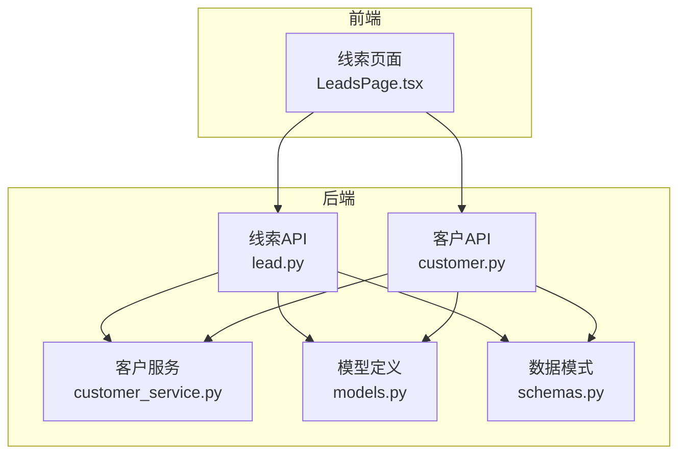
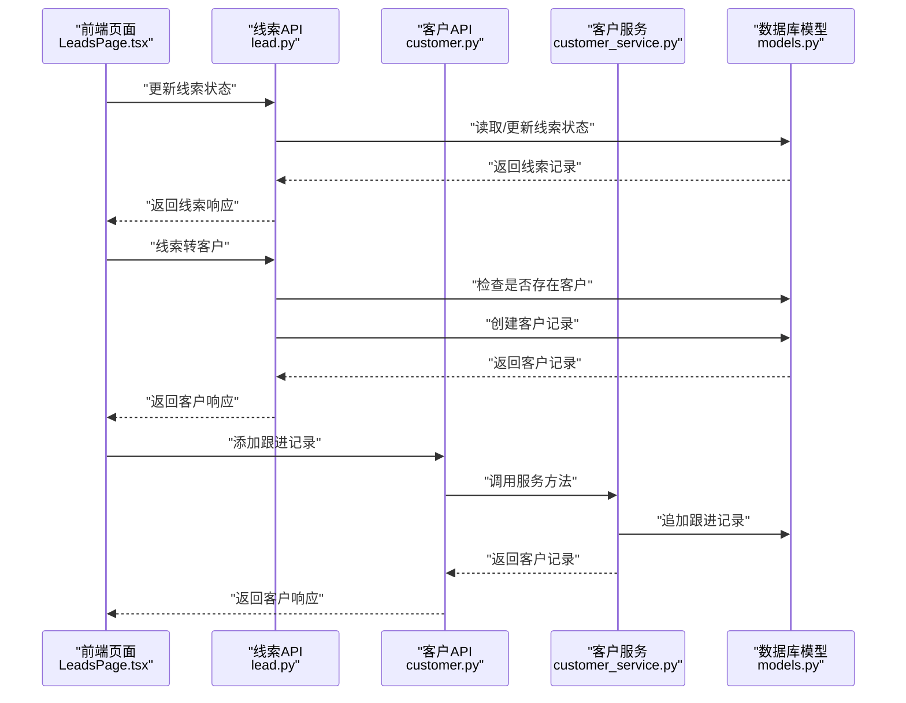
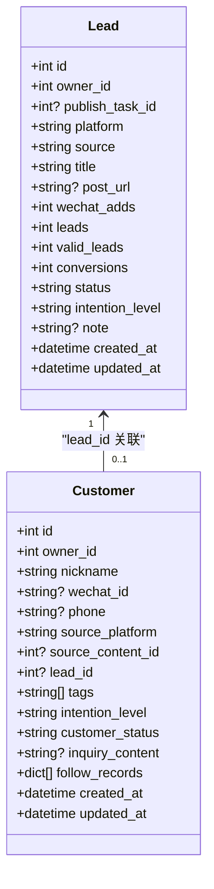
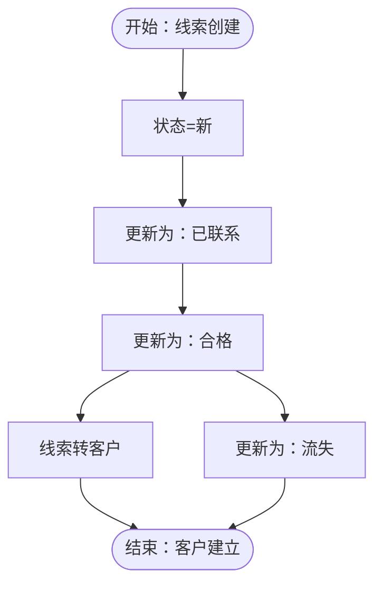
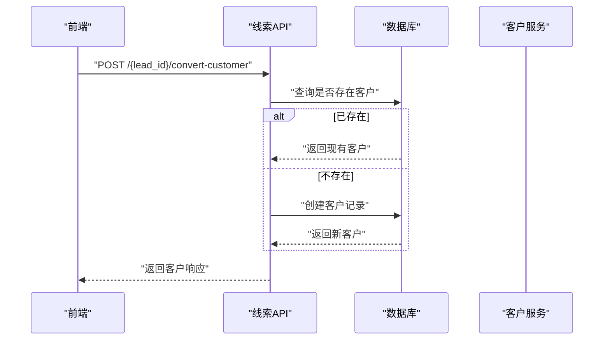
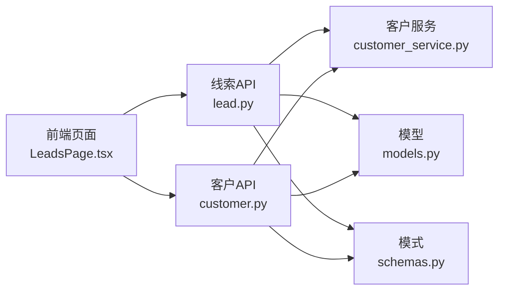

# 线索客户模型

<cite>
**本文引用的文件列表**
- [models.py](file://backend/app/models/models.py)
- [schemas.py](file://backend/app/schemas/schemas.py)
- [lead.py](file://backend/app/api/endpoints/lead.py)
- [customer.py](file://backend/app/api/endpoints/customer.py)
- [customer_service.py](file://backend/app/services/customer_service.py)
- [LeadsPage.tsx](file://desktop/src/pages/leads/LeadsPage.tsx)
- [test_material_pipeline_postgres_regression.py](file://backend/test_material_pipeline_postgres_regression.py)
</cite>

## 目录
1. [简介](#简介)
2. [项目结构](#项目结构)
3. [核心组件](#核心组件)
4. [架构总览](#架构总览)
5. [详细组件分析](#详细组件分析)
6. [依赖关系分析](#依赖关系分析)
7. [性能考量](#性能考量)
8. [故障排查指南](#故障排查指南)
9. [结论](#结论)
10. [附录](#附录)

## 简介
本文件系统性阐述智获客线索与客户模型在客户关系管理中的角色与实现，重点覆盖：
- 线索（Lead）与客户（Customer）的数据结构、字段语义与业务含义
- 线索来源渠道、平台、标题、链接等基本信息
- 意向级别、状态流转、跟进记录等销售管理字段
- 客户基本信息、联系方式、来源平台、标签体系等数据结构
- 线索到客户的转化流程与状态变更机制
- 客户画像构建与销售漏斗分析的实现方案与扩展路径

## 项目结构
后端采用分层架构：API 层负责路由与鉴权；服务层封装业务逻辑；模型层定义数据库实体与枚举；模式层定义请求/响应数据结构。前端页面通过 API 与后端交互，驱动线索与客户的生命周期管理。

图表来源
- [lead.py:1-175](file://backend/app/api/endpoints/lead.py#L1-L175)
- [customer.py:1-148](file://backend/app/api/endpoints/customer.py#L1-L148)
- [customer_service.py:1-115](file://backend/app/services/customer_service.py#L1-L115)
- [models.py:199-257](file://backend/app/models/models.py#L199-L257)
- [schemas.py:163-260](file://backend/app/schemas/schemas.py#L163-L260)

章节来源
- [lead.py:1-175](file://backend/app/api/endpoints/lead.py#L1-L175)
- [customer.py:1-148](file://backend/app/api/endpoints/customer.py#L1-L148)
- [customer_service.py:1-115](file://backend/app/services/customer_service.py#L1-L115)
- [models.py:199-257](file://backend/app/models/models.py#L199-L257)
- [schemas.py:163-260](file://backend/app/schemas/schemas.py#L163-L260)

## 核心组件
- 线索（Lead）
  - 字段要点：来源平台、标题、链接、意向级别、状态、备注、关联发布任务与客户等
  - 枚举：意向级别（低/中/高）、状态（新/已联系/待跟进/合格/已转化/流失）
- 客户（Customer）
  - 字段要点：昵称、微信号、电话、来源平台、来源内容、线索关联、标签、意向级别、状态、咨询内容、跟进记录
  - 枚举：客户状态（新/已联系/待跟进/合格/已转化/流失）
- API 与服务
  - 线索API：创建、列表、状态更新、归属变更、跟踪、线索转客户
  - 客户API：创建、列表、详情、更新、添加跟进记录、删除、导出CSV、待跟进客户
  - 客户服务：封装权限校验、数据校验、CRUD与待跟进查询

章节来源
- [models.py:184-197](file://backend/app/models/models.py#L184-L197)
- [models.py:199-257](file://backend/app/models/models.py#L199-L257)
- [schemas.py:163-260](file://backend/app/schemas/schemas.py#L163-L260)
- [schemas.py:188-201](file://backend/app/schemas/schemas.py#L188-L201)
- [lead.py:29-175](file://backend/app/api/endpoints/lead.py#L29-L175)
- [customer.py:21-148](file://backend/app/api/endpoints/customer.py#L21-L148)
- [customer_service.py:9-115](file://backend/app/services/customer_service.py#L9-L115)

## 架构总览
线索与客户模型贯穿采集、线索池、客户管理与销售漏斗分析的全流程。前端页面驱动线索状态变更与转客户动作，后端通过 API 与服务层保证数据一致性与权限控制。

图表来源
- [LeadsPage.tsx:37-81](file://desktop/src/pages/leads/LeadsPage.tsx#L37-L81)
- [lead.py:74-175](file://backend/app/api/endpoints/lead.py#L74-L175)
- [customer.py:72-83](file://backend/app/api/endpoints/customer.py#L72-L83)
- [customer_service.py:77-98](file://backend/app/services/customer_service.py#L77-L98)
- [models.py:229-257](file://backend/app/models/models.py#L229-L257)

## 详细组件分析

### 数据模型与字段语义
- 线索（Lead）
  - 来源渠道/平台：platform、source
  - 基本信息：title、post_url
  - 衍生指标：wechat_adds、leads、valid_leads、conversions
  - 销售管理：status、intention_level、note
  - 关联关系：owner_id、publish_task_id、customer（一对一）
- 客户（Customer）
  - 基本信息：nickname、wechat_id、phone
  - 来源与关联：source_platform、source_content_id、lead_id
  - 标签与意向：tags、intention_level
  - 状态与内容：customer_status、inquiry_content
  - 跟进记录：follow_records（数组，包含日期、内容、负责人）

图表来源
- [models.py:199-257](file://backend/app/models/models.py#L199-L257)

章节来源
- [models.py:199-257](file://backend/app/models/models.py#L199-L257)

### 线索来源渠道与平台
- 平台类型枚举：小红书、抖音、知乎、闲鱼、微信、其他
- 线索来源：发布任务生成、手动录入、浏览器插件等
- 标题与链接：title、post_url
- 指标字段：微信加微数、线索数、有效线索数、转化数

章节来源
- [models.py:29-36](file://backend/app/models/models.py#L29-L36)
- [models.py:199-227](file://backend/app/models/models.py#L199-L227)
- [schemas.py:203-215](file://backend/app/schemas/schemas.py#L203-L215)

### 意向级别与状态流转
- 意向级别：低、中、高
- 线索状态：新、已联系、待跟进、合格、已转化、流失
- 客户状态：新、已联系、待跟进、合格、已转化、流失
- 前端状态选项：new、contacted、qualified、converted、lost

图表来源
- [models.py:184-197](file://backend/app/models/models.py#L184-L197)
- [LeadsPage.tsx:7-7](file://desktop/src/pages/leads/LeadsPage.tsx#L7-L7)

章节来源
- [models.py:184-197](file://backend/app/models/models.py#L184-L197)
- [LeadsPage.tsx:7-7](file://desktop/src/pages/leads/LeadsPage.tsx#L7-L7)

### 跟进记录与销售管理字段
- 客户跟进记录：数组元素包含日期、内容、负责人
- 销售管理字段：意向级别、客户状态、咨询内容、标签
- API 提供添加跟进记录接口，服务层负责追加与持久化

章节来源
- [models.py:248-249](file://backend/app/models/models.py#L248-L249)
- [customer.py:72-83](file://backend/app/api/endpoints/customer.py#L72-L83)
- [customer_service.py:77-98](file://backend/app/services/customer_service.py#L77-L98)

### 线索到客户的转化流程
- 前端触发“转客户”操作
- 后端检查是否已有客户（幂等保护）
- 若不存在则创建客户，继承线索的意向级别、来源平台、备注等
- 返回客户记录，并可在线索跟踪中看到关联的客户ID

图表来源
- [lead.py:140-175](file://backend/app/api/endpoints/lead.py#L140-L175)
- [test_material_pipeline_postgres_regression.py:646-667](file://backend/test_material_pipeline_postgres_regression.py#L646-L667)

章节来源
- [lead.py:140-175](file://backend/app/api/endpoints/lead.py#L140-L175)
- [test_material_pipeline_postgres_regression.py:646-667](file://backend/test_material_pipeline_postgres_regression.py#L646-L667)

### 客户画像构建与销售漏斗分析
- 客户画像维度
  - 基础属性：昵称、联系方式、来源平台
  - 行为标签：标签列表、意向级别、历史跟进记录
  - 关联线索：lead_id、来源内容ID
- 销售漏斗指标
  - 线索池：新/已联系/待跟进/合格/已转化/流失
  - 转化链路：线索→合格→客户→转化
  - 指标：微信加微数、线索数、有效线索数、转化数
- 实现建议
  - 使用客户状态与意向级别作为漏斗分层
  - 以 follow_records 作为客户活跃度与沟通效果的依据
  - 以 lead_id 与 publish_task_id 关联追踪来源与转化路径

章节来源
- [models.py:229-257](file://backend/app/models/models.py#L229-L257)
- [schemas.py:163-201](file://backend/app/schemas/schemas.py#L163-L201)
- [lead.py:117-137](file://backend/app/api/endpoints/lead.py#L117-L137)

## 依赖关系分析
- 线索API 依赖模型与模式定义，负责鉴权与权限校验
- 客户API 依赖客户服务，确保 CRUD 与导出等操作的安全性
- 前端页面通过 API 与后端交互，驱动线索状态变更与转客户动作

图表来源
- [LeadsPage.tsx:1-110](file://desktop/src/pages/leads/LeadsPage.tsx#L1-L110)
- [lead.py:1-175](file://backend/app/api/endpoints/lead.py#L1-L175)
- [customer.py:1-148](file://backend/app/api/endpoints/customer.py#L1-L148)
- [customer_service.py:1-115](file://backend/app/services/customer_service.py#L1-L115)
- [models.py:199-257](file://backend/app/models/models.py#L199-L257)
- [schemas.py:163-260](file://backend/app/schemas/schemas.py#L163-L260)

章节来源
- [lead.py:1-175](file://backend/app/api/endpoints/lead.py#L1-L175)
- [customer.py:1-148](file://backend/app/api/endpoints/customer.py#L1-L148)
- [customer_service.py:1-115](file://backend/app/services/customer_service.py#L1-L115)
- [models.py:199-257](file://backend/app/models/models.py#L199-L257)
- [schemas.py:163-260](file://backend/app/schemas/schemas.py#L163-L260)

## 性能考量
- 查询优化
  - 列表接口支持按 owner_id 与 status 过滤，避免跨用户数据泄露
  - 前端批量操作时建议限制单次批量数量，避免数据库压力过大
- 写入优化
  - 转客户为幂等操作，避免重复创建导致数据冗余
  - 跟进记录采用数组追加，注意后续查询时对数组长度与排序的性能影响
- 缓存与索引
  - 建议对常用过滤字段（如 owner_id、status、created_at）建立索引
  - 对 lead_id 与 customer_id 的关联查询可考虑预加载或一次性查询映射

## 故障排查指南
- 权限错误
  - 线索列表仅允许查看本人数据，跨用户访问会返回禁止
  - 线索状态更新与归属变更需校验 owner_id
- 幂等性
  - 同一线索多次转客户应返回同一客户，避免重复创建
- 数据一致性
  - 跟进记录为空时需初始化为空数组再追加
- 前端交互
  - 状态下拉框与按钮禁用状态需与后端返回一致，避免误操作

章节来源
- [lead.py:42-71](file://backend/app/api/endpoints/lead.py#L42-L71)
- [lead.py:74-114](file://backend/app/api/endpoints/lead.py#L74-L114)
- [lead.py:140-175](file://backend/app/api/endpoints/lead.py#L140-L175)
- [customer_service.py:77-98](file://backend/app/services/customer_service.py#L77-L98)
- [test_material_pipeline_postgres_regression.py:779-854](file://backend/test_material_pipeline_postgres_regression.py#L779-L854)

## 结论
线索与客户模型在智获客中承担销售漏斗的入口与关键节点职责。通过明确的字段语义、状态枚举与 API 接口，系统实现了从线索采集、状态流转到客户转化的闭环管理。结合标签体系与跟进记录，可进一步构建客户画像与销售漏斗分析，支撑精细化运营与决策。

## 附录
- 常用字段速查
  - 线索：platform、source、title、post_url、status、intention_level、note、lead_id
  - 客户：nickname、wechat_id、phone、source_platform、tags、intention_level、customer_status、inquiry_content、follow_records
- 前端状态选项：new、contacted、qualified、converted、lost
- 测试验证：包含线索状态更新与幂等转客户的行为验证

章节来源
- [schemas.py:163-260](file://backend/app/schemas/schemas.py#L163-L260)
- [LeadsPage.tsx:7-7](file://desktop/src/pages/leads/LeadsPage.tsx#L7-L7)
- [test_material_pipeline_postgres_regression.py:779-854](file://backend/test_material_pipeline_postgres_regression.py#L779-L854)