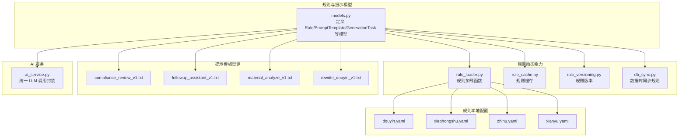
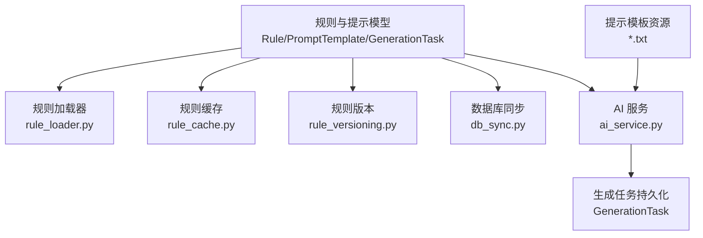
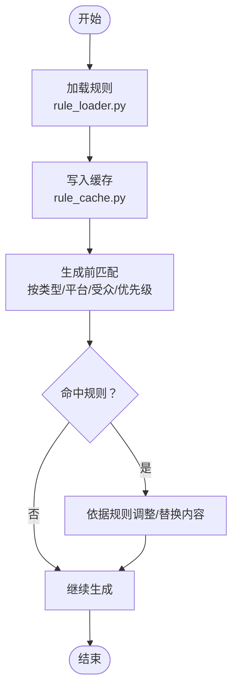
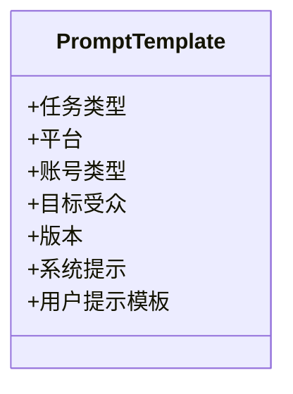
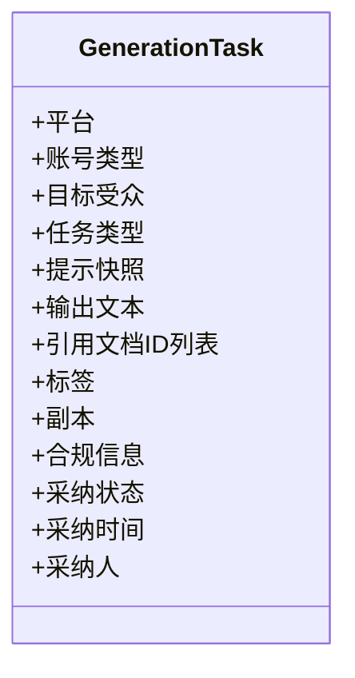
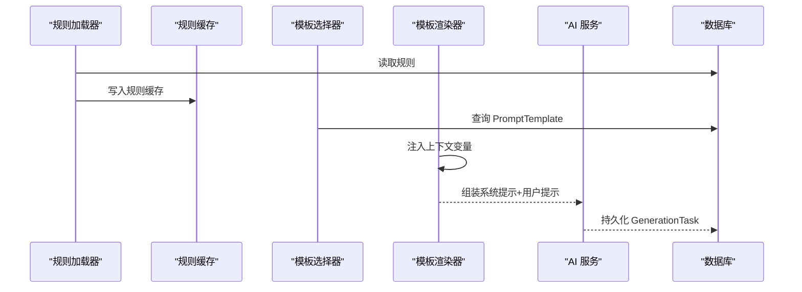
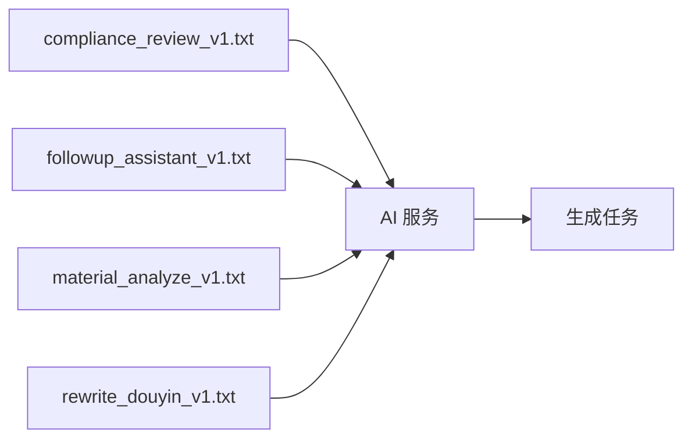
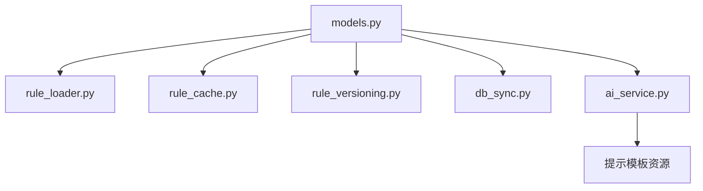

# 规则提示模型

<cite>
**本文引用的文件**
- [models.py](file://backend/app/models/models.py)
- [rule_loader.py](file://backend/app/rules/dynamic/rule_loader.py)
- [rule_cache.py](file://backend/app/rules/dynamic/rule_cache.py)
- [rule_versioning.py](file://backend/app/rules/dynamic/rule_versioning.py)
- [db_sync.py](file://backend/app/rules/sync/db_sync.py)
- [douyin.yaml](file://backend/app/rules/local/douyin.yaml)
- [xiaohongshu.yaml](file://backend/app/rules/local/xiaohongshu.yaml)
- [zhihu.yaml](file://backend/app/rules/local/zhihu.yaml)
- [xianyu.yaml](file://backend/app/rules/local/xianyu.yaml)
- [ai_service.py](file://backend/app/services/ai_service.py)
- [compliance_review_v1.txt](file://backend/app/ai/prompts/compliance_review_v1.txt)
- [followup_assistant_v1.txt](file://backend/app/ai/prompts/followup_assistant_v1.txt)
- [material_analyze_v1.txt](file://backend/app/ai/prompts/material_analyze_v1.txt)
- [rewrite_douyin_v1.txt](file://backend/app/ai/prompts/rewrite_douyin_v1.txt)
</cite>

## 目录
1. [引言](#引言)
2. [项目结构](#项目结构)
3. [核心组件](#核心组件)
4. [架构总览](#架构总览)
5. [详细组件分析](#详细组件分析)
6. [依赖分析](#依赖分析)
7. [性能考虑](#性能考虑)
8. [故障排查指南](#故障排查指南)
9. [结论](#结论)
10. [附录](#附录)

## 引言
本文件面向“规则提示模型”的设计与实现，聚焦两类核心实体：规则模型 Rule 与提示模板模型 PromptTemplate。我们将从数据模型定义出发，解释规则与提示模板在 AI 内容生成中的作用；梳理规则的筛选条件（类型、平台、受众、优先级等）、提示模板的结构（任务类型、平台适配、版本管理）；记录规则的边界约束与提示模板的系统提示、用户模板等参数；并说明规则加载、模板渲染、生成任务执行的完整流程。最后提供规则引擎扩展与提示模板定制的实现方案。

## 项目结构
围绕规则与提示模型的关键目录与文件如下：
- 数据模型层：规则与提示模板的数据库表结构定义
- 规则动态加载与缓存：规则加载器、缓存、版本控制、数据库同步
- 规则本地配置：各平台的 YAML 规则文件
- 提示模板资源：文本格式的提示模板
- AI 服务：统一的 LLM 调用封装，支持本地与火山引擎

**图表来源**
- [models.py:686-722](file://backend/app/models/models.py#L686-L722)
- [rule_loader.py:1-3](file://backend/app/rules/dynamic/rule_loader.py#L1-L3)
- [rule_cache.py:1-6](file://backend/app/rules/dynamic/rule_cache.py#L1-L6)
- [rule_versioning.py:1-3](file://backend/app/rules/dynamic/rule_versioning.py#L1-L3)
- [db_sync.py:1-3](file://backend/app/rules/sync/db_sync.py#L1-L3)
- [douyin.yaml:1-4](file://backend/app/rules/local/douyin.yaml#L1-L4)
- [xiaohongshu.yaml:1-4](file://backend/app/rules/local/xiaohongshu.yaml#L1-L4)
- [zhihu.yaml:1-4](file://backend/app/rules/local/zhihu.yaml#L1-L4)
- [xianyu.yaml:1-4](file://backend/app/rules/local/xianyu.yaml#L1-L4)
- [compliance_review_v1.txt:1-1](file://backend/app/ai/prompts/compliance_review_v1.txt#L1-L1)
- [followup_assistant_v1.txt:1-1](file://backend/app/ai/prompts/followup_assistant_v1.txt#L1-L1)
- [material_analyze_v1.txt:1-1](file://backend/app/ai/prompts/material_analyze_v1.txt#L1-L1)
- [rewrite_douyin_v1.txt:1-1](file://backend/app/ai/prompts/rewrite_douyin_v1.txt#L1-L1)
- [ai_service.py:15-460](file://backend/app/services/ai_service.py#L15-L460)

**章节来源**
- [models.py:686-722](file://backend/app/models/models.py#L686-L722)
- [rule_loader.py:1-3](file://backend/app/rules/dynamic/rule_loader.py#L1-L3)
- [rule_cache.py:1-6](file://backend/app/rules/dynamic/rule_cache.py#L1-L6)
- [rule_versioning.py:1-3](file://backend/app/rules/dynamic/rule_versioning.py#L1-L3)
- [db_sync.py:1-3](file://backend/app/rules/sync/db_sync.py#L1-L3)
- [douyin.yaml:1-4](file://backend/app/rules/local/douyin.yaml#L1-L4)
- [xiaohongshu.yaml:1-4](file://backend/app/rules/local/xiaohongshu.yaml#L1-L4)
- [zhihu.yaml:1-4](file://backend/app/rules/local/zhihu.yaml#L1-L4)
- [xianyu.yaml:1-4](file://backend/app/rules/local/xianyu.yaml#L1-L4)
- [compliance_review_v1.txt:1-1](file://backend/app/ai/prompts/compliance_review_v1.txt#L1-L1)
- [followup_assistant_v1.txt:1-1](file://backend/app/ai/prompts/followup_assistant_v1.txt#L1-L1)
- [material_analyze_v1.txt:1-1](file://backend/app/ai/prompts/material_analyze_v1.txt#L1-L1)
- [rewrite_douyin_v1.txt:1-1](file://backend/app/ai/prompts/rewrite_douyin_v1.txt#L1-L1)
- [ai_service.py:15-460](file://backend/app/services/ai_service.py#L15-L460)

## 核心组件
- 规则模型 Rule
  - 字段要点：规则类型、平台、账号类型、目标受众、名称、内容、优先级等
  - 用途：作为生成内容的边界约束，用于过滤、校验与指导生成
- 提示模板模型 PromptTemplate
  - 字段要点：任务类型、平台、账号类型、目标受众、版本、系统提示、用户提示模板
  - 用途：为不同任务与平台提供标准化的提示词模板，支持版本化演进
- 生成任务模型 GenerationTask
  - 字段要点：平台、账号类型、目标受众、任务类型、提示快照、输出文本、引用知识文档、标签、副本、合规信息、采纳状态等
  - 用途：持久化生成上下文与结果，支撑后续复用与审计

上述三者共同构成“规则提示模型”的数据基础，贯穿规则加载、模板选择、渲染与执行的全流程。

**章节来源**
- [models.py:686-722](file://backend/app/models/models.py#L686-L722)

## 架构总览
规则提示模型在系统中的位置与交互如下：

**图表来源**
- [models.py:686-722](file://backend/app/models/models.py#L686-L722)
- [rule_loader.py:1-3](file://backend/app/rules/dynamic/rule_loader.py#L1-L3)
- [rule_cache.py:1-6](file://backend/app/rules/dynamic/rule_cache.py#L1-L6)
- [rule_versioning.py:1-3](file://backend/app/rules/dynamic/rule_versioning.py#L1-L3)
- [db_sync.py:1-3](file://backend/app/rules/sync/db_sync.py#L1-L3)
- [ai_service.py:15-460](file://backend/app/services/ai_service.py#L15-L460)

## 详细组件分析

### 规则模型 Rule
- 设计要点
  - 以“规则类型+平台+账号类型+目标受众”进行多维筛选，支持优先级排序
  - 规则内容为可执行的边界约束文本，供生成阶段校验与调整
- 典型用途
  - 合规校验：在生成前对内容进行规则匹配，阻断高风险表达
  - 风险提示：基于规则提取风险点并给出替代建议
- 执行流程（概念）
  - 规则加载 → 规则缓存 → 生成前匹配 → 风险评分与拦截/修正

**图表来源**
- [rule_loader.py:1-3](file://backend/app/rules/dynamic/rule_loader.py#L1-L3)
- [rule_cache.py:1-6](file://backend/app/rules/dynamic/rule_cache.py#L1-L6)
- [models.py:686-703](file://backend/app/models/models.py#L686-L703)

**章节来源**
- [models.py:686-703](file://backend/app/models/models.py#L686-L703)
- [rule_loader.py:1-3](file://backend/app/rules/dynamic/rule_loader.py#L1-L3)
- [rule_cache.py:1-6](file://backend/app/rules/dynamic/rule_cache.py#L1-L6)

### 提示模板模型 PromptTemplate
- 设计要点
  - 任务类型：区分改写、分析、合规、跟进等
  - 平台适配：针对不同平台（如小红书、抖音、知乎、闲鱼）定制模板
  - 版本管理：通过版本字段支持模板迭代与回滚
  - 参数结构：系统提示（System Prompt）与用户提示模板（User Prompt Template）
- 使用方式
  - 在生成任务中按任务类型与平台选择对应模板
  - 将上下文变量注入到用户模板，形成最终提示

**图表来源**
- [models.py:705-722](file://backend/app/models/models.py#L705-L722)

**章节来源**
- [models.py:705-722](file://backend/app/models/models.py#L705-L722)

### 生成任务模型 GenerationTask
- 设计要点
  - 记录生成上下文（平台、账号类型、目标受众、任务类型、提示快照）
  - 存储输出文本、引用的知识文档 ID 列表、标签、副本、合规信息
  - 支持采纳状态与采纳人追踪
- 价值
  - 可追溯、可审计、可复用
  - 便于后续改写、二次加工与合规复核

**图表来源**
- [models.py:724-752](file://backend/app/models/models.py#L724-L752)

**章节来源**
- [models.py:724-752](file://backend/app/models/models.py#L724-L752)

### 规则加载与模板渲染流程
- 规则加载
  - 从本地 YAML 或数据库加载规则，写入缓存，按版本号生效
- 模板渲染
  - 根据任务类型与平台选择 PromptTemplate，将上下文变量注入用户模板
- 生成执行
  - 调用 AI 服务，传入系统提示与用户提示，得到生成结果
  - 将结果与上下文持久化为 GenerationTask

**图表来源**
- [rule_loader.py:1-3](file://backend/app/rules/dynamic/rule_loader.py#L1-L3)
- [rule_cache.py:1-6](file://backend/app/rules/dynamic/rule_cache.py#L1-L6)
- [models.py:705-722](file://backend/app/models/models.py#L705-L722)
- [ai_service.py:15-460](file://backend/app/services/ai_service.py#L15-L460)
- [models.py:724-752](file://backend/app/models/models.py#L724-L752)

**章节来源**
- [rule_loader.py:1-3](file://backend/app/rules/dynamic/rule_loader.py#L1-L3)
- [rule_cache.py:1-6](file://backend/app/rules/dynamic/rule_cache.py#L1-L6)
- [models.py:705-722](file://backend/app/models/models.py#L705-L722)
- [ai_service.py:15-460](file://backend/app/services/ai_service.py#L15-L460)
- [models.py:724-752](file://backend/app/models/models.py#L724-L752)

### 提示模板资源与平台适配
- 提示模板资源采用纯文本文件存放，便于版本管理与快速迭代
- 平台适配通过模板选择器按平台与任务类型匹配对应模板
- 示例资源文件包括合规审核、跟进助手、素材分析、改写助手等

**图表来源**
- [compliance_review_v1.txt:1-1](file://backend/app/ai/prompts/compliance_review_v1.txt#L1-L1)
- [followup_assistant_v1.txt:1-1](file://backend/app/ai/prompts/followup_assistant_v1.txt#L1-L1)
- [material_analyze_v1.txt:1-1](file://backend/app/ai/prompts/material_analyze_v1.txt#L1-L1)
- [rewrite_douyin_v1.txt:1-1](file://backend/app/ai/prompts/rewrite_douyin_v1.txt#L1-L1)
- [ai_service.py:15-460](file://backend/app/services/ai_service.py#L15-L460)

**章节来源**
- [compliance_review_v1.txt:1-1](file://backend/app/ai/prompts/compliance_review_v1.txt#L1-L1)
- [followup_assistant_v1.txt:1-1](file://backend/app/ai/prompts/followup_assistant_v1.txt#L1-L1)
- [material_analyze_v1.txt:1-1](file://backend/app/ai/prompts/material_analyze_v1.txt#L1-L1)
- [rewrite_douyin_v1.txt:1-1](file://backend/app/ai/prompts/rewrite_douyin_v1.txt#L1-L1)
- [ai_service.py:15-460](file://backend/app/services/ai_service.py#L15-L460)

## 依赖分析
- 规则与提示模型依赖数据库表结构，通过 ORM 映射实现
- 规则动态模块与本地配置文件解耦，支持集中式或分布式加载
- AI 服务作为外部集成点，统一处理本地与云端模型调用

**图表来源**
- [models.py:686-722](file://backend/app/models/models.py#L686-L722)
- [rule_loader.py:1-3](file://backend/app/rules/dynamic/rule_loader.py#L1-L3)
- [rule_cache.py:1-6](file://backend/app/rules/dynamic/rule_cache.py#L1-L6)
- [rule_versioning.py:1-3](file://backend/app/rules/dynamic/rule_versioning.py#L1-L3)
- [db_sync.py:1-3](file://backend/app/rules/sync/db_sync.py#L1-L3)
- [ai_service.py:15-460](file://backend/app/services/ai_service.py#L15-L460)

**章节来源**
- [models.py:686-722](file://backend/app/models/models.py#L686-L722)
- [rule_loader.py:1-3](file://backend/app/rules/dynamic/rule_loader.py#L1-L3)
- [rule_cache.py:1-6](file://backend/app/rules/dynamic/rule_cache.py#L1-L6)
- [rule_versioning.py:1-3](file://backend/app/rules/dynamic/rule_versioning.py#L1-L3)
- [db_sync.py:1-3](file://backend/app/rules/sync/db_sync.py#L1-L3)
- [ai_service.py:15-460](file://backend/app/services/ai_service.py#L15-L460)

## 性能考虑
- 规则缓存
  - 将规则加载到内存缓存，减少重复 IO 与解析开销
- 模板选择
  - 通过索引字段（任务类型、平台、版本）快速定位模板，避免全表扫描
- 生成调用
  - 统一超时与重试策略，避免长尾请求影响整体吞吐
- 数据持久化
  - 批量写入 GenerationTask，降低数据库压力

[本节为通用建议，无需特定文件分析]

## 故障排查指南
- 规则未生效
  - 检查规则是否成功加载并写入缓存
  - 核对规则版本号与当前生效版本一致
- 模板未命中
  - 确认任务类型、平台、账号类型、目标受众与模板定义一致
  - 检查模板版本是否正确
- 生成异常
  - 查看 AI 服务日志与错误码
  - 核对系统提示与用户提示拼接是否正确
- 数据持久化失败
  - 检查数据库连接与事务提交状态

**章节来源**
- [rule_cache.py:1-6](file://backend/app/rules/dynamic/rule_cache.py#L1-L6)
- [rule_versioning.py:1-3](file://backend/app/rules/dynamic/rule_versioning.py#L1-L3)
- [ai_service.py:15-460](file://backend/app/services/ai_service.py#L15-L460)

## 结论
规则提示模型通过 Rule、PromptTemplate 与 GenerationTask 的协同，实现了对 AI 内容生成的规范化与可追溯化。规则提供边界约束，提示模板提供结构化引导，生成任务承载上下文与结果。结合动态加载、缓存与版本管理，系统具备良好的扩展性与稳定性。建议在实际落地中持续完善规则与模板的版本治理，并加强生成结果的合规与效果评估。

[本节为总结性内容，无需特定文件分析]

## 附录

### 规则筛选条件与边界约束
- 筛选维度
  - 规则类型：用于区分不同业务场景（如合规、风控、风格）
  - 平台：抖音、小红书、知乎、闲鱼等
  - 账号类型：个人号、企业号等
  - 目标受众：按人群画像设定
  - 优先级：数值越高优先级越高
- 边界约束
  - 规则内容为可执行的约束文本，用于生成前校验与调整

**章节来源**
- [models.py:686-703](file://backend/app/models/models.py#L686-L703)

### 提示模板结构与参数
- 结构要素
  - 任务类型：改写、分析、合规、跟进等
  - 平台适配：按平台定制
  - 版本管理：版本字段支持迭代
  - 参数：系统提示（System Prompt）、用户提示模板（User Prompt Template）
- 资源文件
  - 文本格式的提示模板，便于版本管理与快速迭代

**章节来源**
- [models.py:705-722](file://backend/app/models/models.py#L705-L722)
- [compliance_review_v1.txt:1-1](file://backend/app/ai/prompts/compliance_review_v1.txt#L1-L1)
- [followup_assistant_v1.txt:1-1](file://backend/app/ai/prompts/followup_assistant_v1.txt#L1-L1)
- [material_analyze_v1.txt:1-1](file://backend/app/ai/prompts/material_analyze_v1.txt#L1-L1)
- [rewrite_douyin_v1.txt:1-1](file://backend/app/ai/prompts/rewrite_douyin_v1.txt#L1-L1)

### 规则加载、模板渲染与生成执行流程
- 规则加载：从本地或数据库加载规则，写入缓存
- 模板选择：按任务类型与平台选择模板
- 模板渲染：注入上下文变量，组装系统提示与用户提示
- 生成执行：调用 AI 服务，持久化生成任务

**章节来源**
- [rule_loader.py:1-3](file://backend/app/rules/dynamic/rule_loader.py#L1-L3)
- [rule_cache.py:1-6](file://backend/app/rules/dynamic/rule_cache.py#L1-L6)
- [models.py:705-722](file://backend/app/models/models.py#L705-L722)
- [ai_service.py:15-460](file://backend/app/services/ai_service.py#L15-L460)
- [models.py:724-752](file://backend/app/models/models.py#L724-L752)

### 规则引擎扩展与提示模板定制方案
- 规则引擎扩展
  - 支持从数据库动态拉取规则，按版本生效
  - 提供规则缓存与失效策略，确保热更新
  - 增加规则优先级与权重计算，支持多规则合并
- 提示模板定制
  - 模板版本化管理，支持灰度发布
  - 模板参数化，支持按受众与场景注入变量
  - 提供模板校验与回滚机制，保障稳定性

**章节来源**
- [db_sync.py:1-3](file://backend/app/rules/sync/db_sync.py#L1-L3)
- [rule_versioning.py:1-3](file://backend/app/rules/dynamic/rule_versioning.py#L1-L3)
- [models.py:705-722](file://backend/app/models/models.py#L705-L722)