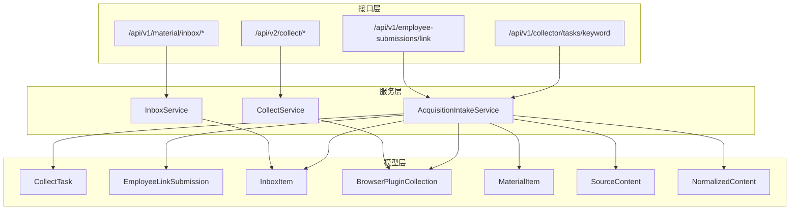
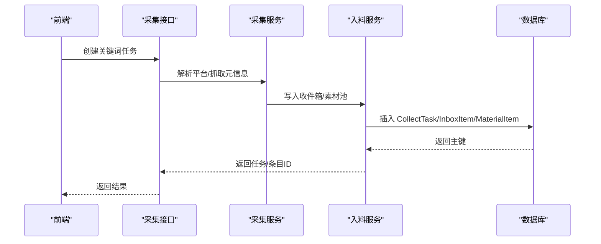
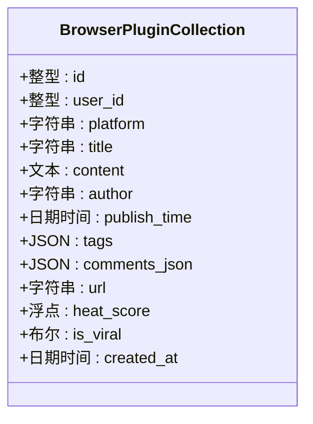
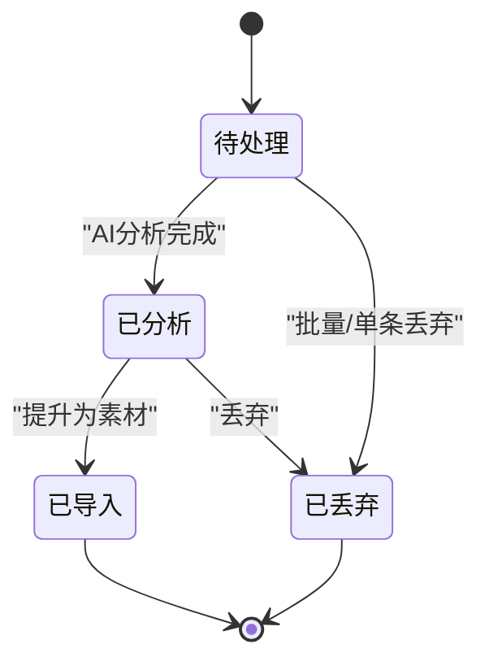
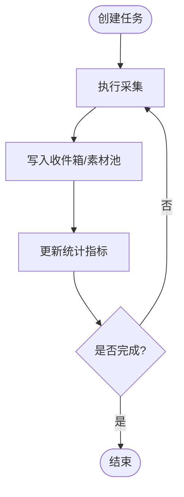
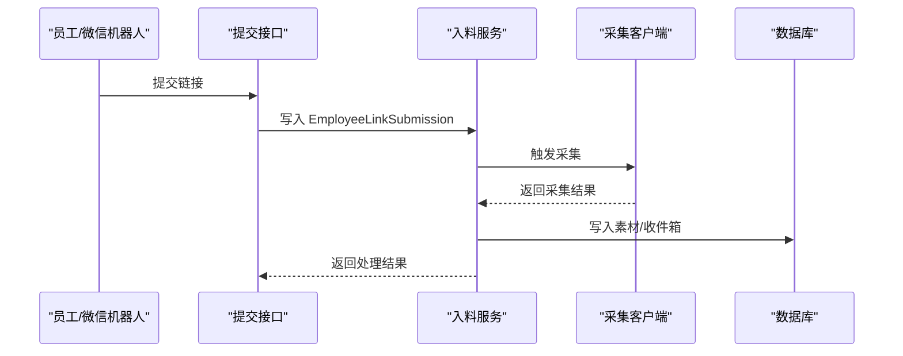
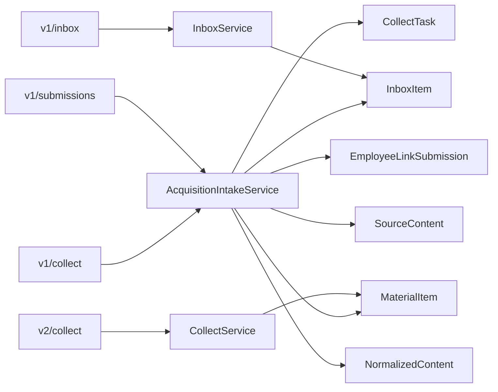

# 采集系统模型

<cite>
**本文引用的文件**
- [models.py](file://backend/app/models/models.py)
- [collect.py](file://backend/app/api/v1/endpoints/collect.py)
- [collect.py](file://backend/app/api/v2/endpoints/collect.py)
- [inbox.py](file://backend/app/api/v1/endpoints/inbox.py)
- [submissions.py](file://backend/app/api/v1/endpoints/submissions.py)
- [collect_service.py](file://backend/app/domains/acquisition/collect_service.py)
- [inbox_service.py](file://backend/app/domains/acquisition/inbox_service.py)
- [material_pipeline_service.py](file://backend/app/services/collector/material_pipeline_service.py)
- [20260325_01_add_acquisition_inbox_pipeline.py](file://backend/alembic/versions/20260325_01_add_acquisition_inbox_pipeline.py)
- [20260327_01_refactor_material_inbox_filtering.py](file://backend/alembic/versions/20260327_01_refactor_material_inbox_filtering.py)
- [20260328_01_extend_generation_task_structured_outputs.py](file://backend/alembic/versions/20260328_01_extend_generation_task_structured_outputs.py)
- [功能跟进看板_全功能落地_2026-03-23.md](file://docs/operations/功能跟进看板_全功能落地_2026-03-23.md)
</cite>

## 目录
1. [简介](#简介)
2. [项目结构](#项目结构)
3. [核心组件](#核心组件)
4. [架构总览](#架构总览)
5. [详细组件分析](#详细组件分析)
6. [依赖分析](#依赖分析)
7. [性能考虑](#性能考虑)
8. [故障排查指南](#故障排查指南)
9. [结论](#结论)
10. [附录](#附录)

## 简介
本文件面向“智获客采集系统”的模型与业务流程，重点围绕以下采集相关模型进行深入说明：
- BrowserPluginCollection：浏览器插件采集内容模型，包含平台、标题、正文、作者、发布时间、标签、评论、URL、热度分、是否热门等字段。
- InboxItem：收件箱项目模型，承载待处理内容，支持状态机流转、分配机制、提升为素材等功能。
- CollectTask：关键词采集任务模型，记录任务类型、平台、关键词、最大采集数量及统计指标（已插入、待审核、丢弃、重复、失败）与错误信息。
- EmployeeLinkSubmission：员工/手动/企业微信机器人提交的链接模型，记录来源类型、平台、URL、备注、状态与错误信息。

同时，文档解释浏览器插件采集的内容结构、热力评分与是否热门字段的来源与用途；梳理收件箱项目的待处理状态、分配机制、提升为素材的流程；说明关键词采集任务的状态跟踪、统计指标与错误处理；记录员工手动提交链接的内容、状态管理与审核流程；并提供采集系统性能优化与质量控制的实现方案。

## 项目结构
采集系统采用“模型-服务-接口”分层设计：
- 模型层：定义数据库实体与字段，涵盖采集来源、内容资产、收件箱、任务与提交等。
- 服务层：封装采集、清洗、去重、入料、洞察与AI分析等业务逻辑。
- 接口层：提供API端点，支撑关键词任务创建、URL元信息提取、素材日志与统计查询、收件箱管理、员工提交等。

**图表来源**
- [collect.py:18-33](file://backend/app/api/v1/endpoints/collect.py#L18-L33)
- [collect.py:172-197](file://backend/app/api/v2/endpoints/collect.py#L172-L197)
- [inbox.py:40-70](file://backend/app/api/v1/endpoints/inbox.py#L40-L70)
- [submissions.py:31-40](file://backend/app/api/v1/endpoints/submissions.py#L31-L40)
- [material_pipeline_service.py:30-32](file://backend/app/services/collector/material_pipeline_service.py#L30-L32)
- [collect_service.py:74-76](file://backend/app/domains/acquisition/collect_service.py#L74-L76)
- [inbox_service.py:14-14](file://backend/app/domains/acquisition/inbox_service.py#L14-L14)

**章节来源**
- [collect.py:1-34](file://backend/app/api/v1/endpoints/collect.py#L1-L34)
- [collect.py:154-302](file://backend/app/api/v2/endpoints/collect.py#L154-L302)
- [inbox.py:1-165](file://backend/app/api/v1/endpoints/inbox.py#L1-L165)
- [submissions.py:1-40](file://backend/app/api/v1/endpoints/submissions.py#L1-L40)

## 核心组件
本节聚焦四大采集相关模型的字段语义、业务含义与典型用法。

- BrowserPluginCollection（浏览器插件采集）
  - 字段要点：平台、标题、正文、作者、发布时间、标签、评论JSON、URL、热度分、是否热门、创建时间。
  - 用途：记录浏览器插件采集到的原始内容，便于后续清洗、标准化与入料。
  - 与AI分析：热度分与是否热门由AI分析服务计算并回填。

- InboxItem（收件箱项目）
  - 字段要点：归属者、平台、来源URL、内容类型、标题、正文、作者、发布时间、标签、指标、来源类型、分类、备注、热度分、是否热门、状态、分配人、分配时间、提升后的素材ID、洞察项ID、审核备注。
  - 用途：统一承接各类采集来源（关键词任务、员工提交、企业微信机器人、手动输入）的待处理内容，支持状态机流转与人工审核。

- CollectTask（关键词采集任务）
  - 字段要点：任务类型（默认关键词）、平台、关键词、最大采集数、状态、结果数、已插入数、待审核数、丢弃数、重复数、失败数、错误信息。
  - 用途：描述一次关键词采集任务的生命周期与统计指标，便于监控与排障。

- EmployeeLinkSubmission（员工/手动/企业微信链接提交）
  - 字段要点：归属者、员工ID、来源类型（manual_link / wechat_robot）、平台、URL、备注、状态、错误信息。
  - 用途：记录员工或企业微信机器人提交的外部链接，统一进入采集入料流程。

**章节来源**
- [models.py:351-372](file://backend/app/models/models.py#L351-L372)
- [models.py:374-411](file://backend/app/models/models.py#L374-L411)
- [models.py:413-436](file://backend/app/models/models.py#L413-L436)
- [models.py:438-456](file://backend/app/models/models.py#L438-L456)

## 架构总览
采集系统的关键流程包括：
- 关键词采集任务创建与执行：前端调用创建任务接口，服务层触发采集客户端抓取，将结果写入收件箱或素材池。
- 员工/手动/企业微信提交：提交链接后，系统尝试采集并写入素材池，同时记录提交记录。
- 收件箱管理：支持状态机流转（pending/review/discard）、批量分配、批量丢弃、批量提升为素材、去重预览与自动合并。
- AI分析与洞察：对内容进行热度分、是否热门、分类、标签等分析，并同步到内容资产与洞察项。

**图表来源**
- [collect.py:18-33](file://backend/app/api/v1/endpoints/collect.py#L18-L33)
- [material_pipeline_service.py:30-32](file://backend/app/services/collector/material_pipeline_service.py#L30-L32)
- [models.py:413-436](file://backend/app/models/models.py#L413-L436)

## 详细组件分析

### BrowserPluginCollection 模型分析
- 数据结构与字段
  - 平台、标题、正文、作者、发布时间、标签、评论JSON、URL、热度分、是否热门、创建时间。
- 业务意义
  - 作为浏览器插件采集的原始落库对象，承载结构化数据以便后续清洗与标准化。
- 与AI分析的关系
  - 热度分与是否热门由AI分析服务计算并回填至内容资产，收件箱在“分析”阶段也会应用AI结果更新字段。

**图表来源**
- [models.py:351-372](file://backend/app/models/models.py#L351-L372)

**章节来源**
- [models.py:351-372](file://backend/app/models/models.py#L351-L372)
- [功能跟进看板_全功能落地_2026-03-23.md:30-44](file://docs/operations/功能跟进看板_全功能落地_2026-03-23.md#L30-L44)

### InboxItem 模型分析
- 数据结构与字段
  - 归属者、平台、来源URL、内容类型、标题、正文、作者、发布时间、标签、指标、来源类型、分类、备注、热度分、是否热门、状态、分配人、分配时间、提升后的素材ID、洞察项ID、审核备注。
- 状态机与流转
  - 支持 pending/review/discard 三态流转，配合批量操作与单条更新。
- 分配机制
  - 支持批量分配给指定用户，并记录分配时间与备注。
- 提升为素材
  - 将收件箱条目提升为内容资产与洞察项，标记为 imported，避免重复提升。

**图表来源**
- [models.py:397-411](file://backend/app/models/models.py#L397-L411)
- [inbox_service.py:162-221](file://backend/app/domains/acquisition/inbox_service.py#L162-L221)

**章节来源**
- [models.py:374-411](file://backend/app/models/models.py#L374-L411)
- [inbox_service.py:14-439](file://backend/app/domains/acquisition/inbox_service.py#L14-L439)

### CollectTask 模型分析
- 数据结构与字段
  - 任务类型（默认关键词）、平台、关键词、最大采集数、状态、结果数、已插入数、待审核数、丢弃数、重复数、失败数、错误信息。
- 统计指标
  - 用于任务执行过程中的实时统计与异常追踪，便于前端展示与告警。
- 错误处理
  - 失败数与错误信息字段用于记录采集失败原因，便于重试与排障。

**图表来源**
- [models.py:413-436](file://backend/app/models/models.py#L413-L436)
- [collect.py:18-33](file://backend/app/api/v1/endpoints/collect.py#L18-L33)

**章节来源**
- [models.py:413-436](file://backend/app/models/models.py#L413-L436)
- [collect.py:18-33](file://backend/app/api/v1/endpoints/collect.py#L18-L33)

### EmployeeLinkSubmission 模型分析
- 数据结构与字段
  - 归属者、员工ID、来源类型（manual_link / wechat_robot）、平台、URL、备注、状态、错误信息。
- 审核流程
  - 提交后进入待处理状态，经采集客户端解析后写入素材池，同时记录提交记录与状态变更。
- 与入料服务的集成
  - 入料服务根据来源类型区分“员工提交”与“企业微信机器人”，并设置相应的来源通道。

**图表来源**
- [submissions.py:31-40](file://backend/app/api/v1/endpoints/submissions.py#L31-L40)
- [material_pipeline_service.py:1114-1150](file://backend/app/services/collector/material_pipeline_service.py#L1114-L1150)
- [models.py:438-456](file://backend/app/models/models.py#L438-L456)

**章节来源**
- [models.py:438-456](file://backend/app/models/models.py#L438-L456)
- [submissions.py:1-40](file://backend/app/api/v1/endpoints/submissions.py#L1-L40)
- [material_pipeline_service.py:1114-1150](file://backend/app/services/collector/material_pipeline_service.py#L1114-L1150)

## 依赖分析
- 模型依赖
  - CollectTask、EmployeeLinkSubmission、InboxItem、BrowserPluginCollection、MaterialItem、SourceContent、NormalizedContent 等模型共同构成采集入料的完整数据路径。
- 服务依赖
  - AcquisitionIntakeService 依赖 BrowserCollectorClient 进行外部链接采集，依赖 CollectService 进行平台识别与AI分析，依赖合规服务进行风险评估。
  - InboxService 依赖 CollectService 的AI分析能力，负责收件箱状态机与批量操作。
- 接口依赖
  - v1 与 v2 采集接口分别承担关键词任务创建、URL元信息提取、素材日志与统计查询等职责。

**图表来源**
- [collect.py:18-33](file://backend/app/api/v1/endpoints/collect.py#L18-L33)
- [submissions.py:31-40](file://backend/app/api/v1/endpoints/submissions.py#L31-L40)
- [inbox.py:40-70](file://backend/app/api/v1/endpoints/inbox.py#L40-L70)
- [collect.py:172-197](file://backend/app/api/v2/endpoints/collect.py#L172-L197)
- [material_pipeline_service.py:30-32](file://backend/app/services/collector/material_pipeline_service.py#L30-L32)
- [inbox_service.py:14-14](file://backend/app/domains/acquisition/inbox_service.py#L14-L14)

**章节来源**
- [collect.py:1-34](file://backend/app/api/v1/endpoints/collect.py#L1-L34)
- [collect.py:154-302](file://backend/app/api/v2/endpoints/collect.py#L154-L302)
- [inbox.py:1-165](file://backend/app/api/v1/endpoints/inbox.py#L1-L165)
- [submissions.py:1-40](file://backend/app/api/v1/endpoints/submissions.py#L1-L40)

## 性能考虑
- 采集并发与限流
  - 对外部平台抓取应设置合理的超时与并发限制，避免被反爬或触发限流。
- 数据库索引与查询
  - 在高频查询字段（如 owner_id、platform、status、source_channel、created_at）建立索引，减少慢查询。
- 批量操作
  - 使用批量分配、批量丢弃、批量提升等接口，减少事务开销与网络往返。
- 缓存与去重
  - 收件箱层面提供去重预览与自动合并能力，减少重复入库带来的存储与计算浪费。
- 异步处理
  - AI分析与合规检查建议异步化，避免阻塞主线程，提升响应速度。

[本节为通用性能指导，无需特定文件引用]

## 故障排查指南
- 关键词任务失败
  - 检查 CollectTask 的失败数与错误信息字段，定位具体失败原因（网络、解析、平台不支持等）。
- 收件箱状态异常
  - 确认状态机流转是否符合预期（pending/review/discard），查看分配记录与审核备注。
- 员工提交未入库
  - 检查 EmployeeLinkSubmission 的状态与错误信息，确认采集客户端是否返回有效内容。
- AI分析未生效
  - 确认 CollectService 的分析接口是否正常调用，检查返回的热度分与是否热门字段是否被正确回填。

**章节来源**
- [models.py:413-436](file://backend/app/models/models.py#L413-L436)
- [models.py:438-456](file://backend/app/models/models.py#L438-L456)
- [inbox_service.py:287-349](file://backend/app/domains/acquisition/inbox_service.py#L287-L349)

## 结论
本文系统梳理了智获客采集系统的四大核心模型及其业务流程，明确了浏览器插件采集内容结构、热力评分与是否热门字段的来源，阐述了收件箱项目的待处理状态、分配机制与提升为素材的路径，总结了关键词采集任务的状态跟踪与统计指标，记录了员工手动提交链接的状态管理与审核流程，并提供了性能优化与质量控制的实践建议。通过模型-服务-接口的清晰分层与完善的数据库索引、批量操作与异步处理策略，采集系统能够稳定高效地支撑多源内容的采集、清洗与入料。

[本节为总结性内容，无需特定文件引用]

## 附录

### 数据库迁移与字段演进
- 采集入料管线初始化：新增 CollectTask、EmployeeLinkSubmission、MaterialInbox 等表，支持关键词任务与员工提交的采集入料。
- 素材收件箱过滤增强：为 MaterialInbox 新增 source_id、keyword、parse_status、risk_status、quality_score、relevance_score、lead_score、is_duplicate、filter_reason 等字段，完善过滤与评分体系。
- 生成任务结构化输出扩展：为 GenerationTask 新增 adoption_status、adopted_at、adopted_by_user_id 等字段，支持生成内容采纳追踪。

**章节来源**
- [20260325_01_add_acquisition_inbox_pipeline.py:34-115](file://backend/alembic/versions/20260325_01_add_acquisition_inbox_pipeline.py#L34-L115)
- [20260327_01_refactor_material_inbox_filtering.py:39-69](file://backend/alembic/versions/20260327_01_refactor_material_inbox_filtering.py#L39-L69)
- [20260328_01_extend_generation_task_structured_outputs.py:41-69](file://backend/alembic/versions/20260328_01_extend_generation_task_structured_outputs.py#L41-L69)