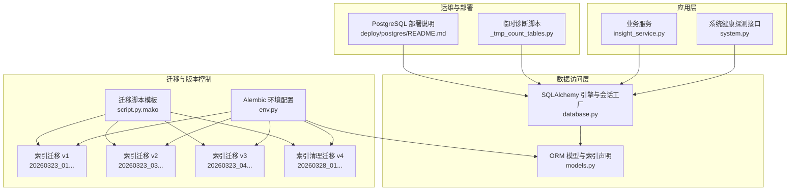
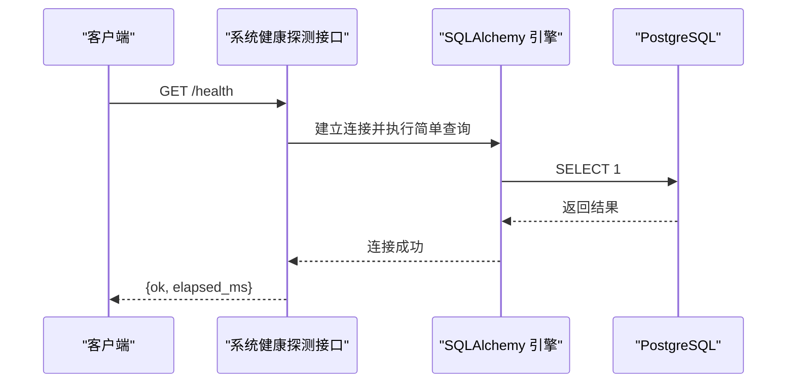
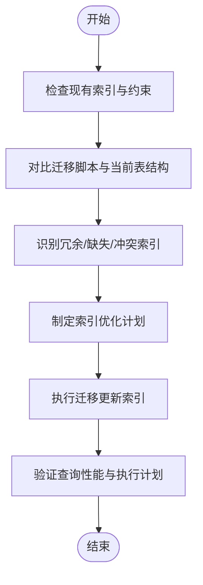
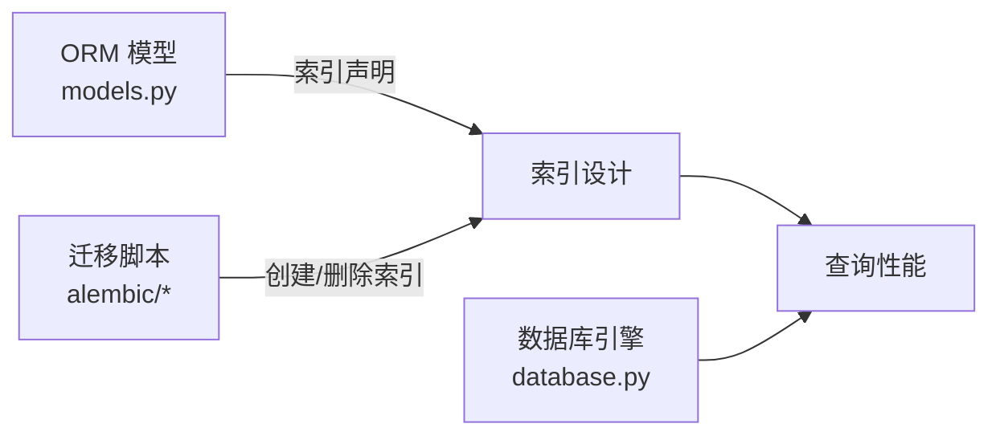

# 索引与性能优化

<cite>
**本文引用的文件**
- [backend/app/core/database.py](file://backend/app/core/database.py)
- [backend/alembic/env.py](file://backend/alembic/env.py)
- [backend/alembic/script.py.mako](file://backend/alembic/script.py.mako)
- [backend/alembic/versions/20260323_01_add_leads_and_customer_lead_id.py](file://backend/alembic/versions/20260323_01_add_leads_and_customer_lead_id.py)
- [backend/alembic/versions/20260323_03_add_inbox_assignment_fields.py](file://backend/alembic/versions/20260323_03_add_inbox_assignment_fields.py)
- [backend/alembic/versions/20260323_04_add_user_wecom_userid.py](file://backend/alembic/versions/20260323_04_add_user_wecom_userid.py)
- [backend/alembic/versions/20260328_01_extend_generation_task_structured_outputs.py](file://backend/alembic/versions/20260328_01_extend_generation_task_structured_outputs.py)
- [backend/app/models/models.py](file://backend/app/models/models.py)
- [backend/app/api/endpoints/system.py](file://backend/app/api/endpoints/system.py)
- [backend/app/services/insight_service.py](file://backend/app/services/insight_service.py)
- [_tmp_count_tables.py](file://_tmp_count_tables.py)
- [deploy/postgres/README.md](file://deploy/postgres/README.md)
</cite>

## 目录
1. [简介](#简介)
2. [项目结构](#项目结构)
3. [核心组件](#核心组件)
4. [架构总览](#架构总览)
5. [详细组件分析](#详细组件分析)
6. [依赖分析](#依赖分析)
7. [性能考量](#性能考量)
8. [故障排查指南](#故障排查指南)
9. [结论](#结论)
10. [附录](#附录)

## 简介
本文件面向“智获客”数据库索引与性能优化，系统梳理现有索引设计、复合索引设计原则、查询优化策略、执行计划与性能分析方法、索引维护与定期优化建议、慢查询识别与解决路径，以及数据库参数调优与硬件配置建议。内容基于仓库中 Alembic 迁移、SQLAlchemy 模型定义、系统健康探测接口与临时诊断脚本等实际代码与配置进行归纳总结。

## 项目结构
- 数据库访问层由 SQLAlchemy 引擎与会话工厂构成，统一连接池与预检测参数，便于后续性能观测与调优。
- Alembic 迁移脚本记录了索引与约束的演进历史，是评估索引有效性与制定优化策略的重要依据。
- SQLAlchemy 模型定义中包含大量显式索引列，为复合索引设计提供了候选键集合。
- 系统健康探测接口可快速验证数据库连通性与延迟，辅助定位性能问题。
- 临时诊断脚本用于统计关键表行数，辅助评估数据规模与查询基数对索引选择的影响。

图表来源
- [backend/app/core/database.py:1-29](file://backend/app/core/database.py#L1-L29)
- [backend/alembic/env.py:1-88](file://backend/alembic/env.py#L1-L88)
- [backend/alembic/script.py.mako:1-25](file://backend/alembic/script.py.mako#L1-L25)
- [backend/alembic/versions/20260323_01_add_leads_and_customer_lead_id.py:1-117](file://backend/alembic/versions/20260323_01_add_leads_and_customer_lead_id.py#L1-L117)
- [backend/alembic/versions/20260323_03_add_inbox_assignment_fields.py:1-56](file://backend/alembic/versions/20260323_03_add_inbox_assignment_fields.py#L1-L56)
- [backend/alembic/versions/20260323_04_add_user_wecom_userid.py:1-39](file://backend/alembic/versions/20260323_04_add_user_wecom_userid.py#L1-L39)
- [backend/alembic/versions/20260328_01_extend_generation_task_structured_outputs.py:64-88](file://backend/alembic/versions/20260328_01_extend_generation_task_structured_outputs.py#L64-L88)
- [backend/app/models/models.py:1-800](file://backend/app/models/models.py#L1-L800)
- [backend/app/api/endpoints/system.py:39-76](file://backend/app/api/endpoints/system.py#L39-L76)
- [deploy/postgres/README.md:1-1](file://deploy/postgres/README.md#L1-L1)
- [_tmp_count_tables.py:1-52](file://_tmp_count_tables.py#L1-L52)

章节来源
- [backend/app/core/database.py:1-29](file://backend/app/core/database.py#L1-L29)
- [backend/alembic/env.py:1-88](file://backend/alembic/env.py#L1-L88)
- [backend/alembic/script.py.mako:1-25](file://backend/alembic/script.py.mako#L1-L25)
- [backend/app/models/models.py:1-800](file://backend/app/models/models.py#L1-L800)
- [backend/app/api/endpoints/system.py:39-76](file://backend/app/api/endpoints/system.py#L39-L76)
- [deploy/postgres/README.md:1-1](file://deploy/postgres/README.md#L1-L1)
- [_tmp_count_tables.py:1-52](file://_tmp_count_tables.py#L1-L52)

## 核心组件
- 数据库引擎与连接池
  - 使用 SQLAlchemy 创建带连接池与 pre_ping 的引擎，便于在高并发下保持连接可用性与稳定性。
  - 连接池大小与溢出参数可作为性能调优的切入点。
- Alembic 迁移与索引演进
  - 通过迁移脚本记录索引创建、删除与变更，形成索引演进轨迹，支撑回溯与审计。
- ORM 模型中的索引声明
  - 多张表在主键或外键上声明索引，同时存在唯一索引与部分条件过滤字段的索引，为复合索引设计提供候选键。
- 系统健康探测
  - 提供数据库连通性探测与耗时统计，可用于快速定位连接层与网络层问题。

章节来源
- [backend/app/core/database.py:1-29](file://backend/app/core/database.py#L1-L29)
- [backend/alembic/env.py:1-88](file://backend/alembic/env.py#L1-L88)
- [backend/app/models/models.py:1-800](file://backend/app/models/models.py#L1-L800)
- [backend/app/api/endpoints/system.py:39-76](file://backend/app/api/endpoints/system.py#L39-L76)

## 架构总览
下图展示数据库访问链路与索引相关的关键节点，包括模型定义、迁移演进与健康探测。

图表来源
- [backend/app/api/endpoints/system.py:39-76](file://backend/app/api/endpoints/system.py#L39-L76)
- [backend/app/core/database.py:1-29](file://backend/app/core/database.py#L1-L29)

## 详细组件分析

### 索引演进与现状
- 用户表
  - 唯一索引：用户名、邮箱、企业微信标识；唯一索引有助于去重与高效查找。
  - 唯一索引场景：登录凭据与外部身份标识的快速检索。
- 邮件收集与素材流程相关表
  - 多处对 owner_id、平台、来源、状态、风险、重复标记等字段建立索引，支撑筛选与聚合。
  - 材料入库表存在唯一约束组合，避免重复录入。
- 任务与工单相关表
  - 对任务状态、分配人、截止时间等字段建立索引，满足工作流查询与调度需求。
- 生成任务表
  - 曾存在若干单列索引，在某次迁移中被清理，体现了对冗余索引的治理。

图表来源
- [backend/alembic/versions/20260323_01_add_leads_and_customer_lead_id.py:72-77](file://backend/alembic/versions/20260323_01_add_leads_and_customer_lead_id.py#L72-L77)
- [backend/alembic/versions/20260323_03_add_inbox_assignment_fields.py:25](file://backend/alembic/versions/20260323_03_add_inbox_assignment_fields.py#L25)
- [backend/alembic/versions/20260323_04_add_user_wecom_userid.py:25](file://backend/alembic/versions/20260323_04_add_user_wecom_userid.py#L25)
- [backend/alembic/versions/20260328_01_extend_generation_task_structured_outputs.py:70-73](file://backend/alembic/versions/20260328_01_extend_generation_task_structured_outputs.py#L70-L73)

章节来源
- [backend/alembic/versions/20260323_01_add_leads_and_customer_lead_id.py:72-77](file://backend/alembic/versions/20260323_01_add_leads_and_customer_lead_id.py#L72-L77)
- [backend/alembic/versions/20260323_03_add_inbox_assignment_fields.py:25](file://backend/alembic/versions/20260323_03_add_inbox_assignment_fields.py#L25)
- [backend/alembic/versions/20260323_04_add_user_wecom_userid.py:25](file://backend/alembic/versions/20260323_04_add_user_wecom_userid.py#L25)
- [backend/alembic/versions/20260328_01_extend_generation_task_structured_outputs.py:70-73](file://backend/alembic/versions/20260328_01_extend_generation_task_structured_outputs.py#L70-L73)

### 复合索引设计原则与应用场景
- 前缀匹配与选择性
  - 优先选择高选择性的列作为前导列，减少回表与扫描范围。
  - 在过滤条件中频繁出现的列组合应考虑复合索引。
- 覆盖查询
  - 将查询所需的列纳入索引（包含列），避免回表，显著降低 IO。
- 排序与范围
  - ORDER BY 与 BETWEEN/GIN/BTREE 等范围操作应遵循最左前缀原则。
- 更新频率与写压力
  - 高频写入场景需谨慎增加索引数量，平衡写放大与读优化。
- 实战示例（基于模型与迁移）
  - 材料入库表：唯一约束组合包含 owner_id、platform、source_id，适合对该三元组建立复合索引以加速去重与筛选。
  - 素材与内容表：对 platform、source_id、status、risk_status 等字段建立索引，适合在多条件过滤场景使用复合索引。
  - 任务表：对 owner_id、status、due_time 等字段建立复合索引，满足工作流查询与调度。

章节来源
- [backend/app/models/models.py:462-464](file://backend/app/models/models.py#L462-L464)
- [backend/app/models/models.py:474-489](file://backend/app/models/models.py#L474-L489)
- [backend/app/models/models.py:600-629](file://backend/app/models/models.py#L600-L629)
- [backend/app/models/models.py:296-311](file://backend/app/models/models.py#L296-L311)

### 查询优化策略与执行计划分析
- 使用 EXPLAIN/EXPLAIN ANALYZE
  - 在开发与测试环境对关键查询执行计划进行分析，关注以下指标：
    - 执行时间与总成本
    - 是否发生全表扫描或索引扫描
    - 是否发生隐式类型转换导致索引失效
    - 是否发生排序或哈希聚合
- 常见优化手段
  - 将高选择性列前置构建复合索引
  - 使用覆盖索引减少回表
  - 避免在索引列上使用函数或表达式
  - 控制返回列数量，避免 SELECT *
  - 使用 LIMIT 限制结果集
- 示例查询路径
  - 爆款洞察服务中对内容项的筛选与排序，涉及 owner_id、platform、ai_analyzed、audience_tags 等字段，适合通过复合索引与覆盖索引优化。

章节来源
- [backend/app/services/insight_service.py:566-594](file://backend/app/services/insight_service.py#L566-L594)

### 索引维护策略与定期优化建议
- 定期审计
  - 使用迁移脚本与数据库元数据对比，识别冗余索引与缺失索引。
  - 对长期未使用的索引进行清理，降低写放大。
- 性能回归监控
  - 通过系统健康探测接口的耗时阈值变化，发现潜在性能退化。
- 数据增长与热点变化
  - 随着数据规模增长，重新评估索引选择性与存储成本，必要时调整索引策略。
- 迁移与灰度
  - 新索引上线前在灰度环境验证，确保不会引入新的锁等待或长事务。

章节来源
- [backend/app/api/endpoints/system.py:39-76](file://backend/app/api/endpoints/system.py#L39-L76)
- [backend/alembic/versions/20260328_01_extend_generation_task_structured_outputs.py:70-73](file://backend/alembic/versions/20260328_01_extend_generation_task_structured_outputs.py#L70-L73)

### 慢查询识别与解决方案
- 识别
  - 通过系统健康探测接口观察数据库响应时间异常。
  - 使用临时诊断脚本统计关键表行数，评估数据规模对查询的影响。
- 分析
  - 对疑似慢查询执行 EXPLAIN，定位瓶颈（全表扫描、隐式转换、缺少索引）。
- 解决
  - 增设复合索引或覆盖索引
  - 优化 SQL 结构（避免函数包裹索引列、减少不必要的 JOIN）
  - 分页与 LIMIT 控制结果集
  - 将热点查询迁移到只读副本或缓存层

章节来源
- [backend/app/api/endpoints/system.py:39-76](file://backend/app/api/endpoints/system.py#L39-L76)
- [_tmp_count_tables.py:24-31](file://_tmp_count_tables.py#L24-L31)

### 数据库参数调优与硬件配置建议
- 参数调优（通用建议）
  - shared_buffers：设置为系统内存的 25% 左右
  - effective_cache_size：设置为系统内存的 50%-60%
  - work_mem：根据并发与查询复杂度适当增大
  - maintenance_work_mem：用于索引构建与 VACUUM
  - checkpoint_completion_target：提高以降低检查点开销
  - autovacuum：开启并合理配置，避免膨胀
- 硬件配置
  - CPU：多核以支持并发查询与 WAL 写入
  - 内存：充足内存以提升共享缓冲与排序缓存
  - 存储：SSD 优先，RAID 配置需兼顾吞吐与可靠性
  - 网络：低延迟、高带宽，避免成为瓶颈
- 参考文档
  - PostgreSQL 部署与初始化说明可作为参数调优的背景参考。

章节来源
- [deploy/postgres/README.md:1-1](file://deploy/postgres/README.md#L1-L1)

## 依赖分析
- 模型与索引
  - 模型定义中声明的索引列与唯一约束为复合索引设计提供候选键。
- 迁移与索引演进
  - Alembic 迁移脚本记录了索引的创建与清理，形成可追溯的索引演进轨迹。
- 访问层与性能
  - 引擎参数（连接池、pre_ping）影响连接可用性与整体性能表现。

图表来源
- [backend/app/models/models.py:1-800](file://backend/app/models/models.py#L1-L800)
- [backend/alembic/env.py:1-88](file://backend/alembic/env.py#L1-L88)
- [backend/app/core/database.py:1-29](file://backend/app/core/database.py#L1-L29)

章节来源
- [backend/app/models/models.py:1-800](file://backend/app/models/models.py#L1-L800)
- [backend/alembic/env.py:1-88](file://backend/alembic/env.py#L1-L88)
- [backend/app/core/database.py:1-29](file://backend/app/core/database.py#L1-L29)

## 性能考量
- 连接池与预热
  - 合理设置连接池大小与溢出参数，避免高并发下的连接争用。
- 写放大控制
  - 减少冗余索引，避免频繁重建；批量写入时合并事务。
- 统计信息与计划器
  - 定期更新统计信息，保证查询计划器做出最优决策。
- 监控与告警
  - 健康探测接口可作为基础监控入口，结合数据库内置指标完善告警体系。

## 故障排查指南
- 快速验证
  - 使用系统健康探测接口确认数据库连通性与延迟。
- 行数与规模
  - 使用临时诊断脚本统计关键表行数，评估数据规模对查询的影响。
- 索引一致性
  - 对照迁移脚本与当前表结构，检查索引是否存在缺失或冗余。

章节来源
- [backend/app/api/endpoints/system.py:39-76](file://backend/app/api/endpoints/system.py#L39-L76)
- [_tmp_count_tables.py:24-31](file://_tmp_count_tables.py#L24-L31)

## 结论
通过对模型索引声明、迁移演进与健康探测接口的综合分析，可以形成一套以“高选择性前导列 + 覆盖查询 + 定期审计 + 参数调优”为核心的索引与性能优化方案。建议在灰度环境中验证索引变更效果，并结合数据库参数与硬件配置进行系统性调优，持续监控与回归测试以保障线上稳定性。

## 附录
- 相关实现路径
  - 数据库引擎与会话工厂：[backend/app/core/database.py:1-29](file://backend/app/core/database.py#L1-L29)
  - Alembic 环境配置：[backend/alembic/env.py:1-88](file://backend/alembic/env.py#L1-L88)
  - 迁移脚本模板：[backend/alembic/script.py.mako:1-25](file://backend/alembic/script.py.mako#L1-L25)
  - 用户唯一索引迁移：[backend/alembic/versions/20260323_04_add_user_wecom_userid.py:25](file://backend/alembic/versions/20260323_04_add_user_wecom_userid.py#L25)
  - 材料入库唯一约束：[backend/app/models/models.py:462-464](file://backend/app/models/models.py#L462-L464)
  - 爆款洞察查询示例：[backend/app/services/insight_service.py:566-594](file://backend/app/services/insight_service.py#L566-L594)
  - 临时诊断脚本：[_tmp_count_tables.py:24-31](file://_tmp_count_tables.py#L24-L31)