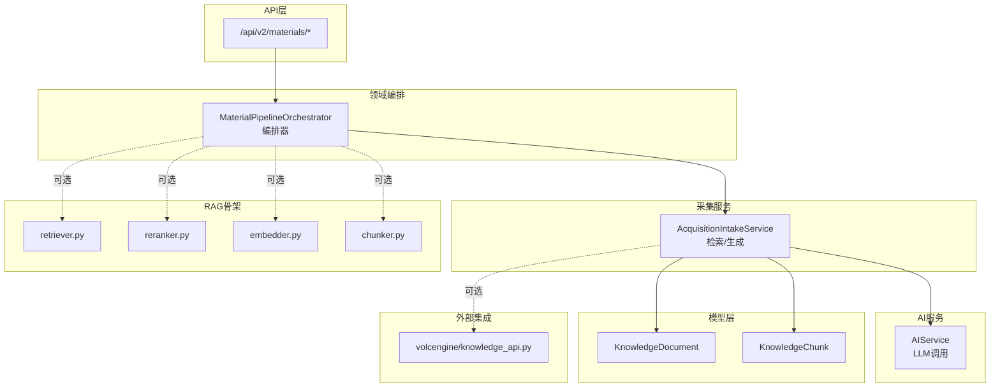
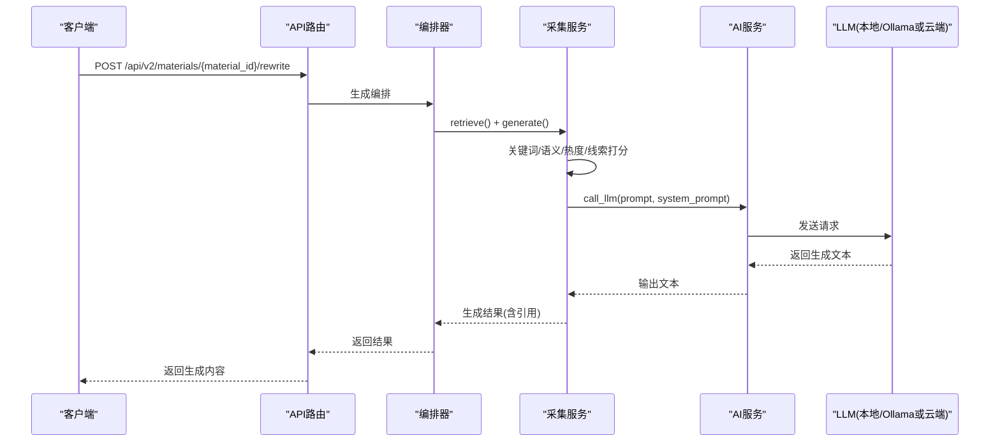
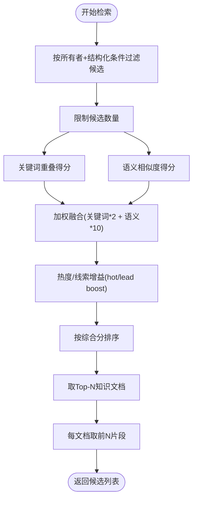
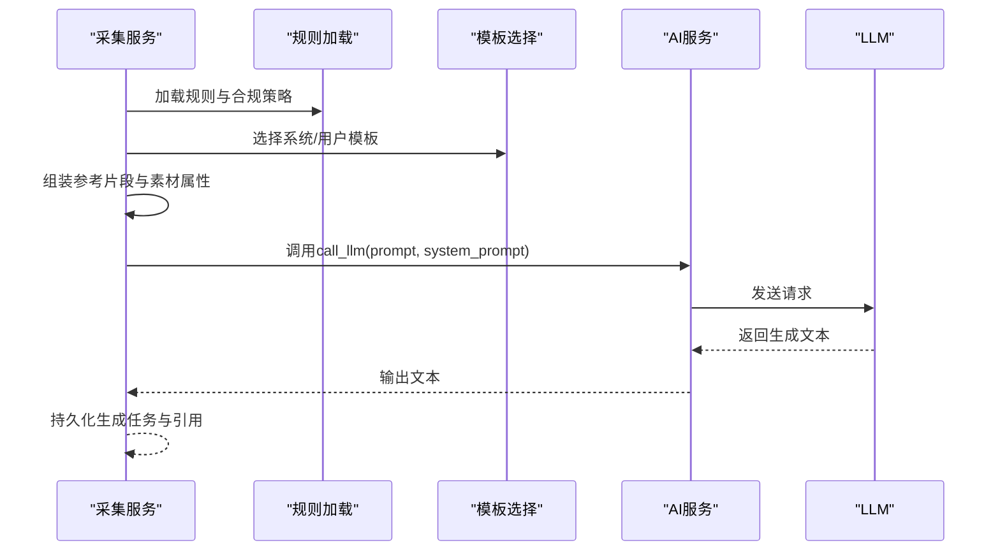
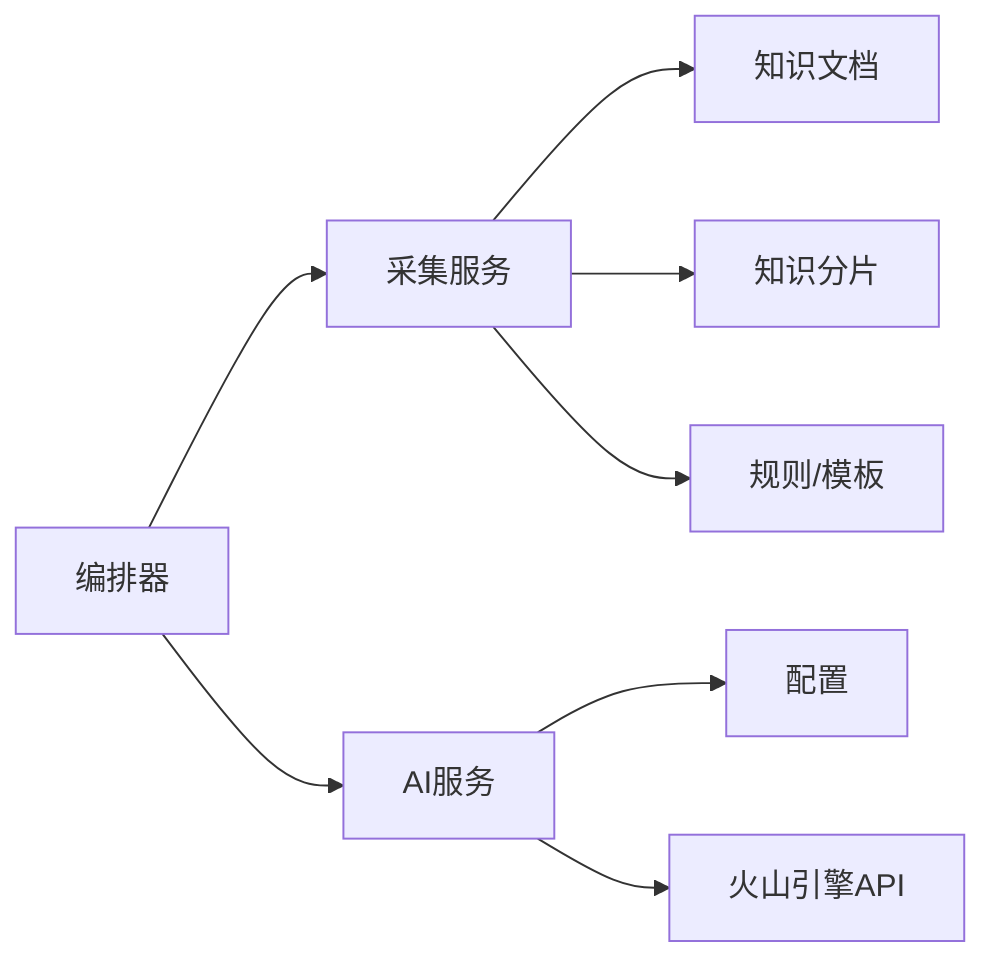

# RAG检索增强生成

<cite>
**本文引用的文件**
- [retriever.py](file://backend/app/ai/rag/retriever.py)
- [reranker.py](file://backend/app/ai/rag/reranker.py)
- [embedder.py](file://backend/app/ai/rag/embedder.py)
- [chunker.py](file://backend/app/ai/rag/chunker.py)
- [ai_service.py](file://backend/app/services/ai_service.py)
- [material_pipeline_service.py](file://backend/app/services/collector/material_pipeline_service.py)
- [orchestrator.py](file://backend/app/domains/acquisition/orchestrator.py)
- [models.py](file://backend/app/models/models.py)
- [knowledge_api.py](file://backend/app/integrations/volcengine/knowledge_api.py)
- [config.py](file://backend/app/core/config.py)
- [materials.py](file://backend/app/api/v2/endpoints/materials.py)
- [material_analyze_v1.txt](file://backend/app/ai/prompts/material_analyze_v1.txt)
</cite>

## 目录
1. [简介](#简介)
2. [项目结构](#项目结构)
3. [核心组件](#核心组件)
4. [架构总览](#架构总览)
5. [组件详解](#组件详解)
6. [依赖关系分析](#依赖关系分析)
7. [性能考量](#性能考量)
8. [故障排查指南](#故障排查指南)
9. [结论](#结论)
10. [附录](#附录)

## 简介
本技术文档围绕“智获客”的RAG（检索增强生成）能力进行系统化梳理，重点解释检索器实现机制（多路召回、混合排序、上下文感知检索）、重排序算法（关键词+语义+热度/线索权重融合）、检索增强生成流程（提示工程、上下文窗口管理、生成质量控制）、性能优化策略（缓存、批处理、并发控制），以及与AI代理系统的协作与动态调整机制。当前仓库中RAG核心模块处于骨架实现阶段，检索与重排序函数返回占位值，但检索生成主链路已在服务层与模型层完整落地，具备扩展为真实向量/交叉编码器的能力。

## 项目结构
RAG相关代码主要分布在以下区域：
- 后端服务层：检索与生成主流程位于采集服务与编排器中
- AI服务层：统一LLM调用入口，支持本地Ollama与火山引擎
- 数据模型层：知识文档与分片模型定义
- API层：对外暴露素材改写与检索生成接口
- RAG骨架模块：检索器、重排序器、嵌入器、分块器（待实现）

图表来源
- [materials.py:260-308](file://backend/app/api/v2/endpoints/materials.py#L260-L308)
- [orchestrator.py:11-174](file://backend/app/domains/acquisition/orchestrator.py#L11-L174)
- [material_pipeline_service.py:1393-1629](file://backend/app/services/collector/material_pipeline_service.py#L1393-L1629)
- [ai_service.py:15-460](file://backend/app/services/ai_service.py#L15-L460)
- [models.py:644-683](file://backend/app/models/models.py#L644-L683)
- [retriever.py:1-3](file://backend/app/ai/rag/retriever.py#L1-L3)
- [reranker.py:1-3](file://backend/app/ai/rag/reranker.py#L1-L3)
- [embedder.py:1-3](file://backend/app/ai/rag/embedder.py#L1-L3)
- [chunker.py:1-3](file://backend/app/ai/rag/chunker.py#L1-L3)
- [knowledge_api.py:1-3](file://backend/app/integrations/volcengine/knowledge_api.py#L1-L3)

章节来源
- [materials.py:260-308](file://backend/app/api/v2/endpoints/materials.py#L260-L308)
- [orchestrator.py:11-174](file://backend/app/domains/acquisition/orchestrator.py#L11-L174)
- [material_pipeline_service.py:1393-1629](file://backend/app/services/collector/material_pipeline_service.py#L1393-L1629)
- [ai_service.py:15-460](file://backend/app/services/ai_service.py#L15-L460)
- [models.py:644-683](file://backend/app/models/models.py#L644-L683)
- [retriever.py:1-3](file://backend/app/ai/rag/retriever.py#L1-L3)
- [reranker.py:1-3](file://backend/app/ai/rag/reranker.py#L1-L3)
- [embedder.py:1-3](file://backend/app/ai/rag/embedder.py#L1-L3)
- [chunker.py:1-3](file://backend/app/ai/rag/chunker.py#L1-L3)
- [knowledge_api.py:1-3](file://backend/app/integrations/volcengine/knowledge_api.py#L1-L3)

## 核心组件
- 编排器（MaterialPipelineOrchestrator）
  - 单一入口，串联“采集→清洗→知识化→检索→生成”全流程
  - 提供手动内容摄入与直接生成两种模式
- 采集服务（AcquisitionIntakeService）
  - 实现检索与生成主流程：关键词+语义+热度/线索权重融合打分，选择Top-N知识片段，拼装提示词并调用LLM
- AI服务（AIService）
  - 统一LLM调用入口，支持本地Ollama与火山引擎（Ark Responses）
  - 提供多场景改写与结构抽取等能力
- 数据模型（KnowledgeDocument/Chunk）
  - 定义知识文档与分片结构，支撑检索候选与片段截取
- RAG骨架模块（retriever/reranker/embedder/chunker）
  - 当前为占位实现，后续可替换为真实向量检索、交叉编码重排序与分块策略

章节来源
- [orchestrator.py:11-174](file://backend/app/domains/acquisition/orchestrator.py#L11-L174)
- [material_pipeline_service.py:1393-1629](file://backend/app/services/collector/material_pipeline_service.py#L1393-L1629)
- [ai_service.py:15-460](file://backend/app/services/ai_service.py#L15-L460)
- [models.py:644-683](file://backend/app/models/models.py#L644-L683)
- [retriever.py:1-3](file://backend/app/ai/rag/retriever.py#L1-L3)
- [reranker.py:1-3](file://backend/app/ai/rag/reranker.py#L1-L3)
- [embedder.py:1-3](file://backend/app/ai/rag/embedder.py#L1-L3)
- [chunker.py:1-3](file://backend/app/ai/rag/chunker.py#L1-L3)

## 架构总览
RAG生成流程以API为入口，经由编排器调度采集服务，采集服务从知识库检索候选并融合规则与素材属性，构造提示词后调用AI服务生成内容，并持久化生成任务与引用信息。

图表来源
- [materials.py:260-308](file://backend/app/api/v2/endpoints/materials.py#L260-L308)
- [orchestrator.py:97-125](file://backend/app/domains/acquisition/orchestrator.py#L97-L125)
- [material_pipeline_service.py:1571-1629](file://backend/app/services/collector/material_pipeline_service.py#L1571-L1629)
- [ai_service.py:24-61](file://backend/app/services/ai_service.py#L24-L61)

## 组件详解

### 检索器实现机制
- 多路召回
  - 基于所有者维度过滤候选集，优先按平台/账号类型/目标人群结构化过滤，其次回退到仅按平台过滤
  - 限制候选数量上限，避免过度扫描
- 混合排序
  - 关键词重叠得分（词集合交并比）与文本序列相似度（前500字符）加权融合
  - 引入素材热度与线索等级作为额外增益项，提升高价值内容权重
  - 最终综合得分排序并截取Top-N
- 上下文感知检索
  - 依据目标平台、账号类型、目标人群对候选进行结构化筛选，确保检索结果与生成场景匹配
  - 从知识分片中按序选取前若干片段，保证上下文连贯性

图表来源
- [material_pipeline_service.py:1393-1454](file://backend/app/services/collector/material_pipeline_service.py#L1393-L1454)

章节来源
- [material_pipeline_service.py:1393-1454](file://backend/app/services/collector/material_pipeline_service.py#L1393-L1454)

### 重排序算法工作原理
- 当前实现
  - 重排序函数返回原候选项，未做交叉编码或深度重排
- 建议方案
  - 引入交叉编码器对查询-候选对进行细粒度打分
  - 与现有关键词+语义分数融合，形成三阶段打分（粗排关键词/语义→精排交叉编码→重排规则与热度）
  - 对高价值/合规敏感候选施加额外权重

章节来源
- [reranker.py:1-3](file://backend/app/ai/rag/reranker.py#L1-L3)

### 检索增强生成流程控制
- 提示工程
  - 系统提示与用户提示模板按任务类型与平台/账号类型/目标人群动态选择
  - 将素材标题/正文、素材属性（热度/线索等级/原因）、知识参考片段、业务规则等拼装为最终提示
- 上下文窗口管理
  - 从知识分片中截取有限片段，避免超出上下文长度
  - 控制参考片段数量与提示词长度，结合模型上下文上限进行裁剪
- 生成质量控制
  - 规则约束（合规阈值、禁用词）与业务规则（三段式结构、禁止违规承诺等）在生成前注入
  - 通过生成任务持久化输出与引用信息，便于后续采纳与审计

图表来源
- [material_pipeline_service.py:1571-1629](file://backend/app/services/collector/material_pipeline_service.py#L1571-L1629)
- [material_pipeline_service.py:1498-1533](file://backend/app/services/collector/material_pipeline_service.py#L1498-L1533)
- [material_pipeline_service.py:1535-1568](file://backend/app/services/collector/material_pipeline_service.py#L1535-L1568)
- [ai_service.py:24-61](file://backend/app/services/ai_service.py#L24-L61)

章节来源
- [material_pipeline_service.py:1498-1568](file://backend/app/services/collector/material_pipeline_service.py#L1498-L1568)
- [material_pipeline_service.py:1571-1629](file://backend/app/services/collector/material_pipeline_service.py#L1571-L1629)
- [ai_service.py:15-460](file://backend/app/services/ai_service.py#L15-L460)

### 与AI代理系统的协作与动态调整
- 当前状态
  - AI代理模块存在占位实现，尚未接入具体推理逻辑
- 协作关系
  - 编排器可扩展为在生成前后调用不同代理（如合规代理、素材分析代理）进行前置/后置处理
  - 素材分析提示模板可用于引导代理对素材进行结构化抽取与风险识别
- 动态调整机制
  - 通过规则表与模板表实现策略动态下发
  - 生成任务持久化后，支持人工采纳/回滚，形成闭环反馈

章节来源
- [material_agent.py:1-3](file://backend/app/ai/agents/material_agent.py#L1-L3)
- [compliance_agent.py:1-3](file://backend/app/ai/agents/compliance_agent.py#L1-L3)
- [material_analyze_v1.txt:1-1](file://backend/app/ai/prompts/material_analyze_v1.txt#L1-L1)
- [models.py:686-722](file://backend/app/models/models.py#L686-L722)
- [models.py:705-721](file://backend/app/models/models.py#L705-L721)

## 依赖关系分析
- 组件耦合
  - 编排器依赖采集服务与AI服务，采集服务依赖数据库模型与规则/模板
  - AI服务依赖配置与外部模型服务（Ollama/Ark）
- 外部依赖
  - 火山引擎知识检索接口预留（当前返回空列表），可扩展为外部知识库召回
  - Redis用于限流与分布式协调（与RAG解耦）

图表来源
- [orchestrator.py:11-22](file://backend/app/domains/acquisition/orchestrator.py#L11-L22)
- [material_pipeline_service.py:1393-1454](file://backend/app/services/collector/material_pipeline_service.py#L1393-L1454)
- [models.py:644-683](file://backend/app/models/models.py#L644-L683)
- [ai_service.py:15-460](file://backend/app/services/ai_service.py#L15-L460)
- [knowledge_api.py:1-3](file://backend/app/integrations/volcengine/knowledge_api.py#L1-L3)
- [config.py:71-84](file://backend/app/core/config.py#L71-L84)

章节来源
- [orchestrator.py:11-22](file://backend/app/domains/acquisition/orchestrator.py#L11-L22)
- [material_pipeline_service.py:1393-1454](file://backend/app/services/collector/material_pipeline_service.py#L1393-L1454)
- [models.py:644-683](file://backend/app/models/models.py#L644-L683)
- [ai_service.py:15-460](file://backend/app/services/ai_service.py#L15-L460)
- [knowledge_api.py:1-3](file://backend/app/integrations/volcengine/knowledge_api.py#L1-L3)
- [config.py:71-84](file://backend/app/core/config.py#L71-L84)

## 性能考量
- 检索性能
  - 限制候选数量与分页扫描，避免全表扫描
  - 使用结构化过滤减少无关文档参与打分
- 生成性能
  - 控制参考片段数量与提示词长度，避免超上下文
  - 采用异步调用LLM，设置合理超时与重试
- 缓存与批处理
  - 可在采集服务层对热点查询/规则/模板进行缓存
  - 批量生成任务可合并提交，降低外部调用次数
- 并发控制
  - 利用Redis限流与队列化任务，避免模型侧过载
  - 对外部API（如Ark）设置并发上限与退避策略

## 故障排查指南
- LLM调用失败
  - 检查Ollama/Ark配置是否正确，网络连通性与鉴权
  - 查看日志中的请求ID与耗时，定位异常响应
- 检索无结果
  - 确认结构化过滤参数（平台/账号类型/目标人群）是否与知识库一致
  - 检查候选数量限制与回退逻辑
- 生成内容质量不佳
  - 核对规则与模板是否正确加载
  - 检查参考片段截取是否合理，提示词是否过长

章节来源
- [ai_service.py:132-239](file://backend/app/services/ai_service.py#L132-L239)
- [material_pipeline_service.py:1393-1454](file://backend/app/services/collector/material_pipeline_service.py#L1393-L1454)
- [config.py:71-84](file://backend/app/core/config.py#L71-L84)

## 结论
当前智获客RAG能力以“骨架模块+完整主链路”的方式落地：检索与重排序函数为占位实现，但检索生成主流程已在采集服务与编排器中完整实现，具备良好的扩展性。建议下一步优先补齐RAG骨架模块（向量检索、交叉编码重排序、分块策略），并在现有规则/模板基础上完善合规与质量控制，逐步接入外部知识库与AI代理系统，形成可演进的智能内容生产体系。

## 附录
- API端点
  - 素材改写：POST /api/v2/materials/{material_id}/rewrite
  - 入料并改写：POST /api/v2/materials/ingest-and-rewrite
- 关键模型
  - 知识文档：包含平台/账号类型/目标人群/主题/标题/摘要/正文等字段
  - 知识分片：按chunk_index排序，存储分块文本与关键词

章节来源
- [materials.py:260-308](file://backend/app/api/v2/endpoints/materials.py#L260-L308)
- [models.py:644-683](file://backend/app/models/models.py#L644-L683)