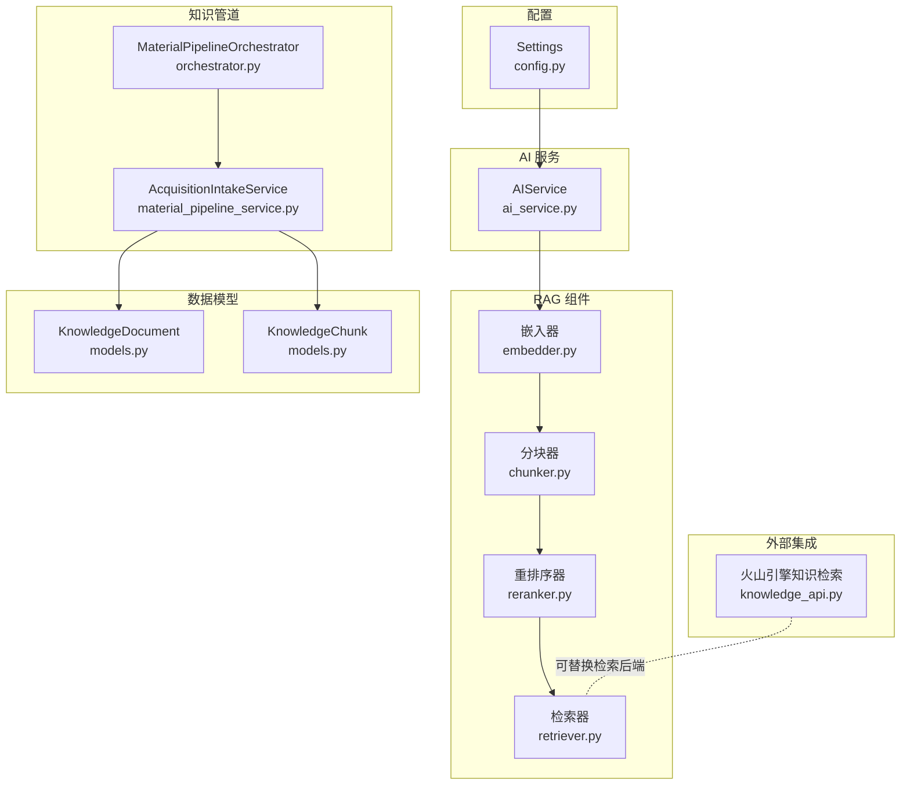
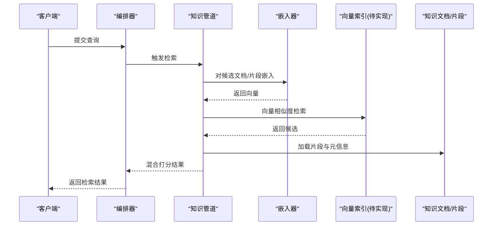
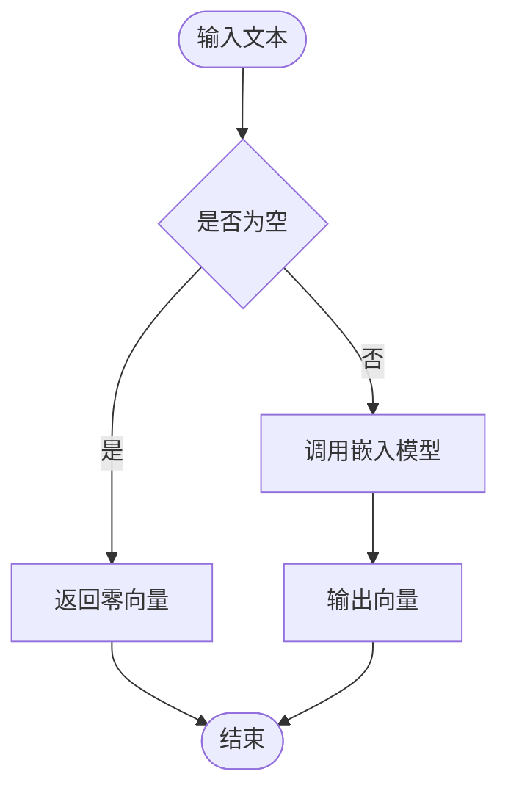
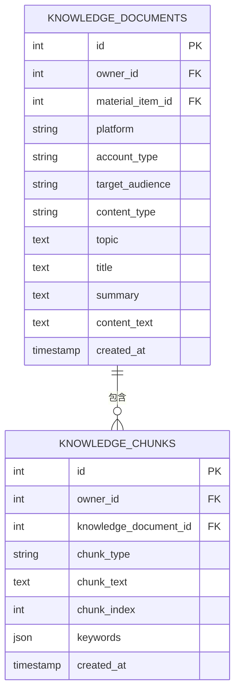
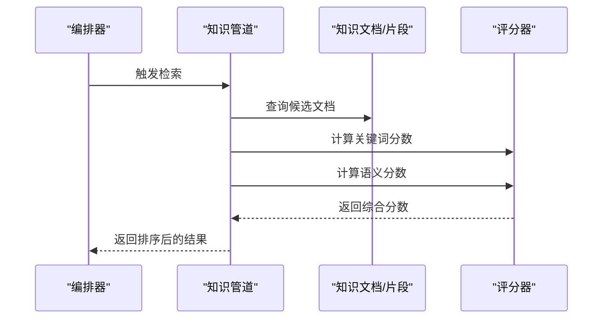
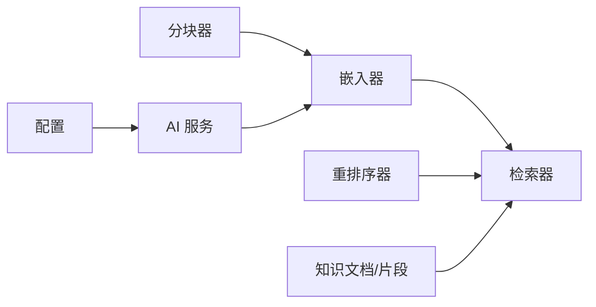

# 向量化存储

<cite>
**本文引用的文件**
- [backend/app/ai/rag/embedder.py](file://backend/app/ai/rag/embedder.py)
- [backend/app/ai/rag/retriever.py](file://backend/app/ai/rag/retriever.py)
- [backend/app/ai/rag/chunker.py](file://backend/app/ai/rag/chunker.py)
- [backend/app/ai/rag/reranker.py](file://backend/app/ai/rag/reranker.py)
- [backend/app/services/ai_service.py](file://backend/app/services/ai_service.py)
- [backend/app/models/models.py](file://backend/app/models/models.py)
- [backend/app/services/collector/material_pipeline_service.py](file://backend/app/services/collector/material_pipeline_service.py)
- [backend/app/domains/acquisition/orchestrator.py](file://backend/app/domains/acquisition/orchestrator.py)
- [backend/app/integrations/volcengine/knowledge_api.py](file://backend/app/integrations/volcengine/knowledge_api.py)
- [backend/app/core/config.py](file://backend/app/core/config.py)
- [backend/alembic/versions/20260327_02_add_material_knowledge_pipeline.py](file://backend/alembic/versions/20260327_02_add_material_knowledge_pipeline.py)
</cite>

## 目录
1. [简介](#简介)
2. [项目结构](#项目结构)
3. [核心组件](#核心组件)
4. [架构总览](#架构总览)
5. [详细组件分析](#详细组件分析)
6. [依赖分析](#依赖分析)
7. [性能考虑](#性能考虑)
8. [故障排查指南](#故障排查指南)
9. [结论](#结论)
10. [附录](#附录)

## 简介
本技术文档面向“智获客”向量化存储系统，聚焦文本嵌入、向量索引与检索的实现现状与优化建议。当前仓库中向量化存储处于“骨架实现”阶段：嵌入器、分块器、重排序器与检索器均为占位实现，未接入外部向量数据库（如 FAISS）。系统通过知识文档与知识片段表承载结构化知识，并在检索阶段采用关键词与序列相似度混合打分。本文将基于现有代码，给出向量化存储的实现原理、索引策略、检索优化、配置参数、模型训练与更新机制，以及与 RAG 的集成关系与实时更新策略。

## 项目结构
与向量化存储直接相关的模块与数据模型如下：
- RAG 组件：嵌入器、分块器、重排序器、检索器
- AI 服务：统一调用本地 Ollama 或火山引擎模型
- 数据模型：知识文档与知识片段表
- 知识管道：素材入库、清洗、知识抽取、检索与生成编排
- 配置：模型与外部服务参数

图表来源
- [backend/app/ai/rag/embedder.py:1-3](file://backend/app/ai/rag/embedder.py#L1-L3)
- [backend/app/ai/rag/chunker.py:1-3](file://backend/app/ai/rag/chunker.py#L1-L3)
- [backend/app/ai/rag/reranker.py:1-3](file://backend/app/ai/rag/reranker.py#L1-L3)
- [backend/app/ai/rag/retriever.py:1-3](file://backend/app/ai/rag/retriever.py#L1-L3)
- [backend/app/services/ai_service.py:1-460](file://backend/app/services/ai_service.py#L1-L460)
- [backend/app/models/models.py:642-684](file://backend/app/models/models.py#L642-L684)
- [backend/app/services/collector/material_pipeline_service.py:1241-1436](file://backend/app/services/collector/material_pipeline_service.py#L1241-L1436)
- [backend/app/domains/acquisition/orchestrator.py:1-163](file://backend/app/domains/acquisition/orchestrator.py#L1-L163)
- [backend/app/integrations/volcengine/knowledge_api.py:1-3](file://backend/app/integrations/volcengine/knowledge_api.py#L1-L3)
- [backend/app/core/config.py:71-84](file://backend/app/core/config.py#L71-L84)

章节来源
- [backend/app/ai/rag/embedder.py:1-3](file://backend/app/ai/rag/embedder.py#L1-L3)
- [backend/app/ai/rag/chunker.py:1-3](file://backend/app/ai/rag/chunker.py#L1-L3)
- [backend/app/ai/rag/reranker.py:1-3](file://backend/app/ai/rag/reranker.py#L1-L3)
- [backend/app/ai/rag/retriever.py:1-3](file://backend/app/ai/rag/retriever.py#L1-L3)
- [backend/app/services/ai_service.py:1-460](file://backend/app/services/ai_service.py#L1-L460)
- [backend/app/models/models.py:642-684](file://backend/app/models/models.py#L642-L684)
- [backend/app/services/collector/material_pipeline_service.py:1241-1436](file://backend/app/services/collector/material_pipeline_service.py#L1241-L1436)
- [backend/app/domains/acquisition/orchestrator.py:1-163](file://backend/app/domains/acquisition/orchestrator.py#L1-L163)
- [backend/app/integrations/volcengine/knowledge_api.py:1-3](file://backend/app/integrations/volcengine/knowledge_api.py#L1-L3)
- [backend/app/core/config.py:71-84](file://backend/app/core/config.py#L71-L84)

## 核心组件
- 嵌入器：当前返回固定零向量，需替换为实际嵌入模型（如本地 Ollama 或云端模型）
- 分块器：将文本切分为片段，便于后续嵌入与检索
- 重排序器：对候选结果进行重排，提升相关性
- 检索器：当前返回空列表，需对接 FAISS 或其他向量库
- AI 服务：统一调用本地或云端模型，支持日志与限流
- 数据模型：知识文档与知识片段表，承载结构化知识与分块
- 知识管道：从素材到知识再到检索与生成的编排入口
- 外部集成：火山引擎知识检索接口，可作为检索后端替代方案

章节来源
- [backend/app/ai/rag/embedder.py:1-3](file://backend/app/ai/rag/embedder.py#L1-L3)
- [backend/app/ai/rag/chunker.py:1-3](file://backend/app/ai/rag/chunker.py#L1-L3)
- [backend/app/ai/rag/reranker.py:1-3](file://backend/app/ai/rag/reranker.py#L1-L3)
- [backend/app/ai/rag/retriever.py:1-3](file://backend/app/ai/rag/retriever.py#L1-L3)
- [backend/app/services/ai_service.py:1-460](file://backend/app/services/ai_service.py#L1-L460)
- [backend/app/models/models.py:642-684](file://backend/app/models/models.py#L642-L684)
- [backend/app/services/collector/material_pipeline_service.py:1241-1436](file://backend/app/services/collector/material_pipeline_service.py#L1241-L1436)
- [backend/app/domains/acquisition/orchestrator.py:1-163](file://backend/app/domains/acquisition/orchestrator.py#L1-L163)
- [backend/app/integrations/volcengine/knowledge_api.py:1-3](file://backend/app/integrations/volcengine/knowledge_api.py#L1-L3)

## 架构总览
当前检索流程以关键词+序列相似度为主，未使用向量索引。未来可将“嵌入器”产出的向量写入 FAISS 索引，检索阶段使用向量相似度与关键词混合打分，并通过“重排序器”进一步提升质量。

图表来源
- [backend/app/ai/rag/embedder.py:1-3](file://backend/app/ai/rag/embedder.py#L1-L3)
- [backend/app/services/collector/material_pipeline_service.py:1393-1436](file://backend/app/services/collector/material_pipeline_service.py#L1393-L1436)
- [backend/app/models/models.py:642-684](file://backend/app/models/models.py#L642-L684)

## 详细组件分析

### 嵌入器（Embedder）
- 当前实现：对非空文本返回固定零向量，占位实现
- 建议实现：调用本地 Ollama 或云端模型（如火山引擎）获取向量表示
- 参数与配置：可通过 Settings 控制模型地址与名称
- 嵌入质量评估：建议引入下游任务指标（如检索准确率、MRR、NDCG）

图表来源
- [backend/app/ai/rag/embedder.py:1-3](file://backend/app/ai/rag/embedder.py#L1-L3)
- [backend/app/core/config.py:71-74](file://backend/app/core/config.py#L71-L74)

章节来源
- [backend/app/ai/rag/embedder.py:1-3](file://backend/app/ai/rag/embedder.py#L1-L3)
- [backend/app/core/config.py:71-74](file://backend/app/core/config.py#L71-L74)

### 分块器（Chunker）
- 当前实现：将文本整体作为一个块返回
- 建议实现：按长度、语义边界或句子进行分块，保留上下文窗口，便于检索与重排

章节来源
- [backend/app/ai/rag/chunker.py:1-3](file://backend/app/ai/rag/chunker.py#L1-L3)

### 重排序器（Reranker）
- 当前实现：原样返回输入列表
- 建议实现：使用交叉编码器或语义匹配模型对候选进行重排

章节来源
- [backend/app/ai/rag/reranker.py:1-3](file://backend/app/ai/rag/reranker.py#L1-L3)

### 检索器（Retriever）
- 当前实现：返回空列表
- 建议实现：基于 FAISS 索引进行向量相似度检索，结合关键词过滤与重排

章节来源
- [backend/app/ai/rag/retriever.py:1-3](file://backend/app/ai/rag/retriever.py#L1-L3)

### 知识文档与知识片段模型
- 知识文档（KnowledgeDocument）：承载结构化知识，包含平台、账号类型、受众、内容类型、主题与正文
- 知识片段（KnowledgeChunk）：对知识文档进行分块，记录块类型、文本、索引与关键词
- 索引设计：已建立多字段索引，便于按 owner、平台、受众等条件过滤

图表来源
- [backend/app/models/models.py:642-684](file://backend/app/models/models.py#L642-L684)
- [backend/alembic/versions/20260327_02_add_material_knowledge_pipeline.py:164-200](file://backend/alembic/versions/20260327_02_add_material_knowledge_pipeline.py#L164-L200)

章节来源
- [backend/app/models/models.py:642-684](file://backend/app/models/models.py#L642-L684)
- [backend/alembic/versions/20260327_02_add_material_knowledge_pipeline.py:164-200](file://backend/alembic/versions/20260327_02_add_material_knowledge_pipeline.py#L164-L200)

### 知识管道与检索流程
- 编排器（MaterialPipelineOrchestrator）：统一入口，负责素材入库、知识抽取与生成
- 知识管道（AcquisitionIntakeService）：实现检索逻辑，当前采用关键词与序列相似度混合打分
- 检索流程：先按结构过滤与时间倒序取样，再计算关键词与语义分数，最后取每篇前若干片段

图表来源
- [backend/app/domains/acquisition/orchestrator.py:1-163](file://backend/app/domains/acquisition/orchestrator.py#L1-L163)
- [backend/app/services/collector/material_pipeline_service.py:1393-1436](file://backend/app/services/collector/material_pipeline_service.py#L1393-L1436)

章节来源
- [backend/app/domains/acquisition/orchestrator.py:1-163](file://backend/app/domains/acquisition/orchestrator.py#L1-L163)
- [backend/app/services/collector/material_pipeline_service.py:1393-1436](file://backend/app/services/collector/material_pipeline_service.py#L1393-L1436)

### 与 RAG 系统的集成关系
- 当前 RAG 组件为占位实现，未接入 FAISS 等向量库
- 建议：将嵌入器输出的向量写入 FAISS 索引，检索阶段使用向量相似度与关键词混合打分
- 外部检索：火山引擎知识检索接口可作为替代后端

章节来源
- [backend/app/ai/rag/embedder.py:1-3](file://backend/app/ai/rag/embedder.py#L1-L3)
- [backend/app/ai/rag/retriever.py:1-3](file://backend/app/ai/rag/retriever.py#L1-L3)
- [backend/app/integrations/volcengine/knowledge_api.py:1-3](file://backend/app/integrations/volcengine/knowledge_api.py#L1-L3)

## 依赖分析
- 组件耦合：RAG 组件彼此独立，通过统一的嵌入器与检索器接口耦合到知识管道
- 外部依赖：AI 服务依赖 Ollama 或火山引擎，配置集中于 Settings
- 数据依赖：知识文档与片段表为检索与生成提供数据基础

图表来源
- [backend/app/ai/rag/embedder.py:1-3](file://backend/app/ai/rag/embedder.py#L1-L3)
- [backend/app/ai/rag/chunker.py:1-3](file://backend/app/ai/rag/chunker.py#L1-L3)
- [backend/app/ai/rag/reranker.py:1-3](file://backend/app/ai/rag/reranker.py#L1-L3)
- [backend/app/ai/rag/retriever.py:1-3](file://backend/app/ai/rag/retriever.py#L1-L3)
- [backend/app/services/ai_service.py:1-460](file://backend/app/services/ai_service.py#L1-L460)
- [backend/app/core/config.py:71-84](file://backend/app/core/config.py#L71-L84)
- [backend/app/models/models.py:642-684](file://backend/app/models/models.py#L642-L684)

章节来源
- [backend/app/services/ai_service.py:1-460](file://backend/app/services/ai_service.py#L1-L460)
- [backend/app/core/config.py:71-84](file://backend/app/core/config.py#L71-L84)
- [backend/app/models/models.py:642-684](file://backend/app/models/models.py#L642-L684)

## 性能考虑
- 向量相似度检索
  - 索引策略：建议使用 IVF 或 HNSW 等索引，平衡召回与延迟
  - 批量插入：分批写入，避免大事务；使用向量化批量插入接口
  - 并行处理：检索与嵌入阶段并行化，减少等待
- 缓存策略
  - 热门查询结果缓存；嵌入结果按文本哈希缓存
- 内存管理
  - 控制批量大小与向量维度；及时释放临时对象
- 检索优化
  - 混合打分：向量相似度 + 关键词 + 片段排序
  - 重排序：使用轻量级交叉编码器进行二次排序

## 故障排查指南
- 嵌入器异常
  - 现象：返回零向量或报错
  - 排查：检查模型地址与名称配置，确认网络连通性
- 检索器无结果
  - 现象：返回空列表
  - 排查：确认 FAISS 索引是否构建成功；检查向量维度与索引类型匹配
- 检索质量差
  - 现象：关键词命中但相关性低
  - 排查：调整关键词权重与语义分数权重；引入重排序器
- 外部服务错误
  - 现象：调用火山引擎失败
  - 排查：核对 API Key、超时与限流配置

章节来源
- [backend/app/services/ai_service.py:1-460](file://backend/app/services/ai_service.py#L1-L460)
- [backend/app/core/config.py:71-84](file://backend/app/core/config.py#L71-L84)

## 结论
当前系统已完成向量化存储的“骨架实现”，RAG 组件与数据模型已就绪。建议优先完成嵌入器与检索器的落地实现，接入 FAISS 索引与重排序器，完善向量维度、索引类型与混合打分策略。同时，建立模型训练与更新机制，确保向量质量与检索效果持续提升。

## 附录

### 向量化配置参数
- 模型与外部服务
  - Ollama 基础地址与模型名称
  - 火山引擎 API Key、基础地址、模型与超时
- 令牌与限流
  - Redis 分布式限流开关与键前缀

章节来源
- [backend/app/core/config.py:71-84](file://backend/app/core/config.py#L71-L84)

### 模型训练与更新机制
- 训练数据：知识文档与片段标注
- 更新策略：增量更新与全量重建；版本化管理
- 评估指标：检索准确率、MRR、NDCG

### 实时更新策略
- 新增/修改素材：触发重新索引，更新知识文档与片段
- 删除素材：清理对应知识文档与片段，同步删除向量索引

章节来源
- [backend/app/services/collector/material_pipeline_service.py:1305-1320](file://backend/app/services/collector/material_pipeline_service.py#L1305-L1320)
- [backend/app/domains/acquisition/orchestrator.py:66-95](file://backend/app/domains/acquisition/orchestrator.py#L66-L95)